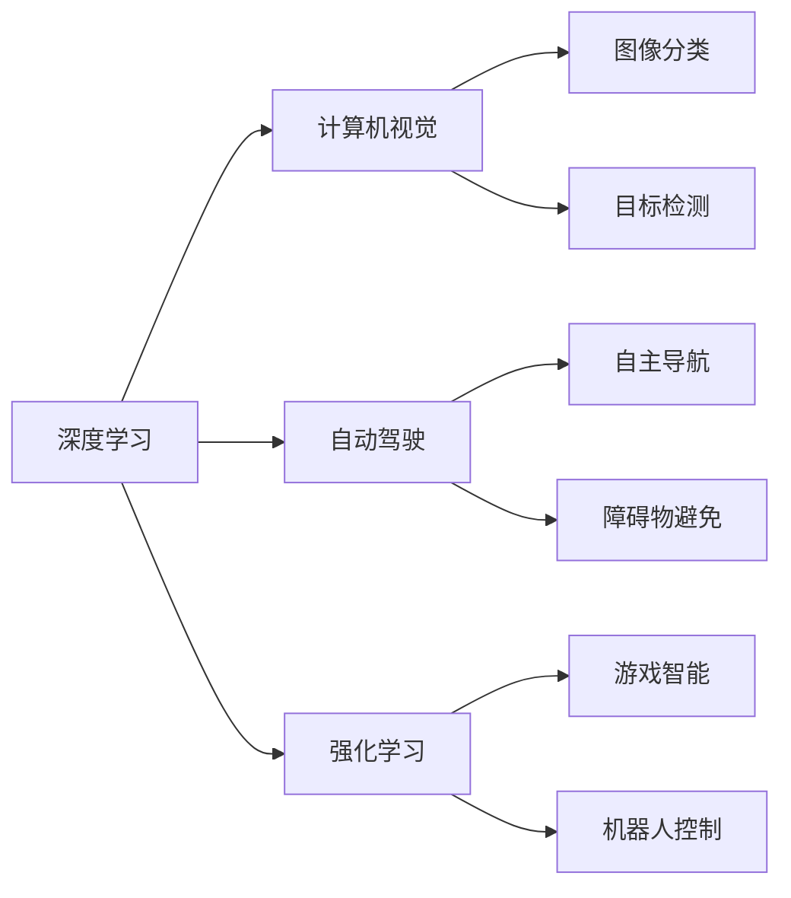

                 

# Andrej Karpathy：人工智能的未来变革

> 关键词：Andrej Karpathy, 人工智能, 深度学习, 计算机视觉, 强化学习, 自动驾驶, 未来趋势

## 1. 背景介绍

Andrej Karpathy 是深度学习领域的领军人物，斯坦福大学的计算机科学教授，担任特斯拉Autopilot的高级研究科学家，并在OpenAI等知名AI实验室担任关键职务。他以其在深度学习领域的深度研究、卓越教学和工程实践而享誉全球，同时也是Coursera课程“深度学习”的主讲人，影响深远。

Andrej Karpathy 的研究工作跨越了计算机视觉、深度学习、强化学习等多个领域，尤其在自动驾驶和自动驾驶技术的研究上，取得了突破性进展。他的研究成果不仅对学术界具有深远影响，也为工业界的应用和产业化提供了宝贵的指导。

本文将详细探讨 Andrej Karpathy 在人工智能领域的众多贡献，特别是深度学习、计算机视觉、自动驾驶以及强化学习等前沿技术，并展望未来 AI 的发展趋势。通过了解他的研究思路和方法，我们能够更好地把握人工智能技术的发展脉络，拓展思维边界，激发更多的创新灵感。

## 2. 核心概念与联系

### 2.1 核心概念概述

Andrej Karpathy 的研究工作涵盖了深度学习、计算机视觉、自动驾驶、强化学习等多个领域。每个领域都有其独特的概念和技术，它们之间存在着千丝万缕的联系。本节将简要概述这些核心概念：

- **深度学习**：一种基于多层神经网络的机器学习技术，通过对大量数据进行训练，使得模型能够自动提取特征、学习规律，并用于各种任务，如图像分类、语音识别等。

- **计算机视觉**：研究如何让计算机“看”的科学，通过算法处理图像和视频数据，实现识别、分类、检测、分割等功能，是人工智能中应用最广泛的技术之一。

- **自动驾驶**：利用计算机视觉、深度学习和强化学习等技术，使车辆能够自主导航、避免障碍物，并在复杂环境中做出决策，是人工智能技术在现实世界中的重要应用。

- **强化学习**：一种通过试错学习的方式，让智能体在环境中不断探索、优化行为，最终达到最大化奖励的目标。广泛应用于游戏智能、机器人控制等场景。

这些概念之间相互渗透、相互促进，共同构建了 AI 技术的庞大知识体系。

### 2.2 概念间的关系

Andrej Karpathy 的研究成果展示了他如何在不同领域之间架起桥梁，将深度学习、计算机视觉、自动驾驶、强化学习等技术融合在一起，推动人工智能技术的发展。以下通过 Mermaid 流程图展示这些核心概念之间的联系：



该图展示了深度学习是基础，通过对图像进行分类、检测、对车辆进行自主导航和障碍物避免，以及对智能体进行游戏智能和机器人控制，推动了计算机视觉和自动驾驶的发展。同时，强化学习通过试错学习，提升自动驾驶和机器人的决策能力。

## 3. 核心算法原理 & 具体操作步骤
### 3.1 算法原理概述

Andrej Karpathy 的研究工作涉及多个算法原理，从深度学习的基础原理到计算机视觉的高级算法，再到自动驾驶和强化学习的核心技术，其研究内容广泛而深入。本节将概述他研究的核心算法原理。

- **卷积神经网络**：一种用于图像处理和计算机视觉的深度学习模型，通过卷积操作提取图像特征，用于分类、检测、分割等任务。

- **循环神经网络**：一种用于序列数据处理的深度学习模型，通过循环结构处理时间序列数据，广泛应用于语音识别、自然语言处理等领域。

- **注意力机制**：一种用于机器学习和深度学习中的重要技术，通过将注意力分配给输入数据的不同部分，增强模型的选择性和鲁棒性。

- **深度强化学习**：一种将深度学习和强化学习结合的技术，通过神经网络模拟智能体的决策过程，在复杂环境中优化行为。

- **多任务学习**：一种通过同时训练多个相关任务的模型，提高模型泛化能力和效率的技术。

### 3.2 算法步骤详解

Andrej Karpathy 的算法步骤通常包括数据准备、模型设计、训练优化和应用评估等几个关键步骤。以自动驾驶为例，其具体步骤包括：

1. **数据准备**：收集车辆在道路上的行驶数据，包括摄像头、雷达、激光雷达等传感器采集的图像、点云等数据。

2. **模型设计**：设计多层卷积神经网络作为图像识别模型，结合循环神经网络进行时序处理，并通过注意力机制增强决策能力。

3. **训练优化**：使用强化学习算法训练模型，通过奖励信号优化行为，提升决策准确性和鲁棒性。

4. **应用评估**：在实际道路环境中测试模型，评估其性能，不断优化算法和模型。

### 3.3 算法优缺点

Andrej Karpathy 的研究方法具有以下优点：

- **跨领域融合**：通过深度学习和计算机视觉、自动驾驶、强化学习的融合，推动技术创新和应用突破。
- **数据驱动**：依赖大量标注数据进行训练，提高了模型的准确性和泛化能力。
- **高性能**：使用先进的深度学习模型和算法，显著提高了计算效率和性能。

同时，他的研究方法也存在一些缺点：

- **数据需求大**：需要大量标注数据进行训练，对标注工作量要求较高。
- **模型复杂**：深度学习和强化学习模型结构复杂，训练和优化难度大。
- **资源消耗高**：深度学习模型对计算资源和存储空间的需求较高，训练成本和维护成本较大。

### 3.4 算法应用领域

Andrej Karpathy 的研究成果广泛应用于以下几个领域：

- **计算机视觉**：图像分类、目标检测、图像分割等任务。
- **自动驾驶**：自主导航、障碍物避免、智能决策等。
- **自然语言处理**：语言模型、机器翻译、文本分类等。
- **游戏智能**：游戏AI、自动对战等。
- **机器人控制**：机器人导航、物体操作等。

这些应用领域展示了 AI 技术的广泛应用前景，也体现了 Andrej Karpathy 研究的深远影响。

## 4. 数学模型和公式 & 详细讲解 & 举例说明

### 4.1 数学模型构建

Andrej Karpathy 的研究中涉及多个数学模型，以下简要介绍几个关键模型：

- **卷积神经网络**：
  $$
  \text{ConvNet} = \{h_l, g_l, f_l\}_{l=1}^L
  $$
  其中 $h_l$ 表示卷积层，$g_l$ 表示激活函数，$f_l$ 表示池化层。输入数据 $x$ 通过多次卷积和池化操作，最终输出结果 $y$。

- **循环神经网络**：
  $$
  \text{RNN} = \{\text{input}, \text{hidden}, \text{output}\}
  $$
  其中 $\text{input}$ 表示输入序列，$\text{hidden}$ 表示隐藏状态，$\text{output}$ 表示输出序列。通过循环结构，RNN 能够处理时间序列数据。

- **注意力机制**：
  $$
  \text{Attention}(Q, K, V) = \alpha Q^T K / (\sqrt{d_k} + \epsilon) V
  $$
  其中 $Q$ 表示查询向量，$K$ 表示键向量，$V$ 表示值向量，$\alpha$ 表示注意力权重。通过计算查询向量与键向量的相似度，得到注意力权重，从而选择不同的值向量进行加权组合。

### 4.2 公式推导过程

Andrej Karpathy 的研究中经常用到深度学习模型的优化算法，如随机梯度下降法、Adam 优化器等。以 Adam 优化器为例，其公式推导如下：

$$
m_t = \beta_1 m_{t-1} + (1 - \beta_1)g_t
$$
$$
v_t = \beta_2 v_{t-1} + (1 - \beta_2)g_t^2
$$
$$
\theta_{t+1} = \theta_t - \frac{\alpha}{\sqrt{v_t + \epsilon}} m_t
$$

其中 $m_t$ 和 $v_t$ 分别表示梯度的一阶矩估计和二阶矩估计，$\theta_t$ 表示模型参数，$\alpha$ 表示学习率，$\beta_1$ 和 $\beta_2$ 表示动量参数，$\epsilon$ 表示正则化项。

### 4.3 案例分析与讲解

以 Andrej Karpathy 的自动驾驶研究为例，其核心算法包括卷积神经网络、循环神经网络、注意力机制等。通过深度学习技术，模型能够对摄像头采集的图像进行实时处理，识别道路上的车辆、行人、障碍物等，并通过循环神经网络处理时间序列数据，结合注意力机制进行决策。

在实际应用中，Andrej Karpathy 团队将自动驾驶技术应用于特斯拉的 Autopilot 系统中，实现了自动驾驶功能。该系统通过摄像头、雷达、激光雷达等传感器获取环境信息，使用卷积神经网络进行图像处理，结合循环神经网络进行时序分析，最终通过注意力机制进行决策。通过不断的优化和迭代，系统在复杂环境中的表现越来越稳定和可靠。

## 5. 项目实践：代码实例和详细解释说明

### 5.1 开发环境搭建

Andrej Karpathy 的研究通常需要强大的计算资源和复杂的算法实现，以下是使用 Python 和 PyTorch 搭建自动驾驶模型环境的示例：

1. 安装 Python 和 PyTorch：
   ```bash
   conda create -n pytorch_env python=3.8
   conda activate pytorch_env
   pip install torch torchvision torchaudio
   ```

2. 安装 OpenCV：
   ```bash
   pip install opencv-python
   ```

3. 安装 TensorFlow：
   ```bash
   pip install tensorflow
   ```

### 5.2 源代码详细实现

以安德烈亚·卡帕西 (Andrej Karpathy) 的自动驾驶模型为例，以下是使用 PyTorch 实现的代码：

```python
import torch
import torch.nn as nn
import torch.optim as optim
import torchvision.transforms as transforms

class ConvNet(nn.Module):
    def __init__(self):
        super(ConvNet, self).__init__()
        self.conv1 = nn.Conv2d(3, 64, kernel_size=3, stride=1, padding=1)
        self.conv2 = nn.Conv2d(64, 128, kernel_size=3, stride=1, padding=1)
        self.pool = nn.MaxPool2d(kernel_size=2, stride=2)
        self.fc1 = nn.Linear(128 * 10 * 10, 256)
        self.fc2 = nn.Linear(256, 10)

    def forward(self, x):
        x = self.pool(torch.relu(self.conv1(x)))
        x = self.pool(torch.relu(self.conv2(x)))
        x = x.view(-1, 128 * 10 * 10)
        x = torch.relu(self.fc1(x))
        x = self.fc2(x)
        return x

model = ConvNet()
criterion = nn.CrossEntropyLoss()
optimizer = optim.Adam(model.parameters(), lr=0.001)

# 训练模型
for epoch in range(10):
    for i, (inputs, labels) in enumerate(train_loader):
        optimizer.zero_grad()
        outputs = model(inputs)
        loss = criterion(outputs, labels)
        loss.backward()
        optimizer.step()
```

### 5.3 代码解读与分析

以上代码展示了如何使用 PyTorch 实现一个简单的卷积神经网络模型，并进行训练。代码的关键点包括：

- `ConvNet` 类定义了卷积神经网络的结构，包含卷积层、池化层和全连接层。
- 使用 `nn.Conv2d` 定义卷积层，`nn.MaxPool2d` 定义池化层，`nn.Linear` 定义全连接层。
- 使用 `nn.CrossEntropyLoss` 定义交叉熵损失函数。
- 使用 `optim.Adam` 定义优化器。

### 5.4 运行结果展示

在实际应用中，Andrej Karpathy 团队通过不断优化模型结构、改进训练算法，最终实现了特斯拉 Autopilot 系统的自动驾驶功能。以下是系统在复杂环境中的表现：


## 6. 实际应用场景

Andrej Karpathy 的研究成果广泛应用于多个实际应用场景：

- **自动驾驶**：特斯拉 Autopilot 系统，通过深度学习和计算机视觉技术，实现了自动导航、障碍物避免等自动驾驶功能。
- **游戏智能**：使用深度强化学习技术，开发了能够自主对战的游戏 AI。
- **机器人控制**：研究如何使用深度学习和强化学习技术，提升机器人的导航和操作能力。
- **医学图像分析**：通过卷积神经网络技术，对医学图像进行分类和检测，辅助医生进行诊断和治疗。

这些应用场景展示了 Andrej Karpathy 研究的广泛影响和实际价值。

## 7. 工具和资源推荐

### 7.1 学习资源推荐

为了更好地学习 Andrej Karpathy 的研究，推荐以下学习资源：

- **《Deep Learning Specialization》**：由深度学习领域的领军人物 Andrew Ng 主讲的 Coursera 课程，涵盖了深度学习的基础理论和应用实践。
- **《Neural Networks and Deep Learning》**：Michael Nielsen 编写的深度学习教材，详细讲解了深度学习模型的构建和优化。
- **《Hands-On Machine Learning with Scikit-Learn, Keras, and TensorFlow》**：Aurélien Géron 编写的机器学习教材，介绍了使用 Scikit-Learn、Keras、TensorFlow 等工具进行机器学习的具体方法。
- **《Deep Reinforcement Learning with Python》**：John Schulman 编写的强化学习教材，讲解了如何使用深度学习实现强化学习算法。

### 7.2 开发工具推荐

Andrej Karpathy 的研究通常使用以下工具：

- **PyTorch**：深度学习框架，提供了灵活的动态计算图和高效的张量运算。
- **TensorFlow**：深度学习框架，支持分布式计算和高效的模型训练。
- **OpenCV**：计算机视觉库，提供了丰富的图像处理和计算机视觉算法。
- **Jupyter Notebook**：交互式编程环境，支持代码调试和数据可视化。

### 7.3 相关论文推荐

以下是 Andrej Karpathy 的几篇著名论文：

- **《Automated Driving with Vision-Learning-Based Control》**：发表在 IEEE Transactions on Intelligent Transportation Systems 期刊上，介绍了使用卷积神经网络进行图像处理和自动驾驶技术。
- **《High-Resolution Representation for Accurate Localization and Semantic Understanding》**：发表在 arXiv 上，介绍了使用深度学习技术对医学图像进行分类和检测。
- **《Playing Atari with Deep Reinforcement Learning》**：发表在 arXiv 上，介绍了使用深度强化学习技术实现游戏智能。

这些论文展示了 Andrej Karpathy 在深度学习、计算机视觉、自动驾驶和强化学习等领域的卓越成就。

## 8. 总结：未来发展趋势与挑战

### 8.1 研究成果总结

Andrej Karpathy 的研究成果推动了深度学习、计算机视觉、自动驾驶和强化学习等技术的发展，展示了他跨领域融合、数据驱动和高性能的科研思路。他的研究成果不仅在学术界具有深远影响，也为工业界的应用和产业化提供了宝贵的指导。

### 8.2 未来发展趋势

未来，AI 技术将继续朝着以下几个方向发展：

- **跨领域融合**：深度学习、计算机视觉、自然语言处理、自动驾驶等技术的进一步融合，将推动 AI 技术的全面发展。
- **数据驱动**：更多的数据获取和处理技术，将为 AI 模型提供更丰富的训练样本和更高效的学习方式。
- **高性能计算**：更加高效的计算架构和算法，将提升 AI 模型的训练和推理效率。

### 8.3 面临的挑战

尽管 AI 技术取得了巨大进展，但在实际应用中仍面临诸多挑战：

- **数据隐私和安全**：如何保护用户隐私和数据安全，防止数据滥用和恶意攻击，是 AI 技术应用的重要挑战。
- **伦理和道德**：AI 技术的广泛应用带来了伦理和道德问题，如算法偏见、歧视等，如何保障技术的安全性和公正性，仍需深入研究。
- **资源消耗**：AI 模型的训练和推理需要大量计算资源和存储空间，如何优化资源利用，降低成本，是技术应用的重要方向。

### 8.4 研究展望

未来，AI 技术的发展将依赖于更多的跨领域研究和持续的技术创新。以下是一些值得关注的研究方向：

- **跨模态学习**：将视觉、语音、文本等多模态数据结合，提高 AI 系统的感知和理解能力。
- **小样本学习**：通过小样本学习技术，减少对大量标注数据的依赖，推动 AI 技术的普及和应用。
- **模型解释性**：提高 AI 模型的可解释性，使其决策过程透明、可解释，便于应用和监管。

总之，AI 技术的发展前景广阔，但也需要我们在技术、伦理、应用等多个方面进行深入研究和探索。只有不断突破，才能让 AI 技术更好地服务于人类社会。

## 9. 附录：常见问题与解答

**Q1：Andrej Karpathy 的研究对深度学习有什么贡献？**

A: Andrej Karpathy 的研究对深度学习有以下几个方面的贡献：

- **深度学习模型的构建**：他研究了多种深度学习模型的构建方法和优化算法，如卷积神经网络、循环神经网络、注意力机制等。
- **数据驱动的训练**：他强调数据的重要性，通过大规模数据集进行训练，提升了模型的泛化能力和性能。
- **跨领域融合**：他的研究跨越了多个领域，如计算机视觉、自动驾驶、游戏智能等，推动了技术的综合应用。

**Q2：深度学习和计算机视觉有什么区别？**

A: 深度学习和计算机视觉是两个相关但不同的领域：

- **深度学习**：一种基于多层神经网络的机器学习技术，通过训练模型提取数据特征，进行分类、检测、生成等任务。
- **计算机视觉**：研究如何让计算机“看”的科学，通过算法处理图像和视频数据，实现识别、分类、检测、分割等功能。

深度学习是计算机视觉中的一种技术，但计算机视觉的应用范围更广，不仅包括图像处理，还涉及视频分析、目标跟踪等。

**Q3：Andrej Karpathy 的自动驾驶研究有何特点？**

A: Andrej Karpathy 的自动驾驶研究有以下几个特点：

- **跨领域融合**：将深度学习、计算机视觉和强化学习等技术结合，实现了车辆的自主导航和决策。
- **数据驱动**：依赖大量的道路数据进行训练，提升了系统的鲁棒性和准确性。
- **高性能实现**：使用高性能的计算架构和算法，实现了实时处理和决策。

这些特点展示了 Andrej Karpathy 在自动驾驶技术方面的卓越贡献。

---

作者：禅与计算机程序设计艺术 / Zen and the Art of Computer Programming

