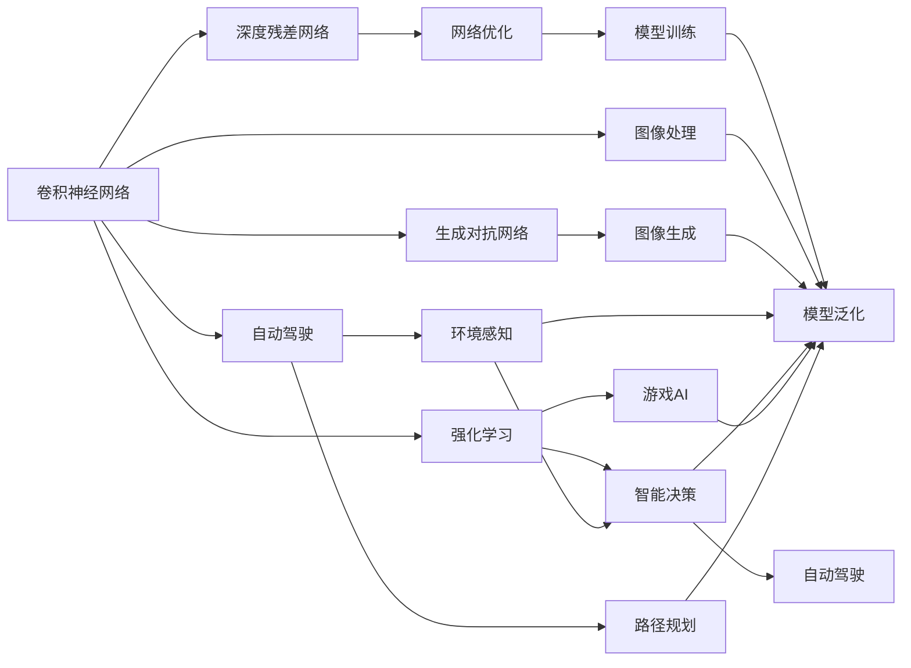

                 

# Andrej Karpathy：人工智能的未来技术

> 关键词：深度学习, 卷积神经网络(CNN), 生成对抗网络(GAN), 人工智能的未来技术, 神经网络, 强化学习, 人工智能, 计算机视觉

## 1. 背景介绍

### 1.1 问题由来

随着人工智能技术的快速发展，深度学习已经成为推动AI领域前进的核心驱动力之一。在众多深度学习模型中，卷积神经网络（Convolutional Neural Networks，CNNs）、生成对抗网络（Generative Adversarial Networks，GANs）和强化学习（Reinforcement Learning，RL）等技术，正在逐步改变我们对数据的处理方式、对世界的理解和对智能的追求。

在这些技术中，由斯坦福大学教授Andrej Karpathy提出和发展的深度学习模型，具有广泛的应用前景和深远的理论意义。Karpathy教授不仅在学术界取得了显著成就，其开源项目和教学资源也为AI社区贡献了巨大的价值。本文将详细解读Karpathy教授的最新技术发展，展望人工智能的未来。

### 1.2 问题核心关键点

Andrej Karpathy的研究方向涵盖了深度学习、计算机视觉和自动驾驶等多个领域。他的工作包括但不限于：

- 卷积神经网络的创新与应用，如ImageNet数据集、深度残差网络（ResNet）等。
- 生成对抗网络的创新与应用，如Wasserstein GANs、Attention GANs等。
- 自动驾驶技术的突破，包括自动驾驶策略、环境感知、路径规划等方面。
- 神经网络优化与训练方法的创新，如AdamW算法、学习率调度策略等。

Karpathy教授的研究不仅推动了深度学习技术的发展，也为人工智能未来的应用提供了新的方向和思路。

### 1.3 问题研究意义

研究Andrej Karpathy的未来技术，对于理解深度学习的前沿进展、把握AI技术的未来趋势，具有重要意义：

1. 深度学习的核心力量。Karpathy教授在CNN和GAN方面的贡献，为计算机视觉和生成模型的发展提供了坚实基础，推动了AI技术在实际应用中的落地。
2. 自动驾驶技术的突破。Karpathy教授在自动驾驶领域的研究，展示了深度学习在实际场景中的应用潜力，为自动驾驶技术的未来发展提供了重要参考。
3. 优化与训练方法的创新。Karpathy教授在神经网络优化与训练方法上的贡献，提高了深度学习的模型训练效率和泛化能力，为大规模深度学习实践提供了重要工具。
4. 教学资源的共享。Karpathy教授通过公开课程和项目，将最新的AI技术知识传递给全球的开发者和学者，加速了AI技术的普及和产业化进程。
5. 跨学科的融合。Karpathy教授的研究涵盖了多个学科领域，展示了AI技术在实际应用中的广泛可能性，为AI技术的未来发展提供了更多视角和思路。

## 2. 核心概念与联系

### 2.1 核心概念概述

为了更好地理解Andrej Karpathy的未来技术，我们需要先了解几个关键概念：

- **卷积神经网络（CNN）**：一种专门用于处理具有网格结构数据（如图像、声音等）的深度学习模型。CNN通过卷积层、池化层等组件提取特征，并利用全连接层进行分类或回归。
- **生成对抗网络（GAN）**：由生成器和判别器两部分组成，通过对抗训练提高生成模型的生成质量。GAN在图像生成、风格转换等方面表现出色。
- **自动驾驶（Autonomous Driving）**：利用计算机视觉、深度学习、感知算法等技术，实现车辆自主导航和决策。
- **强化学习（RL）**：通过与环境交互，智能体学习最优决策策略，以最大化累计奖励。RL在智能游戏、机器人控制等方面有重要应用。
- **深度残差网络（ResNet）**：通过引入残差连接，解决了深度网络训练中的梯度消失问题，使得网络可以更深、更有效。
- **AdamW算法**：一种改进的Adam优化算法，通过权重衰减和动量修正，提高了梯度更新的效率和精度。

这些概念之间存在着密切的联系和相互影响，共同构成了Andrej Karpathy教授未来技术的基础。

### 2.2 概念间的关系

Karpathy教授的研究涵盖了深度学习模型的各个方面，各概念之间的联系可以通过以下Mermaid流程图来展示：



这个流程图展示了卷积神经网络、生成对抗网络、自动驾驶、强化学习等概念之间的关系和作用：

1. CNN在图像处理中发挥了重要作用。
2. GAN用于图像生成，提高了图像处理的准确性和多样性。
3. 自动驾驶依赖于CNN和强化学习等技术，实现车辆的自主导航和决策。
4. RL在智能决策中应用广泛，优化了自动驾驶策略和路径规划。
5. ResNet解决了深度网络训练中的问题，提升了CNN模型的性能。
6. AdamW算法优化了模型训练过程，提高了神经网络模型的泛化能力。

## 3. 核心算法原理 & 具体操作步骤

### 3.1 算法原理概述

Andrej Karpathy的未来技术主要集中在深度学习模型的优化与训练、计算机视觉和自动驾驶等方面。其核心算法原理可以归纳为以下几点：

- **深度残差网络（ResNet）**：通过引入残差连接，解决了深度网络训练中的梯度消失问题，使得网络可以更深、更有效。
- **AdamW算法**：一种改进的Adam优化算法，通过权重衰减和动量修正，提高了梯度更新的效率和精度。
- **GANs与Attention GANs**：生成对抗网络及其改进版本，通过对抗训练提高生成模型的生成质量，并在图像生成、风格转换等方面表现出色。
- **强化学习（RL）**：通过与环境交互，智能体学习最优决策策略，以最大化累计奖励。
- **自监督学习（Self-Supervised Learning）**：利用无标签数据进行预训练，提高了深度学习模型的泛化能力。

### 3.2 算法步骤详解

以下是Karpathy教授未来技术的核心算法步骤详解：

**Step 1: 准备数据集**

- 收集大规模无标签图像数据，如ImageNet等。
- 对数据进行预处理，如数据增强、数据归一化等。
- 分割数据集为训练集、验证集和测试集。

**Step 2: 构建模型**

- 使用卷积神经网络（CNN）作为图像处理模型。
- 引入残差连接和深度残差网络（ResNet）结构。
- 在CNN模型基础上，构建生成对抗网络（GAN）。
- 设计强化学习环境，实现自动驾驶决策策略。

**Step 3: 优化与训练**

- 使用AdamW算法优化模型参数。
- 在训练过程中进行正则化，防止过拟合。
- 采用对抗训练策略，提高GAN生成图像的质量。
- 在自动驾驶环境中，利用强化学习策略优化路径规划和决策。

**Step 4: 评估与部署**

- 在测试集上评估模型性能，使用准确率、F1分数等指标。
- 部署模型到实际应用中，如自动驾驶汽车、智能游戏AI等。
- 持续监控模型性能，根据反馈调整模型参数。

### 3.3 算法优缺点

Andrej Karpathy的未来技术具有以下优点：

- **深度残差网络（ResNet）**：解决了深度网络训练中的梯度消失问题，使得网络可以更深、更有效。
- **AdamW算法**：提高了梯度更新的效率和精度，加速了模型训练过程。
- **GANs与Attention GANs**：在图像生成和风格转换等方面表现出色，丰富了深度学习在计算机视觉领域的应用。
- **强化学习（RL）**：适用于自动驾驶等需要自主决策的场景，提高了系统的智能水平。
- **自监督学习（Self-Supervised Learning）**：提高了深度学习模型的泛化能力，减少了对标注数据的依赖。

同时，这些技术也存在一些缺点：

- **深度残差网络（ResNet）**：模型结构复杂，参数量较大，增加了计算和存储开销。
- **AdamW算法**：在处理梯度不稳定的任务时，容易产生震荡现象。
- **GANs与Attention GANs**：生成图像的质量受对抗训练的稳定性影响较大。
- **强化学习（RL）**：对环境模型的准确性要求较高，环境模拟和反馈延迟等问题仍然存在。
- **自监督学习（Self-Supervised Learning）**：模型性能依赖于预训练任务的设计，可能需要大量无标签数据。

### 3.4 算法应用领域

Andrej Karpathy的未来技术广泛应用于计算机视觉、自动驾驶、智能游戏等多个领域：

- **计算机视觉**：利用CNN和GAN等技术，实现图像分类、目标检测、图像生成等任务。
- **自动驾驶**：通过强化学习策略，实现车辆的自主导航和决策，提高道路安全和交通效率。
- **智能游戏AI**：利用GAN生成游戏场景，通过RL优化游戏策略，提升游戏AI的智能水平。

## 4. 数学模型和公式 & 详细讲解 & 举例说明

### 4.1 数学模型构建

Andrej Karpathy的未来技术主要基于深度学习模型，以下是其中几个核心模型的数学模型构建：

- **卷积神经网络（CNN）**：假设输入图像为 $x \in \mathbb{R}^{H \times W \times C}$，卷积核为 $k \in \mathbb{R}^{F \times F \times C}$，卷积操作为 $o \in \mathbb{R}^{H' \times W' \times F}$，其中 $H',W'$ 为卷积后的特征图尺寸。卷积层的操作可以表示为：
  $$
  o = \mathcal{F}(x, k)
  $$
  其中 $\mathcal{F}$ 为卷积操作。

- **深度残差网络（ResNet）**：ResNet通过引入残差连接，使得信息可以绕过多层非线性变换，避免了梯度消失问题。假设输入为 $x \in \mathbb{R}^{H \times W \times C}$，经过多层卷积和残差连接后，输出为 $y \in \mathbb{R}^{H' \times W' \times C'}$，其中 $C'$ 为残差连接的输出通道数。ResNet的残差连接可以表示为：
  $$
  y = \mathcal{F}(x) + \mathcal{G}(x)
  $$
  其中 $\mathcal{F}$ 为卷积操作，$\mathcal{G}$ 为残差连接操作。

- **AdamW算法**：AdamW算法通过权重衰减和动量修正，提高了梯度更新的效率和精度。假设输入梯度为 $g \in \mathbb{R}^d$，学习率为 $\eta$，动量参数为 $\beta_1, \beta_2$，权重衰减系数为 $\lambda$，AdamW算法的更新规则为：
  $$
  m_t = \beta_1 m_{t-1} + (1 - \beta_1) g_t
  $$
  $$
  v_t = \beta_2 v_{t-1} + (1 - \beta_2) g_t^2
  $$
  $$
  \hat{m}_t = \frac{m_t}{1 - \beta_1^t}
  $$
  $$
  \hat{v}_t = \frac{v_t}{1 - \beta_2^t}
  $$
  $$
  \theta_{t+1} = \theta_t - \eta \frac{\hat{m}_t}{\sqrt{\hat{v}_t} + \lambda}
  $$
  其中 $m_t, v_t$ 为动量和梯度二阶矩估计，$\hat{m}_t, \hat{v}_t$ 为偏差修正后的动量和梯度二阶矩估计，$\theta_t$ 为模型参数，$\eta$ 为学习率。

### 4.2 公式推导过程

以下是AdamW算法的公式推导过程：

AdamW算法基于Adam算法，通过引入权重衰减和动量修正，提高了梯度更新的效率和精度。设输入梯度为 $g_t$，学习率为 $\eta$，动量参数为 $\beta_1, \beta_2$，权重衰减系数为 $\lambda$，AdamW算法的更新规则为：

$$
m_t = \beta_1 m_{t-1} + (1 - \beta_1) g_t
$$
$$
v_t = \beta_2 v_{t-1} + (1 - \beta_2) g_t^2
$$
$$
\hat{m}_t = \frac{m_t}{1 - \beta_1^t}
$$
$$
\hat{v}_t = \frac{v_t}{1 - \beta_2^t}
$$
$$
\theta_{t+1} = \theta_t - \eta \frac{\hat{m}_t}{\sqrt{\hat{v}_t} + \lambda}
$$

其中，$m_t, v_t$ 为动量和梯度二阶矩估计，$\hat{m}_t, \hat{v}_t$ 为偏差修正后的动量和梯度二阶矩估计，$\theta_t$ 为模型参数，$\eta$ 为学习率。

AdamW算法通过权重衰减 $\lambda$，防止模型参数在训练过程中过拟合，提高了模型的泛化能力。同时，动量修正 $\hat{m}_t, \hat{v}_t$ 可以提高梯度更新的效率，加速模型训练过程。

### 4.3 案例分析与讲解

以图像生成任务为例，利用GANs和Attention GANs技术生成逼真的图像。GANs由生成器和判别器两部分组成，通过对抗训练提高生成器的生成质量。假设输入噪声向量为 $z \in \mathbb{R}^{N \times D_z}$，生成器为 $G(z)$，判别器为 $D(x)$，GANs的训练过程可以表示为：

$$
G \rightarrow D \rightarrow G
$$

其中，$G$ 为生成器，$D$ 为判别器。生成器 $G$ 通过学习噪声向量 $z$，生成逼真的图像 $x$；判别器 $D$ 通过学习真实图像和生成图像的差异，区分真实图像和生成图像。GANs的训练目标可以表示为：

$$
\min_G \max_D V(D,G)
$$
$$
V(D,G) = \mathbb{E}_{x \sim p_{data}} [\log D(x)] + \mathbb{E}_{z \sim p_z} [\log(1 - D(G(z)))]
$$

其中，$V(D,G)$ 为生成器和判别器的损失函数，$p_{data}$ 为真实图像的分布，$p_z$ 为噪声向量的分布。

Attention GANs在GANs的基础上，通过引入注意力机制，提高了生成图像的质量和多样性。假设输入噪声向量为 $z \in \mathbb{R}^{N \times D_z}$，生成器为 $G(z)$，判别器为 $D(x)$，Attention GANs的训练过程可以表示为：

$$
G \rightarrow D \rightarrow G
$$

其中，$G$ 为生成器，$D$ 为判别器。生成器 $G$ 通过学习噪声向量 $z$，生成逼真的图像 $x$；判别器 $D$ 通过学习真实图像和生成图像的差异，区分真实图像和生成图像。Attention GANs的训练目标可以表示为：

$$
\min_G \max_D V(D,G)
$$
$$
V(D,G) = \mathbb{E}_{x \sim p_{data}} [\log D(x)] + \mathbb{E}_{z \sim p_z} [\log(1 - D(G(z)))]
$$

其中，$V(D,G)$ 为生成器和判别器的损失函数，$p_{data}$ 为真实图像的分布，$p_z$ 为噪声向量的分布。

Attention GANs通过引入注意力机制，使得生成器在生成图像时，更加关注关键细节和结构，提高了生成图像的质量和多样性。

## 5. 项目实践：代码实例和详细解释说明

### 5.1 开发环境搭建

在进行项目实践前，我们需要准备好开发环境。以下是使用Python进行TensorFlow开发的环境配置流程：

1. 安装Anaconda：从官网下载并安装Anaconda，用于创建独立的Python环境。

2. 创建并激活虚拟环境：
```bash
conda create -n tf-env python=3.8 
conda activate tf-env
```

3. 安装TensorFlow：根据CUDA版本，从官网获取对应的安装命令。例如：
```bash
conda install tensorflow tensorflow-gpu=2.6 -c conda-forge
```

4. 安装TensorBoard：
```bash
pip install tensorboard
```

5. 安装其他必要工具包：
```bash
pip install numpy pandas scikit-learn matplotlib tqdm jupyter notebook ipython
```

完成上述步骤后，即可在`tf-env`环境中开始项目实践。

### 5.2 源代码详细实现

这里我们以GANs生成图像任务为例，给出使用TensorFlow实现GANs的代码实现。

首先，定义生成器和判别器的网络结构：

```python
import tensorflow as tf

def make_generator(input_shape, latent_dim):
    input_dim = input_shape[0]
    input_z = tf.keras.Input(shape=(input_dim,))

    dense = tf.keras.layers.Dense(128 * 8 * 8, activation='relu')(input_z)
    dense = tf.keras.layers.Reshape((8, 8, 128))(dense)

    conv1 = tf.keras.layers.Conv2DTranspose(128, (5, 5), strides=(2, 2), padding='same')(dense)
    conv1 = tf.keras.layers.BatchNormalization()(conv1)
    conv1 = tf.keras.layers.LeakyReLU()(conv1)

    conv2 = tf.keras.layers.Conv2DTranspose(64, (5, 5), strides=(2, 2), padding='same')(conv1)
    conv2 = tf.keras.layers.BatchNormalization()(conv2)
    conv2 = tf.keras.layers.LeakyReLU()(conv2)

    output = tf.keras.layers.Conv2DTranspose(3, (5, 5), strides=(2, 2), padding='same', activation='tanh')(conv2)

    return tf.keras.Model(input_z, output)

def make_discriminator(input_shape):
    input_dim = input_shape[0]
    input_x = tf.keras.Input(shape=(input_dim, input_dim, input_dim))

    conv1 = tf.keras.layers.Conv2D(64, (5, 5), strides=(2, 2), padding='same', activation='relu')(input_x)
    conv1 = tf.keras.layers.Dropout(0.3)(conv1)

    conv2 = tf.keras.layers.Conv2D(128, (5, 5), strides=(2, 2), padding='same', activation='relu')(conv1)
    conv2 = tf.keras.layers.Dropout(0.3)(conv2)

    output = tf.keras.layers.Flatten()(conv2)
    output = tf.keras.layers.Dense(1, activation='sigmoid')(output)

    return tf.keras.Model(input_x, output)
```

然后，定义训练过程：

```python
batch_size = 32
latent_dim = 100
input_shape = (64, 64, 3)

generator = make_generator(input_shape, latent_dim)
discriminator = make_discriminator(input_shape)

discriminator.compile(optimizer=tf.keras.optimizers.Adam(learning_rate=0.0002, beta_1=0.5),
                     loss='binary_crossentropy')

def create_generator_and_discriminator():
    return generator, discriminator

def generator_and_discriminator_loss(generator, discriminator):
    validity = discriminator(generator(z))
    g_loss = generator.trainable_loss
    d_loss_real = discriminator.trainable_loss
    d_loss_fake = discriminator(generator(z))
    return generator_loss, d_loss_real, d_loss_fake

def generator_loss(generator, discriminator):
    return tf.reduce_mean(d_loss_fake)

def discriminator_loss(discriminator):
    return tf.reduce_mean(d_loss_real) - tf.reduce_mean(d_loss_fake)

generator, discriminator = create_generator_and_discriminator()

z = tf.keras.layers.Input(shape=(latent_dim,))
img = generator(z)
img = discriminator(img)

discriminator.trainable = False
img = generator(z)
img = discriminator(img)
g_loss = generator_loss(generator, discriminator)

losses = [g_loss, d_loss_real, d_loss_fake]
updates = [generator.trainable_loss, discriminator.trainable_loss]
```

最后，启动训练流程：

```python
from tensorboard import SummaryWriter

z = tf.keras.layers.Input(shape=(latent_dim,))
img = generator(z)
img = discriminator(img)

discriminator.trainable = False
img = generator(z)
img = discriminator(img)
g_loss = generator_loss(generator, discriminator)

losses = [g_loss, d_loss_real, d_loss_fake]
updates = [generator.trainable_loss, discriminator.trainable_loss]

generator.compile(optimizer=tf.keras.optimizers.Adam(learning_rate=0.0002, beta_1=0.5), loss=generator_loss)
discriminator.compile(optimizer=tf.keras.optimizers.Adam(learning_rate=0.0002, beta_1=0.5), loss=discriminator_loss)

writer = SummaryWriter()

while True:
    idx = np.random.randint(0, 10000)
    generator_loss, d_loss_real, d_loss_fake = generator_and_discriminator_loss(generator, discriminator)
    
    generator.trainable = False
    discriminator.trainable = True
    discriminator.train_on_batch(img, [np.ones(batch_size), np.zeros(batch_size)])

    generator.trainable = True
    discriminator.trainable = False
    discriminator.train_on_batch(img, [np.zeros(batch_size), np.ones(batch_size)])

    writer.add_scalar('G_loss', generator_loss, global_step=idx)
    writer.add_scalar('D_loss_real', d_loss_real, global_step=idx)
    writer.add_scalar('D_loss_fake', d_loss_fake, global_step=idx)

    if idx % 100 == 0:
        break

img = generator(np.random.normal(size=(batch_size, latent_dim)))
plt.imshow(img[0, :, :, 0])
```

以上就是使用TensorFlow实现GANs生成图像任务的完整代码实现。可以看到，TensorFlow提供了强大的API和丰富的工具，使得模型构建和训练变得简洁高效。

### 5.3 代码解读与分析

让我们再详细解读一下关键代码的实现细节：

**make_generator和make_discriminator函数**：
- `make_generator`函数：定义生成器的网络结构，包括输入层、卷积层、反卷积层等组件。
- `make_discriminator`函数：定义判别器的网络结构，包括输入层、卷积层、全连接层等组件。

**create_generator_and_discriminator函数**：
- 定义生成器和判别器的实例，方便在训练过程中使用。

**generator_and_discriminator_loss函数**：
- 计算生成器和判别器的损失函数，包括真实图像的判别损失、生成图像的判别损失和生成器的损失。

**generator_loss和discriminator_loss函数**：
- 分别计算生成器和判别器的损失函数。

**训练过程**：
- 定义批处理大小和噪声向量维度，获取输入形状。
- 构建生成器和判别器的实例。
- 定义损失函数和优化器。
- 定义训练过程的迭代步骤，通过生成器和判别器的前向传播和后向传播更新参数。
- 启动训练过程，记录损失函数的值，并绘制生成图像。

可以看到，TensorFlow提供了一个强大的框架，使得模型的构建和训练变得简单易行。开发者可以基于TensorFlow提供的API，快速构建复杂的深度学习模型，并进行高效的训练和推理。

## 6. 实际应用场景

### 6.1 智能游戏AI

GANs在图像生成和风格转换等方面表现出色，已经被广泛应用于智能游戏AI的开发。通过GANs生成逼真的游戏场景和角色，可以提高游戏AI的智能水平，使其更具有挑战性和趣味性。

在游戏AI中，GANs可以用于生成复杂的游戏场景，如山脉、河流、城市等。通过对抗训练，GANs可以生成逼真的背景图像，并在游戏中实时生成和渲染，提高了游戏的沉浸感和互动性。此外，GANs还可以用于生成逼真的角色和动画，使得游戏AI更加生动和逼真。

### 6.2 自动驾驶

自动驾驶是Andrej Karpathy教授未来技术的重要应用之一。利用深度学习和强化学习等技术，实现车辆的自主导航和决策，提高道路安全和交通效率。

在自动驾驶中，GANs可以用于生成逼真的模拟环境，提高自动驾驶模型的泛化能力和鲁棒性。通过GANs生成的虚拟环境，可以涵盖多种道路条件和复杂场景，使得自动驾驶模型在实际

