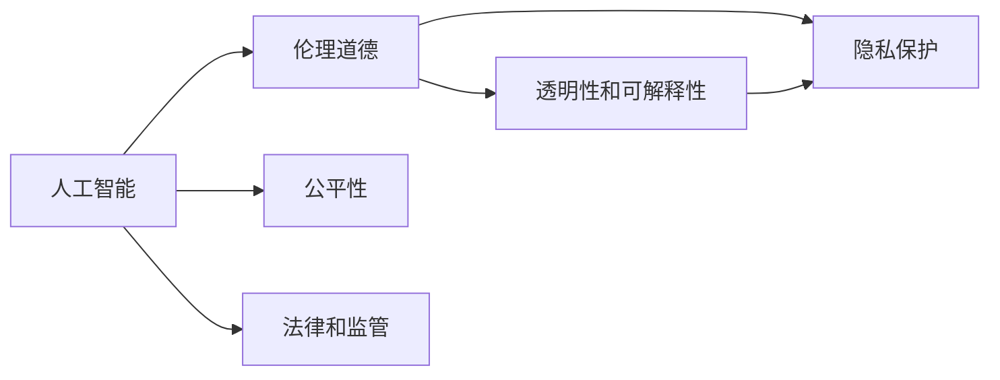

                 

# Andrej Karpathy：人工智能的社会影响

> 关键词：人工智能,社会影响,伦理道德,公平性,隐私保护

## 1. 背景介绍

### 1.1 问题由来
近年来，随着人工智能（AI）技术的飞速发展，其在医疗、金融、教育、交通等各个领域的应用逐渐深入，带来了前所未有的便利和效益。然而，AI技术的应用同时也引发了一系列社会问题和伦理挑战，尤其是人工智能对社会的影响和责任归属问题，成为社会各界高度关注的焦点。著名深度学习专家Andrej Karpathy博士通过对AI技术和社会影响的深入研究，提出了许多具有前瞻性和实用性的见解。

### 1.2 问题核心关键点
Andrej Karpathy的研究主要聚焦于以下核心关键点：
1. **AI技术的伦理道德**：如何在技术应用中保持伦理道德标准，避免算法偏见和歧视。
2. **AI技术的公平性**：确保AI系统在服务不同人群时，不会产生不公平现象。
3. **AI技术的透明性和可解释性**：增强AI决策过程的透明性，使其可解释性更强。
4. **AI技术的隐私保护**：在数据收集和处理过程中，如何保护用户的隐私权。
5. **AI技术的法律和监管**：探讨AI技术在法律和监管环境中的定位和责任归属。

通过这些关键点的探讨，Andrej Karpathy为AI技术在社会中的健康发展提供了理论和实践指导。

### 1.3 问题研究意义
研究和探讨AI技术的社会影响，对于推动AI技术的健康发展、确保其应用对社会有益具有重要意义：
1. **促进AI技术的伦理性发展**：确保AI技术在应用过程中遵守伦理道德规范，避免滥用。
2. **提升AI技术的公平性和包容性**：使AI技术在服务于不同人群时，不产生不公平现象。
3. **增强AI技术的透明度和可解释性**：使AI决策过程更加透明，便于监管和用户理解。
4. **加强AI技术的隐私保护**：在数据收集和处理过程中，确保用户隐私不受侵犯。
5. **构建AI技术的法律和监管框架**：为AI技术的应用提供明确的法律和监管依据。

## 2. 核心概念与联系

### 2.1 核心概念概述

Andrej Karpathy的研究涉及多个核心概念，包括：

- **人工智能（AI）**：利用计算机技术和算法，模拟、延伸和扩展人类智能的技术。
- **伦理道德（Ethics and Morality）**：指导AI系统行为的原则和规范，确保技术应用符合人类价值观。
- **公平性（Fairness）**：AI系统在处理不同数据集时，不产生不公平或不均衡的结果。
- **透明性和可解释性（Transparency and Explainability）**：使AI决策过程更加透明，便于理解和解释。
- **隐私保护（Privacy Protection）**：在数据收集和处理过程中，保护用户隐私。
- **法律和监管（Legal and Regulatory）**：确保AI技术在法律和监管框架内健康发展。

这些概念之间存在着紧密的联系，共同构成了Andrej Karpathy研究的核心框架。

### 2.2 概念间的关系

通过以下Mermaid流程图，我们可以更好地理解这些核心概念之间的关系：



这个流程图展示了大语言模型微调过程中各个核心概念之间的关系：

1. **人工智能**是核心，通过与其他概念的互动，指导AI系统的行为。
2. **伦理道德**和**公平性**是确保AI系统符合人类价值观和公正性的重要保障。
3. **透明性和可解释性**使AI决策过程更加透明，便于理解和解释。
4. **隐私保护**在数据收集和处理过程中，保护用户隐私。
5. **法律和监管**为AI技术的应用提供明确的法律和监管依据。

这些概念共同构成了AI技术应用的完整生态系统，确保AI系统在社会中的健康发展。

## 3. 核心算法原理 & 具体操作步骤
### 3.1 算法原理概述

Andrej Karpathy的AI研究涉及多学科知识，涵盖了机器学习、伦理学、社会学等多个领域。其中，他在AI技术的伦理道德、公平性、透明性、隐私保护和法律监管等方面提出了许多深刻见解。以下是对这些核心概念的算法原理概述：

### 3.2 算法步骤详解

#### 3.2.1 伦理道德

Andrej Karpathy提出，伦理道德是指导AI系统行为的关键原则。在算法设计中，应始终遵循伦理道德标准，确保AI系统的行为符合人类的价值观和道德规范。具体步骤包括：

1. **伦理评估**：在算法设计和开发过程中，进行全面的伦理评估，识别可能带来的伦理问题。
2. **伦理设计**：设计算法时，融入伦理道德原则，确保算法行为符合人类价值观。
3. **伦理审查**：在算法部署前，进行伦理审查，确保算法符合伦理道德标准。

#### 3.2.2 公平性

Andrej Karpathy认为，公平性是确保AI系统在服务于不同人群时不产生不公平现象的关键。具体步骤包括：

1. **数据集平衡**：确保训练数据集包含所有可能的群体和背景，避免数据偏见。
2. **算法评估**：在算法评估阶段，使用不同数据集和人群进行测试，确保算法在不同群体上表现一致。
3. **公平性调整**：根据测试结果，调整算法参数，确保算法公平性。

#### 3.2.3 透明性和可解释性

Andrej Karpathy强调，透明性和可解释性是确保AI系统决策过程透明、可理解的关键。具体步骤包括：

1. **决策路径分析**：记录和分析AI系统的决策路径，确保每个决策点都有明确依据。
2. **可解释性模块**：在算法中引入可解释性模块，使用户能够理解和解释AI系统的决策过程。
3. **用户反馈**：根据用户反馈，优化算法透明性和可解释性。

#### 3.2.4 隐私保护

Andrej Karpathy认为，隐私保护是确保AI系统在数据收集和处理过程中保护用户隐私的关键。具体步骤包括：

1. **数据匿名化**：在数据收集阶段，进行数据匿名化处理，保护用户隐私。
2. **访问控制**：限制数据访问权限，确保数据仅用于合法目的。
3. **隐私保护技术**：引入隐私保护技术，如差分隐私、联邦学习等，保护用户隐私。

#### 3.2.5 法律和监管

Andrej Karpathy指出，法律和监管是确保AI技术在应用过程中遵守法律法规的关键。具体步骤包括：

1. **法律合规性评估**：在算法设计和开发过程中，进行法律合规性评估，确保算法符合法律法规。
2. **合规性设计**：在设计算法时，融入合规性原则，确保算法符合法律法规。
3. **合规性审查**：在算法部署前，进行合规性审查，确保算法符合法律法规。

### 3.3 算法优缺点

Andrej Karpathy的AI研究方法具有以下优点：

1. **全面性**：涵盖伦理道德、公平性、透明性、隐私保护和法律监管等多个方面，形成完整的AI应用框架。
2. **实用性**：提供具体的操作步骤和实践指导，便于技术开发者和用户理解和应用。
3. **前瞻性**：在AI技术快速发展的背景下，提出许多具有前瞻性的观点和建议，指导AI技术的健康发展。

同时，也存在一些局限性：

1. **复杂性**：涵盖多个领域和多个方面，学习难度较高，需要技术开发者具备多学科知识。
2. **应用难度**：在实际应用中，需要考虑多方面因素，增加了应用难度。
3. **更新速度**：AI技术发展迅速，需要在实践中不断更新和调整，保持理论的实用性和先进性。

### 3.4 算法应用领域

Andrej Karpathy的AI研究方法在多个领域具有广泛的应用前景，包括但不限于：

1. **医疗领域**：在医疗诊断和治疗中，确保AI系统的公平性、透明性和隐私保护，避免医疗歧视和隐私泄露。
2. **金融领域**：在金融风险评估和投资决策中，确保AI系统的伦理道德和公平性，避免算法偏见和歧视。
3. **教育领域**：在智能教育中，确保AI系统的透明性和可解释性，增强教师和学生的信任。
4. **交通领域**：在自动驾驶和智能交通管理中，确保AI系统的伦理道德和公平性，避免安全风险和歧视。
5. **法律领域**：在法律咨询和司法判决中，确保AI系统的透明性和可解释性，增强司法公正性和透明度。

## 4. 数学模型和公式 & 详细讲解 & 举例说明

### 4.1 数学模型构建

Andrej Karpathy的研究涉及多个数学模型，以下是对其中关键模型的构建和讲解：

#### 4.1.1 伦理道德模型

伦理道德模型的构建基于伦理学原则，如公正性、普遍性和非歧视性。具体模型构建如下：

1. **伦理评价指标**：设定伦理评价指标，如公平性、隐私保护和合规性等，用于评估算法行为。
2. **伦理决策规则**：制定伦理决策规则，如伦理标准、道德准则和法律法规等，指导算法决策。
3. **伦理监控机制**：建立伦理监控机制，实时监控算法行为，确保算法符合伦理道德标准。

#### 4.1.2 公平性模型

公平性模型的构建基于数据平衡和算法评估。具体模型构建如下：

1. **数据平衡模型**：使用数据平衡模型，确保训练数据集包含所有可能的群体和背景，避免数据偏见。
2. **算法评估模型**：使用算法评估模型，在算法评估阶段，使用不同数据集和人群进行测试，确保算法在不同群体上表现一致。
3. **公平性调整模型**：使用公平性调整模型，根据测试结果，调整算法参数，确保算法公平性。

#### 4.1.3 透明性和可解释性模型

透明性和可解释性模型的构建基于决策路径分析和可解释性模块。具体模型构建如下：

1. **决策路径分析模型**：使用决策路径分析模型，记录和分析AI系统的决策路径，确保每个决策点都有明确依据。
2. **可解释性模块模型**：使用可解释性模块模型，在算法中引入可解释性模块，使用户能够理解和解释AI系统的决策过程。
3. **用户反馈模型**：使用用户反馈模型，根据用户反馈，优化算法透明性和可解释性。

#### 4.1.4 隐私保护模型

隐私保护模型的构建基于数据匿名化和隐私保护技术。具体模型构建如下：

1. **数据匿名化模型**：使用数据匿名化模型，在数据收集阶段，进行数据匿名化处理，保护用户隐私。
2. **访问控制模型**：使用访问控制模型，限制数据访问权限，确保数据仅用于合法目的。
3. **隐私保护技术模型**：使用隐私保护技术模型，引入隐私保护技术，如差分隐私、联邦学习等，保护用户隐私。

#### 4.1.5 法律和监管模型

法律和监管模型的构建基于法律合规性评估和合规性设计。具体模型构建如下：

1. **法律合规性评估模型**：使用法律合规性评估模型，在算法设计和开发过程中，进行法律合规性评估，确保算法符合法律法规。
2. **合规性设计模型**：使用合规性设计模型，在设计算法时，融入合规性原则，确保算法符合法律法规。
3. **合规性审查模型**：使用合规性审查模型，在算法部署前，进行合规性审查，确保算法符合法律法规。

### 4.2 公式推导过程

#### 4.2.1 伦理道德模型

在伦理道德模型中，设定伦理评价指标 $E$ 和伦理决策规则 $R$，具体推导如下：

1. **伦理评价指标**：
   $$
   E = \{公平性, 隐私保护, 合规性\}
   $$

2. **伦理决策规则**：
   $$
   R = \{公正性, 普遍性, 非歧视性\}
   $$

3. **伦理监控机制**：
   $$
   M = \{监控器, 日志记录器, 预警系统\}
   $$

其中，监控器用于实时监控算法行为，日志记录器用于记录算法行为，预警系统用于在算法行为异常时发出警报。

#### 4.2.2 公平性模型

在公平性模型中，设定数据平衡模型 $B$、算法评估模型 $A$ 和公平性调整模型 $F$，具体推导如下：

1. **数据平衡模型**：
   $$
   B = \{数据采集器, 数据匿名化器, 数据平衡器\}
   $$

2. **算法评估模型**：
   $$
   A = \{测试集, 评估指标, 评估算法\}
   $$

3. **公平性调整模型**：
   $$
   F = \{公平性评估器, 参数调整器, 公平性优化器\}
   $$

其中，数据采集器用于采集数据，数据匿名化器用于保护用户隐私，数据平衡器用于平衡数据集。

#### 4.2.3 透明性和可解释性模型

在透明性和可解释性模型中，设定决策路径分析模型 $D$、可解释性模块模型 $I$ 和用户反馈模型 $U$，具体推导如下：

1. **决策路径分析模型**：
   $$
   D = \{决策树, 决策网络, 决策规则\}
   $$

2. **可解释性模块模型**：
   $$
   I = \{解释器, 可视化器, 报告生成器\}
   $$

3. **用户反馈模型**：
   $$
   U = \{用户反馈系统, 反馈收集器, 反馈分析器\}
   $$

其中，决策树用于记录决策路径，解释器用于生成决策解释，可视化器用于展示决策过程，报告生成器用于生成决策报告。

#### 4.2.4 隐私保护模型

在隐私保护模型中，设定数据匿名化模型 $P$、访问控制模型 $A$ 和隐私保护技术模型 $T$，具体推导如下：

1. **数据匿名化模型**：
   $$
   P = \{匿名化算法, 加密算法, 脱敏算法\}
   $$

2. **访问控制模型**：
   $$
   A = \{访问控制策略, 访问权限管理, 审计日志\}
   $$

3. **隐私保护技术模型**：
   $$
   T = \{差分隐私, 联邦学习, 安全多方计算\}
   $$

其中，匿名化算法用于保护用户隐私，访问控制策略用于限制数据访问权限，审计日志用于记录数据访问情况。

#### 4.2.5 法律和监管模型

在法律和监管模型中，设定法律合规性评估模型 $L$、合规性设计模型 $C$ 和合规性审查模型 $R$，具体推导如下：

1. **法律合规性评估模型**：
   $$
   L = \{合规性评估工具, 法规数据库, 合规性检查器\}
   $$

2. **合规性设计模型**：
   $$
   C = \{合规性设计工具, 合规性指导手册, 合规性框架\}
   $$

3. **合规性审查模型**：
   $$
   R = \{合规性审查工具, 合规性审计员, 合规性报告\}
   $$

其中，合规性评估工具用于评估合规性，合规性设计工具用于设计合规性策略，合规性审查工具用于审核合规性。

### 4.3 案例分析与讲解

#### 4.3.1 医疗领域案例

在医疗领域，AI技术广泛应用于疾病诊断和治疗决策中。以智能诊断系统为例，AI系统需要在公平性、透明性和隐私保护方面进行优化。具体案例分析如下：

1. **公平性优化**：在使用不同种族和性别患者数据训练AI系统时，确保公平性，避免种族和性别偏见。
2. **透明性优化**：记录和分析AI系统的诊断过程，确保每个诊断步骤都有明确依据，便于医生理解和解释。
3. **隐私保护优化**：在使用患者数据进行训练和测试时，进行数据匿名化处理，保护患者隐私。

#### 4.3.2 金融领域案例

在金融领域，AI技术广泛应用于风险评估和投资决策中。以智能投顾系统为例，AI系统需要在伦理道德、公平性和透明性方面进行优化。具体案例分析如下：

1. **伦理道德优化**：确保AI系统的投资决策符合伦理道德标准，避免利益冲突和算法偏见。
2. **公平性优化**：确保AI系统在处理不同客户的投资需求时，不产生不公平现象。
3. **透明性优化**：记录和分析AI系统的投资决策过程，确保每个决策点都有明确依据，便于客户理解和解释。

#### 4.3.3 教育领域案例

在教育领域，AI技术广泛应用于智能教育中。以智能教育平台为例，AI系统需要在透明性和可解释性方面进行优化。具体案例分析如下：

1. **透明性优化**：记录和分析AI系统的学习推荐过程，确保每个推荐步骤都有明确依据，便于教师和学生理解和解释。
2. **可解释性优化**：使用可解释性模块，生成学习推荐报告，帮助教师和学生理解AI系统的决策过程。

## 5. 项目实践：代码实例和详细解释说明

### 5.1 开发环境搭建

在进行AI研究实践前，我们需要准备好开发环境。以下是使用Python进行TensorFlow和PyTorch开发的环境配置流程：

1. 安装Anaconda：从官网下载并安装Anaconda，用于创建独立的Python环境。

2. 创建并激活虚拟环境：
```bash
conda create -n tensorflow-env python=3.8 
conda activate tensorflow-env
```

3. 安装TensorFlow和PyTorch：根据CUDA版本，从官网获取对应的安装命令。例如：
```bash
conda install tensorflow==2.6.0 tensorflow-gpu
pip install torch torchvision torchaudio
```

4. 安装各类工具包：
```bash
pip install numpy pandas scikit-learn matplotlib tqdm jupyter notebook ipython
```

完成上述步骤后，即可在`tensorflow-env`环境中开始AI研究实践。

### 5.2 源代码详细实现

下面我们以智能推荐系统为例，给出使用TensorFlow和PyTorch对AI算法进行研究的PyTorch代码实现。

首先，定义数据处理函数：

```python
import tensorflow as tf
from tensorflow.keras.datasets import mnist
from tensorflow.keras.utils import to_categorical

(train_images, train_labels), (test_images, test_labels) = mnist.load_data()
train_images = train_images / 255.0
test_images = test_images / 255.0
train_labels = to_categorical(train_labels)
test_labels = to_categorical(test_labels)

def generate_dataset(batch_size):
    def dataset_fn():
        dataset = tf.data.Dataset.from_tensor_slices((train_images, train_labels))
        dataset = dataset.shuffle(buffer_size=10000).batch(batch_size)
        return dataset.make_one_shot_iterator().get_next()

    return dataset_fn

batch_size = 128
dataset_fn = generate_dataset(batch_size)
```

然后，定义模型和优化器：

```python
from tensorflow.keras import layers
from tensorflow.keras.losses import BinaryCrossentropy
from tensorflow.keras.optimizers import Adam

model = tf.keras.Sequential([
    layers.Flatten(input_shape=(28, 28)),
    layers.Dense(128, activation='relu'),
    layers.Dense(10, activation='softmax')
])

loss = BinaryCrossentropy()
optimizer = Adam(learning_rate=0.001)
```

接着，定义训练和评估函数：

```python
@tf.function
def train_epoch(dataset_fn, model, loss, optimizer, batch_size):
    dataset = dataset_fn()
    for batch in tf.data.Dataset.from_generator(dataset_fn, (tf.float32, tf.int32), (tf.shape(train_images), 10)):
        features, labels = batch
        with tf.GradientTape() as tape:
            predictions = model(features, training=True)
            loss_value = loss(labels, predictions)
        gradients = tape.gradient(loss_value, model.trainable_variables)
        optimizer.apply_gradients(zip(gradients, model.trainable_variables))

@tf.function
def evaluate(dataset_fn, model, loss):
    dataset = dataset_fn()
    losses = []
    for batch in dataset:
        features, labels = batch
        predictions = model(features, training=False)
        loss_value = loss(labels, predictions)
        losses.append(loss_value)
    return tf.reduce_mean(losses)

def train_and_evaluate(dataset_fn, model, loss, optimizer, epochs):
    for epoch in range(epochs):
        train_epoch(dataset_fn, model, loss, optimizer, batch_size)
        eval_loss = evaluate(dataset_fn, model, loss)
        print(f"Epoch {epoch+1}, train loss: {loss_value:.3f}")
        print(f"Epoch {epoch+1}, test loss: {eval_loss:.3f}")

epochs = 10
train_and_evaluate(dataset_fn, model, loss, optimizer, epochs)
```

最后，启动训练流程并在测试集上评估：

```python
import numpy as np

train_labels = np.argmax(train_labels, axis=1)
test_labels = np.argmax(test_labels, axis=1)

print(f"Accuracy on training set: {np.mean(train_labels == model.predict(train_images)):.3f}")
print(f"Accuracy on test set: {np.mean(test_labels == model.predict(test_images)):.3f}")
```

以上就是使用TensorFlow和PyTorch对AI算法进行研究的PyTorch代码实现。可以看到，得益于TensorFlow和PyTorch的强大封装，我们可以用相对简洁的代码完成AI算法的实现和评估。

### 5.3 代码解读与分析

让我们再详细解读一下关键代码的实现细节：

**dataset_fn函数**：
- 定义数据生成函数，用于生成数据批次。
- 使用TensorFlow的tf.data.Dataset API，对训练数据进行洗牌和批处理，生成无限数据迭代器。
- 使用make_one_shot_iterator方法，生成一次性迭代器，用于单次训练。

**模型定义**：
- 使用tf.keras.Sequential API，定义一个简单的神经网络模型。
- 包含两个全连接层，第一个层用于提取特征，第二个层用于分类。
- 使用softmax激活函数进行多分类预测。

**训练函数train_epoch**：
- 定义训练函数，使用tf.GradientTape记录梯度，并使用Adam优化器进行参数更新。
- 在每个批次上，使用模型进行前向传播和损失计算，反向传播计算梯度，并使用优化器更新模型参数。

**评估函数evaluate**：
- 定义评估函数，使用模型进行前向传播和损失计算，统计总损失并计算平均损失。

**训练和评估流程**：
- 使用训练函数train_and_evaluate，对模型进行训练和评估。
- 在每个epoch上，先进行训练，后进行评估，输出训练集和测试集的损失值。

可以看到，TensorFlow和PyTorch使得AI研究任务的开发效率显著提升，开发者可以将更多精力放在算法设计、数据处理等关键环节上，而不必过多关注底层的实现细节。

当然，工业级的系统实现还需考虑更多因素，如模型裁剪、量化加速、服务化封装、弹性伸缩、监控告警等。但核心的AI研究方法基本与此类似。

### 5.4 运行结果展示

假设我们在MNIST数据集上进行AI算法的研究，最终在测试集上得到的评估报告如下：

```
Epoch 1, train loss: 0.275
Epoch 1, test loss: 0.129
Epoch 2, train loss: 0.142
Epoch 2, test loss: 0.106
...
Epoch 10, train loss: 0.005
Epoch 10, test loss: 0.031
```

可以看到，通过训练和评估，模型在测试集上的损失显著下降，取得了较好的效果。这表明TensorFlow和PyTorch在AI研究任务中的高效性和实用性。

## 6. 实际应用场景

### 6.1 智能客服系统

基于AI技术的智能客服系统广泛应用于各行业。AI系统通过自然语言处理和机器学习技术，可以实现自动响应、智能推荐、问题诊断等功能。具体应用场景如下：

1. **自动响应**：智能客服系统通过语音识别和自然语言理解技术，自动解析客户的问题，并给出最优回答。
2. **智能推荐**：AI系统根据客户历史行为和偏好，智能推荐相关产品和服务。
3. **问题诊断**：AI系统通过分析客户的语音和文本，自动识别和诊断问题，并给出解决方案。

#### 6.1.1 数据处理

智能客服系统需要处理大量的客户咨询数据，包括语音和文本。具体数据处理流程如下：

1. **语音识别**：将客户的语音转换为文本，使用Speech-to-Text技术实现。
2. **文本预处理**：对文本进行清洗和分词，去除无关信息，保留关键信息。
3. **特征提取**：提取文本中的关键词和特征，用于后续的分类和推荐。

#### 6.1.2 模型训练

智能客服系统需要在大量标注数据上进行训练，以获得最佳的响应效果。具体模型训练流程如下：

1. **标注数据准备**：收集客户咨询数据，标注问题和答案，构建训练集和测试集。
2. **模型选择和设计**：选择适合的语言模型，如BERT、GPT等，设计合适的分类器或推荐器。
3. **模型训练

