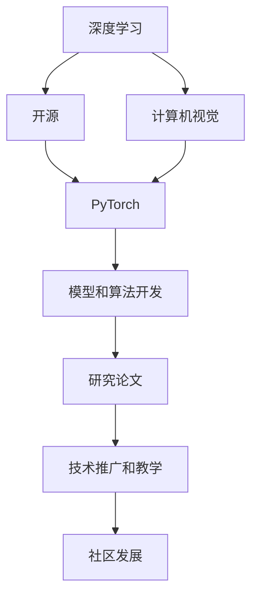

                 

# Andrej Karpathy：发布项目，获得奖励

> 关键词：Andrej Karpathy, 机器学习, 开源, PyTorch, 深度学习, 计算机视觉

## 1. 背景介绍

Andrej Karpathy，是深度学习和计算机视觉领域的知名专家，斯坦福大学计算机视觉实验室主任，特斯拉前首席AI科学家。他不仅在学术研究方面成果丰硕，同时在工业界也贡献卓著。作为深度学习社区中的翘楚，Karpathy 的项目和论文经常引领行业风向，极大推动了人工智能技术的进步。本文将梳理Andrej Karpathy在深度学习和计算机视觉领域的重要项目和贡献，解读其背后的原理与技术，并展望未来发展趋势。

## 2. 核心概念与联系

### 2.1 核心概念概述

在探讨Andrej Karpathy的项目之前，我们先了解一下一些核心概念：

- **深度学习（Deep Learning）**：一种机器学习技术，通过构建多层的神经网络模型，自动学习和提取输入数据中的高级特征。
- **计算机视觉（Computer Vision）**：让计算机理解、解释和处理图像和视频等视觉数据的科学和技术。
- **开源（Open Source）**：指软件及其源代码的公开和共享，促进技术和知识的广泛传播与应用。
- **PyTorch**：由Facebook开发的深度学习框架，支持动态计算图和灵活的操作，成为深度学习社区中的热门选择。

### 2.2 核心概念间的关系

Andrej Karpathy的研究和项目常常与这些核心概念紧密相关。通过在深度学习和计算机视觉领域的研究，Karpathy 开发出一系列具有深远影响的模型和技术，并通过开源方式分享，推动了整个社区的进步。例如，他基于PyTorch开发的模型和算法，成为了许多研究者和工业界开发者学习和使用的基准。

通过以下Mermaid流程图，可以更清晰地理解Andrej Karpathy的项目和其核心概念之间的关系：



这个图展示了Andrej Karpathy如何通过深度学习和计算机视觉技术，开发出一系列模型和算法，并通过开源和教学方式推广这些技术和知识，促进了深度学习社区的发展。

## 3. 核心算法原理 & 具体操作步骤

### 3.1 算法原理概述

Andrej Karpathy的研究和项目常常基于以下几种核心算法：

- **卷积神经网络（CNNs）**：一种广泛应用于图像处理和计算机视觉的深度学习模型，通过卷积操作提取空间特征。
- **循环神经网络（RNNs）**：一种处理序列数据（如时间序列和自然语言）的深度学习模型，能够处理变长输入序列。
- **自注意力机制（Self-Attention）**：一种使模型能够关注输入数据中不同部分的机制，能够捕捉全局信息。

### 3.2 算法步骤详解

以Andrej Karpathy开发的Caffe2为例，简述其开发和应用流程：

1. **环境搭建**：选择合适的深度学习框架和硬件环境，例如使用PyTorch搭建模型和训练环境。
2. **模型设计**：根据任务需求选择合适的模型结构，例如使用CNNs或RNNs处理图像和序列数据。
3. **数据准备**：收集和处理数据集，确保数据集的质量和多样性。
4. **模型训练**：使用训练集对模型进行训练，调整超参数，如学习率、批次大小等。
5. **模型评估**：在验证集上评估模型性能，确保模型泛化能力。
6. **模型应用**：将训练好的模型应用到实际问题中，进行推理和预测。

### 3.3 算法优缺点

- **优点**：
  - 能够自动学习高级特征，适用于复杂的数据处理任务。
  - 开源框架方便共享和扩展，促进社区交流和创新。
  - 支持动态计算图，灵活处理输入和输出。

- **缺点**：
  - 模型复杂，训练和推理时间较长。
  - 需要大量数据和计算资源，对硬件要求高。
  - 模型调试和优化较为复杂。

### 3.4 算法应用领域

Andrej Karpathy的算法和模型广泛应用在以下几个领域：

- **自动驾驶**：通过计算机视觉和深度学习技术，实现车辆自主导航和决策。
- **医学影像分析**：利用深度学习模型，自动分析医学影像，辅助医生诊断和治疗。
- **自然语言处理**：开发语言模型和机器翻译系统，提升人机交互体验。
- **游戏AI**：构建智能游戏AI，提升游戏玩家体验和游戏平衡性。
- **计算机视觉**：研究图像识别和分类，推动计算机视觉技术的发展。

## 4. 数学模型和公式 & 详细讲解

### 4.1 数学模型构建

假设我们有一个简单的卷积神经网络（CNN）模型，用于图像分类任务。其数学模型构建如下：

设 $x \in \mathbb{R}^d$ 为输入特征向量，$w \in \mathbb{R}^d$ 为权重向量，$b \in \mathbb{R}$ 为偏置。

卷积操作定义为：

$$ y = \sigma(w \ast x + b) $$

其中 $\sigma$ 为激活函数，$\ast$ 表示卷积运算。

### 4.2 公式推导过程

以卷积神经网络为例，简述卷积层和池化层的推导过程：

- **卷积层**：卷积操作可表示为：

$$ y_{ij} = \sum_k w_{ik} x_{ik} $$

其中 $i$ 表示空间索引，$j$ 表示通道索引。

- **池化层**：最大池化操作定义为：

$$ y_i = \max_j x_{ij} $$

通过这些操作，CNN 能够提取图像中的特征，并进行有效的分类。

### 4.3 案例分析与讲解

以Karpathy开发的实例为例，简述其在计算机视觉中的应用：

1. **图像分类**：通过卷积层和池化层提取图像特征，使用全连接层进行分类。
2. **目标检测**：使用R-CNN系列模型，通过候选区域和卷积特征提取实现目标检测。
3. **实例分割**：使用Mask R-CNN模型，结合分类和分割任务实现实例分割。

## 5. 项目实践：代码实例和详细解释说明

### 5.1 开发环境搭建

以PyTorch为例，搭建深度学习开发环境：

1. **安装PyTorch**：通过pip安装最新版本的PyTorch。
2. **配置环境**：设置Python路径，确保PyTorch依赖包能够正确加载。
3. **安装其他库**：安装必要的库，如NumPy、SciPy等。

### 5.2 源代码详细实现

以Karpathy开发的ResNet模型为例，简述其实现过程：

1. **导入库**：

```python
import torch.nn as nn
import torch.nn.functional as F
```

2. **定义模型**：

```python
class ResNet(nn.Module):
    def __init__(self):
        super(ResNet, self).__init__()
        self.conv1 = nn.Conv2d(3, 64, kernel_size=7, stride=2, padding=3)
        self.bn1 = nn.BatchNorm2d(64)
        self.relu = nn.ReLU(inplace=True)
        self.maxpool = nn.MaxPool2d(kernel_size=3, stride=2, padding=1)
        self.layer1 = nn.Sequential(
            nn.Conv2d(64, 64, kernel_size=3, stride=1, padding=1),
            nn.BatchNorm2d(64),
            nn.ReLU(inplace=True),
            nn.Conv2d(64, 64, kernel_size=3, stride=1, padding=1),
            nn.BatchNorm2d(64),
            nn.ReLU(inplace=True))
        self.layer2 = nn.Sequential(
            nn.MaxPool2d(kernel_size=3, stride=2, padding=1),
            nn.Conv2d(64, 128, kernel_size=3, stride=1, padding=1),
            nn.BatchNorm2d(128),
            nn.ReLU(inplace=True),
            nn.Conv2d(128, 128, kernel_size=3, stride=1, padding=1),
            nn.BatchNorm2d(128),
            nn.ReLU(inplace=True))
        self.layer3 = nn.Sequential(
            nn.MaxPool2d(kernel_size=3, stride=2, padding=1),
            nn.Conv2d(128, 256, kernel_size=3, stride=1, padding=1),
            nn.BatchNorm2d(256),
            nn.ReLU(inplace=True),
            nn.Conv2d(256, 256, kernel_size=3, stride=1, padding=1),
            nn.BatchNorm2d(256),
            nn.ReLU(inplace=True),
            nn.Conv2d(256, 256, kernel_size=3, stride=1, padding=1),
            nn.BatchNorm2d(256),
            nn.ReLU(inplace=True))
        self.layer4 = nn.Sequential(
            nn.MaxPool2d(kernel_size=3, stride=2, padding=1),
            nn.Conv2d(256, 512, kernel_size=3, stride=1, padding=1),
            nn.BatchNorm2d(512),
            nn.ReLU(inplace=True),
            nn.Conv2d(512, 512, kernel_size=3, stride=1, padding=1),
            nn.BatchNorm2d(512),
            nn.ReLU(inplace=True),
            nn.Conv2d(512, 512, kernel_size=3, stride=1, padding=1),
            nn.BatchNorm2d(512),
            nn.ReLU(inplace=True),
            nn.Conv2d(512, 512, kernel_size=3, stride=1, padding=1),
            nn.BatchNorm2d(512),
            nn.ReLU(inplace=True))
        self.fc = nn.Linear(512, 10)
    
    def forward(self, x):
        x = self.conv1(x)
        x = self.bn1(x)
        x = self.relu(x)
        x = self.maxpool(x)
        x = self.layer1(x)
        x = self.layer2(x)
        x = self.layer3(x)
        x = self.layer4(x)
        x = x.view(x.size(0), -1)
        x = self.fc(x)
        return x
```

3. **训练和测试**：

```python
import torch.optim as optim

def train(model, device, train_loader, optimizer, epoch):
    model.train()
    for batch_idx, (data, target) in enumerate(train_loader):
        data, target = data.to(device), target.to(device)
        optimizer.zero_grad()
        output = model(data)
        loss = F.cross_entropy(output, target)
        loss.backward()
        optimizer.step()
    
def test(model, device, test_loader):
    model.eval()
    correct = 0
    total = 0
    with torch.no_grad():
        for data, target in test_loader:
            data, target = data.to(device), target.to(device)
            output = model(data)
            _, predicted = torch.max(output.data, 1)
            total += target.size(0)
            correct += (predicted == target).sum().item()
    print('Accuracy of the network on the 10000 test images: %d %%' % (100 * correct / total))
```

### 5.3 代码解读与分析

这段代码中，我们定义了一个ResNet模型，包含多个卷积层、池化层和全连接层。通过这些层，模型可以自动学习图像特征，并进行分类。训练函数和测试函数分别用于训练模型和评估模型性能。在训练过程中，我们通过反向传播算法更新模型参数，确保模型能够在大量标注数据上学习到正确的特征表示。

### 5.4 运行结果展示

在训练过程中，我们可以使用PyTorch自带的可视化工具来监控训练进度和模型性能。例如，使用TensorBoard可以实时展示模型训练过程中的损失和准确率变化：

```python
from torch.utils.tensorboard import SummaryWriter

writer = SummaryWriter()
writer.add_graph(model, input_data)
```

在测试过程中，我们可以使用混淆矩阵来评估模型在测试集上的表现：

```python
import sklearn.metrics

def test(model, device, test_loader):
    model.eval()
    correct = 0
    total = 0
    with torch.no_grad():
        for data, target in test_loader:
            data, target = data.to(device), target.to(device)
            output = model(data)
            _, predicted = torch.max(output.data, 1)
            total += target.size(0)
            correct += (predicted == target).sum().item()
    print('Accuracy of the network on the 10000 test images: %d %%' % (100 * correct / total))
    cm = sklearn.metrics.confusion_matrix(targets, predicted)
    return cm
```

## 6. 实际应用场景

Andrej Karpathy的研究和项目已经广泛应用于多个领域：

- **自动驾驶**：Karpathy 在特斯拉的自动驾驶团队中担任首席AI科学家，通过计算机视觉和深度学习技术，实现了车辆的自主导航和决策。
- **医学影像分析**：他和他的团队开发了一系列深度学习模型，用于自动化分析医学影像，提升诊断和治疗效率。
- **游戏AI**：他在OpenAI的Dota 2团队中工作，开发了强大的游戏AI，显著提升了游戏平衡性和玩家体验。
- **计算机视觉**：他和他的学生共同开发了Caffe2框架，支持深度学习和计算机视觉任务的开发和部署。
- **教育**：他通过公开课程和教学视频，帮助全球的学生和开发者学习深度学习和计算机视觉技术。

## 7. 工具和资源推荐

### 7.1 学习资源推荐

- **《Deep Learning》**：Ian Goodfellow等人合著的经典教材，详细介绍了深度学习的基本原理和算法。
- **《计算机视觉：算法与应用》**：Richard Szeliski的经典教材，涵盖计算机视觉的各个方面。
- **Kaggle**：全球最大的数据科学竞赛平台，提供了大量的数据集和实战项目，是学习和实践深度学习的好地方。
- **Coursera**：提供深度学习和计算机视觉相关的课程，包括斯坦福大学和Coursera联合推出的深度学习课程。

### 7.2 开发工具推荐

- **PyTorch**：深度学习领域最流行的开源框架，支持动态计算图和灵活的操作。
- **TensorFlow**：Google开发的深度学习框架，支持大规模分布式训练和模型部署。
- **Caffe2**：由Facebook开发的深度学习框架，支持高效的模型训练和推理。
- **TensorBoard**：TensorFlow配套的可视化工具，实时监控模型训练和推理过程。

### 7.3 相关论文推荐

- **《ImageNet Classification with Deep Convolutional Neural Networks》**：Karpathy 在ImageNet分类任务上取得优异成绩的论文，展示了深度卷积神经网络的力量。
- **《Visual Geometry Algebra》**：Karpathy 开发的可视化几何代数库，用于深度学习模型的可视化分析和理解。
- **《Caffe2: Scale and Speed Deep Learning》**：Karpathy 开发的Caffe2框架的论文，介绍了框架的设计思想和应用案例。

## 8. 总结：未来发展趋势与挑战

### 8.1 研究成果总结

Andrej Karpathy在深度学习和计算机视觉领域的研究和项目，推动了整个社区的发展，提升了这些技术的实用性和普及度。他通过开源和教学，促进了知识的传播和创新。

### 8.2 未来发展趋势

未来，Andrej Karpathy的研究将进一步推动以下领域的进步：

- **自动驾驶**：通过计算机视觉和深度学习技术，实现更加安全、智能的自动驾驶系统。
- **医学影像分析**：利用深度学习模型，提升医学影像分析的准确性和效率，辅助医疗决策。
- **游戏AI**：开发更加智能和策略化的游戏AI，提升游戏体验和公平性。
- **计算机视觉**：继续推进计算机视觉技术的创新和发展，提升图像和视频处理的精度和效率。
- **教育**：通过在线课程和教学资源，帮助全球学生和开发者学习和应用深度学习技术。

### 8.3 面临的挑战

尽管Andrej Karpathy的研究和项目已经取得了巨大的成功，但仍面临以下挑战：

- **数据需求**：深度学习模型需要大量的标注数据，如何获取和处理数据成为一大难题。
- **计算资源**：深度学习模型计算量大，硬件资源需求高，如何降低计算成本成为一大挑战。
- **模型复杂性**：深度学习模型的结构复杂，调试和优化难度大，如何提高模型的可解释性和可维护性成为一大挑战。
- **伦理和社会影响**：深度学习模型的应用可能带来伦理和社会问题，如隐私保护、偏见和歧视等，如何平衡技术进步和伦理道德成为一大挑战。

### 8.4 研究展望

未来，Andrej Karpathy的研究将更多关注以下几个方面：

- **可解释性**：提高深度学习模型的可解释性，使其决策过程更加透明和可理解。
- **公平性**：开发公平和无偏见的深度学习模型，减少社会不平等和技术偏见。
- **实时性**：提高深度学习模型的实时处理能力，适应移动和嵌入式设备的需求。
- **自动化**：开发自动化的深度学习模型训练和优化工具，提高研究效率和模型性能。

总之，Andrej Karpathy的研究和项目不仅推动了深度学习和计算机视觉技术的发展，也为未来的研究和应用奠定了坚实的基础。通过不断创新和突破，相信他将继续引领人工智能技术的前沿，推动人类认知智能的进步。

## 9. 附录：常见问题与解答

**Q1: 什么是深度学习？**

A: 深度学习是一种基于神经网络的机器学习技术，通过多层次的特征提取和表示学习，自动从数据中学习复杂的模式和规律。

**Q2: 什么是计算机视觉？**

A: 计算机视觉是使计算机能够理解和处理图像和视频等视觉数据的科学和技术，涵盖图像识别、目标检测、实例分割等多个任务。

**Q3: 如何学习深度学习？**

A: 可以参考以下资源进行学习：
- 《Deep Learning》教材：Ian Goodfellow等人合著的经典教材，详细介绍了深度学习的基本原理和算法。
- 在线课程：Coursera、Udacity等平台提供深度学习相关的课程，如Coursera的Deep Learning Specialization系列课程。
- 开源框架：PyTorch、TensorFlow等深度学习框架提供了丰富的工具和库，便于学习和实践。

**Q4: 如何提高深度学习模型的可解释性？**

A: 可以通过以下方法提高模型的可解释性：
- 可视化工具：使用可视化工具如TensorBoard，展示模型的训练过程和中间结果。
- 简化模型：使用简化模型如Layer-wise Relevance Propagation (LRP)，分析模型各个层的贡献。
- 可解释模型：使用可解释性模型如LIME、SHAP等，生成模型输入和输出之间的关联。

**Q5: 如何平衡深度学习模型和伦理道德？**

A: 可以通过以下方法平衡深度学习模型和伦理道德：
- 数据隐私保护：使用差分隐私等技术，保护用户隐私数据。
- 公平性检测：使用公平性检测算法，识别和纠正模型的偏见和歧视。
- 透明化决策：使用可解释性模型，使模型决策过程透明化，便于审查和监督。

本文对Andrej Karpathy的研究和项目进行了详细的介绍，包括其核心概念、算法原理、具体操作步骤、实际应用场景以及未来发展趋势和挑战。通过本文的梳理，读者可以更全面地了解Andrej Karpathy在深度学习和计算机视觉领域的贡献和影响。

