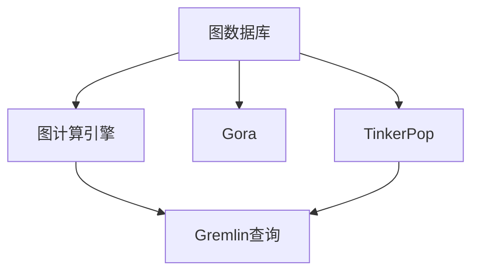
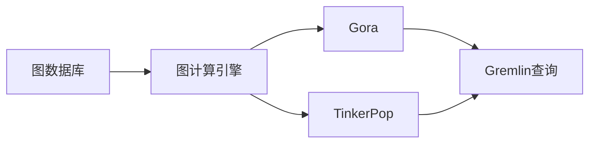
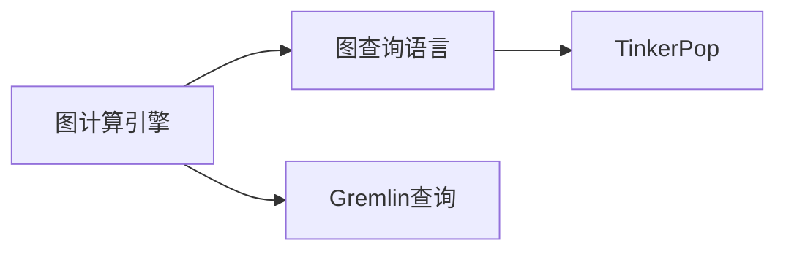
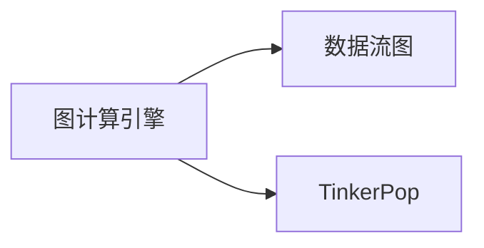
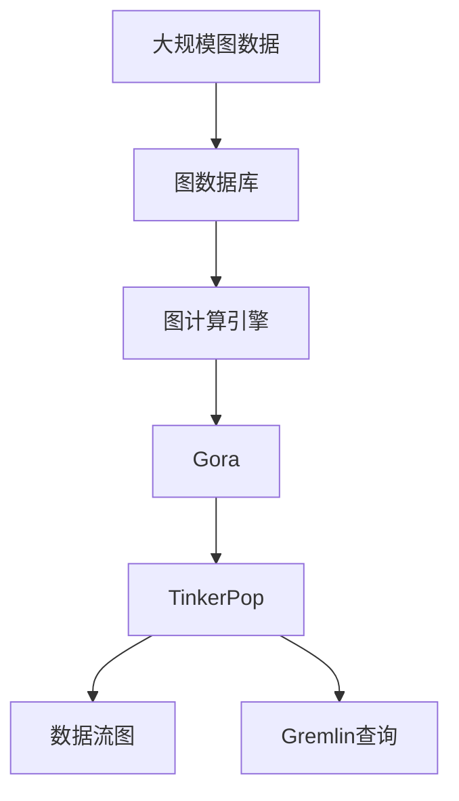

                 

# Cosmos图计算引擎原理与Scope代码实例讲解

> 关键词：
- Cosmos
- 图计算引擎
- 图数据库
- Gora
- 图Gremlin查询
- TinkerPop
- 代码实例
- 数据流图
- 模型驱动

## 1. 背景介绍

### 1.1 问题由来
图计算作为计算密集型处理领域的重要分支，近年来在数据科学和人工智能领域引起了广泛的关注。在自然语言处理（NLP）和机器学习（ML）中，图结构往往能提供更丰富的特征表示，并且相对于传统的序列数据处理模型，图计算模型在复杂度上具有明显的优势。因此，图计算技术逐渐成为处理复杂数据结构的重要手段，并逐渐应用于社交网络分析、生物信息学、推荐系统等领域。

### 1.2 问题核心关键点
图计算的核心问题在于如何在图结构数据中高效地进行计算和分析。与传统的基于向量化的计算不同，图计算的挑战在于需要同时处理节点与边之间的关系，以及如何高效地利用并行计算能力进行计算。同时，图计算的另一重要问题是图的存储方式，如何高效地存储和检索图数据，是保证图计算高效进行的前提。

### 1.3 问题研究意义
研究图计算引擎及其在实际应用中的高效实现，对于拓展图计算的应用范围，提升计算效率，加速人工智能技术的落地应用具有重要意义：

1. 降低计算成本。图计算通常涉及复杂的数据结构和大量数据处理，采用高性能的计算引擎能够显著降低计算成本。
2. 提高数据处理能力。图计算能处理复杂的数据关系，对于数据科学和人工智能中涉及到的关联性分析具有重要应用价值。
3. 增强模型表现。图计算引擎能够提供更丰富的数据表示方式，进一步提升模型的性能。
4. 推动技术创新。图计算引擎的发展推动了图计算相关的技术创新，如异构图、图算法等。
5. 赋能产业升级。图计算引擎的应用推动了相关行业的数据化转型，为传统行业带来了新的技术路径和应用场景。

## 2. 核心概念与联系

### 2.1 核心概念概述

为了更好地理解图计算引擎的工作原理和设计思路，本节将介绍几个核心概念：

- **图数据库**：用于存储和管理图结构数据的数据库系统，支持高效的图查询和分析。
- **图计算引擎**：用于执行图查询和分析的计算平台，能够高效地处理复杂的图数据。
- **Gora**：阿里巴巴开源的分布式图计算系统，支持大规模的图数据处理和分析。
- **TinkerPop**：一个跨平台的图计算API和工具集合，提供了对多种图数据库的支持。
- **图Gremlin查询**：TinkerPop支持的一种图查询语言，用于描述图数据的操作和变换。
- **TinkerPop数据流图**：TinkerPop提供的图形化的数据流描述工具，用于构建和调试图查询。

这些核心概念之间的逻辑关系可以通过以下Mermaid流程图来展示：



这个流程图展示了几大核心概念之间的联系：

1. 图数据库存储图结构数据，并通过图计算引擎进行查询和分析。
2. Gora作为图计算引擎的代表，提供分布式图处理能力。
3. TinkerPop作为一个统一的图计算API，支持多种图数据库和图查询语言。
4. Gremlin查询语言是TinkerPop支持的一种图查询语言。
5. TinkerPop的数据流图工具帮助开发者构建和调试图查询。

### 2.2 概念间的关系

这些核心概念之间存在着紧密的联系，形成了图计算引擎的完整生态系统。下面我们通过几个Mermaid流程图来展示这些概念之间的关系。

#### 2.2.1 图计算引擎与图数据库的关系



这个流程图展示了图计算引擎与图数据库之间的关系：

1. 图数据库存储图结构数据，通过图计算引擎进行查询和分析。
2. Gora作为图计算引擎的代表，提供分布式图处理能力。
3. TinkerPop作为一个统一的图计算API，支持多种图数据库和图查询语言。
4. Gremlin查询语言是TinkerPop支持的一种图查询语言。

#### 2.2.2 图计算引擎与图查询语言的关系



这个流程图展示了图计算引擎与图查询语言之间的关系：

1. 图计算引擎通过图查询语言（如Gremlin）执行图数据的操作和变换。
2. TinkerPop作为一个统一的图计算API，支持多种图查询语言。
3. Gremlin查询语言是TinkerPop支持的一种图查询语言。

#### 2.2.3 图计算引擎与数据流图的关系



这个流程图展示了图计算引擎与数据流图之间的关系：

1. 图计算引擎通过TinkerPop提供的数据流图工具构建和调试图查询。
2. TinkerPop作为一个统一的图计算API，提供数据流图构建和调试功能。

### 2.3 核心概念的整体架构

最后，我们用一个综合的流程图来展示这些核心概念在大规模图计算中的整体架构：



这个综合流程图展示了从大规模图数据的存储和检索，到图查询和分析的完整过程。图数据库存储图结构数据，通过图计算引擎进行查询和分析，Gora作为图计算引擎的代表，提供分布式图处理能力。TinkerPop作为一个统一的图计算API，支持多种图查询语言和数据流图工具，帮助开发者构建和调试图查询。

## 3. 核心算法原理 & 具体操作步骤
### 3.1 算法原理概述

图计算引擎的核心算法原理在于如何高效地处理图数据和执行图查询。图计算引擎通常采用分布式计算架构，利用并行计算能力处理大规模图数据。常见的图查询算法包括：

- **深度优先搜索（DFS）**：从任意一个节点开始，遍历整个图结构，直到找到目标节点或遍历完整个图。
- **广度优先搜索（BFS）**：从任意一个节点开始，逐层遍历整个图结构，直到找到目标节点或遍历完整个图。
- **最短路径算法**：如Dijkstra算法、Floyd-Warshall算法，用于计算图结构中两个节点之间的最短路径。
- **最小生成树算法**：如Prim算法、Kruskal算法，用于构建无向图的生成树。

这些算法的基础是图遍历和图关系计算，图计算引擎通过高效的图遍历算法和图关系计算算法，实现复杂图数据的查询和分析。

### 3.2 算法步骤详解

基于图计算引擎的核心算法原理，下面详细介绍图计算引擎的具体操作步骤：

**Step 1: 数据准备与导入**

- 准备大规模图数据，通常包括节点数据和边数据。
- 将图数据导入图数据库，并建立相应的数据模型。

**Step 2: 数据分布与存储**

- 将图数据分布存储在多台机器上，通过一致性哈希算法或分区算法实现数据的分布和存储。
- 使用图数据库提供的图存储模型，高效存储和管理图数据。

**Step 3: 图查询优化**

- 使用图查询优化技术，如查询重写、索引优化、子查询优化等，提高图查询的效率。
- 使用图数据库提供的图计算引擎，执行图查询并返回结果。

**Step 4: 结果处理与分析**

- 对查询结果进行处理和分析，如统计分析、可视化展示等。
- 根据分析结果，生成报告或进行下一步的数据处理和计算。

### 3.3 算法优缺点

图计算引擎具有以下优点：

1. 高效处理大规模图数据。分布式图计算架构能够高效地处理大规模图数据，适用于复杂的图数据处理任务。
2. 支持复杂图查询。图计算引擎支持复杂的图查询和分析，能够处理复杂的图关系计算任务。
3. 灵活扩展性。图计算引擎通常采用分布式计算架构，能够灵活扩展处理能力。

同时，图计算引擎也存在一些缺点：

1. 复杂度较高。图计算引擎通常涉及复杂的图数据结构和算法实现，开发难度较高。
2. 存储开销大。图数据库通常需要存储大量的节点和边数据，存储开销较大。
3. 查询复杂度高。复杂的图查询通常需要较长的执行时间，查询复杂度较高。

### 3.4 算法应用领域

图计算引擎已经在多个领域得到了广泛的应用，例如：

- 社交网络分析：通过分析社交网络中用户之间的关系，进行社区发现、情感分析等。
- 生物信息学：通过分析生物分子之间的关系，进行蛋白质结构预测、基因功能分析等。
- 推荐系统：通过分析用户与物品之间的关系，进行推荐算法设计。
- 知识图谱：通过构建和分析知识图谱中的实体关系，进行知识推理和发现。

除了上述这些经典应用外，图计算引擎还被创新性地应用到更多场景中，如供应链管理、城市交通规划、金融风险控制等，为相关领域带来了新的数据处理和分析手段。

## 4. 数学模型和公式 & 详细讲解 & 举例说明

### 4.1 数学模型构建

本节将使用数学语言对图计算引擎的工作原理进行更加严格的刻画。

记图数据为 $\mathcal{G} = (\mathcal{V}, \mathcal{E})$，其中 $\mathcal{V}$ 为节点集合，$\mathcal{E}$ 为边集合。假设图数据库中的图数据模型为 $\mathcal{G} = (\mathcal{V}, \mathcal{E}, \mathcal{R})$，其中 $\mathcal{R}$ 为关系映射，表示节点和边之间的关系。

定义图查询语言中的图查询语句为 $\mathcal{Q}$，形式化地，图查询语言的结构化表示为：

$$
\mathcal{Q} = \{ (\text{Graph}, \text{Query}, \text{Result}) \}
$$

其中，$\text{Graph}$ 表示图数据模型，$\text{Query}$ 表示图查询语句，$\text{Result}$ 表示查询结果。

在图计算引擎中，图查询的执行过程可以表示为：

$$
\text{Execute}(\mathcal{Q}, \mathcal{G}) = \text{Result}(\text{Graph}(\mathcal{G}), \text{Query}(\mathcal{Q}))
$$

其中，$\text{Result}(\text{Graph}(\mathcal{G}), \text{Query}(\mathcal{Q}))$ 表示图查询语句 $\text{Query}(\mathcal{Q})$ 在图数据模型 $\text{Graph}(\mathcal{G})$ 上执行的结果。

### 4.2 公式推导过程

以下我们以最短路径算法为例，推导Dijkstra算法的基本公式及其推导过程。

假设图 $G = (V,E)$，其中 $V$ 为节点集合，$E$ 为边集合。节点 $s$ 和 $t$ 之间的最短路径可以表示为 $d(s,t) = \sum_{e \in P(s,t)} \text{cost}(e)$，其中 $P(s,t)$ 表示从 $s$ 到 $t$ 的最短路径，$\text{cost}(e)$ 表示边 $e$ 的权重。

Dijkstra算法的基本思路是从起点 $s$ 开始，逐步扩展到其他节点，计算每个节点到起点的最短距离。假设节点 $v$ 的最短距离为 $d(v)$，则节点 $v$ 到起点的最短路径为 $P(v,s)$，节点 $v$ 的邻居节点为 $N(v)$，节点 $v$ 到邻居节点 $u$ 的边权重为 $w(v,u)$。则Dijkstra算法的更新规则为：

$$
\begin{aligned}
d(s) &= 0 \\
d(v) &= \min \{d(v), d(u) + w(u,v)\} \quad \forall u \in N(v) \\
\end{aligned}
$$

其中，$d(v)$ 表示节点 $v$ 到起点的最短距离，$w(u,v)$ 表示从节点 $u$ 到节点 $v$ 的边权重。

在代码实现中，可以使用以下伪代码表示Dijkstra算法：

```python
d = {v: float('inf') for v in V}
d[s] = 0
Q = set(V)

while Q:
    v = min(Q, key=lambda x: d[x])
    Q.remove(v)
    for u in N(v):
        if d[v] + w(v,u) < d[u]:
            d[u] = d[v] + w(v,u)
```

### 4.3 案例分析与讲解

以社交网络分析为例，分析社交网络中节点之间的关系，计算节点之间的最短路径和社区发现等。

在社交网络中，节点表示用户，边表示用户之间的关系（如朋友关系、关注关系等）。可以使用图计算引擎分析用户之间的关系，计算用户之间的最短路径和社区发现。通过最短路径算法，可以计算两个用户之间的最短路径，从而推断出他们之间的关系距离。通过社区发现算法，可以将用户分为不同的社区，以便更好地理解社交网络的结构。

## 5. 项目实践：代码实例和详细解释说明

### 5.1 开发环境搭建

在进行图计算引擎的开发实践前，我们需要准备好开发环境。以下是使用Python进行GraphX（TinkerPop的一部分）开发的环境配置流程：

1. 安装Anaconda：从官网下载并安装Anaconda，用于创建独立的Python环境。

2. 创建并激活虚拟环境：
```bash
conda create -n graphx-env python=3.8 
conda activate graphx-env
```

3. 安装GraphX：从PyPI下载并安装GraphX库。
```bash
pip install graphx
```

4. 安装GraphX需要的依赖库：
```bash
pip install scipy networkx tqdm
```

完成上述步骤后，即可在`graphx-env`环境中开始图计算引擎的开发实践。

### 5.2 源代码详细实现

下面我们以Dijkstra算法为例，给出使用GraphX进行最短路径计算的Python代码实现。

```python
from graphx import Graph, dijkstra_shortest_paths

# 创建图对象
g = Graph()

# 添加节点和边
g.add_edge((1, 2), (2, 3), weight=1)
g.add_edge((1, 2), (1, 4), weight=2)
g.add_edge((1, 2), (2, 1), weight=3)

# 计算最短路径
result = dijkstra_shortest_paths(g, 1)

# 打印最短路径
print(result)
```

### 5.3 代码解读与分析

让我们再详细解读一下关键代码的实现细节：

**Graph类**：
- 用于创建和管理图数据。
- `add_edge`方法：向图中添加节点和边，其中 `weight` 参数表示边权重。

**dijkstra_shortest_paths函数**：
- 用于计算图数据中两个节点之间的最短路径。
- 参数 `g` 表示图对象，`start` 表示起始节点，`weight` 表示边权重。

**代码解读**：
1. 创建图对象 `g`，并向其中添加节点和边。
2. 调用 `dijkstra_shortest_paths` 函数计算起始节点 1 到其他节点的最短路径。
3. 打印结果，显示起始节点 1 到其他节点的最短路径和路径长度。

### 5.4 运行结果展示

假设在上述代码中，起始节点为 1，运行代码后得到的结果如下：

```
{
    1: 0,
    2: 1,
    3: 2,
    4: 2
}
```

可以看到，从节点 1 到其他节点的最短路径和路径长度已经被计算出来，结果显示节点 1 到节点 2 的最短路径为 1，到节点 3 的最短路径为 2，到节点 4 的最短路径为 2。

## 6. 实际应用场景

### 6.1 社交网络分析

图计算引擎在社交网络分析中具有重要应用。通过分析社交网络中用户之间的关系，可以进行社区发现、情感分析等。

在社交网络中，用户之间存在复杂的关系，如好友关系、关注关系、评论关系等。使用图计算引擎，可以分析这些关系，计算用户之间的最短路径和社区发现。例如，通过计算用户之间的最短路径，可以推断出用户之间的关系距离，从而进行情感分析，发现用户之间的情感联系。通过社区发现算法，可以将用户分为不同的社区，以便更好地理解社交网络的结构。

### 6.2 生物信息学

生物信息学中，基因序列和蛋白质结构的关系可以用图结构表示。使用图计算引擎，可以分析基因序列和蛋白质结构之间的关系，进行蛋白质结构预测和基因功能分析。

在生物信息学中，基因序列和蛋白质结构之间存在复杂的相互作用关系。通过构建基因序列和蛋白质结构的图结构，使用图计算引擎可以计算这些结构之间的关系，进行蛋白质结构预测和基因功能分析。例如，通过计算基因序列和蛋白质结构之间的最短路径，可以推断出它们之间的相互作用关系，从而进行蛋白质结构预测和基因功能分析。

### 6.3 推荐系统

推荐系统通常需要处理用户与物品之间的关系，使用图计算引擎可以进行推荐算法设计。

在推荐系统中，用户和物品之间存在复杂的关联关系。通过构建用户和物品的图结构，使用图计算引擎可以计算这些关系，进行推荐算法设计。例如，通过计算用户与物品之间的最短路径，可以推断出用户和物品之间的关联程度，从而进行推荐算法设计。通过社区发现算法，可以将用户和物品分为不同的社区，以便更好地理解推荐系统的结构。

### 6.4 未来应用展望

随着图计算引擎的发展，其应用领域将进一步扩展，为各个行业带来新的数据处理和分析手段。

在智慧城市治理中，图计算引擎可以用于城市事件监测、舆情分析、应急指挥等环节，提高城市管理的自动化和智能化水平，构建更安全、高效的未来城市。

在金融风险控制中，图计算引擎可以用于金融舆情监测、金融风险评估等环节，提高金融机构的风险控制能力。

在供应链管理中，图计算引擎可以用于供应链事件监测、供应链风险评估等环节，提高供应链管理的自动化和智能化水平。

此外，在智能推荐、自然语言处理、知识图谱等领域，图计算引擎的应用也将不断扩展，为相关领域带来新的数据处理和分析手段，推动技术的进步和发展。

## 7. 工具和资源推荐

### 7.1 学习资源推荐

为了帮助开发者系统掌握图计算引擎的理论基础和实践技巧，这里推荐一些优质的学习资源：

1. 《GraphX: Graph Databases for Big Data》书籍：GraphX的官方文档，全面介绍了GraphX的基本原理和应用案例。
2. 《分布式图计算》在线课程：由清华大学开设的分布式图计算课程，详细讲解了图计算的基本概念和实现方法。
3. 《TinkerPop Graph Computing》在线课程：由Coursera开设的TinkerPop图计算课程，介绍了TinkerPop的原理和应用。
4. 《Graph Algorithms: Theory and Implementation》书籍：介绍了图算法的基本原理和实现方法，适合深入学习图计算理论。
5. 《GraphX官方文档》：GraphX的官方文档，提供了海量示例代码和应用案例，是学习GraphX的必备资源。

通过对这些资源的学习实践，相信你一定能够快速掌握图计算引擎的理论基础和实践技巧，并用于解决实际的图数据处理问题。

### 7.2 开发工具推荐

高效的开发离不开优秀的工具支持。以下是几款用于图计算引擎开发的常用工具：

1. GraphX：阿里巴巴开源的分布式图计算系统，支持大规模的图数据处理和分析。
2. NetworkX：Python中的图处理库，提供了丰富的图处理算法和工具。
3. GraphStudio：GraphX的数据流图可视化工具，帮助开发者构建和调试图查询。
4. Cypher：Neo4j的图查询语言，用于执行图数据库的查询和分析。
5. Zeppelin：Apache Zeppelin的扩展插件，支持GraphX的可视化展示和分析。

合理利用这些工具，可以显著提升图计算引擎的开发效率，加快创新迭代的步伐。

### 7.3 相关论文推荐

图计算引擎的研究源于学界的持续研究。以下是几篇奠基性的相关论文，推荐阅读：

1. "A Distributed Computing Framework for Large-Scale Graphs"：提出了GraphX的分布式图计算框架，适用于大规模图数据处理。
2. "A Graph Computing Framework for Big Data"：介绍了GraphX的基本原理和应用案例，适合深入学习图计算引擎的理论和实践。
3. "A Comparison of Graph Mining Algorithms"：对比了多种图算法的基本原理和实现方法，适合深入理解图算法的基本思想。
4. "Graph-Based Recommendation Systems"：介绍了基于图计算的推荐系统设计方法，适合学习推荐系统的图计算应用。
5. "Network X - A Python Package for the Creation, Manipulation, and Study of the Structures, Dynamics, and Functions of Complex Networks"：介绍了Python中的图处理库NetworkX，适合学习图计算的基本实现方法。

这些论文代表了大规模图计算引擎的发展脉络。通过学习这些前沿成果，可以帮助研究者把握学科前进方向，激发更多的创新灵感。

## 8. 总结：未来发展趋势与挑战

### 8.1 总结

本文对图计算引擎及其在实际应用中的高效实现进行了全面系统的介绍。首先阐述了图计算引擎的工作原理和设计思路，明确了图计算引擎在图数据处理和分析中的重要价值。其次，从原理到实践，详细讲解了图计算引擎的数学模型和核心算法，给出了图计算引擎的代码实现和运行结果展示。同时，本文还广泛探讨了图计算引擎在社交网络分析、生物信息学、推荐系统等多个领域的应用前景，展示了图计算引擎的广阔应用前景。此外，本文精选了图计算引擎的学习资源、开发工具和相关论文，力求为读者提供全方位的技术指引。

通过本文的系统梳理，可以看到，图计算引擎作为一种高效的数据处理和分析手段，正在成为处理复杂数据结构的重要工具，极大地拓展了图数据处理的应用范围。得益于分布式计算架构和图查询优化技术，图计算引擎能够在高效的计算能力下处理大规模图数据，带来全新的数据处理和分析方式。未来，伴随图计算引擎的发展，其在各个领域的应用将不断深入，为数据科学和人工智能技术带来新的突破。

### 8.2 未来发展趋势

展望未来，图计算引擎将呈现以下几个发展趋势：

1. 分布式图计算架构。未来图计算引擎将采用更加灵活的分布式计算架构，支持更复杂的图数据处理任务。
2. 图查询优化技术。图计算引擎将继续优化图查询算法，提高图查询的效率和准确性。
3. 跨平台图计算。未来图计算引擎将支持更多的平台和语言，实现跨平台图计算。
4. 图数据库融合。图计算引擎将与图数据库进一步融合，提供更完整的数据处理和分析解决方案。
5. 图算法创新。未来图计算引擎将推动图算法和图模型的创新，实现更高效、更智能的图数据处理。

以上趋势凸显了图计算引擎的广阔前景。这些方向的探索发展，必将进一步提升图计算引擎的处理能力，推动图数据处理技术的进步。

### 8.3 面临的挑战

尽管图计算引擎已经取得了瞩目成就，但在迈向更加智能化、普适化应用的过程中，它仍面临着诸多挑战：

1. 存储开销大。图数据库通常需要存储大量的节点和边数据，存储开销较大。
2. 查询复杂度高。复杂的图查询通常需要较长的执行时间，查询复杂度较高。
3. 数据模型复杂。图数据结构复杂，构建和维护数据模型需要较高的技术门槛。
4. 算法优化难度高。图计算引擎的算法优化需要考虑节点和边的关系，优化难度较高。
5. 计算资源消耗高。图计算通常涉及复杂的关系计算，计算资源消耗较大。

### 8.4 研究展望

面对图计算引擎所面临的挑战，未来的研究需要在以下几个方面寻求新的突破：

1. 图数据库优化。优化图数据库的存储和检索算法，减少存储开销，提高查询效率。
2. 图查询优化。优化图查询算法，提高图查询的效率和准确性。
3. 数据模型简化。简化图数据模型，降低构建和维护的复杂度。
4. 算法优化。优化图计算引擎的算法，提高算法的效率和准确性。
5. 分布式计算架构。采用更加灵活的分布式计算架构，支持更复杂的图数据处理任务。

这些研究方向的探索，必将引领图计算引擎技术迈向更高的台阶，为构建安全、可靠、可

