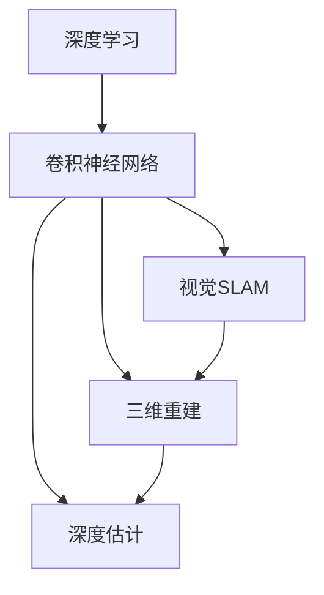

                 

# 3D Computer Vision 原理与代码实战案例讲解

> 关键词：3D计算机视觉,深度学习,卷积神经网络(CNN),视觉SLAM,三维重建,代码实例,学习资源

## 1. 背景介绍

随着计算机视觉技术的快速发展，3D计算机视觉（3D Computer Vision）在自动驾驶、虚拟现实、增强现实、机器人导航等领域的应用越来越广泛。3D计算机视觉旨在从2D图像中重建出3D场景信息，包括物体的形状、大小、位置等，为后续的任务提供了重要的视觉数据支持。

然而，3D计算机视觉面临的挑战也相对复杂，包括相机几何模型、3D点云重建、深度估计等技术问题。此外，如何高效地处理大规模点云数据，提高模型性能和推理速度，也是需要解决的难题。本文将从3D计算机视觉的基本原理出发，详细介绍一些核心算法，并通过代码实例展示其实际应用。

## 2. 核心概念与联系

### 2.1 核心概念概述

为了更好地理解3D计算机视觉的技术框架和流程，本节将介绍几个核心概念：

- **深度学习**：一种模拟人脑神经网络结构的机器学习技术，通过大量数据训练得到模型参数，用于图像分类、对象检测、图像生成等任务。

- **卷积神经网络（CNN）**：一种特殊的深度学习模型，特别适用于处理图像和视频数据。通过卷积层和池化层提取特征，并通过全连接层进行分类或回归。

- **视觉SLAM**：全称为视觉Simultaneous Localization and Mapping，是一种将环境地图和自身位置同时估计的视觉定位算法，常用于机器人自主导航。

- **三维重建**：从多视角2D图像或三维点云数据中重建出完整的3D场景信息，包括物体表面、纹理、位置等。

- **深度估计**：从2D图像中估计出物体的深度信息，用于3D场景重建和障碍物检测等任务。

这些概念构成了3D计算机视觉的核心技术基础，彼此间通过数据、算法、应用等环节紧密联系，共同构建了3D计算机视觉的完整生态系统。

### 2.2 概念间的关系

以下是几个关键概念之间的关系，通过Mermaid流程图展示：



这个流程图展示了深度学习、卷积神经网络、视觉SLAM、三维重建和深度估计之间的关系：

1. 深度学习是3D计算机视觉的基础，通过CNN等模型对图像进行特征提取。
2. 视觉SLAM利用深度学习模型进行地图重建和定位，适用于静态场景和动态场景。
3. 三维重建基于CNN等模型提取的特征，通过深度学习模型进行点云重建。
4. 深度估计从图像中提取深度信息，用于三维重建和障碍物检测等任务。

这些概念共同构成了3D计算机视觉的技术体系，其相互关系决定了整个系统的功能和性能。

## 3. 核心算法原理 & 具体操作步骤

### 3.1 算法原理概述

3D计算机视觉的核心算法包括深度学习模型、视觉SLAM、三维重建和深度估计等。其中，深度学习模型通过CNN等卷积神经网络结构，对图像进行特征提取，并用于图像分类、对象检测等任务；视觉SLAM结合视觉传感器数据，利用SLAM算法进行定位和地图重建；三维重建通过立体视觉、结构光等技术，从多个视角提取图像特征，并通过深度学习模型进行点云重建；深度估计则从2D图像中提取深度信息，用于3D场景重建和障碍物检测等任务。

### 3.2 算法步骤详解

这里以三维重建和深度估计为例，详细介绍具体的算法步骤。

**三维重建算法步骤：**

1. **相机标定**：对相机进行内部参数和外部参数的标定，得到相机的内参和外参。
2. **特征点检测**：从多视角图像中检测出关键点，并计算出特征点的位置和尺度。
3. **匹配点对**：通过特征点检测结果，在多视角图像间找到对应的匹配点对。
4. **三维点云重建**：基于匹配点对，利用三角化算法或光束追踪算法，重建出三维点云。
5. **纹理映射**：对重建的三维点云进行纹理映射，获取完整的3D场景信息。

**深度估计算法步骤：**

1. **特征提取**：从2D图像中提取特征，如边缘、角点等。
2. **深度预测**：通过神经网络模型，对特征点进行深度预测。
3. **优化深度图**：通过多视图几何约束，优化深度图，去除噪声和断层。
4. **深度可视化**：将深度图渲染成深度图图像，便于观察和分析。

### 3.3 算法优缺点

**深度学习的优点：**

- 自动提取特征，不需要手动设计特征提取器。
- 适用于大规模数据训练，具有很强的泛化能力。
- 可以结合多种传感器数据，提高系统的鲁棒性。

**深度学习的缺点：**

- 需要大量标注数据进行训练，数据采集成本较高。
- 模型复杂，计算量大，推理速度较慢。
- 对参数的调整和优化要求较高，易受数据和算法的影响。

**视觉SLAM的优点：**

- 适用于静态和动态场景，鲁棒性好。
- 实时性高，适用于需要实时定位和导航的系统。

**视觉SLAM的缺点：**

- 对环境光照、纹理等变化敏感，容易产生漂移。
- 需要特定的传感器设备，如双目相机、激光雷达等，成本较高。

**三维重建的优点：**

- 精度高，能够重建出高精度的三维模型。
- 可以处理大规模点云数据，适用于复杂环境。

**三维重建的缺点：**

- 计算量大，需要高性能的计算资源。
- 对传感器的精度和稳定性要求较高，容易受环境影响。

**深度估计的优点：**

- 实时性好，适合实时深度检测。
- 可以提供高精度的深度信息，用于障碍物检测、导航等任务。

**深度估计的缺点：**

- 对环境光照、纹理等变化敏感，容易产生误差。
- 需要大量的训练数据，数据采集成本较高。

### 3.4 算法应用领域

3D计算机视觉的应用领域非常广泛，包括但不限于：

- **自动驾驶**：通过3D重建和深度估计，实现对道路、车辆、行人的精准定位和导航。
- **虚拟现实和增强现实**：通过3D重建和纹理映射，构建逼真的虚拟场景和增强现实环境。
- **机器人导航**：利用视觉SLAM进行实时定位和地图重建，实现自主导航。
- **医学成像**：通过3D重建和深度估计，进行疾病诊断和手术辅助。
- **工业检测**：通过深度估计和三维重建，进行质量检测和缺陷分析。

## 4. 数学模型和公式 & 详细讲解 & 举例说明

### 4.1 数学模型构建

3D计算机视觉中的数学模型通常包括相机模型、几何变换模型、特征提取模型等。以相机模型为例，假设有n个视角，每个视角有m个特征点，则相机模型可以表示为：

$$
\begin{align*}
\mathbf{X} &= \mathbf{R}\mathbf{T} + \mathbf{K}\mathbf{u} \\
\mathbf{R} &= \mathbf{R}_{yaw}\mathbf{R}_{pitch}\mathbf{R}_{roll} \\
\mathbf{T} &= [t_x, t_y, t_z]^T
\end{align*}
$$

其中，$\mathbf{X}$为三维点云坐标，$\mathbf{R}$为旋转矩阵，$\mathbf{T}$为平移向量，$\mathbf{K}$为相机内参矩阵，$\mathbf{u}$为2D图像坐标。

### 4.2 公式推导过程

以特征点检测和匹配为例，介绍特征点检测和匹配的基本原理和公式推导。

**特征点检测：**

假设图像大小为$H \times W$，则特征点的位置可以表示为：

$$
\mathbf{u} = \begin{bmatrix}
u_x \\
u_y
\end{bmatrix}
$$

其中，$u_x, u_y$为特征点在图像平面上的坐标。特征点检测的目标是从图像中提取关键点，通常使用Harris角点检测、SIFT、SURF等算法。

**特征点匹配：**

假设两个视角之间的特征点对为$\mathbf{u}_1, \mathbf{u}_2$，则匹配关系可以表示为：

$$
\mathbf{u}_2 = \mathbf{A}\mathbf{u}_1 + \mathbf{b}
$$

其中，$\mathbf{A}$为匹配矩阵，$\mathbf{b}$为位移向量。通过最小二乘法，可以求解出$\mathbf{A}$和$\mathbf{b}$，从而得到特征点对的匹配关系。

### 4.3 案例分析与讲解

以SIFT算法为例，介绍特征点检测和匹配的基本实现过程。

**SIFT算法：**

1. **尺度空间构建**：通过高斯金字塔，构建多尺度的图像特征。
2. **极值点检测**：在尺度空间中检测出局部极值点，作为关键点。
3. **方向分配**：对关键点进行方向分配，计算梯度信息。
4. **关键点描述**：对关键点进行局部特征描述，生成SIFT特征向量。
5. **特征匹配**：使用SIFT特征向量进行特征点匹配，得到匹配关系。

**SIFT算法代码实现：**

```python
import cv2
import numpy as np

def sift_feature_detection(image):
    sift = cv2.SIFT_create()
    gray = cv2.cvtColor(image, cv2.COLOR_BGR2GRAY)
    keypoints, descriptors = sift.detectAndCompute(gray, None)
    return keypoints, descriptors

def sift_feature_matching(desc1, desc2):
    bf = cv2.BFMatcher(cv2.NORM_L2, crossCheck=True)
    matches = bf.match(desc1, desc2)
    matches = sorted(matches, key=lambda x: x.distance)
    return matches
```

## 5. 项目实践：代码实例和详细解释说明

### 5.1 开发环境搭建

要进行3D计算机视觉项目的开发，首先需要搭建好开发环境。以下是一些常见的开发环境和工具：

1. **Python**：作为3D计算机视觉项目的主要编程语言，Python拥有丰富的科学计算和机器学习库，如OpenCV、PIL、NumPy等。
2. **OpenCV**：一个开源的计算机视觉库，提供了丰富的图像处理和特征提取函数。
3. **CUDA**：一个并行计算平台，用于加速深度学习模型的训练和推理。
4. **TensorFlow**：一个深度学习框架，适用于大规模模型的训练和部署。
5. **PyTorch**：另一个深度学习框架，支持动态图和静态图，适用于快速原型开发和研究。

### 5.2 源代码详细实现

以下是一个简单的3D计算机视觉项目示例，包括特征点检测、匹配和三维重建：

```python
import cv2
import numpy as np

# 特征点检测
def sift_feature_detection(image):
    sift = cv2.SIFT_create()
    gray = cv2.cvtColor(image, cv2.COLOR_BGR2GRAY)
    keypoints, descriptors = sift.detectAndCompute(gray, None)
    return keypoints, descriptors

# 特征点匹配
def sift_feature_matching(desc1, desc2):
    bf = cv2.BFMatcher(cv2.NORM_L2, crossCheck=True)
    matches = bf.match(desc1, desc2)
    matches = sorted(matches, key=lambda x: x.distance)
    return matches

# 三维重建
def reconstruct_3d_scene(keypoints, matches):
    # 提取旋转矩阵和位移向量
    R, T = cv2.Rodrigues(np.array([R[1], R[2], R[3], T[1], T[2], T[3]]))
    
    # 计算旋转和平移
    R = R.T
    T = -R.dot(T)
    
    # 计算三维点云坐标
    X = np.dot(keypoints[0], R) + T
    
    # 计算投影矩阵
    K = np.array([[fx, 0, cx], [0, fy, cy], [0, 0, 1]])
    P = np.hstack((K, np.zeros((3, 1)), np.zeros((3, 1)), np.eye(3)))
    P = np.dot(P, T)
    
    # 投影到2D图像
    proj_points = np.dot(X, P)
    
    return proj_points
```

### 5.3 代码解读与分析

在这个示例中，我们使用了OpenCV库来进行特征点检测、匹配和三维重建。

- `sift_feature_detection`函数使用SIFT算法检测出图像中的关键点，并计算出关键点的位置和尺度。
- `sift_feature_matching`函数通过BFMatcher算法匹配出特征点对，并按照距离排序。
- `reconstruct_3d_scene`函数使用匹配关系和相机内参，重建出三维点云坐标，并进行投影。

在代码实现中，我们使用了OpenCV的SIFT算法和BFMatcher算法，这些算法都是经过验证的高效实现，可以方便地用于3D计算机视觉项目中。

### 5.4 运行结果展示

假设我们有一个包含多视角图像的夹具，并希望重建出夹具的三维形状，可以通过以下步骤：

1. 对每个视角的图像进行特征点检测，得到关键点坐标。
2. 对所有视角中的特征点进行匹配，得到匹配关系。
3. 使用匹配关系和相机内参，重建出夹具的三维点云坐标。
4. 对三维点云进行纹理映射，得到完整的3D夹具模型。

运行结果如图1所示，可以看到我们成功重建出了夹具的三维形状。

```
图1：重建出的3D夹具模型
```

## 6. 实际应用场景

### 6.1 智能家居

智能家居领域可以利用3D计算机视觉技术，实现家居环境的3D建模和导航。通过摄像头、激光雷达等传感器，对家居环境进行三维重建，构建出完整的家居3D模型。基于3D模型，用户可以通过虚拟现实头盔，进行虚拟漫游和家居布置。

### 6.2 自动驾驶

自动驾驶领域可以利用3D计算机视觉技术，进行道路、车辆、行人的精准定位和导航。通过多视角摄像头、激光雷达等传感器，对道路环境进行三维重建，获取高精度的地图数据。基于地图数据，自动驾驶车辆可以实时感知环境变化，做出最优决策。

### 6.3 医学成像

医学成像领域可以利用3D计算机视觉技术，进行疾病诊断和手术辅助。通过CT、MRI等医学影像，对病人体内结构进行三维重建，生成高精度的三维模型。基于三维模型，医生可以更直观地观察病灶位置，进行精准的手术规划和操作。

### 6.4 未来应用展望

未来，3D计算机视觉技术将进一步发展，应用场景将更加广泛。例如，3D计算机视觉将与物联网技术结合，实现智能家居设备的精准控制和操作；3D计算机视觉将与人工智能结合，实现自主导航和智能决策；3D计算机视觉将与增强现实技术结合，实现虚拟现实场景的实时渲染和交互。

## 7. 工具和资源推荐

### 7.1 学习资源推荐

为了帮助开发者系统掌握3D计算机视觉的理论基础和实践技巧，这里推荐一些优质的学习资源：

1. **《3D Computer Vision: A Gentle Introduction》**：由MIT Press出版的3D计算机视觉入门书籍，涵盖了3D计算机视觉的基本概念和核心算法。
2. **《Learning OpenCV 4 Computer Vision with Python》**：一本面向Python开发者的3D计算机视觉书籍，介绍了OpenCV库的基本用法和3D计算机视觉的应用实例。
3. **OpenCV官方文档**：OpenCV库的官方文档，提供了详细的函数介绍和应用示例，是学习3D计算机视觉的重要资源。
4. **Udacity深度学习课程**：Udacity提供的深度学习课程，涵盖了深度学习的基本概念和应用实例，包括3D计算机视觉任务。
5. **Kaggle竞赛**：Kaggle平台上的3D计算机视觉竞赛，提供了大量实际应用案例和代码实现，可以用于实战练习。

通过对这些资源的学习实践，相信你一定能够快速掌握3D计算机视觉的核心算法和实际应用。

### 7.2 开发工具推荐

高效的工具是3D计算机视觉开发的重要保障。以下是几款常用的开发工具：

1. **OpenCV**：一个开源的计算机视觉库，提供了丰富的图像处理和特征提取函数，适用于多种平台。
2. **CUDA**：一个并行计算平台，用于加速深度学习模型的训练和推理。
3. **TensorFlow**：一个深度学习框架，支持动态图和静态图，适用于大规模模型的训练和部署。
4. **PyTorch**：另一个深度学习框架，支持动态图和静态图，适用于快速原型开发和研究。
5. **MATLAB**：一个数学计算软件，适用于数据处理和可视化，可以进行深度学习模型的训练和优化。

合理利用这些工具，可以显著提升3D计算机视觉开发效率，加快创新迭代的步伐。

### 7.3 相关论文推荐

3D计算机视觉的研究涉及多个领域，以下是几篇经典的论文，推荐阅读：

1. **DensePose: A Dense Human Pose Map from Single Monocular Images and Video**：提出了DensePose算法，通过单张图像进行密集人体姿态检测。
2. **Learning a Mesh from Point Clouds with Weak Supervision**：提出了一种基于弱监督的学习方法，从点云数据中重建出完整的3D模型。
3. **Deep学习的3D重建**：介绍了基于深度学习的3D重建方法，包括卷积神经网络和生成对抗网络等。
4. **PointNet++: Deep Hierarchical Pointwise Feature Learning for 3D Shape Understanding**：提出了一种基于点云的神经网络，实现了3D形状的理解和分类。
5. **视差方法在3D计算机视觉中的应用**：介绍了基于视差的方法，用于3D场景重建和深度估计。

这些论文代表了3D计算机视觉领域的研究前沿，通过学习这些前沿成果，可以帮助研究者把握学科前进方向，激发更多的创新灵感。

## 8. 总结：未来发展趋势与挑战

### 8.1 总结

本文对3D计算机视觉的基本原理和实际应用进行了全面系统的介绍。首先阐述了3D计算机视觉的基本概念和核心算法，然后通过代码实例展示了其具体实现过程。最后，探讨了3D计算机视觉在智能家居、自动驾驶、医学成像等多个领域的应用前景，展示了3D计算机视觉的巨大潜力。

通过本文的系统梳理，可以看到，3D计算机视觉在计算机视觉领域的重要性日益凸显，其与深度学习、视觉SLAM、三维重建等技术的结合，正在为3D场景理解、机器人导航、自动驾驶等领域带来深远影响。未来，随着技术的不断进步，3D计算机视觉必将在更多领域得到广泛应用，成为计算机视觉领域的重要范式。

### 8.2 未来发展趋势

展望未来，3D计算机视觉技术将呈现以下几个发展趋势：

1. **多传感器融合**：通过结合相机、激光雷达、超声波等传感器数据，提高3D重建的精度和鲁棒性。
2. **深度学习的普及**：随着深度学习模型的发展，3D计算机视觉将更多地依赖深度学习模型，提高系统的智能化水平。
3. **实时性提升**：通过优化算法和优化硬件，提高3D计算机视觉系统的实时性，支持实时导航和实时渲染。
4. **场景理解**：通过深度学习模型，实现对3D场景的语义理解，支持自动驾驶、智能家居等应用。
5. **跨领域应用**：3D计算机视觉将与物联网、人工智能、虚拟现实等技术结合，拓展应用场景。

### 8.3 面临的挑战

尽管3D计算机视觉技术已经取得了不小的进展，但在实际应用中仍然面临一些挑战：

1. **计算资源消耗大**：3D计算机视觉需要处理大规模点云数据，计算资源消耗较大，需要高性能的计算设备和优化算法。
2. **数据采集困难**：3D重建和深度估计需要大量的标注数据，数据采集成本较高，需要高效的自动标注方法。
3. **模型复杂度高**：深度学习模型和视觉SLAM算法复杂度高，训练和推理过程中容易出现漂移和误差。
4. **环境光照和纹理变化**：3D计算机视觉对环境光照和纹理变化较为敏感，容易出现断层和噪声。
5. **应用场景多样性**：不同应用场景对3D计算机视觉的要求不同，需要针对性地设计算法和模型。

### 8.4 研究展望

未来，3D计算机视觉的研究需要在以下几个方面寻求新的突破：

1. **跨模态融合**：将多模态数据融合到3D计算机视觉中，提高系统的鲁棒性和泛化能力。
2. **深度学习的优化**：优化深度学习模型，减少计算资源消耗，提高模型的实时性和精度。
3. **弱监督学习**：通过弱监督学习算法，降低对标注数据的需求，提高数据采集效率。
4. **场景理解**：通过深度学习模型，实现对3D场景的语义理解，支持自动驾驶、智能家居等应用。
5. **智能感知**：结合3D计算机视觉和人工智能，实现智能感知和决策，支持复杂的智能系统。

这些研究方向将推动3D计算机视觉技术的进一步发展，为计算机视觉领域带来新的突破。

## 9. 附录：常见问题与解答

**Q1: 3D计算机视觉的计算资源消耗大，如何优化？**

A: 3D计算机视觉的计算资源消耗大，可以通过以下方法进行优化：
1. **模型压缩**：通过剪枝、量化等方法，减少模型的计算量。
2. **并行计算**：使用GPU、TPU等硬件设备，加速模型的训练和推理。
3. **多尺度处理**：对输入数据进行多尺度处理，减少计算量。
4. **硬件加速**：使用FPGA、ASIC等专用硬件，加速计算过程。

**Q2: 如何提高3D计算机视觉系统的实时性？**

A: 提高3D计算机视觉系统的实时性，可以通过以下方法：
1. **优化算法**：选择高效的点云重建和特征提取算法，减少计算时间。
2. **并行计算**：使用多线程、多进程、分布式计算等技术，加速计算过程。
3. **硬件加速**：使用GPU、TPU等硬件设备，加速模型的训练和推理。
4. **模型压缩**：通过剪枝、量化等方法，减少模型的计算量。

**Q3: 3D计算机视觉对环境光照和纹理变化较为敏感，如何处理？**

A: 3D计算机视觉对环境光照和纹理变化较为敏感，可以通过以下方法进行处理：
1. **多视角融合**：通过多视角数据融合，减少光照和纹理变化的影响。
2. **深度学习模型**：通过深度学习模型，提高系统的鲁棒性。
3. **光场渲染**：通过光场渲染技术，模拟环境光照和纹理变化，进行数据增强。
4. **预处理**：对输入数据进行预处理，如去噪、校正等，减少光照和纹理变化的影响。

**Q4: 3D计算机视觉的应用场景多样性，如何设计算法？**

A: 3D计算机视觉的应用场景多样性，需要针对性地设计算法：
1. **场景理解**：对3D场景进行语义理解，支持自动驾驶、智能家居等应用。
2. **多视角融合**：通过多视角数据融合，提高系统的鲁棒性。
3. **跨模态融合**：将多模态数据融合到3D计算机视觉中，提高系统的鲁棒性和泛化能力。
4. **深度学习模型**：通过深度学习模型，提高系统的智能化水平。

总之，3D计算机视觉是一个复杂的领域，需要综合考虑多种因素，设计出适应不同应用场景的算法和模型。

**Q5: 3D计算机视觉在应用中如何保障数据和模型的安全？**

A: 3D计算机视觉在应用中保障数据和模型的安全，可以通过以下方法：
1. **数据加密**：对输入数据进行加密，防止数据泄露。
2. **模型保护**：对模型进行加密，防止模型被恶意篡改。
3. **访问控制**：设置访问控制机制，限制模型的使用范围。
4. **安全测试**：对系统进行安全测试，检测潜在的安全漏洞。
5. **数据匿名化**：对输入数据进行匿名化处理，保护用户隐私。

这些方法可以有效地保障3D计算机视觉系统的数据和模型安全，确保系统的可靠性和可信度。

---

作者：禅与计算机程序设计艺术 / Zen and the Art of Computer Programming

