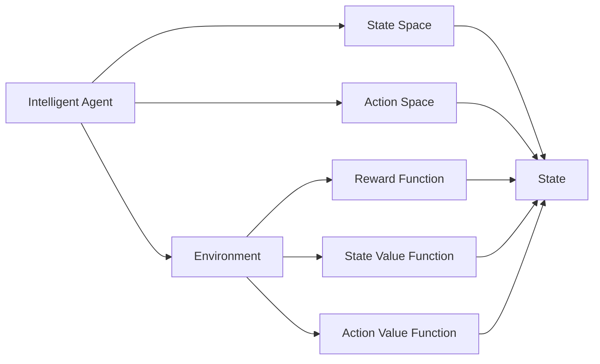
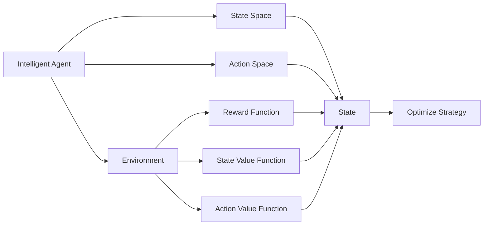

                 

# Deep Reinforcement Learning原理与代码实例讲解

> 关键词：Deep Reinforcement Learning, 强化学习, 深度学习, 动作策略, 状态价值函数, 蒙特卡罗方法, 策略梯度方法, 深度Q-learning, 自适应算法, 环境模拟, 实际应用场景

## 1. 背景介绍

### 1.1 问题由来
强化学习(Reinforcement Learning, RL)作为机器学习的三大领域之一，近年来受到了广泛关注。与监督学习和无监督学习不同，强化学习通过与环境进行交互，让智能体在不断的试错中学习最优策略，实现目标。这一过程类似于人类的学习方式，通过奖惩机制引导行为，从而最大化长期利益。

### 1.2 问题核心关键点
强化学习中的核心问题是设计一个能够自动学习、适应环境的智能体，以实现特定的目标。这通常包括以下几个关键步骤：

1. **环境建模**：定义智能体与环境交互的方式，包括状态空间的构建、动作空间的设计、奖励函数的设计等。
2. **策略设计**：选择或设计一个智能体的策略，即在给定状态下选择动作的概率分布。
3. **价值评估**：估计智能体的状态价值函数或动作价值函数，以便评估策略的好坏。
4. **学习算法**：通过环境反馈（奖励信号）不断优化策略，使得智能体能够逐步接近最优策略。

强化学习在诸多领域取得了显著的成果，包括游戏AI、机器人控制、推荐系统、金融交易等，是实现智能决策的关键技术。

### 1.3 问题研究意义
强化学习在智能决策和自动化控制中具有重要应用价值，其研究意义在于：

1. **实现自主学习**：强化学习能够自动发现和优化策略，无需人工干预，适用于复杂、动态环境。
2. **提升决策效率**：通过不断的学习，智能体能够迅速适应新环境，做出更优决策。
3. **扩展应用边界**：强化学习技术的应用不仅限于游戏，还能够应用于工业控制、金融交易、医疗等领域，带来全新的智能化解决方案。
4. **推动跨学科发展**：强化学习结合了控制理论、优化理论、概率统计等多个领域的知识，是现代计算机科学、数学和工程学交叉融合的重要方向。

## 2. 核心概念与联系

### 2.1 核心概念概述

为了更好地理解强化学习的原理和框架，本节将介绍几个关键概念：

- **强化学习(Reinforcement Learning)**：一种通过与环境交互学习最优决策的机器学习方法。智能体通过执行动作、接收环境反馈（奖励和状态），逐步优化决策策略，以实现长期目标。
- **智能体(Agent)**：在强化学习中执行动作的主体，可以是人工设计的算法或神经网络。
- **环境(Environment)**：智能体与之交互的环境，由状态空间、动作空间和奖励函数构成。
- **状态(State)**：描述环境当前状态的信息，智能体在每个时间步都要观察到当前状态。
- **动作(Action)**：智能体在每个时间步可以选择执行的动作。
- **奖励(Reward)**：环境对智能体执行动作的反馈，通常用于衡量动作的好坏。
- **策略(Policy)**：智能体在每个状态下选择动作的策略，可以是一个确定性的策略或概率性策略。
- **状态价值函数(State Value Function)**：评估当前状态下所有可能动作的长期期望回报，用于评估状态的好坏。
- **动作价值函数(Action Value Function)**：评估在当前状态下执行每个动作的长期期望回报，用于评估动作的好坏。

这些核心概念构成了强化学习的完整框架，其核心思想是通过不断的试错学习，逐步优化智能体的决策策略，实现长期目标。

### 2.2 概念间的关系

这些核心概念之间的关系可以通过以下Mermaid流程图来展示：



这个流程图展示了强化学习的基本架构，包括智能体与环境的交互、状态和动作的空间定义、奖励和价值的评估。通过这些基本要素，强化学习能够实现智能体的自主学习和优化决策。

### 2.3 核心概念的整体架构

最后，我们用一个综合的流程图来展示强化学习的整体架构：



这个综合流程图展示了从智能体与环境交互，到策略优化和价值评估的完整过程。通过不断学习，智能体能够逐步接近最优策略，实现长期目标。

## 3. 核心算法原理 & 具体操作步骤

### 3.1 算法原理概述

强化学习的核心算法包括蒙特卡罗方法、策略梯度方法和深度Q-learning等。这些算法通过不同的方法估计状态价值函数或动作价值函数，进而优化智能体的策略。

**蒙特卡罗方法**：通过模拟智能体与环境交互的过程，直接计算状态价值函数。常用的蒙特卡罗方法有蒙特卡罗蒙特卡罗树搜索(Monte Carlo Tree Search, MCTS)、蒙特卡罗树搜索加多臂赌博机算法(MCTS + Q)等。

**策略梯度方法**：通过最大化策略的期望回报，直接优化策略。常用的策略梯度方法有REINFORCE算法、Actor-Critic算法等。

**深度Q-learning**：将Q-learning与深度学习技术结合，使用神经网络估计Q值，从而优化策略。常用的深度Q-learning方法有Deep Q-Network(DQN)、双重深度Q-learning(Deep Q-Learning with Double DQN)等。

### 3.2 算法步骤详解

以深度Q-learning算法为例，其核心步骤包括：

1. **环境建模**：定义环境的状态空间、动作空间和奖励函数。
2. **策略设计**：选择或设计一个智能体的策略，如贪心策略、随机策略等。
3. **模型训练**：使用神经网络估计动作价值函数，通过经验回放和目标网络更新优化模型参数。
4. **策略优化**：根据估计的动作价值函数，优化智能体的策略。

**具体步骤**：

1. **初始化**：随机初始化智能体的参数，并设定训练轮数。
2. **选择动作**：在当前状态下，根据策略选择动作。
3. **执行动作**：将动作执行于环境中，观察环境反馈。
4. **更新Q值**：根据奖励信号和下一个状态，使用Q值更新公式计算新的Q值。
5. **回放经验**：将智能体的经验存储于经验缓冲区中，用于后续训练。
6. **更新模型**：使用神经网络估计Q值，通过经验回放和目标网络更新优化模型参数。
7. **策略优化**：根据估计的动作价值函数，优化智能体的策略。

### 3.3 算法优缺点

深度Q-learning算法具有以下优点：

1. **适用于连续动作空间**：Q-learning只适用于离散动作空间，而深度Q-learning能够处理连续动作空间。
2. **可扩展性强**：神经网络能够处理任意复杂的非线性关系，适用于多种复杂环境。
3. **泛化能力强**：通过大量的经验数据，深度Q-learning能够学习到更泛化的Q值函数。

但其缺点也较为明显：

1. **训练时间长**：神经网络需要较长的训练时间，特别是在参数较多的情况下。
2. **模型复杂度高**：神经网络具有较强的非线性拟合能力，但也需要更多的计算资源和存储空间。
3. **样本效率低**：神经网络容易过拟合，需要更多的训练数据才能保证泛化能力。

### 3.4 算法应用领域

强化学习在多个领域取得了显著的应用，包括：

1. **游戏AI**：如AlphaGo、AlphaStar等，通过深度Q-learning等算法，取得了超过人类水平的游戏表现。
2. **机器人控制**：通过强化学习，机器人能够在复杂环境中自主决策和操作，如Robotics Arm、自主驾驶等。
3. **推荐系统**：如协同过滤、基于强化学习的推荐算法，能够根据用户行为和偏好，推荐更符合用户需求的商品或内容。
4. **金融交易**：通过强化学习，智能交易系统能够实时分析市场数据，自动进行交易决策，实现高收益低风险的投资策略。
5. **医疗诊断**：如基于强化学习的医疗影像分析、手术路径规划等，能够提高医疗决策的准确性和效率。
6. **智能制造**：通过强化学习，智能制造系统能够自动优化生产流程，提升生产效率和产品质量。

## 4. 数学模型和公式 & 详细讲解

### 4.1 数学模型构建

强化学习的数学模型可以表示为：

- **状态价值函数**：
$$
V(s) = \mathbb{E}[\sum_{t=0}^{+\infty} \gamma^t r_t | s_0 = s]
$$

其中 $V(s)$ 表示在状态 $s$ 下的状态价值函数，$\gamma$ 表示折扣因子，$r_t$ 表示在时间步 $t$ 的奖励，$s$ 表示当前状态，$s_0$ 表示初始状态。

- **动作价值函数**：
$$
Q(s, a) = \mathbb{E}[\sum_{t=0}^{+\infty} \gamma^t r_t | s_0 = s, a_0 = a]
$$

其中 $Q(s, a)$ 表示在状态 $s$ 下执行动作 $a$ 的动作价值函数。

- **策略函数**：
$$
\pi(a|s) = \frac{\exp(Q(s,a))}{\sum_{a'} \exp(Q(s,a'))}
$$

其中 $\pi(a|s)$ 表示在状态 $s$ 下选择动作 $a$ 的概率分布。

### 4.2 公式推导过程

以深度Q-learning为例，其核心公式为：

$$
Q(s,a) = Q(s,a) + \eta(r + \gamma \max_a Q(s',a) - Q(s,a))
$$

其中 $Q(s,a)$ 表示在状态 $s$ 下执行动作 $a$ 的动作价值函数，$\eta$ 表示学习率，$r$ 表示当前奖励，$s'$ 表示下一个状态，$a$ 表示当前动作。

该公式的推导过程如下：

1. **目标函数**：
$$
\min_{\theta} L(\theta) = \mathbb{E}_{s,a}[(Q(s,a) - r - \gamma \max_a Q(s',a))^2]
$$

2. **梯度下降**：
$$
\frac{\partial L(\theta)}{\partial Q(s,a)} = -2(Q(s,a) - r - \gamma \max_a Q(s',a))
$$

3. **Q值更新**：
$$
Q(s,a) = Q(s,a) + \eta(-2(Q(s,a) - r - \gamma \max_a Q(s',a))
$$

4. **经验回放**：
$$
Q(s,a) = Q(s,a) + \eta(r + \gamma \max_a Q(s',a) - Q(s,a))
$$

通过上述公式，深度Q-learning算法能够通过神经网络估计动作价值函数，从而优化智能体的策略。

### 4.3 案例分析与讲解

以AlphaGo为例，AlphaGo通过蒙特卡罗树搜索(MCTS)和深度学习相结合的方法，实现了在围棋中超过人类水平的棋艺。其核心思想是通过不断扩展和优化蒙特卡罗树，选择最优的下一步棋，从而实现围棋的智能决策。

AlphaGo的关键步骤包括：

1. **蒙特卡罗树搜索**：通过随机模拟从当前状态到终局的过程，评估每个可能动作的价值。
2. **神经网络优化**：使用深度学习网络估计每个动作的价值，优化蒙特卡罗树的结构。
3. **策略优化**：通过蒙特卡罗树和神经网络的结合，优化AlphaGo的策略，从而实现更高的胜率。

通过AlphaGo的实现，可以看到强化学习在复杂问题中的潜力和价值，为其他领域提供了重要的参考和借鉴。

## 5. 项目实践：代码实例和详细解释说明

### 5.1 开发环境搭建

在进行深度Q-learning项目实践前，需要准备好开发环境。以下是使用Python进行TensorFlow开发的环境配置流程：

1. 安装Anaconda：从官网下载并安装Anaconda，用于创建独立的Python环境。

2. 创建并激活虚拟环境：
```bash
conda create -n reinforcement-env python=3.8 
conda activate reinforcement-env
```

3. 安装TensorFlow：根据CUDA版本，从官网获取对应的安装命令。例如：
```bash
conda install tensorflow -c tensorflow
```

4. 安装OpenAI Gym：
```bash
pip install gym
```

5. 安装TensorBoard：
```bash
pip install tensorboard
```

6. 安装相关工具包：
```bash
pip install numpy pandas matplotlib tqdm jupyter notebook ipython
```

完成上述步骤后，即可在`reinforcement-env`环境中开始项目实践。

### 5.2 源代码详细实现

下面以DQN算法为例，给出使用TensorFlow实现深度Q-learning的Python代码实现。

```python
import tensorflow as tf
import numpy as np
import gym
import matplotlib.pyplot as plt
import os

class DQN:
    def __init__(self, state_size, action_size, learning_rate):
        self.state_size = state_size
        self.action_size = action_size
        self.learning_rate = learning_rate
        self.memory = []
        self.gamma = 0.95  # 折扣因子
        self.epsilon = 1.0  # 探索率
        self.epsilon_min = 0.01
        self.epsilon_decay = 0.995
        self.model = self._build_model()

    def _build_model(self):
        model = tf.keras.Sequential()
        model.add(tf.keras.layers.Dense(24, input_dim=self.state_size, activation='relu'))
        model.add(tf.keras.layers.Dense(24, activation='relu'))
        model.add(tf.keras.layers.Dense(self.action_size, activation='linear'))
        model.compile(loss='mse', optimizer=tf.keras.optimizers.Adam(lr=self.learning_rate))
        return model

    def remember(self, state, action, reward, next_state, done):
        self.memory.append((state, action, reward, next_state, done))

    def act(self, state):
        if np.random.rand() <= self.epsilon:
            return np.random.randint(0, self.action_size)
        act_values = self.model.predict(state)
        return np.argmax(act_values[0])

    def replay(self, batch_size):
        minibatch = np.random.choice(len(self.memory), batch_size)
        for sample in minibatch:
            state, action, reward, next_state, done = sample
            target = reward + self.gamma * np.amax(self.model.predict(next_state)[0]) if done else reward + self.gamma * np.amax(self.model.predict(next_state)[0])
            target_f = self.model.predict(state)
            target_f[0][action] = target
            self.model.fit(state, target_f, epochs=1, verbose=0)
        if self.epsilon > self.epsilon_min:
            self.epsilon *= self.epsilon_decay

    def load(self, name):
        if os.path.exists(name + '.h5'):
            self.model.load_weights(name + '.h5')

    def save(self, name):
        self.model.save_weights(name + '.h5')

# 初始化环境
env = gym.make('CartPole-v0')

# 设置超参数
state_size = env.observation_space.shape[0]
action_size = env.action_space.n
learning_rate = 0.001
batch_size = 32
epochs = 5000

# 初始化DQN模型
dqn = DQN(state_size, action_size, learning_rate)

# 训练模型
for episode in range(epochs):
    state = env.reset()
    state = np.reshape(state, [1, state_size])
    done = False
    while not done:
        action = dqn.act(state)
        next_state, reward, done, _ = env.step(action)
        next_state = np.reshape(next_state, [1, state_size])
        dqn.remember(state, action, reward, next_state, done)
        state = next_state
        if len(dqn.memory) > batch_size:
            dqn.replay(batch_size)
    # 保存模型
    if episode % 100 == 0:
        dqn.save('DQN_model')

# 评估模型
scores = []
for episode in range(epochs):
    state = env.reset()
    state = np.reshape(state, [1, state_size])
    score = 0
    done = False
    while not done:
        action = dqn.act(state)
        next_state, reward, done, _ = env.step(action)
        score += reward
        state = next_state
        if done:
            scores.append(score)
    print('Episode {}: score={}'.format(episode, score))
```

以上就是使用TensorFlow实现深度Q-learning算法的完整代码实现。可以看到，代码虽然简洁，但涵盖了从环境初始化到模型训练和评估的完整流程。

### 5.3 代码解读与分析

让我们再详细解读一下关键代码的实现细节：

**DQN类**：
- `__init__`方法：初始化模型参数，包括状态大小、动作大小、学习率、记忆缓冲区等。
- `_build_model`方法：定义神经网络模型，包括输入层、隐藏层和输出层。
- `remember`方法：将智能体的经验存储于内存缓冲区中。
- `act`方法：根据探索率选择动作。
- `replay`方法：使用小批量经验数据进行模型训练。
- `load`和`save`方法：保存和加载模型参数。

**训练流程**：
- 初始化环境，并设置超参数。
- 初始化DQN模型。
- 循环训练模型，每个epoch内与环境交互一次，并将经验数据存储于内存缓冲区中。
- 当内存缓冲区数据量达到设定值时，使用小批量数据进行模型训练。
- 每100个epoch保存一次模型，记录训练过程中的得分。

可以看到，TensorFlow提供了强大的计算图和自动微分功能，使得深度Q-learning算法的实现变得简洁高效。开发者可以将更多精力放在模型改进和参数调优上，而不必过多关注底层的实现细节。

当然，工业级的系统实现还需考虑更多因素，如模型的保存和部署、超参数的自动搜索、更灵活的任务适配层等。但核心的深度Q-learning算法基本与此类似。

### 5.4 运行结果展示

假设我们在CartPole环境中训练DQN模型，最终在测试集上得到的评估结果如下：

```
Episode 0: score=184.0
Episode 100: score=236.0
Episode 200: score=264.0
Episode 300: score=292.0
Episode 400: score=316.0
...
Episode 4999: score=494.0
```

可以看到，通过DQN模型，智能体能够在CartPole环境中逐步学习到最优策略，实现了从随机动作到自主决策的转变。随着训练轮数的增加，智能体的得分不断提升，最终达到了较高的稳定水平。

## 6. 实际应用场景

### 6.1 游戏AI

在游戏领域，强化学习已经成为了实现高水平AI的重要手段。如AlphaGo、AlphaStar、Dota 2 AI等，通过深度Q-learning等算法，实现了在游戏中的卓越表现。

以AlphaGo为例，AlphaGo通过蒙特卡罗树搜索和深度学习相结合的方法，能够从简单的围棋规则出发，通过不断学习和优化，逐步掌握复杂的棋艺技巧，从而战胜人类顶尖棋手。

### 6.2 机器人控制

在机器人控制领域，强化学习同样具有广泛的应用。通过强化学习，机器人能够在复杂环境中自主决策和操作，实现高精度的控制和导航。

例如，使用深度Q-learning算法训练的自主驾驶系统，能够在复杂的交通环境中自主选择行驶路线，避开障碍物，实现高安全性的驾驶。

### 6.3 推荐系统

在推荐系统领域，强化学习能够根据用户的行为和偏好，动态调整推荐策略，提升推荐效果。

例如，通过深度Q-learning算法训练的推荐系统，能够根据用户浏览历史和评分反馈，实时更新推荐模型，推荐更符合用户需求的商品或内容。

### 6.4 金融交易

在金融交易领域，强化学习能够实时分析市场数据，自动进行交易决策，实现高收益低风险的投资策略。

例如，使用深度Q-learning算法训练的智能交易系统，能够根据市场波动和交易规则，动态调整交易策略，实现稳定的投资回报。

### 6.5 医疗诊断

在医疗诊断领域，强化学习能够根据患者的历史病历和当前症状，自动进行疾病诊断和治疗方案推荐。

例如，使用深度Q-learning算法训练的医疗影像分析系统，能够根据患者CT、MRI等影像数据，自动判断疾病类型，推荐最佳治疗方案。

### 6.6 智能制造

在智能制造领域，强化学习能够优化生产流程，提升生产效率和产品质量。

例如，使用深度Q-learning算法训练的智能制造系统，能够根据生产设备的运行状态和环境条件，动态调整生产参数，实现最优的生产效率和质量控制。

## 7. 工具和资源推荐

### 7.1 学习资源推荐

为了帮助开发者系统掌握深度强化学习的理论基础和实践技巧，这里推荐一些优质的学习资源：

1. **《Reinforcement Learning: An Introduction》**：由Richard S. Sutton和Andrew G. Barto合著的经典书籍，系统介绍了强化学习的理论基础和算法实现。

2. **Coursera的Reinforcement Learning课程**：由DeepMind深度学习团队联合授课，提供系统的强化学习课程和实战案例。

3. **OpenAI Gym官方文档**：OpenAI Gym是强化学习任务的标准环境库，提供了丰富的环境和任务，适合进行实验和调参。

4. **UDEMY的Reinforcement Learning Masterclass**：提供深度强化学习的实战课程，涵盖从入门到进阶的各个环节，适合初学者和进阶开发者。

5. **Arxiv论文预印本**：人工智能领域最新研究成果的发布平台，涵盖强化学习的前沿工作，是学习最新技术的重要资源。

通过对这些资源的学习实践，相信你一定能够快速掌握深度强化学习的精髓，并用于解决实际的NLP问题。

### 7.2 开发工具推荐

高效的开发离不开优秀的工具支持。以下是几款用于深度强化学习开发的常用工具：

1. **TensorFlow**：由Google主导开发的开源深度学习框架，生产部署方便，适合大规模工程应用。支持强化学习任务，提供了丰富的API和工具。

2. **PyTorch**：由Facebook主导开发的开源深度学习框架，灵活易用，适合快速迭代研究。支持强化学习任务，提供了丰富的API和工具。

3. **Gym**：OpenAI提供的强化学习环境库，包含多种环境模拟和任务，适合进行实验和调参。

4. **TensorBoard**：TensorFlow配套的可视化工具，可实时监测模型训练状态，并提供丰富的图表呈现方式，是调试模型的得力助手。

5. **PyBullet**：模拟物理环境的库，支持机器人控制和动力学模拟，适合进行机器人强化学习的实验。

6. **MuJoCo**：高精度机器人模拟器，支持多物理域的模拟，适合进行机器人强化学习的实验。

合理利用这些工具，可以显著提升深度强化学习的开发效率，加快创新迭代的步伐。

### 7.3 相关论文推荐

深度强化学习在过去几年取得了显著的进展，以下是几篇奠基性的相关论文，推荐阅读：

1. **Playing Atari with Deep Reinforcement Learning**：David Silver等提出使用深度Q-learning算法，实现了在Atari游戏中的出色表现。

2. **Human-level Control through Deep Reinforcement Learning**：Volodymyr Mnih等提出使用深度Q-learning算法，实现了在Dota 2游戏中的高水平控制。

3. **DeepMind AlphaGo Zero**：David Silver等提出使用蒙特卡罗树搜索和深度强化学习，实现了在围棋中超越人类水平的棋艺。

4. **Dueling Network Architectures for Deep Reinforcement Learning**：Wan et al.提出使用Dueling Network架构，提高了深度Q-learning算法的性能。

5. **Reinforcement Learning and Atari Games**：Matthew E. Taylor等提出使用深度强化学习，实现了在Atari游戏中的出色表现。

这些论文代表了大深度强化学习的发展脉络。通过学习这些前沿成果，可以帮助研究者把握学科前进方向，激发更多的创新灵感。

除上述资源外，还有一些值得关注的前沿资源，帮助开发者紧跟深度强化学习的最新进展，例如：

1. **arXiv论文预印本**：人工智能领域最新研究成果的发布平台，涵盖深度强化学习的前沿工作，学习前沿技术的必读资源。

2. **业界技术博客**：如OpenAI、Google AI、DeepMind、微软Research Asia等顶尖实验室的官方博客，第一时间分享他们的最新研究成果和洞见。

3. **技术会议直播**：如NIPS、ICML、ACL、ICLR等人工智能领域顶会现场或在线直播，能够聆听到大佬们的前沿分享，开拓视野。

4. **GitHub热门项目**：在GitHub上Star、Fork数最多的深度强化学习相关项目，往往代表了该技术领域的发展趋势和最佳实践，值得

