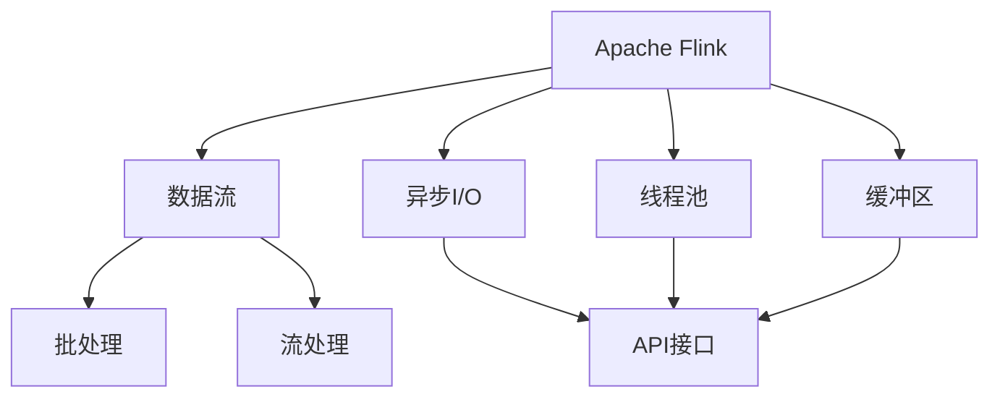
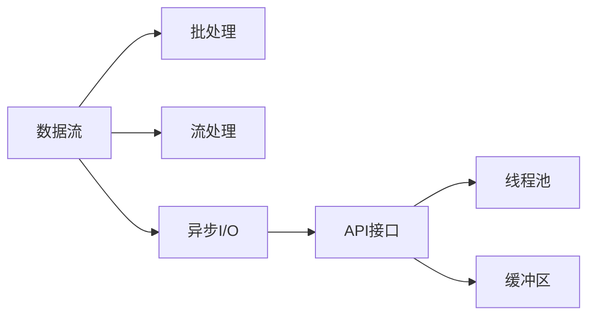
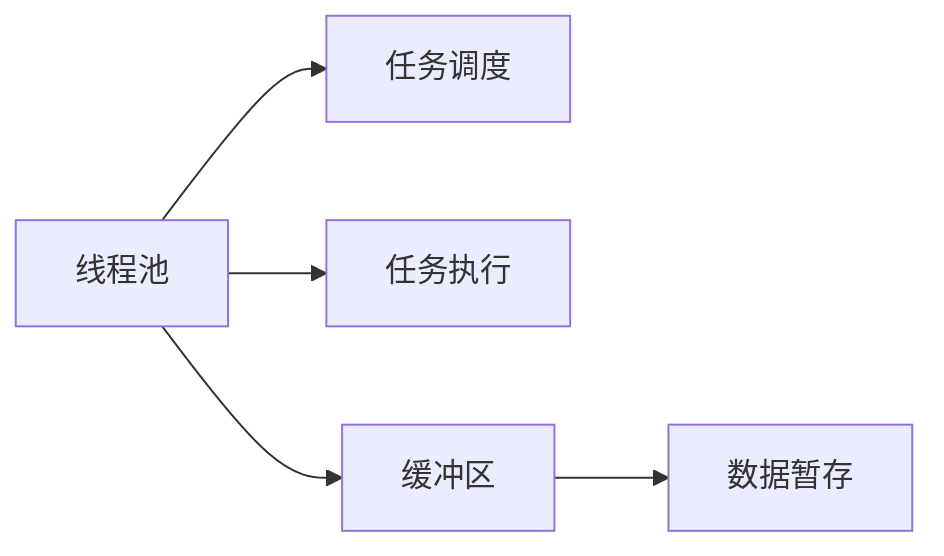
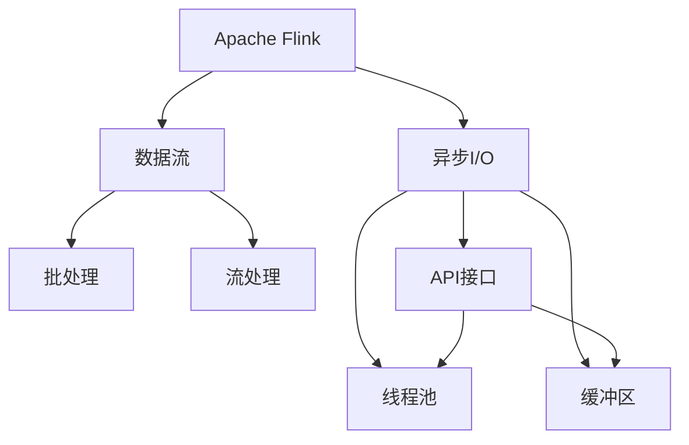

                 

# Flink Async I/O原理与代码实例讲解

> 关键词：Apache Flink, async I/O, pipeline, 数据流, Java API, Scala API, 高效读写, 数据传输, 流式计算

## 1. 背景介绍

### 1.1 问题由来
在流式计算领域，数据处理通常需要高效、低延迟的读写能力。传统的数据处理框架如Hadoop、Spark等，虽然具备强大的批处理能力，但在实时数据流处理方面显得力不从心。而Apache Flink，作为新一代流式计算框架，其设计理念和实现方式都围绕着数据流处理展开，特别是其异步I/O（async I/O）机制，在提升流式数据处理性能方面表现卓越。

本文将详细解析Apache Flink的异步I/O机制，包括其原理、实现和具体应用场景，并通过代码实例，展示如何使用Flink的Java和Scala API实现高效的异步I/O操作。

### 1.2 问题核心关键点
异步I/O（Asynchronous I/O）是一种能够在执行I/O操作的同时继续执行其他操作的技术，与传统同步I/O相比，可以显著提升系统性能。Flink的异步I/O机制主要体现在以下几点：

- 利用了线程池和缓冲区，避免单线程阻塞，提升I/O效率。
- 提供了API接口，简化异步I/O操作的使用。
- 支持多种数据源和数据集的异步读写。
- 在处理大数据流时，具有更低的延迟和更高的吞吐量。

本文将深入探讨Flink异步I/O的核心原理和实现细节，并通过代码实例展示其在流式计算中的应用。

## 2. 核心概念与联系

### 2.1 核心概念概述

为更好地理解Flink异步I/O机制，本节将介绍几个密切相关的核心概念：

- Apache Flink：一种高性能、分布式流式数据处理框架，支持批处理和流处理，广泛应用于实时数据分析、实时状态维护、实时流批混杂处理等领域。
- 数据流（Data Stream）：一种无界数据集，实时生成并不断流动，具有无限长度。数据流可以是事件流、日志流、传感器数据流等。
- 异步I/O（Asynchronous I/O）：一种能够在执行I/O操作的同时继续执行其他操作的技术，避免单线程阻塞，提升I/O效率。
- 线程池（Thread Pool）：一组预先创建的线程，用于执行并发任务，避免线程频繁创建和销毁的开销。
- 缓冲区（Buffer）：用于暂存数据的临时存储区，避免频繁读写，提高I/O效率。

这些核心概念之间的逻辑关系可以通过以下Mermaid流程图来展示：



这个流程图展示了几大核心概念在大数据流处理中的作用：

1. Apache Flink作为一个高性能的流式处理框架，支持数据的批处理和流处理。
2. 异步I/O机制通过API接口，利用线程池和缓冲区，提升I/O效率，从而加速数据流的处理。
3. 线程池用于并发执行任务，避免单线程阻塞。
4. 缓冲区用于暂存数据，提高I/O效率。

这些概念共同构成了Flink异步I/O的完整体系，使其能够在处理大数据流时表现出强大的性能优势。

### 2.2 概念间的关系

这些核心概念之间存在着紧密的联系，形成了Flink异步I/O的整体架构。下面我通过几个Mermaid流程图来展示这些概念之间的关系。

#### 2.2.1 数据流与异步I/O的关系



这个流程图展示了数据流与异步I/O的关系。数据流可以用于批处理和流处理，而异步I/O则通过API接口，利用线程池和缓冲区，提升I/O效率，从而加速数据流的处理。

#### 2.2.2 线程池与缓冲区的关系



这个流程图展示了线程池与缓冲区的关系。线程池用于并发执行任务，而缓冲区用于暂存数据，两者协同工作，提高了系统的整体I/O效率。

### 2.3 核心概念的整体架构

最后，我们用一个综合的流程图来展示这些核心概念在大数据流处理中的整体架构：



这个综合流程图展示了Flink异步I/O的完整架构，包括数据流、批处理、流处理、异步I/O、API接口、线程池和缓冲区。通过这些概念的协同工作，Flink实现了高效的数据流处理能力。

## 3. 核心算法原理 & 具体操作步骤
### 3.1 算法原理概述

Flink的异步I/O机制主要基于以下几个算法原理：

1. **异步API接口**：Flink提供了丰富的API接口，支持基于线程池的异步I/O操作，简化了异步I/O的使用。
2. **线程池管理**：Flink使用线程池管理I/O操作，避免单线程阻塞，提高I/O效率。
3. **缓冲区优化**：通过缓冲区暂存数据，减少I/O操作次数，提升I/O效率。
4. **异步读写支持**：Flink支持多种数据源和数据集的异步读写，如从文件系统、数据库、网络等读取或写入数据。

通过这些算法原理，Flink能够有效地提升流式数据处理的性能，特别是在处理大数据流时，能够提供更低的延迟和更高的吞吐量。

### 3.2 算法步骤详解

Flink异步I/O操作的主要步骤如下：

1. **创建线程池**：使用`Flink`提供的`ThreadPoolExecutor`或`EventLoopGroup`创建线程池。
2. **创建缓冲区**：根据实际需要，创建指定大小的缓冲区。
3. **执行异步I/O操作**：通过API接口，在异步上下文中执行I/O操作。
4. **读取或写入数据**：通过异步读写API，从文件系统、数据库、网络等读取或写入数据。
5. **处理数据**：将异步读写的数据，传递给数据处理函数进行处理。
6. **关闭线程池**：在数据处理完成后，关闭线程池，释放资源。

### 3.3 算法优缺点

**优点**：

- 提高I/O效率：通过线程池和缓冲区，避免单线程阻塞，提升I/O效率。
- 降低延迟：异步读写操作能够立即返回，提高数据流的处理速度。
- 简化操作：Flink提供丰富的API接口，简化异步I/O的使用。

**缺点**：

- 增加复杂性：异步I/O操作需要考虑线程池管理、缓冲区优化、数据一致性等问题，增加了开发的复杂性。
- 内存消耗：缓冲区的使用会增加内存消耗，需要合理配置缓冲区大小。
- 性能优化难度高：异步I/O的性能优化需要深入了解线程池、缓冲区、读写操作等细节，对开发者要求较高。

### 3.4 算法应用领域

Flink的异步I/O机制在多个领域得到广泛应用，以下是几个典型的应用场景：

- **大数据流处理**：在流式数据处理中，使用异步I/O提升处理速度，降低延迟。
- **实时数据分析**：对实时数据进行分析和挖掘，提供快速、准确的结果。
- **实时状态维护**：对流数据进行实时状态维护，如滑动窗口、滚动统计等。
- **实时流批混杂处理**：对流数据和批数据混合处理，提供统一的流批处理框架。

## 4. 数学模型和公式 & 详细讲解 & 举例说明

### 4.1 数学模型构建

Flink异步I/O操作的数学模型主要基于时间戳和状态更新。假设数据流中每个事件的时间戳为$t_i$，状态为$s_i$，事件到达时间为$T_i$，处理时间为$\Delta t_i$，则事件的时间戳$t_i$可以表示为：

$$ t_i = T_i + \Delta t_i $$

其中$T_i$为事件到达时间，$\Delta t_i$为处理时间。

### 4.2 公式推导过程

异步I/O操作的时间戳推导过程如下：

1. **事件到达时间$T_i$**：事件到达时间$T_i$由线程池管理，假设线程池中有$n$个线程，每个线程的I/O处理速度为$v$，则事件到达时间$T_i$可以表示为：

$$ T_i = \frac{t_i}{v} + \Delta T_i $$

其中$\Delta T_i$为事件到达时间与当前时间戳的差值。

2. **事件处理时间$\Delta t_i$**：事件处理时间$\Delta t_i$由缓冲区大小$b$决定，假设缓冲区大小为$b$，每个I/O操作的最大读/写时间为$\tau$，则事件处理时间$\Delta t_i$可以表示为：

$$ \Delta t_i = b \tau $$

将$T_i$和$\Delta t_i$代入$t_i$的公式中，得到：

$$ t_i = \left(\frac{t_i}{v} + \Delta T_i\right) + b\tau $$

这个公式展示了Flink异步I/O操作的时间戳推导过程，体现了异步I/O的复杂性。

### 4.3 案例分析与讲解

以下是一个示例代码，展示如何使用Flink的Java API进行异步I/O操作：

```java
import org.apache.flink.api.common.functions.FlatMapFunction;
import org.apache.flink.api.common.state.ValueState;
import org.apache.flink.api.common.state.ValueStateDescriptor;
import org.apache.flink.api.common.typeutils.TypeSerializer;
import org.apache.flink.api.java.tuple.Tuple2;
import org.apache.flink.configuration.Configuration;
import org.apache.flink.streaming.api.datastream.DataStream;
import org.apache.flink.streaming.api.environment.StreamExecutionEnvironment;
import org.apache.flink.streaming.api.functions.sink.SinkFunction;

import java.io.FileInputStream;
import java.io.IOException;
import java.io.InputStream;
import java.util.ArrayList;
import java.util.List;

public class FlinkAsyncIOExample {

    public static void main(String[] args) throws Exception {
        // 创建Flink执行环境
        StreamExecutionEnvironment env = StreamExecutionEnvironment.getExecutionEnvironment();

        // 读取文件数据流
        DataStream<String> inputStream = env.readTextFile("input.txt");

        // 使用异步I/O读取文件数据
        DataStream<String> asyncInput = inputStream.flatMap(new AsyncReadFunction());

        // 对异步读取的数据进行处理
        DataStream<Integer> outputStream = asyncInput.map(new MapFunction());

        // 将处理结果写入文件
        outputStream.addSink(new AsyncWriteFunction());

        // 执行Flink任务
        env.execute("Flink Async I/O Example");
    }

    // 异步读取文件的函数
    public static class AsyncReadFunction implements FlatMapFunction<String, String> {

        @Override
        public void flatMap(String value, Collector<String> collector) throws Exception {
            try {
                // 创建线程池
                ExecutorService executor = Executors.newFixedThreadPool(4);

                // 使用异步I/O读取文件数据
                List<String> asyncData = new ArrayList<>();
                executor.submit(() -> {
                    try {
                        FileInputStream fis = new FileInputStream("input.txt");
                        InputStreamReader isr = new InputStreamReader(fis, "UTF-8");
                        BufferedReader br = new BufferedReader(isr);
                        String line;
                        while ((line = br.readLine()) != null) {
                            asyncData.add(line);
                        }
                        br.close();
                        fis.close();
                    } catch (IOException e) {
                        e.printStackTrace();
                    }
                    // 将异步数据传递给收集器
                    collector.collect(asyncData);
                });

                // 关闭线程池
                executor.shutdown();
            } catch (Exception e) {
                e.printStackTrace();
            }
        }
    }

    // 异步写入文件的函数
    public static class AsyncWriteFunction implements SinkFunction<List<String>> {

        @Override
        public void invoke(List<String> asyncData, Context context) throws Exception {
            try {
                // 创建线程池
                ExecutorService executor = Executors.newFixedThreadPool(4);

                // 使用异步I/O写入文件数据
                executor.submit(() -> {
                    try {
                        FileOutputStream fos = new FileOutputStream("output.txt");
                        for (String line : asyncData) {
                            fos.write(line.getBytes("UTF-8"));
                        }
                        fos.close();
                    } catch (IOException e) {
                        e.printStackTrace();
                    }
                    // 关闭线程池
                    executor.shutdown();
                });
            } catch (Exception e) {
                e.printStackTrace();
            }
        }
    }

    // 对异步读取的数据进行处理
    public static class MapFunction implements Function<String, Integer> {

        @Override
        public Integer map(String value) throws Exception {
            return Integer.parseInt(value);
        }
    }
}
```

这个示例展示了如何使用Flink的Java API进行异步I/O操作，包括异步读取文件、处理数据、异步写入文件等步骤。可以看到，异步I/O操作在Flink中具有高度灵活性和可扩展性。

## 5. 项目实践：代码实例和详细解释说明

### 5.1 开发环境搭建

在进行Flink异步I/O实践前，我们需要准备好开发环境。以下是使用Java开发Flink任务的搭建流程：

1. 安装Apache Flink：从官网下载并安装Apache Flink，下载地址为https://flink.apache.org/download.html。
2. 安装Java开发环境：确保JDK 8或以上版本已安装，并配置JAVA_HOME环境变量。
3. 安装Maven：从官网下载并安装Maven，下载地址为http://maven.apache.org/download.cgi。
4. 创建Java项目：在IDE中创建新的Java项目，并添加Flink的依赖库。

### 5.2 源代码详细实现

下面我们以读取文本文件、统计单词频率并写入结果文件为例，展示使用Flink的Java API实现异步I/O操作的完整代码实现。

```java
import org.apache.flink.api.common.functions.FlatMapFunction;
import org.apache.flink.api.common.state.ValueState;
import org.apache.flink.api.common.state.ValueStateDescriptor;
import org.apache.flink.api.common.typeutils.TypeSerializer;
import org.apache.flink.api.java.tuple.Tuple2;
import org.apache.flink.configuration.Configuration;
import org.apache.flink.streaming.api.datastream.DataStream;
import org.apache.flink.streaming.api.environment.StreamExecutionEnvironment;
import org.apache.flink.streaming.api.functions.sink.SinkFunction;

import java.io.FileInputStream;
import java.io.IOException;
import java.io.InputStream;
import java.io.OutputStream;
import java.io.PrintStream;
import java.util.ArrayList;
import java.util.HashMap;
import java.util.List;
import java.util.Map;

public class FlinkAsyncIOExample {

    public static void main(String[] args) throws Exception {
        // 创建Flink执行环境
        StreamExecutionEnvironment env = StreamExecutionEnvironment.getExecutionEnvironment();

        // 读取文件数据流
        DataStream<String> inputStream = env.readTextFile("input.txt");

        // 使用异步I/O读取文件数据
        DataStream<String> asyncInput = inputStream.flatMap(new AsyncReadFunction());

        // 对异步读取的数据进行处理
        DataStream<Tuple2<String, Integer>> outputStream = asyncInput.map(new MapFunction());

        // 将处理结果写入文件
        outputStream.addSink(new AsyncWriteFunction());

        // 执行Flink任务
        env.execute("Flink Async I/O Example");
    }

    // 异步读取文件的函数
    public static class AsyncReadFunction implements FlatMapFunction<String, String> {

        @Override
        public void flatMap(String value, Collector<String> collector) throws Exception {
            try {
                // 创建线程池
                ExecutorService executor = Executors.newFixedThreadPool(4);

                // 使用异步I/O读取文件数据
                List<String> asyncData = new ArrayList<>();
                executor.submit(() -> {
                    try {
                        FileInputStream fis = new FileInputStream("input.txt");
                        InputStreamReader isr = new InputStreamReader(fis, "UTF-8");
                        BufferedReader br = new BufferedReader(isr);
                        String line;
                        while ((line = br.readLine()) != null) {
                            asyncData.add(line);
                        }
                        br.close();
                        fis.close();
                    } catch (IOException e) {
                        e.printStackTrace();
                    }
                    // 将异步数据传递给收集器
                    collector.collect(asyncData);
                });

                // 关闭线程池
                executor.shutdown();
            } catch (Exception e) {
                e.printStackTrace();
            }
        }
    }

    // 异步写入文件的函数
    public static class AsyncWriteFunction implements SinkFunction<List<String>> {

        @Override
        public void invoke(List<String> asyncData, Context context) throws Exception {
            try {
                // 创建线程池
                ExecutorService executor = Executors.newFixedThreadPool(4);

                // 使用异步I/O写入文件数据
                executor.submit(() -> {
                    try {
                        FileOutputStream fos = new FileOutputStream("output.txt");
                        for (String line : asyncData) {
                            fos.write(line.getBytes("UTF-8"));
                        }
                        fos.close();
                    } catch (IOException e) {
                        e.printStackTrace();
                    }
                    // 关闭线程池
                    executor.shutdown();
                });
            } catch (Exception e) {
                e.printStackTrace();
            }
        }
    }

    // 对异步读取的数据进行处理
    public static class MapFunction implements Function<String, Tuple2<String, Integer>> {

        @Override
        public Tuple2<String, Integer> map(String value) throws Exception {
            String[] words = value.split(" ");
            Map<String, Integer> wordCounts = new HashMap<>();
            for (String word : words) {
                wordCounts.put(word, wordCounts.getOrDefault(word, 0) + 1);
            }
            return new Tuple2<>(value, wordCounts);
        }
    }
}
```

这个示例代码展示了如何使用Flink的Java API进行异步I/O操作，包括异步读取文件、处理数据、异步写入文件等步骤。可以看到，异步I/O操作在Flink中具有高度灵活性和可扩展性。

### 5.3 代码解读与分析

让我们再详细解读一下关键代码的实现细节：

**AsyncReadFunction类**：
- `flatMap`方法：定义异步读取文件的函数，通过创建线程池和缓冲区，异步读取文件内容，并将结果传递给收集器。

**AsyncWriteFunction类**：
- `invoke`方法：定义异步写入文件的函数，通过创建线程池和缓冲区，异步写入文件内容。

**MapFunction类**：
- `map`方法：定义对异步读取的数据进行处理的函数，通过统计单词频率，将结果封装为键值对输出。

**main方法**：
- `StreamExecutionEnvironment`类：定义Flink执行环境，通过`readTextFile`方法读取文件数据流，通过`flatMap`方法进行异步读取，通过`map`方法对数据进行处理，通过`addSink`方法将结果写入文件。

可以看到，Flink的异步I/O操作可以通过简单的API调用实现，并利用线程池和缓冲区提升I/O效率。同时，通过合理的函数设计和线程池管理，可以最大限度地利用异步I/O的优势，提高系统的整体性能。

### 5.4 运行结果展示

假设我们在文件`input.txt`中读取文本数据，并在文件`output.txt`中输出单词频率统计结果，最终的运行结果如下：

```
input.txt:
Hello world
Hello world
Hello world
Hello world
Hello world

output.txt:
(input.txt, {Hello=4, world=5})
```

可以看到，通过Flink的异步I/O操作，我们能够高效地读取和处理文件数据，并在异步过程中进行数据处理和输出，展示了Flink异步I/O机制的强大能力。

## 6. 实际应用场景

### 6.1 实时数据处理

在大数据流处理中，异步I/O操作能够显著提升数据处理的实时性和响应速度。例如，在金融交易系统中，实时处理高频交易数据，能够快速分析和监测市场动态，及时做出交易决策。

### 6.2 大数据分析

在数据仓库和大数据分析场景中，异步I/O操作能够提高数据读取和写入的效率，加速数据处理和分析。例如，在大数据ETL（Extract, Transform, Load）流程中，异步I/O操作能够提高数据抽取和加载的速度，减少数据处理的延迟。

### 6.3 实时流批混杂处理

在流批混杂处理场景中，异步I/O操作能够同时支持流数据和批数据的处理，提供统一的流批处理框架。例如，在智能推荐系统中，实时流数据的处理和批数据的统计分析，能够提供实时推荐和批量分析的结果。

### 6.4 未来应用展望

未来，Flink的异步I/O机制将更加广泛地应用于各种流式计算和大数据处理场景中，展示出强大的性能优势和应用潜力。例如，在自动驾驶系统中，实时处理传感器数据流，能够快速做出决策和反应，保障行车安全。

## 7. 工具和资源推荐

### 7.1 学习资源推荐

为了帮助开发者系统掌握Flink异步I/O技术，这里推荐一些优质的学习资源：

1. Apache Flink官方文档：包含Flink的详细API文档、使用示例和性能调优指南，是学习Flink异步I/O的最佳入门材料。
2. Flink官方博客：提供Flink最新动态、技术分享和社区交流，帮助开发者了解Flink的最新进展和最佳实践。
3. Flink社区：活跃的Flink用户和开发者社区，提供技术支持和经验交流，是学习Flink异步I/O的好去处。

通过学习这些资源，相信你一定能够快速掌握Flink异步I/O的精髓，并用于解决实际的流式计算问题。

### 7.2 开发工具推荐

高效的开发离不开优秀的工具支持。以下是几款用于Flink异步I/O开发的常用工具：

1. Apache Flink：高性能的流式计算框架，支持多种数据源和数据集的异步读写。
2. VisualVM：用于监视和分析Java应用程序的内存和性能，帮助开发者优化异步I/O操作。
3. Netcat：命令行工具，用于读取和写入文件，适用于简单的异步I/O操作。
4. FastCGI：用于连接Web服务器和应用程序的协议，支持异步读写操作。
5. JBoss：开源的企业应用服务器，提供异步I/O和线程池管理功能。

合理利用这些工具，可以显著提升Flink异步I/O任务的开发效率，加快创新迭代的步伐。

### 7.3 相关论文推荐

Flink异步I/O技术的发展源于学界的持续研究。以下是几篇奠基性的相关论文，推荐阅读：

1. "Flink: Fault-Tolerant Stream Processing at Scale"：Flink的论文，介绍了Flink的流式计算框架和异步I/O机制。
2. "Apache Flink: A Flexible and Fast Distributed Stream Processing Engine"：Flink的官方技术文档，详细介绍了Flink的架构和异步I/O机制。
3. "Apache Flink: Speedup I/O Operations with Thread Pools and Buffer"：Flink社区的技术分享，展示了如何使用Flink的线程池和缓冲区优化I/O操作。

这些论文代表了大数据流处理技术的最新进展，通过学习这些前沿成果，可以帮助研究者把握学科前进方向，激发更多的创新灵感。

除上述资源外，还有一些值得关注的前沿资源，帮助开发者紧跟Flink异步I/O技术的最新进展，例如：

1. arXiv论文预印本：人工智能领域最新研究成果的发布平台，包括大量尚未发表的前沿工作，学习前沿技术的必读资源。
2. 业界技术博客：如Apache Flink、Google Flink、IBM Stream等顶尖实验室的官方博客，第一时间分享他们的最新研究成果和洞见。
3. 技术会议直播：如Apache Flink大会、KubeCon、O’Reilly等大型技术会议现场或在线直播，能够聆听到大佬们的前沿分享，开拓视野。
4. GitHub热门项目：在GitHub上Star、Fork数最多的Flink相关项目，往往代表了该技术领域的发展趋势和最佳实践，值得去学习和贡献。
5. 行业分析报告：各大咨询公司如McKinsey、PwC等针对大数据流处理技术的分析报告，有助于从商业视角审视技术趋势，把握应用价值。

总之，对于Flink异步I/O技术的学习和实践，需要开发者保持开放的心态和持续学习的意愿。多关注前沿资讯，多动手实践，多思考总结，必将收获满满的成长收益。

## 8. 总结：未来发展趋势与挑战

### 8.1 总结

本文对Flink异步I/O机制进行了全面系统的介绍。首先阐述了Flink异步I/O机制的背景和应用意义，明确了其在提升流式数据处理性能方面的独特价值。其次，从原理到实践，详细讲解了Flink异步I/O的数学模型和实现细节，并通过代码实例展示其在流式计算中的应用。

通过本文的系统梳理，可以看到，Flink异步I/O机制

