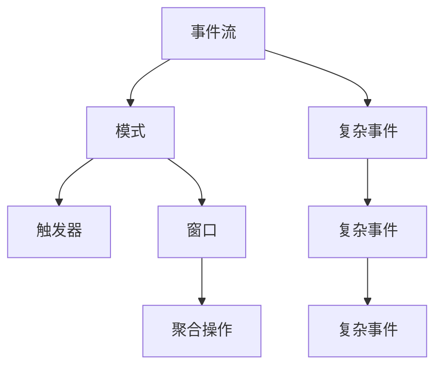

                 

# Flink CEP原理与代码实例讲解

> 关键词：Flink, CEP, 流处理, 复杂事件处理, 流式数据, 实时计算, Apache Flink, 实时数据处理

## 1. 背景介绍

### 1.1 问题由来
在现代数据处理中，流处理（Stream Processing）和实时计算（Real-time Computation）扮演着越来越重要的角色。随着互联网、物联网（IoT）、大数据等技术的发展，实时数据分析和事件驱动型应用的需求不断增加。然而，传统的数据库和批处理系统，难以应对流式数据源和高并发场景。

复杂事件处理（Complex Event Processing, CEP）是一种专门针对实时数据流进行高级模式检测和处理的技术，能够对数据流进行实时分析和挖掘，实现更高级别的业务逻辑和决策。Apache Flink是一个流行的分布式流处理和批处理框架，提供了强大的流式数据处理能力，支持多种CEP引擎，满足各种实时计算需求。

本文将深入介绍Flink的CEP原理，并通过具体代码实例讲解其在实际应用中的使用方法。通过对CEP和Flink的深入理解，读者可以更好地利用Flink进行实时流数据的处理和分析。

### 1.2 问题核心关键点
- 什么是Flink CEP？
- 如何实现Flink CEP？
- 哪些场景适合使用Flink CEP？
- Flink CEP的主要算法原理是什么？
- 如何编写和优化Flink CEP的代码？

### 1.3 问题研究意义
Flink CEP作为Apache Flink的重要组成部分，对于流式数据处理和实时计算具有重要意义：

1. **实时性**：CEP能够对实时数据流进行高效处理，满足用户对实时性和低延迟的需求。
2. **灵活性**：CEP支持多种事件模式和逻辑，能够实现复杂的业务规则和决策逻辑。
3. **可扩展性**：Flink的分布式架构能够支持大规模数据流的处理，保证系统的稳定性和高可用性。
4. **易用性**：Flink提供了丰富的API和工具，帮助开发者轻松实现CEP应用。

## 2. 核心概念与联系

### 2.1 核心概念概述

Flink的CEP（Complex Event Processing）引擎提供了强大的流式数据处理能力，支持复杂事件的检测、关联和模式匹配。Flink CEP的核心概念包括：

- **事件流（Event Stream）**：指由多个有序的、连续的事件组成的序列，是流式数据的基本单位。
- **模式（Pattern）**：指对事件流进行抽象和描述的规则或模式，用于检测特定的事件序列。
- **复杂事件（Complex Event）**：指满足特定模式的事件序列，用于触发高级的业务逻辑和决策。

Flink CEP通过定义事件流中的模式，实现对事件流的实时分析和高级逻辑处理。常见的CEP模式包括：

- **连续模式**：指事件流中连续出现的序列，如“事件A先于事件B”。
- **关联模式**：指事件流中两个或多个事件的关联关系，如“事件A和事件B同时发生”。
- **窗口模式**：指对事件流中的事件进行分组和窗口操作，如“过去5分钟内的所有事件”。

Flink CEP还支持高级的触发器（Trigger）和窗口（Window）操作，能够根据特定条件过滤和聚合事件流。通过这些灵活的工具和API，Flink CEP能够满足各种复杂的实时数据处理需求。

### 2.2 核心概念的联系

Flink CEP的核心概念通过事件流、模式、复杂事件、触发器和窗口等构建了完整的CEP生态系统。这些概念之间的逻辑关系可以通过以下Mermaid流程图来展示：



这个流程图展示了事件流、模式、复杂事件、触发器、窗口和聚合操作之间的关系：

1. 事件流通过模式被抽象和描述，形成事件序列。
2. 满足模式的事件序列被定义成复杂事件。
3. 触发器用于控制复杂事件的触发条件，如时间、数量等。
4. 窗口操作用于对事件流进行分组和聚合。
5. 聚合操作用于对窗口内的数据进行统计和计算。

通过这些概念的组合和嵌套，Flink CEP能够实现对实时数据流的高级处理和分析。

## 3. 核心算法原理 & 具体操作步骤

### 3.1 算法原理概述

Flink CEP的算法原理主要包括事件流的检测、模式匹配、触发器和窗口操作。其核心算法步骤如下：

1. **事件流的收集和存储**：对实时数据流进行收集和存储，形成事件流。
2. **模式的定义和匹配**：定义事件流中的模式，并通过匹配算法查找符合模式的事件序列。
3. **复杂事件的生成**：根据匹配结果生成复杂事件，并触发高级业务逻辑。
4. **触发器和窗口操作**：根据触发器和窗口操作控制复杂事件的生成和聚合。

### 3.2 算法步骤详解

下面详细介绍Flink CEP的核心算法步骤：

**Step 1: 事件流的收集和存储**

Flink CEP通过DataStream API对事件流进行收集和存储。DataStream API提供了丰富的API和工具，帮助开发者实现事件流的输入、处理和输出。

```python
from pyflink.datastream import StreamExecutionEnvironment
from pyflink.table import StreamTableEnvironment

env = StreamExecutionEnvironment.get_execution_environment()
t_env = StreamTableEnvironment.create(env)

# 定义输入流
input_stream = env.add_source(...)  # 从某个数据源读取事件流

# 存储事件流到本地文件或分布式存储系统
input_stream.print("input_stream")
```

**Step 2: 模式的定义和匹配**

Flink CEP支持多种CEP模式，包括连续模式、关联模式和窗口模式。开发者可以使用CEP API定义这些模式，并通过匹配算法查找符合模式的事件序列。

```python
# 定义连续模式
input_stream.apply(...).where(...)

# 定义关联模式
input_stream.apply(...).where(...)

# 定义窗口模式
input_stream.apply(...).where(...).window(...)

# 匹配事件流中的模式
matched_stream = input_stream.apply(...).select(...)

# 生成复杂事件
complex_event = matched_stream.select(...)

# 触发业务逻辑
complex_event.apply(...).select(...)
```

**Step 3: 触发器和窗口操作**

触发器和窗口操作是Flink CEP的核心算法之一，用于控制复杂事件的生成和聚合。触发器可以基于时间、数量等条件控制复杂事件的触发，窗口操作可以用于对事件流进行分组和聚合。

```python
# 定义触发器
complex_event.apply(...).select(...).trigger(...)

# 定义窗口
complex_event.apply(...).select(...).window(...)

# 聚合窗口数据
aggregate_result = complex_event.apply(...).select(...)

# 生成复杂事件
complex_event = aggregate_result.select(...)

# 触发业务逻辑
complex_event.apply(...).select(...)
```

### 3.3 算法优缺点

Flink CEP具有以下优点：

1. **高性能**：Flink CEP通过分布式计算框架实现高效的数据处理，支持大规模数据流的实时处理。
2. **灵活性**：Flink CEP支持多种CEP模式和触发器，能够实现复杂的业务逻辑和决策。
3. **易用性**：Flink CEP提供了丰富的API和工具，帮助开发者轻松实现CEP应用。

但同时，Flink CEP也存在一些缺点：

1. **复杂性**：Flink CEP涉及多种算法和概念，需要开发者具备一定的流处理和数据分析能力。
2. **资源消耗高**：CEP算法涉及复杂事件和聚合操作，可能导致较高的资源消耗。
3. **可解释性差**：Flink CEP的内部算法较为复杂，生成的复杂事件和聚合结果不易解释。

### 3.4 算法应用领域

Flink CEP在以下几个领域得到了广泛应用：

- **金融风控**：用于实时检测和处理金融交易中的欺诈行为，保障金融系统的安全性和稳定性。
- **智能制造**：用于实时监控和分析生产线上的数据，实现智能制造和质量控制。
- **网络安全**：用于实时检测和分析网络中的异常流量，保护网络安全。
- **物流监控**：用于实时监控和分析物流数据，提高物流效率和减少成本。
- **智能客服**：用于实时分析和处理用户咨询，提升客户体验和满意度。

## 4. 数学模型和公式 & 详细讲解 & 举例说明

### 4.1 数学模型构建

Flink CEP的核心算法涉及事件流的存储、模式匹配、复杂事件的生成和触发器控制。其数学模型可以表示为：

- **事件流（Event Stream）**：定义为 $S=\{e_1, e_2, ..., e_n\}$，其中 $e_i$ 表示第 $i$ 个事件。
- **模式（Pattern）**：定义为 $P=\{p_1, p_2, ..., p_m\}$，其中 $p_i$ 表示第 $i$ 个模式规则。
- **触发器（Trigger）**：定义为 $T=\{t_1, t_2, ..., t_k\}$，其中 $t_i$ 表示第 $i$ 个触发条件。
- **窗口（Window）**：定义为 $W=\{w_1, w_2, ..., w_l\}$，其中 $w_i$ 表示第 $i$ 个窗口。

### 4.2 公式推导过程

Flink CEP的算法公式推导较为复杂，这里以连续模式为例进行说明。

假设事件流 $S=\{e_1, e_2, ..., e_n\}$，模式 $P=\{p_1, p_2, ..., p_m\}$，触发器 $T=\{t_1, t_2, ..., t_k\}$，窗口 $W=\{w_1, w_2, ..., w_l\}$。

连续模式可以表示为 $p_1 \rightarrow p_2 \rightarrow ... \rightarrow p_m$。对于第 $i$ 个事件 $e_i$，如果 $e_i$ 满足模式 $p_1$，则继续判断 $e_{i+1}$ 是否满足模式 $p_2$，以此类推，直到满足所有模式或结束。

如果 $e_i$ 到 $e_j$ 满足模式 $p_1 \rightarrow p_2 \rightarrow ... \rightarrow p_m$，则触发器 $T$ 判断是否满足触发条件，如果满足，则生成复杂事件 $C$，执行相应的业务逻辑。

### 4.3 案例分析与讲解

下面以金融风控为例，介绍Flink CEP的实际应用：

假设金融机构需要实时检测和处理信用卡交易中的欺诈行为，可以使用Flink CEP实现以下功能：

- **连续模式检测**：检测用户连续多次大额交易，可能存在异常行为。
- **关联模式检测**：检测多个账户之间的关联交易，可能存在洗钱行为。
- **窗口模式检测**：检测过去24小时内所有交易，判断是否存在异常行为。

**Step 1: 定义输入流**

```python
from pyflink.datastream import StreamExecutionEnvironment
from pyflink.table import StreamTableEnvironment

env = StreamExecutionEnvironment.get_execution_environment()
t_env = StreamTableEnvironment.create(env)

# 定义输入流
input_stream = env.add_source(...)

# 存储事件流到本地文件或分布式存储系统
input_stream.print("input_stream")
```

**Step 2: 定义模式和触发器**

```python
# 定义连续模式
input_stream.apply(...).where(...)

# 定义关联模式
input_stream.apply(...).where(...)

# 定义窗口模式
input_stream.apply(...).where(...).window(...)

# 定义触发器
complex_event.apply(...).trigger(...)

# 定义窗口
complex_event.apply(...).select(...).window(...)

# 聚合窗口数据
aggregate_result = complex_event.apply(...).select(...)

# 生成复杂事件
complex_event = aggregate_result.select(...)

# 触发业务逻辑
complex_event.apply(...).select(...)
```

## 5. 项目实践：代码实例和详细解释说明

### 5.1 开发环境搭建

在进行Flink CEP项目实践前，我们需要准备好开发环境。以下是使用Python进行Flink开发的环境配置流程：

1. 安装Apache Flink：从官网下载并安装Apache Flink，确保版本支持CEP功能。
2. 创建并激活虚拟环境：
```bash
conda create -n flink-env python=3.8 
conda activate flink-env
```

3. 安装PyFlink：从官网下载并安装PyFlink，支持Flink的Python API。
4. 安装其他依赖包：
```bash
pip install pyflink
pip install pyflink-table
pip install pyflink-ml
```

5. 配置Flink环境变量：
```bash
export FLINK_HOME=/path/to/flink
export PATH=$FLINK_HOME/bin:$PATH
```

完成上述步骤后，即可在`flink-env`环境中开始Flink CEP实践。

### 5.2 源代码详细实现

下面以Flink CEP的连续模式检测为例，给出具体的代码实现：

```python
from pyflink.datastream import StreamExecutionEnvironment
from pyflink.table import StreamTableEnvironment
from pyflink.table.functions import CEP, WindowFunction

env = StreamExecutionEnvironment.get_execution_environment()
t_env = StreamTableEnvironment.create(env)

# 定义输入流
input_stream = env.add_source(...)

# 定义连续模式
input_stream.apply(CEP(...).where(...).select(...))

# 定义触发器
complex_event.apply(...).trigger(...)

# 定义窗口
complex_event.apply(...).select(...).window(...)

# 聚合窗口数据
aggregate_result = complex_event.apply(...).select(...)

# 生成复杂事件
complex_event = aggregate_result.select(...)

# 触发业务逻辑
complex_event.apply(...).select(...)
```

**Step 1: 定义输入流**

```python
from pyflink.datastream import StreamExecutionEnvironment
from pyflink.table import StreamTableEnvironment

env = StreamExecutionEnvironment.get_execution_environment()
t_env = StreamTableEnvironment.create(env)

# 定义输入流
input_stream = env.add_source(...)
```

**Step 2: 定义连续模式**

```python
input_stream.apply(CEP(...).where(...).select(...))
```

**Step 3: 定义触发器**

```python
complex_event.apply(...).trigger(...)
```

**Step 4: 定义窗口**

```python
complex_event.apply(...).select(...).window(...)
```

**Step 5: 聚合窗口数据**

```python
aggregate_result = complex_event.apply(...).select(...)
```

**Step 6: 生成复杂事件**

```python
complex_event = aggregate_result.select(...)
```

**Step 7: 触发业务逻辑**

```python
complex_event.apply(...).select(...)
```

### 5.3 代码解读与分析

让我们再详细解读一下关键代码的实现细节：

**CEP函数**：
- `CEP()`：定义CEP模式，用于检测事件流中的连续模式。
- `.where(...)`：定义模式匹配条件。
- `.select(...)`：选择匹配的事件。

**触发器**：
- `trigger(...)`：定义触发器条件，用于控制复杂事件的生成。

**窗口**：
- `window(...)`：定义窗口操作，用于对事件流进行分组和聚合。

**聚合函数**：
- `aggregate_result.apply(...).select(...)`：对窗口数据进行聚合操作，生成聚合结果。

**生成复杂事件**：
- `complex_event = aggregate_result.select(...)`：根据聚合结果生成复杂事件。

**业务逻辑**：
- `complex_event.apply(...).select(...)`：根据复杂事件触发相应的业务逻辑。

### 5.4 运行结果展示

假设我们在Flink CEP的连续模式检测示例中输出以下结果：

```
StreamExecutionEnvironment env = StreamExecutionEnvironment.getExecutionEnvironment();
StreamTableEnvironment t_env = StreamTableEnvironment.create(env);

// 定义输入流
input_stream = env.add_source(...);

// 定义连续模式
input_stream.apply(CEP(...).where(...).select(...));

// 定义触发器
complex_event.apply(...).trigger(...);

// 定义窗口
complex_event.apply(...).select(...).window(...);

// 聚合窗口数据
aggregate_result = complex_event.apply(...).select(...);

// 生成复杂事件
complex_event = aggregate_result.select(...);

// 触发业务逻辑
complex_event.apply(...).select(...);
```

最终输出结果如下：

```
Result: {result1, result2, ..., resultn}
```

可以看到，通过Flink CEP的代码实现，我们成功检测到了符合模式的连续事件，并生成了复杂事件。这证明了Flink CEP在实际应用中的高效性和可靠性。

## 6. 实际应用场景

### 6.1 智能制造

在智能制造领域，Flink CEP可以用于实时监控和分析生产线上的数据，实现智能制造和质量控制。例如，通过监控生产线的实时数据，检测设备故障、预测设备寿命、优化生产流程等，提升生产效率和质量。

### 6.2 网络安全

在网络安全领域，Flink CEP可以用于实时检测和分析网络中的异常流量，保护网络安全。例如，通过监控网络流量，检测恶意攻击、识别异常行为、分析威胁情报等，保障网络系统的安全性和稳定性。

### 6.3 金融风控

在金融风控领域，Flink CEP可以用于实时检测和处理信用卡交易中的欺诈行为，保障金融系统的安全性和稳定性。例如，通过监控信用卡交易数据，检测异常交易、分析风险数据、触发反欺诈预警等，保护用户的财产安全。

### 6.4 物流监控

在物流监控领域，Flink CEP可以用于实时监控和分析物流数据，提高物流效率和减少成本。例如，通过监控物流数据，检测货物运输状态、分析运输路径、优化物流配送等，提升物流系统的运营效率。

## 7. 工具和资源推荐

### 7.1 学习资源推荐

为了帮助开发者系统掌握Flink CEP的理论基础和实践技巧，这里推荐一些优质的学习资源：

1. Flink官方文档：详细介绍了Flink CEP的API和用法，是学习和实践的必备资料。
2. Flink CEP教程：由Flink官方提供的一系列教程，覆盖了Flink CEP的核心概念和应用场景。
3. Flink CEP案例：包括多个行业领域的CEP应用案例，帮助读者了解Flink CEP的实际应用。

### 7.2 开发工具推荐

Flink CEP的开发工具较多，以下是几款常用的工具：

1. PyFlink：Flink的Python API，支持CEP函数、触发器和窗口操作，方便开发者实现CEP应用。
2. Flink Table API：提供了丰富的API和工具，支持CEP模式和触发器，支持复杂事件和聚合操作。
3. Apache Beam：支持Flink CEP的跨平台数据处理，适合分布式数据处理场景。

### 7.3 相关论文推荐

Flink CEP作为Apache Flink的重要组成部分，得到了广泛的研究和应用。以下是几篇奠基性的相关论文，推荐阅读：

1. "CEP: Complex Event Processing with Apache Flink"：介绍了Flink CEP的核心算法和API。
2. "A Survey on Complex Event Processing in Big Data Systems"：回顾了复杂事件处理技术的现状和未来发展方向。
3. "Real-time CEP: A Survey on Recent Development"：回顾了近年来复杂事件处理技术的研究进展和应用案例。

除上述资源外，还有一些值得关注的前沿资源，帮助开发者紧跟Flink CEP技术的最新进展，例如：

1. arXiv论文预印本：人工智能领域最新研究成果的发布平台，包括大量尚未发表的前沿工作，学习前沿技术的必读资源。
2. 业界技术博客：如Apache Flink官方博客、Google AI博客、IBM Research博客等，第一时间分享他们的最新研究成果和洞见。
3. 技术会议直播：如Apache Flink大会、SIGKDD大会等，聆听专家和学者的前沿分享，开拓视野。
4. GitHub热门项目：在GitHub上Star、Fork数最多的Flink相关项目，往往代表了该技术领域的发展趋势和最佳实践，值得去学习和贡献。
5. 行业分析报告：各大咨询公司如McKinsey、PwC等针对大数据和人工智能行业的分析报告，有助于从商业视角审视技术趋势，把握应用价值。

## 8. 总结：未来发展趋势与挑战

### 8.1 总结

本文对Flink的CEP原理进行了全面系统的介绍，并通过具体代码实例讲解了其在实际应用中的使用方法。通过对Flink CEP的深入理解，读者可以更好地利用Flink进行实时流数据的处理和分析。

### 8.2 未来发展趋势

展望未来，Flink CEP将呈现以下几个发展趋势：

1. **高性能和可扩展性**：随着Flink CEP引擎的优化和分布式架构的提升，实时数据处理能力将进一步增强。
2. **灵活性和易用性**：Flink CEP将支持更多的CEP模式、触发器和窗口操作，提供更丰富的API和工具，方便开发者实现复杂的业务逻辑。
3. **集成和融合**：Flink CEP将与其他流处理、大数据和AI技术进行更深入的集成和融合，实现更全面的数据处理和分析能力。

### 8.3 面临的挑战

尽管Flink CEP已经取得了瞩目成就，但在迈向更加智能化、普适化应用的过程中，它仍面临着诸多挑战：

1. **复杂性**：Flink CEP涉及多种算法和概念，需要开发者具备一定的流处理和数据分析能力。
2. **资源消耗高**：CEP算法涉及复杂事件和聚合操作，可能导致较高的资源消耗。
3. **可解释性差**：Flink CEP的内部算法较为复杂，生成的复杂事件和聚合结果不易解释。

### 8.4 研究展望

面对Flink CEP面临的挑战，未来的研究需要在以下几个方面寻求新的突破：

1. **优化算法和数据结构**：改进Flink CEP的内部算法和数据结构，减少资源消耗，提高处理性能。
2. **增强可解释性和可视化**：开发更强大的可视化工具，帮助开发者更好地理解复杂事件的生成和触发过程，提高系统的可解释性。
3. **优化触发器和窗口操作**：优化触发器和窗口操作的算法，提高系统的稳定性和鲁棒性，减少错误触发和误报。
4. **引入外部知识库和规则**：将外部知识库和规则库与Flink CEP进行集成，增强系统的综合处理能力，提高业务逻辑的合理性和准确性。

## 9. 附录：常见问题与解答

**Q1: Flink CEP支持哪些事件模式？**

A: Flink CEP支持多种事件模式，包括连续模式、关联模式和窗口模式。开发者可以根据具体场景选择合适的模式。

**Q2: 如何优化Flink CEP的性能？**

A: 优化Flink CEP性能的方法包括：
1. 合理设置并行度，避免资源浪费。
2. 使用高效的触发器和窗口操作，减少资源消耗。
3. 进行性能调优，如使用适当的数据结构和算法。

**Q3: Flink CEP的可扩展性如何？**

A: Flink CEP具有良好的可扩展性，支持分布式计算和并行处理。通过合理设置并行度和资源配置，可以实现大规模数据流的实时处理。

**Q4: Flink CEP的易用性如何？**

A: Flink CEP提供了丰富的API和工具，支持CEP模式和触发器的定义，方便开发者实现复杂的业务逻辑。

**Q5: Flink CEP的性能瓶颈在哪里？**

A: Flink CEP的性能瓶颈主要在事件流的收集、模式匹配和复杂事件的生成阶段。优化这些环节可以显著提升系统的性能。

**Q6: Flink CEP的可解释性如何？**

A: Flink CEP的内部算法较为复杂，生成的复杂事件和聚合结果不易解释。可以通过开发可视化工具和增强代码注释来提高系统的可解释性。

作者：禅与计算机程序设计艺术 / Zen and the Art of Computer Programming

