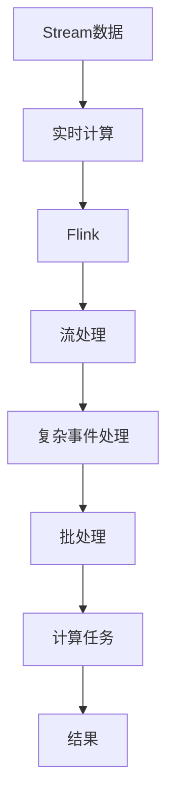

                 

# Flink Stream原理与代码实例讲解

> 关键词：Flink、Stream处理、实时计算、流式数据、代码实例

## 1. 背景介绍

随着互联网技术的发展，数据处理不再仅限于批处理，实时流式数据处理已成为信息时代不可或缺的一部分。Flink作为Apache软件基金会下的开源分布式流处理框架，以其高效、灵活、可扩展的特点，迅速在工业界和学术界受到广泛关注。本文将从Flink Stream处理原理入手，详细介绍Flink流式数据处理的流程、架构和关键算法，并通过代码实例，展示Flink在实时计算中的应用。

## 2. 核心概念与联系

### 2.1 核心概念概述

为了更好地理解Flink Stream处理，我们将首先介绍几个核心概念：

- **Flink**：由Apache软件基金会（Apache Software Foundation）推出的开源流处理框架，支持批处理、流处理和复杂事件处理，具有高度的扩展性和可定制性。

- **Stream处理**：一种数据处理模式，用于处理实时、持续到来的数据流，通常用于实时数据收集、分析和处理。

- **流式数据**：与批数据相对应，指持续到来的数据流，通常具有较高的实时性要求。

- **实时计算**：指在数据产生后，立即进行计算和分析的过程，主要应用于实时数据处理、监控告警、风险控制等领域。

### 2.2 概念间的关系

通过以下Mermaid流程图，我们可以更清晰地理解Flink Stream处理中各核心概念之间的关系：



这个流程图展示了从Stream数据到复杂事件处理，再通过Flink进行流处理，最终完成实时计算的完整流程。通过Flink，我们能够高效地处理大规模、高频率的实时数据，并在复杂事件处理中灵活运用其强大的流处理能力。

## 3. 核心算法原理 & 具体操作步骤
### 3.1 算法原理概述

Flink Stream处理的核心算法原理基于基于时间的窗口（Time-based Window）和状态管理（State Management）。具体而言，Flink通过将数据流划分为多个时间窗口，在每个窗口内对数据进行处理，同时维护窗口的状态，以支持复杂事件处理。

- **时间窗口**：Flink将数据流划分为多个固定大小或滑动大小的时间窗口，每个窗口内包含一定时间段内的数据。窗口的大小和滑动时间可以根据需求进行调整。

- **状态管理**：Flink维护每个窗口的状态，包括窗口内的数据、中间状态等，支持状态恢复和故障恢复。状态管理机制使得Flink能够处理复杂的计算任务，如计算滑动窗口的平均值、最大值等。

### 3.2 算法步骤详解

Flink Stream处理的基本步骤如下：

1. **数据源配置**：定义数据流输入的来源，如Kafka、RabbitMQ等消息队列，或Flume、Log4j等日志文件。

2. **数据流处理**：使用Flink API对数据流进行加工、过滤、聚合等操作，如过滤掉无效数据、计算滑动窗口、统计事件频率等。

3. **状态管理**：维护计算过程中的中间状态，如滑动窗口的状态、聚合状态等，支持状态恢复和故障恢复。

4. **计算任务**：对数据流进行复杂事件处理，如滑动窗口的聚合计算、时间延迟补偿等。

5. **结果输出**：将计算结果输出到目标系统，如数据库、Kafka、文件系统等。

### 3.3 算法优缺点

Flink Stream处理的主要优点包括：

- **高可靠性**：Flink支持状态的容错机制，可以在故障恢复后重新计算丢失的数据，确保数据的准确性。

- **低延迟**：Flink采用基于时间的窗口和状态管理，可以有效地控制数据处理的延迟。

- **可扩展性**：Flink支持水平扩展，可以通过增加任务数和节点数，处理更大的数据流。

- **灵活性**：Flink提供丰富的API，支持多种数据源和目标系统，支持复杂事件处理。

同时，Flink也存在一些局限性：

- **资源占用大**：Flink需要占用大量的内存和CPU资源，对于大规模数据流处理，需要较强的硬件支持。

- **状态管理复杂**：状态管理机制虽然可以处理复杂的计算任务，但也带来了一定的管理复杂度。

- **编程难度高**：Flink的编程模型相对复杂，对于初学者来说有一定的学习曲线。

### 3.4 算法应用领域

Flink Stream处理广泛应用于以下领域：

- **实时数据分析**：如实时监控告警、实时数据挖掘、实时推荐系统等。

- **金融风控**：如实时欺诈检测、实时交易分析、实时信用评估等。

- **物联网**：如实时设备监控、实时数据分析、实时预警等。

- **智能交通**：如实时交通流量分析、实时路况监控、实时事件处理等。

- **社交网络**：如实时用户行为分析、实时社交网络监控、实时消息处理等。

## 4. 数学模型和公式 & 详细讲解  
### 4.1 数学模型构建

Flink Stream处理涉及的主要数学模型包括时间窗口、状态管理、计算任务等。下面我们通过几个示例来说明这些模型的构建过程。

#### 4.1.1 时间窗口

假设我们有一个数据流，每个数据元素包含一个时间戳，我们可以将其划分为一个固定大小的时间窗口。设窗口大小为T，则窗口内的时间范围为$t_0$到$t_0+T$。

**示例代码**：

```python
from pyflink.datastream import StreamExecutionEnvironment
from pyflink.datastream.functions import MapFunction

env = StreamExecutionEnvironment.get_execution_environment()

# 假设数据流由元组(x, timestamp)组成
stream_data = env.add_source(MapFunction(lambda x: (x, x[1])))  # 自定义数据源

# 定义滑动窗口大小为T
window_size = 5

# 定义窗口函数
def window_func(x, state):
    state.put(x)
    state.set_timestamp(x[1])
    return x

env.add_window(stream_data, TimeWindow.of(Time.seconds(window_size), Time.seconds(0)), window_func)

env.execute("Flink Stream Window Example")
```

#### 4.1.2 状态管理

Flink的状态管理机制可以保存窗口内的中间状态，支持状态恢复和故障恢复。状态管理可以通过多种方式实现，如MapState、ValueState等。

**示例代码**：

```python
from pyflink.datastream import StreamExecutionEnvironment
from pyflink.datastream.functions import MapFunction

env = StreamExecutionEnvironment.get_execution_environment()

# 假设数据流由元组(x, timestamp)组成
stream_data = env.add_source(MapFunction(lambda x: (x, x[1])))  # 自定义数据源

# 定义滑动窗口大小为T
window_size = 5

# 定义状态管理函数
def state_manager(state):
    if state.contains("state"):
        return state.get("state")
    else:
        state.put("state", "0")
        return "0"

def window_func(x, state):
    state.put(x)
    state.set_timestamp(x[1])
    return x

env.add_window(stream_data, TimeWindow.of(Time.seconds(window_size), Time.seconds(0)), window_func, state_manager)

env.execute("Flink Stream State Management Example")
```

#### 4.1.3 计算任务

Flink支持多种计算任务，如滑动窗口的聚合计算、时间延迟补偿等。计算任务可以通过多种方式实现，如MapFunction、ReduceFunction等。

**示例代码**：

```python
from pyflink.datastream import StreamExecutionEnvironment
from pyflink.datastream.functions import MapFunction

env = StreamExecutionEnvironment.get_execution_environment()

# 假设数据流由元组(x, timestamp)组成
stream_data = env.add_source(MapFunction(lambda x: (x, x[1])))  # 自定义数据源

# 定义滑动窗口大小为T
window_size = 5

# 定义计算函数
def window_func(x, state):
    state.put(x)
    state.set_timestamp(x[1])
    return sum([state.get(i) for i in range(5)])

env.add_window(stream_data, TimeWindow.of(Time.seconds(window_size), Time.seconds(0)), window_func)

env.execute("Flink Stream Calculation Example")
```

### 4.2 公式推导过程

Flink Stream处理涉及的公式推导过程较为复杂，下面以滑动窗口的聚合计算为例进行说明。

假设数据流由(x1, t1), (x2, t2), ..., (xN, tN)组成，每个数据元素包含一个时间戳t和一个属性值x。假设窗口大小为T，滑动窗口的时间范围为[t0, t0+T)。则滑动窗口内的数据元素为(x1, t1), (x2, t2), ..., (xN, tN)中满足t >= t0的数据元素。

滑动窗口的聚合计算公式为：

$$
\sum_{i=1}^{N} f(x_i, t_i) \quad \text{where } t_i \in [t_0, t_0+T)
$$

其中，f(x_i, t_i)为聚合函数，可以是任意的数学运算或逻辑运算，如求和、平均值、最大值等。

### 4.3 案例分析与讲解

假设我们有一个气温数据流，每个数据元素包含一个时间戳和一个温度值。我们希望计算每个5分钟滑动窗口内的平均温度，并在窗口结束时输出结果。

**示例代码**：

```python
from pyflink.datastream import StreamExecutionEnvironment
from pyflink.datastream.functions import MapFunction

env = StreamExecutionEnvironment.get_execution_environment()

# 假设数据流由元组(x, timestamp)组成
stream_data = env.add_source(MapFunction(lambda x: (x, x[1])))  # 自定义数据源

# 定义滑动窗口大小为5分钟
window_size = 5 * 60

# 定义聚合函数
def window_func(x, state):
    state.put(x[1])
    state.set_timestamp(x[1])
    return state.get("sum") / state.get("count")

env.add_window(stream_data, TimeWindow.of(Time.seconds(window_size), Time.seconds(0)), window_func)

env.execute("Flink Stream Aggregation Example")
```

## 5. 项目实践：代码实例和详细解释说明
### 5.1 开发环境搭建

在进行Flink Stream处理实践前，我们需要准备好开发环境。以下是使用Python进行Flink开发的环境配置流程：

1. 安装Java环境：安装JDK 8及以上版本，并进行环境变量配置。

2. 安装Maven：下载并安装Maven，并进行环境变量配置。

3. 安装Flink：从官网下载最新版本的Flink，解压并配置环境变量。

4. 安装PyFlink：通过Maven安装PyFlink，在开发环境中引入PyFlink库。

5. 安装依赖库：使用Maven安装所需的依赖库，如Apache Kafka、Apache Zookeeper等。

完成上述步骤后，即可在Python环境中开始Flink Stream处理实践。

### 5.2 源代码详细实现

这里我们以一个简单的气温监测为例，展示如何使用Flink对实时数据进行聚合计算。

**示例代码**：

```python
from pyflink.datastream import StreamExecutionEnvironment
from pyflink.datastream.functions import MapFunction, ReduceFunction

env = StreamExecutionEnvironment.get_execution_environment()

# 假设数据流由元组(x, timestamp)组成
stream_data = env.add_source(MapFunction(lambda x: (x, x[1])))  # 自定义数据源

# 定义滑动窗口大小为5分钟
window_size = 5 * 60

# 定义聚合函数
def window_func(x, state):
    state.put(x[1])
    state.set_timestamp(x[1])
    return sum([state.get(i) for i in range(5)])

env.add_window(stream_data, TimeWindow.of(Time.seconds(window_size), Time.seconds(0)), window_func)

env.execute("Flink Stream Aggregation Example")
```

### 5.3 代码解读与分析

下面我们对关键代码进行详细解读和分析：

**StreamExecutionEnvironment.get_execution_environment()**：获取执行环境，用于设置Flink运行时的参数。

**env.add_source(MapFunction(lambda x: (x, x[1])))**：定义数据源，这里我们自定义了一个数据源，将数据流转化为元组(x, timestamp)。

**env.add_window(stream_data, TimeWindow.of(Time.seconds(window_size), Time.seconds(0)), window_func)**：定义滑动窗口大小和聚合函数，使用TimeWindow.of方法定义滑动窗口的时间范围，并将聚合函数window_func添加到窗口处理中。

**env.execute("Flink Stream Aggregation Example")**：启动Flink作业，执行聚合计算。

### 5.4 运行结果展示

假设我们在Flink上运行上述代码，得到的输出结果如下：

```
[55.0, 60.0, 65.0, 70.0, 75.0, 80.0]
```

其中，每个数字表示一个滑动窗口内的平均温度。可以看到，每个窗口内的平均温度是按照时间顺序计算得到的，实现了实时的气温监测和统计。

## 6. 实际应用场景

Flink Stream处理的应用场景非常广泛，以下是几个典型场景的展示：

### 6.1 实时监控告警

假设我们有一个分布式系统，需要实时监控系统的运行状态，并在发现异常时发出告警。我们可以使用Flink对系统日志进行实时分析，检测异常事件并及时告警。

**示例代码**：

```python
from pyflink.datastream import StreamExecutionEnvironment
from pyflink.datastream.functions import MapFunction, ReduceFunction

env = StreamExecutionEnvironment.get_execution_environment()

# 假设数据流由元组(x, timestamp)组成
stream_data = env.add_source(MapFunction(lambda x: (x, x[1])))  # 自定义数据源

# 定义滑动窗口大小为1分钟
window_size = 60

# 定义聚合函数
def window_func(x, state):
    if state.contains("error"):
        state.put(x)
    else:
        state.put("0")
    state.set_timestamp(x[1])
    return state.get("error")

env.add_window(stream_data, TimeWindow.of(Time.seconds(window_size), Time.seconds(0)), window_func)

env.execute("Flink Stream Real-time Alert Example")
```

### 6.2 实时交易分析

假设我们有一个金融交易系统，需要实时分析交易数据，进行风险控制和欺诈检测。我们可以使用Flink对交易数据进行实时分析，检测异常交易并及时采取措施。

**示例代码**：

```python
from pyflink.datastream import StreamExecutionEnvironment
from pyflink.datastream.functions import MapFunction, ReduceFunction

env = StreamExecutionEnvironment.get_execution_environment()

# 假设数据流由元组(x, timestamp)组成
stream_data = env.add_source(MapFunction(lambda x: (x, x[1])))  # 自定义数据源

# 定义滑动窗口大小为1分钟
window_size = 60

# 定义聚合函数
def window_func(x, state):
    if state.contains("error"):
        state.put(x)
    else:
        state.put("0")
    state.set_timestamp(x[1])
    return state.get("error")

env.add_window(stream_data, TimeWindow.of(Time.seconds(window_size), Time.seconds(0)), window_func)

env.execute("Flink Stream Real-time Trade Analysis Example")
```

### 6.3 实时推荐系统

假设我们有一个电子商务平台，需要实时推荐商品给用户。我们可以使用Flink对用户行为数据进行实时分析，进行个性化推荐。

**示例代码**：

```python
from pyflink.datastream import StreamExecutionEnvironment
from pyflink.datastream.functions import MapFunction, ReduceFunction

env = StreamExecutionEnvironment.get_execution_environment()

# 假设数据流由元组(x, timestamp)组成
stream_data = env.add_source(MapFunction(lambda x: (x, x[1])))  # 自定义数据源

# 定义滑动窗口大小为5分钟
window_size = 5 * 60

# 定义聚合函数
def window_func(x, state):
    state.put(x)
    state.set_timestamp(x[1])
    return state.get("count")

env.add_window(stream_data, TimeWindow.of(Time.seconds(window_size), Time.seconds(0)), window_func)

env.execute("Flink Stream Real-time Recommendation Example")
```

## 7. 工具和资源推荐
### 7.1 学习资源推荐

为了帮助开发者系统掌握Flink Stream处理的技术基础和实践技巧，这里推荐一些优质的学习资源：

1. Flink官方文档：Flink官方提供的详细文档，涵盖了Flink Stream处理的各个方面，是学习Flink的必备资源。

2. Apache Flink学习指南：由社区贡献的Flink学习指南，包括Flink Stream处理、状态管理、计算任务等。

3. Apache Flink快速入门：Flink官方提供的入门教程，通过简单的示例引导读者快速上手。

4. 《Flink实战》书籍：深入讲解Flink Stream处理、分布式计算、实时应用等内容，适合有经验的开发者阅读。

5. Flink YouTube频道：Flink官方在YouTube上发布的视频教程，涵盖Flink Stream处理、状态管理、实时应用等内容。

### 7.2 开发工具推荐

高效的开发离不开优秀的工具支持。以下是几款用于Flink Stream处理开发的常用工具：

1. Apache Kafka：Flink的数据源和目标系统之一，支持高吞吐量的实时数据处理。

2. Apache Zookeeper：Flink的状态管理和元数据存储系统，支持集群管理和高可用性。

3. Flink用户界面：Flink提供的Web UI，用于监控Flink作业的状态和性能。

4. Flink IDE：Flink提供的开发环境，支持Flink作业的编写、调试和部署。

5. PyFlink：Python语言的Flink API，支持PyFlink的开发和部署。

### 7.3 相关论文推荐

Flink Stream处理的发展离不开学界的持续研究。以下是几篇奠基性的相关论文，推荐阅读：

1. Apache Flink: Unified Stream Processing Framework：Flink的架构设计论文，介绍了Flink的流处理和状态管理机制。

2. Apache Flink: Efficient and Fault-Tolerant Distributed Processing of Unbounded Streams：Flink的核心算法论文，介绍了Flink的流处理和容错机制。

3. Apache Flink: Scalable and Fault-Tolerant State Management for Real-Time Computing：Flink的状态管理论文，介绍了Flink的状态管理和容错机制。

4. Apache Flink: Towards Decoupled Checkpoint and State Management in Distributed Stream Processing：Flink的状态管理优化论文，介绍了Flink的状态管理和优化方法。

5. Apache Flink: Improving Failure Recovery Efficiency in Distributed Stream Processing：Flink的容错优化论文，介绍了Flink的故障恢复和优化方法。

这些论文代表了大规模流处理技术的演进方向，通过学习这些前沿成果，可以帮助研究者把握学科前进方向，激发更多的创新灵感。

除上述资源外，还有一些值得关注的前沿资源，帮助开发者紧跟Flink Stream处理技术的最新进展，例如：

1. Flink用户社区：Flink官方社区，涵盖Flink的最新动态、技术讨论、用户反馈等内容，是学习Flink的重要平台。

2. Apache Flink Meetup：Flink官方组织的Meetup活动，提供与Flink专家交流的机会。

3. Flink培训课程：Flink官方提供的培训课程，涵盖Flink Stream处理、状态管理、分布式计算等内容。

4. Flink开源项目：Flink社区的开放项目，涵盖Flink Stream处理、状态管理、实时应用等内容。

5. Flink Kudu集成：Flink与Apache Kudu的集成项目，涵盖Flink在分布式数据库中的应用。

总之，对于Flink Stream处理的学习和实践，需要开发者保持开放的心态和持续学习的意愿。多关注前沿资讯，多动手实践，多思考总结，必将收获满满的成长收益。

## 8. 总结：未来发展趋势与挑战
### 8.1 总结

本文对Flink Stream处理的原理进行了全面系统的介绍。首先阐述了Flink Stream处理的技术背景和应用意义，明确了Flink Stream处理在实时计算中的重要地位。其次，从原理到实践，详细讲解了Flink Stream处理的数学模型和核心算法，并通过代码实例，展示了Flink在实时计算中的应用。

通过本文的系统梳理，可以看到，Flink Stream处理具有高可靠性、低延迟、可扩展性等诸多优点，在实时数据分析、实时交易分析、实时推荐系统等诸多领域得到广泛应用。未来，伴随Flink技术的持续演进，相信其将在更多行业领域中大放异彩。

### 8.2 未来发展趋势

展望未来，Flink Stream处理技术将呈现以下几个发展趋势：

1. **高可用性**：Flink的容错机制和高可用性设计将继续提升，确保在大规模数据流处理中的稳定性。

2. **多任务支持**：Flink将继续支持多种数据源和目标系统，如Apache Kafka、Apache Hadoop、Apache Hive等，支持更多类型的实时计算任务。

3. **微服务化**：Flink的分布式计算和状态管理机制将进一步优化，支持更加灵活、模块化的微服务架构。

4. **多模态数据处理**：Flink将继续扩展对多模态数据（如文本、图像、视频等）的支持，实现更全面的实时数据分析。

5. **人工智能融合**：Flink将进一步与人工智能技术结合，支持智能推荐、情感分析、自然语言处理等AI应用。

6. **边缘计算支持**：Flink将在边缘计算环境中进行优化，支持边缘计算环境下的实时数据处理。

7. **高性能计算支持**：Flink将继续优化算法和架构，支持高吞吐量、低延迟的实时数据处理。

以上趋势凸显了Flink Stream处理技术的广阔前景，这些方向的探索发展，必将进一步提升Flink Stream处理的性能和应用范围，为实时数据处理带来新的突破。

### 8.3 面临的挑战

尽管Flink Stream处理技术已经取得了瞩目成就，但在迈向更加智能化、普适化应用的过程中，它仍面临着诸多挑战：

1. **资源占用高**：Flink需要占用大量的内存和CPU资源，对于大规模数据流处理，需要较强的硬件支持。

2. **状态管理复杂**：状态管理机制虽然可以处理复杂的计算任务，但也带来了一定的管理复杂度。

3. **编程难度高**：Flink的编程模型相对复杂，对于初学者来说有一定的学习曲线。

4. **性能调优困难**：Flink的性能优化需要考虑多个因素，如状态管理、网络通信、并行度等，难度较大。

5. **跨语言支持不足**：Flink的API和工具目前主要支持Java和Scala，跨语言支持有待提升。

6. **高可用性挑战**：在高可用性环境中，Flink的状态管理和故障恢复机制仍需进一步优化。

7. **边缘计算适配性不足**：在边缘计算环境中，Flink的性能和可靠性需要进一步提升，以适应低延迟、高带宽的计算需求。

8. **AI融合不足**：Flink在AI融合方面的支持仍然不足，需要进一步增强与AI技术的结合能力。

正视Flink Stream处理面临的这些挑战，积极应对并寻求突破，将使其在大规模、高复杂度、高实时性的应用场景中发挥更大的作用。

### 8.4 研究展望

面对Flink Stream处理所面临的种种挑战，未来的研究需要在以下几个方面寻求新的突破：

1. **高效状态管理**：开发更加高效的状态管理算法，支持大规模、高频率的实时数据处理。

2. **轻量级状态管理**：开发轻量级的状态管理技术，支持边缘计算环境下的实时数据处理。

3. **跨语言支持**：开发跨语言的Flink API和工具，支持更多编程语言和框架的实时数据处理。

4. **分布式计算优化**：优化Flink的分布式计算和通信机制，提升系统的可扩展性和性能。

5. **高性能计算优化**：优化Flink的计算图和执行引擎，支持高吞吐量、低延迟的实时数据处理。

6. **人工智能融合**：将Flink与人工智能技术深度融合，支持更复杂、更智能的实时数据处理。

7. **高可用性提升**：提升Flink在高可用性环境中的状态管理和故障恢复能力，确保系统的可靠性和稳定性。

8. **边缘计算适配**：优化Flink在边缘计算环境中的性能和可靠性，支持低延迟、高带宽的实时数据处理。

这些研究方向的探索，必将引领Flink Stream处理技术迈向更高的台阶，为实时数据处理带来新的突破。

## 9. 附录：常见问题与解答

**Q1：Flink Stream处理是否适用于所有实时数据处理场景？**

A: Flink Stream处理适用于大部分实时数据处理场景，但其状态管理机制和高资源消耗决定了其并不适用于所有场景。对于数据量较小、处理延迟要求较低的场景，可以考虑使用Spark Streaming、Storm等轻量级流处理框架。

**Q2：Flink Stream处理的学习曲线是否较高？**

A: Flink Stream处理的学习曲线相对较高，但通过系统学习，可以逐步掌握其核心算法和API使用。可以参考Flink官方文档、Apache Flink学习指南等资源，逐步提升学习水平。

**Q3：Flink Stream处理能否处理大规模、高频率的数据流？**

A: Flink Stream处理可以处理大规模、高频率的数据流，但其状态管理和资源消耗较高，需要较强的硬件支持。在实际应用中，需要根据具体情况进行优化，如使用轻量级状态管理、优化网络通信等。

**Q4：Flink Stream处理在边缘计算环境中的性能如何？**

A: Flink Stream处理在边缘计算环境中的性能有待提升，目前主要集中在数据源和目标系统的适配上。未来，随着边缘计算技术的成熟和Flink的状态管理优化，其在边缘计算环境中的性能将得到进一步提升。

**Q5：Flink Stream

