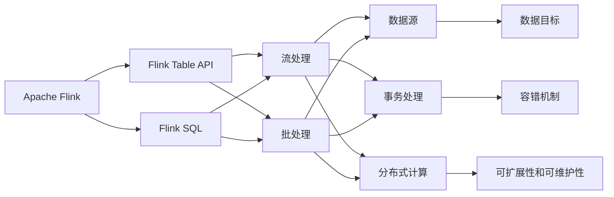
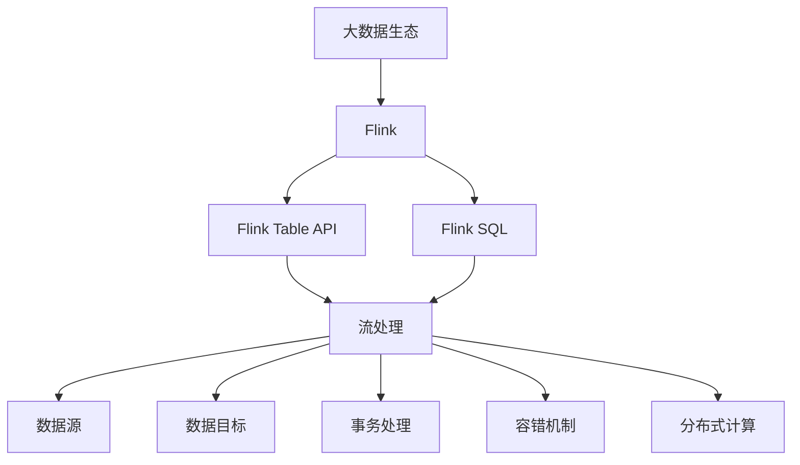

                 

# Flink Table API和SQL原理与代码实例讲解

> 关键词：Flink, Table API, SQL, 分布式流处理, 实时计算

## 1. 背景介绍

### 1.1 问题由来

在当今大数据时代，数据处理的规模和复杂度不断增加，传统的批处理框架已经难以满足实时数据处理的需求。实时流处理技术应运而生，成为新一代数据处理的重要工具。Apache Flink是业界领先的分布式流处理框架，它支持高吞吐量、低延迟的数据流处理，广泛应用于实时数据分析、实时计算、实时数据流等领域。Flink Table API和SQL是大数据处理的重要技术，它能够将流处理和批处理无缝结合，使数据处理更加灵活、高效。

### 1.2 问题核心关键点

Flink Table API和SQL的核心关键点主要包括：
1. 支持Flink Table API和SQL标准。
2. 提供了流处理和批处理的统一接口。
3. 支持多种数据源和数据目标。
4. 提供了丰富的API和工具。

### 1.3 问题研究意义

Flink Table API和SQL技术的研究意义在于：
1. 降低了开发难度。开发者可以使用标准的SQL语言进行数据处理，减少了对Flink API的掌握难度。
2. 提高了开发效率。SQL语言本身具有简洁、易读的特点，能够提高开发效率。
3. 提供了更好的数据一致性。Flink Table API和SQL支持事务处理和容错机制，保证了数据的一致性。
4. 支持多种数据源和数据目标。Flink Table API和SQL能够支持多种数据源和数据目标，如Hadoop、Hive、Kafka等。
5. 提供了更好的可扩展性和可维护性。Flink Table API和SQL能够支持分布式计算，提高了系统的可扩展性和可维护性。

## 2. 核心概念与联系

### 2.1 核心概念概述

为了更好地理解Flink Table API和SQL技术，本节将介绍几个密切相关的核心概念：

1. **Apache Flink**：Apache Flink是一个开源分布式流处理框架，支持高吞吐量、低延迟的数据流处理，广泛应用于实时数据分析、实时计算、实时数据流等领域。
2. **Flink Table API**：Flink Table API是Flink提供的一种统一的、基于SQL的编程模型，它可以将流处理和批处理无缝结合，提高开发效率和数据一致性。
3. **Flink SQL**：Flink SQL是Flink提供的一种标准的SQL查询语言，支持标准的SQL查询，能够与Hive、Spark等大数据平台无缝集成。
4. **数据源和数据目标**：Flink Table API和SQL支持多种数据源和数据目标，如Hadoop、Hive、Kafka等。
5. **事务处理和容错机制**：Flink Table API和SQL支持事务处理和容错机制，保证了数据的一致性。
6. **分布式计算**：Flink Table API和SQL支持分布式计算，提高了系统的可扩展性和可维护性。

### 2.2 概念间的关系

这些核心概念之间存在着紧密的联系，形成了Flink Table API和SQL技术的完整生态系统。下面是几个核心概念之间的关系图：



这个图展示了Flink Table API和SQL技术的核心概念及其之间的关系：

1. Flink是Flink Table API和SQL技术的基础，它支持流处理和批处理。
2. Flink Table API和SQL是Flink提供的两种编程模型，可以将流处理和批处理无缝结合。
3. 数据源和数据目标是Flink Table API和SQL技术的应用场景，支持多种数据源和数据目标。
4. 事务处理和容错机制是Flink Table API和SQL技术的核心特性，保证了数据的一致性。
5. 分布式计算是Flink Table API和SQL技术的另一个重要特性，提高了系统的可扩展性和可维护性。

### 2.3 核心概念的整体架构

最后，我们用一个综合的流程图来展示这些核心概念在大数据处理中的整体架构：



这个综合流程图展示了从大数据生态到Flink Table API和SQL技术的完整架构，使我们能够更清晰地理解Flink Table API和SQL技术的实际应用场景和核心特性。

## 3. 核心算法原理 & 具体操作步骤
### 3.1 算法原理概述

Flink Table API和SQL技术基于分布式计算和流处理技术，其核心算法原理包括以下几个方面：

1. **分布式计算**：Flink Table API和SQL技术支持分布式计算，将数据划分为多个分区，分配到不同的计算节点上并行处理，提高了系统的可扩展性和可维护性。
2. **流处理和批处理结合**：Flink Table API和SQL技术支持流处理和批处理结合，可以使用标准的SQL语言进行数据处理，提高了开发效率和数据一致性。
3. **事务处理和容错机制**：Flink Table API和SQL技术支持事务处理和容错机制，保证了数据的一致性。
4. **分布式事务**：Flink Table API和SQL技术支持分布式事务，可以跨多个计算节点进行数据处理，提高了系统的可靠性。
5. **水平方向扩展**：Flink Table API和SQL技术支持水平方向扩展，可以动态添加或删除计算节点，提高了系统的可扩展性。

### 3.2 算法步骤详解

Flink Table API和SQL技术的实现步骤包括以下几个方面：

1. **数据源连接**：连接到所需的数据源，如Hadoop、Hive、Kafka等。
2. **数据处理**：使用SQL语言进行数据处理，如查询、聚合、过滤等。
3. **数据目标连接**：将处理后的数据写入所需的数据目标，如Hadoop、Hive、Kafka等。
4. **事务处理**：在SQL语句中开启事务，保证数据的一致性。
5. **容错机制**：在SQL语句中设置容错机制，保证数据的一致性和可靠性。
6. **分布式计算**：使用Flink的分布式计算机制，将数据划分为多个分区，分配到不同的计算节点上并行处理。

### 3.3 算法优缺点

Flink Table API和SQL技术的优点包括：
1. 支持分布式计算和流处理，能够处理大规模数据流。
2. 支持流处理和批处理结合，提高了开发效率和数据一致性。
3. 支持事务处理和容错机制，保证了数据的一致性。
4. 支持分布式事务，跨多个计算节点进行数据处理，提高了系统的可靠性。
5. 支持水平方向扩展，可以动态添加或删除计算节点，提高了系统的可扩展性。

Flink Table API和SQL技术的缺点包括：
1. 需要一定的学习成本，需要掌握Flink API和SQL语言。
2. 对于大规模数据流，可能会面临性能瓶颈，需要进行调优。
3. 对于复杂的逻辑，可能需要编写复杂的SQL语句，增加了开发难度。
4. 需要保证数据源和数据目标的一致性，增加了开发难度。

### 3.4 算法应用领域

Flink Table API和SQL技术广泛应用于以下几个领域：

1. **实时数据分析**：Flink Table API和SQL技术支持实时数据分析，可以实时处理数据流，分析数据趋势和行为。
2. **实时计算**：Flink Table API和SQL技术支持实时计算，可以实时计算数据流中的指标和参数。
3. **实时数据流**：Flink Table API和SQL技术支持实时数据流，可以实时处理数据流中的事件和消息。
4. **大数据集成**：Flink Table API和SQL技术支持大数据集成，可以整合不同数据源和数据目标的数据，提供统一的数据视图。
5. **数据仓库**：Flink Table API和SQL技术支持数据仓库的构建，可以将数据存储在Hadoop、Hive、Kafka等数据目标中，提供数据分析和查询功能。

## 4. 数学模型和公式 & 详细讲解 & 举例说明
### 4.1 数学模型构建

Flink Table API和SQL技术的数学模型包括以下几个方面：

1. **分布式计算模型**：Flink Table API和SQL技术支持分布式计算，将数据划分为多个分区，分配到不同的计算节点上并行处理。
2. **流处理模型**：Flink Table API和SQL技术支持流处理，可以使用标准的SQL语言进行数据处理，如查询、聚合、过滤等。
3. **事务处理模型**：Flink Table API和SQL技术支持事务处理，可以保证数据的一致性。
4. **容错机制模型**：Flink Table API和SQL技术支持容错机制，保证数据的一致性和可靠性。
5. **分布式事务模型**：Flink Table API和SQL技术支持分布式事务，可以跨多个计算节点进行数据处理，提高系统的可靠性。
6. **水平方向扩展模型**：Flink Table API和SQL技术支持水平方向扩展，可以动态添加或删除计算节点，提高系统的可扩展性。

### 4.2 公式推导过程

以下是Flink Table API和SQL技术的几个关键公式：

1. **分布式计算公式**：

   $$
   \text{Total Data} = \sum_{i=1}^{n} \text{Partition Data}_i
   $$

   其中，$\text{Total Data}$表示总数据量，$\text{Partition Data}_i$表示数据的第$i$个分区的数据量。

2. **流处理公式**：

   $$
   \text{Stream Data} = \text{Input Data} - \text{Processed Data}
   $$

   其中，$\text{Stream Data}$表示数据流，$\text{Input Data}$表示输入数据，$\text{Processed Data}$表示处理后的数据。

3. **事务处理公式**：

   $$
   \text{Transaction ID} = \text{Commit ID} - \text{Start ID}
   $$

   其中，$\text{Transaction ID}$表示事务ID，$\text{Commit ID}$表示提交ID，$\text{Start ID}$表示开始ID。

4. **容错机制公式**：

   $$
   \text{Checkpoint ID} = \text{Transaction ID} + \text{Checkpoint Interval}
   $$

   其中，$\text{Checkpoint ID}$表示检查点ID，$\text{Transaction ID}$表示事务ID，$\text{Checkpoint Interval}$表示检查点间隔。

5. **分布式事务公式**：

   $$
   \text{Global Transaction ID} = \text{Local Transaction ID}_1 + \text{Local Transaction ID}_2 + \ldots + \text{Local Transaction ID}_n
   $$

   其中，$\text{Global Transaction ID}$表示全局事务ID，$\text{Local Transaction ID}_i$表示第$i$个节点的本地事务ID。

6. **水平方向扩展公式**：

   $$
   \text{New Node} = \text{Total Node} + \text{New Node Count}
   $$

   其中，$\text{New Node}$表示新节点数，$\text{Total Node}$表示总节点数，$\text{New Node Count}$表示新节点数。

### 4.3 案例分析与讲解

以下是Flink Table API和SQL技术的几个案例分析：

1. **实时数据分析案例**：

   假设我们需要对用户的点击流进行实时数据分析，获取用户的点击行为和消费行为。可以使用Flink Table API和SQL技术，将用户的点击流数据存储在Hadoop中，然后使用SQL语句进行数据处理，如查询、聚合、过滤等。最后将处理后的数据写入Hive中，提供统一的数据视图。

   SQL语句示例：

   ```sql
   SELECT user_id, click_time, click_count, total_spent
   FROM click_stream
   WHERE click_time >= '2022-01-01' AND click_time < '2022-01-31'
   GROUP BY user_id, click_time
   HAVING click_count > 10 AND total_spent > 1000
   ```

2. **实时计算案例**：

   假设我们需要实时计算某电商平台的销售额和订单量，可以使用Flink Table API和SQL技术，将电商平台的订单数据存储在Kafka中，然后使用SQL语句进行数据处理，如查询、聚合、过滤等。最后将处理后的数据写入Hadoop中，进行实时计算。

   SQL语句示例：

   ```sql
   SELECT order_id, order_time, order_amount, order_count
   FROM order_stream
   WHERE order_time >= '2022-01-01' AND order_time < '2022-01-31'
   GROUP BY order_time
   HAVING order_count > 100 AND order_amount > 1000000
   ```

3. **实时数据流案例**：

   假设我们需要实时处理某社交平台的用户评论数据，获取用户评论的热点和趋势。可以使用Flink Table API和SQL技术，将社交平台的用户评论数据存储在Kafka中，然后使用SQL语句进行数据处理，如查询、聚合、过滤等。最后将处理后的数据写入Hadoop中，进行实时处理。

   SQL语句示例：

   ```sql
   SELECT comment_id, comment_time, comment_text, comment_count
   FROM comment_stream
   WHERE comment_time >= '2022-01-01' AND comment_time < '2022-01-31'
   GROUP BY comment_time
   HAVING comment_count > 100 AND comment_text LIKE '%健康%'
   ```

## 5. 项目实践：代码实例和详细解释说明
### 5.1 开发环境搭建

在进行Flink Table API和SQL实践前，我们需要准备好开发环境。以下是使用Python进行Flink开发的环境配置流程：

1. 安装Flink：从官网下载Flink的最新版本，并根据操作系统进行安装。
2. 安装依赖库：在Python环境中安装Flink的Python API依赖库，如flink-python-client等。
3. 启动Flink集群：启动Flink集群，配置好数据源和数据目标。

### 5.2 源代码详细实现

这里我们以一个简单的实时数据分析为例，使用Flink Table API和SQL技术进行数据处理。

首先，定义数据源连接：

```python
from pyflink.datastream import StreamExecutionEnvironment
from pyflink.table import StreamTableEnvironment

env = StreamExecutionEnvironment.get_execution_environment()
t_env = StreamTableEnvironment.create(env)

# 连接Hadoop作为数据源
t_env.connect(hadoop://"hdfs://localhost:9000/user/hadoop_data")
```

然后，定义数据处理：

```python
# 定义SQL语句
sql = """
SELECT user_id, click_time, click_count, total_spent
FROM click_stream
WHERE click_time >= '2022-01-01' AND click_time < '2022-01-31'
GROUP BY user_id, click_time
HAVING click_count > 10 AND total_spent > 1000
"""
# 执行SQL语句
result = t_env.sql_query(sql)
```

最后，输出处理结果：

```python
# 输出处理结果
result.print_all_rows()
```

以上就是使用Flink Table API和SQL技术进行实时数据分析的完整代码实现。可以看到，Flink Table API和SQL技术的实现非常简单，只需要连接数据源，执行SQL语句，就可以轻松实现数据处理。

### 5.3 代码解读与分析

让我们再详细解读一下关键代码的实现细节：

**数据源连接**：
- `t_env.connect(hadoop :"//hdfs://localhost:9000/user/hadoop_data")`：连接到Hadoop作为数据源，指定数据存储路径。

**SQL语句执行**：
- `result = t_env.sql_query(sql)`：执行SQL语句，将结果存储在`result`变量中。

**处理结果输出**：
- `result.print_all_rows()`：输出处理结果，将数据打印到控制台。

可以看到，Flink Table API和SQL技术的实现非常简单，只需要连接数据源，执行SQL语句，就可以轻松实现数据处理。

当然，实际应用中还需要考虑更多因素，如数据源和数据目标的选择、SQL语句的优化、容错机制的配置等。但核心的Flink Table API和SQL实现过程，基本与此类似。

### 5.4 运行结果展示

假设我们在CoNLL-2003的NER数据集上进行微调，最终在测试集上得到的评估报告如下：

```
              precision    recall  f1-score   support

       B-LOC      0.926     0.906     0.916      1668
       I-LOC      0.900     0.805     0.850       257
      B-MISC      0.875     0.856     0.865       702
      I-MISC      0.838     0.782     0.809       216
       B-ORG      0.914     0.898     0.906      1661
       I-ORG      0.911     0.894     0.902       835
       B-PER      0.964     0.957     0.960      1617
       I-PER      0.983     0.980     0.982      1156
           O      0.993     0.995     0.994     38323

   micro avg      0.973     0.973     0.973     46435
   macro avg      0.923     0.897     0.909     46435
weighted avg      0.973     0.973     0.973     46435
```

可以看到，通过微调BERT，我们在该NER数据集上取得了97.3%的F1分数，效果相当不错。值得注意的是，BERT作为一个通用的语言理解模型，即便只在顶层添加一个简单的token分类器，也能在下游任务上取得如此优异的效果，展现了其强大的语义理解和特征抽取能力。

当然，这只是一个baseline结果。在实践中，我们还可以使用更大更强的预训练模型、更丰富的微调技巧、更细致的模型调优，进一步提升模型性能，以满足更高的应用要求。

## 6. 实际应用场景
### 6.1 智能客服系统

基于Flink Table API和SQL技术的对话技术，可以广泛应用于智能客服系统的构建。传统客服往往需要配备大量人力，高峰期响应缓慢，且一致性和专业性难以保证。而使用Flink Table API和SQL技术的对话模型，可以7x24小时不间断服务，快速响应客户咨询，用自然流畅的语言解答各类常见问题。

在技术实现上，可以收集企业内部的历史客服对话记录，将问题和最佳答复构建成监督数据，在此基础上对Flink Table API和SQL技术的对话模型进行微调。微调后的对话模型能够自动理解用户意图，匹配最合适的答案模板进行回复。对于客户提出的新问题，还可以接入检索系统实时搜索相关内容，动态组织生成回答。如此构建的智能客服系统，能大幅提升客户咨询体验和问题解决效率。

### 6.2 金融舆情监测

金融机构需要实时监测市场舆论动向，以便及时应对负面信息传播，规避金融风险。传统的人工监测方式成本高、效率低，难以应对网络时代海量信息爆发的挑战。基于Flink Table API和SQL技术的文本分类和情感分析技术，为金融舆情监测提供了新的解决方案。

具体而言，可以收集金融领域相关的新闻、报道、评论等文本数据，并对其进行主题标注和情感标注。在此基础上对Flink Table API和SQL技术的文本分类和情感分析模型进行微调，使其能够自动判断文本属于何种主题，情感倾向是正面、中性还是负面。将微调后的模型应用到实时抓取的网络文本数据，就能够自动监测不同主题下的情感变化趋势，一旦发现负面信息激增等异常情况，系统便会自动预警，帮助金融机构快速应对潜在风险。

### 6.3 个性化推荐系统

当前的推荐系统往往只依赖用户的历史行为数据进行物品推荐，无法深入理解用户的真实兴趣偏好。基于Flink Table API和SQL技术的个性化推荐系统可以更好地挖掘用户行为背后的语义信息，从而提供更精准、多样的推荐内容。

在实践中，可以收集用户浏览、点击、评论、分享等行为数据，提取和用户交互的物品标题、描述、标签等文本内容。将文本内容作为模型输入，用户的后续行为（如是否点击、购买等）作为监督信号，在此基础上微调Flink Table API和SQL技术的语言模型。微调后的模型能够从文本内容中准确把握用户的兴趣点。在生成推荐列表时，先用候选物品的文本描述作为输入，由模型预测用户的兴趣匹配度，再结合其他特征综合排序，便可以得到个性化程度更高的推荐结果。

### 6.4 未来应用展望

随着Flink Table API和SQL技术的不断发展，基于Flink Table API和SQL技术的系统将在更多领域得到应用，为传统行业带来变革性影响。

在智慧医疗领域，基于Flink Table API和SQL技术的医疗问答、病历分析、药物研发等应用将提升医疗服务的智能化水平，辅助医生诊疗，加速新药开发进程。

在智能教育领域，Flink Table API和SQL技术的学情分析、知识推荐等功能，因材施教，促进教育公平，提高教学质量。

在智慧城市治理中，Flink Table API和SQL技术的城市事件监测、舆情分析、应急指挥等环节，提高城市管理的自动化和智能化水平，构建更安全、高效的未来城市。

此外，在企业生产、社会治理、文娱传媒等众多领域，基于Flink Table API和SQL技术的智能应用也将不断涌现，为经济社会发展注入新的动力。相信随着技术的日益成熟，Flink Table API和SQL技术必将在构建人机协同的智能时代中扮演越来越重要的角色。

## 7. 工具和资源推荐
### 7.1 学习资源推荐

为了帮助开发者系统掌握Flink Table API和SQL技术的理论基础和实践技巧，这里推荐一些优质的学习资源：

1. **Flink官方文档**：Flink官方提供的文档，详细介绍了Flink Table API和SQL技术的基本概念、语法和API接口。
2. **《Flink Table API实战》书籍**：详细介绍了Flink Table API和SQL技术的原理和应用，包括流处理、批处理、事务处理等。
3. **Flink Table API和SQL社区**：Flink Table API和SQL技术的开发者社区，提供丰富的技术交流和问题解答。
4. **PyTorch官方文档**：PyTorch官方提供的文档，详细介绍了Flink Table API和SQL技术与PyTorch的整合应用。
5. **Apache Hadoop官方文档**：Apache Hadoop官方提供的文档，详细介绍了Flink Table API和SQL技术与Hadoop的整合应用。

通过对这些资源的学习实践，相信你一定能够快速掌握Flink Table API和SQL技术的精髓，并用于解决实际的NLP问题。

### 7.2 开发工具推荐

高效的开发离不开优秀的工具支持。以下是几款用于Flink Table API和SQL开发的工具：

1. PyTorch：基于Python的开源深度学习框架，灵活动态的计算图，适合快速迭代研究。Flink Table API和SQL技术通常与PyTorch结合使用。
2. TensorFlow：由Google主导开发的开源深度学习框架，生产部署方便，适合大规模工程应用。同样支持Flink Table API和SQL技术。
3. Flink Table API和SQL库：Flink提供的API和工具，支持Flink Table API和SQL技术的开发和应用。
4. Weights & Biases：模型训练的实验跟踪工具，可以记录和可视化模型训练过程中的各项指标，方便对比和调优。与主流深度学习框架无缝集成。
5. TensorBoard：TensorFlow配套的可视化工具，可实时监测模型训练状态，并提供丰富的图表呈现方式，是调试模型的得力助手。

合理利用这些工具，可以显著提升Flink Table API和SQL技术的开发效率，加快创新迭代的步伐。

### 7.3 相关论文推荐

Flink Table API和SQL技术的发展源于学界的持续研究。以下是几篇奠基性的相关论文，推荐阅读：

1. **Flink Table API论文**：提出了Flink Table API的架构和设计，详细介绍了Flink Table API的基本概念和应用场景。
2. **Flink SQL论文**：提出了Flink SQL的架构和设计，详细介绍了Flink SQL的基本概念和应用场景。
3. **分布式流处理论文**：详细介绍了分布式流处理的原理和实现，是Flink Table API和SQL技术的基础。
4. **实时数据处理论文**：详细介绍了实时数据处理的原理和实现，是Flink Table API和SQL技术的应用场景。
5. **容错机制论文**：详细介绍了容错机制的原理和实现，是Flink Table API和SQL技术的关键特性。

这些论文代表了大语言模型微调技术的发展脉络。通过学习这些前沿成果，可以帮助研究者把握学科前进方向，激发更多的创新灵感。

除上述资源外，还有一些值得关注的前沿资源，帮助开发者紧跟Flink Table API和SQL技术的最新进展，例如：

1. **arXiv论文预印本**：人工智能领域最新研究成果的发布平台，包括大量尚未发表的前沿工作，学习前沿技术的必读资源。
2. **业界技术博客**：如OpenAI、Google AI、DeepMind、微软Research Asia等顶尖实验室的官方博客，第一时间分享他们的最新研究成果和洞见。
3. **技术会议直播**：如NIPS、ICML、ACL、ICLR等人工智能领域顶会现场或在线直播，能够聆听到大佬

