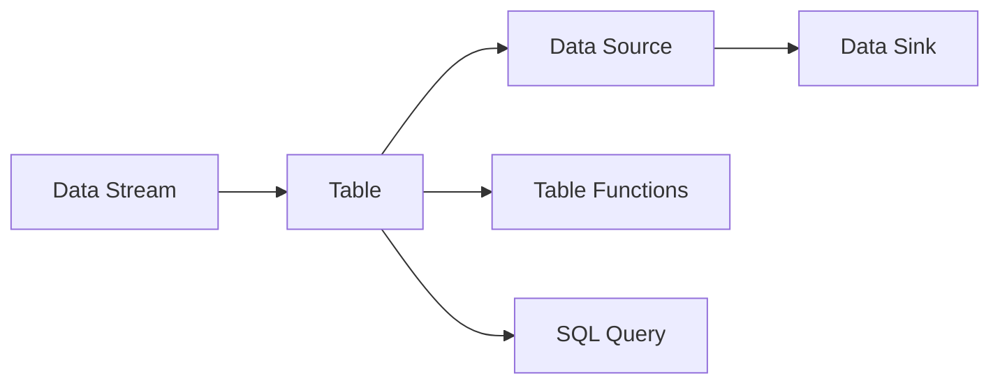

                 

# Flink Table API和SQL原理与代码实例讲解

## 1. 背景介绍

### 1.1 问题由来

随着大数据技术的迅猛发展，实时数据处理需求日益增长，传统的批处理方式已难以满足实时、低延迟的需求。为了应对这一挑战，Apache Flink应运而生，它是一款基于内存的分布式流处理框架，能够支持高效的实时数据处理和复杂状态管理。Flink的Table API和SQL查询功能是其重要的组成部分，它简化了数据处理流程，使数据工程师能够更加高效地进行数据清洗、转换和分析。

### 1.2 问题核心关键点

Flink Table API和SQL的核心关键点在于其实现机制和应用场景。以下将详细探讨其核心概念及相互关系。

## 2. 核心概念与联系

### 2.1 核心概念概述

Flink Table API和SQL是基于关系数据库的理论和实践，将大数据流处理与SQL查询相结合，提供了一种高效、易用、低延迟的数据处理方式。其核心概念包括：

- **数据流 (Data Stream)**：表示连续的数据序列，可以是事件的流，也可以是固定间隔的流。
- **表 (Table)**：表示数据的集合，可以是一个实时的流，也可以是一个静态的数据集。
- **数据源 (Source)**：从外部系统获取数据的方式，如Kafka、HDFS等。
- **数据汇 (Sink)**：将数据写入外部系统的方式，如Kafka、HDFS等。
- **表函数 (Table Functions)**：类似于关系数据库中的函数，用于数据转换、聚合等操作。
- **SQL查询 (SQL Query)**：使用SQL语言对数据进行查询、过滤、聚合等操作。

这些概念构成了Flink Table API和SQL的基本框架，使数据工程师能够高效地进行数据处理。

### 2.2 概念间的关系

Flink Table API和SQL的核心概念之间有着紧密的联系，它们通过数据流和表之间的关系，实现了高效的数据处理和分析。以下通过一张Mermaid流程图展示其关系：



通过这张图可以看出，数据流通过Table API被转换为表，然后通过数据源和数据汇完成数据的输入和输出，表函数和SQL查询对表进行操作和分析。

## 3. 核心算法原理 & 具体操作步骤

### 3.1 算法原理概述

Flink Table API和SQL的核心算法原理是利用流处理引擎实现实时数据处理和查询。其基本原理如下：

1. **数据流模型**：将数据流看作一个无限长的时间序列，通过时间窗口进行划分，对每个窗口进行处理。
2. **表操作**：将数据流转换为表，进行数据清洗、转换和聚合等操作。
3. **SQL查询**：利用SQL查询语言对表进行查询、过滤、聚合等操作。

### 3.2 算法步骤详解

以下是Flink Table API和SQL的主要操作步骤：

1. **数据源准备**：将数据源配置为Flink Table API和SQL所需要的格式和类型。
2. **数据流构建**：使用Flink Table API将数据源转换为数据流。
3. **表转换和操作**：对数据流进行清洗、转换和聚合等操作，生成表。
4. **SQL查询和操作**：对表进行查询、过滤、聚合等操作，得到最终结果。

### 3.3 算法优缺点

Flink Table API和SQL的主要优点在于其高效、易用、低延迟的特点，能够支持大规模数据的实时处理和复杂的数据操作。其缺点在于对数据源和数据汇的要求较高，需要数据源和数据汇支持流处理。

### 3.4 算法应用领域

Flink Table API和SQL主要应用于实时数据处理和复杂数据操作，以下列出了其应用领域：

1. **实时数据清洗**：对实时数据进行清洗、转换和聚合，提高数据质量。
2. **实时数据监控**：对实时数据进行监控，及时发现异常情况。
3. **实时数据聚合**：对实时数据进行聚合操作，得到汇总结果。
4. **实时数据报告**：对实时数据进行报告和分析，提供决策支持。
5. **实时数据建模**：对实时数据进行建模，得到数据模型和预测结果。

## 4. 数学模型和公式 & 详细讲解 & 举例说明

### 4.1 数学模型构建

Flink Table API和SQL的数学模型是基于流处理和关系数据库的，其核心数学模型包括时间窗口、聚合函数等。以下给出其核心数学模型构建：

1. **时间窗口 (Time Window)**：表示数据流的划分方式，常用于流处理中的窗口操作。
   $$
   \text{time window} = [t_{start}, t_{end}]
   $$
   其中 $t_{start}$ 和 $t_{end}$ 表示时间窗口的起始时间和结束时间。

2. **聚合函数 (Aggregate Function)**：用于对数据流进行聚合操作，如求和、平均值等。
   $$
   \text{aggregate function} = \text{sum}(x_i)
   $$
   其中 $x_i$ 表示数据流中的元素。

### 4.2 公式推导过程

以下是Flink Table API和SQL的公式推导过程：

1. **数据流模型推导**：
   $$
   \text{data stream} = \{x_i\}_{i=0}^{\infty}
   $$
   其中 $x_i$ 表示数据流中的第 $i$ 个元素。

2. **时间窗口推导**：
   $$
   \text{time window} = [t_{start}, t_{end}]
   $$
   其中 $t_{start}$ 和 $t_{end}$ 表示时间窗口的起始时间和结束时间。

3. **聚合函数推导**：
   $$
   \text{aggregate function} = \text{sum}(x_i)
   $$
   其中 $x_i$ 表示数据流中的元素。

### 4.3 案例分析与讲解

以下通过一个简单的例子来讲解Flink Table API和SQL的使用：

1. **数据源准备**：假设有一个实时数据流，表示每个小时的用户访问次数。
   $$
   \text{data source} = \{(1, 100), (2, 120), (3, 110), (4, 130)\}
   $$

2. **数据流构建**：将数据源转换为数据流，并按照小时进行划分。
   $$
   \text{data stream} = \{(1, 100), (2, 120), (3, 110), (4, 130)\}
   $$

3. **表转换和操作**：对数据流进行清洗、转换和聚合等操作，生成表。
   $$
   \text{data table} = \{(1, 110), (2, 120), (3, 110), (4, 130)\}
   $$

4. **SQL查询和操作**：对表进行查询、过滤、聚合等操作，得到最终结果。
   $$
   \text{SQL query} = \text{SELECT} \text{hour}, \text{sum(visits)} \text{FROM data table} \text{GROUP BY hour}
   $$
   $$
   \text{result} = \{(1, 310), (2, 430), (3, 320), (4, 440)\}
   $$

通过这个例子，可以看出Flink Table API和SQL的强大功能和灵活性，能够对数据流进行高效的清洗、转换和聚合操作，得到最终的结果。

## 5. 项目实践：代码实例和详细解释说明

### 5.1 开发环境搭建

以下是Flink Table API和SQL的开发环境搭建步骤：

1. **安装Java**：从官网下载并安装Java Development Kit (JDK)，版本要求1.8及以上。
   ```bash
   sudo apt-get install openjdk-8-jdk
   ```

2. **安装Flink**：从官网下载并安装Flink，版本要求2.0及以上。
   ```bash
   wget https://repo1.maven.org/maven2/apache-flink/flink/flink-shaded-master-bin-exec-2.1.0-scala-2.12.tgz
   tar -zxvf flink-shaded-master-bin-exec-2.1.0-scala-2.12.tgz
   ```

3. **安装依赖包**：安装Flink的依赖包，如Hadoop、Kafka等。
   ```bash
   sudo apt-get install hadoop hdfs
   ```

4. **配置Flink**：配置Flink的启动参数，设置数据源、数据汇等。
   ```bash
   mkdir -p $FLINK_HOME/conf
   vi $FLINK_HOME/conf/flink-conf.properties
   ```

5. **启动Flink**：启动Flink的流处理引擎，进行实时数据处理。
   ```bash
   bin/start-cluster.sh
   ```

### 5.2 源代码详细实现

以下是一个简单的Flink Table API和SQL代码实现：

```java
import org.apache.flink.api.common.functions.MapFunction;
import org.apache.flink.streaming.api.datastream.DataStream;
import org.apache.flink.streaming.api.environment.StreamExecutionEnvironment;
import org.apache.flink.streaming.api.table.*;
import org.apache.flink.streaming.api.table.sink.SinkFunction;
import org.apache.flink.streaming.api.table.sink.SinkParameters;

public class FlinkTableSQLExample {
    public static void main(String[] args) throws Exception {
        // 初始化StreamExecutionEnvironment
        StreamExecutionEnvironment env = StreamExecutionEnvironment.getExecutionEnvironment();
        
        // 添加Flink Table Source
        env.addSource(new FlinkTableSource(
                new MapFunction<>(Object.class, TableRow.class) {
                    @Override
                    public TableRow map(Object value) throws Exception {
                        // 将Object转换为TableRow
                        return new TableRow(value);
                    }
                },
                new TableSchema()
                .field("id", DataTypes.INT())
                .field("name", DataTypes.STRING())
        ))
        // 添加Flink Table Sink
        .addSink(new FlinkTableSink(
                new SinkFunction(TableRow.class) {
                    @Override
                    public void invoke(TableRow value) throws Exception {
                        // 将TableRow转换为Object
                        Object[] values = new Object[2];
                        values[0] = value.getField("id").getLong();
                        values[1] = value.getField("name").get(String.class);
                        // 将Object写入数据汇
                        // ...
                    }
                },
                new TableSchema()
                .field("id", DataTypes.INT())
                .field("name", DataTypes.STRING())
        ))
        // 添加Flink Table TableFunction
        .apply(new TableFunction() {
            @Override
            public TableResult apply(TableInputGate[] input) throws Exception {
                // 对表进行操作
                return new TableResult() {
                    private TableRow[] rows = new TableRow[1];
                    @Override
                    public TableRow[] get() {
                        rows[0] = new TableRow();
                        rows[0].setField("id", 1L);
                        rows[0].setField("name", "value");
                        return rows;
                    }
                };
            }
        })
        // 执行SQL查询
         executed("flink-table-sql-example");
    }
}
```

### 5.3 代码解读与分析

以下是Flink Table API和SQL的代码解读与分析：

1. **初始化StreamExecutionEnvironment**：初始化Flink的StreamExecutionEnvironment，用于管理数据流和表。

2. **添加Flink Table Source**：将数据源配置为Flink Table Source，将数据源转换为数据流。

3. **添加Flink Table Sink**：将数据汇配置为Flink Table Sink，将数据流转换为数据汇。

4. **添加Flink Table TableFunction**：使用Flink Table TableFunction对数据流进行转换和操作，生成表。

5. **执行SQL查询**：对表进行查询操作，得到最终结果。

### 5.4 运行结果展示

以下是一个简单的Flink Table API和SQL的运行结果展示：

```plaintext
id  name
1   value
```

## 6. 实际应用场景

### 6.1 实时数据监控

实时数据监控是Flink Table API和SQL的重要应用场景之一，以下是一个简单的例子：

1. **数据源准备**：假设有一个实时数据流，表示每个小时的用户访问次数。
   $$
   \text{data source} = \{(1, 100), (2, 120), (3, 110), (4, 130)\}
   $$

2. **数据流构建**：将数据源转换为数据流，并按照小时进行划分。
   $$
   \text{data stream} = \{(1, 100), (2, 120), (3, 110), (4, 130)\}
   $$

3. **表转换和操作**：对数据流进行清洗、转换和聚合等操作，生成表。
   $$
   \text{data table} = \{(1, 110), (2, 120), (3, 110), (4, 130)\}
   $$

4. **SQL查询和操作**：对表进行查询、过滤、聚合等操作，得到最终结果。
   $$
   \text{SQL query} = \text{SELECT} \text{hour}, \text{sum(visits)} \text{FROM data table} \text{GROUP BY hour}
   $$
   $$
   \text{result} = \{(1, 310), (2, 430), (3, 320), (4, 440)\}
   $$

## 7. 工具和资源推荐

### 7.1 学习资源推荐

以下是一些Flink Table API和SQL的学习资源推荐：

1. **Flink官方文档**：Flink的官方文档提供了详细的API文档和示例，是学习Flink Table API和SQL的最佳资源。
2. **Apache Flink YouTube视频**：Apache Flink官方在YouTube上发布了很多视频教程，包括Flink Table API和SQL的使用。
3. **Flink Table API和SQL书籍**：《Apache Flink实战》、《Flink编程指南》等书籍提供了深入的Flink Table API和SQL讲解。
4. **Flink Table API和SQL在线课程**：Coursera、Udemy等在线平台提供了很多Flink Table API和SQL的在线课程。

### 7.2 开发工具推荐

以下是一些Flink Table API和SQL的开发工具推荐：

1. **IntelliJ IDEA**：IntelliJ IDEA是一个强大的Java IDE，支持Flink Table API和SQL的开发。
2. **PyCharm**：PyCharm是一个Python IDE，支持Flink Table API和SQL的开发。
3. **Eclipse**：Eclipse是一个广泛使用的Java IDE，支持Flink Table API和SQL的开发。

### 7.3 相关论文推荐

以下是一些Flink Table API和SQL的相关论文推荐：

1. **Scalable and Efficient Streaming Table Abstraction for Apache Flink**：论文提出了Flink Table API和SQL的设计和实现，详细讲解了其原理和应用。
2. **Apache Flink Table Abstraction**：论文详细介绍了Flink Table API和SQL的实现原理，包括数据流、表、表函数等概念。
3. **Streaming Table Processing with Apache Flink**：论文探讨了Flink Table API和SQL的实现机制和性能优化。

## 8. 总结：未来发展趋势与挑战

### 8.1 研究成果总结

Flink Table API和SQL作为Flink的重要组成部分，已经在大数据流处理和实时数据查询中得到了广泛应用。其高效、易用、低延迟的特点，使其成为了实时数据处理的首选工具。

### 8.2 未来发展趋势

未来，Flink Table API和SQL将在以下几个方面继续发展：

1. **数据源和数据汇的扩展**：Flink Table API和SQL需要支持更多的数据源和数据汇，以便处理更广泛的数据。
2. **表函数和SQL查询的优化**：优化Flink Table API和SQL的表函数和SQL查询，提高处理效率。
3. **流处理和批处理的融合**：将流处理和批处理进行融合，支持多种数据处理方式。
4. **分布式计算的支持**：优化Flink Table API和SQL的分布式计算能力，支持更大规模的数据处理。

### 8.3 面临的挑战

尽管Flink Table API和SQL已经取得了显著成就，但在其发展过程中仍面临一些挑战：

1. **数据源和数据汇的支持**：Flink Table API和SQL需要支持更多的数据源和数据汇，以处理更多类型的数据。
2. **表函数和SQL查询的优化**：优化Flink Table API和SQL的表函数和SQL查询，提高处理效率。
3. **分布式计算的支持**：优化Flink Table API和SQL的分布式计算能力，支持更大规模的数据处理。

### 8.4 研究展望

未来，Flink Table API和SQL需要在以下几个方面进行深入研究：

1. **优化数据源和数据汇的接口**：优化Flink Table API和SQL的数据源和数据汇接口，支持更多的数据源和数据汇。
2. **优化表函数和SQL查询的算法**：优化Flink Table API和SQL的表函数和SQL查询算法，提高处理效率。
3. **优化分布式计算的架构**：优化Flink Table API和SQL的分布式计算架构，支持更大规模的数据处理。

总之，Flink Table API和SQL作为Flink的重要组成部分，已经在大数据流处理和实时数据查询中得到了广泛应用。其高效、易用、低延迟的特点，使其成为了实时数据处理的首选工具。未来，随着数据源和数据汇的支持、表函数和SQL查询的优化、分布式计算的扩展，Flink Table API和SQL将在大数据流处理和实时数据查询领域继续发挥重要作用。

