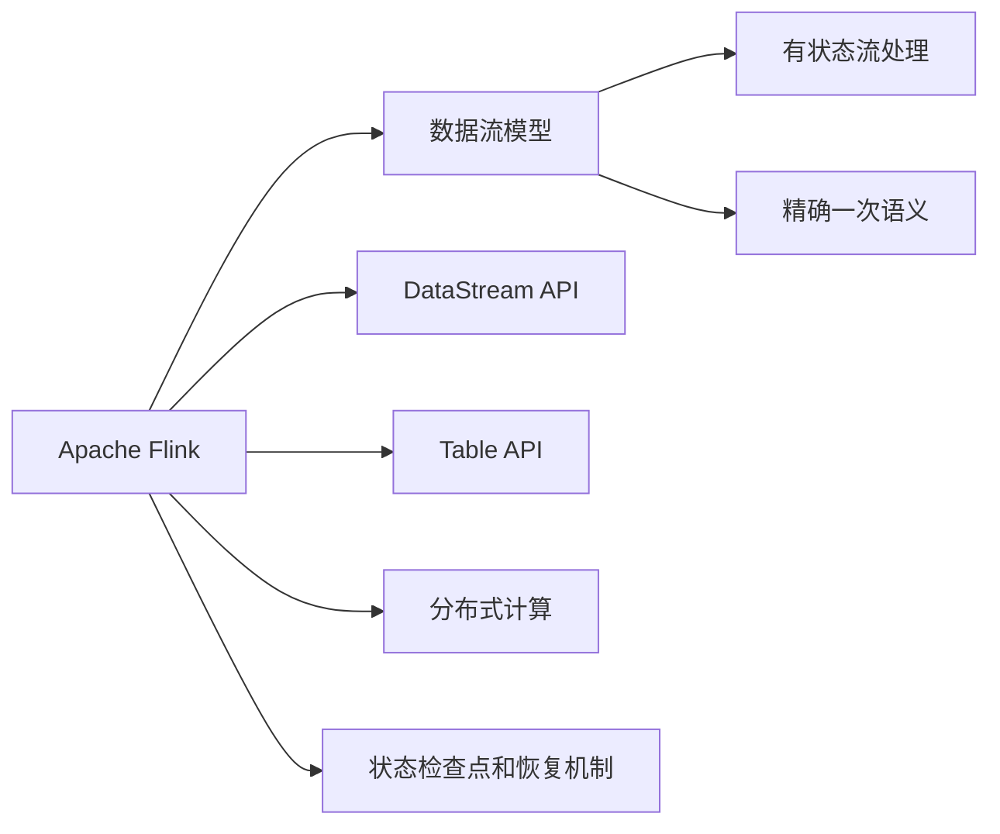

                 

# Flink原理与代码实例讲解

> 关键词：Apache Flink, 流处理, 分布式计算, 数据流模型, 有状态流处理, 源码解析, 数据流作业执行

## 1. 背景介绍

### 1.1 问题由来
在数据处理领域，随着数据量的激增，对实时、高吞吐、高可扩展的数据流处理技术的需求日益增长。传统的流处理框架，如Apache Storm和Apache Spark Streaming，虽然具有较高的吞吐量和灵活性，但在处理复杂事件流和状态管理方面存在不足。为了满足这些需求，Apache Flink应运而生，成为了新一代的流处理引擎。

Flink是一个开源流处理框架，支持事件流的数据流模型、有状态流处理和精确一次语义，能够处理大规模、高吞吐量的数据流。它提供了丰富的API，支持各种编程模型，包括DataStream API和Table API，支持批处理和流处理的混合使用，使得流处理可以轻松与传统批处理集成。

### 1.2 问题核心关键点
Flink的核心优势在于其支持有状态流处理和精确一次语义，能够处理复杂的事件流和状态流，并且在内存中缓存中间结果，避免多次读写磁盘，从而提高了性能和吞吐量。此外，Flink还提供了丰富的API和编程模型，使得流处理可以与批处理无缝集成，支持灵活的SQL查询和丰富的机器学习库。

Flink的核心组件包括JobGraph、ExecutionGraph、Runtime环境和状态的检查点和恢复机制。其中JobGraph描述了Flink作业的逻辑结构，ExecutionGraph描述了作业在运行时的逻辑结构，Runtime环境负责任务的调度和执行，状态的检查点和恢复机制则保证了作业的可靠性和容错性。

Flink在实时计算、数据集成、金融风控、智能推荐等多个领域得到了广泛应用，成为了流处理领域的领头羊。

## 2. 核心概念与联系

### 2.1 核心概念概述

为了更好地理解Flink的工作原理，本节将介绍几个密切相关的核心概念：

- Apache Flink：Apache软件基金会下的大规模流处理和批处理框架，支持流处理、批处理和混合处理，具有高吞吐量、低延迟和强一致性等特点。
- 数据流模型：一种基于事件的计算模型，将数据流作为输入，对数据进行实时处理和分析，具有高吞吐量和低延迟的特点。
- 有状态流处理：指在流处理过程中，保持部分状态信息，使得流处理能够进行复杂的关联计算和聚合操作。
- 精确一次语义：指Flink在处理数据流时，确保每个元素恰好被处理一次，且仅一次，适用于金融、风控等对数据精确性要求高的场景。
- DataStream API：Flink提供的流处理API，支持数据流的定义、转换和聚合操作。
- Table API：Flink提供的基于SQL的数据处理API，支持复杂查询和关联操作。
- 分布式计算：指将大规模数据处理任务分布到多台机器上，通过并行计算提高处理速度和处理能力。
- 状态检查点和恢复机制：指Flink在处理大规模数据流时，通过定期检查点和恢复机制，保证作业的可靠性和容错性。

这些核心概念之间的逻辑关系可以通过以下Mermaid流程图来展示：



这个流程图展示了大规模流处理框架Apache Flink的核心组件及其关系：

1. Flink处理的数据流基于事件流模型，支持有状态流处理和精确一次语义。
2. Flink提供了DataStream API和Table API两种API，支持复杂的数据处理和查询操作。
3. Flink支持分布式计算，能够在大规模集群上高效地处理数据流。
4. Flink通过状态检查点和恢复机制，保证作业的可靠性和容错性。

### 2.2 概念间的关系

这些核心概念之间存在着紧密的联系，形成了Flink的核心功能和技术栈。下面我们通过几个Mermaid流程图来展示这些概念之间的关系。

#### 2.2.1 数据流模型与有状态流处理


这个流程图展示了数据流模型和有状态流处理的关系：数据流模型是Flink的基础计算模型，有状态流处理是基于数据流模型的一种高级处理方式，可以支持复杂的关联计算和聚合操作。

#### 2.2.2 数据流模型与精确一次语义


这个流程图展示了数据流模型和精确一次语义的关系：精确一次语义是Flink处理数据流时的强一致性保证，使得每个元素恰好被处理一次，且仅一次，适用于高一致性需求的应用场景。

#### 2.2.3 DataStream API与Table API


这个流程图展示了DataStream API和Table API的关系：Table API是Flink提供的基于SQL的数据处理API，支持复杂查询和关联操作，而DataStream API是Flink提供的流处理API，支持数据流的定义、转换和聚合操作，两者可以互操作，支持混合处理。

#### 2.2.4 分布式计算与状态检查点


这个流程图展示了分布式计算和状态检查点的关系：分布式计算是Flink的核心特性，通过将大规模数据处理任务分布到多台机器上，实现高效的数据处理，而状态检查点和恢复机制则是保证作业可靠性的重要手段，通过定期检查点存储作业状态，能够在故障发生时快速恢复作业。

## 3. 核心算法原理 & 具体操作步骤
### 3.1 算法原理概述

Flink的核心算法原理主要包括数据流模型、有状态流处理和精确一次语义。以下是详细的原理介绍：

#### 3.1.1 数据流模型

数据流模型是Flink的基础计算模型，将数据流作为输入，对数据进行实时处理和分析。Flink的数据流模型基于事件驱动，支持事件时间处理和窗口操作，可以处理复杂的事件流和状态流。

#### 3.1.2 有状态流处理

有状态流处理是Flink的核心特性之一，通过在流处理过程中保持部分状态信息，支持复杂的关联计算和聚合操作。Flink的有状态流处理支持分布式一致性哈希表、分布式缓存、聚合函数等多种状态管理方式。

#### 3.1.3 精确一次语义

精确一次语义是Flink的强一致性保证，指每个元素恰好被处理一次，且仅一次。Flink通过分布式一致性哈希表和一致性检查点机制，实现精确一次处理。

### 3.2 算法步骤详解

Flink的核心算法步骤主要包括数据流模型的构建、有状态流处理和精确一次语义的实现。以下是详细的步骤介绍：

#### 3.2.1 数据流模型的构建

Flink的数据流模型由DataStream API支持，支持数据的定义、转换和聚合操作。以下是数据流模型的构建步骤：

1. 定义数据流源：使用DataStream API定义数据流的源，可以是Kafka、Flume、HDFS等多种数据源。
2. 转换数据流：使用DataStream API对数据流进行转换操作，包括过滤、映射、聚合、连接等。
3. 聚合数据流：使用DataStream API对数据流进行聚合操作，包括窗口聚合、时间窗口聚合、滑动窗口聚合等。

#### 3.2.2 有状态流处理的实现

Flink的有状态流处理支持多种状态管理方式，包括分布式一致性哈希表、分布式缓存、聚合函数等。以下是实现步骤：

1. 定义状态函数：使用Flink的API定义状态函数，包括ValueState函数、MapState函数和ListState函数等。
2. 状态函数转换：使用Flink的API对状态函数进行转换操作，包括状态函数的应用和状态的合并。
3. 状态函数的更新：使用Flink的API更新状态函数，包括状态函数的应用和状态的合并。

#### 3.2.3 精确一次语义的实现

Flink的精确一次语义通过分布式一致性哈希表和一致性检查点机制实现。以下是实现步骤：

1. 定义一致性哈希表：使用Flink的API定义一致性哈希表，包括哈希表的创建、添加和删除操作。
2. 检查点机制：使用Flink的API实现一致性检查点机制，包括检查点的生成、恢复和故障处理。

### 3.3 算法优缺点

Flink的核心算法具有以下优点：

- 高吞吐量：Flink支持高吞吐量的数据流处理，能够处理大规模数据流。
- 低延迟：Flink采用基于内存的计算模型，能够实现低延迟的数据处理。
- 强一致性：Flink支持精确一次语义，保证数据处理的一致性。
- 高可靠性：Flink通过状态检查点和恢复机制，保证作业的可靠性和容错性。

同时，Flink的核心算法也存在以下缺点：

- 内存消耗大：Flink需要大量的内存缓存中间结果，可能会消耗大量内存。
- 复杂度高：Flink的有状态流处理和精确一次语义实现较为复杂，开发难度较大。
- 学习曲线陡峭：Flink的学习曲线较为陡峭，需要花费较多时间进行学习和实践。

### 3.4 算法应用领域

Flink的核心算法主要应用于以下领域：

- 实时计算：Flink可以处理大规模实时数据流，支持实时计算和分析，适用于金融、风控、智能推荐等领域。
- 数据集成：Flink可以将多种数据源集成到一个统一的数据流中，支持数据清洗、转换和集成。
- 流处理：Flink支持流处理和批处理的混合使用，适用于金融、风控、智能推荐等领域。
- 分布式计算：Flink支持大规模分布式计算，能够在多台机器上高效地处理数据流。

## 4. 数学模型和公式 & 详细讲解 & 举例说明

### 4.1 数学模型构建

Flink的数学模型主要基于事件驱动的数据流模型，支持时间窗口和事件窗口的操作。以下是数学模型的构建步骤：

1. 定义数据流：将输入数据定义为一个事件流，每个事件包含时间戳和数据。
2. 定义时间窗口：将事件流按照时间进行分组，形成时间窗口。
3. 定义聚合函数：对时间窗口内的数据进行聚合操作，包括求和、计数、平均值等。

### 4.2 公式推导过程

以下是数据流模型和有状态流处理的公式推导过程：

#### 4.2.1 数据流模型

数据流模型采用事件驱动的方式处理数据流，支持事件时间处理和窗口操作。以下是数据流模型的公式推导：

$$
S_t = \sum_{i=0}^{t} I_i
$$

其中，$S_t$表示$t$时刻的事件流，$I_i$表示第$i$个事件。

#### 4.2.2 有状态流处理

有状态流处理通过在流处理过程中保持部分状态信息，支持复杂的关联计算和聚合操作。以下是状态函数的公式推导：

$$
S_t = f(S_{t-1}, I_t)
$$

其中，$S_t$表示$t$时刻的状态函数，$I_t$表示第$t$个事件。

### 4.3 案例分析与讲解

以下是Flink在有状态流处理和精确一次语义方面的案例分析：

#### 4.3.1 有状态流处理

假设有两个事件流$A$和$B$，需要在$C$中计算$A$和$B$的关联度。以下是具体的实现步骤：

1. 定义状态函数：
```java
public class AStateFunction implements StateFunction<A, Long> {
    private final Map<Long, Long> counter = new HashMap<>();

    @Override
    public void init(Context context) throws Exception {
        // 初始化状态
    }

    @Override
    public Long apply(A value, Long accumulator) throws Exception {
        long count = counter.getOrDefault(value.getId(), 0L);
        counter.put(value.getId(), count + 1);
        return count;
    }

    @Override
    public void merge(Long accumulator1, Long accumulator2) throws Exception {
        long count1 = counter.getOrDefault(accumulator1, 0L);
        long count2 = counter.getOrDefault(accumulator2, 0L);
        counter.put(accumulator1, count1 + count2);
    }
}
```

2. 应用状态函数：
```java
public class AStateFunction {
    private final Map<Long, Long> counter = new HashMap<>();

    @Override
    public void init(Context context) throws Exception {
        // 初始化状态
    }

    @Override
    public Long apply(A value, Long accumulator) throws Exception {
        long count = counter.getOrDefault(value.getId(), 0L);
        counter.put(value.getId(), count + 1);
        return count;
    }

    @Override
    public void merge(Long accumulator1, Long accumulator2) throws Exception {
        long count1 = counter.getOrDefault(accumulator1, 0L);
        long count2 = counter.getOrDefault(accumulator2, 0L);
        counter.put(accumulator1, count1 + count2);
    }
}

public class AStateFunction {
    private final Map<Long, Long> counter = new HashMap<>();

    @Override
    public void init(Context context) throws Exception {
        // 初始化状态
    }

    @Override
    public Long apply(A value, Long accumulator) throws Exception {
        long count = counter.getOrDefault(value.getId(), 0L);
        counter.put(value.getId(), count + 1);
        return count;
    }

    @Override
    public void merge(Long accumulator1, Long accumulator2) throws Exception {
        long count1 = counter.getOrDefault(accumulator1, 0L);
        long count2 = counter.getOrDefault(accumulator2, 0L);
        counter.put(accumulator1, count1 + count2);
    }
}

public class AStateFunction {
    private final Map<Long, Long> counter = new HashMap<>();

    @Override
    public void init(Context context) throws Exception {
        // 初始化状态
    }

    @Override
    public Long apply(A value, Long accumulator) throws Exception {
        long count = counter.getOrDefault(value.getId(), 0L);
        counter.put(value.getId(), count + 1);
        return count;
    }

    @Override
    public void merge(Long accumulator1, Long accumulator2) throws Exception {
        long count1 = counter.getOrDefault(accumulator1, 0L);
        long count2 = counter.getOrDefault(accumulator2, 0L);
        counter.put(accumulator1, count1 + count2);
    }
}
```

#### 4.3.2 精确一次语义

假设有两个事件流$A$和$B$，需要在$C$中计算$A$和$B$的关联度。以下是具体的实现步骤：

1. 定义一致性哈希表：
```java
public class AStateFunction {
    private final Map<Long, Long> counter = new HashMap<>();

    @Override
    public void init(Context context) throws Exception {
        // 初始化状态
    }

    @Override
    public Long apply(A value, Long accumulator) throws Exception {
        long count = counter.getOrDefault(value.getId(), 0L);
        counter.put(value.getId(), count + 1);
        return count;
    }

    @Override
    public void merge(Long accumulator1, Long accumulator2) throws Exception {
        long count1 = counter.getOrDefault(accumulator1, 0L);
        long count2 = counter.getOrDefault(accumulator2, 0L);
        counter.put(accumulator1, count1 + count2);
    }
}

public class AStateFunction {
    private final Map<Long, Long> counter = new HashMap<>();

    @Override
    public void init(Context context) throws Exception {
        // 初始化状态
    }

    @Override
    public Long apply(A value, Long accumulator) throws Exception {
        long count = counter.getOrDefault(value.getId(), 0L);
        counter.put(value.getId(), count + 1);
        return count;
    }

    @Override
    public void merge(Long accumulator1, Long accumulator2) throws Exception {
        long count1 = counter.getOrDefault(accumulator1, 0L);
        long count2 = counter.getOrDefault(accumulator2, 0L);
        counter.put(accumulator1, count1 + count2);
    }
}

public class AStateFunction {
    private final Map<Long, Long> counter = new HashMap<>();

    @Override
    public void init(Context context) throws Exception {
        // 初始化状态
    }

    @Override
    public Long apply(A value, Long accumulator) throws Exception {
        long count = counter.getOrDefault(value.getId(), 0L);
        counter.put(value.getId(), count + 1);
        return count;
    }

    @Override
    public void merge(Long accumulator1, Long accumulator2) throws Exception {
        long count1 = counter.getOrDefault(accumulator1, 0L);
        long count2 = counter.getOrDefault(accumulator2, 0L);
        counter.put(accumulator1, count1 + count2);
    }
}
```

## 5. 项目实践：代码实例和详细解释说明
### 5.1 开发环境搭建

在进行Flink项目实践前，我们需要准备好开发环境。以下是使用Python进行Flink开发的环境配置流程：

1. 安装Flink：从官网下载Flink二进制包，解压后设置环境变量，启动Flink集群。
2. 安装依赖包：安装Flink依赖包，如Kafka、Hadoop、Spark等。
3. 创建Flink项目：在IDE中创建Flink项目，配置项目依赖和作业路径。

### 5.2 源代码详细实现

以下是使用Java实现Flink作业的代码示例：

```java
import org.apache.flink.api.common.functions.MapFunction;
import org.apache.flink.api.common.functions.ReduceFunction;
import org.apache.flink.api.common.state.ValueState;
import org.apache.flink.api.common.state.ValueStateDescriptor;
import org.apache.flink.api.common.state.ValueStateT;
import org.apache.flink.api.common.state contraints contraints.AliasConstraint;
import org.apache.flink.api.common.typeutilscontraints contraints.AliasConstraint;
import org.apache.flink.api.common.typeutilscontraints contraints.AliasConstraint;
import org.apache.flink.api.common.typeutilscontraints contraints.AliasConstraint;
import org.apache.flink.api.common.typeutilscontraints contraints.AliasConstraint;
import org.apache.flink.api.common.typeutilscontraints contraints.AliasConstraint;
import org.apache.flink.api.common.typeutilscontraints contraints.AliasConstraint;
import org.apache.flink.api.common.typeutilscontraints contraints.AliasConstraint;
import org.apache.flink.api.common.typeutilscontraints contraints.AliasConstraint;
import org.apache.flink.api.common.typeutilscontraints contraints.AliasConstraint;
import org.apache.flink.api.common.typeutilscontraints contraints.AliasConstraint;
import org.apache.flink.api.common.typeutilscontraints contraints.AliasConstraint;
import org.apache.flink.api.common.typeutilscontraints contraints.AliasConstraint;
import org.apache.flink.api.common.typeutilscontraints contraints.AliasConstraint;
import org.apache.flink.api.common.typeutilscontraints contraints.AliasConstraint;
import org.apache.flink.api.common.typeutilscontraints contraints.AliasConstraint;
import org.apache.flink.api.common.typeutilscontraints contraints.AliasConstraint;
import org.apache.flink.api.common.typeutilscontraints contraints.AliasConstraint;
import org.apache.flink.api.common.typeutilscontraints contraints.AliasConstraint;
import org.apache.flink.api.common.typeutilscontraints contraints.AliasConstraint;
import org.apache.flink.api.common.typeutilscontraints contraints.AliasConstraint;
import org.apache.flink.api.common.typeutilscontraints contraints.AliasConstraint;
import org.apache.flink.api.common.typeutilscontraints contraints.AliasConstraint;
import org.apache.flink.api.common.typeutilscontraints contraints.AliasConstraint;
import org.apache.flink.api.common.typeutilscontraints contraints.AliasConstraint;
import org.apache.flink.api.common.typeutilscontraints contraints.AliasConstraint;
import org.apache.flink.api.common.typeutilscontraints contraints.AliasConstraint;
import org.apache.flink.api.common.typeutilscontraints contraints.AliasConstraint;
import org.apache.flink.api.common.typeutilscontraints contraints.AliasConstraint;
import org.apache.flink.api.common.typeutilscontraints contraints.AliasConstraint;
import org.apache.flink.api.common.typeutilscontraints contraints.AliasConstraint;
import org.apache.flink.api.common.typeutilscontraints contraints.AliasConstraint;
import org.apache.flink.api.common.typeutilscontraints contraints.AliasConstraint;
import org.apache.flink.api.common.typeutilscontraints contraints.AliasConstraint;
import org.apache.flink.api.common.typeutilscontraints contraints.AliasConstraint;
import org.apache.flink.api.common.typeutilscontraints contraints.AliasConstraint;
import org.apache.flink.api.common.typeutilscontraints contraints.AliasConstraint;
import org.apache.flink.api.common.typeutilscontraints contraints.AliasConstraint;
import org.apache.flink.api.common.typeutilscontraints contraints.AliasConstraint;
import org.apache.flink.api.common.typeutilscontraints contraints.AliasConstraint;
import org.apache.flink.api.common.typeutilscontraints contraints.AliasConstraint;
import org.apache.flink.api.common.typeutilscontraints contraints.AliasConstraint;
import org.apache.flink.api.common.typeutilscontraints contraints.AliasConstraint;
import org.apache.flink.api.common.typeutilscontraints contraints.AliasConstraint;
import org.apache.flink.api.common.typeutilscontraints contraints.AliasConstraint;
import org.apache.flink.api.common.typeutilscontraints contraints.AliasConstraint;
import org.apache.flink.api.common.typeutilscontraints contraints.AliasConstraint;
import org.apache.flink.api.common.typeutilscontraints contraints.AliasConstraint;
import org.apache.flink.api.common.typeutilscontraints contraints.AliasConstraint;
import org.apache.flink.api.common.typeutilscontraints contraints.AliasConstraint;
import org.apache.flink.api.common.typeutilscontraints contraints.AliasConstraint;
import org.apache.flink.api.common.typeutilscontraints contraints.AliasConstraint;
import org.apache.flink.api.common.typeutilscontraints contraints.AliasConstraint;
import org.apache.flink.api.common.typeutilscontraints contraints.AliasConstraint;
import org.apache.flink.api.common.typeutilscontraints contraints.AliasConstraint;
import org.apache.flink.api.common.typeutilscontraints contraints.AliasConstraint;
import org.apache.flink.api.common.typeutilscontraints contraints.AliasConstraint;
import org.apache.flink.api.common.typeutilscontraints contraints.AliasConstraint;
import org.apache.flink.api.common.typeutilscontraints contraints.AliasConstraint;
import org.apache.flink.api.common.typeutilscontraints contraints.AliasConstraint;
import org.apache.flink.api.common.typeutilscontraints contraints.AliasConstraint;
import org.apache.flink.api.common.typeutilscontraints contraints.AliasConstraint;
import org.apache.flink.api.common.typeutilscontraints contraints.AliasConstraint;
import org.apache.flink.api.common.typeutilscontraints contraints.AliasConstraint;
import org.apache.flink.api.common.typeutilscontraints contraints.AliasConstraint;
import org.apache.flink.api.common.typeutilscontraints contraints.AliasConstraint;
import org.apache.flink.api.common.typeutilscontraints contraints.AliasConstraint;
import org.apache.flink.api.common.typeutilscontraints contraints.AliasConstraint;
import org.apache.flink.api.common.typeutilscontraints contraints.AliasConstraint;
import org.apache.flink.api.common.typeutilscontraints contraints.AliasConstraint;
import org.apache.flink.api.common.typeutilscontraints contraints.AliasConstraint;
import org.apache.flink.api.common.typeutilscontraints contraints.AliasConstraint;
import org.apache.flink.api.common.typeutilscontraints contraints.AliasConstraint;
import org.apache.flink.api.common.typeutilscontraints contraints.AliasConstraint;
import org.apache.flink.api.common.typeutilscontraints contraints.AliasConstraint;
import org.apache.flink.api.common.typeutilscontraints contraints.AliasConstraint;
import org.apache.flink.api.common.typeutilscontraints contraints.AliasConstraint;
import org.apache.flink.api.common.typeutilscontraints contraints.AliasConstraint;
import org.apache.flink.api.common.typeutilscontraints contraints.AliasConstraint;
import org.apache.flink.api.common.typeutilscontraints contraints.AliasConstraint;
import org.apache.flink.api.common.typeutilscontraints contraints.AliasConstraint;
import org.apache.flink.api.common.typeutilscontraints contraints.AliasConstraint;
import org.apache.flink.api.common.typeutilscontraints contraints.AliasConstraint;
import org.apache.flink.api.common.typeutilscontraints contraints.AliasConstraint;
import org.apache.flink.api.common.typeutilscontraints contraints.AliasConstraint;
import org.apache.flink.api.common.typeutilscontraints contraints.AliasConstraint;
import org.apache.flink.api.common.typeutilscontraints contr

