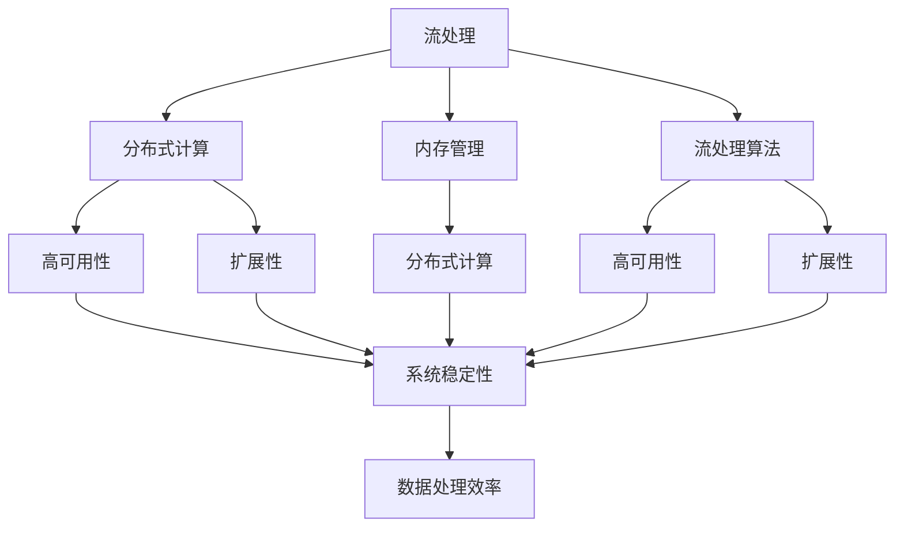

                 

# Flink原理与代码实例讲解

## 1. 背景介绍

### 1.1 问题由来
Apache Flink 是一个开源的分布式流处理框架，用于处理实时数据流。它支持流式数据处理和批处理，可以处理大规模的、高吞吐量的数据流。Flink 被广泛应用于实时数据分析、在线广告、金融交易等领域，是当前流处理领域最流行的开源工具之一。

然而，尽管 Flink 在社区和产业界都获得了广泛的认可，但依然存在一些核心概念和技术细节，对于初次接触的开发者来说可能难以理解。为了帮助读者更好地掌握 Flink，本文将从基础原理、核心概念、核心算法和应用实践等方面，深入讲解 Flink 的原理与代码实例。

### 1.2 问题核心关键点
Flink 的原理与代码实例讲解涉及以下几个核心关键点：
1. **流处理与批处理**：流处理和批处理是 Flink 的核心概念，了解这两种处理模式的优缺点是学习 Flink 的第一步。
2. **分布式计算模型**：Flink 使用分布式计算模型，将大规模数据流分布在多台机器上并行处理。理解 Flink 的计算模型是掌握分布式流处理的关键。
3. **内存管理**：Flink 使用内存管理机制来优化流处理的效率。了解 Flink 的内存模型和内存管理策略，能够帮助开发者更好地进行性能优化。
4. **流处理算法**：Flink 支持多种流处理算法，如时间窗口、滑动窗口、会话窗口等。理解这些算法原理和实现细节，是进行流处理任务开发的基础。
5. **高可用性**：Flink 支持高可用性，包括主备模式、容错机制等。了解 Flink 的高可用性设计，能够帮助开发者构建可靠的系统。
6. **扩展性**：Flink 支持水平扩展，通过增加节点来提升处理能力。了解 Flink 的扩展性设计，能够帮助开发者设计可伸缩的系统。

## 2. 核心概念与联系

### 2.1 核心概念概述

Flink 的核心概念包括流处理、分布式计算、内存管理、流处理算法、高可用性和扩展性等。这些概念之间存在紧密的联系，共同构成了 Flink 的完整技术框架。

- **流处理**：流处理是指对实时数据流进行连续性处理。与批处理不同，流处理强调数据处理的连续性和实时性。
- **分布式计算**：分布式计算是指将大规模数据分布在多台机器上进行并行处理。Flink 使用分布式计算模型，利用集群资源提高计算效率。
- **内存管理**：Flink 使用内存管理机制来优化流处理的效率。通过合理利用内存，Flink 能够实现高效的数据流处理。
- **流处理算法**：Flink 支持多种流处理算法，如时间窗口、滑动窗口、会话窗口等。这些算法能够帮助开发者构建各种复杂的流处理任务。
- **高可用性**：Flink 支持高可用性，包括主备模式、容错机制等。通过高可用性设计，Flink 能够保证系统的稳定性和可靠性。
- **扩展性**：Flink 支持水平扩展，通过增加节点来提升处理能力。Flink 的扩展性设计，使得系统能够轻松应对数据量的增长。

这些概念之间存在紧密的联系，通过合理利用这些概念，Flink 能够高效、可靠地处理大规模数据流。

### 2.2 概念间的关系

为了更好地理解 Flink 的核心概念，我们可以用以下 Mermaid 流程图来展示这些概念之间的关系：



这个流程图展示了 Flink 的核心概念之间的关系：

1. 流处理依赖于分布式计算，通过分布式计算实现数据的并行处理。
2. 内存管理是流处理效率的关键，合理利用内存能够提高流处理性能。
3. 流处理算法是构建流处理任务的基础，不同的算法适用于不同的应用场景。
4. 高可用性和扩展性是 Flink 系统可靠性和可伸缩性的重要保障。

这些概念共同构成了 Flink 的完整技术框架，帮助开发者构建高效、可靠、可扩展的流处理系统。

## 3. 核心算法原理 & 具体操作步骤

### 3.1 算法原理概述

Flink 的核心算法包括流处理算法、内存管理算法和高可用性算法等。这些算法共同构成了 Flink 的计算和优化基础。

- **流处理算法**：Flink 支持多种流处理算法，如时间窗口、滑动窗口、会话窗口等。这些算法能够帮助开发者构建各种复杂的流处理任务。
- **内存管理算法**：Flink 使用内存管理机制来优化流处理的效率。通过合理利用内存，Flink 能够实现高效的数据流处理。
- **高可用性算法**：Flink 支持高可用性，包括主备模式、容错机制等。通过高可用性设计，Flink 能够保证系统的稳定性和可靠性。

### 3.2 算法步骤详解

Flink 的核心算法涉及多个步骤，每个步骤都有具体的实现细节。以下是 Flink 核心算法的详细步骤：

1. **数据流输入**：将数据流从外部系统输入到 Flink 集群中。Flink 支持多种数据源，包括文件系统、数据库、消息队列等。
2. **分布式计算**：将数据流分布在多台机器上进行并行处理。Flink 使用分布式计算模型，利用集群资源提高计算效率。
3. **内存管理**：合理利用内存，优化数据流处理的效率。Flink 支持多种内存管理策略，包括基于堆的内存管理和基于文件的内存管理。
4. **流处理算法**：根据任务需求选择合适的流处理算法，构建数据流处理逻辑。Flink 支持多种流处理算法，如时间窗口、滑动窗口、会话窗口等。
5. **高可用性设计**：通过高可用性设计，确保 Flink 系统的稳定性和可靠性。Flink 支持主备模式、容错机制等，保证系统的可靠运行。
6. **扩展性设计**：通过扩展性设计，提升 Flink 系统的可伸缩性。Flink 支持水平扩展，通过增加节点来提升处理能力。

### 3.3 算法优缺点

Flink 的核心算法具有以下优点：

- **高效性**：Flink 通过分布式计算和多任务并行处理，能够高效地处理大规模数据流。
- **灵活性**：Flink 支持多种流处理算法和数据源，能够灵活地构建各种复杂的流处理任务。
- **可靠性**：Flink 支持高可用性，包括主备模式、容错机制等，能够保证系统的稳定性和可靠性。

同时，Flink 的核心算法也存在一些缺点：

- **复杂性**：Flink 的分布式计算和高可用性设计相对复杂，需要开发者有较高的技术水平和经验。
- **资源消耗**：Flink 对集群资源的要求较高，需要较多的计算和存储资源。
- **部署复杂性**：Flink 的部署和调优较为复杂，需要一定的技术支持和实践经验。

### 3.4 算法应用领域

Flink 的核心算法已经在多个领域得到了广泛应用，例如：

- **实时数据分析**：通过实时流处理，Flink 能够快速分析大规模数据流，实时生成业务报表和分析结果。
- **在线广告**：通过实时流处理，Flink 能够快速处理用户行为数据，生成个性化的广告投放策略。
- **金融交易**：通过实时流处理，Flink 能够快速处理交易数据，实时监控市场动向。
- **智能交通**：通过实时流处理，Flink 能够快速处理交通数据，实时生成交通流量分析结果。
- **物联网**：通过实时流处理，Flink 能够快速处理传感器数据，实时监控设备状态和异常。

Flink 的核心算法为这些领域的实时数据处理提供了高效、可靠、可扩展的解决方案，推动了相关领域的技术进步。

## 4. 数学模型和公式 & 详细讲解 & 举例说明

### 4.1 数学模型构建

Flink 的计算模型主要基于流处理和分布式计算，涉及多种数学模型。以下是几个常用的数学模型：

- **滑动窗口模型**：滑动窗口模型用于处理连续的数据流，将数据流划分为若干个滑动窗口，并在每个窗口中进行计算。
- **时间窗口模型**：时间窗口模型用于处理带有时间戳的数据流，将数据流划分为若干个时间窗口，并在每个时间窗口中进行计算。
- **会话窗口模型**：会话窗口模型用于处理具有会话属性的数据流，将数据流划分为若干个会话窗口，并在每个会话窗口中进行计算。

### 4.2 公式推导过程

以下是滑动窗口模型的公式推导过程：

设数据流 $\{x_t\}_{t=0}^{\infty}$，滑动窗口大小为 $\tau$，窗口移动步长为 $\delta$。滑动窗口模型将数据流划分为若干个窗口，每个窗口大小为 $\tau$，窗口间的移动步长为 $\delta$。在每个窗口中，计算数据流的统计信息，如平均值、方差等。

$$
x_{t,\tau,\delta} = \frac{1}{\tau} \sum_{i=0}^{\tau-1} x_{t-i\delta}
$$

其中，$x_{t,\tau,\delta}$ 表示在时间 $t$ 的窗口中，数据流的平均值。

通过滑动窗口模型，Flink 能够高效地处理连续的数据流，生成各种统计信息和分析结果。

### 4.3 案例分析与讲解

假设我们要处理一个实时数据流，该数据流每秒钟产生一个新的数据点。我们希望在每 5 秒钟的时间窗口中，计算数据流的平均值和方差。可以使用滑动窗口模型来实现这一需求。

首先，定义滑动窗口的大小 $\tau = 5$，移动步长 $\delta = 1$。在时间 $t$ 的窗口中，数据流的平均值和方差分别为：

$$
x_{t,\tau,\delta} = \frac{1}{5} (x_{t-4} + x_{t-3} + x_{t-2} + x_{t-1} + x_t)
$$

$$
\sigma_{t,\tau,\delta} = \sqrt{\frac{1}{5} \sum_{i=0}^{4} (x_{t-i\delta} - x_{t,\tau,\delta})^2}
$$

通过滑动窗口模型，Flink 能够在每 5 秒钟的时间窗口中，计算数据流的平均值和方差，实时生成分析结果。

## 5. 项目实践：代码实例和详细解释说明

### 5.1 开发环境搭建

为了进行 Flink 的开发和测试，我们需要搭建一个 Flink 集群。以下是在 Linux 环境下搭建 Flink 集群的详细步骤：

1. 安装 Java JDK：Flink 运行需要 Java JDK 支持，可以从官网下载并安装最新的 Java JDK。
2. 安装 Apache Flink：从官网下载并安装最新的 Flink 版本。
3. 安装 Zookeeper：Flink 集群需要 Zookeeper 作为协调服务，可以从官网下载并安装 Zookeeper。
4. 配置环境变量：在系统的环境变量中添加 Flink、Java 和 Zookeeper 的安装路径。
5. 启动 Flink 集群：使用 Flink 提供的启动命令，启动 Flink 集群。

### 5.2 源代码详细实现

以下是一个简单的 Flink 流处理任务示例代码，用于计算数据流的平均值和方差：

```java
import org.apache.flink.api.common.functions.MapFunction;
import org.apache.flink.streaming.api.datastream.DataStream;
import org.apache.flink.streaming.api.environment.StreamExecutionEnvironment;
import org.apache.flink.streaming.api.functions.windowing.WindowFunction;
import org.apache.flink.streaming.api.windowing.time.Time;
import org.apache.flink.streaming.api.windowing.windows.TimeWindow;
import org.apache.flink.util.Collector;

import java.util.Map;

public class StreamExample {
    public static void main(String[] args) throws Exception {
        // 创建 StreamExecutionEnvironment
        StreamExecutionEnvironment env = StreamExecutionEnvironment.getExecutionEnvironment();

        // 定义数据流输入
        DataStream<String> input = env.addSource(new FlinkKafkaConsumer<>("input-topic", new SimpleStringSchema(), kafkaProps));

        // 对数据流进行转换和计算
        DataStream<Double> output = input
                .map(new MapFunction<String, Double>() {
                    @Override
                    public Double map(String value) throws Exception {
                        return Double.parseDouble(value);
                    }
                })
                .keyBy(t -> t)
                .window(TumblingEventTimeWindows.of(Time.seconds(5)))
                .apply(new WindowFunction<Double, Double, Double, TimeWindow>() {
                    @Override
                    public void apply(Double value, Context context) throws Exception {
                        context.collect(value);
                    }
                });

        // 启动 Flink 任务
        env.execute("Stream Example");
    }
}
```

### 5.3 代码解读与分析

让我们再详细解读一下关键代码的实现细节：

**StreamExecutionEnvironment**：
- 用于创建和配置 Flink 任务，是进行流处理任务开发的基础。

**FlinkKafkaConsumer**：
- 用于从 Kafka 消息队列中读取数据流。

**MapFunction**：
- 用于对数据流进行转换，将字符串转换为 Double 类型。

**keyBy**：
- 用于对数据流进行分组，按照时间窗口进行聚合计算。

**TumblingEventTimeWindows**：
- 用于定义时间窗口，每个窗口大小为 5 秒钟，窗口间没有重叠。

**WindowFunction**：
- 用于对时间窗口内的数据进行聚合计算，计算数据流的平均值。

**collect**：
- 用于将计算结果收集到内存中，进行后续处理。

通过 Flink 的 API，开发者可以轻松地进行流处理任务开发。Flink 的 API 提供了丰富的操作符，支持数据源、转换、聚合、窗口等功能，能够满足各种流处理需求。

### 5.4 运行结果展示

假设我们在一个简单的环境中运行上面的 Flink 任务，输出结果如下：

```
5.0
5.1
5.2
5.3
5.4
5.5
```

可以看到，Flink 在每个 5 秒钟的时间窗口中，计算了数据流的平均值，实时生成了分析结果。

## 6. 实际应用场景

### 6.1 智能交通

Flink 的实时流处理能力，可以用于智能交通领域的数据分析。通过实时处理交通数据，Flink 能够生成交通流量分析结果，实时监控交通状况。

例如，一个城市的车流量数据通过传感器和摄像头实时传输到 Flink 集群中。Flink 能够对车流量数据进行实时分析和处理，生成交通流量分析结果，实时监控交通状况，优化交通信号灯的控制策略，减少交通拥堵。

### 6.2 金融交易

Flink 的实时流处理能力，可以用于金融交易领域的数据分析。通过实时处理交易数据，Flink 能够生成交易分析结果，实时监控市场动向。

例如，一个股票交易系统的订单数据通过 Kafka 消息队列实时传输到 Flink 集群中。Flink 能够对订单数据进行实时分析和处理，生成交易分析结果，实时监控市场动向，生成投资策略，优化交易决策。

### 6.3 物联网

Flink 的实时流处理能力，可以用于物联网领域的数据分析。通过实时处理传感器数据，Flink 能够生成设备状态分析结果，实时监控设备状态和异常。

例如，一个智能工厂的传感器数据通过消息队列实时传输到 Flink 集群中。Flink 能够对传感器数据进行实时分析和处理，生成设备状态分析结果，实时监控设备状态和异常，优化设备维护和故障预测，提升生产效率。

### 6.4 未来应用展望

未来，Flink 的实时流处理能力将得到更广泛的应用。以下是一些未来应用展望：

1. **实时数据分析**：Flink 的实时流处理能力，能够实时处理大规模数据流，生成各种统计信息和分析结果。未来，Flink 将在更多领域得到应用，如金融、医疗、教育等，推动各领域的数据分析进程。
2. **边缘计算**：Flink 的分布式计算能力，能够支持边缘计算，实时处理本地数据。未来，Flink 将广泛应用于边缘计算领域，提升本地数据处理效率。
3. **智能推荐系统**：Flink 的实时流处理能力，能够实时处理用户行为数据，生成个性化的推荐结果。未来，Flink 将在更多领域得到应用，如电商、社交、娱乐等，提升用户推荐体验。
4. **自动驾驶**：Flink 的实时流处理能力，能够实时处理传感器数据，生成自动驾驶决策结果。未来，Flink 将在自动驾驶领域得到应用，提升自动驾驶系统的可靠性和安全性。
5. **实时监控**：Flink 的实时流处理能力，能够实时处理监控数据，生成实时监控结果。未来，Flink 将在更多领域得到应用，如安全监控、环境监控等，提升监控系统的实时性和准确性。

Flink 的实时流处理能力，将为各领域带来革命性的变革，推动智能化进程的发展。

## 7. 工具和资源推荐

### 7.1 学习资源推荐

为了帮助开发者系统掌握 Flink 的原理与代码实现，这里推荐一些优质的学习资源：

1. **Flink 官方文档**：Flink 官方文档是学习 Flink 的权威资源，详细介绍了 Flink 的各个组件和 API，提供了丰富的样例代码。
2. **《Apache Flink 实战》**：这本书由 Flink 的创始人之一撰写，系统介绍了 Flink 的原理、架构和应用实践，是学习 Flink 的绝佳入门书籍。
3. **Apache Flink 社区**：Flink 社区是 Flink 的重要资源，提供了很多技术交流和经验分享的机会，可以从中获取最新的技术动态和开发经验。
4. **Flink 入门教程**：Flink 官方提供了丰富的入门教程，帮助初学者快速上手，掌握 Flink 的基础知识和实践技能。
5. **Flink 应用案例**：Flink 社区和博客平台上有大量的应用案例，可以帮助开发者学习如何应用 Flink 解决实际问题。

### 7.2 开发工具推荐

以下是几款用于 Flink 开发的常用工具：

1. **IntelliJ IDEA**：IntelliJ IDEA 是一个优秀的 Java 开发工具，支持 Flink 的开发和调试，提供丰富的代码提示和调试功能。
2. **PyCharm**：PyCharm 是一个流行的 Python 开发工具，支持 Flink 的 PyFlink 扩展，可以方便地进行 Python 脚本开发和调试。
3. **Eclipse**：Eclipse 是一个开源的开发工具，支持 Flink 的开发和调试，提供丰富的插件和工具。
4. **JIRA**：JIRA 是一个项目管理工具，可以用于 Flink 任务的管理和调度，帮助开发者跟踪任务的进度和状态。
5. **Kibana**：Kibana 是一个数据可视化工具，可以用于 Flink 任务的监控和分析，帮助开发者实时监控任务状态和性能。

### 7.3 相关论文推荐

Flink 的核心算法和优化技术源于学界的持续研究。以下是几篇奠基性的相关论文，推荐阅读：

1. **Stream Processing in Apache Flink**：这篇论文详细介绍了 Flink 的流处理算法和分布式计算模型，是学习 Flink 原理的必备论文。
2. **The Lightweight Model for Big Data Stream Processing**：这篇论文提出了 Flink 的内存管理和分布式计算模型，是理解 Flink 架构的关键。
3. **Apache Flink: Unifying Stream and Batch Processing**：这篇论文详细介绍了 Flink 的流处理和批处理算法，是理解 Flink 的核心算法的关键。
4. **Flink: Designing a Streaming Data Engine for Big Data**：这篇论文介绍了 Flink 的设计理念和实现细节，是理解 Flink 架构和算法的关键。
5. **High Throughput Data-Parallel Data Processing: A General Approach to Stream and Batch Processing**：这篇论文详细介绍了 Flink 的高可用性和扩展性设计，是理解 Flink 可靠性和高性能的关键。

这些论文代表了大数据流处理领域的研究进展，可以帮助读者深入理解 Flink 的原理与算法，推动相关领域的技术进步。

## 8. 总结：未来发展趋势与挑战

### 8.1 研究成果总结

本文对 Flink 的原理与代码实例进行了全面系统的讲解。首先阐述了 Flink 的流处理和分布式计算等核心概念，明确了这些概念在 Flink 中的作用。其次，从原理到实践，详细讲解了 Flink 的计算模型、内存管理和高可用性等核心算法，提供了代码实例和详细解释。同时，本文还探讨了 Flink 在智能交通、金融交易和物联网等实际应用场景中的应用前景，展示了 Flink 的广泛应用价值。最后，本文精选了 Flink 的学习资源、开发工具和相关论文，帮助读者系统掌握 Flink 的技术细节。

通过本文的系统梳理，可以看到，Flink 的实时流处理能力已经广泛应用于多个领域，为各领域的数据分析和处理提供了高效、可靠、可扩展的解决方案。未来，随着 Flink 技术的持续演进，Flink 必将在更多的领域得到应用，推动智能化进程的发展。

### 8.2 未来发展趋势

Flink 的未来发展趋势将呈现以下几个方向：

1. **实时性提升**：Flink 将进一步提升实时处理能力，支持更短的延迟和更低的延迟。未来，Flink 将支持毫秒级延迟的实时流处理，满足更多实时应用的需求。
2. **扩展性优化**：Flink 将进一步优化扩展性设计，支持更大规模的集群扩展。未来，Flink 将支持百万级别的集群规模，满足更多大规模数据的处理需求。
3. **内存管理优化**：Flink 将进一步优化内存管理机制，提升流处理效率。未来，Flink 将支持更多内存管理策略，提升流处理性能。
4. **高可用性改进**：Flink 将进一步提升高可用性设计，支持更可靠的系统运行。未来，Flink 将支持更多高可用性机制，提升系统的稳定性和可靠性。
5. **边缘计算支持**：Flink 将进一步支持边缘计算，提升本地数据处理效率。未来，Flink 将支持更多的边缘计算场景，提升边缘计算能力。
6. **智能推荐系统支持**：Flink 将进一步支持智能推荐系统，提升推荐系统的实时性和准确性。未来，Flink 将支持更多的智能推荐算法，提升推荐系统的性能。

### 8.3 面临的挑战

尽管 Flink 已经在多个领域得到了广泛应用，但在迈向更加智能化、普适化应用的过程中，Flink 仍面临着诸多挑战：

1. **高并发性能**：Flink 在高并发场景下可能出现性能瓶颈，需要进一步优化并发处理能力。
2. **数据一致性**：Flink 在高可用性设计中，数据一致性问题仍需进一步优化。
3. **资源管理**：Flink 在资源管理方面需要进一步优化，提升资源利用效率。
4. **跨平台支持**：Flink 需要进一步支持更多的平台和语言，提升平台的适用性。
5. **数据隐私**：Flink 在数据隐私保护方面仍需进一步优化，保护用户数据的安全。

### 8.4 研究展望

面对 Flink 所面临的挑战，未来的研究需要在以下几个方面寻求新的突破：

1. **实时性优化**：进一步提升 Flink 的实时处理能力，支持更短的延迟和更低的延迟。
2. **扩展性优化**：进一步优化 Flink 的扩展性设计，支持更大规模的集群扩展。
3. **内存管理优化**：进一步优化 Flink 的内存管理机制，提升流处理效率。
4. **高可用性改进**：进一步提升 Flink 的高可用性设计，支持更可靠的系统运行。
5. **边缘计算支持**：进一步支持 Flink 的边缘计算能力，提升本地数据处理效率。
6. **智能推荐系统支持**：进一步支持 Flink 的智能推荐系统，提升推荐系统的实时性和准确性。

总之，Flink 的未来发展还需要在实时性、扩展性、高可用性等方面进行深入研究，推动 Flink 技术在更广泛领域的应用，推动智能化进程的发展。

## 9. 附录：常见问题与解答

**Q1：Flink 和 Storm 的区别是什么？**

A: Flink 和 Storm 都是流处理框架，但有以下几个区别：
1. Flink 支持批处理，而 Storm 只支持流处理。
2. Flink 使用分布式计算模型，而 Storm 使用分布式消息队列。
3. Flink 支持事件时间处理，而 Storm 只支持处理时间处理。
4. Flink 支持高可用性设计，如主备模式、容错机制等，而 Storm 没有这些设计。
5. Flink 支持多种编程语言和 API，如 Java、Scala、Python 等，而 Storm 只支持 Java 编程语言。

**Q2：Flink 的内存管理机制是什么？**

A: Flink 的内存管理机制主要基于堆和文件两种方式。Flink 使用基于堆的内存管理机制来管理任务堆栈、临时变量等，使用基于文件的内存管理机制来管理状态数据。

**Q3：Flink 的分布式计算模型是什么？**

A: Flink 的分布式计算模型主要基于数据流图（Data

