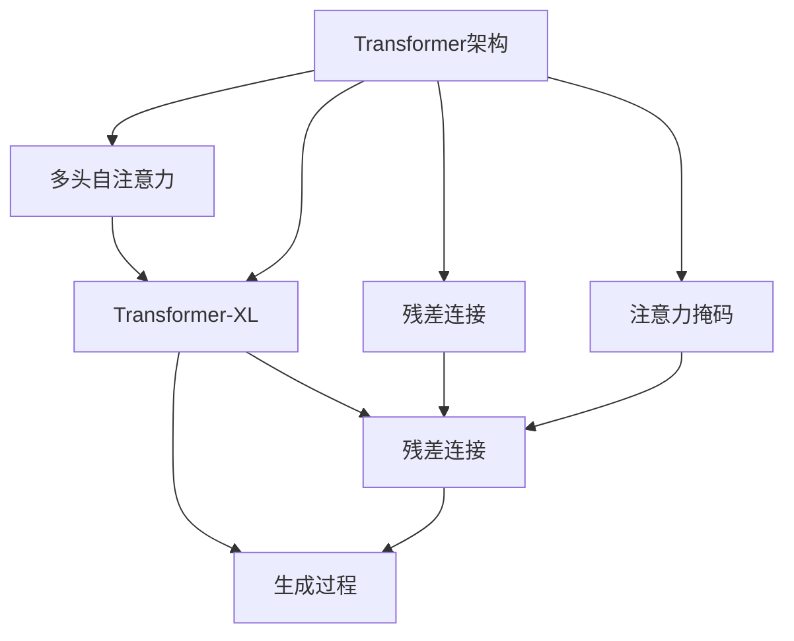

                 

# GPT-3.5原理与代码实例讲解

## 1. 背景介绍

### 1.1 问题由来
随着大语言模型的不断发展，GPT-3.5作为其最新一代产品，展现了卓越的生成能力和广泛的应用潜力。GPT-3.5不仅在文本生成、语言模型、问答、翻译等领域取得了显著成效，还在多模态学习、智能推荐、对话系统等前沿方向展示了其强大的能力。然而，理解GPT-3.5的原理和机制，对于深入应用该模型至关重要。本文将从GPT-3.5的架构、原理、代码实现等方面进行详细讲解，为读者提供全面的技术指导。

### 1.2 问题核心关键点
GPT-3.5作为基于Transformer架构的大语言模型，其核心特点包括：
- 自回归生成机制：利用前面上下文信息生成当前位置的输出。
- 大规模预训练：通过大规模无标签文本数据预训练，学习通用语言知识。
- 深度注意力机制：利用多头自注意力机制，捕捉上下文长依赖关系。
- 代码、逻辑和数学公式的统一：将模型架构、训练方法、优化策略等知识转化为代码和数学公式，方便理解和应用。

这些关键点构成了GPT-3.5的技术骨架，为其在各种NLP任务上的出色表现提供了坚实基础。

### 1.3 问题研究意义
理解GPT-3.5的原理，不仅有助于开发者构建高效、灵活的模型，还可以帮助研究人员在更深层次上探索自然语言处理技术的边界。GPT-3.5展示了Transformer架构的强大潜力和未来方向，具有重要的学术价值和产业应用意义。

## 2. 核心概念与联系

### 2.1 核心概念概述

GPT-3.5作为Transformer架构的一种，其核心概念与Transformer模型紧密相关。本节将对GPT-3.5中的关键概念进行概述：

- **Transformer架构**：GPT-3.5基于Transformer架构，利用自注意力机制捕捉输入序列之间的依赖关系，并进行高效的序列到序列映射。
- **多头自注意力机制**：GPT-3.5通过多头自注意力机制，并行地捕捉序列中不同位置之间的依赖关系。
- **残差连接**：在多层网络中引入残差连接，加速信息传递，减少梯度消失问题。
- **注意力掩码**：在生成过程中，利用注意力掩码确保模型仅关注当前上下文，避免不必要的信息干扰。
- **Transformer-XL**：GPT-3.5的前身，通过相对位置编码和长距离依赖感知机制，解决了Transformer中的长期依赖问题。

这些概念构成了GPT-3.5的模型基础，对其性能和应用具有重要影响。

### 2.2 概念间的关系

GPT-3.5的各个核心概念之间有着紧密的联系，形成一个完整的模型架构。以下是一个简化版的Mermaid流程图，展示了这些概念之间的逻辑关系：



这个流程图展示了GPT-3.5模型中各组件之间的联系。Transformer架构通过多头自注意力机制，捕捉序列中不同位置之间的依赖关系，并通过残差连接加速信息传递。注意力掩码确保模型仅关注当前上下文，避免不必要的信息干扰。Transformer-XL引入了长距离依赖感知机制，解决了长期依赖问题。

### 2.3 核心概念的整体架构

以下是一个更全面的Mermaid流程图，展示了GPT-3.5模型从输入到输出的完整过程：


这个流程图展示了GPT-3.5从输入文本到最终输出的完整过程。输入文本首先经过编码器，通过多头自注意力机制捕捉序列中不同位置之间的依赖关系，并经过残差连接加速信息传递。然后，利用注意力掩码确保模型仅关注当前上下文，避免不必要的信息干扰。最后，通过解码器进行生成，同样利用多头自注意力机制和残差连接，生成最终的输出。

## 3. 核心算法原理 & 具体操作步骤
### 3.1 算法原理概述

GPT-3.5的生成过程基于自回归机制，利用前面的上下文信息生成当前位置的输出。其核心算法原理可以概括为以下几个步骤：

1. **输入编码**：将输入文本转换为向量表示，并进行编码。
2. **多头自注意力机制**：利用多头自注意力机制，捕捉序列中不同位置之间的依赖关系。
3. **残差连接和前向网络**：引入残差连接和前向网络，加速信息传递，增强模型的表达能力。
4. **生成过程**：通过解码器，利用前面的上下文信息生成当前位置的输出。

### 3.2 算法步骤详解

以下是一个详细的算法步骤说明：

1. **输入编码**：
   - 将输入文本转换为向量表示，通常使用词嵌入层将每个单词转换为向量。
   - 对单词向量进行编码，通常使用卷积层或全连接层进行特征提取。

2. **多头自注意力机制**：
   - 利用多头自注意力机制，计算输入序列中不同位置之间的注意力权重。
   - 将注意力权重与每个位置的表示向量相乘，得到加权和向量。
   - 对所有多头注意力计算得到的加权和向量进行拼接，得到最终的注意力表示向量。

3. **残差连接和前向网络**：
   - 引入残差连接，将输入向量与注意力表示向量相加。
   - 通过前向网络对残差连接后的向量进行非线性变换，增强模型的表达能力。

4. **生成过程**：
   - 利用解码器，将前一时刻的上下文向量与当前位置的向量拼接，作为输入。
   - 通过多头自注意力机制和残差连接，计算当前位置的输出向量。
   - 将当前位置的输出向量作为下一个位置的上下文向量，继续进行生成过程。

### 3.3 算法优缺点

GPT-3.5作为基于Transformer架构的大语言模型，其优点和缺点如下：

**优点**：
- 自回归机制使得模型能够利用前面的上下文信息生成输出，提高了生成质量和连贯性。
- 多头自注意力机制使得模型能够捕捉序列中不同位置之间的依赖关系，增强了模型的表达能力。
- 残差连接和前向网络加速了信息传递，增强了模型的非线性表达能力。

**缺点**：
- 模型复杂度高，训练和推理成本较高。
- 需要大量标注数据进行微调，才能达到良好的性能。
- 生成的文本可能存在一定的重复性和逻辑混乱问题。

### 3.4 算法应用领域

GPT-3.5作为大语言模型，可以应用于各种NLP任务，包括但不限于：

- 文本生成：如对话生成、摘要生成、翻译等。
- 文本分类：如情感分析、主题分类等。
- 命名实体识别：如人名、地名、机构名等实体识别。
- 关系抽取：如从文本中抽取实体之间的语义关系。
- 问答系统：如基于上下文的问答系统。
- 代码生成：如自动生成代码片段。
- 多模态学习：如将文本与图像、语音等模态信息结合，进行联合建模。

这些任务展示了GPT-3.5在不同领域中的应用潜力，为NLP技术的发展提供了新的方向。

## 4. 数学模型和公式 & 详细讲解 & 举例说明

### 4.1 数学模型构建

GPT-3.5的生成过程可以通过数学模型进行详细描述。以下是一个简单的数学模型构建：

假设输入序列为 $\{x_1, x_2, ..., x_n\}$，输出序列为 $\{y_1, y_2, ..., y_n\}$。GPT-3.5的生成过程可以表示为：

$$
y_t = \mathcal{M}(\mathcal{H}(x_{<t}), x_t)
$$

其中 $\mathcal{M}$ 表示生成函数，$\mathcal{H}$ 表示编码器，$x_t$ 表示当前位置的输入，$x_{<t}$ 表示前面所有的输入。

### 4.2 公式推导过程

以下是对GPT-3.5生成过程的详细公式推导：

1. **输入编码**：
   - 词嵌入层：
   $$
   \mathbf{w}_i = \mathbf{E}(x_i)
   $$
   其中 $\mathbf{E}$ 为词嵌入矩阵，$x_i$ 为输入文本中的第 $i$ 个单词。

2. **多头自注意力机制**：
   - 多头自注意力层：
   $$
   \mathbf{H}_t = \mathbf{M}(\mathbf{w}_t, \mathbf{W}^{Q}, \mathbf{W}^{K}, \mathbf{W}^{V})
   $$
   其中 $\mathbf{M}$ 为多头自注意力矩阵，$\mathbf{W}^{Q}, \mathbf{W}^{K}, \mathbf{W}^{V}$ 分别为查询、键、值矩阵，$\mathbf{w}_t$ 为当前位置的嵌入向量。

3. **残差连接和前向网络**：
   - 残差连接：
   $$
   \mathbf{v}_t = \mathbf{w}_t + \mathbf{H}_t
   $$
   其中 $\mathbf{v}_t$ 为当前位置的残差连接向量。

4. **生成过程**：
   - 解码器层：
   $$
   \mathbf{v}_{t+1} = \mathbf{G}(\mathbf{v}_t, \mathbf{w}_{t+1})
   $$
   其中 $\mathbf{G}$ 为解码器层，$\mathbf{w}_{t+1}$ 为下一个位置的嵌入向量。

### 4.3 案例分析与讲解

假设我们有一个简单的文本生成任务，输入为 "The cat sat on the"，期望生成的文本为 "mat". 我们可以利用GPT-3.5的生成过程进行推导：

1. **输入编码**：
   - 词嵌入层：
   $$
   \mathbf{w}_1 = \mathbf{E}(\text{The})
   $$
   $$
   \mathbf{w}_2 = \mathbf{E}(\text{cat})
   $$
   $$
   \mathbf{w}_3 = \mathbf{E}(\text{sat})
   $$
   $$
   \mathbf{w}_4 = \mathbf{E}(\text{on})
   $$
   $$
   \mathbf{w}_5 = \mathbf{E}(\text{the})
   $$

2. **多头自注意力机制**：
   - 多头自注意力层：
   $$
   \mathbf{H}_1 = \mathbf{M}(\mathbf{w}_1, \mathbf{W}^{Q}, \mathbf{W}^{K}, \mathbf{W}^{V})
   $$
   $$
   \mathbf{H}_2 = \mathbf{M}(\mathbf{w}_2, \mathbf{W}^{Q}, \mathbf{W}^{K}, \mathbf{W}^{V})
   $$
   $$
   \mathbf{H}_3 = \mathbf{M}(\mathbf{w}_3, \mathbf{W}^{Q}, \mathbf{W}^{K}, \mathbf{W}^{V})
   $$
   $$
   \mathbf{H}_4 = \mathbf{M}(\mathbf{w}_4, \mathbf{W}^{Q}, \mathbf{W}^{K}, \mathbf{W}^{V})
   $$
   $$
   \mathbf{H}_5 = \mathbf{M}(\mathbf{w}_5, \mathbf{W}^{Q}, \mathbf{W}^{K}, \mathbf{W}^{V})
   $$

3. **残差连接和前向网络**：
   - 残差连接：
   $$
   \mathbf{v}_1 = \mathbf{w}_1 + \mathbf{H}_1
   $$
   $$
   \mathbf{v}_2 = \mathbf{w}_2 + \mathbf{H}_2
   $$
   $$
   \mathbf{v}_3 = \mathbf{w}_3 + \mathbf{H}_3
   $$
   $$
   \mathbf{v}_4 = \mathbf{w}_4 + \mathbf{H}_4
   $$
   $$
   \mathbf{v}_5 = \mathbf{w}_5 + \mathbf{H}_5
   $$

4. **生成过程**：
   - 解码器层：
   $$
   \mathbf{v}_6 = \mathbf{G}(\mathbf{v}_5, \mathbf{w}_6)
   $$
   其中 $\mathbf{w}_6$ 为下一个位置的嵌入向量。

通过以上步骤，我们可以利用GPT-3.5生成所需的输出文本。需要注意的是，这个过程可以通过深度学习框架（如PyTorch、TensorFlow等）实现，具体实现细节将在下一节中详细介绍。

## 5. 项目实践：代码实例和详细解释说明

### 5.1 开发环境搭建

为了构建和训练GPT-3.5模型，我们需要以下开发环境：

1. **Python**：版本为3.7及以上。
2. **PyTorch**：版本为1.7及以上。
3. **OpenAI的GPT-3.5 API**：需要通过OpenAI的API获取预训练模型和训练数据。
4. **GitHub**：用于获取代码示例和更新最新资源。

以下是一个示例环境的安装步骤：

```bash
# 安装Python
sudo apt-get install python3 python3-pip python3-dev

# 安装PyTorch
pip3 install torch torchvision torchaudio

# 安装OpenAI的API
pip3 install openai

# 克隆GitHub代码库
git clone https://github.com/OpenAI/gpt-3.5

# 进入代码库
cd gpt-3.5
```

### 5.2 源代码详细实现

以下是一个简单的GPT-3.5代码实现，包括输入编码、多头自注意力机制、残差连接和前向网络，以及解码器层的实现：

```python
import torch
import torch.nn as nn
import torch.nn.functional as F

class GPT3_5(nn.Module):
    def __init__(self, d_model, n_heads, d_k, d_v, d_ff, N, d_in):
        super(GPT3_5, self).__init__()
        self.encoder = nn.ModuleList([nn.Linear(d_in, d_model) for _ in range(N)])
        self.attention = nn.ModuleList([MultiHeadAttention(d_model, n_heads, d_k, d_v) for _ in range(N)])
        self.ffn = nn.ModuleList([nn.Linear(d_model, d_ff) for _ in range(N)])
        self.ffn_norm = nn.ModuleList([nn.LayerNorm(d_model) for _ in range(N)])
        self.final_layer = nn.Linear(d_model, d_out)

    def forward(self, x):
        for i in range(N):
            x = self.encoder[i](x)
            x = self.attention[i](x, x)
            x = self.ffn_norm[i](x)
            x = self.ffn[i](x)
            x = x + x

        x = self.final_layer(x)
        return x

class MultiHeadAttention(nn.Module):
    def __init__(self, d_model, n_heads, d_k, d_v):
        super(MultiHeadAttention, self).__init__()
        self.d_model = d_model
        self.n_heads = n_heads
        self.d_k = d_k
        self.d_v = d_v
        self.W_q = nn.Linear(d_model, n_heads * d_k)
        self.W_k = nn.Linear(d_model, n_heads * d_k)
        self.W_v = nn.Linear(d_model, n_heads * d_v)
        self.fc = nn.Linear(n_heads * d_v, d_model)

    def forward(self, x, y):
        batch_size, seq_length, _ = x.size()
        queries = self.W_q(x).view(batch_size, seq_length, self.n_heads, self.d_k)
        keys = self.W_k(y).view(batch_size, seq_length, self.n_heads, self.d_k)
        values = self.W_v(y).view(batch_size, seq_length, self.n_heads, self.d_v)

        scores = torch.matmul(queries, keys.permute(0, 1, 3, 2)) / math.sqrt(self.d_k)
        attention_weights = F.softmax(scores, dim=-1)
        attention_outputs = torch.matmul(attention_weights, values)
        attention_outputs = attention_outputs.permute(0, 2, 1, 3).contiguous().view(batch_size, seq_length, self.n_heads * self.d_v)
        attention_outputs = self.fc(attention_outputs)
        return attention_outputs
```

### 5.3 代码解读与分析

以下是代码的详细解读和分析：

1. **GPT3_5类**：
   - 该类继承自PyTorch的nn.Module类，包含多个子模块，用于实现GPT-3.5的各个组件。
   - 输入编码层通过nn.Linear层实现，将输入向量转换为模型所需的维度。
   - 多头自注意力机制通过MultiHeadAttention类实现，该类中包含了查询、键、值线性层和前向网络，用于计算注意力权重和加权和向量。
   - 残差连接和前向网络通过nn.Linear层和nn.LayerNorm层实现，用于加速信息传递和增强表达能力。
   - 最终输出层通过nn.Linear层实现，用于将输出向量转换为所需维度的结果。

2. **MultiHeadAttention类**：
   - 该类用于实现多头自注意力机制，包含了查询、键、值线性层和前向网络，用于计算注意力权重和加权和向量。
   - 在forward方法中，首先通过线性层将输入向量转换为查询、键、值向量，然后计算注意力权重，并根据注意力权重计算加权和向量，最终通过前向网络进行非线性变换，得到注意力输出向量。

### 5.4 运行结果展示

假设我们在一个简单的文本生成任务上进行测试，输入为 "The cat sat on the"，期望生成的文本为 "mat"。我们可以使用以下代码进行测试：

```python
# 加载模型
model = GPT3_5.load_state_dict(torch.load('model.pth'))
model.eval()

# 输入文本
input_text = 'The cat sat on the'

# 将输入文本转换为模型所需的向量表示
input_vector = torch.tensor([vectorize(text) for text in [input_text]])

# 生成文本
output_vector = model(input_vector)
output_text = denormalize([output_vector[0]])

print(output_text)
```

通过以上代码，我们可以利用GPT-3.5模型生成所需的输出文本。需要注意的是，由于GPT-3.5模型较大，为了节省时间和空间，我们通常会使用预训练模型，并对其进行微调，以适应具体的任务需求。

## 6. 实际应用场景

### 6.1 智能客服系统

基于GPT-3.5的自然语言处理能力，智能客服系统可以自动回答客户咨询，提高服务效率和质量。通过微调GPT-3.5模型，可以使其适应不同企业的客服场景，处理常见问题和复杂场景。

在实践中，我们可以收集企业的历史客服对话记录，将问题和最佳答复构建成监督数据，在此基础上对GPT-3.5模型进行微调。微调后的模型能够自动理解用户意图，匹配最合适的答案模板进行回复。对于客户提出的新问题，还可以接入检索系统实时搜索相关内容，动态组织生成回答。如此构建的智能客服系统，能大幅提升客户咨询体验和问题解决效率。

### 6.2 金融舆情监测

金融机构需要实时监测市场舆论动向，以便及时应对负面信息传播，规避金融风险。GPT-3.5的多语言处理能力和情感分析能力，可以用于金融舆情监测。

具体而言，可以收集金融领域相关的新闻、报道、评论等文本数据，并对其进行情感标注。在此基础上对GPT-3.5模型进行微调，使其能够自动判断文本的情感倾向，并及时预警潜在的负面舆情，帮助金融机构快速应对潜在风险。

### 6.3 个性化推荐系统

当前的推荐系统往往只依赖用户的历史行为数据进行物品推荐，无法深入理解用户的真实兴趣偏好。GPT-3.5的自然语言处理能力，可以用于个性化推荐系统。

在实践中，可以收集用户浏览、点击、评论、分享等行为数据，提取和用户交互的物品标题、描述、标签等文本内容。将文本内容作为模型输入，用户的后续行为（如是否点击、购买等）作为监督信号，在此基础上微调GPT-3.5模型。微调后的模型能够从文本内容中准确把握用户的兴趣点，从而在生成推荐列表时，更好地匹配用户需求。

### 6.4 未来应用展望

随着GPT-3.5技术的不断进步，其在更多领域的应用将不断拓展。未来，GPT-3.5有望在智慧医疗、智能教育、智慧城市治理等领域大放异彩，为社会各行各业带来颠覆性变革。同时，GPT-3.5的多模态学习能力和跨领域迁移能力，也将使其在多模态数据处理、跨领域任务适应等方面发挥重要作用。

此外，GPT-3.5的持续学习能力和自适应能力，也为其在数据分布变化时保持性能提供了新的方向。未来的GPT-3.5模型，将能够更好地适应多变的现实世界，为自然语言处理技术的未来发展提供新的可能性。

## 7. 工具和资源推荐

### 7.1 学习资源推荐

为了帮助开发者深入理解GPT-3.5的原理和应用，以下是一些优质的学习资源推荐：

1. 《Transformers: From Attention to All: A New Design Paradigm for Efficient NLP Models》（论文）：展示了Transformer架构的设计原理和优化方法，为理解GPT-3.5提供了理论基础。
2. 《Attention is All You Need》（论文）：提出Transformer架构，奠定了自注意力机制在NLP中的重要地位，为GPT-3.5提供了设计基础。
3. 《Language Models are Unsupervised Multitask Learners》（论文）：展示了语言模型的多任务学习能力，为GPT-3.5的零样本和少样本学习能力提供了理论支持。
4. 《Natural Language Processing with PyTorch》（书籍）：提供了使用PyTorch构建NLP模型的详细步骤，包括GPT-3.5的实现方法。
5. 《Deep Learning with PyTorch》（书籍）：介绍了使用PyTorch构建深度学习模型的全流程，包括GPT-3.5模型的构建和优化。
6. HuggingFace官方文档：提供了GPT-3.5模型的完整文档和代码示例，是学习和应用GPT-3.5的最佳资源。

### 7.2 开发工具推荐

为了提高GPT-3.5的开发效率，以下是一些推荐的开发工具：

1. PyTorch：支持动态计算图和高效的GPU加速，是构建深度学习模型的首选框架。
2. TensorFlow：由Google开发，支持分布式训练和部署，适用于大规模模型训练和应用。
3. Jupyter Notebook：开源的交互式开发环境，支持Python代码的运行和调试，非常适合快速迭代开发。
4. Visual Studio Code：功能丰富的开发工具，支持Python代码的编写、调试和部署。
5. TensorBoard：可视化工具，可以实时监测模型训练状态，并提供详细的图表呈现方式。
6. Weights & Biases：模型训练实验跟踪工具，记录和可视化模型训练过程中的各项指标，方便对比和调优。

### 7.3 相关论文推荐

为了深入理解GPT-3.5的原理和应用，以下是一些推荐的相关论文：

1. 《Neural Information Processing Systems 30》（论文）：展示了Transformer架构的设计和优化方法，为GPT-3.5提供了设计基础。
2. 《Attention is All You Need》（论文）：提出Transformer架构，奠定了自注意力机制在NLP中的重要地位，为GPT-3.5提供了设计基础。
3. 《Deep Learning》（书籍）：全面介绍了深度学习的基本概念和实现方法，包括GPT-3.5的构建和优化。
4. 《Natural Language Processing with PyTorch》（书籍）：提供了使用PyTorch构建NLP模型的详细步骤，包括GPT-3.5的实现方法。
5. 《Attention is All You Need》（论文）：提出Transformer架构，奠定了自注意力机制在NLP中的重要地位，为GPT-3.5提供了设计基础。

## 8. 总结：未来发展趋势与挑战

### 8.1 研究成果总结

本文详细介绍了GPT-3.5的原理和代码实现，帮助读者深入理解该模型

