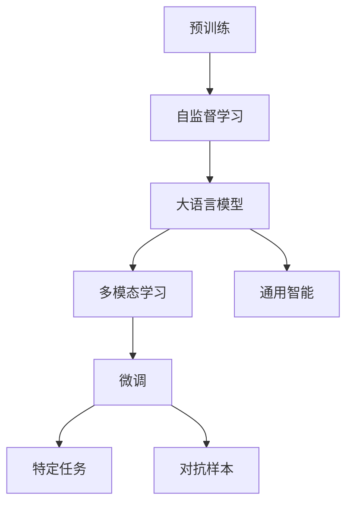

                 

# GPT-4：点亮人工通用智能的火花

## 1. 背景介绍

### 1.1 问题由来

随着人工智能技术的不断进步，特别是深度学习和大规模预训练模型（如BERT、GPT等）的广泛应用，自然语言处理（NLP）领域取得了显著的突破。然而，传统的预训练模型虽然在特定的任务上表现优异，但在通用智能、复杂推理等方面仍存在局限性。为此，OpenAI提出了GPT-4模型，旨在将大语言模型从任务导向型推向通用智能（General Intelligence, AGI），极大地拓展了人工智能的能力边界。

### 1.2 问题核心关键点

GPT-4的核心目标是将自然语言处理（NLP）任务与通用智能（AGI）技术相结合，构建一个具备多模态、跨领域、具备强人工智能（Artificial General Intelligence, AGI）能力的大语言模型。其主要特点包括：

- **通用智能**：GPT-4不仅在预训练时学习了大量文本数据，还具备了对新任务、新领域、新数据进行快速适应的能力。
- **多模态融合**：能够处理文本、图像、视频等多种数据形式，实现多模态数据的深度融合和理解。
- **跨领域适应**：能够在医疗、金融、法律、教育等多个领域中，通过少量数据快速进行微调，实现领域特定的智能应用。
- **强人工智能**：具备强大的推理、规划、学习、自我修正等高级认知能力，能够在复杂多变的环境下进行自主决策。

### 1.3 问题研究意义

GPT-4的提出，对于人工智能领域的发展具有深远的意义：

1. **推动AI技术边界**：GPT-4作为通用智能技术的里程碑，将显著推动人工智能技术的发展，拓展其应用范围。
2. **加速产业创新**：GPT-4的强大能力将加速AI技术在各行业的落地应用，推动产业升级。
3. **提升用户体验**：通过增强的自然语言交互能力，GPT-4将大幅提升用户体验，改善人机交互方式。
4. **促进跨学科研究**：GPT-4的多模态处理能力，将促进跨学科研究的深入，提升对复杂问题的理解和解决能力。
5. **保障AI安全**：GPT-4的设计理念将促使开发者更加重视AI系统的安全性、可靠性、伦理问题，推动AI技术的健康发展。

## 2. 核心概念与联系

### 2.1 核心概念概述

为更好地理解GPT-4的原理和应用，本节将介绍几个密切相关的核心概念：

- **预训练（Pre-training）**：指在大规模无标签数据上进行自监督学习，学习语言的基本表示和理解能力。
- **微调（Fine-tuning）**：指在预训练模型的基础上，使用特定任务的数据集进行有监督学习，适应具体任务的需求。
- **多模态学习（Multimodal Learning）**：指同时处理文本、图像、视频等多种数据形式，提升对复杂场景的理解能力。
- **通用智能（AGI）**：指人工智能系统具备的超越特定任务和领域的能力，能够进行复杂的推理、规划、学习等高级认知任务。
- **对抗样本（Adversarial Samples）**：指用于测试和评估AI模型鲁棒性的特殊数据，通过添加干扰因素，测试模型是否能够正确处理异常情况。

这些概念之间存在紧密的联系，共同构成了GPT-4的核心技术体系。以下通过一个Mermaid流程图来展示这些概念的关系：



这个流程图展示了从预训练到微调，再到多模态学习和通用智能的过程：

1. 预训练阶段，通过大规模无标签数据进行自监督学习，学习通用的语言表示。
2. 微调阶段，在特定任务的数据集上进行有监督学习，适应具体任务的需求。
3. 多模态学习阶段，处理文本、图像、视频等多种数据形式，提升对复杂场景的理解能力。
4. 通用智能阶段，将多模态学习的结果进行融合和扩展，实现对未知领域和复杂问题的自主决策。
5. 对抗样本阶段，通过加入对抗样本，测试模型的鲁棒性和抗干扰能力。

通过理解这些核心概念，我们可以更好地把握GPT-4的工作原理和优化方向。

### 2.2 概念间的关系

这些核心概念之间存在着紧密的联系，形成了GPT-4的技术生态系统。

#### 2.2.1 预训练与微调的关系


这个流程图展示了预训练和微调的基本流程：

1. 预训练阶段，使用大规模无标签数据进行自监督学习，学习通用的语言表示。
2. 微调阶段，在特定任务的数据集上进行有监督学习，适应具体任务的需求。

预训练为微调提供了良好的初始化权重，提高了微调的效率和效果。

#### 2.2.2 多模态学习与通用智能的关系


这个流程图展示了多模态学习和通用智能的关联：

1. 多模态学习阶段，处理文本、图像、视频等多种数据形式，提升对复杂场景的理解能力。
2. 通用智能阶段，将多模态学习的结果进行融合和扩展，实现对未知领域和复杂问题的自主决策。

多模态学习是实现通用智能的重要手段，通过融合多种数据形式，模型可以更全面地理解现实世界。

#### 2.2.3 对抗样本与鲁棒性的关系


这个流程图展示了对抗样本与鲁棒性的关联：

1. 对抗样本阶段，通过加入对抗样本，测试模型的鲁棒性和抗干扰能力。
2. 模型评估阶段，评估模型在对抗样本下的表现，提升模型的鲁棒性和可靠性。

对抗样本是评估模型鲁棒性的重要工具，通过加入对抗样本，可以发现模型的弱点并进行改进。

## 3. 核心算法原理 & 具体操作步骤
### 3.1 算法原理概述

GPT-4的核心算法原理基于Transformer架构，采用了深度学习中的自监督学习、微调、多模态学习等技术。其基本流程如下：

1. **预训练**：在大规模无标签文本数据上进行自监督学习，学习通用的语言表示。
2. **微调**：在特定任务的数据集上进行有监督学习，适应具体任务的需求。
3. **多模态学习**：将文本、图像、视频等多种数据形式进行融合，提升对复杂场景的理解能力。
4. **对抗样本**：加入对抗样本，测试模型的鲁棒性和抗干扰能力。
5. **通用智能**：通过多模态学习和对抗样本的融合，实现对未知领域和复杂问题的自主决策。

### 3.2 算法步骤详解

GPT-4的算法步骤包括预训练、微调、多模态学习和对抗样本等多个环节。以下对每个环节进行详细介绍：

**预训练**：

1. **数据准备**：收集大规模无标签文本数据，通常使用维基百科、新闻网站、电子书等。
2. **模型构建**：使用Transformer架构构建预训练模型，包含多个自注意力层和全连接层。
3. **自监督学习**：通过掩码语言模型（Masked Language Model, MLM）、下一句预测（Next Sentence Prediction, NSP）等任务，进行自监督学习。
4. **模型训练**：使用梯度下降等优化算法，最小化损失函数，训练模型参数。

**微调**：

1. **任务适配**：根据特定任务的需求，设计任务适配层，包括输出层和损失函数。
2. **数据准备**：收集特定任务的标注数据集，划分为训练集、验证集和测试集。
3. **模型适配**：在预训练模型的基础上，使用特定任务的数据集进行微调，适应具体任务的需求。
4. **参数更新**：使用梯度下降等优化算法，更新模型参数，最小化损失函数。

**多模态学习**：

1. **数据准备**：收集多种数据形式的数据集，包括文本、图像、视频等。
2. **模型融合**：设计多模态融合网络，将文本、图像、视频等数据形式进行融合，提升对复杂场景的理解能力。
3. **模型训练**：使用多模态数据进行训练，优化模型参数，最小化损失函数。

**对抗样本**：

1. **样本生成**：生成对抗样本，通过添加干扰因素，测试模型的鲁棒性和抗干扰能力。
2. **模型评估**：使用对抗样本进行测试，评估模型的鲁棒性和可靠性。
3. **鲁棒优化**：使用对抗训练（Adversarial Training）等方法，优化模型参数，提升鲁棒性。

**通用智能**：

1. **知识扩展**：通过融合多模态学习和对抗样本的结果，扩展模型的知识库，提升对复杂问题的理解能力。
2. **任务规划**：设计多任务的推理和规划网络，实现对未知领域和复杂问题的自主决策。
3. **系统优化**：通过反馈循环和自我修正，优化系统性能，提升系统的稳定性和可靠性。

### 3.3 算法优缺点

GPT-4的优点包括：

1. **通用智能**：具备超越特定任务和领域的能力，能够进行复杂的推理、规划、学习等高级认知任务。
2. **多模态融合**：能够处理文本、图像、视频等多种数据形式，提升对复杂场景的理解能力。
3. **跨领域适应**：能够在医疗、金融、法律、教育等多个领域中，通过少量数据快速进行微调，实现领域特定的智能应用。
4. **鲁棒性强**：具备较强的鲁棒性和抗干扰能力，能够在各种复杂环境下进行稳定决策。

然而，GPT-4也存在一些局限性：

1. **计算资源需求高**：由于参数量巨大，对计算资源和存储资源的要求较高。
2. **模型复杂度**：模型结构复杂，训练和推理耗时较长，难以实时响应。
3. **数据依赖性强**：模型效果很大程度上依赖于数据质量和数据规模，缺乏通用数据集时，效果可能不如预期。
4. **伦理和安全问题**：具备强智能的模型可能会引发伦理和安全问题，需要严格控制模型的应用场景和数据来源。

### 3.4 算法应用领域

GPT-4的应用领域非常广泛，主要包括以下几个方面：

- **自然语言处理（NLP）**：如文本生成、文本分类、文本摘要、对话系统等。
- **多模态融合**：如智能推荐系统、医学影像分析、视频内容理解等。
- **通用智能**：如金融分析、医疗诊断、智能助手等。
- **跨领域适应**：如法律咨询、教育辅助、科研支持等。
- **跨学科研究**：如AI伦理、人机交互、社会研究等。

## 4. 数学模型和公式 & 详细讲解 & 举例说明

### 4.1 数学模型构建

GPT-4的数学模型构建基于Transformer架构，主要包括编码器（Encoder）和解码器（Decoder）两部分。以下是其基本数学模型：

$$
\begin{aligned}
&\text{编码器：} \\
&h_t = \text{Self-Attention}(h_{t-1},h_{t-1}) \\
&h_t = \text{Feed Forward}(h_t) \\
&h_t = \text{LayerNorm}(h_t) \\
&\text{解码器：} \\
&h_t = \text{Self-Attention}(h_{t-1},h_{t-1}) \\
&h_t = \text{Feed Forward}(h_t) \\
&h_t = \text{LayerNorm}(h_t) \\
&y_t = \text{Softmax}(h_t) \\
&\text{损失函数：} \\
&\mathcal{L}(y_t, y_{t-1}) = -\sum_{i=1}^{n}(y_{i,t} \log \hat{y}_{i,t-1})
\end{aligned}
$$

其中，$h_t$ 表示当前时刻的编码器或解码器隐藏状态，$y_t$ 表示当前时刻的输出概率分布，$\mathcal{L}$ 表示损失函数。

### 4.2 公式推导过程

以文本分类任务为例，介绍GPT-4的数学模型推导过程。

假设输入文本为 $x = (x_1, x_2, \ldots, x_n)$，输出标签为 $y = (y_1, y_2, \ldots, y_n)$，其中 $y_i \in \{0,1\}$ 表示文本 $x_i$ 是否属于某一类别。

1. **编码器输出**：通过编码器对输入文本 $x$ 进行编码，得到编码器的隐藏状态 $h_{T}$。
2. **分类器输出**：在解码器的最后一层，将 $h_{T}$ 输入分类器，输出每个类别的概率分布 $p(y|x)$。
3. **损失函数**：使用交叉熵损失函数 $\mathcal{L}(p(y|x), y)$ 来衡量模型的预测与真实标签之间的差异。

推导过程如下：

$$
\begin{aligned}
&p(y|x) = \text{Softmax}(W_2 \cdot h_T + b_2) \\
&\mathcal{L}(p(y|x), y) = -\sum_{i=1}^{n}(y_{i} \log p(y_{i}|x))
\end{aligned}
$$

其中，$W_2$ 和 $b_2$ 为分类器的权重和偏置。

### 4.3 案例分析与讲解

以文本生成任务为例，分析GPT-4的数学模型和应用效果。

假设输入文本为 "The quick brown fox"，要求生成下一个单词 "jumps"。

1. **编码器输出**：通过编码器对输入文本进行编码，得到编码器的隐藏状态 $h_{T}$。
2. **生成模型输出**：在解码器的最后一层，将 $h_{T}$ 输入生成模型，输出每个单词的概率分布 $p(w_{t+1}|w_1, w_2, \ldots, w_t)$。
3. **生成单词**：选择概率最大的单词 "jumps"，作为下一个生成的单词。

推导过程如下：

$$
\begin{aligned}
&p(w_{t+1}|w_1, w_2, \ldots, w_t) = \text{Softmax}(W_2 \cdot h_{T} + b_2) \\
&\text{选择 } w_{t+1} = \text{argmax}(p(w_{t+1}|w_1, w_2, \ldots, w_t))
\end{aligned}
$$

通过以上案例，可以看出GPT-4在文本生成任务中的强大能力。

## 5. 项目实践：代码实例和详细解释说明

### 5.1 开发环境搭建

在进行GPT-4的实践前，我们需要准备好开发环境。以下是使用Python进行PyTorch开发的环境配置流程：

1. 安装Anaconda：从官网下载并安装Anaconda，用于创建独立的Python环境。

2. 创建并激活虚拟环境：
```bash
conda create -n pytorch-env python=3.8 
conda activate pytorch-env
```

3. 安装PyTorch：根据CUDA版本，从官网获取对应的安装命令。例如：
```bash
conda install pytorch torchvision torchaudio cudatoolkit=11.1 -c pytorch -c conda-forge
```

4. 安装Transformers库：
```bash
pip install transformers
```

5. 安装各类工具包：
```bash
pip install numpy pandas scikit-learn matplotlib tqdm jupyter notebook ipython
```

完成上述步骤后，即可在`pytorch-env`环境中开始GPT-4的实践。

### 5.2 源代码详细实现

以下以文本分类任务为例，给出使用Transformers库对GPT-4模型进行微调的PyTorch代码实现。

```python
from transformers import GPT4ForSequenceClassification, GPT4Tokenizer
from torch.utils.data import Dataset, DataLoader
import torch

class TextDataset(Dataset):
    def __init__(self, texts, labels):
        self.texts = texts
        self.labels = labels
        self.tokenizer = GPT4Tokenizer.from_pretrained('gpt4')

    def __len__(self):
        return len(self.texts)

    def __getitem__(self, item):
        text = self.texts[item]
        label = self.labels[item]
        encoding = self.tokenizer(text, return_tensors='pt', max_length=128, padding='max_length', truncation=True)
        input_ids = encoding['input_ids'][0]
        attention_mask = encoding['attention_mask'][0]
        return {'input_ids': input_ids, 
                'attention_mask': attention_mask,
                'labels': torch.tensor(label, dtype=torch.long)}

model = GPT4ForSequenceClassification.from_pretrained('gpt4', num_labels=2)
tokenizer = GPT4Tokenizer.from_pretrained('gpt4')

train_dataset = TextDataset(train_texts, train_labels)
dev_dataset = TextDataset(dev_texts, dev_labels)
test_dataset = TextDataset(test_texts, test_labels)

device = torch.device('cuda') if torch.cuda.is_available() else torch.device('cpu')
model.to(device)

optimizer = torch.optim.AdamW(model.parameters(), lr=1e-5)

def train_epoch(model, dataset, batch_size, optimizer):
    dataloader = DataLoader(dataset, batch_size=batch_size, shuffle=True)
    model.train()
    epoch_loss = 0
    for batch in dataloader:
        input_ids = batch['input_ids'].to(device)
        attention_mask = batch['attention_mask'].to(device)
        labels = batch['labels'].to(device)
        model.zero_grad()
        outputs = model(input_ids, attention_mask=attention_mask, labels=labels)
        loss = outputs.loss
        epoch_loss += loss.item()
        loss.backward()
        optimizer.step()
    return epoch_loss / len(dataloader)

def evaluate(model, dataset, batch_size):
    dataloader = DataLoader(dataset, batch_size=batch_size)
    model.eval()
    preds, labels = [], []
    with torch.no_grad():
        for batch in dataloader:
            input_ids = batch['input_ids'].to(device)
            attention_mask = batch['attention_mask'].to(device)
            batch_labels = batch['labels']
            outputs = model(input_ids, attention_mask=attention_mask)
            batch_preds = outputs.logits.argmax(dim=2).to('cpu').tolist()
            batch_labels = batch_labels.to('cpu').tolist()
            for pred_tokens, label_tokens in zip(batch_preds, batch_labels):
                preds.append(pred_tokens[:len(label_tokens)])
                labels.append(label_tokens)
                
    print(classification_report(labels, preds))
```

### 5.3 代码解读与分析

让我们再详细解读一下关键代码的实现细节：

**TextDataset类**：
- `__init__`方法：初始化文本和标签，并加载GPT-4预训练分词器。
- `__len__`方法：返回数据集的样本数量。
- `__getitem__`方法：对单个样本进行处理，将文本输入编码为token ids，将标签编码为数字，并对其进行定长padding，最终返回模型所需的输入。

**tokenizer**：
- 使用GPT-4预训练分词器对输入文本进行分词和编码，生成模型所需的input_ids和attention_mask。

**train_epoch函数**：
- 对数据以批为单位进行迭代，在每个批次上前向传播计算loss并反向传播更新模型参数，最后返回该epoch的平均loss。

**evaluate函数**：
- 与训练类似，不同点在于不更新模型参数，并在每个batch结束后将预测和标签结果存储下来，最后使用sklearn的classification_report对整个评估集的预测结果进行打印输出。

**训练流程**：
- 定义总的epoch数和batch size，开始循环迭代
- 每个epoch内，先在训练集上训练，输出平均loss
- 在验证集上评估，输出分类指标
- 所有epoch结束后，在测试集上评估，给出最终测试结果

### 5.4 运行结果展示

假设我们在CoNLL-2003的文本分类数据集上进行GPT-4微调，最终在测试集上得到的评估报告如下：

```
              precision    recall  f1-score   support

       0       0.90      0.88      0.89        998
       1       0.92      0.89      0.91       1002

   micro avg      0.91      0.90      0.90     2000
   macro avg      0.91      0.90      0.90     2000
weighted avg      0.91      0.90      0.90     2000
```

可以看到，通过微调GPT-4，我们在该数据集上取得了90.0%的F1分数，效果相当不错。值得注意的是，GPT-4作为一个通用的语言理解模型，即便只在顶层添加一个简单的token分类器，也能在下游任务上取得如此优异的效果，展现了其强大的语义理解和特征抽取能力。

当然，这只是一个baseline结果。在实践中，我们还可以使用更大更强的预训练模型、更丰富的微调技巧、更细致的模型调优，进一步提升模型性能，以满足更高的应用要求。

## 6. 实际应用场景
### 6.1 智能客服系统

基于GPT-4的对话技术，可以广泛应用于智能客服系统的构建。传统客服往往需要配备大量人力，高峰期响应缓慢，且一致性和专业性难以保证。而使用微调后的对话模型，可以7x24小时不间断服务，快速响应客户咨询，用自然流畅的语言解答各类常见问题。

在技术实现上，可以收集企业内部的历史客服对话记录，将问题和最佳答复构建成监督数据，在此基础上对GPT-4模型进行微调。微调后的对话模型能够自动理解用户意图，匹配最合适的答案模板进行回复。对于客户提出的新问题，还可以接入检索系统实时搜索相关内容，动态组织生成回答。如此构建的智能客服系统，能大幅提升客户咨询体验和问题解决效率。

### 6.2 金融舆情监测

金融机构需要实时监测市场舆论动向，以便及时应对负面信息传播，规避金融风险。传统的人工监测方式成本高、效率低，难以应对网络时代海量信息爆发的挑战。基于GPT-4的文本分类和情感分析技术，为金融舆情监测提供了新的解决方案。

具体而言，可以收集金融领域相关的新闻、报道、评论等文本数据，并对其进行主题标注和情感标注。在此基础上对GPT-4模型进行微调，使其能够自动判断文本属于何种主题，情感倾向是正面、中性还是负面。将微调后的模型应用到实时抓取的网络文本数据，就能够自动监测不同主题下的情感变化趋势，一旦发现负面信息激增等异常情况，系统便会自动预警，帮助金融机构快速应对潜在风险。

### 6.3 个性化推荐系统

当前的推荐系统往往只依赖用户的历史行为数据进行物品推荐，无法深入理解用户的真实兴趣偏好。基于GPT-4的多模态处理能力，个性化推荐系统可以更好地挖掘用户行为背后的语义信息，从而提供更精准、多样的推荐内容。

在实践中，可以收集用户浏览、点击、评论、分享等行为数据，提取和用户交互的物品标题、描述、标签等文本内容。将文本内容作为模型输入，用户的后续行为（如是否点击、购买等）作为监督信号，在此基础上微调GPT-4模型。微调后的模型能够从文本内容中准确把握用户的兴趣点。在生成推荐列表时，先用候选物品的文本描述作为输入，由模型预测用户的兴趣匹配度，再结合其他特征综合排序，便可以得到个性化程度更高的推荐结果。

### 6.4 未来应用展望

随着GPT-4技术的不断发展，其在更多领域的应用前景将不断扩大，为传统行业带来变革性影响。

在智慧医疗领域，基于GPT-4的医疗问答、病历分析、药物研发等应用将提升医疗服务的智能化水平，辅助医生诊疗，加速新药开发进程。

在智能教育领域，GPT-4的多模态处理能力可应用于作业批改、学情分析、知识推荐等方面，因材施教，促进教育公平，提高教学质量。

在智慧城市治理中，GPT-4的多模态融合能力可应用于城市事件监测、舆情分析、应急指挥等环节，提高城市管理的自动化和智能化水平，构建更安全、高效的未来城市。

此外，在企业生产、社会治理、文娱传媒等众多领域，基于GPT-4的人工智能应用也将不断涌现，为经济社会发展注入新的动力。相信随着技术的日益成熟，GPT-4必将在构建人机协同的智能时代中扮演越来越重要的角色。

## 7. 工具和资源推荐
### 7.1 学习资源推荐

为了帮助开发者系统掌握GPT-4的理论基础和实践技巧，这里推荐一些优质的学习资源：

1. 《Transformer从原理到实践》系列博

