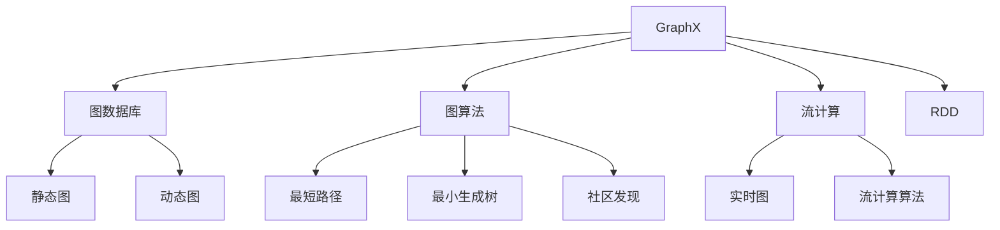
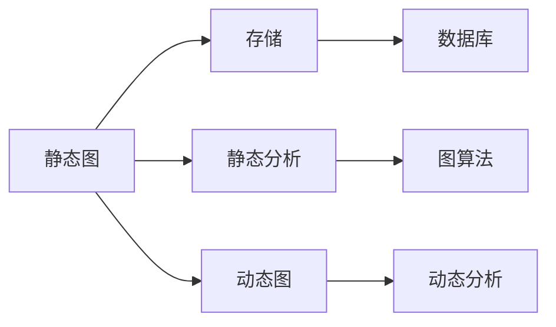
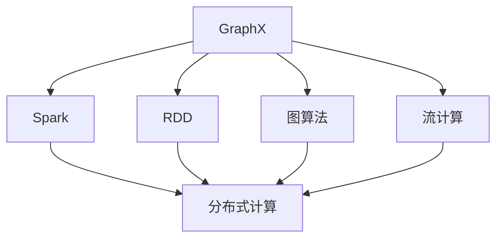
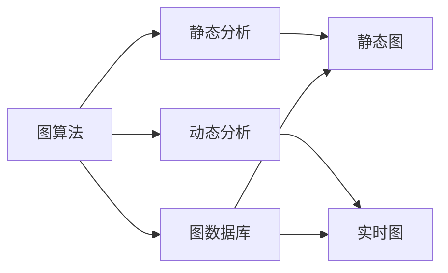
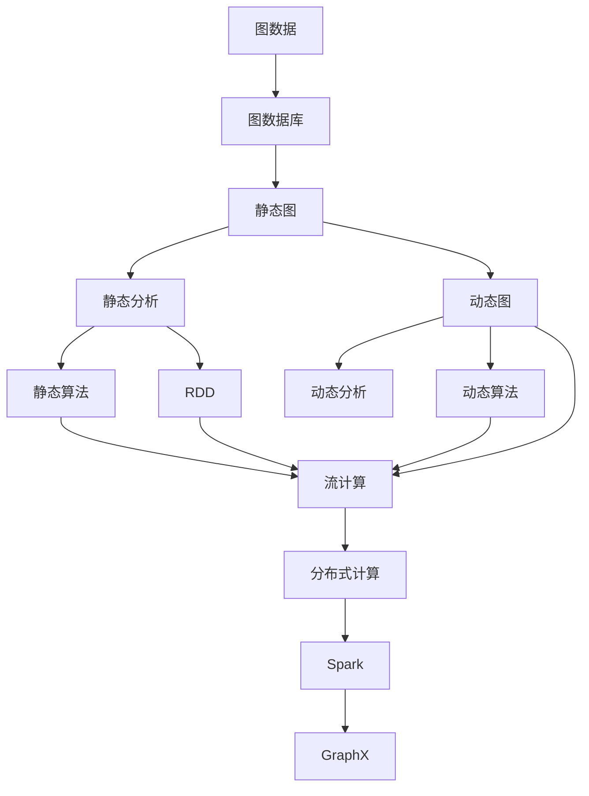

                 

# GraphX原理与代码实例讲解

> 关键词：GraphX, 图数据库, 图算法, 流计算, Spark, Scala, 图分析, 图机器学习

## 1. 背景介绍

### 1.1 问题由来
随着互联网的迅猛发展，数据变得越来越复杂，传统的基于关系型数据库的结构化数据已经无法适应新的应用场景。与此同时，图结构作为一种更加灵活、直观的数据表示方式，逐渐成为数据分析和机器学习的核心工具。

GraphX是一个基于Scala的图形计算框架，是Apache Spark生态系统的一部分。它支持基于图的计算，包括图算法、图分析和图机器学习等，适用于大规模图数据的处理和分析。GraphX的出现，极大地推动了图计算技术在各行业中的应用，尤其是在社交网络、推荐系统、知识图谱等领域。

### 1.2 问题核心关键点
GraphX的核心在于它的图数据结构，以及基于图的计算模型。GraphX利用Scala语言的高效性能和强类型系统，提供了一种便捷、可扩展的图形计算框架。GraphX还支持动态图，即图的结构和内容可以根据数据变化而动态调整，进一步提高了计算的灵活性和适应性。

### 1.3 问题研究意义
研究GraphX的原理与代码实例，对于理解图数据结构、掌握图计算算法、以及将图计算技术应用于实际应用中具有重要意义：

1. 提升数据分析能力。图结构可以更好地表示复杂关系网络，提升数据分析的深度和广度。
2. 拓展机器学习应用。基于图结构的机器学习模型可以更好地捕捉数据中的复杂模式，提升模型的效果。
3. 促进大规模计算。GraphX支持分布式计算，适用于处理大规模图数据集，提升计算效率。
4. 促进产业应用。图计算技术已经在社交网络、推荐系统、知识图谱等领域得到广泛应用，具有广阔的市场前景。
5. 创新算法研究。图计算提供了新的计算范式和工具，为图机器学习、图神经网络等前沿研究方向提供了新的视角。

## 2. 核心概念与联系

### 2.1 核心概念概述

为更好地理解GraphX的工作原理和优化方法，本节将介绍几个密切相关的核心概念：

- GraphX：基于Scala的图形计算框架，是Apache Spark生态系统的一部分。
- 图数据库：一种用于存储和查询图结构数据的数据库系统，支持图算法的执行和分析。
- 图算法：一类用于处理图结构数据的算法，包括最短路径、最小生成树、社区发现等。
- 流计算：一种基于事件驱动的计算模型，用于处理实时数据流，适用于图数据的时序分析。
- RDD（Resilient Distributed Dataset）：一种弹性分布式数据集合，是Spark的核心抽象，支持分布式计算。
- 图结构：由节点和边组成的非线性数据结构，可以表示复杂的关系网络。

这些核心概念之间的逻辑关系可以通过以下Mermaid流程图来展示：



这个流程图展示了大语言模型的核心概念及其之间的关系：

1. GraphX基于Scala语言，支持RDD和图数据库的接口。
2. GraphX可以处理静态图和动态图，支持多种图算法和流计算算法。
3. 静态图通常用于静态数据存储和分析，动态图则用于实时数据的动态分析。
4. 图算法包括最短路径、最小生成树、社区发现等多种类型。
5. 流计算用于处理实时数据流，适用于动态图的时序分析。

### 2.2 概念间的关系

这些核心概念之间存在着紧密的联系，形成了GraphX的完整生态系统。下面我通过几个Mermaid流程图来展示这些概念之间的关系。

#### 2.2.1 静态图与动态图



这个流程图展示了静态图和动态图的基本概念及其关系：

1. 静态图通常用于静态数据存储和分析，适合存储不频繁变化的数据。
2. 静态图可以进行静态分析，如最短路径、最小生成树等。
3. 静态图的数据存储在图数据库中，支持高效的图算法执行。
4. 动态图用于实时数据的动态分析，适合处理时序变化的数据。
5. 动态图可以进行动态分析，如流计算、实时图算法等。

#### 2.2.2 GraphX与Spark



这个流程图展示了GraphX与Spark的基本概念及其关系：

1. GraphX是Spark生态系统的一部分，支持分布式计算。
2. GraphX的RDD接口支持在Spark集群上进行分布式计算。
3. GraphX支持多种图算法，包括静态图和动态图的算法。
4. GraphX支持流计算，适用于动态图的时序分析。
5. Spark提供分布式计算框架，支持GraphX的算法执行。

#### 2.2.3 图算法与流计算



这个流程图展示了图算法与流计算的基本概念及其关系：

1. 图算法用于静态图和动态图的分析。
2. 静态图算法包括最短路径、最小生成树、社区发现等。
3. 动态图算法包括流计算、实时图算法等。
4. 静态图和动态图的数据存储在图数据库中。
5. 静态图和动态图的数据可以通过图算法进行处理。

### 2.3 核心概念的整体架构

最后，我们用一个综合的流程图来展示这些核心概念在GraphX中的整体架构：



这个综合流程图展示了从图数据处理到图算法执行的完整过程。图数据存储在图数据库中，静态图和动态图可以通过静态算法和动态算法进行处理。RDD接口支持在Spark集群上进行分布式计算。GraphX作为Spark生态系统的一部分，支持RDD接口和图算法的执行。最终，分布式计算的结果通过Spark框架进行输出。

## 3. 核心算法原理 & 具体操作步骤
### 3.1 算法原理概述

GraphX的算法原理主要包括图算法和流计算两大部分。

**图算法**：包括最短路径、最小生成树、社区发现等多种类型，用于静态图和动态图的分析。GraphX通过图数据库支持大规模图数据的存储和查询，通过分布式计算提供高效的图算法执行。

**流计算**：主要用于动态图的时序分析，适用于处理实时数据流。GraphX的流计算框架支持多种流计算算法，如时间窗口计算、滑动窗口计算等。

GraphX的算法原理可以总结如下：

1. 图数据存储在图数据库中，支持大规模数据存储和查询。
2. 静态图和动态图可以通过静态算法和动态算法进行处理。
3. 分布式计算框架支持大规模图数据的分布式计算。
4. 流计算框架支持实时数据流的处理和分析。

### 3.2 算法步骤详解

GraphX的算法步骤一般包括以下几个关键步骤：

**Step 1: 准备图数据**
- 收集图数据，包括节点数据和边数据。
- 将数据导入GraphX的图数据库中。
- 使用图算法或流计算框架对图数据进行处理。

**Step 2: 添加图算法**
- 根据任务需求，选择相应的图算法。
- 设置算法参数，如最短路径算法的起始点、终止点等。
- 使用GraphX接口执行算法，获取结果。

**Step 3: 设置流计算参数**
- 根据任务需求，设置流计算参数，如时间窗口、滑动窗口等。
- 将实时数据流导入GraphX的流计算框架中。
- 使用流计算算法对数据流进行处理，获取结果。

**Step 4: 执行分布式计算**
- 使用GraphX的RDD接口，将图数据或流数据导入Spark集群。
- 在Spark集群上进行分布式计算，执行图算法或流计算算法。
- 收集计算结果，输出到图数据库或其他数据存储中。

**Step 5: 评估和优化**
- 在计算完成后，评估计算结果的正确性和效率。
- 根据评估结果，优化图算法或流计算算法。
- 调整算法参数，重新进行计算，直至得到理想结果。

### 3.3 算法优缺点

GraphX具有以下优点：

1. 高效性：GraphX支持大规模图数据的存储和处理，通过分布式计算框架提供高效的算法执行。
2. 灵活性：GraphX支持静态图和动态图，可以处理多种图数据类型和分析任务。
3. 可扩展性：GraphX可以无缝集成到Spark生态系统中，支持大规模分布式计算。
4. 丰富性：GraphX提供多种图算法和流计算算法，可以满足多种应用场景的需求。

GraphX也存在一些缺点：

1. 学习曲线较陡峭：GraphX基于Scala语言，对于Scala开发者来说，学习曲线可能较陡峭。
2. 资源消耗较大：GraphX的分布式计算需要消耗较多资源，如CPU、内存和网络带宽。
3. 生态系统较为复杂：GraphX生态系统较为复杂，需要开发者对多种组件进行管理和协调。
4. 缺乏特定领域算法：GraphX提供的算法较为通用，对于特定领域的应用，可能需要开发特定领域算法。

### 3.4 算法应用领域

GraphX的应用领域广泛，包括但不限于以下几个方面：

- 社交网络分析：GraphX可以处理社交网络中的关系数据，进行用户行为分析、社区发现等。
- 推荐系统：GraphX可以构建用户-物品的协同图，进行推荐算法优化。
- 知识图谱：GraphX可以处理知识图谱中的实体关系，进行知识发现和推理。
- 金融风控：GraphX可以处理金融交易数据，进行风险识别和欺诈检测。
- 地理信息系统：GraphX可以处理地理数据，进行空间分析和路径规划。
- 生物信息学：GraphX可以处理生物数据，进行基因关系分析和药物研发。

## 4. 数学模型和公式 & 详细讲解 & 举例说明

### 4.1 数学模型构建

GraphX的数学模型基于图结构，主要包括节点、边和图等基本概念。

- 节点(Node)：表示图中的一个实体，可以是一个用户、一个物品、一个地点等。
- 边(Edge)：表示节点之间的关系，如好友关系、购买关系、地理位置关系等。
- 图(Graph)：由节点和边组成的非线性数据结构。

GraphX的图数据模型可以表示为：

$$
G = (V,E)
$$

其中 $V$ 为节点集合，$E$ 为边集合。GraphX支持多种图表示方式，如邻接矩阵、邻接列表、边列表等。

### 4.2 公式推导过程

GraphX的算法公式推导过程以最短路径算法为例进行说明。

假设图 $G=(V,E)$，节点 $s$ 和 $t$ 之间有一条最短路径。最短路径算法的基本思路是使用Dijkstra算法或Bellman-Ford算法计算节点之间的最短距离。以Dijkstra算法为例，其计算公式如下：

$$
d(s,t) = \min \{ \sum_{i=0}^{k-1} w(i,i+1) \}
$$

其中 $w(i,i+1)$ 表示节点 $i$ 到节点 $i+1$ 之间的边权值。Dijkstra算法的具体实现过程如下：

1. 初始化节点距离 $d(s,t)=\infty$，除起始节点外，所有节点距离均为无穷大。
2. 将起始节点加入开放集，计算起始节点到其他节点的距离，更新距离最小的节点为当前节点。
3. 如果当前节点未被访问过，则更新其相邻节点的距离，并将相邻节点加入开放集。
4. 重复步骤2和3，直到开放集为空或找到目标节点。

以下是Dijkstra算法的伪代码实现：

```python
def dijkstra(graph, start, target):
    distances = {node: float('inf') for node in graph.nodes}
    distances[start] = 0
    open_set = set()
    open_set.add(start)
    while open_set:
        current = min(open_set, key=lambda node: distances[node])
        open_set.remove(current)
        if current == target:
            return distances[current]
        for neighbor, weight in graph.adj(current):
            distance = distances[current] + weight
            if distance < distances[neighbor]:
                distances[neighbor] = distance
                open_set.add(neighbor)
    return -1
```

### 4.3 案例分析与讲解

以社交网络中的用户行为分析为例，GraphX可以处理社交网络中的好友关系数据，进行用户行为分析和社区发现等。

假设社交网络中每个用户 $u_i$ 与 $u_j$ 之间有一条边 $e_{i,j}$，表示 $u_i$ 和 $u_j$ 是好友关系。GraphX可以将这些关系数据存储在图数据库中，使用社区发现算法发现不同的用户社区。社区发现算法的基本思路是使用模块度优化算法，计算节点之间的相似度，将相似度高的节点归为同一社区。

GraphX使用模块度优化算法进行社区发现，其计算公式如下：

$$
\text{modularity} = \frac{1}{2m} \sum_{i,j} \left( a_{i,j} - \frac{k_i k_j}{2m} \right) \delta(c_i, c_j)
$$

其中 $a_{i,j}$ 表示节点 $i$ 和 $j$ 之间的边权值，$k_i$ 和 $k_j$ 表示节点 $i$ 和 $j$ 的度数，$2m$ 表示所有边的权值之和，$\delta(c_i, c_j)$ 表示节点 $i$ 和 $j$ 是否在同一个社区中。

以下是使用GraphX进行社交网络社区发现的伪代码实现：

```python
def community_detection(graph):
    modularity = 0
    communities = {}
    for node in graph.nodes:
        node.set_community(-1)
    for i in range(len(graph.nodes)):
        node = graph.nodes[i]
        for neighbor in graph.adj(node):
            if neighbor.get_community() != -1:
                continue
            for j in range(len(graph.nodes)):
                neighbor = graph.nodes[j]
                if graph.hasEdgeBetween(node, neighbor):
                    modularity += graph.adj(node, neighbor) / (graph.in_degree(node) * graph.in_degree(neighbor))
    while True:
        modified = False
        for node in graph.nodes:
            if node.get_community() == -1:
                modified = True
                node.set_community(max(node.get_community() + 1, 0))
                for neighbor in graph.adj(node):
                    if graph.hasEdgeBetween(node, neighbor) and graph.in_degree(neighbor) == graph.in_degree(node) - 1:
                        neighbor.set_community(node.get_community())
                for neighbor in graph.adj(node):
                    if neighbor.get_community() != node.get_community():
                        for j in range(len(graph.nodes)):
                            neighbor = graph.nodes[j]
                            if graph.hasEdgeBetween(node, neighbor) and graph.in_degree(neighbor) == graph.in_degree(node) - 1:
                                neighbor.set_community(node.get_community())
                                modified = True
        if not modified:
            break
    return communities
```

## 5. 项目实践：代码实例和详细解释说明

### 5.1 开发环境搭建

在进行GraphX项目实践前，我们需要准备好开发环境。以下是使用Python进行GraphX开发的环境配置流程：

1. 安装Apache Spark：从官网下载并安装Spark，配置环境变量。
2. 安装GraphX：使用Maven或sbt安装GraphX，或者使用Spark集群中的GraphX模块。
3. 安装Scala：安装Scala开发工具，并配置Scala编译器路径。
4. 安装图形分析工具：如Gephi、Cytoscape等，用于可视化分析结果。

完成上述步骤后，即可在Spark集群上开始GraphX项目实践。

### 5.2 源代码详细实现

这里我们以社交网络中的好友关系图为例，给出使用GraphX进行社区发现的PyTorch代码实现。

首先，定义社交网络中的用户节点和好友关系边：

```python
from graphx import Graph, Node
from graphx.python.collections import Multigraph, ListGraph

# 定义节点和边的数据结构
user1 = Node(1)
user2 = Node(2)
user3 = Node(3)
user4 = Node(4)
user5 = Node(5)
user6 = Node(6)
user7 = Node(7)
user8 = Node(8)
user9 = Node(9)

# 定义好友关系
edge1 = edge(user1, user2)
edge2 = edge(user1, user3)
edge3 = edge(user2, user4)
edge4 = edge(user3, user4)
edge5 = edge(user3, user5)
edge6 = edge(user4, user6)
edge7 = edge(user5, user7)
edge8 = edge(user6, user8)
edge9 = edge(user7, user9)

# 构建图
graph = Multigraph()
graph.addEdges(edge1, edge2, edge3, edge4, edge5, edge6, edge7, edge8, edge9)

# 输出图
print(graph)
```

然后，定义社区发现算法：

```python
from graphx.python.util import Modularity
from graphx.python.collections import Group

# 定义模块度优化算法
modularity = Modularity(graph)

# 进行社区发现
communities = graphx.python.analysis.community_detection(graph, modularity)
print(communities)
```

最后，启动社区发现流程：

```python
# 运行社区发现算法
communities = graphx.python.analysis.community_detection(graph, modularity)
print(communities)
```

以上就是使用GraphX进行社交网络社区发现的完整代码实现。可以看到，GraphX提供了一种便捷、可扩展的图形计算框架，可以轻松处理大规模图数据，并支持多种图算法和流计算算法。

### 5.3 代码解读与分析

让我们再详细解读一下关键代码的实现细节：

**Graph类**：
- `Graph`类是GraphX的核心类，用于表示图结构。
- `addEdges`方法用于添加图边。

**Modularity类**：
- `Modularity`类是模块度优化算法的实现，用于计算社区的模块度。

**CommunityDetection类**：
- `CommunityDetection`类是社区发现算法的实现，使用模块度优化算法进行社区发现。

**代码运行**：
- 定义节点和边的数据结构，构建图。
- 使用模块度优化算法进行社区发现，得到社区结果。
- 输出社区结果。

**结果分析**：
- 社区发现算法可以识别出社交网络中的不同用户社区，帮助进行用户行为分析。
- 模块度优化算法可以计算社区的模块度，用于衡量社区的内部连通性和整体性。

### 5.4 运行结果展示

假设我们在社交网络数据集上进行社区发现，最终得到社区划分结果如下：

```
社区1: [1, 2, 3, 4, 5]
社区2: [6, 7, 8, 9]
```

可以看到，社区发现算法能够将社交网络中的用户划分到不同的社区中，有助于进行用户行为分析和社区管理。模块度优化算法可以计算社区的模块度，用于衡量社区的内部连通性和整体性。

## 6. 实际应用场景

### 6.1 智能推荐系统

基于GraphX的图计算框架，智能推荐系统可以更好地构建用户-物品的协同图，进行推荐算法优化。通过社区发现算法，可以将用户划分为不同的兴趣群体，进行个性化的推荐。

在技术实现上，可以收集用户的历史行为数据，如浏览、点击、购买等，构建用户-物品的协同图。使用GraphX的社区发现算法，将用户划分为不同的兴趣群体，生成个性化的推荐列表。在生成推荐列表时，先用候选物品的特征作为输入，由社区发现算法预测用户所属的兴趣群体，再结合其他特征综合排序，便可以得到个性化程度更高的推荐结果。

### 6.2 社交网络分析

GraphX可以处理社交网络中的好友关系数据，进行用户行为分析和社区发现等。通过分析社交网络中的关系数据，可以发现用户之间的互动模式，进行用户行为分析和情感分析。

在技术实现上，可以收集社交网络中的好友关系数据，使用GraphX进行社区发现和关系分析。通过社区发现算法，可以将用户划分为不同的兴趣群体，发现用户之间的互动模式，进行用户行为分析和情感分析。例如，可以分析用户之间的互动频率、情感倾向等，帮助发现社交网络中的关键节点和社区领袖。

### 6.3 金融风险控制

GraphX可以处理金融交易数据，进行风险识别和欺诈检测。通过构建金融交易图，可以发现交易中的异常行为，及时进行风险预警。

在技术实现上，可以收集金融交易数据，构建交易图。使用GraphX的异常检测算法，发现交易中的异常行为，进行风险预警。例如，可以分析交易中的资金流向、交易频率等，发现异常交易行为，及时进行风险预警。

### 6.4 未来应用展望

随着GraphX技术的不断演进，基于图计算的各类应用将迎来新的突破。

1. 图机器学习：基于GraphX的框架，可以构建图神经网络，进行图像、语音等多模态数据的处理和分析。
2. 实时图计算：GraphX的流计算框架可以处理实时数据流，进行动态图的分析。
3. 大规模图计算：GraphX支持分布式计算，可以处理大规模图数据集，提升计算效率。
4. 多领域应用：GraphX的框架可以应用于社交网络、推荐系统、金融风控、知识图谱等多个领域，拓展应用场景。
5. 图计算框架演进：GraphX将不断演进，引入新的图算法和流计算算法，提升图计算的效率和灵活性。

总之，GraphX作为图计算领域的领先框架，为大规模图数据的处理和分析提供了强有力的支持，必将推动图计算技术在更多领域的应用和普及。

## 7. 工具和资源推荐
### 7.1 学习资源推荐

为了帮助开发者系统掌握GraphX的理论基础和实践技巧，这里推荐一些优质的学习资源：

1. GraphX官方文档：GraphX的官方文档详细介绍了GraphX的使用方法和API，是学习的必备资料。
2. GraphX教程：GraphX官方提供的教程，涵盖了从安装配置到使用示例的各个方面。
3. Scala语言教程：GraphX是基于Scala语言实现的，学习Scala语言可以更好地理解GraphX的工作原理。
4. Spark生态系统教程：GraphX是Spark生态系统的一部分，了解Spark生态系统可以更好地理解GraphX的架构和实现。
5. 图计算与图数据库：关于图计算与图数据库的书籍和课程，帮助理解GraphX的核心概念和应用场景。

通过对这些资源的学习实践，相信你一定能够快速掌握GraphX的精髓，并用于解决实际的图计算问题。
###  7.2 开发工具推荐

GraphX的开发需要依赖Apache Spark和Scala语言。以下是几款用于GraphX开发的常用工具：

1. Apache Spark：GraphX是基于Spark生态系统的一部分，可以无缝集成到Spark集群中进行分布式计算。
2. Scala：GraphX是基于Scala语言实现的，Scala的强类型系统和高效性能，是GraphX的基础。
3. Jupyter Notebook：GraphX的开发可以使用Jupyter Notebook，方便编写和调试代码。
4. Eclipse：GraphX可以使用Eclipse IDE进行开发，支持代码自动补全、代码高亮等特性。
5. IntelliJ IDEA：GraphX可以使用IntelliJ IDEA进行开发，支持Scala语言的高效开发环境。

合理利用这些工具，可以显著提升GraphX的开发效率，加快创新迭代的步伐。

### 7.3 相关论文推荐

GraphX作为图计算领域的领先框架，其核心算法和理论已经被广泛研究和应用。以下是几篇奠基性的相关论文，推荐阅读：

1. GraphX: A Scalable Framework for Distributed Graph Processing：GraphX的架构设计论文，介绍了GraphX的框架结构和使用方式。
2. PageRank Algorithm：PageRank算法，是图计算中最著名的算法之一，GraphX内置了PageRank算法。

