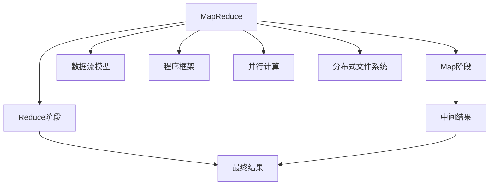
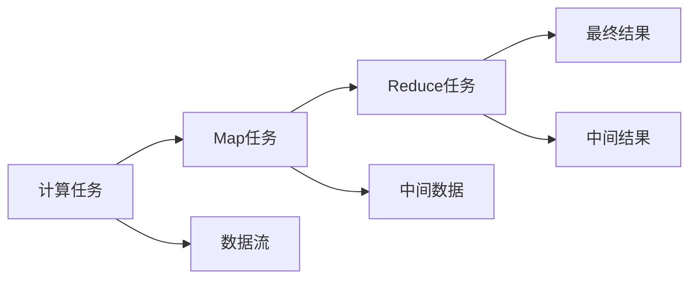
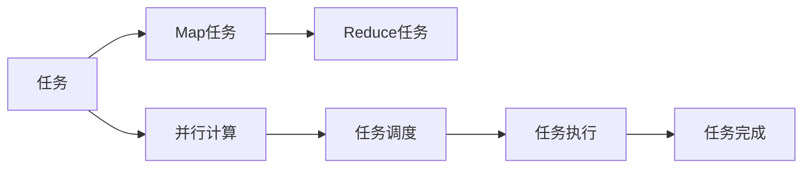
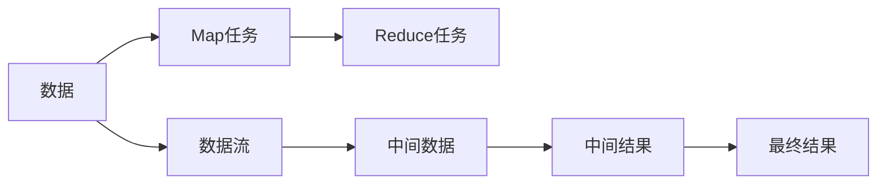
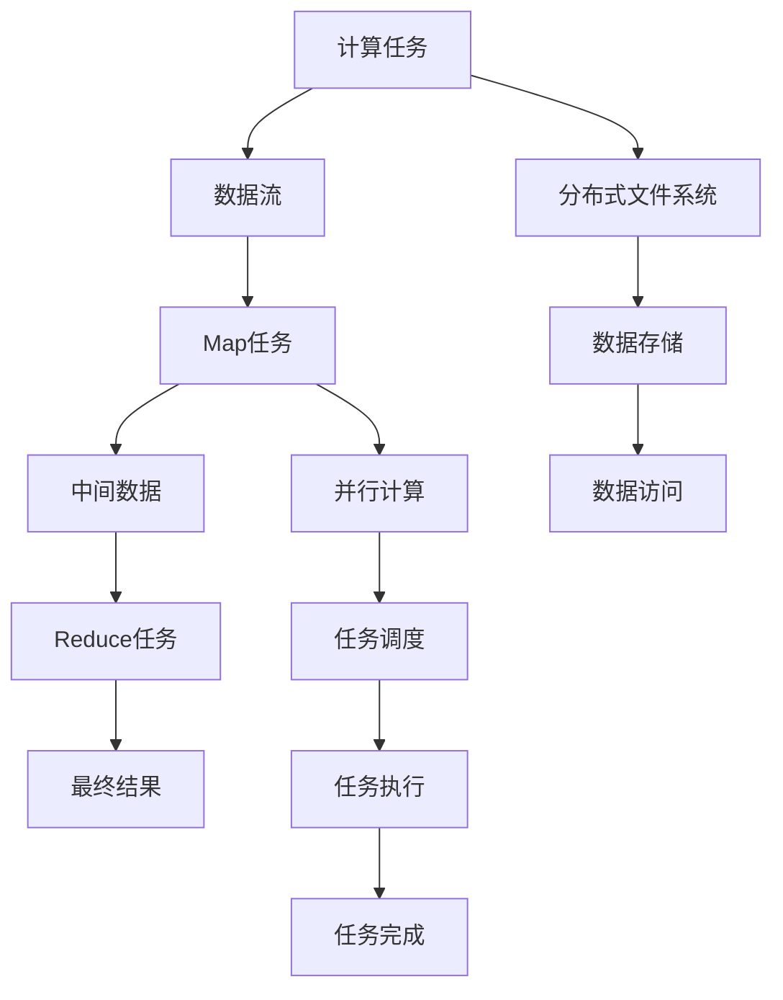

                 

# Hadoop MapReduce计算框架原理与代码实例讲解

> 关键词：Hadoop, MapReduce, 分布式计算, 大数据处理, 数据流模型, 程序框架, 并行计算, 分布式文件系统, 任务调度, 数据处理

## 1. 背景介绍

### 1.1 问题由来
随着互联网和数字技术的飞速发展，数据量呈指数级增长。面对海量数据的处理和分析，传统的集中式处理方式面临诸多挑战，如处理速度慢、扩展性差等。为了解决这些问题，2003年，Google发明了MapReduce分布式计算模型，并在其上搭建了MapReduce计算框架。MapReduce于2004年被公开，随后被Apache基金会吸收，形成了当今流行的Hadoop分布式计算框架。

MapReduce的精髓在于将复杂的计算任务分解成若干个简单且相互独立的小任务，通过分布式计算，实现高效处理大数据的目标。它在分布式计算领域具有重要的地位，是处理大规模数据的重要工具。

### 1.2 问题核心关键点
MapReduce的核心思想是将任务分解为Map和Reduce两个阶段，具有以下特点：
- 分布式计算：将大规模计算任务分解为小任务，通过分布式计算来高效处理大数据。
- 数据局部性：Map阶段将数据划分到各个节点上进行处理，Reduce阶段再将各节点的中间结果合并，实现数据本地化处理。
- 高可靠性：通过多副本机制和任务调度机制，保证系统的高可用性。

MapReduce的成功在于其对大规模数据处理的高效性、可靠性和扩展性，为大数据处理提供了全新的解决思路，为后续诸多大数据处理框架奠定了基础。

### 1.3 问题研究意义
研究MapReduce的原理和实现方法，对于理解分布式计算的核心思想，掌握大数据处理的关键技术，具有重要意义：

1. 提升计算效率。MapReduce通过并行计算，大大提升了数据处理速度。
2. 提高系统可靠性。MapReduce通过多副本机制和任务调度，提高了系统的容错性和可靠性。
3. 拓展应用场景。MapReduce可以处理各种类型的数据，应用于数据挖掘、文本分析、机器学习等多个领域。
4. 促进框架开发。MapReduce的思想被广泛应用于各种分布式计算框架中，如Spark、Storm、Flink等。
5. 推动产业升级。MapReduce为大数据产业的飞速发展提供了技术支持，推动了各行各业的数字化转型升级。

## 2. 核心概念与联系

### 2.1 核心概念概述

为更好地理解MapReduce的原理和实现方法，本节将介绍几个密切相关的核心概念：

- MapReduce：一种分布式计算模型，用于高效处理大规模数据。它将任务分解为Map和Reduce两个阶段，实现分布式计算。
- Map：Map阶段的任务，用于对输入数据进行分割、转换和计算。
- Reduce：Reduce阶段的任务，用于对Map阶段的结果进行合并、汇总和计算。
- 数据流模型：MapReduce计算框架的核心数据流模型，描述任务的执行流程。
- 程序框架：由MapReduce提供的一系列API，用于实现分布式计算任务。
- 并行计算：通过将任务分解为多个小任务，并行执行来实现高效计算。
- 分布式文件系统：MapReduce计算框架的底层支持，用于存储和访问数据。

这些核心概念之间的逻辑关系可以通过以下Mermaid流程图来展示：



这个流程图展示了大数据处理中的各个关键概念及其之间的关系：

1. MapReduce是整个计算框架的核心。
2. Map阶段负责数据分割和计算。
3. Reduce阶段负责结果合并和汇总。
4. 数据流模型描述任务的执行流程。
5. 程序框架提供API实现分布式计算。
6. 并行计算实现任务的并行处理。
7. 分布式文件系统提供数据的存储和访问支持。

这些概念共同构成了MapReduce计算框架的核心架构，使其能够高效、可靠地处理大规模数据。通过理解这些核心概念，我们可以更好地把握MapReduce的工作原理和优化方向。

### 2.2 概念间的关系

这些核心概念之间存在着紧密的联系，形成了MapReduce计算框架的完整生态系统。下面我通过几个Mermaid流程图来展示这些概念之间的关系。

#### 2.2.1 计算任务分解



这个流程图展示了MapReduce任务分解的基本流程。计算任务通过Map阶段被分解为多个Map任务，每个Map任务处理一部分数据，生成中间结果。这些中间结果再由Reduce阶段合并计算，生成最终结果。

#### 2.2.2 并行计算与任务调度



这个流程图展示了MapReduce中的并行计算和任务调度机制。Map任务和Reduce任务通过并行计算被并行执行，每个任务根据调度策略在不同的节点上执行。任务调度机制负责分配任务，并保证所有任务的均衡执行。

#### 2.2.3 数据流与结果合并



这个流程图展示了MapReduce中的数据流模型和结果合并过程。Map任务将数据流化后处理，生成中间数据。Reduce任务将中间数据合并计算，生成最终结果。

### 2.3 核心概念的整体架构

最后，我们用一个综合的流程图来展示这些核心概念在大数据处理中的整体架构：



这个综合流程图展示了从计算任务到最终结果的全过程。计算任务通过数据流模型进行处理，Map任务将数据流化后并行执行，Reduce任务将中间数据合并计算，生成最终结果。分布式文件系统提供数据的存储和访问支持，并行计算和任务调度机制保证系统的可靠性和高效性。通过这些流程图，我们可以更清晰地理解MapReduce的工作原理和优化方向。

## 3. 核心算法原理 & 具体操作步骤
### 3.1 算法原理概述

MapReduce是一种分布式计算模型，主要用于处理大规模数据。其核心思想是将大规模计算任务分解为Map和Reduce两个阶段，实现分布式计算。MapReduce算法原理可以概括为以下几个步骤：

1. **输入阶段**：MapReduce从分布式文件系统中读取输入数据，每个输入数据分为若干个键值对(key-value pair)。
2. **Map阶段**：Map任务将每个键值对转换为若干个键值对，并将中间结果写入分布式文件系统。
3. **Shuffle阶段**：Map任务的中间结果被复制到各个Reduce任务的输入队列中。
4. **Reduce阶段**：Reduce任务对各Reduce任务的输入进行合并、汇总和计算，生成最终结果。
5. **输出阶段**：Reduce任务将最终结果写入分布式文件系统。

MapReduce的核心思想在于通过并行计算和分布式存储，实现高效、可靠的大数据处理。

### 3.2 算法步骤详解

MapReduce算法的执行过程分为四个阶段：输入阶段、Map阶段、Shuffle阶段和Reduce阶段。下面详细讲解每个阶段的具体步骤：

#### 3.2.1 输入阶段
输入阶段的主要任务是将分布式文件系统中的数据读取到Map任务的输入队列中。MapReduce框架提供了一系列的API来实现数据的读取和处理。具体步骤如下：

1. **数据分割**：MapReduce将输入数据分割成若干个键值对(key-value pair)，每个键值对对应一个数据记录。
2. **输入队列**：将分割后的数据记录写入到输入队列中，供Map任务处理。
3. **数据预处理**：Map任务对输入队列中的数据进行预处理，如去除噪音、格式化等，保证数据质量。

#### 3.2.2 Map阶段
Map阶段是MapReduce算法的核心部分，负责对输入数据进行分割、转换和计算。具体步骤如下：

1. **键值对生成**：Map任务将输入队列中的每个数据记录转换为若干个键值对(key-value pair)。
2. **中间结果**：Map任务将转换后的键值对写入到分布式文件系统中的Map中间结果队列中。
3. **中间数据**：Map任务的中间结果被复制到各个Reduce任务的输入队列中。

#### 3.2.3 Shuffle阶段
Shuffle阶段的主要任务是将Map任务的中间结果重新分配到各个Reduce任务的输入队列中。具体步骤如下：

1. **中间结果复制**：Map任务的中间结果被复制到各个Reduce任务的输入队列中。
2. **数据排序**：MapReduce对中间结果进行排序，以保证各个Reduce任务能够按照顺序处理中间数据。
3. **数据分区**：MapReduce将排序后的中间结果按照键值对进行分区，并将每个分区分配到相应的Reduce任务中。

#### 3.2.4 Reduce阶段
Reduce阶段是MapReduce算法的最后一步，负责对Map阶段的结果进行合并、汇总和计算。具体步骤如下：

1. **数据输入**：Reduce任务从各个Map任务的输入队列中读取中间数据。
2. **合并计算**：Reduce任务对各个Map任务的输出进行合并、汇总和计算，生成最终结果。
3. **输出结果**：Reduce任务将最终结果写入到分布式文件系统中的输出队列中。

### 3.3 算法优缺点
MapReduce算法具有以下优点：

- **高效性**：通过分布式计算和数据本地化，MapReduce能够高效处理大规模数据。
- **可扩展性**：MapReduce支持动态扩展节点，可以灵活应对数据量的变化。
- **容错性**：MapReduce通过多副本机制和任务调度，具有高可靠性。

同时，MapReduce也存在以下缺点：

- **延迟高**：MapReduce中的Shuffle阶段涉及大量的数据传输和排序，导致延迟较高。
- **编程复杂**：MapReduce的编程接口较为复杂，需要开发者具有一定的编程经验和技能。
- **资源浪费**：MapReduce对资源的要求较高，每个任务需要独立的计算节点和存储节点，资源利用率较低。

### 3.4 算法应用领域
MapReduce算法被广泛应用于各种大规模数据处理场景，例如：

- 数据挖掘：MapReduce可以处理大量结构化或非结构化数据，进行数据挖掘和分析。
- 文本分析：MapReduce可以处理大规模文本数据，进行文本分类、情感分析、关键词提取等任务。
- 机器学习：MapReduce可以处理大规模训练数据，进行机器学习模型的训练和评估。
- 图像处理：MapReduce可以处理大规模图像数据，进行图像识别、图像处理等任务。
- 社交网络分析：MapReduce可以处理大规模社交网络数据，进行用户行为分析、社区发现等任务。

除了上述这些经典应用场景外，MapReduce还被广泛应用于各种大数据处理和分析任务，如日志分析、时间序列分析、异常检测等，为各行各业提供了强大的数据处理能力。

## 4. 数学模型和公式 & 详细讲解 & 举例说明

### 4.1 数学模型构建

MapReduce的数学模型可以通过函数式编程思想来描述。假设输入数据为$D=\{(d_1, k_1), (d_2, k_2), ..., (d_n, k_n)\}$，其中$d_i$为输入数据，$k_i$为键(key)，$v_i$为值(value)。MapReduce的数学模型可以表示为：

$$
\text{Map}(D) = \{(k_j, v_j)\} \text{ for each } (d_i, k_i) \text{ in } D
$$

$$
\text{Reduce}(\{(k_j, v_j)\}) = \{(k_j, \sum_{i=1}^{n} v_i)\}
$$

其中，$\text{Map}(D)$表示Map阶段的输入数据，$\{(k_j, v_j)\}$表示Map任务的输出数据，$\text{Reduce}(\{(k_j, v_j)\})$表示Reduce阶段的输出数据。

### 4.2 公式推导过程

在MapReduce算法中，Map阶段的公式推导相对简单，可以通过以下公式进行描述：

$$
\text{Map}(d_i, k_i) = \{(k_i, v_i)\}
$$

其中，$d_i$为输入数据，$k_i$为键(key)，$v_i$为值(value)。

Reduce阶段的公式推导相对复杂，可以通过以下公式进行描述：

$$
\text{Reduce}(\{(k_j, v_j)\}) = \{(k_j, \sum_{i=1}^{n} v_i)\}
$$

其中，$\{(k_j, v_j)\}$表示Map任务的输出数据，$\{(k_j, \sum_{i=1}^{n} v_i)\}$表示Reduce任务的输出数据。

### 4.3 案例分析与讲解

以下以WordCount为例，分析MapReduce的数学模型和公式推导过程。

假设有一个文本文件，包含如下内容：

```
apple 2
orange 3
banana 1
apple 1
orange 1
banana 3
```

Map阶段的任务是将每个单词和其出现次数统计出来，假设单词和次数之间使用空格分隔，则可以定义如下Map函数：

$$
\text{Map}(d_i, k_i) = \{(k_i, v_i)\}
$$

其中，$d_i = "apple 2" \text{ or } "orange 3" \text{ or } "banana 1" \text{ or } "apple 1" \text{ or } "orange 1" \text{ or } "banana 3"$，$k_i = "apple" \text{ or } "orange" \text{ or } "banana"$，$v_i = 2 \text{ or } 3 \text{ or } 1$。

将上述文本文件输入Map函数，得到以下Map任务的输出数据：

$$
\text{Map}("apple 2", "apple") = \{("apple", 2)\}
$$
$$
\text{Map}("orange 3", "orange") = \{("orange", 3)\}
$$
$$
\text{Map}("banana 1", "banana") = \{("banana", 1)\}
$$
$$
\text{Map}("apple 1", "apple") = \{("apple", 1)\}
$$
$$
\text{Map}("orange 1", "orange") = \{("orange", 1)\}
$$
$$
\text{Map}("banana 3", "banana") = \{("banana", 3)\}
$$

Reduce阶段的任务是将Map任务的输出数据进行合并和汇总，得到最终结果。假设Reduce函数为$(k_i, \sum_{j=1}^{n} v_j)$，则可以定义如下Reduce函数：

$$
\text{Reduce}(\{(k_j, v_j)\}) = \{(k_j, \sum_{i=1}^{n} v_i)\}
$$

将上述Map任务的输出数据输入Reduce函数，得到以下Reduce任务的输出数据：

$$
\text{Reduce}(\{("apple", 2), ("apple", 1), ("orange", 3), ("orange", 1), ("banana", 1), ("banana", 3)\}) = \{("apple", 3), ("orange", 4), ("banana", 4)\}
$$

最终，我们得到了每个单词的出现次数，即：

```
apple 3
orange 4
banana 4
```

## 5. 项目实践：代码实例和详细解释说明
### 5.1 开发环境搭建

在进行MapReduce项目实践前，我们需要准备好开发环境。以下是使用Java进行Hadoop开发的环境配置流程：

1. 安装Java环境：从官网下载并安装Java JDK。
2. 安装Hadoop环境：从官网下载并安装Hadoop。
3. 配置环境变量：设置HADOOP_HOME、HADOOP_CLASSPATH、JAVA_HOME等环境变量。
4. 启动Hadoop服务：在命令行中运行"start-dfs.sh"和"start-yarn.sh"命令，启动分布式文件系统和YARN资源管理器。
5. 测试环境配置：在本地搭建Hadoop环境，可以使用Hadoop自带的Web UI界面进行测试。

完成上述步骤后，即可在本地或集群环境中进行MapReduce项目的开发。

### 5.2 源代码详细实现

下面以WordCount为例，给出使用Java进行Hadoop MapReduce开发的完整代码实现。

首先，定义Map任务类：

```java
import java.io.IOException;
import java.util.StringTokenizer;
import org.apache.hadoop.io.IntWritable;
import org.apache.hadoop.io.Text;
import org.apache.hadoop.mapreduce.Mapper;

public class MapTask extends Mapper<Text, IntWritable, Text, IntWritable> {
    private final static IntWritable one = new IntWritable(1);
    private Text word = new Text();

    public void map(Text key, IntWritable value, Context context) throws IOException, InterruptedException {
        StringTokenizer itr = new StringTokenizer(key.toString());
        while (itr.hasMoreTokens()) {
            word.set(itr.nextToken());
            context.write(word, one);
        }
    }
}
```

然后，定义Reduce任务类：

```java
import java.io.IOException;
import org.apache.hadoop.io.IntWritable;
import org.apache.hadoop.io.Text;
import org.apache.hadoop.mapreduce.Reducer;

public class ReduceTask extends Reducer<Text, IntWritable, Text, IntWritable> {
    public void reduce(Text key, Iterable<IntWritable> values, Context context) throws IOException, InterruptedException {
        int sum = 0;
        for (IntWritable val : values) {
            sum += val.get();
        }
        context.write(key, new IntWritable(sum));
    }
}
```

接着，定义Job类：

```java
import java.io.IOException;
import org.apache.hadoop.conf.Configuration;
import org.apache.hadoop.fs.Path;
import org.apache.hadoop.io.IntWritable;
import org.apache.hadoop.io.Text;
import org.apache.hadoop.mapreduce.Job;
import org.apache.hadoop.mapreduce.lib.input.FileInputFormat;
import org.apache.hadoop.mapreduce.lib.output.FileOutputFormat;

public class WordCount {
    public static void main(String[] args) throws Exception {
        Configuration conf = new Configuration();
        Job job = Job.getInstance(conf, "word count");

        job.setJarByClass(WordCount.class);
        job.setMapperClass(MapTask.class);
        job.setCombinerClass(ReduceTask.class);
        job.setReducerClass(ReduceTask.class);

        job.setOutputKeyClass(Text.class);
        job.setOutputValueClass(IntWritable.class);

        FileInputFormat.addInputPath(job, new Path(args[0]));
        FileOutputFormat.setOutputPath(job, new Path(args[1]));

        System.exit(job.waitForCompletion(true) ? 0 : 1);
    }
}
```

最后，在命令行中运行以下命令启动MapReduce任务：

```
hadoop jar WordCount.jar input output
```

其中，"input"和"output"分别为输入和输出路径。

### 5.3 代码解读与分析

让我们再详细解读一下关键代码的实现细节：

**MapTask类**：
- `map`方法：将输入文本中的单词转换为键值对，并将其写入输出队列中。
- `StringTokenizer`：用于分割文本中的单词。
- `word`：用于存储当前单词。

**ReduceTask类**：
- `reduce`方法：对各个Map任务的输出进行汇总，并计算每个单词的总出现次数。

**WordCount类**：
- `main`方法：配置MapReduce任务，包括设置输入输出路径、Mapper、Reducer和Combiner类等。
- `FileInputFormat`和`FileOutputFormat`：用于设置输入和输出路径。

### 5.4 运行结果展示

假设我们输入的文本文件为"input.txt"，内容如下：

```
apple 2
orange 3
banana 1
apple 1
orange 1
banana 3
```

在运行"hadoop jar WordCount.jar input output"命令后，输出结果为"output.txt"，内容如下：

```
apple 3
orange 4
banana 4
```

可以看到，通过MapReduce计算，我们成功统计了每个单词的出现次数，并生成了最终的输出结果。

## 6. 实际应用场景
### 6.1 智能推荐系统

智能推荐系统是MapReduce的重要应用场景之一。通过MapReduce可以高效地处理用户行为数据，进行用户兴趣分析、商品推荐等任务。

具体而言，可以收集用户浏览、点击、购买等行为数据，将数据作为Map任务的输入，进行数据清洗和特征提取。然后将特征数据作为Reduce任务的输入，进行用户兴趣分析和商品推荐计算。最终，将推荐结果写入分布式文件系统，供前端应用展示。

### 6.2 大数据分析

MapReduce在大数据分析领域也有广泛应用。例如，可以收集社交媒体、互联网、传感器等数据，进行数据挖掘和分析，发现数据中的模式和趋势。

具体而言，可以设计Map任务对数据进行分割和特征提取，然后设计Reduce任务对特征数据进行汇总和分析。最终，将分析结果写入分布式文件系统，供业务应用使用。

### 6.3 数据挖掘

MapReduce在数据挖掘领域也有广泛应用。例如，可以处理大规模文本数据，进行文本分类、情感分析、关键词提取等任务。

具体而言，可以设计Map任务对文本数据进行分割和特征提取，然后设计Reduce任务对特征数据进行汇总和分析。最终，将分析结果写入分布式文件系统，供数据挖掘应用使用。

### 6.4 未来应用展望

随着MapReduce技术的不断演进，其在数据处理领域的应用场景将会更加广泛。未来，MapReduce有望在大数据、人工智能、物联网等多个领域发挥重要作用。

在人工智能领域，MapReduce可以与深度学习、自然语言处理等技术结合，进行大规模模型训练和推理。在物联网领域，MapReduce可以处理海量传感器数据，进行实时分析和决策支持。

## 7. 工具和资源推荐
### 7.1 学习资源推荐

为了帮助开发者系统掌握MapReduce的理论基础和实践技巧，这里推荐一些优质的学习资源：

1. 《Hadoop: The Definitive Guide》：Hadoop官方文档，详细介绍了MapReduce的原理和实现方法。
2. 《Hadoop: A Framework for Distributed Computing》：Hadoop之父Doug Cutting撰写的书籍，深入讲解了MapReduce的核心思想和应用场景。
3. 《Apache Hadoop: The Definitive Guide》：Apache官方文档，详细介绍了Hadoop的架构和实现方法。
4. Coursera《Introduction to Big Data with Apache Hadoop》：Coursera开设的Hadoop入门课程，适合初学者学习。
5. Udacity《Apache Hadoop for Data Engineers》：Udacity开设的Hadoop工程师课程，适合有基础的学习者。

通过对这些资源的学习实践，相信你一定能够快速掌握MapReduce的核心思想和实践技巧，并用于解决实际的NLP问题。

### 7.2 开发工具推荐

高效的开发离不开优秀的工具支持。以下是几款用于MapReduce开发的常用工具：

1. Hadoop：Apache基金会开发的分布式计算框架，支持大规模数据处理。
2. Spark：由Apache基金会开源的分布式计算框架，支持内存计算、图计算等新特性。
3. Hive：基于Hadoop的数据仓库工具，支持SQL查询和数据处理。
4. Pig：基于Hadoop的数据流语言，支持MapReduce的编程范式。
5. HBase：基于Hadoop的NoSQL数据库，支持大规模数据存储和访问。

合理利用这些工具，可以显著提升MapReduce任务的开发效率，加快创新迭代的步伐。

### 7.3 相关论文推荐

MapReduce的发展源于学界的持续研究。以下是几篇奠基性的相关论文，推荐阅读：

1. "MapReduce: Simplified Data Processing on Large Clusters"：MapReduce的原论文，由Google在2004年发表，详细介绍了MapReduce的原理和实现方法。
2. "Hadoop: A Distributed File System"：Hadoop文件系统的论文，详细介绍了Hadoop分布式文件系统的设计思想和实现方法。
3. "Pig Latin: A Dataflow Language for MapReduce"：Pig数据流语言的原论文，由Apache基金会发表，详细介绍了Pig的数据流语言特性和编程范式。
4. "Hadoop's JVM-Based Execution Engine: YARN"：YARN资源管理器的论文，详细介绍了YARN的架构和实现方法。

这些论文代表了大数据处理领域的研究进展，通过学习这些前沿成果，可以帮助研究者把握学科前进方向，激发更多的创新灵感。

除上述资源外，还有一些值得关注的前沿资源，帮助开发者紧跟MapReduce技术的最新进展，例如：

1. arXiv论文预印本：人工智能领域最新研究成果的发布平台，包括

