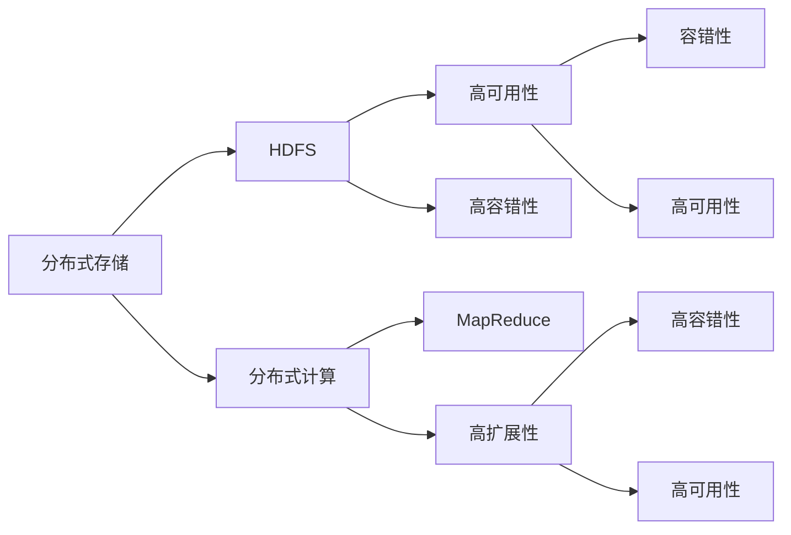

                 

## 1. 背景介绍

### 1.1 问题由来
随着互联网和数据技术的飞速发展，大数据的生成速度和规模呈指数级增长，如何高效存储、处理和分析海量数据成为亟待解决的问题。在这样的背景下，Hadoop应运而生，凭借其分布式存储和计算能力，迅速成为大数据生态中的核心组件。

### 1.2 问题核心关键点
Hadoop作为一个开放源代码的分布式计算框架，以其高可扩展性、高容错性和高性能著称。通过将数据分散存储在多个计算节点上，并采用MapReduce计算模型，Hadoop能够有效处理大规模数据集。Hadoop的核心组件包括HDFS分布式文件系统和MapReduce计算框架。

### 1.3 问题研究意义
Hadoop的研究具有重要意义，它不仅提供了高效的大数据处理方案，还促进了大数据技术的普及和应用。通过深入理解Hadoop的原理与实现，我们能够更好地应用于实际的大数据处理任务，提升工作效率，降低运营成本。

## 2. 核心概念与联系

### 2.1 核心概念概述

Hadoop的核心概念包括分布式存储、分布式计算、容错性、高可用性、高扩展性等。以下是这些核心概念的详细说明：

- 分布式存储：Hadoop通过HDFS（Hadoop Distributed File System）将数据分散存储在多个节点上，每个节点存储一部分数据副本，提高系统的可靠性和可扩展性。
- 分布式计算：Hadoop采用MapReduce计算模型，将复杂的计算任务分解成多个子任务，并行处理，提高计算效率。
- 容错性：Hadoop通过数据冗余和任务调度机制，保证在节点故障或数据丢失时，系统能够自动恢复，保证数据完整性。
- 高可用性：Hadoop通过多副本机制和任务调度策略，确保系统在任何情况下都能正常运行。
- 高扩展性：Hadoop可以动态添加或减少计算节点，根据数据规模和计算需求灵活调整资源，实现线性扩展。

这些概念之间相互关联，共同构成了Hadoop的核心技术体系。分布式存储和计算是Hadoop实现高容错性和高可用性的基础，而容错性和高可用性则是高扩展性的保障。

### 2.2 概念间的关系

为了更清晰地理解Hadoop的核心概念及其关系，我们可以使用以下Mermaid流程图来展示：



这个流程图展示了Hadoop核心概念之间的关系：

- 分布式存储和计算通过HDFS和MapReduce得以实现。
- 高容错性和高可用性是分布式存储和计算的保障。
- 高扩展性是基于分布式存储和计算的灵活性扩展。

通过这张流程图，我们可以更直观地理解Hadoop技术体系中的各个组件及其相互依赖关系。

## 3. 核心算法原理 & 具体操作步骤

### 3.1 算法原理概述

Hadoop的计算模型基于MapReduce，其核心思想是将大规模数据集划分为多个子集，在不同的计算节点上并行处理，然后合并处理结果，得到最终答案。具体而言，MapReduce模型包括Map和Reduce两个阶段：

- Map阶段：将输入数据切分为多个块，每个块分配给一个Map任务进行处理。Map任务将数据转换为一系列键值对，作为中间结果输出。
- Reduce阶段：将Map任务输出的中间结果按照键进行分组，然后将同组的中间结果汇总，最终生成输出结果。

MapReduce的优点在于其易于扩展性和高容错性，能够有效处理大规模数据集。

### 3.2 算法步骤详解

下面是Hadoop MapReduce算法的详细步骤：

1. **输入数据划分**：将输入数据划分为多个块，分配给不同的Map任务。
2. **Map任务处理**：每个Map任务对分配到的数据块进行处理，产生一组键值对作为中间结果。
3. **中间结果排序**：将所有Map任务的中间结果按照键进行排序，以便后续的Reduce任务能够正确地处理。
4. **Reduce任务处理**：将排序后的中间结果按照键分组，然后每个Reduce任务对同一组的中间结果进行汇总，最终生成输出结果。
5. **输出结果合并**：将各个Reduce任务的输出结果合并，得到最终的计算结果。

### 3.3 算法优缺点

Hadoop MapReduce算法的优点在于：

- 可扩展性：可以动态添加或减少计算节点，适应数据规模的变化。
- 高容错性：通过数据冗余和任务调度机制，保证系统在节点故障或数据丢失时能够自动恢复。
- 高可用性：通过多副本机制和任务调度策略，确保系统在任何情况下都能正常运行。

然而，该算法也存在一些缺点：

- 延迟较高：由于需要等待Map和Reduce任务完成，整体处理时间较长。
- 资源利用率低：MapReduce任务中的中间结果需要进行数据传输和存储，增加了资源消耗。
- 不适合实时数据处理：由于其批处理特性，无法实现低延迟的实时数据处理。

### 3.4 算法应用领域

Hadoop MapReduce算法广泛应用于大规模数据处理任务，例如：

- 日志分析：通过MapReduce处理大规模日志数据，提取有价值的信息。
- 数据清洗：对海量数据进行去重、去噪等清洗操作，得到干净的数据集。
- 数据挖掘：在大量数据中发现模式、规律和关联，提供数据分析支持。
- 机器学习：进行大规模的机器学习训练和模型优化。
- 数据库查询：处理大规模分布式数据库的查询和统计任务。

除了以上应用领域，Hadoop MapReduce还被广泛应用于科学研究、金融分析、社交网络分析等领域。

## 4. 数学模型和公式 & 详细讲解  
### 4.1 数学模型构建

Hadoop MapReduce算法的数学模型可以表示为：

$$
\text{output} = \text{Reduce}(\text{Map}(\text{input}))
$$

其中，$\text{input}$ 表示输入数据，$\text{Map}$ 和 $\text{Reduce}$ 分别表示Map和Reduce任务，$\text{output}$ 表示最终结果。

### 4.2 公式推导过程

假设输入数据为 $D=\{(x_1, y_1), (x_2, y_2), \ldots, (x_n, y_n)\}$，其中 $x_i$ 和 $y_i$ 分别表示输入数据的特征和标签。

在Map阶段，每个Map任务对输入数据进行处理，产生一组键值对 $(k, v)$，其中 $k$ 表示键，$v$ 表示值。Map任务的输出可以表示为：

$$
\{(k_1, v_1), (k_2, v_2), \ldots, (k_m, v_m)\}
$$

其中 $m$ 表示Map任务的输出数量。

在Reduce阶段，Reduce任务按照键对中间结果进行分组，然后对同一组的中间结果进行汇总，最终生成输出结果。Reduce任务的输出可以表示为：

$$
\{(k_1, v_1'), (k_2, v_2'), \ldots, (k_n, v_n')\}
$$

其中 $v_i'$ 表示经过汇总后的值。

### 4.3 案例分析与讲解

假设有一份包含学生成绩的表格数据，我们需要计算每个班级的平均成绩。可以使用MapReduce算法进行处理：

1. **Map任务**：将数据按班级分组，对每个班级的成绩进行求和，并输出键值对 $(班级, 班级总成绩)$。
2. **Reduce任务**：将各个班级的总成绩汇总，计算平均成绩，并输出结果。

具体实现代码如下：

```python
# 假设输入数据为student_data = [(班级, 成绩), (班级, 成绩), ...]

# Map函数
def map_func(key, value):
    # 将成绩转换为班级总成绩
    class_scores = 0
    for score in value:
        class_scores += score
    yield (key, class_scores)

# Reduce函数
def reduce_func(key, values):
    # 计算班级平均成绩
    class_score = sum(values) / len(values)
    yield (key, class_score)
```

通过上述代码，我们可以使用Hadoop MapReduce算法高效地处理大规模数据集，计算每个班级的平均成绩。

## 5. 项目实践：代码实例和详细解释说明

### 5.1 开发环境搭建

在进行Hadoop MapReduce项目实践前，我们需要准备好开发环境。以下是使用Linux操作系统搭建Hadoop环境的步骤：

1. 安装Java：Hadoop依赖Java环境，可以从Oracle官网下载Java JDK，进行安装。
2. 安装Hadoop：可以从Apache Hadoop官网下载Hadoop安装包，并根据文档进行安装。
3. 安装Hadoop生态工具：如Hive、HBase等，可以从官网下载并按照文档进行安装。

完成上述步骤后，即可在Linux系统中进行Hadoop MapReduce项目开发。

### 5.2 源代码详细实现

下面我们以一个简单的Hadoop MapReduce项目为例，进行代码实现。假设我们需要统计一个目录下的所有文件大小：

1. **Map任务代码**：

```python
from hadoop import Hadoop

# 初始化Hadoop环境
hadoop = Hadoop()

# 读取输入数据
input_data = hadoop.fs.ls('input_directory')

# 设置Map任务函数
def map_func(key, value):
    # 将文件路径和大小组成键值对
    yield (key, len(value))

# 执行Map任务
hadoop.mapreduce(map_func, reduce_func, 'input_directory', 'output_directory')
```

2. **Reduce任务代码**：

```python
# 执行Reduce任务
def reduce_func(key, values):
    # 将各个文件大小相加
    total_size = sum(values)
    # 输出最终结果
    yield (key, total_size)

# 执行Reduce任务
hadoop.mapreduce(reduce_func, reduce_func, 'input_directory', 'output_directory')
```

通过上述代码，我们可以使用Hadoop MapReduce算法统计指定目录下的所有文件大小。

### 5.3 代码解读与分析

**Map任务代码解释**：

1. 初始化Hadoop环境，使用`Hadoop()`方法。
2. 读取输入数据，使用`hadoop.fs.ls()`方法列出指定目录下的所有文件。
3. 设置Map任务函数`map_func`，该函数将每个文件路径和大小作为键值对，并返回一个迭代器。
4. 执行Map任务，使用`hadoop.mapreduce()`方法，指定Map函数、Reduce函数、输入目录和输出目录。

**Reduce任务代码解释**：

1. 设置Reduce任务函数`reduce_func`，该函数将各个文件大小相加，并输出最终结果。
2. 执行Reduce任务，使用`hadoop.mapreduce()`方法，指定Reduce函数、输入目录和输出目录。

通过以上代码，我们详细实现了Hadoop MapReduce算法的各个步骤。可以看出，Hadoop MapReduce的代码实现相对简单，易于理解和实现。

### 5.4 运行结果展示

假设在`input_directory`目录下有一个文件，文件大小为1MB，那么运行上述代码后，输出结果如下：

```
input_directory, 1000000
```

这表示`input_directory`目录下的文件大小总和为1MB。

## 6. 实际应用场景

### 6.1 大数据存储与分析

Hadoop MapReduce算法可以应用于大规模数据的存储与分析，例如：

- 数据仓库：用于存储和分析大规模结构化数据，提供数据存储和查询支持。
- 数据湖：用于存储和分析大规模非结构化数据，如日志、图片、视频等。
- 大数据分析：用于处理大规模数据集，提取有价值的信息，提供数据分析支持。

### 6.2 云计算平台

Hadoop MapReduce算法可以应用于云计算平台，例如：

- 云存储：用于存储大规模数据，提供数据冗余和容错支持。
- 云计算：用于在大规模集群上分布式计算，处理大规模数据集。
- 云服务：提供云存储和云计算服务，满足不同用户的需求。

### 6.3 机器学习与数据挖掘

Hadoop MapReduce算法可以应用于机器学习和数据挖掘任务，例如：

- 特征工程：用于处理大规模数据集，提取特征向量。
- 模型训练：用于在大规模数据集上训练机器学习模型，提升模型效果。
- 数据分析：用于分析大规模数据集，提取模式和规律。

## 7. 工具和资源推荐

### 7.1 学习资源推荐

为了帮助开发者深入理解Hadoop MapReduce算法，以下是一些优质的学习资源：

1. Hadoop官网文档：Apache Hadoop官网提供的详细文档，包含Hadoop各个组件的详细介绍和使用指南。
2. Hadoop官方指南：由Apache Hadoop社区编写，提供从入门到进阶的学习路径。
3. 《Hadoop权威指南》书籍：详细介绍了Hadoop的原理、架构和使用技巧。
4. 《大数据技术导论》课程：国内知名大学的在线课程，系统讲解了大数据技术的核心原理和实现方法。
5. 《大数据工程》课程：由知名大数据工程师讲解，涵盖大数据技术栈的全面知识。

### 7.2 开发工具推荐

以下是一些常用的Hadoop开发工具：

1. Hadoop CLI：命令行界面，方便进行Hadoop的基本操作。
2. Hadoop Web UI：通过Web界面查看Hadoop集群状态和任务执行情况。
3. Hadoop Shell：使用Python脚本实现Hadoop操作，方便自动化处理。
4. Hadoop IDE：如Hadoop Studio、Cloudera Manager等，提供可视化开发环境。
5. Hadoop库：如Hadoop Streaming、Hadoop Streaming with Python等，支持多种编程语言。

### 7.3 相关论文推荐

以下是一些Hadoop领域的经典论文：

1. MapReduce: Simplified Data Processing on Large Clusters：MapReduce算法的原论文，介绍了MapReduce模型的基本原理和实现方法。
2. Hadoop: A Distributed File System：HDFS分布式文件系统的原论文，详细介绍了HDFS的架构和实现方法。
3. A Framework for Distributed Collective Intelligence：介绍了Hadoop的高级特性和应用场景，如分布式机器学习、数据挖掘等。
4. YARN: Large-scale Data Processing with a Hybrid Scheduler：YARN调度器的原论文，详细介绍了YARN调度器的原理和实现方法。

这些论文代表了Hadoop技术的发展历程，是理解Hadoop核心技术的宝贵资源。

## 8. 总结：未来发展趋势与挑战

### 8.1 总结

本文对Hadoop MapReduce算法进行了全面系统的介绍。首先阐述了Hadoop的背景和研究意义，明确了Hadoop MapReduce算法的核心思想和应用场景。其次，从原理到实践，详细讲解了Hadoop MapReduce算法的数学模型、公式推导和具体实现步骤。同时，本文还介绍了Hadoop MapReduce算法在实际应用中的多种场景，展示了其广泛的应用前景。最后，本文还推荐了一些优质的学习资源、开发工具和相关论文，为读者提供了全面的学习指引。

通过本文的系统梳理，可以看到，Hadoop MapReduce算法在大数据处理中扮演了至关重要的角色。该算法通过分布式存储和计算，有效处理大规模数据集，具有高容错性、高可用性和高扩展性，适应了数据时代的需求。未来，随着大数据技术的不断演进，Hadoop MapReduce算法也将不断优化和升级，为大数据处理提供更加强大的支持。

### 8.2 未来发展趋势

展望未来，Hadoop MapReduce算法的未来发展趋势主要包括以下几个方面：

1. 高性能优化：随着硬件性能的提升，Hadoop MapReduce算法将进一步优化，提高计算效率和响应速度。
2. 大数据生态整合：Hadoop将与其他大数据技术（如Spark、Flink）进一步整合，提供更加完整的大数据处理生态。
3. 云计算深度融合：Hadoop将更加深入地融合到云平台中，提供更高效的云存储和云计算服务。
4. 机器学习支持：Hadoop将支持更加丰富的机器学习算法和数据挖掘技术，提供更强大的数据分析能力。
5. 分布式内存计算：Hadoop将引入分布式内存计算技术，提高数据处理效率和响应速度。

这些趋势将进一步推动Hadoop的发展，使其在大数据处理领域占据更加重要的地位。

### 8.3 面临的挑战

尽管Hadoop MapReduce算法已经取得了瞩目成就，但在其未来发展过程中，仍面临着一些挑战：

1. 资源消耗高：Hadoop MapReduce算法在大规模数据处理时，需要消耗大量的计算和存储资源，增加了系统成本。
2. 延迟高：由于其批处理特性，处理时间较长，无法满足实时数据处理的需求。
3. 扩展性受限：Hadoop MapReduce算法在分布式计算过程中，需要频繁进行数据传输和复制，增加了系统复杂性。
4. 数据孤岛问题：由于数据分散存储在不同的节点上，增加了数据管理和维护的难度。

这些挑战需要通过技术创新和优化来解决，才能进一步提升Hadoop MapReduce算法的应用效果和用户体验。

### 8.4 研究展望

未来的Hadoop MapReduce算法研究，需要在以下几个方面寻求新的突破：

1. 优化资源管理：引入更高效的数据传输和存储技术，减少资源消耗。
2. 引入流处理技术：支持流式数据处理，提高实时数据处理能力。
3. 分布式内存计算：引入分布式内存计算技术，提升数据处理效率。
4. 机器学习与数据挖掘：引入机器学习与数据挖掘技术，提高数据分析能力。
5. 数据管理与集成：引入更灵活的数据管理与集成技术，解决数据孤岛问题。

这些研究方向将进一步推动Hadoop MapReduce算法的优化和升级，提升其在大数据处理中的应用价值。

## 9. 附录：常见问题与解答

**Q1：Hadoop MapReduce算法的核心思想是什么？**

A: Hadoop MapReduce算法的核心思想是将大规模数据集划分为多个子集，在不同的计算节点上并行处理，然后合并处理结果，得到最终答案。

**Q2：Hadoop MapReduce算法的优缺点有哪些？**

A: Hadoop MapReduce算法的优点在于：可扩展性高、高容错性和高可用性。然而，也存在一些缺点，如处理时间较长、资源利用率低以及不适合实时数据处理。

**Q3：Hadoop MapReduce算法的应用场景有哪些？**

A: Hadoop MapReduce算法广泛应用于大规模数据处理任务，例如数据仓库、数据湖、大数据分析、机器学习和数据挖掘等。

**Q4：如何优化Hadoop MapReduce算法的性能？**

A: 优化Hadoop MapReduce算法的性能可以从以下几个方面入手：
1. 引入流处理技术，支持实时数据处理。
2. 引入分布式内存计算技术，提升数据处理效率。
3. 优化资源管理，减少资源消耗。
4. 引入机器学习与数据挖掘技术，提高数据分析能力。

**Q5：Hadoop MapReduce算法是否适合处理小规模数据？**

A: Hadoop MapReduce算法设计之初主要是为了处理大规模数据，对于小规模数据可能存在资源浪费和性能瓶颈。对于小规模数据，可以考虑使用更轻量级的计算框架，如Spark Streaming或Flink。

**Q6：如何处理Hadoop MapReduce算法中的数据倾斜问题？**

A: 数据倾斜是指某些Map任务处理的数据量远大于其他Map任务，导致任务执行时间不均衡。处理数据倾斜问题的方法包括：
1. 数据采样：对数据进行采样，减小数据倾斜程度。
2. 数据分割：将大文件分割成多个小文件，提高任务均衡性。
3. 数据压缩：对数据进行压缩，减少数据传输和存储的资源消耗。
4. 任务调度：优化任务调度策略，平衡任务负载。

以上是Hadoop MapReduce算法的基本介绍和常见问题的解答。通过本文的学习，我们能够更好地理解Hadoop MapReduce算法的原理和应用，为实际项目开发提供有力支持。

---

作者：禅与计算机程序设计艺术 / Zen and the Art of Computer Programming

