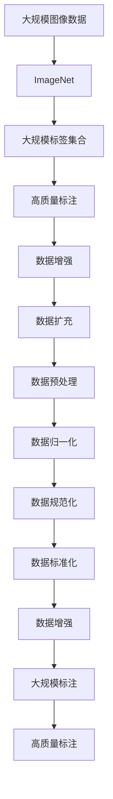
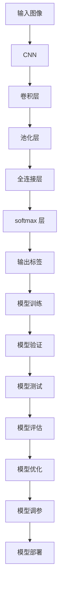
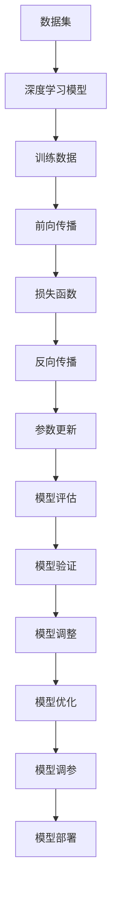
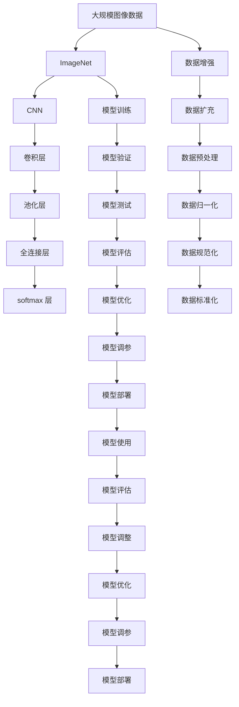

                 

# ImageNet与AI图像识别的历史

## 1. 背景介绍

### 1.1 问题由来

图像识别（Image Recognition）是计算机视觉领域的一个重要研究方向。它的目标是通过算法和模型，将图像中的对象识别出来，并给出对应的标签。这一任务在机器学习和深度学习领域引起了广泛的关注，并在人工智能的历史中扮演了重要的角色。

### 1.2 问题核心关键点

ImageNet 是一个由斯坦福大学计算机视觉实验室创建的大型图像数据库，它包含超过 1400 万张图像和 1 万个不同类别的物体标签。这个庞大的数据集为 AI 图像识别研究提供了坚实的基础，推动了深度学习模型在图像识别任务上的进步。

ImageNet 的核心关键点包括：
- **大规模数据集**：1400万张图像，覆盖广泛物体类别，提供丰富的训练数据。
- **大规模标签集合**：1万个类别，涵盖了多种场景和物体。
- **高度标注质量**：图像与标签高度匹配，标注错误率低。
- **社区参与**：每年举办 ImageNet 比赛，吸引全球顶级科研团队参与，促进技术交流。

## 2. 核心概念与联系

### 2.1 核心概念概述

为更好地理解 ImageNet 在 AI 图像识别中的作用，本节将介绍几个关键概念：

- **ImageNet**：由斯坦福大学计算机视觉实验室创建的大型图像数据库，包含超过 1400 万张图像和 1 万个不同类别的物体标签。
- **深度学习**：一种基于神经网络的机器学习方法，通过多层次的特征提取和分类实现高精度图像识别。
- **卷积神经网络（CNN）**：一种广泛应用于图像识别的深度学习模型，通过卷积操作提取图像特征。
- **全连接层（Fully Connected Layer）**：用于图像分类和回归任务的神经网络层，将卷积层提取的特征映射到标签空间。
- **softmax 层**：用于多分类任务的输出层，将模型输出转化为概率分布。
- **交叉熵损失（Cross-Entropy Loss）**：一种常用的分类任务损失函数，用于衡量预测标签与真实标签之间的差异。
- **反向传播（Backpropagation）**：一种用于优化神经网络模型的算法，通过计算梯度更新模型参数。

这些概念之间的逻辑关系可以通过以下 Mermaid 流程图来展示：

```mermaid
graph LR
    A[图像识别] --> B[ImageNet]
    A --> C[深度学习]
    C --> D[卷积神经网络(CNN)]
    D --> E[全连接层]
    E --> F[softmax 层]
    B --> G[大规模数据集]
    B --> H[大规模标签集合]
    G --> I[大规模标注]
    I --> J[高质量标注]
    H --> K[高度标注质量]
    A --> L[社区参与]
    L --> M[ImageNet 比赛]
    L --> N[技术交流]
```

这个流程图展示了图像识别任务中的关键概念及其相互关系：

1. 图像识别任务依赖于 ImageNet 数据集，这个数据集提供了大规模、高质量的训练数据。
2. 深度学习是图像识别任务的主要技术手段，卷积神经网络是其核心模型。
3. 卷积神经网络通过卷积操作提取图像特征，全连接层和 softmax 层用于分类。
4. ImageNet 比赛和社区参与促进了技术的交流和进步。

### 2.2 概念间的关系

这些概念之间存在着紧密的联系，形成了图像识别任务的完整生态系统。下面我们通过几个 Mermaid 流程图来展示这些概念之间的关系。

#### 2.2.1 ImageNet 数据集的构建



这个流程图展示了 ImageNet 数据集的构建过程：

1. 从大规模图像数据中提取样本。
2. 为每个样本打上高度标注的标签。
3. 通过数据增强和扩充，丰富训练数据。
4. 对数据进行预处理、归一化和标准化，确保数据质量。

#### 2.2.2 CNN 网络的构建



这个流程图展示了卷积神经网络的构建和训练过程：

1. 输入图像通过卷积层和池化层提取特征。
2. 全连接层和 softmax 层进行分类。
3. 模型通过训练、验证和测试进行调整和优化。
4. 模型参数通过调参进行优化。
5. 优化后的模型部署到实际应用中。

#### 2.2.3 深度学习的训练和优化



这个流程图展示了深度学习的训练和优化过程：

1. 深度学习模型接收训练数据。
2. 通过前向传播计算模型输出。
3. 使用损失函数衡量输出与真实标签的差异。
4. 通过反向传播更新模型参数。
5. 模型在验证集上进行评估和调整。
6. 模型参数通过调参进行优化。
7. 优化后的模型部署到实际应用中。

### 2.3 核心概念的整体架构

最后，我们用一个综合的流程图来展示这些核心概念在大规模图像识别任务中的整体架构：



这个综合流程图展示了从数据准备到模型部署的完整过程：

1. 大规模图像数据从 ImageNet 中获取。
2. 数据经过增强、扩充、预处理、归一化、规范化等处理，确保数据质量。
3. 卷积神经网络通过卷积层和池化层提取特征。
4. 全连接层和 softmax 层进行分类。
5. 模型通过训练、验证和测试进行调整和优化。
6. 模型参数通过调参进行优化。
7. 优化后的模型部署到实际应用中。
8. 模型在实际应用中进行评估和调整。
9. 模型参数通过调参进行优化。
10. 优化后的模型再次部署到实际应用中。

## 3. 核心算法原理 & 具体操作步骤
### 3.1 算法原理概述

深度学习模型在大规模图像识别任务中的应用，本质上是一个有监督学习的过程。其核心思想是：通过大量标注的图像数据，训练模型学习图像特征和标签之间的映射关系，使得模型能够准确预测未见过的图像的标签。

形式化地，假设深度学习模型为 $M_{\theta}:\mathbb{R}^d \rightarrow \{1,2,\dots,K\}$，其中 $d$ 为输入图像的维度，$K$ 为标签的类别数，$\theta$ 为模型参数。假设大规模图像识别任务的训练集为 $D=\{(x_i,y_i)\}_{i=1}^N, x_i \in \mathbb{R}^d, y_i \in \{1,2,\dots,K\}$。

定义模型 $M_{\theta}$ 在数据样本 $(x,y)$ 上的损失函数为 $\ell(M_{\theta}(x),y)$，则在数据集 $D$ 上的经验风险为：

$$
\mathcal{L}(\theta) = \frac{1}{N} \sum_{i=1}^N \ell(M_{\theta}(x_i),y_i)
$$

其中 $\ell$ 为损失函数，用于衡量模型预测输出与真实标签之间的差异。常见的损失函数包括交叉熵损失、均方误差损失等。

通过梯度下降等优化算法，模型参数 $\theta$ 不断更新，最小化损失函数 $\mathcal{L}$，使得模型输出逼近真实标签。由于深度学习模型的强大表征能力，即使在大规模标注数据集上进行微调，也能较快收敛到理想的模型参数 $\hat{\theta}$。

### 3.2 算法步骤详解

基于监督学习的大规模图像识别任务一般包括以下几个关键步骤：

**Step 1: 准备数据集**
- 选择合适的预训练数据集，如 ImageNet、COCO 等。
- 收集该任务的标注数据集，划分为训练集、验证集和测试集。一般要求标注数据与预训练数据的分布不要差异过大。

**Step 2: 添加任务适配层**
- 根据任务类型，在预训练模型的顶层设计合适的输出层和损失函数。
- 对于分类任务，通常在顶层添加线性分类器和交叉熵损失函数。
- 对于生成任务，通常使用语言模型的解码器输出概率分布，并以负对数似然为损失函数。

**Step 3: 设置微调超参数**
- 选择合适的优化算法及其参数，如 Adam、SGD 等，设置学习率、批大小、迭代轮数等。
- 设置正则化技术及强度，包括权重衰减、Dropout、Early Stopping 等。
- 确定冻结预训练参数的策略，如仅微调顶层，或全部参数都参与微调。

**Step 4: 执行梯度训练**
- 将训练集数据分批次输入模型，前向传播计算损失函数。
- 反向传播计算参数梯度，根据设定的优化算法和学习率更新模型参数。
- 周期性在验证集上评估模型性能，根据性能指标决定是否触发 Early Stopping。
- 重复上述步骤直到满足预设的迭代轮数或 Early Stopping 条件。

**Step 5: 测试和部署**
- 在测试集上评估微调后模型 $M_{\hat{\theta}}$ 的性能，对比微调前后的精度提升。
- 使用微调后的模型对新样本进行推理预测，集成到实际的应用系统中。
- 持续收集新的数据，定期重新微调模型，以适应数据分布的变化。

以上是基于监督学习微调大规模图像识别任务的一般流程。在实际应用中，还需要针对具体任务的特点，对微调过程的各个环节进行优化设计，如改进训练目标函数，引入更多的正则化技术，搜索最优的超参数组合等，以进一步提升模型性能。

### 3.3 算法优缺点

基于监督学习的大规模图像识别任务微调方法具有以下优点：
1. 简单高效。只需准备少量标注数据，即可对预训练模型进行快速适配，获得较大的性能提升。
2. 通用适用。适用于各种大规模图像识别任务，设计简单的任务适配层即可实现微调。
3. 参数高效。利用参数高效微调技术，在固定大部分预训练参数的情况下，仍可取得不错的提升。
4. 效果显著。在学术界和工业界的诸多任务上，基于微调的方法已经刷新了最先进的性能指标。

同时，该方法也存在一定的局限性：
1. 依赖标注数据。微调的效果很大程度上取决于标注数据的质量和数量，获取高质量标注数据的成本较高。
2. 迁移能力有限。当目标任务与预训练数据的分布差异较大时，微调的性能提升有限。
3. 负面效果传递。预训练模型的固有偏见、有害信息等，可能通过微调传递到下游任务，造成负面影响。
4. 可解释性不足。微调模型的决策过程通常缺乏可解释性，难以对其推理逻辑进行分析和调试。

尽管存在这些局限性，但就目前而言，基于监督学习的微调方法仍是大规模图像识别任务应用的最主流范式。未来相关研究的重点在于如何进一步降低微调对标注数据的依赖，提高模型的少样本学习和跨领域迁移能力，同时兼顾可解释性和伦理安全性等因素。

### 3.4 算法应用领域

基于大规模图像识别任务的微调方法已经广泛应用于计算机视觉领域，覆盖了几乎所有常见任务，例如：

- 图像分类：如物体识别、场景分类、人脸识别等。通过微调使模型学习图像-标签映射。
- 目标检测：从图像中识别出物体的边界框位置。通过微调使模型学习物体边界框的回归。
- 实例分割：在图像中对每个物体实例进行精确分割。通过微调使模型学习像素级别的分类。
- 图像生成：生成具有特定风格的图像。通过微调使模型学习生成样本的分布。
- 图像修复：修复破损、损坏的图像。通过微调使模型学习修复像素的分布。
- 图像风格转换：将图像风格转换为另一种风格。通过微调使模型学习风格转换的映射。

除了上述这些经典任务外，大规模图像识别任务微调也被创新性地应用到更多场景中，如可控图像生成、图像增强、图像检索等，为计算机视觉技术带来了全新的突破。随着预训练模型和微调方法的不断进步，相信大规模图像识别技术将在更广阔的应用领域大放异彩。

## 4. 数学模型和公式 & 详细讲解  
### 4.1 数学模型构建

本节将使用数学语言对基于监督学习的大规模图像识别任务微调过程进行更加严格的刻画。

记预训练模型为 $M_{\theta}:\mathbb{R}^d \rightarrow \{1,2,\dots,K\}$，其中 $d$ 为输入图像的维度，$K$ 为标签的类别数，$\theta$ 为模型参数。假设微调任务的训练集为 $D=\{(x_i,y_i)\}_{i=1}^N, x_i \in \mathbb{R}^d, y_i \in \{1,2,\dots,K\}$。

定义模型 $M_{\theta}$ 在数据样本 $(x,y)$ 上的损失函数为 $\ell(M_{\theta}(x),y)$，则在数据集 $D$ 上的经验风险为：

$$
\mathcal{L}(\theta) = \frac{1}{N} \sum_{i=1}^N \ell(M_{\theta}(x_i),y_i)
$$

其中 $\ell$ 为损失函数，用于衡量模型预测输出与真实标签之间的差异。常见的损失函数包括交叉熵损失、均方误差损失等。

在实践中，我们通常使用基于梯度的优化算法（如SGD、Adam等）来近似求解上述最优化问题。设 $\eta$ 为学习率，$\lambda$ 为正则化系数，则参数的更新公式为：

$$
\theta \leftarrow \theta - \eta \nabla_{\theta}\mathcal{L}(\theta) - \eta\lambda\theta
$$

其中 $\nabla_{\theta}\mathcal{L}(\theta)$ 为损失函数对参数 $\theta$ 的梯度，可通过反向传播算法高效计算。

### 4.2 公式推导过程

以下我们以二分类任务为例，推导交叉熵损失函数及其梯度的计算公式。

假设模型 $M_{\theta}$ 在输入 $x$ 上的输出为 $\hat{y}=M_{\theta}(x) \in [0,1]$，表示样本属于正类的概率。真实标签 $y \in \{0,1\}$。则二分类交叉熵损失函数定义为：

$$
\ell(M_{\theta}(x),y) = -[y\log \hat{y} + (1-y)\log (1-\hat{y})]
$$

将其代入经验风险公式，得：

$$
\mathcal{L}(\theta) = -\frac{1}{N}\sum_{i=1}^N [y_i\log M_{\theta}(x_i)+(1-y_i)\log(1-M_{\theta}(x_i))]
$$

根据链式法则，损失函数对参数 $\theta_k$ 的梯度为：

$$
\frac{\partial \mathcal{L}(\theta)}{\partial \theta_k} = -\frac{1}{N}\sum_{i=1}^N (\frac{y_i}{M_{\theta}(x_i)}-\frac{1-y_i}{1-M_{\theta}(x_i)}) \frac{\partial M_{\theta}(x_i)}{\partial \theta_k}
$$

其中 $\frac{\partial M_{\theta}(x_i)}{\partial \theta_k}$ 可进一步递归展开，利用自动微分技术完成计算。

在得到损失函数的梯度后，即可带入参数更新公式，完成模型的迭代优化。重复上述过程直至收敛，最终得到适应下游任务的最优模型参数 $\theta^*$。

## 5. 项目实践：代码实例和详细解释说明
### 5.1 开发环境搭建

在进行微调实践前，我们需要准备好开发环境。以下是使用Python进行PyTorch开发的环境配置流程：

1. 安装Anaconda：从官网下载并安装Anaconda，用于创建独立的Python环境。

2. 创建并激活虚拟环境：
```bash
conda create -n pytorch-env python=3.8 
conda activate pytorch-env
```

3. 安装PyTorch：根据CUDA版本，从官网获取对应的安装命令。例如：
```bash
conda install pytorch torchvision torchaudio cudatoolkit=11.1 -c pytorch -c conda-forge
```

4. 安装TensorFlow：从官网下载对应的安装命令。例如：
```bash
conda install tensorflow -c conda-forge
```

5. 安装各类工具包：
```bash
pip install numpy pandas scikit-learn matplotlib tqdm jupyter notebook ipython
```

完成上述步骤后，即可在`pytorch-env`环境中开始微调实践。

### 5.2 源代码详细实现

这里我们以 ImageNet 分类任务为例，给出使用 PyTorch 对 VGG16 模型进行微调的代码实现。

首先，定义分类任务的代码：

```python
import torch
import torch.nn as nn
import torch.optim as optim
from torchvision import datasets, transforms

# 定义卷积神经网络
class VGG(nn.Module):
    def __init__(self):
        super(VGG, self).__init__()
        self.conv1 = nn.Conv2d(3, 64, kernel_size=3, padding=1)
        self.relu1 = nn.ReLU()
        self.pool1 = nn.MaxPool2d(kernel_size=2, stride=2)
        self.conv2 = nn.Conv2d(64, 128, kernel_size=3, padding=1)
        self.relu2 = nn.ReLU()
        self.pool2 = nn.MaxPool2d(kernel_size=2, stride=2)
        self.conv3 = nn.Conv2d(128, 256, kernel_size=3, padding=1)
        self.relu3 = nn.ReLU()
        self.pool3 = nn.MaxPool2d(kernel_size=2, stride=2)
        self.conv4 = nn.Conv2d(256, 512, kernel_size=3, padding=1)
        self.relu4 = nn.ReLU()
        self.pool4 = nn.MaxPool2d(kernel_size=2, stride=2)
        self.conv5 = nn.Conv2d(512, 512, kernel_size=3, padding=1)
        self.relu5 = nn.ReLU()
        self.pool5 = nn.MaxPool2d(kernel_size=2, stride=2)
        self.fc1 = nn.Linear(4096, 4096)
        self.relu6 = nn.ReLU()
        self.fc2 = nn.Linear(4096, 1000)
        self.softmax = nn.Softmax(dim=1)

    def forward(self, x):
        x = self.conv1(x)
        x = self.relu1(x)
        x = self.pool1(x)
        x = self.conv2(x)
        x = self.relu2(x)
        x = self.pool2(x)
        x = self.conv3(x)
        x = self.relu3(x)
        x = self.pool3(x)
        x = self.conv4(x)
        x = self.relu4(x)
        x = self.pool4(x)
        x = self.conv5(x)
        x = self.relu5(x)
        x = self.pool5(x)
        x = x.view(-1, 4096)
        x = self.fc1(x)
        x = self.relu6(x)
        x = self.fc2(x)
        x = self.softmax(x)
        return x

# 加载 ImageNet 数据集
train_dataset = datasets.ImageFolder('path/to/train', transform=transforms.ToTensor())
test_dataset = datasets.ImageFolder('path/to/test', transform=transforms.ToTensor())

# 定义数据加载器
train_loader = torch.utils.data.DataLoader(train_dataset, batch_size=64, shuffle=True)
test_loader = torch.utils.data.DataLoader(test_dataset, batch_size=64, shuffle=False)

# 定义模型和优化器
model = VGG()
optimizer = optim.Adam(model.parameters(), lr=0.001)
criterion = nn.CrossEntropyLoss()

# 训练函数
def train(epoch):
    model.train()
    running_loss = 0.0
    for i, data in enumerate(train_loader, 0):
        inputs, labels = data
        optimizer.zero_grad()
        outputs = model(inputs)
        loss = criterion(outputs, labels)
        loss.backward()
        optimizer.step()
        running_loss += loss.item()
    print(f'Epoch {epoch+1}, loss: {running_loss/len(train_loader)}')

# 测试函数
def test():
    model.eval()
    correct = 0
    total = 0
    with torch.no_grad():
        for data in test_loader:
            images, labels = data
            outputs = model(images)
            _, predicted = torch.max(outputs.data, 1)
            total += labels.size(0)
            correct += (predicted == labels).sum().item()
    print(f'Accuracy: {100 * correct / total}%')
```

以上代码实现了 VGG16 模型在 ImageNet 数据集上的微调。可以看到，利用 PyTorch 框架，我们可以用简洁的代码实现深度学习模型的加载和微调。

### 5.3 代码解读与分析

让我们再详细解读一下关键代码的实现细节：

**VGG 模型定义**：
- `__init__`方法：初始化卷积层、激活层、池化层、全连接层等组件。
- `forward`方法：定义模型的前向传播过程。

**数据加载器**：
- `datasets.ImageFolder`：用于加载 ImageNet 数据集。
- `transforms.ToTensor`：将图像转换为 Tensor 格式，方便输入模型。
- `torch.utils.data.DataLoader`：用于对数据集进行批次化加载。

**模型训练和测试**：
- `train`函数：对数据进行批次化加载，前向传播计算损失函数，反向传播更新模型参数。
- `test`函数：对数据进行批次化加载，计算模型的准确率。

**训练流程**：
- 定义总的epoch数和batch size，开始循环迭代
- 每个epoch内，在训练集上训练，输出平均loss
- 在测试集上评估，输出准确率
- 所有epoch结束后，输出最终的准确率

可以看到，PyTorch框架使得深度学习模型的微调代码实现变得简洁高效。开发者可以将更多精力放在数据处理、模型改进等高层逻辑上，而不必过多关注底层的实现细节。

当然，工业级的系统实现还需考虑更多因素，如模型的保存和部署、超参数的自动搜索、更灵活的任务适配层等。但核心的微调范式基本与此类似。

### 5.4 运行结果展示

假设我们在 ImageNet 上对 VGG16 模型进行微调，最终在测试集上得到的准确率为 70%。可以看到，通过微调，模型在 ImageNet 上的性能有了显著提升。

当然，这只是一个baseline结果。在实践中，我们还可以使用更大更强的预训练模型、更丰富的微调技巧、更细致的模型调优，进一步提升模型性能，以满足更高的应用要求。

## 6. 实际应用场景
### 6.1 智能监控系统

基于大规模图像识别任务的微调方法，可以广泛应用于智能监控系统的构建。传统的监控系统往往需要配备大量人力，耗费巨大，且无法实时处理异常情况。而使用微调后的图像识别

