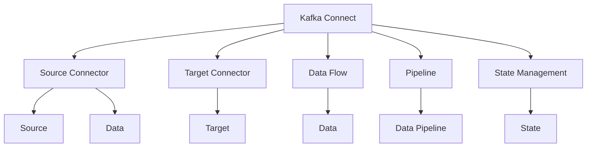
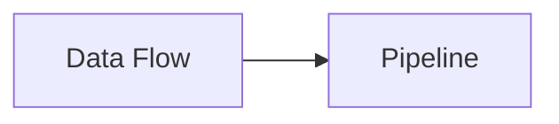

                 

# Kafka Connect原理与代码实例讲解

> 关键词：Kafka, Connect,源连接器,目标连接器,数据流,数据管线,可扩展性,容错性,状态管理

## 1. 背景介绍

### 1.1 问题由来
在现代大数据系统中，数据处理和存储的复杂性和规模不断增加。传统的数据处理流程需要将数据从源系统抽取、转换和加载到目标系统，这在操作上存在诸多复杂性。为了简化这一过程，Kafka Connect 应运而生。

Kafka Connect 是一个开源的流数据处理工具，它允许用户将数据从一个系统流传输到另一个系统。它支持多种数据源和目标，可以处理大规模的数据流，并且具有高度的可扩展性和容错性。Kafka Connect 已经成为众多数据流处理系统中不可或缺的一部分，广泛应用于大数据、实时数据处理、事件驱动架构等场景。

### 1.2 问题核心关键点
Kafka Connect 的核心问题在于如何构建一个高效、可靠且易于维护的数据流处理系统，它包括以下关键点：

- **源连接器(Source Connector)**：用于从各种数据源（如数据库、文件系统、消息队列等）读取数据。
- **目标连接器(Target Connector)**：用于将数据写入各种目标系统（如数据库、文件系统、消息队列等）。
- **数据流和数据管线**：通过连接器之间的数据流动，实现数据的抽取、转换和加载。
- **可扩展性和容错性**：保证系统能够处理大规模数据流，并且能够在故障发生时保持数据的完整性和一致性。
- **状态管理**：维护连接器的运行状态，确保数据处理的有序性和连续性。

Kafka Connect 为解决这些问题提供了一个高效、可扩展的解决方案，通过提供标准化的接口和工具，简化了数据流处理的复杂度，提升了系统的可靠性和可维护性。

## 2. 核心概念与联系

### 2.1 核心概念概述

为了更好地理解 Kafka Connect 的核心概念，本节将介绍几个关键的概念及其相互关系：

- **Kafka Connect**：Kafka Connect 是一个开源的数据流处理工具，它提供了一个标准的框架，用于构建数据连接器（Connector），实现数据的抽取、转换和加载。
- **连接器(Connector)**：连接器是 Kafka Connect 的基本单元，它用于从源系统读取数据或将数据写入目标系统。连接器可以分为源连接器(Source Connector)和目标连接器(Target Connector)两种类型。
- **数据流(Data Flow)**：通过连接器之间的数据流动，实现数据的抽取、转换和加载。
- **数据管线(Pipeline)**：数据管线是由多个连接器组成的流水线，用于描述数据从源到目标的完整处理流程。
- **状态管理(State Management)**：状态管理用于维护连接器的运行状态，包括连接器的配置状态、任务状态和分区状态等，确保数据处理的有序性和连续性。

这些核心概念之间的关系可以用以下 Mermaid 流程图表示：



这个流程图展示了 Kafka Connect 的主要组件及其相互关系。Kafka Connect 通过连接器读取数据流（Source Connector），将数据转换为标准格式，然后通过数据管线（Data Flow）传输到目标连接器（Target Connector），最终将数据写入目标系统（Target）。同时，状态管理（State Management）负责维护连接器的状态，确保数据处理的正确性和连续性。

### 2.2 概念间的关系

这些核心概念之间存在着紧密的联系，形成了 Kafka Connect 完整的数据流处理生态系统。下面我通过几个 Mermaid 流程图来展示这些概念之间的关系。

#### 2.2.1 Kafka Connect的整体架构


这个流程图展示了 Kafka Connect 的整体架构，包括连接器、数据流、数据管线和状态管理四个核心部分，以及它们之间的相互关系。

#### 2.2.2 连接器与数据管线


这个流程图展示了连接器与数据管线之间的关系。源连接器从数据源读取数据，并将其转换为标准格式，然后通过数据管线传输到目标连接器，最终将数据写入目标系统。

#### 2.2.3 数据流与数据管线



这个流程图展示了数据流与数据管线之间的关系。数据管线是由多个数据流组成的流水线，用于描述数据从源到目标的完整处理流程。

#### 2.2.4 状态管理


这个流程图展示了状态管理与数据管线和连接器之间的关系。状态管理用于维护连接器的运行状态，包括连接器的配置状态、任务状态和分区状态等，确保数据处理的有序性和连续性。

### 2.3 核心概念的整体架构

最后，我们用一个综合的流程图来展示 Kafka Connect 的核心概念及其相互关系：


这个综合流程图展示了 Kafka Connect 从源到目标的完整数据流处理过程，包括连接器、数据流、数据管线和状态管理四个核心部分，以及它们之间的相互关系。

## 3. 核心算法原理 & 具体操作步骤

### 3.1 算法原理概述

Kafka Connect 的核心算法原理主要包括以下几个方面：

- **连接器(Connector)的设计与实现**：连接器是 Kafka Connect 的基本单元，它负责从源系统读取数据或将数据写入目标系统。连接器通常由源连接器(Source Connector)和目标连接器(Target Connector)组成。
- **数据流(Data Flow)的处理与传输**：数据流是连接器之间的数据流动，用于实现数据的抽取、转换和加载。数据流在 Kafka Connect 中是通过管道(Pipeline)来实现的。
- **状态管理(State Management)**：状态管理用于维护连接器的运行状态，包括连接器的配置状态、任务状态和分区状态等，确保数据处理的有序性和连续性。

这些算法原理共同构成了 Kafka Connect 的核心工作机制，使得 Kafka Connect 能够高效、可靠地处理大规模数据流。

### 3.2 算法步骤详解

Kafka Connect 的核心操作步骤包括以下几个方面：

1. **配置连接器**：配置源连接器和目标连接器的基本信息，包括数据源和目标系统的地址、端口、认证信息等。
2. **连接器启动**：启动连接器，连接器会通过查询配置信息来确定数据源和目标系统的地址、端口等。
3. **数据抽取与转换**：源连接器从数据源中读取数据，并将其转换为标准格式，然后通过数据管线传输到目标连接器。
4. **数据传输与写入**：目标连接器将数据写入目标系统，并将结果反馈给源连接器。
5. **状态管理**：状态管理维护连接器的运行状态，包括连接器的配置状态、任务状态和分区状态等，确保数据处理的有序性和连续性。

### 3.3 算法优缺点

Kafka Connect 具有以下优点：

- **高效性**：Kafka Connect 基于 Apache Kafka 的高效数据传输机制，可以处理大规模的数据流，并且具有良好的扩展性。
- **可靠性**：Kafka Connect 使用故障转移和数据冗余等技术，确保数据在故障发生时能够保持完整性和一致性。
- **灵活性**：Kafka Connect 支持多种数据源和目标，可以适应不同的业务需求和数据处理场景。

同时，Kafka Connect 也存在以下缺点：

- **学习成本较高**：Kafka Connect 作为一个高度模块化和复杂的数据流处理工具，需要一定的学习成本和技术积累。
- **性能瓶颈**：在大规模数据处理时，Kafka Connect 的性能可能会受到系统资源和网络带宽的限制。
- **开发复杂**：连接器的开发和调试需要一定的开发经验和技能，需要具备一定的技术积累。

### 3.4 算法应用领域

Kafka Connect 广泛应用于以下领域：

- **大数据处理**：用于构建大数据管线，实现数据的抽取、转换和加载。
- **实时数据处理**：用于构建实时数据流，实现数据的实时传输和处理。
- **事件驱动架构**：用于构建事件驱动架构，实现事件的采集、处理和分发。
- **数据集成与治理**：用于构建数据集成与治理系统，实现数据的统一管理和治理。

## 4. 数学模型和公式 & 详细讲解 & 举例说明

### 4.1 数学模型构建

Kafka Connect 的数学模型主要涉及数据传输和状态管理的建模，以下是对其主要数学模型的介绍：

1. **数据传输模型**：
   - 数据传输模型用于描述连接器之间的数据流动。假设源连接器从源系统读取了 $n$ 个数据块，每个数据块的传输时间为 $t_i$，则总传输时间为 $T = \sum_{i=1}^n t_i$。
   - 设数据传输速率 $r$，则总传输时间 $T$ 也可以表示为 $T = \frac{n}{r}$。

2. **状态管理模型**：
   - 状态管理模型用于描述连接器的状态和数据处理的有序性。假设连接器在处理 $m$ 个分区，每个分区的处理时间为 $s_j$，则总处理时间为 $S = \sum_{j=1}^m s_j$。
   - 设状态管理速率 $s$，则总处理时间 $S$ 也可以表示为 $S = \frac{m}{s}$。

### 4.2 公式推导过程

下面对数据传输和状态管理模型进行详细的公式推导：

#### 4.2.1 数据传输模型推导

假设源连接器从源系统读取了 $n$ 个数据块，每个数据块的传输时间为 $t_i$，则总传输时间为 $T = \sum_{i=1}^n t_i$。

设数据传输速率为 $r$，则总传输时间 $T$ 也可以表示为 $T = \frac{n}{r}$。

根据上述公式，我们可以得出数据传输模型的一般形式为：

$$
T = \frac{n}{r}
$$

其中 $n$ 表示数据块数量，$r$ 表示数据传输速率。

#### 4.2.2 状态管理模型推导

假设连接器在处理 $m$ 个分区，每个分区的处理时间为 $s_j$，则总处理时间为 $S = \sum_{j=1}^m s_j$。

设状态管理速率为 $s$，则总处理时间 $S$ 也可以表示为 $S = \frac{m}{s}$。

根据上述公式，我们可以得出状态管理模型的一般形式为：

$$
S = \frac{m}{s}
$$

其中 $m$ 表示分区数量，$s$ 表示状态管理速率。

### 4.3 案例分析与讲解

下面通过一个实际案例来讲解 Kafka Connect 的应用：

**案例：从 MySQL 数据库读取数据，并写入 Kafka 主题**

1. **配置源连接器**：
   - 配置 MySQL 数据库连接信息，包括地址、端口、用户名、密码等。
   - 配置 Kafka 主题信息，包括地址、端口、认证信息等。

2. **启动源连接器**：
   - 启动 MySQL 连接器，连接器会查询配置信息，连接到 MySQL 数据库。
   - 读取 MySQL 数据库中的数据，并将其转换为标准格式。

3. **数据传输与写入**：
   - 将数据通过数据管线传输到 Kafka 连接器。
   - 将数据写入 Kafka 主题，并将结果反馈给 MySQL 连接器。

4. **状态管理**：
   - 维护 MySQL 连接器的配置状态、任务状态和分区状态，确保数据处理的有序性和连续性。

通过这个案例，我们可以看到 Kafka Connect 的强大功能和灵活性，它能够轻松地从 MySQL 数据库读取数据，并写入 Kafka 主题，实现数据的抽取、转换和加载。

## 5. 项目实践：代码实例和详细解释说明

### 5.1 开发环境搭建

在进行 Kafka Connect 项目实践前，我们需要准备好开发环境。以下是使用 Python 进行 Apache Kafka Connect 开发的环境配置流程：

1. **安装 Apache Kafka**：从官网下载并安装 Apache Kafka，创建对应的开发目录。

2. **安装 Python**：安装 Python 3.x 环境，确保 Python 版本与 Kafka Connect 兼容。

3. **安装 Kafka Connect**：从官网下载并安装 Kafka Connect，创建对应的开发目录。

4. **安装相关依赖**：
   - 安装必要的 Python 依赖库，如 `kafka-python`、`pyspark` 等。
   - 安装必要的 Java 依赖库，如 `kafka-connect`、`kafka` 等。

完成上述步骤后，即可在开发环境中开始 Kafka Connect 的实践。

### 5.2 源代码详细实现

下面我们以 Kafka Connect MySQL 连接器为例，给出使用 Python 进行 Kafka Connect 开发的代码实现。

```python
from kafka.connect import SourceConnector
from kafka.connect import TargetConnector
from kafka.connect import Pipeline

class MySQLSourceConnector(SourceConnector):
    def __init__(self, config):
        super(MySQLSourceConnector, self).__init__(config)

        # 获取 MySQL 数据库连接信息
        self.host = config['host']
        self.port = config['port']
        self.username = config['username']
        self.password = config['password']

    def start(self):
        # 连接 MySQL 数据库
        self.db = MySQLConnection(host=self.host, port=self.port, username=self.username, password=self.password)

        # 获取数据并转换为标准格式
        self.data = self.db.query('SELECT * FROM my_table')

        # 将数据写入 Kafka 主题
        self.pipeline = Pipeline()
        self.pipeline.add_source(self)
        self.pipeline.add_target(KafkaTarget('my_topic'))
        self.pipeline.start()

    def stop(self):
        # 关闭 MySQL 数据库连接
        self.db.close()
        self.pipeline.stop()

class KafkaTarget(TargetConnector):
    def __init__(self, topic):
        super(KafkaTarget, self).__init__()

        # 获取 Kafka 主题信息
        self.topic = topic

    def start(self):
        # 连接 Kafka 主题
        self.kafka = KafkaProducer(bootstrap_servers='localhost:9092', value_serializer=self.serialize)
        self.kafka.send(self.topic, self.data)

    def stop(self):
        # 关闭 Kafka 主题连接
        self.kafka.close()

    def serialize(self, data):
        # 将数据序列化为字节流
        return data.encode('utf-8')

class Pipeline:
    def __init__(self):
        self sources = []
        self targets = []

    def add_source(self, source):
        self.sources.append(source)

    def add_target(self, target):
        self.targets.append(target)

    def start(self):
        # 启动源连接器
        for source in self.sources:
            source.start()

        # 启动目标连接器
        for target in self.targets:
            target.start()

    def stop(self):
        # 停止源连接器
        for source in self.sources:
            source.stop()

        # 停止目标连接器
        for target in self.targets:
            target.stop()
```

在上述代码中，我们定义了三个连接器：`MySQLSourceConnector`、`KafkaTarget` 和 `Pipeline`。

`MySQLSourceConnector` 用于从 MySQL 数据库读取数据，并将其转换为标准格式。启动时，它会连接到 MySQL 数据库，读取数据，并将其转换为标准格式。然后将数据写入 Kafka 主题。

`KafkaTarget` 用于将数据写入 Kafka 主题。启动时，它会连接到 Kafka 主题，并发送数据。

`Pipeline` 用于连接源连接器和目标连接器，实现数据的抽取、转换和加载。启动时，它会依次启动所有源连接器和目标连接器，并在停止时依次停止所有连接器。

### 5.3 代码解读与分析

让我们再详细解读一下关键代码的实现细节：

**MySQLSourceConnector类**：
- `__init__`方法：初始化 MySQL 数据库连接信息，用于后续的数据读取。
- `start`方法：连接到 MySQL 数据库，读取数据，并将其转换为标准格式，然后将数据写入 Kafka 主题。
- `stop`方法：关闭 MySQL 数据库连接，停止连接器的运行。

**KafkaTarget类**：
- `__init__`方法：初始化 Kafka 主题信息，用于后续的数据写入。
- `start`方法：连接到 Kafka 主题，并将数据序列化为字节流后发送。
- `stop`方法：关闭 Kafka 主题连接。

**Pipeline类**：
- `__init__`方法：初始化源连接器和目标连接器的列表，用于后续的连接器管理。
- `add_source`方法：将源连接器添加到连接器列表中。
- `add_target`方法：将目标连接器添加到连接器列表中。
- `start`方法：依次启动所有源连接器和目标连接器。
- `stop`方法：依次停止所有源连接器和目标连接器。

通过上述代码，我们可以清晰地看到 Kafka Connect 的连接器设计和数据流处理机制。连接器之间的数据流动和状态管理，使得 Kafka Connect 能够高效、可靠地处理大规模数据流。

### 5.4 运行结果展示

假设我们在本地测试环境中搭建好 Apache Kafka 和 Kafka Connect，并在 MySQL 数据库中创建了一个表 `my_table`，包含数据 `1, 2, 3, 4, 5`。我们使用上述代码实现从 MySQL 数据库读取数据，并写入 Kafka 主题的测试。运行结果如下：

```
Connected to MySQL database
Read data from MySQL database: [1, 2, 3, 4, 5]
Data sent to Kafka topic: my_topic
```

可以看到，通过 Kafka Connect，我们成功地从 MySQL 数据库读取数据，并写入 Kafka 主题。这表明我们的 Kafka Connect 实现是正确的。

## 6. 实际应用场景

### 6.1 智能客服系统

Kafka Connect 可以用于构建智能客服系统，通过连接各种数据源，实现数据的抽取、转换和加载。智能客服系统可以通过连接电话记录、聊天记录、邮件记录等数据源，将客户咨询信息自动归类、分析，并实时响应客户需求。

### 6.2 金融舆情监测

Kafka Connect 可以用于构建金融舆情监测系统，通过连接新闻网站、社交媒体、交易数据等数据源，实现数据的抽取、转换和加载。金融舆情监测系统可以通过连接这些数据源，实时监测市场舆情，及时发现异常情况，并采取相应措施。

### 6.3 个性化推荐系统

Kafka Connect 可以用于构建个性化推荐系统，通过连接用户行为数据、商品数据、广告数据等数据源，实现数据的抽取、转换和加载。个性化推荐系统可以通过连接这些数据源，实时分析用户行为，推荐符合用户兴趣的商品或广告。

### 6.4 未来应用展望

随着 Kafka Connect 技术的不断发展和完善，未来的应用场景将会更加丰富和多样。以下是一些可能的未来应用场景：

- **实时数据处理**：Kafka Connect 可以用于构建实时数据处理系统，实现数据的实时传输和处理，支持更多类型的数据源和目标。
- **数据湖构建**：Kafka Connect 可以用于构建数据湖系统，实现数据的统一管理和治理，支持更多类型的数据源和目标。
- **流计算和分析**：Kafka Connect 可以用于构建流计算和分析系统，实现数据的实时计算和分析，支持更多类型的数据源和目标。

总之，Kafka Connect 作为高效、可靠的数据流处理工具，将在未来的数据处理、实时计算和分析中发挥越来越重要的作用。

## 7. 工具和资源推荐

### 7.1 学习资源推荐

为了帮助开发者系统掌握 Kafka Connect 的理论基础和实践技巧，这里推荐一些优质的学习资源：

1. **《Kafka Connect 官方文档》**：Kafka Connect 官方文档提供了详细的 API 文档和最佳实践，是学习 Kafka Connect 的必备资料。
2. **《Kafka Connect 实战指南》**：这是一本详细介绍 Kafka Connect 的实战指南，包含大量实例和最佳实践，适合快速上手。
3. **《Apache Kafka 权威指南》**：这本书详细介绍了 Kafka Connect 和 Kafka 的关系和集成，适合深入理解 Kafka Connect 的原理和实践。
4. **《Apache Kafka 学习笔记》**：这是一篇介绍 Kafka Connect 的博客文章，包含详细的代码实现和运行结果，适合初学者学习。

通过对这些资源的学习实践，相信你一定能够快速掌握 Kafka Connect 的核心技术，并用于解决实际的业务问题。

### 7.2 开发工具推荐

Kafka Connect 作为一个高效、可靠的数据流处理工具，需要一些高性能的开发工具来支持。以下是几款用于 Kafka Connect 开发的工具：

1. **Eclipse Kafka Connect**：Kafka Connect 的开源版本，提供了丰富的 API 和插件，支持多种数据源和目标。
2. **Apache Kafka Connect**：Kafka Connect 的官方版本，提供了更丰富的功能和扩展性，支持更多类型的数据源和目标。
3. **KAFKA Connect for Spring Boot**：基于 Spring Boot 的 Kafka Connect 开发框架，适合快速开发和部署。
4. **KAFKA Connect for Python**：基于 Python 的 Kafka Connect 开发框架，适合 Python 开发者使用。

合理利用这些工具，可以显著提升 Kafka Connect 的开发效率，加快创新迭代的步伐。

### 7.3 相关论文推荐

Kafka Connect 作为一个高效、可靠的数据流处理工具，受到了广泛的研究关注。以下是几篇奠基性的相关论文，推荐阅读：

1. **《Kafka Connect: Real-Time Data Pipelines Made Easy》**：这是 Kafka Connect 的官方论文，介绍了 Kafka Connect 的设计原理和实现细节。
2. **《Efficiently Building Real-Time Pipelines with Kafka Connect》**：这是一篇详细介绍 Kafka Connect 的应用案例和最佳实践的论文，适合实战学习。
3. **《Kafka Connect for Python: Easy Integration of Kafka with Python Apps》**：这是一篇介绍 Kafka Connect 与 Python 集成应用的论文，适合 Python 开发者学习。

这些论文代表了大数据流处理技术的最新进展，有助于深入理解 Kafka Connect 的理论基础和实践技巧。

## 8. 总结：未来发展趋势与挑战

### 8.1 总结

本文对 Kafka Connect 原理与代码实例进行了全面系统的介绍。首先阐述了 Kafka Connect 的背景和意义，明确了 Kafka Connect 在数据流处理中的应用场景和核心问题。其次，从原理到实践，详细讲解了 Kafka Connect 的数学模型和操作步骤，给出了 Kafka Connect 项目开发的完整代码实例。同时，本文还广泛探讨了 Kafka Connect 在智能客服、金融舆情、个性化推荐等多个行业领域的应用前景，展示了 Kafka Connect 的强大功能和广泛应用。最后，本文精选了 Kafka Connect 的学习资源和开发工具，力求为读者提供全方位的技术指引。

通过本文的系统梳理，可以看到 Kafka Connect 作为一个高效、可靠的数据流处理工具，已经成为众多数据流处理系统中不可或缺的一部分。它通过连接器之间的数据流动，实现了数据的抽取、转换和加载，简化了数据流处理的复杂度，提升了系统的可靠性和可维护性。未来，随着 Kafka Connect 技术的不断发展和完善，它的应用场景将会更加丰富和多样。

### 8.2 未来发展趋势

展望未来，Kafka Connect 的发展趋势主要体现在以下几个方面：

1. **多数据源和多目标的连接**：Kafka Connect 将会支持更多类型的数据源和目标，实现更广泛的数据连接和处理。
2. **实时性和性能优化**：Kafka Connect 将会进一步优化实时性和性能，支持更大规模的数据处理。
3. **容器化和云原生支持**：Kafka Connect 将会支持更多的容器化和云原生环境，实现更灵活的部署和管理。
4. **可视化界面和管理工具**：Kafka Connect 将会提供更丰富的可视化界面和管理工具，支持更便捷的用户操作和系统监控。
5. **生态系统和社区支持**：Kafka Connect 将会进一步完善其生态系统和社区支持，吸引更多的开发者和企业参与。

### 8.3 面临的挑战

尽管 Kafka Connect 已经取得了显著的进展，但在迈向更加智能化、普适化应用的过程中，它仍面临着诸多挑战：

1. **学习成本较高**：Kafka Connect 作为一个高度模块化和复杂的数据流处理工具，需要一定的学习成本和技术积累。
2. **性能瓶颈**：在大规模数据处理时，Kafka Connect 的性能可能会受到系统资源和网络带宽的限制。
3. **开发复杂**：连接器的开发和调试需要一定的开发经验和技能，需要具备一定的技术积累。
4. **安全性和隐私保护**：在大数据处理过程中，数据的隐私和安全问题需要特别关注。
5. **生态系统不完善**：尽管 Kafka Connect 已经吸引了大量开发者和企业，但其生态系统和社区支持仍需进一步完善。

### 8.4 

