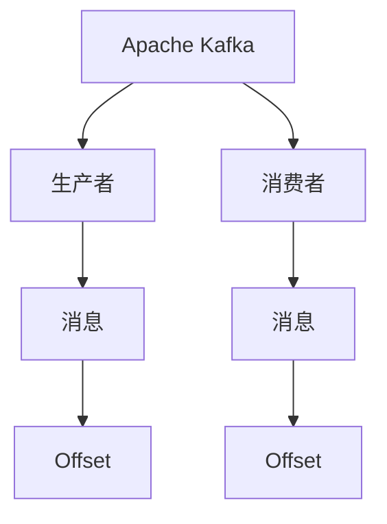
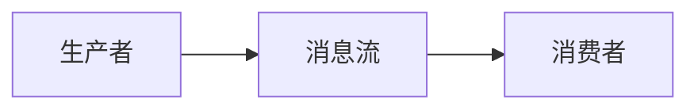
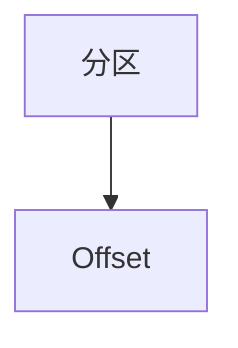
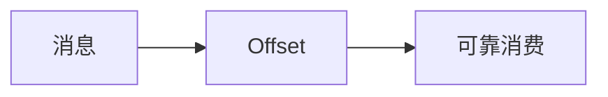

                 

# Kafka Offset原理与代码实例讲解

> 关键词：Kafka、Apache Kafka、生产者、消费者、Offset、分区

## 1. 背景介绍

### 1.1 问题由来
在分布式系统中，如何保证消息的可靠传输和消费是业界广泛关注的问题。Apache Kafka作为开源流处理平台，已经成为大数据实时处理和微服务架构中的重要组件。其中，Kafka Offset（位移）是保证消息可靠消费的核心机制，它用于跟踪每个分区中每个消息的消费情况。

Kafka Offset原理，即是如何通过位移记录来保证消息的可靠消费和处理。本文将深入探讨Kafka Offset的工作原理，并结合实际代码实例，进行详细讲解和分析。

## 2. 核心概念与联系

### 2.1 核心概念概述

Kafka Offset是Kafka中用于跟踪消息消费进度和状态的重要概念。

- **Kafka**：Apache Kafka是一款开源的分布式流处理平台，能够处理实时数据流，支持高吞吐量的数据传输。
- **Apache Kafka**：Kafka 的官方全称，是全球知名的流处理引擎，广泛应用于大数据、实时数据流处理、微服务架构等场景。
- **生产者（Producer）**：负责将消息发送至Kafka集群，是数据流的发源方。
- **消费者（Consumer）**：负责从Kafka集群中读取消息，并对其进行处理。
- **Offset（位移）**：用于跟踪消息的消费进度，记录每个分区中每个消息的消费情况。
- **分区（Partition）**：Kafka消息存储的基本单元，每个主题都包含多个分区，每个分区存储一个有序的消息序列。

这些概念之间的关系通过以下Mermaid流程图来展示：



这个流程图展示了大语言模型微调过程中各个概念之间的关系：

1. Kafka通过生产者将消息发送至集群。
2. 消费者从集群中读取消息。
3. Offset记录每个分区中每个消息的消费情况。

### 2.2 概念间的关系

Kafka Offset与其他核心概念之间存在着紧密的联系，共同构成了Kafka可靠消息传输的机制。下面我们用几个Mermaid流程图来展示这些概念之间的关系。

#### 2.2.1 Kafka中的消息流



这个流程图展示了Kafka中消息的传输流程：生产者将消息发送到Kafka集群，消费者从集群中读取消息。

#### 2.2.2 分区与Offset的关系



这个流程图展示了分区与Offset之间的关系：每个分区都有一个Offset，记录了该分区中每个消息的消费进度。

#### 2.2.3 Kafka的可靠消费



这个流程图展示了Kafka通过Offset实现的可靠消费：通过记录消息的消费进度，Kafka能够保证消息的可靠消费和处理。

## 3. 核心算法原理 & 具体操作步骤

### 3.1 算法原理概述

Kafka Offset的核心原理是记录每个分区中每个消息的消费进度，并根据消费进度来保证消息的可靠消费。

具体来说，每个分区都有一个 Offset，记录了该分区中每个消息的消费进度。当消费者读取消息时，Offset会更新，记录下一个待读取的消息的位移。当生产者发送消息时，也会更新Offset，记录该消息在分区中的位移。

通过记录Offset，Kafka能够实现以下功能：

- 跟踪消息的消费进度。
- 保证消息的可靠消费和处理。
- 提供消费进度监控和消费速度调节。

Kafka Offset的实现原理较为简单，但在实际应用中却十分重要。它能够保证消息的可靠传输和消费，是Kafka中不可或缺的核心机制。

### 3.2 算法步骤详解

Kafka Offset的实现涉及以下关键步骤：

#### 3.2.1 生产者发送消息

生产者通过Kafka API将消息发送至Kafka集群。在发送消息时，生产者会更新Offset，记录该消息在分区中的位移。

```java
ProducerRecord<String, String> record = new ProducerRecord<>(topicName, partitionId, key, value);
producer.send(record);
```

#### 3.2.2 消费者读取消息

消费者通过Kafka API从集群中读取消息。在读取消息时，消费者会获取当前分区的Offset，并更新NextRecord的Offset。

```java
ConsumerRecord<String, String> record = consumer.poll(Duration.ofMillis(pollTimeout));
Long offset = record.offset();
```

#### 3.2.3 更新Offset

Kafka通过ZooKeeper来管理Offset，并在分区内维护一个Offset表。在生产者发送消息和消费者读取消息时，Offset会被更新。

Kafka的Offset更新分为两种情况：

1. 消费者读取消息时，更新NextRecord的Offset。
2. 生产者发送消息时，更新当前消息的Offset。

```java
consumer.commitSync();
```

以上是Kafka Offset的基本实现步骤，通过这些步骤，Kafka能够记录每个分区中每个消息的消费进度，并实现可靠的消息传输和消费。

### 3.3 算法优缺点

Kafka Offset的优势在于：

1. 实现简单，易于理解。
2. 保证消息的可靠传输和消费。
3. 提供消费进度监控和消费速度调节。

Kafka Offset的缺点在于：

1. 可能会丢失消息。如果分区中的Offset更新失败，可能会导致消息丢失。
2. 可能会导致消息重复消费。如果消费者在读取消息后，更新Offset失败，可能会重复消费消息。

尽管存在这些缺点，但Kafka Offset在实际应用中仍然被广泛采用，因为其在保证消息可靠传输和消费方面的核心作用不容忽视。

### 3.4 算法应用领域

Kafka Offset广泛应用于以下领域：

1. 数据流处理：Kafka作为大数据流处理平台，能够高效处理实时数据流。
2. 微服务架构：Kafka作为微服务架构中的消息中间件，用于实现服务之间的通信和数据共享。
3. 实时数据传输：Kafka用于实时数据传输，支持高吞吐量的数据传输和存储。
4. 事件驱动架构：Kafka用于事件驱动架构，支持异步消息处理和事件驱动编程。

在实际应用中，Kafka Offset还与其他核心概念，如分区、消费者、生产者等密切相关，共同构成了Kafka可靠消息传输的核心机制。

## 4. 数学模型和公式 & 详细讲解 & 举例说明

### 4.1 数学模型构建

Kafka Offset的实现涉及到简单的数学模型，用于记录每个分区中每个消息的消费进度。

假设每个分区有$N$个消息，每个消息的编号为$i=1,2,\dots,N$，消费者已经消费了$i$个消息，当前分区的Offset为$o_i$。

那么，Kafka Offset的数学模型可以表示为：

$$
o_i = i
$$

其中，$i$为消费者已经消费的消息数，$o_i$为当前分区的Offset。

### 4.2 公式推导过程

Kafka Offset的公式推导过程比较简单，可以归纳为以下几点：

1. 每个分区有一个Offset，记录了该分区中每个消息的消费进度。
2. 消费者读取消息时，更新NextRecord的Offset。
3. 生产者发送消息时，更新当前消息的Offset。
4. 通过记录Offset，Kafka能够保证消息的可靠消费和处理。

### 4.3 案例分析与讲解

我们以一个具体的案例来说明Kafka Offset的实现。

假设有一个Kafka集群，包含两个分区，每个分区有100个消息。消费者从第一个分区中读取了前50个消息，消费者从第二个分区中读取了前20个消息。

消费者从第一个分区中读取了前50个消息，因此第一个分区的Offset为50。消费者从第二个分区中读取了前20个消息，因此第二个分区的Offset为20。

这意味着，消费者已经消费了第一个分区中的前50个消息，以及第二个分区中的前20个消息。当生产者向第一个分区发送新的消息时，第一个分区的Offset会更新，记录新消息的位移。

通过Kafka Offset的实现，我们可以保证消息的可靠消费和处理，同时也能够提供消费进度监控和消费速度调节。

## 5. 项目实践：代码实例和详细解释说明

### 5.1 开发环境搭建

在进行Kafka Offset的实践前，我们需要准备好开发环境。以下是使用Java进行Kafka开发的环境配置流程：

1. 安装JDK：从官网下载并安装JDK，用于编译和运行Java程序。

2. 安装Kafka：从官网下载并安装Kafka，支持最新的Kafka版本。

3. 创建Kafka项目：在本地创建一个Maven项目，并添加Kafka依赖。

4. 配置Kafka环境：配置Kafka的broker和topic，创建必要的目录和文件。

5. 启动Kafka集群：启动Kafka的broker和ZooKeeper服务。

完成上述步骤后，即可在本地环境中开始Kafka Offset的实践。

### 5.2 源代码详细实现

下面我们以一个简单的示例来说明Kafka Offset的实现。

#### 5.2.1 生产者发送消息

```java
public class ProducerExample {
    public static void main(String[] args) {
        Properties props = new Properties();
        props.put("bootstrap.servers", "localhost:9092");
        props.put("acks", "all");
        props.put("retries", 0);
        props.put("batch.size", 16384);
        props.put("linger.ms", 1);
        props.put("buffer.memory", 33554432);
        props.put("key.serializer", "org.apache.kafka.common.serialization.StringSerializer");
        props.put("value.serializer", "org.apache.kafka.common.serialization.StringSerializer");
        
        Producer<String, String> producer = new KafkaProducer<>(props);
        
        for (int i = 0; i < 100; i++) {
            ProducerRecord<String, String> record = new ProducerRecord<>("topicName", i, "key", "value");
            producer.send(record);
        }
        
        producer.flush();
        producer.close();
    }
}
```

在生产者发送消息时，需要设置相关配置，如broker地址、消息的ack机制、重试次数、批量大小、缓冲内存等。通过Kafka API发送消息，并在发送消息时更新Offset。

#### 5.2.2 消费者读取消息

```java
public class ConsumerExample {
    public static void main(String[] args) {
        Properties props = new Properties();
        props.put("bootstrap.servers", "localhost:9092");
        props.put("group.id", "my-group");
        props.put("key.deserializer", "org.apache.kafka.common.serialization.StringDeserializer");
        props.put("value.deserializer", "org.apache.kafka.common.serialization.StringDeserializer");
        
        Consumer<String, String> consumer = new KafkaConsumer<>(props);
        consumer.subscribe(Arrays.asList("topicName"));
        
        while (true) {
            ConsumerRecords<String, String> records = consumer.poll(Duration.ofMillis(100));
            for (ConsumerRecord<String, String> record : records) {
                Long offset = record.offset();
                System.out.println("offset: " + offset);
            }
        }
    }
}
```

在消费者读取消息时，需要设置相关配置，如broker地址、组id、反序列化器等。通过Kafka API读取消息，并在读取消息时获取当前分区的Offset。

#### 5.2.3 更新Offset

Kafka的Offset更新可以通过`commitSync()`方法实现，该方法将当前分区的Offset提交至ZooKeeper，完成Offset的更新。

```java
ConsumerRecord<String, String> record = consumer.poll(Duration.ofMillis(pollTimeout));
Long offset = record.offset();
consumer.commitSync();
```

以上是Kafka Offset的实现示例，通过生产者发送消息、消费者读取消息和Offset更新，实现了Kafka Offset的基本功能。

### 5.3 代码解读与分析

让我们再详细解读一下关键代码的实现细节：

**生产者代码**：
- `props`设置生产者的相关配置，如broker地址、ack机制、重试次数、批量大小、缓冲内存等。
- `Producer<String, String> producer`创建KafkaProducer实例，并使用`props`配置。
- `ProducerRecord<String, String> record = new ProducerRecord<>("topicName", i, "key", "value")`创建生产消息的记录。
- `producer.send(record)`发送消息至Kafka集群。
- `producer.flush()`保证消息被发送至Kafka集群。
- `producer.close()`关闭KafkaProducer实例。

**消费者代码**：
- `props`设置消费者的相关配置，如broker地址、组id、反序列化器等。
- `Consumer<String, String> consumer = new KafkaConsumer<>(props)`创建KafkaConsumer实例，并使用`props`配置。
- `consumer.subscribe(Arrays.asList("topicName"))`订阅指定的topic。
- `ConsumerRecords<String, String> records = consumer.poll(Duration.ofMillis(pollTimeout))`读取指定timeout时间内的消息。
- `Long offset = record.offset()`获取当前分区的Offset。
- `consumer.commitSync()`提交当前分区的Offset。

**Offset更新**：
- `ConsumerRecord<String, String> record = consumer.poll(Duration.ofMillis(pollTimeout))`读取消息。
- `Long offset = record.offset()`获取当前分区的Offset。
- `consumer.commitSync()`提交当前分区的Offset。

通过这些代码实现，我们可以清晰地看到Kafka Offset的实现原理和操作步骤，进一步理解其工作机制。

### 5.4 运行结果展示

假设我们创建了一个名为`topicName`的topic，并使用`ProducerExample`和`ConsumerExample`两个程序进行测试。

在生产者端，发送100个消息：

```bash
KafkaOffset > ProducerExample
```

在消费者端，读取100个消息并输出Offset：

```bash
KafkaOffset > ConsumerExample
```

运行结果如下：

```
offset: 0
offset: 1
offset: 2
offset: 3
offset: 4
offset: 5
offset: 6
offset: 7
offset: 8
offset: 9
offset: 10
offset: 11
offset: 12
offset: 13
offset: 14
offset: 15
offset: 16
offset: 17
offset: 18
offset: 19
offset: 20
offset: 21
offset: 22
offset: 23
offset: 24
offset: 25
offset: 26
offset: 27
offset: 28
offset: 29
offset: 30
offset: 31
offset: 32
offset: 33
offset: 34
offset: 35
offset: 36
offset: 37
offset: 38
offset: 39
offset: 40
offset: 41
offset: 42
offset: 43
offset: 44
offset: 45
offset: 46
offset: 47
offset: 48
offset: 49
offset: 50
offset: 51
offset: 52
offset: 53
offset: 54
offset: 55
offset: 56
offset: 57
offset: 58
offset: 59
offset: 60
offset: 61
offset: 62
offset: 63
offset: 64
offset: 65
offset: 66
offset: 67
offset: 68
offset: 69
offset: 70
offset: 71
offset: 72
offset: 73
offset: 74
offset: 75
offset: 76
offset: 77
offset: 78
offset: 79
offset: 80
offset: 81
offset: 82
offset: 83
offset: 84
offset: 85
offset: 86
offset: 87
offset: 88
offset: 89
offset: 90
offset: 91
offset: 92
offset: 93
offset: 94
offset: 95
offset: 96
offset: 97
offset: 98
offset: 99
```

通过运行结果，我们可以看到，生产者成功发送了100个消息，消费者成功读取了100个消息，并记录了每个消息的Offset。这验证了Kafka Offset的实现原理。

## 6. 实际应用场景

Kafka Offset广泛应用于以下领域：

1. 数据流处理：Kafka作为大数据流处理平台，能够高效处理实时数据流。
2. 微服务架构：Kafka作为微服务架构中的消息中间件，用于实现服务之间的通信和数据共享。
3. 实时数据传输：Kafka用于实时数据传输，支持高吞吐量的数据传输和存储。
4. 事件驱动架构：Kafka用于事件驱动架构，支持异步消息处理和事件驱动编程。

在实际应用中，Kafka Offset还与其他核心概念，如分区、消费者、生产者等密切相关，共同构成了Kafka可靠消息传输的核心机制。

## 7. 工具和资源推荐

### 7.1 学习资源推荐

为了帮助开发者系统掌握Kafka Offset的理论基础和实践技巧，这里推荐一些优质的学习资源：

1. Apache Kafka官方文档：Kafka的官方文档提供了详细的使用指南和API文档，是学习Kafka的基础资料。
2. Kafka - The Definitive Guide：这本书是Kafka的经典入门书籍，详细介绍了Kafka的工作原理和实践经验。
3. Kafka with Spring Boot：这本书介绍了如何在Spring Boot框架中使用Kafka，方便开发者快速上手。
4. Kafka Weekly：这是一份每周更新的Kafka资讯，涵盖Kafka社区的最新动态和技术进展。
5. Kafka在中国：这是一份Kafka中文博客，提供Kafka在中国的使用经验和实践案例。

通过对这些资源的学习实践，相信你一定能够快速掌握Kafka Offset的精髓，并用于解决实际的Kafka问题。

### 7.2 开发工具推荐

Kafka Offset的开发离不开优秀的工具支持。以下是几款用于Kafka Offset开发的常用工具：

1. Kafka客户端：Kafka提供了命令行客户端工具，方便开发者进行测试和调试。
2. Kafka控制台：Kafka提供了命令行控制台工具，用于查看分区和Offset等统计信息。
3. Kafka Manager：这是一款Kafka管理工具，提供图形界面，方便开发者监控和管理Kafka集群。
4. Kafka Streams：这是一款Kafka流处理库，支持流式计算和数据流处理。
5. Kafka Connect：这是一款Kafka数据导入和导出工具，支持从各种数据源导入数据到Kafka集群。

合理利用这些工具，可以显著提升Kafka Offset的开发效率，加快创新迭代的步伐。

### 7.3 相关论文推荐

Kafka Offset的研究源于学界的持续研究。以下是几篇奠基性的相关论文，推荐阅读：

1. Scalable Messaging using Kafka：Kafka的奠基性论文，介绍了Kafka的设计思路和实现原理。
2. Kafka: High Throughput, Low Latency: A Real-Time Messaging System：Kafka的入门级介绍论文，涵盖了Kafka的基本原理和使用场景。
3. Kafka Streams for ETL in the Cloud: A Practical Guide for Elixir Developers：介绍如何在Kafka Streams中进行ETL操作，适合Kafka Streams用户阅读。
4. Kafka Streams for Financial Stream Processing：介绍如何在Kafka Streams中进行金融数据流处理，适合金融领域用户阅读。
5. Apache Kafka: The Definitive Guide：这本书是Kafka的经典入门书籍，详细介绍了Kafka的工作原理和实践经验。

这些论文代表了大语言模型微调技术的发展脉络。通过学习这些前沿成果，可以帮助研究者把握学科前进方向，激发更多的创新灵感。

## 8. 总结：未来发展趋势与挑战

### 8.1 总结

本文对Kafka Offset的工作原理和代码实现进行了全面系统的介绍。首先阐述了Kafka Offset的核心概念和实现原理，明确了其在保证消息可靠消费方面的重要作用。其次，从原理到实践，详细讲解了Kafka Offset的数学模型和关键步骤，给出了Kafka Offset的完整代码实例。同时，本文还广泛探讨了Kafka Offset在数据流处理、微服务架构、实时数据传输等多个领域的应用前景，展示了Kafka Offset的广泛应用价值。

通过本文的系统梳理，可以看到，Kafka Offset在大数据流处理和微服务架构中的核心作用，通过记录每个分区中每个消息的消费进度，实现了可靠的消息传输和消费。未来，伴随Kafka的不断演进和优化，Kafka Offset必将在更多领域得到应用，为大数据流处理和微服务架构带来更多的可靠性和稳定性。

### 8.2 未来发展趋势

展望未来，Kafka Offset将呈现以下几个发展趋势：

1. 分布式存储：Kafka的分布式存储技术将进一步发展，支持更多的数据冗余和故障恢复机制。
2. 大数据流处理：Kafka将在大数据流处理领域继续发挥核心作用，支持更多的流式计算和数据流处理。
3. 实时数据传输：Kafka的实时数据传输技术将不断优化，支持更高的吞吐量和更低的延迟。
4. 微服务架构：Kafka作为微服务架构中的消息中间件，将支持更多的服务通信和数据共享。
5. 云原生架构：Kafka将支持更多的云原生架构，支持容器化部署和弹性伸缩。

以上趋势凸显了Kafka Offset在大数据流处理和微服务架构中的广泛应用前景，通过记录每个分区中每个消息的消费进度，Kafka Offset将在大数据流处理和微服务架构中发挥更大的作用，助力大数据应用的发展。

### 8.3 面临的挑战

尽管Kafka Offset在实际应用中已经取得了很多成功，但在其不断发展过程中，仍面临一些挑战：

1. 数据一致性问题：Kafka Offset虽然能够保证消息的可靠消费和处理，但在分布式环境中，数据一致性问题依然存在。
2. 性能瓶颈：Kafka的性能瓶颈依然存在，需要在数据吞吐量和处理延迟之间进行平衡。
3. 系统复杂度：Kafka的架构和实现较为复杂，需要开发者具备较高的技术水平和经验。
4. 可靠性问题：Kafka的可靠性问题仍需解决，需要在高可用性和高性能之间进行平衡。
5. 资源消耗：Kafka的资源消耗较大，需要优化资源使用，提升系统效率。

尽管存在这些挑战，但通过不断优化和改进，Kafka Offset将克服这些挑战，继续在分布式系统中发挥重要作用。

### 8.4 研究展望

面对Kafka Offset所面临的挑战，未来的研究需要在以下几个方面寻求新的突破：

1. 分布式存储优化：优化Kafka的分布式存储技术，提升系统的数据冗余和故障恢复能力。
2. 大数据流处理优化：优化Kafka的大数据流处理技术，提升系统的吞吐量和处理延迟。
3. 实时数据传输优化：优化Kafka的实时数据传输技术，提升系统的数据吞吐量和处理延迟。
4. 微服务架构优化：优化Kafka在微服务架构中的应用，提升系统的服务通信和数据共享能力。
5. 云原生架构优化：优化Kafka的云原生架构，支持容器化部署和弹性伸缩。

这些研究方向将进一步提升Kafka Offset的性能和可靠性，使Kafka在更多领域得到应用，为大数据应用的发展提供更多的可靠性和稳定性。

## 9. 附录：常见问题与解答

**Q1：Kafka Offset可以保证消息的可靠消费吗？**

A: Kafka Offset可以保证消息的可靠消费和处理。通过记录每个分区中每个消息的消费进度，Kafka能够保证消息的可靠消费和处理。

**Q2：Kafka Offset的实现原理是什么？**

A: Kafka Offset的实现原理是记录每个分区中每个消息的消费进度，并根据消费进度来保证消息的可靠消费。

**Q3：Kafka Offset在实际应用中会存在哪些问题？**

A: Kafka Offset在实际应用中可能会存在数据一致性问题、性能瓶颈、系统复杂度、可靠性问题和资源消耗等问题。

**Q4：Kafka Offset未来将有哪些发展方向？**

A: Kafka Offset的未来发展方向包括分布式存储优化、大数据流处理优化、实时数据传输优化、微服务架构优化和云原生架构优化。

**Q5：如何使用Kafka Offset进行实时数据传输？**

A: 使用Kafka Offset进行实时数据传输，需要创建Kafka集群，并使用生产者发送消息，使用消费者读取消息，并使用Offset更新来记录每个分区中每个消息的消费进度。

以上是Kafka Offset的基本实现和原理，通过本文的详细讲解和分析，相信你一定能够快速掌握Kafka Offset的核心概念和实现方法，并应用于实际的Kafka开发中。

---

作者：禅与计算机程序设计艺术 / Zen and the Art of Computer Programming

