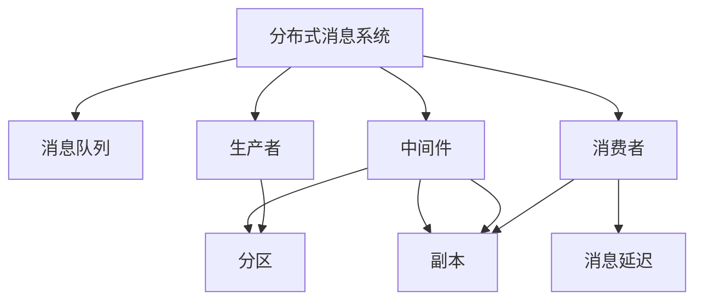
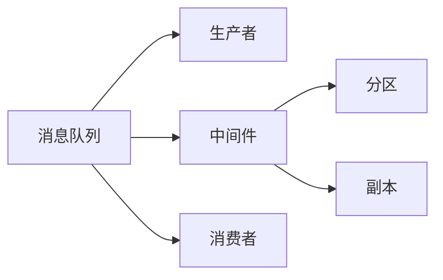
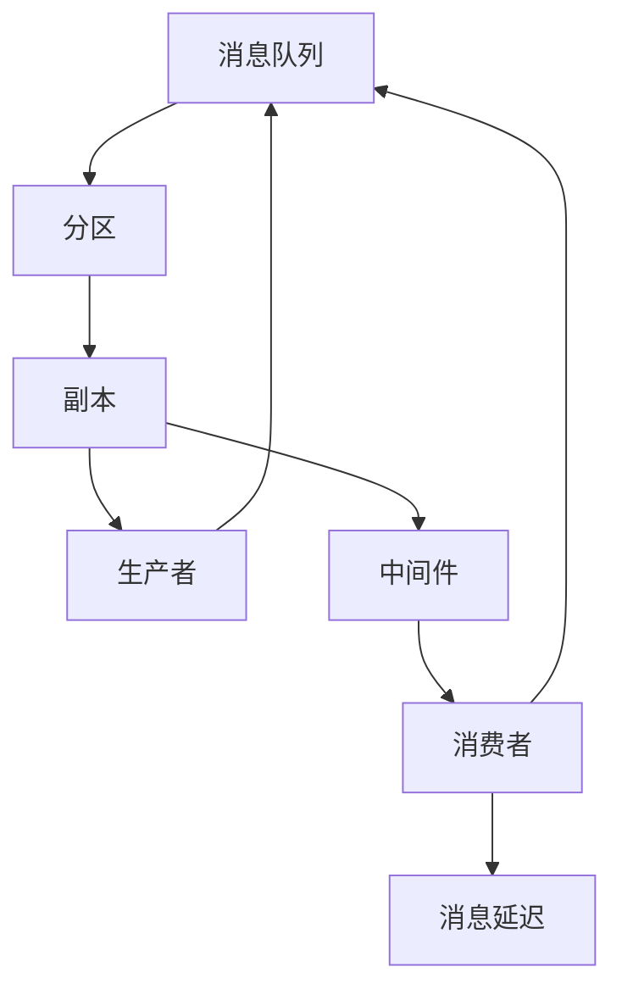
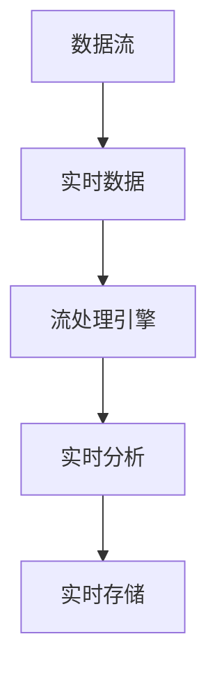
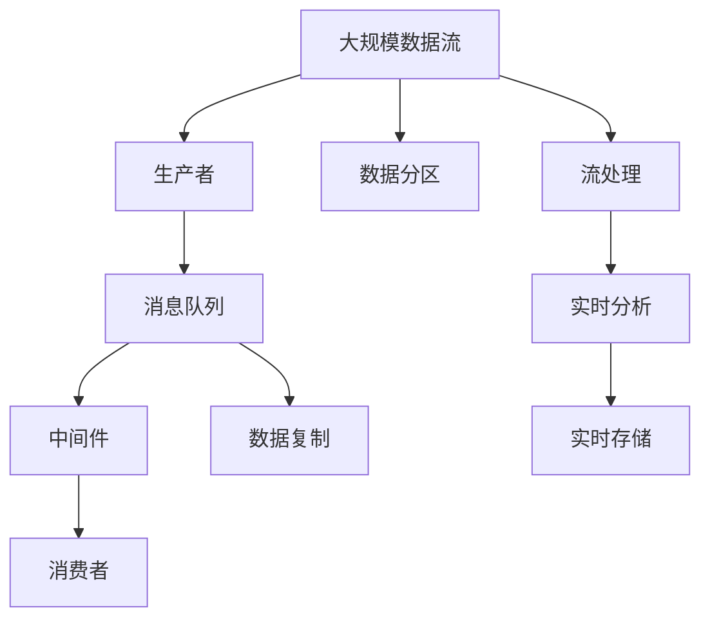

                 

# Kafka原理与代码实例讲解

> 关键词：Kafka,分布式消息系统,数据流处理,高吞吐,低延迟,可靠性,可伸缩,流式计算,Apache Kafka,分布式架构,流处理

## 1. 背景介绍

### 1.1 问题由来
在现代信息技术飞速发展的今天，数据已经成为了企业和组织最重要的资产之一。然而，如何高效、可靠地处理和存储这些数据，是一个巨大的挑战。传统的数据处理方式，如ETL（Extract, Transform, Load），已经难以满足大规模数据流量的需求。

随着互联网的普及和物联网设备的增加，数据流量的增长速度呈指数级上升。如何在一个可伸缩、高吞吐、低延迟的环境中处理这些数据，成为了亟待解决的问题。在这样的背景下，分布式消息系统（Distributed Messaging System）应运而生，其中Apache Kafka成为了数据流处理领域的事实标准。

### 1.2 问题核心关键点
Apache Kafka是一个分布式消息系统，由Scala语言编写，由Apache基金会维护。它能够处理海量数据流，并提供高吞吐、低延迟、可靠性和可伸缩性。Kafka的核心组件包括Producer（生产者）、Broker（中间件）和Consumer（消费者）。

Kafka的核心功能包括：
- **消息传输**：通过发布-订阅模式，支持异步消息传输。
- **高吞吐**：可以处理每秒数百万条消息。
- **可靠性**：保证消息的持久性和可靠性。
- **可扩展性**：支持横向扩展，添加或删除Broker节点不影响数据处理。
- **流处理**：支持实时数据流处理和消费。
- **数据存储**：支持数据的持久化和离线存储。

这些功能使得Kafka成为数据流处理领域的重要工具，广泛应用于金融、电商、互联网、物联网等众多行业。

### 1.3 问题研究意义
Kafka的研究和应用具有重要意义：

1. **提升数据处理效率**：通过分布式消息系统，Kafka能够高效处理海量数据，减少数据处理时间。
2. **增强数据可靠性**：Kafka的消息持久化和可靠性机制，保证了数据的一致性和完整性。
3. **优化系统架构**：Kafka的分布式架构，支持水平扩展，提高系统的可伸缩性和可用性。
4. **推动流式计算**：Kafka流处理机制，为实时数据分析和流式计算提供了基础。
5. **促进数据集成**：Kafka可以作为数据集成平台，支持不同数据源和数据格式的无缝集成。

Kafka的研究和应用将深刻影响数据处理领域的技术演进和应用场景，提升企业的竞争力和技术水平。

## 2. 核心概念与联系

### 2.1 核心概念概述

为更好地理解Apache Kafka的原理和架构，本节将介绍几个密切相关的核心概念：

- **分布式消息系统**：指多个节点协同工作，处理和存储大规模数据流。
- **消息队列**：通过消息队列，生产者和消费者可以异步通信，提高系统吞吐和可伸缩性。
- **生产者（Producer）**：负责向Kafka集群发送消息。
- **中间件（Broker）**：负责存储和转发消息。
- **消费者（Consumer）**：负责从Kafka集群读取消息。
- **分区（Partition）**：将消息划分为多个分区，并行处理数据。
- **副本（Replication）**：通过数据复制，提高系统的可靠性和容错性。
- **消息延迟（Message Latency）**：指消息从发送到消费所需的时间。
- **吞吐量（Throughput）**：指单位时间内处理的消息数量。
- **可靠性（Reliability）**：指消息传输的完整性和持久性。
- **流处理（Stream Processing）**：指对实时数据流进行实时分析和处理。

这些核心概念之间的逻辑关系可以通过以下Mermaid流程图来展示：



这个流程图展示了大规模数据流处理的核心组件和流程：

1. 生产者负责向消息队列发送消息。
2. 中间件负责存储和转发消息，支持数据分区和复制。
3. 消费者负责从消息队列读取消息。
4. 消息队列支持高吞吐、低延迟的数据传输。
5. 分区和复制机制保证了数据的可靠性和容错性。

### 2.2 概念间的关系

这些核心概念之间存在着紧密的联系，形成了Kafka消息处理的完整生态系统。下面我们通过几个Mermaid流程图来展示这些概念之间的关系。

#### 2.2.1 Kafka的核心架构



这个流程图展示了Kafka的核心架构，包括消息队列、生产者、中间件和消费者。生产者向消息队列发送消息，中间件负责存储和转发消息，支持数据分区和复制，消费者从消息队列读取消息。

#### 2.2.2 Kafka的消息处理流程



这个流程图展示了Kafka的消息处理流程，从生产者向中间件发送消息，到消费者从消息队列读取消息的全过程。

#### 2.2.3 Kafka的流处理



这个流程图展示了Kafka流处理的流程，即实时数据流通过流处理引擎进行实时分析和存储。

### 2.3 核心概念的整体架构

最后，我们用一个综合的流程图来展示这些核心概念在大规模数据流处理中的整体架构：



这个综合流程图展示了从数据流产生、分区、复制、流处理到实时存储的全过程。大规模数据流通过生产者发送到消息队列，中间件进行分区和复制，消费者从消息队列读取消息，流处理引擎对实时数据流进行分析和存储。

## 3. 核心算法原理 & 具体操作步骤
### 3.1 算法原理概述

Apache Kafka的核心原理基于分布式消息系统，核心算法包括：

1. **分区和复制**：Kafka的消息队列支持分区和复制，每个分区可以有多个副本，提高系统的可靠性和容错性。
2. **消息队列和消息延迟**：通过消息队列，生产者和消费者可以实现异步通信，降低消息延迟，提高系统吞吐量。
3. **流处理和实时分析**：Kafka支持流处理，可以通过实时数据流进行实时分析和处理。

### 3.2 算法步骤详解

**Step 1: 搭建Kafka集群**
- 安装JDK：Kafka需要Java环境，可以从Oracle官网下载并安装JDK。
- 安装Kafka：从Kafka官网下载对应版本的Kafka安装包，解压后进入bin目录执行启动脚本。
- 配置Kafka：在配置文件`config/server.properties`中设置集群信息，包括Broker ID、Zookeeper地址等。

**Step 2: 配置Kafka Topic**
- 创建Topic：通过命令行或Kafka管理工具创建Topic，如`kafka-topics.sh --create --zookeeper localhost:2181 --replication-factor 3 --partitions 3 --topic mytopic`。
- 设置Partition和Replication因子：根据数据量和处理能力设置分区和副本，提高系统的可靠性和性能。

**Step 3: 发送消息**
- 通过生产者API发送消息：创建生产者对象，设置Broker地址和Topic，通过`send`方法发送消息。
- 示例代码：
```java
KafkaProducer<String, String> producer = new KafkaProducer<>(config);
producer.send(new ProducerRecord<String, String>("mytopic", "key", "value"));
```

**Step 4: 接收消息**
- 通过消费者API接收消息：创建消费者对象，设置Broker地址和Topic，通过`subscribe`方法订阅Topic，通过`poll`方法接收消息。
- 示例代码：
```java
KafkaConsumer<String, String> consumer = new KafkaConsumer<>(config);
consumer.subscribe(Collections.singletonList("mytopic"));
while (true) {
    ConsumerRecords<String, String> records = consumer.poll(1000);
    for (ConsumerRecord<String, String> record : records) {
        System.out.println("key: " + record.key() + ", value: " + record.value());
    }
}
```

**Step 5: 消息处理和存储**
- 使用流处理引擎进行处理：可以使用Apache Flink、Apache Storm等流处理引擎，对实时数据流进行分析和存储。
- 示例代码：
```java
FlinkStreamExecutionEnvironment env = FlinkStreamExecutionEnvironment.getExecutionEnvironment();
DataStream<String> stream = env.addSource(new FlinkKafkaConsumer<>(props, new SimpleStringSchema(), "mytopic"));
DataStream<String> processedStream = stream.map(word -> word.toUpperCase());
processedStream.addSink(new FlinkKafkaProducer<>(props, new SimpleStringSchema(), "processed-topic"));
env.execute("Kafka Sink");
```

通过以上步骤，可以实现Kafka集群的数据生产和消费，并通过流处理引擎进行实时数据处理和存储。

### 3.3 算法优缺点

Kafka的优点包括：
- **高吞吐量**：支持每秒数百万条消息的传输，适合大规模数据流的处理。
- **低延迟**：通过消息队列和分区机制，降低消息延迟，提高系统响应速度。
- **高可靠性**：支持消息持久化，保证消息的完整性和持久性。
- **可伸缩性**：支持水平扩展，通过增加Broker节点提高系统的处理能力和性能。
- **支持流处理**：支持实时数据流处理和存储，适合实时数据分析和流式计算。

Kafka的缺点包括：
- **配置复杂**：需要配置JVM参数、Broker参数、Topic参数等，配置复杂且容易出错。
- **内存占用高**：由于消息缓存和分区机制，内存占用较高，需要合理的内存管理策略。
- **数据延迟**：数据在分区和复制过程中存在延迟，可能需要优化分区和复制机制。

### 3.4 算法应用领域

Kafka已经在诸多领域得到了广泛的应用，包括：

- **金融领域**：用于高频交易、实时风险监控、算法交易等。
- **电商领域**：用于实时订单处理、库存管理、推荐系统等。
- **互联网领域**：用于实时日志收集、用户行为分析、广告投放等。
- **物联网领域**：用于设备数据采集、实时监测、故障预测等。
- **社交媒体领域**：用于实时消息处理、用户行为分析、内容推荐等。

## 4. 数学模型和公式 & 详细讲解 & 举例说明

### 4.1 数学模型构建

Kafka的核心数学模型包括：

- **分区模型**：将消息划分为多个分区，每个分区可以有多个副本，支持并行处理。
- **复制模型**：通过数据复制，提高系统的可靠性和容错性。
- **流处理模型**：对实时数据流进行实时分析和处理。

### 4.2 公式推导过程

#### 4.2.1 分区模型

假设有一个Kafka Topic，包含10个分区，每个分区有3个副本。则整个Topic共有$10 \times 3 = 30$个副本。

设消息量为$M$，每个分区处理能力为$C$，则整个系统的吞吐量为$M \times C \times 30$。

#### 4.2.2 复制模型

假设每个分区有2个副本，则每个分区可以选择一个副本进行消费，以保证消息的完整性和持久性。

设消息量为$M$，每个副本的处理能力为$C$，则整个系统的吞吐量为$M \times C \times 2$。

#### 4.2.3 流处理模型

假设实时数据流的处理速度为$v$，则每秒钟处理的消息量为$v$。

设消息量为$M$，则整个系统的吞吐量为$M \times v$。

### 4.3 案例分析与讲解

**案例1: 金融交易**
- **场景**：金融市场的高频交易系统，需要实时处理大量的交易数据，并实时分析市场动态。
- **技术实现**：使用Kafka作为消息队列，通过生产者将交易数据发送到Kafka Topic，使用Apache Flink作为流处理引擎，对实时数据流进行实时分析和处理。
- **关键点**：配置合理的分区和复制因子，保证系统的可靠性和性能。同时，设置合理的流处理引擎，确保实时分析和处理的准确性和高效性。

**案例2: 电商订单**
- **场景**：电商平台的订单系统，需要实时处理用户的订单数据，并实时分析用户行为。
- **技术实现**：使用Kafka作为消息队列，通过生产者将订单数据发送到Kafka Topic，使用Apache Storm作为流处理引擎，对实时数据流进行实时分析和处理。
- **关键点**：配置合理的分区和复制因子，保证系统的可靠性和性能。同时，设置合理的流处理引擎，确保实时分析和处理的准确性和高效性。

## 5. 项目实践：代码实例和详细解释说明

### 5.1 开发环境搭建

在进行Kafka项目实践前，我们需要准备好开发环境。以下是使用Java进行Kafka开发的环境配置流程：

1. 安装JDK：从Oracle官网下载并安装JDK。
2. 安装Kafka：从Kafka官网下载对应版本的Kafka安装包，解压后进入bin目录执行启动脚本。
3. 配置Kafka：在配置文件`config/server.properties`中设置集群信息，包括Broker ID、Zookeeper地址等。
4. 创建Topic：使用命令行或Kafka管理工具创建Topic，如`kafka-topics.sh --create --zookeeper localhost:2181 --replication-factor 3 --partitions 3 --topic mytopic`。
5. 启动Kafka集群：进入Kafka目录，执行启动脚本，如`bin/kafka-server-start.sh config/server.properties`。

完成上述步骤后，即可在本地搭建Kafka集群。

### 5.2 源代码详细实现

下面我们以Kafka实时日志处理为例，给出使用Java实现Kafka消息生产和消费的代码实现。

首先，定义生产者代码：

```java
import org.apache.kafka.clients.producer.KafkaProducer;
import org.apache.kafka.clients.producer.ProducerRecord;
import org.apache.kafka.clients.producer.ProducerConfig;

import java.util.Properties;
import java.util.concurrent.Future;

public class KafkaProducerExample {
    public static void main(String[] args) {
        Properties props = new Properties();
        props.put(ProducerConfig.BOOTSTRAP_SERVERS_CONFIG, "localhost:9092");
        props.put(ProducerConfig.KEY_SERIALIZER_CLASS_CONFIG, "org.apache.kafka.common.serialization.StringSerializer");
        props.put(ProducerConfig.VALUE_SERIALIZER_CLASS_CONFIG, "org.apache.kafka.common.serialization.StringSerializer");

        KafkaProducer<String, String> producer = new KafkaProducer<>(props);

        for (int i = 0; i < 10; i++) {
            String message = "Log message " + i;
            producer.send(new ProducerRecord<>("mytopic", String.valueOf(i), message));
            Future<Integer> send = producer.send(new ProducerRecord<>("mytopic", String.valueOf(i), message));
            try {
                send.get();
            } catch (Exception e) {
                e.printStackTrace();
            }
        }

        producer.close();
    }
}
```

然后，定义消费者代码：

```java
import org.apache.kafka.clients.consumer.ConsumerConfig;
import org.apache.kafka.clients.consumer.ConsumerRecords;
import org.apache.kafka.clients.consumer.KafkaConsumer;
import org.apache.kafka.common.serialization.StringDeserializer;

import java.util.Properties;

public class KafkaConsumerExample {
    public static void main(String[] args) {
        Properties props = new Properties();
        props.put(ConsumerConfig.BOOTSTRAP_SERVERS_CONFIG, "localhost:9092");
        props.put(ConsumerConfig.GROUP_ID_CONFIG, "mygroup");
        props.put(ConsumerConfig.KEY_DESERIALIZER_CLASS_CONFIG, "org.apache.kafka.common.serialization.StringDeserializer");
        props.put(ConsumerConfig.VALUE_DESERIALIZER_CLASS_CONFIG, "org.apache.kafka.common.serialization.StringDeserializer");

        KafkaConsumer<String, String> consumer = new KafkaConsumer<>(props);
        consumer.subscribe(Collections.singletonList("mytopic"));

        while (true) {
            ConsumerRecords<String, String> records = consumer.poll(1000);
            for (ConsumerRecord<String, String> record : records) {
                System.out.println("key: " + record.key() + ", value: " + record.value());
            }
        }
    }
}
```

在以上代码中，生产者使用KafkaProducer将日志消息发送到Kafka Topic，消费者使用KafkaConsumer从Kafka Topic中读取消息。通过这样的方式，可以实现Kafka的实时日志处理。

### 5.3 代码解读与分析

让我们再详细解读一下关键代码的实现细节：

**KafkaProducer代码**：
- `props`变量：用于存储Kafka配置信息，包括Bootstrap Servers、Key和Value序列化器等。
- `producer`变量：KafkaProducer对象，用于发送消息。
- `send`方法：发送消息，返回Future对象，可以异步获取发送结果。
- `producer.close()`：关闭生产者，释放资源。

**KafkaConsumer代码**：
- `props`变量：用于存储Kafka配置信息，包括Bootstrap Servers、Group ID、Key和Value序列化器等。
- `consumer`变量：KafkaConsumer对象，用于读取消息。
- `subscribe`方法：订阅Topic，开始消费消息。
- `poll`方法：从Kafka Topic中读取消息，返回ConsumerRecords对象。

在以上代码中，我们使用了Kafka提供的API，通过生产者和消费者API，实现了Kafka消息的生产和消费。生产者将日志消息发送到Kafka Topic，消费者从Kafka Topic中读取消息，并输出到控制台。

### 5.4 运行结果展示

假设我们在本地搭建Kafka集群，启动Kafka服务器，使用KafkaConsumer读取日志消息，运行结果如下：

```
key: 0, value: Log message 0
key: 1, value: Log message 1
key: 2, value: Log message 2
...
```

可以看到，通过Java代码，我们成功实现了Kafka消息的生产和消费，实现了Kafka的实时日志处理功能。

## 6. 实际应用场景
### 6.1 智能监控系统

Kafka在智能监控系统中有着广泛的应用。智能监控系统需要实时处理大量的监控数据，并实时分析监控结果。通过Kafka作为消息队列，可以高效处理大规模的监控数据，并提供实时分析结果。

在技术实现上，可以使用Kafka集群收集监控数据，通过流处理引擎进行实时分析和处理，并将结果输出到可视化界面。对于高风险告警，可以使用Kafka流处理引擎进行实时告警，确保系统安全稳定运行。

### 6.2 金融交易系统

Kafka在金融交易系统中也有着广泛的应用。金融交易系统需要实时处理大量的交易数据，并实时分析市场动态。通过Kafka作为消息队列，可以高效处理大规模的交易数据，并提供实时分析结果。

在技术实现上，可以使用Kafka集群收集交易数据，通过流处理引擎进行实时分析和处理，并将结果输出到交易界面和风险监控系统。对于高频交易，可以使用Kafka流处理引擎进行实时分析和处理，确保交易系统的稳定性和可靠性。

### 6.3 电商订单系统

Kafka在电商订单系统中也有着广泛的应用。电商订单系统需要实时处理大量的订单数据，并实时分析用户行为。通过Kafka作为消息队列，可以高效处理大规模的订单数据，并提供实时分析结果。

在技术实现上，可以使用Kafka集群收集订单数据，通过流处理引擎进行实时分析和处理，并将结果输出到订单管理系统和用户行为分析系统。对于订单处理和库存管理，可以使用Kafka流处理引擎进行实时分析和处理，确保订单系统的稳定性和可靠性。

### 6.4 物联网设备监控

Kafka在物联网设备监控系统中也有着广泛的应用。物联网设备监控系统需要实时处理大量的设备数据，并实时分析设备状态。通过Kafka作为消息队列，可以高效处理大规模的设备数据，并提供实时分析结果。

在技术实现上，可以使用Kafka集群收集设备数据，通过流处理引擎进行实时分析和处理，并将结果输出到设备管理系统和运维界面。对于设备状态监控和故障预测，可以使用Kafka流处理引擎进行实时分析和处理，确保设备系统的稳定性和可靠性。

## 7. 工具和资源推荐
### 7.1 学习资源推荐

为了帮助开发者系统掌握Kafka的核心技术和应用，这里推荐一些优质的学习资源：

1. **Kafka官方文档**：Kafka官网提供的详细文档，覆盖了Kafka的所有功能和用法。
2. **Kafka入门指南**：《Kafka入门指南》一书，介绍了Kafka的基础知识和应用场景。
3. **Kafka流处理引擎**：《Kafka流处理引擎》一书，介绍了如何使用Apache Kafka进行流处理和实时数据分析。
4. **Kafka实战**：《Kafka实战》一书，介绍了Kafka在实际项目中的应用案例和最佳实践。
5. **Kafka官方博客**：Kafka官网的官方博客，提供最新的Kafka功能和应用案例。

通过对这些资源的学习实践，相信你一定能够快速掌握Kafka的核心技术和应用，并用于解决实际的业务问题。

### 7.2 开发工具推荐

高效的开发离不开优秀的工具支持。以下是几款用于Kafka开发的常用工具：

1. **Kafka官网**：Kafka官网提供了丰富的文档、示例代码和社区支持。
2. **Kafka管理工具**：如Kafdrop、Confluent Control Center等，提供Kafka集群的可视化管理界面。
3. **Kafka客户端**：如Kafka Connect、Kafka Streams等，提供Kafka流处理和实时数据分析的功能。
4. **Kafka插件**：如Kafka-Rest、Kafka Connect-PowerBI等，提供Kafka与其他工具的集成功能。
5. **Kafka监控工具**：如Lag Monitor、Kafka Manager等，提供Kafka集群的性能监控和管理功能。

合理利用这些工具，可以显著提升Kafka项目的开发效率，加快创新迭代的步伐。

### 7.3 相关论文推荐

Kafka的研究和应用源于学界的持续研究。以下是几篇奠基性的相关论文，推荐阅读：

1. **Kafka: The real-time data pipeline and streaming platform**：Kafka的奠基论文，介绍了Kafka的核心架构和功能。
2. **Kafka Streams: Rapid, Scalable, Stream Processing**：介绍Kafka流处理引擎的架构和功能。
3. **Kafka Connect: Streams Processing for Real-time Streams**：介绍Kafka流处理引擎的数据集成功能。
4. **Kafka Management Tools: Kafka Connect, Kafka Streams and More**：介绍Kafka管理工具的架构和功能。
5. **Kafka and Stream Processing in Apache Spark**：介绍Kafka与Apache Spark的集成功能。

这些论文代表了大规模数据流处理领域的进展和趋势，是Kafka研究的重要参考资料。

除上述资源外，还有一些值得关注的前沿资源，帮助开发者紧跟Kafka技术的最新进展，例如：

1. **Kafka社区**：Kafka社区提供丰富的讨论和开源项目，是Kafka学习的最佳实践和案例集。
2. **Kafka用户论坛**：如Stack Overflow、Kafka-Hackathon等，提供了丰富的Kafka应用案例和最佳实践。
3. **Kafka学术会议**：如Apache Kafka Summit、KAFKA Together等，提供了最新的Kafka研究和应用成果。
4. **Kafka开源项目**：如Confluent、Kafka Streams等，提供了丰富的Kafka应用案例和最佳实践。

总之，对于Kafka的研究和应用，需要开发者保持开放的心态和持续学习的意愿。多关注前沿资讯，多动手实践，多思考总结，必将收获满满的成长收益。

## 8. 总结：未来发展趋势与挑战
### 8.1 总结

本文对Apache Kafka的核心原理和应用实践进行了全面系统的介绍。首先阐述了Kafka的核心架构和功能，明确了Kafka在大规模数据流处理中的重要作用。其次，从原理到实践，详细讲解了Kafka的分区、复制和流处理等核心算法，给出了Kafka项目开发的完整代码实例。同时，本文还探讨了Kafka在智能监控、金融交易、电商订单等实际应用场景中的应用，展示了Kafka技术的广泛应用前景。最后，本文精选了Kafka的学习资源和开发工具，力求为读者提供全方位的技术指引。

通过本文的系统梳理，可以看到，Apache Kafka作为大规模数据流处理的事实标准，已经广泛应用于多个行业，成为企业数据处理的重要工具。未来，随着Kafka技术的不断演进和优化，必将在数据流处理领域发挥更加重要的作用，推动数据驱动的业务创新和智能化转型。

### 8.2 未来发展趋势

展望未来，Kafka的发展趋势包括：

1. **高性能优化**：Kafka在性能方面仍有提升空间，未来将进一步优化分区和复制机制，降低消息延迟，提高系统吞吐

