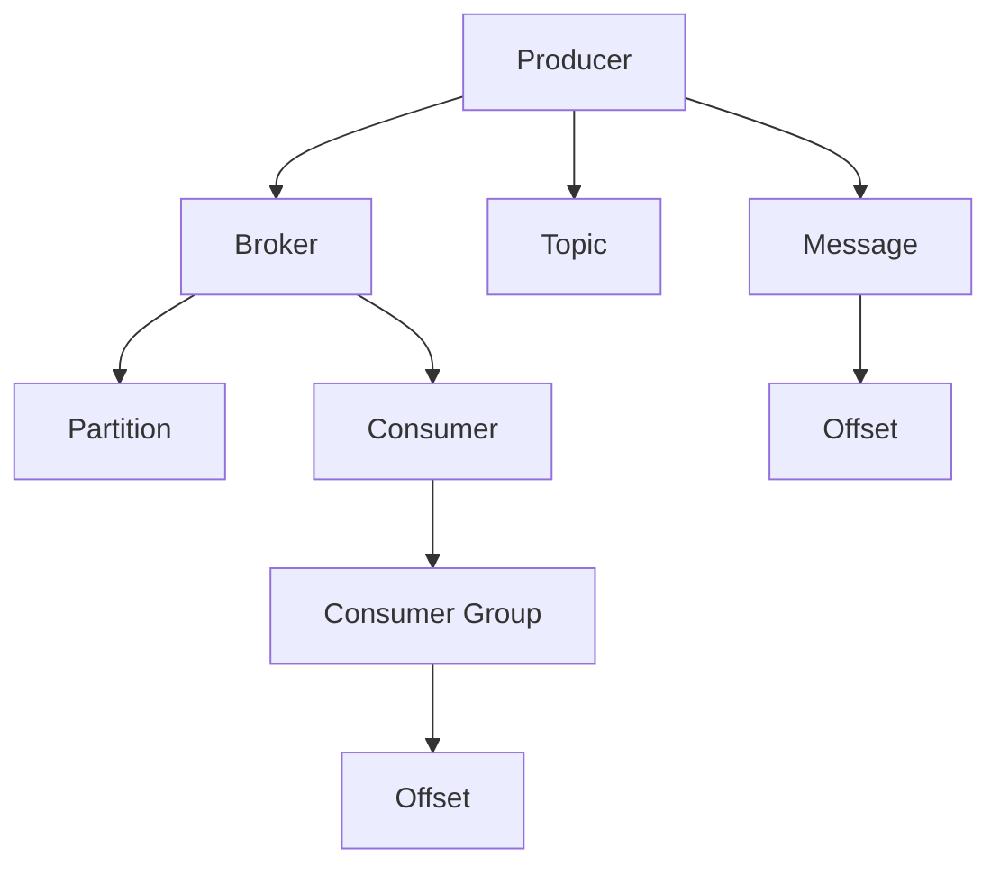

                 

# Kafka原理与代码实例讲解

## 1. 背景介绍

### 1.1 问题由来
Kafka是一个由Apache基金会开源的分布式流处理平台，广泛应用于数据实时传输、日志存储等领域。Kafka的设计理念包括高吞吐量、低延迟、可扩展性、可靠性以及容错性。其核心组件包括Kafka Broker、Kafka Producer、Kafka Consumer和Zookeeper等。

Kafka被广泛应用于大数据、微服务架构、实时数据处理等领域，成为众多企业数据基础设施的核心组件之一。但Kafka的背后有其复杂的原理与技术细节，因此理解其工作原理和实现机制显得尤为重要。本文将深入探讨Kafka的原理与代码实现，以便读者能够更好地掌握其技术精髓，并应用于实际项目中。

### 1.2 问题核心关键点
Kafka的精髓在于其分布式架构和基于消息的传输机制。其核心特点包括：

1. **高吞吐量**：Kafka支持每秒处理百万级别的消息传输。
2. **低延迟**：消息能够快速地被发送和消费。
3. **高可靠性**：消息具有严格的幂等性，支持多副本和高可用性。
4. **高扩展性**：Kafka的分布式架构可以支持大规模的集群扩展。

理解这些特点及其背后的技术实现，对于深入掌握Kafka至关重要。

### 1.3 问题研究意义
Kafka作为现代数据基础设施的核心组件，掌握其原理和实现细节，对于构建高效、可靠的数据流处理系统至关重要。Kafka的应用不仅限于大数据领域，还在微服务架构、实时数据处理、事件驱动架构等多个场景中发挥重要作用。

本文通过深入讲解Kafka的原理与代码实现，旨在帮助读者理解Kafka的底层机制，以便于在实际项目中更好地应用和优化Kafka系统。同时，本文也将探讨Kafka的未来发展方向与面临的挑战，为读者提供更全面的视角和见解。

## 2. 核心概念与联系

### 2.1 核心概念概述

为更好地理解Kafka的原理与实现，首先需要介绍一些核心概念：

- **Kafka Broker**：Kafka集群中的数据存储和消息传输的核心组件，负责接收、存储和发送消息。
- **Partition**：每个主题都由多个分区组成，每个分区是一组有序的消息集合。
- **Offset**：消息在分区中的位置标识，用于保证消息的顺序和幂等性。
- **Consumer Group**：消费者分组机制，允许多个消费者同时消费同一个主题的消息，但每个分区只能被一个消费者消费。
- **Message**：Kafka中传输的基本数据单位，包含键、值和属性。
- **Topic**：主题是Kafka中消息的逻辑组织方式，可以理解为一个容器，存储一组具有相同类型的消息。
- **Producer**：生产者向Kafka集群中发送消息，可以将消息发送到特定的主题和分区。
- **Consumer**：消费者从Kafka集群中读取消息，可以订阅一个或多个主题。

这些概念共同构成了Kafka的核心架构和消息传输机制。

### 2.2 概念间的关系

Kafka的核心架构和消息传输机制可以通过以下Mermaid流程图来展示：



这个流程图展示了Kafka消息传输的基本流程：

1. **Producer**：生产者向Kafka集群中发送消息。
2. **Broker**：接收并存储消息，同时分发到不同的分区。
3. **Partition**：每个主题由多个分区组成，分区内的消息有序排列。
4. **Offset**：消息在分区中的位置标识，确保消息的顺序和幂等性。
5. **Consumer**：消费者从Kafka集群中读取消息，可以订阅多个主题。
6. **Consumer Group**：消费者分组机制，多个消费者可以同时消费同一个主题的消息，但每个分区只能被一个消费者消费。

通过这个流程图，我们可以清晰地理解Kafka消息传输的基本机制。

## 3. 核心算法原理 & 具体操作步骤
### 3.1 算法原理概述

Kafka的算法原理主要围绕消息的传输和存储展开。其核心算法包括消息存储、分区分配、复制机制等。以下将逐一介绍这些关键算法原理。

### 3.2 算法步骤详解

#### 3.2.1 消息存储算法

Kafka的消息存储主要涉及分区和复制两个方面。

- **分区**：每个主题由多个分区组成，分区是Kafka中的基本数据单位，每个分区由一组有序的消息组成。
- **复制**：为了保证数据的冗余和可靠性，Kafka支持多副本机制，每个分区可以有多个副本。

#### 3.2.2 分区分配算法

Kafka的分区分配算法确保了数据分片的均衡性和可扩展性。当一个主题需要增加新的分区时，Kafka会根据当前分区的负载情况，动态分配新的分区到相应的Broker上。

#### 3.2.3 复制机制

Kafka的复制机制确保了数据的冗余和可靠性。每个分区可以有多个副本，副本之间通过心跳机制保持同步，当一个副本出现问题时，系统能够自动切换到其他副本，保证数据的完整性和可用性。

### 3.3 算法优缺点

Kafka的优点包括：

- **高吞吐量**：通过分布式架构和多副本机制，Kafka能够支持每秒处理百万级别的消息传输。
- **低延迟**：消息能够快速地被发送和消费。
- **高可靠性**：消息具有严格的幂等性，支持多副本和高可用性。
- **高扩展性**：Kafka的分布式架构可以支持大规模的集群扩展。

Kafka的缺点包括：

- **复杂性**：Kafka的架构相对复杂，需要运维人员具备较高的技术水平。
- **资源消耗**：Kafka的部署和运行需要较大的计算和存储资源。
- **实时性要求高**：对于实时性要求高的应用，Kafka需要优化配置和调优。

### 3.4 算法应用领域

Kafka广泛应用于以下几个领域：

- **大数据处理**：Kafka被广泛用于实时数据流处理，如Apache Flink、Apache Spark等。
- **微服务架构**：Kafka作为数据传输的中枢，在微服务架构中发挥重要作用。
- **事件驱动架构**：Kafka的事件驱动架构支持实时数据处理和事件聚合，广泛应用于金融、电商、物联网等领域。
- **日志存储**：Kafka的日志存储机制支持大规模日志数据的实时存储和查询。

## 4. 数学模型和公式 & 详细讲解 & 举例说明

### 4.1 数学模型构建

Kafka的数学模型主要涉及消息的传输和存储。以下将构建Kafka的消息传输和存储模型。

- **消息传输模型**：假设每个消息的传输时间为$t$，每个分区有$n$个副本，每个副本的传输速度为$s$，则每个消息的传输时间为$n \cdot t$。
- **消息存储模型**：假设每个分区的大小为$S$，每个分区的复制因子为$r$，则每个分区存储的消息数量为$\frac{S}{t \cdot s}$。

### 4.2 公式推导过程

#### 4.2.1 消息传输公式推导

设每个消息的传输时间为$t$，每个分区有$n$个副本，每个副本的传输速度为$s$，则每个消息的传输时间为：

$$
T = n \cdot t
$$

#### 4.2.2 消息存储公式推导

设每个分区的大小为$S$，每个分区的复制因子为$r$，则每个分区存储的消息数量为：

$$
M = \frac{S}{t \cdot s}
$$

### 4.3 案例分析与讲解

以一个具体的例子来说明Kafka的消息传输和存储。假设每个消息的传输时间为10毫秒，每个分区有3个副本，每个副本的传输速度为200字节/秒，每个分区的大小为10GB，则：

- 每个消息的传输时间为$3 \cdot 10ms = 30ms$
- 每个分区存储的消息数量为$\frac{10GB}{10ms \cdot 200B/s} = 500000$

这意味着每个分区可以存储500000个消息。

## 5. 项目实践：代码实例和详细解释说明

### 5.1 开发环境搭建

在开始Kafka项目实践前，需要搭建开发环境。以下是搭建Kafka开发环境的步骤：

1. 安装Java环境：Kafka的运行需要Java环境，可以从Oracle官网下载Java JDK，并确保环境变量配置正确。

2. 安装Kafka：可以从Kafka官网下载Kafka安装包，解压后进入bin目录下运行启动脚本，启动Kafka集群。

3. 安装Zookeeper：Zookeeper是Kafka的依赖组件，可以从Zookeeper官网下载安装包，并启动Zookeeper服务。

### 5.2 源代码详细实现

以下是一个简单的KafkaProducer的代码实现：

```java
import org.apache.kafka.clients.producer.KafkaProducer;
import org.apache.kafka.clients.producer.ProducerRecord;
import org.apache.kafka.clients.producer.ProducerConfig;
import org.apache.kafka.common.serialization.StringSerializer;

import java.util.Properties;

public class KafkaProducerExample {
    public static void main(String[] args) {
        // 配置Kafka生产者参数
        Properties props = new Properties();
        props.put(ProducerConfig.BOOTSTRAP_SERVERS_CONFIG, "localhost:9092");
        props.put(ProducerConfig.KEY_SERIALIZER_CLASS_CONFIG, StringSerializer.class.getName());
        props.put(ProducerConfig.VALUE_SERIALIZER_CLASS_CONFIG, StringSerializer.class.getName());

        // 创建Kafka生产者
        KafkaProducer<String, String> producer = new KafkaProducer<>(props);

        // 发送消息
        for (int i = 0; i < 100; i++) {
            String key = "key-" + i;
            String value = "value-" + i;
            producer.send(new ProducerRecord<>("topic", key, value));
        }

        // 关闭生产者
        producer.close();
    }
}
```

### 5.3 代码解读与分析

**KafkaProducer类**：
- `KafkaProducer`是Kafka生产者的核心类，用于向Kafka集群发送消息。
- `producer.send(new ProducerRecord<>("topic", key, value))`方法：发送消息到指定主题，指定键和值。

**配置项**：
- `props.put(ProducerConfig.BOOTSTRAP_SERVERS_CONFIG, "localhost:9092")`：指定Kafka集群的主机和端口。
- `props.put(ProducerConfig.KEY_SERIALIZER_CLASS_CONFIG, StringSerializer.class.getName())`：指定键的序列化器。
- `props.put(ProducerConfig.VALUE_SERIALIZER_CLASS_CONFIG, StringSerializer.class.getName())`：指定值的序列化器。

**发送消息**：
- 使用`producer.send(new ProducerRecord<>("topic", key, value))`方法发送消息到指定主题，指定键和值。

### 5.4 运行结果展示

假设我们在本地启动了一个Kafka集群，运行上述代码后，可以在Kafka的Consume界面看到发送的消息：

```
Kafka命令：kafka-console-consumer.sh --bootstrap-server localhost:9092 --topic topic --from-beginning --enable-auto-commit
```

此时，在终端中可以看到连续发送的100条消息。

## 6. 实际应用场景

### 6.1 智能推荐系统

Kafka在智能推荐系统中发挥了重要作用。推荐系统需要实时获取用户行为数据，并通过流处理技术进行分析，快速生成推荐结果。Kafka的分布式架构和高吞吐量特性，使其成为推荐系统数据传输的核心组件。

### 6.2 实时数据处理

Kafka在实时数据处理中具有重要应用。例如，金融领域的高频交易数据、物联网设备的传感器数据等，都需要实时处理和存储。Kafka的高吞吐量和低延迟特性，使得实时数据处理变得高效可靠。

### 6.3 日志存储

Kafka的日志存储机制支持大规模日志数据的实时存储和查询。例如，监控系统中的日志数据需要实时采集和存储，Kafka的日志存储机制可以高效地完成这一任务。

### 6.4 未来应用展望

Kafka作为现代数据基础设施的核心组件，未来将进一步优化和扩展，以支持更复杂的数据流处理需求。以下是一些未来应用展望：

- **流处理生态系统**：Kafka将与其他流处理组件（如Apache Flink、Apache Spark等）深度整合，构建更强大的流处理生态系统。
- **分布式事务**：Kafka将支持分布式事务处理，确保数据的强一致性和可靠性。
- **混合数据处理**：Kafka将支持混合数据处理，将结构化和非结构化数据统一处理。
- **数据可视化**：Kafka将支持数据可视化，提供实时数据流监控和管理。

## 7. 工具和资源推荐

### 7.1 学习资源推荐

为了帮助开发者系统掌握Kafka的原理和实现，这里推荐一些优质的学习资源：

1. Kafka官方文档：Kafka的官方文档提供了详细的API说明和配置参数，是学习Kafka的最佳入门资源。

2. Kafka实战指南：Kafka的实战指南介绍了Kafka在实际项目中的应用案例，帮助读者掌握Kafka的实践技巧。

3. Kafka权威指南：Kafka权威指南是Kafka的权威教材，详细介绍了Kafka的架构、实现机制和优化技巧。

4. Kafka源码分析：Kafka源码分析提供了Kafka源码的详细解析和案例分析，帮助读者深入理解Kafka的实现细节。

5. Kafka社区博客：Kafka社区博客提供了大量Kafka相关的博客和教程，是了解Kafka最新动态和实践技巧的好去处。

通过对这些资源的学习实践，相信你一定能够快速掌握Kafka的精髓，并应用于实际项目中。

### 7.2 开发工具推荐

Kafka的开发和部署需要使用多种工具，以下是一些推荐的开发工具：

1. IntelliJ IDEA：IDEA是一个功能强大的Java开发工具，支持Kafka项目的开发和调试。

2. Kafka Manager：Kafka Manager是一个Kafka集群管理和监控工具，可以帮助用户监控和管理Kafka集群。

3. Apache Kafka Connect：Kafka Connect是Kafka的数据采集和处理组件，支持从多种数据源采集数据，并将数据写入Kafka。

4. Apache Kafka Streams：Kafka Streams是Kafka的流处理组件，支持在Kafka集群中进行实时数据流处理。

5. Apache Kafka Tools：Kafka Tools是一个Kafka命令行工具，支持Kafka集群的管理和监控。

合理利用这些工具，可以显著提升Kafka项目开发的效率，加快创新迭代的步伐。

### 7.3 相关论文推荐

Kafka作为现代数据基础设施的核心组件，其研究和实践引起了学界的广泛关注。以下是几篇具有代表性的相关论文，推荐阅读：

1. "Design and Implementation of Kafka: A Distributed Streaming Platform"（Kafka的设计与实现）：Kafka的作者之一Tim Bergstrom在2014年发表的这篇论文，详细介绍了Kafka的设计和实现机制。

2. "Apache Kafka: A Distributed Streaming Platform for High-Performance Data Pipelines"（Apache Kafka：高性能数据管道分布式流处理平台）：Kafka的核心设计者和作者之一Fredrick Luthra在2014年发表的这篇论文，介绍了Kafka的架构和实现细节。

3. "The Design of a Distributed Stream Processing System"（分布式流处理系统的设计）：Kafka的首席架构师Tyler Schmid.de在2015年发表的这篇论文，介绍了Kafka的分布式架构和流处理机制。

这些论文代表了大数据领域的最新研究成果，值得深入学习和研究。

## 8. 总结：未来发展趋势与挑战

### 8.1 总结

本文对Kafka的原理与代码实现进行了全面系统的介绍。首先阐述了Kafka的背景和核心概念，明确了Kafka在高吞吐量、低延迟、高可靠性和高扩展性方面的优势。其次，从原理到实践，详细讲解了Kafka的数学模型和算法实现，给出了Kafka项目实践的完整代码实例。同时，本文还探讨了Kafka在智能推荐系统、实时数据处理、日志存储等领域的实际应用场景，展示了Kafka的强大生命力。

通过本文的系统梳理，可以看到，Kafka作为现代数据基础设施的核心组件，其架构设计和实现机制已经相当成熟，被广泛应用于各个领域。未来，伴随Kafka的持续优化和扩展，其应用范围和价值将进一步扩大。

### 8.2 未来发展趋势

展望未来，Kafka将呈现以下几个发展趋势：

1. **分布式事务**：Kafka将支持分布式事务处理，确保数据的强一致性和可靠性。
2. **流处理生态系统**：Kafka将与其他流处理组件（如Apache Flink、Apache Spark等）深度整合，构建更强大的流处理生态系统。
3. **混合数据处理**：Kafka将支持混合数据处理，将结构化和非结构化数据统一处理。
4. **数据可视化**：Kafka将支持数据可视化，提供实时数据流监控和管理。
5. **边缘计算**：Kafka将支持边缘计算，提高数据处理的实时性和效率。

这些趋势展示了Kafka在未来数据基础设施中的重要地位，将进一步提升数据流处理的效率和可靠性。

### 8.3 面临的挑战

尽管Kafka已经取得了显著的成功，但在迈向更加智能化、普适化应用的过程中，仍面临一些挑战：

1. **复杂性**：Kafka的架构相对复杂，需要运维人员具备较高的技术水平。
2. **资源消耗**：Kafka的部署和运行需要较大的计算和存储资源。
3. **实时性要求高**：对于实时性要求高的应用，Kafka需要优化配置和调优。
4. **数据一致性**：在高吞吐量的情况下，如何保证数据的一致性和完整性，是Kafka面临的重大挑战。

### 8.4 研究展望

为了克服Kafka面临的挑战，未来的研究需要在以下几个方面寻求新的突破：

1. **分布式事务**：研究分布式事务处理机制，确保数据的强一致性和可靠性。
2. **优化配置**：优化Kafka的配置参数，提升其性能和效率。
3. **边缘计算**：研究边缘计算技术，提高数据处理的实时性和效率。
4. **数据一致性**：研究数据一致性机制，确保高吞吐量下的数据完整性。

这些研究方向将推动Kafka向更高效、更可靠的方向发展，使其在未来数据基础设施中发挥更大的作用。

## 9. 附录：常见问题与解答

**Q1：Kafka的生产者如何保证消息的顺序？**

A: Kafka的生产者使用Partition和Offset来保证消息的顺序。当生产者发送消息时，必须先发送Key为特定值的消息，Kafka会根据Key的值进行有序排序，确保相同Key的消息按顺序发送到同一个分区。

**Q2：Kafka的副本机制如何保证数据的冗余和可靠性？**

A: Kafka的副本机制通过多副本和同步复制机制，确保数据的冗余和可靠性。每个分区可以有多个副本，副本之间通过心跳机制保持同步，当一个副本出现问题时，系统能够自动切换到其他副本，保证数据的完整性和可用性。

**Q3：Kafka的生产者和消费者是如何进行消息传输的？**

A: Kafka的生产者和消费者通过Kafka集群进行消息传输。生产者将消息发送到Kafka集群中的分区，消费者从Kafka集群中订阅特定的分区，消费其中的消息。Kafka集群负责消息的存储和传输，确保消息的可靠性和一致性。

**Q4：Kafka的日志存储机制有哪些优势？**

A: Kafka的日志存储机制具有以下优势：

1. 高吞吐量：Kafka的日志存储机制支持大规模日志数据的实时存储和查询。
2. 低延迟：Kafka的日志存储机制支持快速写入和读取，保证数据的时效性。
3. 高可用性：Kafka的日志存储机制支持多副本和故障转移机制，确保数据的高可用性。

通过回答这些问题，读者可以更好地理解Kafka的工作原理和实现机制，为实际项目中的开发和调优提供帮助。

