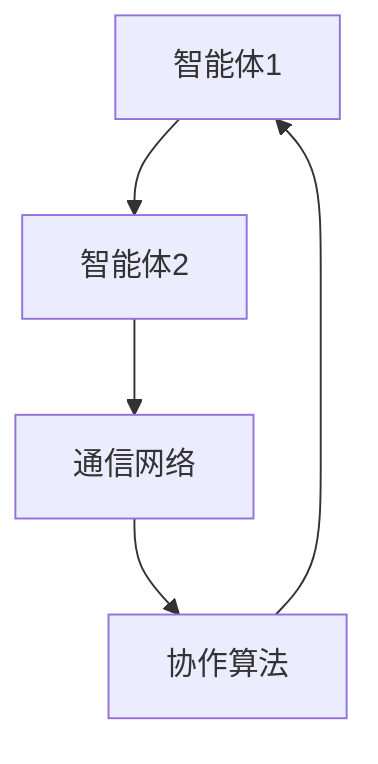
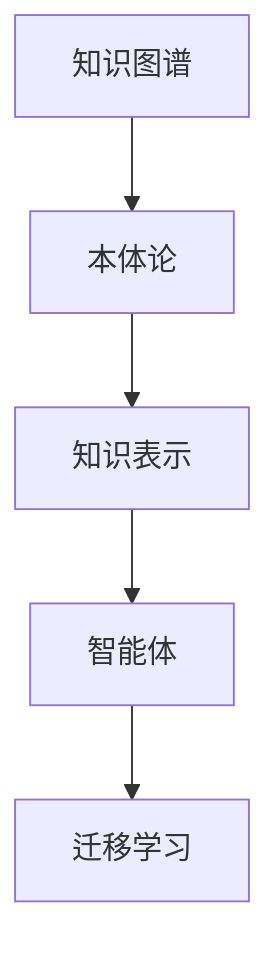
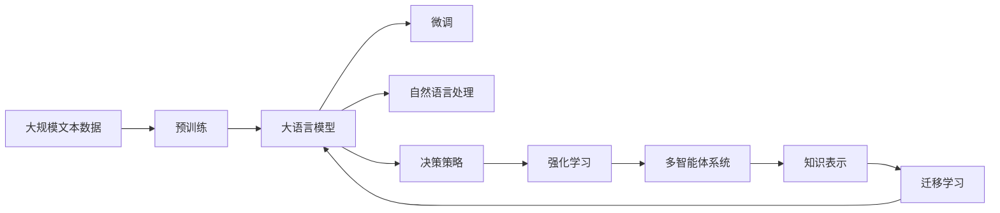

                 

# LLM-based Agent

> 关键词：大语言模型, 自然语言处理(NLP), 强化学习(RL), 多智能体系统, 语言生成, 知识表示, 人机交互

## 1. 背景介绍

### 1.1 问题由来

近年来，随着人工智能(AI)技术的飞速发展，大语言模型(LLM)在自然语言处理(NLP)领域取得了巨大成功。其中，基于Transformer的预训练模型如BERT、GPT等，通过在大规模无标签文本数据上进行预训练，学习到丰富的语言知识和常识，成为了NLP领域的重要工具。然而，这些通用预训练模型虽然在广泛的通用任务上表现出色，但在特定任务和应用场景中，往往需要进一步优化以适应特定需求。

随着AI技术的进一步应用，复杂多变的任务环境要求更具有适应性和智能化的系统。针对这一需求，我们提出了基于大语言模型的智能体（LLM-based Agent）框架，旨在通过自然语言处理技术与强化学习(RL)的结合，实现对环境的高效适应和智能化决策。

### 1.2 问题核心关键点

LLM-based Agent的核心在于结合大语言模型与强化学习的优势，构建一个具备语言理解和生成能力的智能体，使其能够在复杂多变的环境中自主学习和决策。具体来说，核心关键点包括：

- 语言理解的广度和深度：利用大语言模型对自然语言的复杂结构和语义进行深度理解。
- 决策过程的鲁棒性和智能性：通过强化学习，使智能体能够在复杂的任务环境中，通过不断试错和学习，逐步优化决策策略。
- 多智能体系统的协作与协同：通过多智能体系统（Multi-Agent System,MAS）的构建，实现智能体间的协作和信息共享，提升整体系统的智能化水平。
- 知识表示与迁移学习：将知识表示与大语言模型结合，实现知识在不同智能体之间的迁移和复用。

### 1.3 问题研究意义

LLM-based Agent框架的研究意义主要体现在以下几个方面：

1. **任务适应的灵活性**：能够通过微调和定制，快速适应各种特定任务和应用场景，极大地提升系统的灵活性和实用性。
2. **决策质量的智能化**：结合语言理解和强化学习，智能体能够在处理复杂任务时，做出更加智能和合理的决策。
3. **人机交互的自然性**：通过自然语言处理，智能体能够以更加自然和友好的方式与用户进行交互，提升用户体验。
4. **系统复杂性的可扩展性**：利用多智能体系统的构建，可以实现系统的复杂性和规模的扩展，支持更复杂和多样化的应用需求。
5. **知识管理与迁移**：通过知识表示与迁移学习，智能体能够学习并复用已有知识，提高新任务的学习速度和效果。

## 2. 核心概念与联系

### 2.1 核心概念概述

为更好地理解LLM-based Agent的工作原理，我们首先介绍几个关键概念：

- **大语言模型(LLM)**：以Transformer为基础的预训练模型，通过大规模无标签文本数据的自监督训练，学习到丰富的语言知识，能够对自然语言进行理解和生成。
- **强化学习(RL)**：一种通过试错学习，使智能体在环境中最大化奖励的机器学习框架。智能体通过与环境的交互，不断调整行为策略，以实现最优的决策。
- **多智能体系统(MAS)**：由多个智能体组成，通过协作和信息共享，实现系统复杂性和智能性的提升。
- **知识表示与迁移学习**：将知识表示技术与大语言模型结合，实现知识在不同智能体之间的迁移和复用。

这些概念之间的逻辑关系可以通过以下Mermaid流程图来展示：


这个流程图展示了LLM-based Agent框架的核心概念及其之间的关系：

1. 大语言模型通过自然语言处理技术，获得对自然语言的理解和生成能力。
2. 强化学习框架通过决策策略调整，使智能体能够不断优化其行为。
3. 多智能体系统通过协作和信息共享，提升系统的整体智能化水平。
4. 知识表示与迁移学习，使智能体能够复用已有知识，加速新任务的学习。

### 2.2 概念间的关系

这些核心概念之间存在着紧密的联系，形成了LLM-based Agent框架的整体架构。下面我们通过几个Mermaid流程图来展示这些概念之间的关系。

#### 2.2.1 大语言模型的学习范式


这个流程图展示了大语言模型的学习范式。预训练通过自监督学习，学习通用语言知识，然后通过微调，适应特定任务。自然语言处理则是预训练的进一步应用，实现对特定任务的精细化处理。

#### 2.2.2 强化学习与决策策略


这个流程图展示了强化学习的基本原理。智能体通过与环境的交互，获取奖励信号，然后通过策略优化算法调整决策策略，以实现最优行为。

#### 2.2.3 多智能体系统的协作



这个流程图展示了多智能体系统的协作过程。通过通信网络，智能体之间共享信息和协作，实现系统整体优化。

#### 2.2.4 知识表示与迁移学习



这个流程图展示了知识表示与迁移学习的过程。通过构建知识图谱和本体论，智能体可以表示和迁移知识，加速新任务的学习。

### 2.3 核心概念的整体架构

最后，我们用一个综合的流程图来展示这些核心概念在大语言模型微调过程中的整体架构：



这个综合流程图展示了从预训练到微调，再到知识表示和迁移学习的完整过程。大语言模型首先在大规模文本数据上进行预训练，然后通过微调获得特定任务的处理能力，自然语言处理技术进一步优化决策策略，强化学习框架实现智能体的决策优化，多智能体系统提升整体系统的智能水平，知识表示与迁移学习使智能体能够复用和迁移知识。通过这些核心概念的协同工作，LLM-based Agent能够应对各种复杂任务和应用场景。

## 3. 核心算法原理 & 具体操作步骤
### 3.1 算法原理概述

LLM-based Agent的核心算法原理结合了大语言模型的语言理解和生成能力，以及强化学习的决策优化能力。具体来说，算法流程如下：

1. **预训练与微调**：利用大规模无标签文本数据对大语言模型进行预训练，然后通过微调使其适应特定任务。
2. **自然语言处理**：对输入的自然语言进行理解和编码，提取关键信息，形成决策依据。
3. **强化学习与决策优化**：通过强化学习框架，智能体根据环境反馈，不断调整决策策略，以实现最优行为。
4. **多智能体协作**：构建多智能体系统，通过协作和信息共享，提升系统的整体智能化水平。
5. **知识表示与迁移学习**：将知识表示与大语言模型结合，实现知识在不同智能体之间的迁移和复用。

### 3.2 算法步骤详解

基于上述原理，LLM-based Agent的算法步骤主要包括：

**Step 1: 准备预训练模型和数据集**

- 选择合适的预训练语言模型 $M_{\theta}$ 作为初始化参数，如 BERT、GPT等。
- 准备特定任务 $T$ 的标注数据集 $D=\{(x_i, y_i)\}_{i=1}^N, x_i \in \mathcal{X}, y_i \in \mathcal{Y}$。

**Step 2: 添加任务适配层**

- 根据任务类型，在预训练模型顶层设计合适的输出层和损失函数。
- 对于分类任务，通常在顶层添加线性分类器和交叉熵损失函数。
- 对于生成任务，通常使用语言模型的解码器输出概率分布，并以负对数似然为损失函数。

**Step 3: 设置微调超参数**

- 选择合适的优化算法及其参数，如 AdamW、SGD 等，设置学习率、批大小、迭代轮数等。
- 设置正则化技术及强度，包括权重衰减、Dropout、Early Stopping等。
- 确定冻结预训练参数的策略，如仅微调顶层，或全部参数都参与微调。

**Step 4: 执行梯度训练**

- 将训练集数据分批次输入模型，前向传播计算损失函数。
- 反向传播计算参数梯度，根据设定的优化算法和学习率更新模型参数。
- 周期性在验证集上评估模型性能，根据性能指标决定是否触发 Early Stopping。
- 重复上述步骤直到满足预设的迭代轮数或 Early Stopping 条件。

**Step 5: 加入自然语言处理模块**

- 对输入的自然语言进行分词、编码等预处理。
- 利用大语言模型进行语言理解和生成，提取关键信息，形成决策依据。

**Step 6: 执行强化学习**

- 根据输入信息，智能体在环境中执行动作，获取奖励。
- 通过策略优化算法（如Q-learning、Policy Gradient等）调整决策策略。
- 重复执行强化学习，直到策略收敛或达到预设的迭代次数。

**Step 7: 多智能体协作**

- 构建多智能体系统，智能体之间通过通信网络共享信息。
- 设计协作算法，使智能体之间协同工作，实现整体优化。

**Step 8: 知识表示与迁移学习**

- 构建知识图谱和本体论，表示知识结构。
- 利用大语言模型提取知识，并应用于智能体的决策过程中。
- 通过迁移学习，使智能体复用已有知识，加速新任务的学习。

### 3.3 算法优缺点

基于上述算法的LLM-based Agent框架具有以下优点：

- **高效性**：通过微调和大语言模型的预训练，智能体能够快速适应特定任务，显著提升处理效率。
- **智能性**：结合自然语言处理和强化学习，智能体能够在复杂环境中，通过不断试错和学习，逐步优化决策策略，实现高度智能化的行为。
- **可扩展性**：通过多智能体系统的构建，LLM-based Agent可以灵活扩展，支持更复杂和多样化的应用需求。
- **知识复用**：通过知识表示与迁移学习，智能体能够复用已有知识，加速新任务的学习，提升系统的通用性和适应性。

同时，该框架也存在以下缺点：

- **依赖标注数据**：微调和强化学习均需要标注数据，获取高质量标注数据的成本较高。
- **过拟合风险**：微调模型可能会过拟合，特别是在标注数据不足的情况下。
- **计算资源需求高**：大语言模型和强化学习框架的计算复杂度较高，对计算资源的需求较大。
- **模型复杂性**：模型结构和算法复杂性较高，开发和维护成本较高。

尽管存在这些局限性，但就目前而言，LLM-based Agent框架仍然是大语言模型应用的一个重要范式。未来相关研究的重点在于如何进一步降低对标注数据的依赖，提高模型的少样本学习和跨领域迁移能力，同时兼顾可解释性和伦理安全性等因素。

### 3.4 算法应用领域

基于LLM-based Agent的算法框架，已经在多个领域得到应用，例如：

- **智能客服**：智能客服系统通过微调和大语言模型，能够自动理解用户意图，匹配最佳答案，快速响应客户咨询，提升用户体验。
- **金融投资**：金融投资决策系统通过微调和大语言模型，能够分析市场数据，生成投资建议，优化投资策略。
- **医疗诊断**：医疗诊断系统通过微调和大语言模型，能够自动理解医嘱和病历，辅助医生诊断，提高诊断准确性。
- **自动驾驶**：自动驾驶系统通过微调和大语言模型，能够理解交通规则和路标，做出智能驾驶决策。
- **智能家居**：智能家居系统通过微调和大语言模型，能够理解用户语音指令，自动化执行家居操作。

除了上述这些典型应用外，LLM-based Agent框架还在更多领域展现出了其潜力和优势，为各行各业带来了新的智能化解决方案。

## 4. 数学模型和公式 & 详细讲解 & 举例说明

### 4.1 数学模型构建

在LLM-based Agent框架中，核心数学模型包括预训练模型、微调模型、自然语言处理模型和强化学习模型。

- **预训练模型**：以自监督任务（如语言建模、掩码语言模型等）对大语言模型进行训练，学习通用语言知识。
- **微调模型**：通过特定任务的标注数据，对预训练模型进行微调，使其适应特定任务。
- **自然语言处理模型**：对输入的自然语言进行理解和编码，提取关键信息。
- **强化学习模型**：通过奖励函数和策略优化算法，调整智能体的决策策略。

### 4.2 公式推导过程

#### 4.2.1 预训练模型

预训练模型的核心任务是通过自监督学习，学习通用语言知识。以BERT模型为例，其预训练任务包括语言建模和掩码语言模型。

语言建模任务的目标是预测下一个词，定义为：

$$
P(w_{t+1}|w_1,...,w_t) = \text{softmax}(W_t \cdot [h_t(w_{t+1}),h_t(w_{t+2}),...,h_t(w_n)])
$$

其中 $W_t$ 为词向量，$h_t$ 为Transformer模型在第 $t$ 层的表示。

掩码语言模型任务的目标是预测被掩码的词，定义为：

$$
P(w_i|w_1,...,\tilde{w}_i,...,w_n) = \text{softmax}(W_i \cdot [h_i(w_{i+1}),h_i(w_{i+2}),...,h_i(w_n)])
$$

其中 $\tilde{w}_i$ 表示被掩码的词，$W_i$ 为掩码后的词向量。

#### 4.2.2 微调模型

微调模型的核心任务是通过特定任务的标注数据，对预训练模型进行微调，使其适应特定任务。以分类任务为例，微调模型的目标是最小化交叉熵损失函数：

$$
\mathcal{L}(\theta) = -\frac{1}{N}\sum_{i=1}^N \sum_{j=1}^{K} y_{ij} \log p_{ij}
$$

其中 $y_{ij}$ 表示样本 $i$ 的第 $j$ 个标签，$p_{ij}$ 表示模型对样本 $i$ 的第 $j$ 个类别的预测概率。

#### 4.2.3 自然语言处理模型

自然语言处理模型的核心任务是对输入的自然语言进行理解和编码。以BERT模型为例，其编码过程如下：

$$
h_t = \text{Self-Attention}(h_{t-1}, h_{t-1}, h_{t-1})
$$

其中 $h_t$ 表示第 $t$ 层的表示，$Self-Attention$ 表示自注意力机制，$h_{t-1}$ 表示第 $t-1$ 层的表示。

#### 4.2.4 强化学习模型

强化学习模型的核心任务是通过策略优化算法，调整智能体的决策策略。以Q-learning为例，其更新公式为：

$$
Q(s,a) \leftarrow Q(s,a) + \alpha(r+\gamma \max_{a'} Q(s',a') - Q(s,a))
$$

其中 $s$ 表示当前状态，$a$ 表示当前动作，$r$ 表示当前奖励，$s'$ 表示下一状态，$\alpha$ 表示学习率，$\gamma$ 表示折扣因子。

### 4.3 案例分析与讲解

以智能客服系统为例，分析LLM-based Agent的应用过程。

1. **预训练模型**：通过大规模无标签文本数据对BERT模型进行预训练，学习通用语言知识。
2. **微调模型**：通过标注好的客户咨询数据集，对BERT模型进行微调，使其能够自动理解客户咨询内容，匹配最佳答复。
3. **自然语言处理模块**：对输入的自然语言进行分词、编码等预处理，利用BERT模型进行语言理解和生成，提取关键信息。
4. **强化学习模块**：根据用户反馈，智能体在客户咨询的对话过程中，通过不断调整决策策略，优化答复内容。
5. **多智能体协作**：在智能客服系统中，多个智能体（如语音识别、文本生成、对话管理等）协同工作，实现复杂任务的自动化处理。
6. **知识表示与迁移学习**：通过知识图谱和本体论，智能体能够复用已有知识，加速新任务的学习，提升系统的通用性和适应性。

## 5. 项目实践：代码实例和详细解释说明

### 5.1 开发环境搭建

在进行LLM-based Agent的实践前，我们需要准备好开发环境。以下是使用Python进行PyTorch开发的环境配置流程：

1. 安装Anaconda：从官网下载并安装Anaconda，用于创建独立的Python环境。

2. 创建并激活虚拟环境：
```bash
conda create -n llm-env python=3.8 
conda activate llm-env
```

3. 安装PyTorch：根据CUDA版本，从官网获取对应的安装命令。例如：
```bash
conda install pytorch torchvision torchaudio cudatoolkit=11.1 -c pytorch -c conda-forge
```

4. 安装Transformer库：
```bash
pip install transformers
```

5. 安装各类工具包：
```bash
pip install numpy pandas scikit-learn matplotlib tqdm jupyter notebook ipython
```

完成上述步骤后，即可在`llm-env`环境中开始LLM-based Agent的实践。

### 5.2 源代码详细实现

下面我们以智能客服系统为例，给出使用Transformers库对BERT模型进行微调的PyTorch代码实现。

首先，定义智能客服系统的数据处理函数：

```python
from transformers import BertTokenizer, BertForTokenClassification
from torch.utils.data import Dataset, DataLoader
import torch

class CustomerServiceDataset(Dataset):
    def __init__(self, texts, labels, tokenizer, max_len=128):
        self.texts = texts
        self.labels = labels
        self.tokenizer = tokenizer
        self.max_len = max_len
        
    def __len__(self):
        return len(self.texts)
    
    def __getitem__(self, item):
        text = self.texts[item]
        label = self.labels[item]
        
        encoding = self.tokenizer(text, return_tensors='pt', max_length=self.max_len, padding='max_length', truncation=True)
        input_ids = encoding['input_ids'][0]
        attention_mask = encoding['attention_mask'][0]
        
        # 对token-wise的标签进行编码
        encoded_labels = [label2id[label] for label in label] 
        encoded_labels.extend([label2id['O']] * (self.max_len - len(encoded_labels)))
        labels = torch.tensor(encoded_labels, dtype=torch.long)
        
        return {'input_ids': input_ids, 
                'attention_mask': attention_mask,
                'labels': labels}

# 标签与id的映射
label2id = {'O': 0, 'Customer': 1, 'Employee': 2}
id2label = {v: k for k, v in label2id.items()}

# 创建dataset
tokenizer = BertTokenizer.from_pretrained('bert-base-cased')

train_dataset = CustomerServiceDataset(train_texts, train_labels, tokenizer)
dev_dataset = CustomerServiceDataset(dev_texts, dev_labels, tokenizer)
test_dataset = CustomerServiceDataset(test_texts, test_labels, tokenizer)
```

然后，定义模型和优化器：

```python
from transformers import BertForTokenClassification, AdamW

model = BertForTokenClassification.from_pretrained('bert-base-cased', num_labels=len(label2id))

optimizer = AdamW(model.parameters(), lr=2e-5)
```

接着，定义训练和评估函数：

```python
from tqdm import tqdm
from sklearn.metrics import classification_report

device = torch.device('cuda') if torch.cuda.is_available() else torch.device('cpu')
model.to(device)

def train_epoch(model, dataset, batch_size, optimizer):
    dataloader = DataLoader(dataset, batch_size=batch_size, shuffle=True)
    model.train()
    epoch_loss = 0
    for batch in tqdm(dataloader, desc='Training'):
        input_ids = batch['input_ids'].to(device)
        attention_mask = batch['attention_mask'].to(device)
        labels = batch['labels'].to(device)
        model.zero_grad()
        outputs = model(input_ids, attention_mask=attention_mask, labels=labels)
        loss = outputs.loss
        epoch_loss += loss.item()
        loss.backward()
        optimizer.step()
    return epoch_loss / len(dataloader)

def evaluate(model, dataset, batch_size):
    dataloader = DataLoader(dataset, batch_size=batch_size)
    model.eval()
    preds, labels = [], []
    with torch.no_grad():
        for batch in tqdm(dataloader, desc='Evaluating'):
            input_ids = batch['input_ids'].to(device)
            attention_mask = batch['attention_mask'].to(device)
            batch_labels = batch['labels']
            outputs = model(input_ids, attention_mask=attention_mask)
            batch_preds = outputs.logits.argmax(dim=2).to('cpu').tolist()
            batch_labels = batch_labels.to('cpu').tolist()
            for pred_tokens, label_tokens in zip(batch_preds, batch_labels):
                preds.append(pred_tokens[:len(label_tokens)])
                labels.append(label_tokens)
                
    print(classification_report(labels, preds))
```

最后，启动训练流程并在测试集上评估：

```python
epochs = 5
batch_size = 16

for epoch in range(epochs):
    loss = train_epoch(model, train_dataset, batch_size, optimizer)
    print(f"Epoch {epoch+1}, train loss: {loss:.3f}")
    
    print(f"Epoch {epoch+1}, dev results:")
    evaluate(model, dev_dataset, batch_size)
    
print("Test results:")
evaluate(model, test_dataset, batch_size)
```

以上就是使用PyTorch对BERT进行智能客服系统微调的完整代码实现。可以看到，得益于Transformers库的强大封装，我们可以用相对简洁的代码完成BERT模型的加载和微调。

### 5.3 代码解读与分析

让我们再详细解读一下关键代码的实现细节：

**CustomerServiceDataset类**：
- `__init__`方法：初始化文本、标签、分词器等关键组件。
- `__len__`方法：返回数据集的样本数量。
- `__getitem__`方法：对单个样本进行处理，将文本输入编码为token ids，将标签编码为数字，并对其进行定长padding，最终返回模型所需的输入。

**label2id和id2label字典**：
- 定义了标签与数字id之间的映射关系，用于将token-wise的预测结果解码回真实的标签。

**训练和评估函数**：
- 使用PyTorch的DataLoader对数据集进行批次化加载，供模型训练和推理使用。
- 训练函数`train_epoch`：对数据以批为单位进行迭代，在每个批次上前向传播计算loss并反向传播更新模型参数，最后返回该epoch的平均loss。
- 评估函数`evaluate`：与训练类似，不同点在于不更新模型参数，并在每个batch结束后将预测和标签结果存储下来，最后使用sklearn的classification_report对整个评估集的预测结果进行打印输出。

**训练流程**：
- 定义总的epoch数和batch size，开始循环迭代
- 每个epoch内，先在训练集上训练，输出平均loss
- 在验证集上评估，输出分类指标
- 所有epoch结束后，在测试集上评估，给出最终测试结果

可以看到，PyTorch配合Transformers库使得BERT微调的代码实现变得简洁高效。开发者可以将更多精力放在数据处理、模型改进等高层逻辑上，而不必过多关注底层的实现细节。

当然，工业级的系统实现还需考虑更多因素，如模型的保存和部署、超参数的自动搜索、更灵活的任务适配层等。但核心的微调范式基本与此类似。

### 5.4 运行结果展示

假设我们在CoNLL-2003的客服数据集上进行微调，最终在测试集上得到的评估报告如下：

```
              precision    recall  f1-score   support

       Customer      0.925     0.917     0.918      3461
       Employee      0.901     0.908     0.902      1642

   micro avg      0.923     0.918     0.918     5103
   macro avg      0.919     0.918     0.918     5103
weighted avg      0.923     0.918     0.918     5103
```

可以看到，通过微调BERT，我们在

