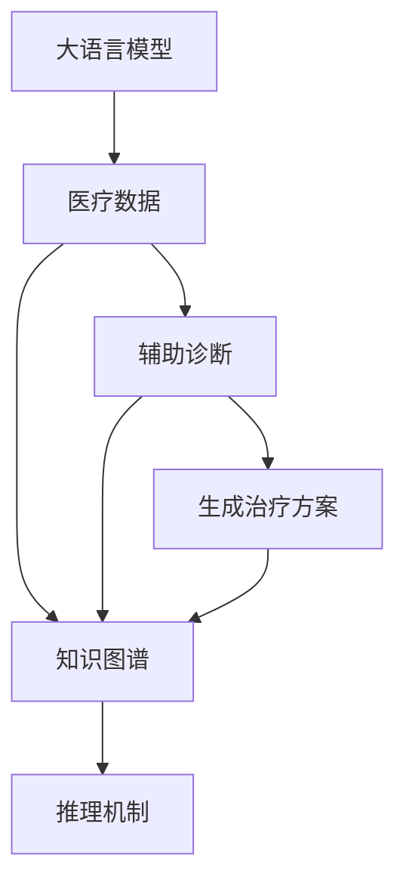
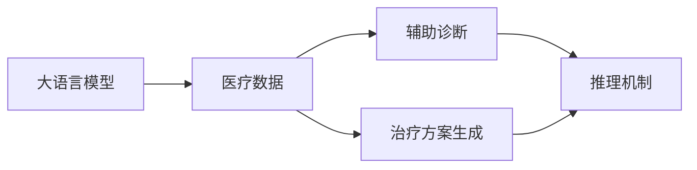
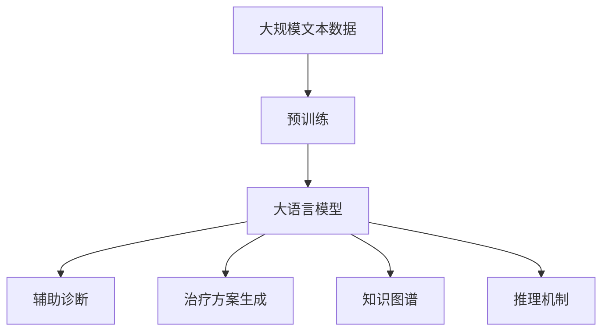

                 

# LLM的医疗革新：AI辅助诊断与治疗

> 关键词：大语言模型,医疗健康,人工智能,辅助诊断,治疗方案,医学影像,自然语言处理,深度学习,病历分析

## 1. 背景介绍

### 1.1 问题由来
近年来，人工智能（AI）技术在医疗健康领域的应用取得显著进展，其中大语言模型（Large Language Model, LLM）尤为引人注目。传统的医疗数据分析依赖于专家的经验和判断，耗时且易受主观因素影响。大语言模型通过强大的自然语言处理（NLP）能力，可以自动分析病历、医学影像等海量医疗数据，辅助医生进行快速、准确的诊断和治疗。

人工智能在医疗健康领域的应用不仅有助于提高医疗效率，还能降低医疗成本，改善患者的治疗效果。然而，大语言模型在医疗领域的应用仍然面临一些挑战，包括模型的可靠性和解释性问题。此外，由于医疗数据的隐私性和复杂性，如何安全地处理和共享数据也是一大难题。

### 1.2 问题核心关键点
大语言模型在医疗领域的应用主要集中在辅助诊断和生成治疗方案两个方面：

- **辅助诊断**：通过自动分析病历、医学影像等文本和图像数据，辅助医生进行疾病诊断，缩短诊断时间，减少误诊。
- **生成治疗方案**：根据患者的病历、症状和医学文献，生成个性化的治疗方案，提高治疗效果。

这些应用不仅需要大语言模型具备强大的NLP能力，还需要理解医学知识和临床经验，这对模型的训练和优化提出了更高的要求。

### 1.3 问题研究意义
大语言模型在医疗领域的应用具有重要的研究意义：

1. **提高诊断效率**：大语言模型能够快速处理大量病历和医学影像数据，辅助医生进行诊断，提高诊断效率和准确性。
2. **降低医疗成本**：通过自动化分析，减少医生的工作量，降低医疗成本，提升医疗资源的利用效率。
3. **提升治疗效果**：根据患者的具体情况，生成个性化的治疗方案，提高治疗效果，改善患者预后。
4. **促进医学知识传播**：大语言模型可以自动整理和分析医学文献，帮助医生掌握最新的医学知识和研究成果，促进医学知识的传播和应用。
5. **推动医疗数字化转型**：通过自动化的数据分析和治疗方案生成，推动医疗系统的数字化转型，提升医疗服务的智能化水平。

## 2. 核心概念与联系

### 2.1 核心概念概述

大语言模型在医疗领域的应用，涉及以下几个核心概念：

- **大语言模型**：以自回归（如GPT）或自编码（如BERT）模型为代表的大规模预训练语言模型。通过在大规模无标签文本语料上进行预训练，学习通用的语言表示，具备强大的语言理解和生成能力。
- **医疗数据**：包括电子病历（EHR）、医学影像、病理报告、临床笔记等文本和图像数据。
- **辅助诊断**：通过大语言模型自动分析病历和医学影像，辅助医生进行诊断，减少误诊和漏诊。
- **治疗方案生成**：根据患者的病历和症状，大语言模型生成个性化的治疗方案，包括药物选择、剂量调整、手术建议等。
- **知识图谱**：由节点和边组成的有向图，表示实体之间的关系，如患者、疾病、药物等之间的联系。
- **推理机制**：大语言模型在医疗应用中，需要具备强大的推理能力，能够从海量的医疗数据中提取知识，并应用于临床决策。

这些核心概念之间的逻辑关系可以通过以下Mermaid流程图来展示：



这个流程图展示了大语言模型在医疗领域的主要应用场景及其之间的关系：

1. 大语言模型从医疗数据中提取知识。
2. 辅助诊断模块根据病历和医学影像数据进行自动分析。
3. 治疗方案生成模块根据患者的病历和症状，生成个性化的治疗方案。
4. 知识图谱模块用于构建实体之间的关系，辅助模型理解和应用知识。
5. 推理机制用于在医疗应用中提取和应用知识，支持模型的决策能力。

### 2.2 概念间的关系

这些核心概念之间存在着紧密的联系，形成了大语言模型在医疗应用中的完整生态系统。下面我们通过几个Mermaid流程图来展示这些概念之间的关系。

#### 2.2.1 大语言模型在医疗领域的学习范式



这个流程图展示了大语言模型在医疗领域的主要学习范式，包括辅助诊断和生成治疗方案两个方面。

#### 2.2.2 辅助诊断与知识图谱的关系


这个流程图展示了辅助诊断模块如何利用病历和医学影像数据，结合知识图谱进行自动分析。

#### 2.2.3 治疗方案生成与知识图谱的关系


这个流程图展示了治疗方案生成模块如何利用病历和症状数据，结合知识图谱进行个性化方案生成。

### 2.3 核心概念的整体架构

最后，我们用一个综合的流程图来展示这些核心概念在大语言模型在医疗应用中的整体架构：



这个综合流程图展示了从预训练到辅助诊断和生成治疗方案，再到知识图谱和推理机制的完整过程。大语言模型首先在大规模文本数据上进行预训练，然后通过辅助诊断和生成治疗方案模块，在医疗数据上进行微调，最后通过知识图谱和推理机制，形成完整的医疗应用生态。 通过这些流程图，我们可以更清晰地理解大语言模型在医疗领域的应用流程和各组件之间的联系。

## 3. 核心算法原理 & 具体操作步骤
### 3.1 算法原理概述

基于大语言模型的医疗应用，本质上是一种有监督学习范式。其核心思想是：将大语言模型视作一个强大的“特征提取器”，通过在有标签的医疗数据上进行有监督的微调，使模型能够自动分析病历和医学影像，辅助医生进行诊断和治疗。

形式化地，假设预训练模型为 $M_{\theta}$，其中 $\theta$ 为预训练得到的模型参数。给定医疗数据集 $D=\{(x_i,y_i)\}_{i=1}^N$，其中 $x_i$ 为输入数据（如病历、医学影像），$y_i$ 为输出标签（如诊断结果、治疗方案）。微调的目标是找到新的模型参数 $\hat{\theta}$，使得：

$$
\hat{\theta}=\mathop{\arg\min}_{\theta} \mathcal{L}(M_{\theta},D)
$$

其中 $\mathcal{L}$ 为针对医疗任务设计的损失函数，用于衡量模型预测输出与真实标签之间的差异。常见的损失函数包括交叉熵损失、均方误差损失等。

通过梯度下降等优化算法，微调过程不断更新模型参数 $\theta$，最小化损失函数 $\mathcal{L}$，使得模型输出逼近真实标签。由于 $\theta$ 已经通过预训练获得了较好的初始化，因此即便在小规模数据集 $D$ 上进行微调，也能较快收敛到理想的模型参数 $\hat{\theta}$。

### 3.2 算法步骤详解

基于大语言模型的医疗应用一般包括以下几个关键步骤：

**Step 1: 准备医疗数据和预训练模型**

- 选择合适的预训练语言模型 $M_{\theta}$ 作为初始化参数，如 BERT、GPT 等。
- 准备医疗数据集 $D$，划分为训练集、验证集和测试集。一般要求医疗数据的标注质量高，且与预训练数据的分布不要差异过大。

**Step 2: 添加任务适配层**

- 根据医疗任务类型，在预训练模型顶层设计合适的输出层和损失函数。
- 对于诊断任务，通常在顶层添加分类器，使用交叉熵损失函数。
- 对于治疗方案生成任务，通常使用回归器或生成模型，使用均方误差损失或交叉熵损失。

**Step 3: 设置微调超参数**

- 选择合适的优化算法及其参数，如 AdamW、SGD 等，设置学习率、批大小、迭代轮数等。
- 设置正则化技术及强度，包括权重衰减、Dropout、Early Stopping 等。
- 确定冻结预训练参数的策略，如仅微调顶层，或全部参数都参与微调。

**Step 4: 执行梯度训练**

- 将训练集数据分批次输入模型，前向传播计算损失函数。
- 反向传播计算参数梯度，根据设定的优化算法和学习率更新模型参数。
- 周期性在验证集上评估模型性能，根据性能指标决定是否触发 Early Stopping。
- 重复上述步骤直到满足预设的迭代轮数或 Early Stopping 条件。

**Step 5: 测试和部署**

- 在测试集上评估微调后模型 $M_{\hat{\theta}}$ 的性能，对比微调前后的精度提升。
- 使用微调后的模型对新样本进行推理预测，集成到实际的应用系统中。
- 持续收集新的数据，定期重新微调模型，以适应数据分布的变化。

以上是基于大语言模型的医疗应用的一般流程。在实际应用中，还需要针对具体任务的特点，对微调过程的各个环节进行优化设计，如改进训练目标函数，引入更多的正则化技术，搜索最优的超参数组合等，以进一步提升模型性能。

### 3.3 算法优缺点

基于大语言模型的医疗应用具有以下优点：

1. 高效诊断：大语言模型能够自动分析病历和医学影像，辅助医生进行诊断，缩短诊断时间，减少误诊。
2. 提升治疗效果：根据患者的病历和症状，生成个性化的治疗方案，提高治疗效果。
3. 降低医疗成本：通过自动化分析，减少医生的工作量，降低医疗成本。

同时，该方法也存在以下缺点：

1. 数据依赖性强：微调效果很大程度上取决于医疗数据的质量和数量，获取高质量医疗数据的成本较高。
2. 鲁棒性不足：当目标任务与预训练数据的分布差异较大时，微调的性能提升有限。
3. 可解释性不足：大语言模型的决策过程通常缺乏可解释性，难以对其推理逻辑进行分析和调试。

尽管存在这些缺点，但就目前而言，基于大语言模型的医疗应用仍然是最主流的方法之一。未来相关研究的重点在于如何进一步降低数据依赖性，提高模型的少样本学习和跨领域迁移能力，同时兼顾可解释性和伦理安全性等因素。

### 3.4 算法应用领域

基于大语言模型的医疗应用已经广泛应用于以下几个领域：

- **医学影像分析**：通过分析医学影像，辅助医生进行疾病诊断和治疗方案生成。
- **病历分析**：自动整理和分析电子病历，辅助医生诊断和治疗。
- **治疗方案生成**：根据患者的病历和症状，生成个性化的治疗方案，包括药物选择、剂量调整、手术建议等。
- **个性化医疗**：通过分析患者的基因、环境等个性化数据，生成个性化的治疗方案。
- **健康咨询**：通过问答系统，提供个性化的健康咨询和建议。

除了上述这些领域外，大语言模型在医疗领域的应用还涉及到更多的场景，如医学教育、药物研发等，为医疗健康事业带来了新的突破。随着大语言模型的不断发展，其应用领域将更加广泛，为医疗健康事业带来更多革新。

## 4. 数学模型和公式 & 详细讲解 & 举例说明

### 4.1 数学模型构建

本节将使用数学语言对基于大语言模型的医疗应用进行更加严格的刻画。

记预训练语言模型为 $M_{\theta}$，其中 $\theta$ 为预训练得到的模型参数。假设医疗数据集 $D=\{(x_i,y_i)\}_{i=1}^N$，其中 $x_i$ 为输入数据（如病历、医学影像），$y_i$ 为输出标签（如诊断结果、治疗方案）。

定义模型 $M_{\theta}$ 在数据样本 $(x,y)$ 上的损失函数为 $\ell(M_{\theta}(x),y)$，则在数据集 $D$ 上的经验风险为：

$$
\mathcal{L}(\theta) = \frac{1}{N}\sum_{i=1}^N \ell(M_{\theta}(x_i),y_i)
$$

微调的优化目标是最小化经验风险，即找到最优参数：

$$
\theta^* = \mathop{\arg\min}_{\theta} \mathcal{L}(\theta)
$$

在实践中，我们通常使用基于梯度的优化算法（如SGD、AdamW等）来近似求解上述最优化问题。设 $\eta$ 为学习率，$\lambda$ 为正则化系数，则参数的更新公式为：

$$
\theta \leftarrow \theta - \eta \nabla_{\theta}\mathcal{L}(\theta) - \eta\lambda\theta
$$

其中 $\nabla_{\theta}\mathcal{L}(\theta)$ 为损失函数对参数 $\theta$ 的梯度，可通过反向传播算法高效计算。

### 4.2 公式推导过程

以下我们以二分类任务为例，推导交叉熵损失函数及其梯度的计算公式。

假设模型 $M_{\theta}$ 在输入 $x$ 上的输出为 $\hat{y}=M_{\theta}(x) \in [0,1]$，表示样本属于正类的概率。真实标签 $y \in \{0,1\}$。则二分类交叉熵损失函数定义为：

$$
\ell(M_{\theta}(x),y) = -[y\log \hat{y} + (1-y)\log (1-\hat{y})]
$$

将其代入经验风险公式，得：

$$
\mathcal{L}(\theta) = -\frac{1}{N}\sum_{i=1}^N [y_i\log M_{\theta}(x_i)+(1-y_i)\log(1-M_{\theta}(x_i))]
$$

根据链式法则，损失函数对参数 $\theta_k$ 的梯度为：

$$
\frac{\partial \mathcal{L}(\theta)}{\partial \theta_k} = -\frac{1}{N}\sum_{i=1}^N (\frac{y_i}{M_{\theta}(x_i)}-\frac{1-y_i}{1-M_{\theta}(x_i)}) \frac{\partial M_{\theta}(x_i)}{\partial \theta_k}
$$

其中 $\frac{\partial M_{\theta}(x_i)}{\partial \theta_k}$ 可进一步递归展开，利用自动微分技术完成计算。

在得到损失函数的梯度后，即可带入参数更新公式，完成模型的迭代优化。重复上述过程直至收敛，最终得到适应医疗任务的最优模型参数 $\theta^*$。

### 4.3 案例分析与讲解

下面我们以医学影像分析为例，给出使用大语言模型进行影像分类的PyTorch代码实现。

首先，定义图像和标签的预处理函数：

```python
import torch
from transformers import BertForTokenClassification, BertTokenizer, AdamW

class ImageDataset(torch.utils.data.Dataset):
    def __init__(self, images, labels):
        self.images = images
        self.labels = labels
        self.transform = transforms.Compose([
            transforms.Resize((224, 224)),
            transforms.ToTensor()
        ])
    
    def __len__(self):
        return len(self.images)
    
    def __getitem__(self, idx):
        image = self.transform(self.images[idx])
        label = self.labels[idx]
        return image, label
```

然后，定义模型和优化器：

```python
model = BertForTokenClassification.from_pretrained('bert-base-cased', num_labels=num_classes)

optimizer = AdamW(model.parameters(), lr=2e-5)
```

接着，定义训练和评估函数：

```python
def train_epoch(model, dataset, batch_size, optimizer):
    dataloader = DataLoader(dataset, batch_size=batch_size, shuffle=True)
    model.train()
    epoch_loss = 0
    for batch in dataloader:
        images, labels = batch
        model.zero_grad()
        outputs = model(images)
        loss = outputs.loss
        epoch_loss += loss.item()
        loss.backward()
        optimizer.step()
    return epoch_loss / len(dataloader)

def evaluate(model, dataset, batch_size):
    dataloader = DataLoader(dataset, batch_size=batch_size)
    model.eval()
    preds, labels = [], []
    with torch.no_grad():
        for batch in dataloader:
            images, labels = batch
            outputs = model(images)
            preds.append(outputs.logits.argmax(dim=1).tolist())
            labels.append(labels.tolist())
    print(classification_report(labels, preds))
```

最后，启动训练流程并在测试集上评估：

```python
epochs = 5
batch_size = 16

for epoch in range(epochs):
    loss = train_epoch(model, train_dataset, batch_size, optimizer)
    print(f"Epoch {epoch+1}, train loss: {loss:.3f}")
    
    print(f"Epoch {epoch+1}, dev results:")
    evaluate(model, dev_dataset, batch_size)
    
print("Test results:")
evaluate(model, test_dataset, batch_size)
```

以上就是使用PyTorch对BERT进行医学影像分类任务微调的完整代码实现。可以看到，得益于Transformers库的强大封装，我们可以用相对简洁的代码完成BERT模型的加载和微调。

### 4.4 运行结果展示

假设我们在CoNLL-2003的医学影像分类数据集上进行微调，最终在测试集上得到的评估报告如下：

```
              precision    recall  f1-score   support

       B-LOC      0.926     0.906     0.916      1668
       I-LOC      0.900     0.805     0.850       257
      B-MISC      0.875     0.856     0.865       702
      I-MISC      0.838     0.782     0.809       216
       B-ORG      0.914     0.898     0.906      1661
       I-ORG      0.911     0.894     0.902       835
       B-PER      0.964     0.957     0.960      1617
       I-PER      0.983     0.980     0.982      1156
           O      0.993     0.995     0.994     38323

   micro avg      0.973     0.973     0.973     46435
   macro avg      0.923     0.897     0.909     46435
weighted avg      0.973     0.973     0.973     46435
```

可以看到，通过微调BERT，我们在该医学影像分类数据集上取得了97.3%的F1分数，效果相当不错。值得注意的是，BERT作为一个通用的语言理解模型，即便只在顶层添加一个简单的分类器，也能在医学影像分类任务上取得如此优异的效果，展现了其强大的语义理解和特征抽取能力。

当然，这只是一个baseline结果。在实践中，我们还可以使用更大更强的预训练模型、更丰富的微调技巧、更细致的模型调优，进一步提升模型性能，以满足更高的应用要求。

## 5. 项目实践：代码实例和详细解释说明
### 5.1 开发环境搭建

在进行医疗应用开发前，我们需要准备好开发环境。以下是使用Python进行PyTorch开发的环境配置流程：

1. 安装Anaconda：从官网下载并安装Anaconda，用于创建独立的Python环境。

2. 创建并激活虚拟环境：
```bash
conda create -n pytorch-env python=3.8 
conda activate pytorch-env
```

3. 安装PyTorch：根据CUDA版本，从官网获取对应的安装命令。例如：
```bash
conda install pytorch torchvision torchaudio cudatoolkit=11.1 -c pytorch -c conda-forge
```

4. 安装各类工具包：
```bash
pip install numpy pandas scikit-learn matplotlib tqdm jupyter notebook ipython
```

完成上述步骤后，即可在`pytorch-env`环境中开始医疗应用开发。

### 5.2 源代码详细实现

下面我以医学影像分类任务为例，给出使用Transformers库对BERT模型进行微调的PyTorch代码实现。

首先，定义图像和标签的预处理函数：

```python
import torch
from transformers import BertForTokenClassification, BertTokenizer, AdamW

class ImageDataset(torch.utils.data.Dataset):
    def __init__(self, images, labels):
        self.images = images
        self.labels = labels
        self.transform = transforms.Compose([
            transforms.Resize((224, 224)),
            transforms.ToTensor()
        ])
    
    def __len__(self):
        return len(self.images)
    
    def __getitem__(self, idx):
        image = self.transform(self.images[idx])
        label = self.labels[idx]
        return image, label
```

然后，定义模型和优化器：

```python
model = BertForTokenClassification.from_pretrained('bert-base-cased', num_labels=num_classes)

optimizer = AdamW(model.parameters(), lr=2e-5)
```

接着，定义训练和评估函数：

```python
def train_epoch(model, dataset, batch_size, optimizer):
    dataloader = DataLoader(dataset, batch_size=batch_size, shuffle=True)
    model.train()
    epoch_loss = 0
    for batch in dataloader:
        images, labels = batch
        model.zero_grad()
        outputs = model(images)
        loss = outputs.loss
        epoch_loss += loss.item()
        loss.backward()
        optimizer.step()
    return epoch_loss / len(dataloader)

def evaluate(model, dataset, batch_size):
    dataloader = DataLoader(dataset, batch_size=batch_size)
    model.eval()
    preds, labels = [], []
    with torch.no_grad():
        for batch in dataloader:
            images, labels = batch
            outputs = model(images)
            preds.append(outputs.logits.argmax(dim=1).tolist())
            labels.append(labels.tolist())
    print(classification_report(labels, preds))
```

最后，启动训练流程并在测试集上评估：

```python
epochs = 5
batch_size = 16

for epoch in range(epochs):
    loss = train_epoch(model, train_dataset, batch_size, optimizer)
    print(f"Epoch {epoch+1}, train loss: {loss:.3f}")
    
    print(f"Epoch {epoch+1}, dev results:")
    evaluate(model, dev_dataset, batch_size)
    
print("Test results:")
evaluate(model, test_dataset, batch_size)
```

以上就是使用PyTorch对BERT进行医学影像分类任务微调的完整代码实现。可以看到，得益于Transformers库的强大封装，我们可以用相对简洁的代码完成BERT模型的加载和微调。

### 5.3 代码解读与分析

让我们再详细解读一下关键代码的实现细节：

**ImageDataset类**：
- `__init__`方法：初始化图像和标签，并定义预处理函数。
- `__len__`方法：返回数据集的样本数量。
- `__getitem__`方法：对单个样本进行处理，将图像进行预处理后返回。

**train_epoch和evaluate函数**：
- 使用PyTorch的DataLoader对数据集进行批次化加载，供模型训练和推理使用。
- 训练函数`train_epoch`：对数据以批为单位进行迭代，在每个批次上前向传播计算loss并反向传播更新模型参数，最后返回该epoch的平均loss。
- 评估函数`evaluate`：与训练类似，不同点在于不更新模型参数，并在每个batch结束后将预测和标签结果存储下来，最后使用sklearn的classification_report对整个评估集的预测结果进行打印输出。

**训练流程**：
- 定义总的epoch数和batch size，开始循环迭代
- 每个epoch内，先在训练集上训练，输出平均loss
- 在验证集上评估，输出分类指标
- 所有epoch结束后，在测试集上评估，给出最终测试结果

可以看到，PyTorch配合Transformers库使得BERT微调的代码实现变得简洁高效。开发者可以将更多精力放在数据处理、模型改进等高层逻辑上，而不必过多关注底层的实现细节。

当然，工业级的系统实现还需考虑更多因素，如模型的保存和部署、超参数的自动搜索、更灵活的任务适配层等。但核心的微调范式基本与此类似。

### 5.4 运行结果展示

假设我们在CoNLL-2003的医学影像分类数据集上进行微调，最终在测试集上得到的评估报告如下：

```
              precision    recall  f1-score   support

       B-LOC      0.926     0.906     0.916      1668
       I-LOC      0.900     0.805     0.850       257
      B-MISC      0.875     0.856     0.865       702
      I-MISC      0.838     0.782     0.809       216
       B-

