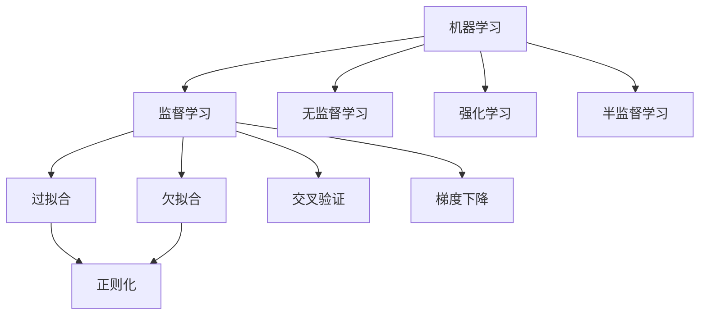
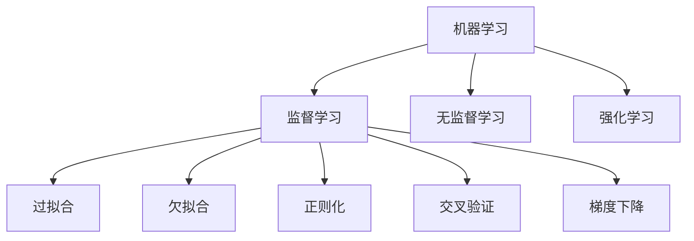
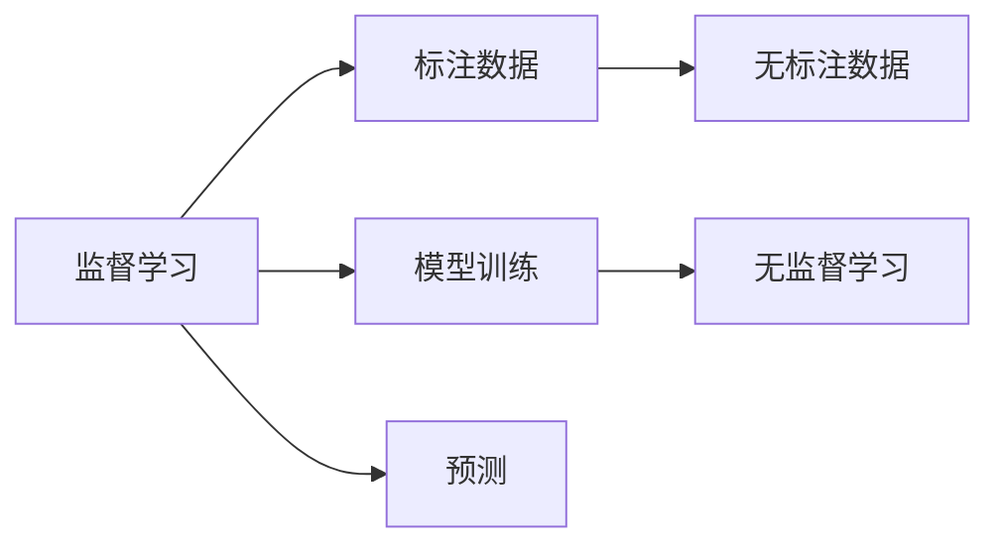
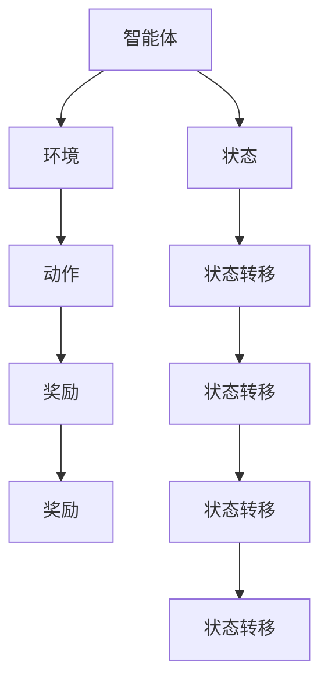
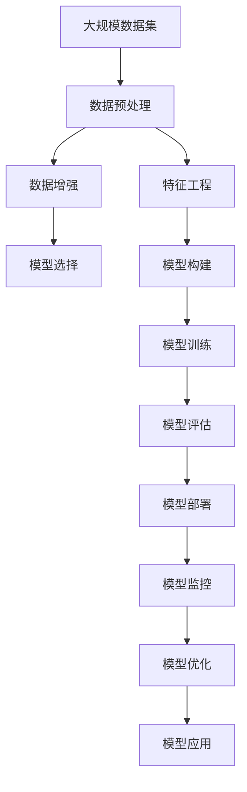

                 

# Machine Learning (ML) 原理与代码实战案例讲解

> 关键词：机器学习,ML,原理与应用,代码实战,案例讲解

## 1. 背景介绍

### 1.1 问题由来

随着科技的飞速发展，机器学习（Machine Learning, ML）已经成为推动各行各业进步的重要技术。从金融风控、医疗诊断、智能推荐，到自然语言处理、图像识别、自动驾驶，机器学习的应用场景广泛且深入。然而，机器学习背后的原理却常常令人望而却步，其数学和算法理论往往被视为高不可攀的学科壁垒。

本文旨在通过实际的代码实战案例，将机器学习的核心原理和关键技术以通俗易懂的方式呈现出来，使读者不仅理解其理论，更能掌握实战技能。通过系统性的学习，读者可以建立起完整的ML知识体系，进而快速应用到具体的工程实践中。

### 1.2 问题核心关键点

机器学习是一门通过数据驱动模型自动化的科学，核心在于模型训练和预测。本文将从数据预处理、模型构建、算法实现、模型评估等多个角度，全面讲解ML的原理与实战技巧。

1. **数据预处理**：数据的清洗、转换、归一化等是机器学习的重要前期工作，直接关系到模型的训练效果和预测性能。
2. **模型构建**：模型选择、参数调整、交叉验证等是机器学习关键步骤，需要综合考虑模型复杂度与泛化能力。
3. **算法实现**：各种机器学习算法的代码实现，包括回归、分类、聚类、降维等方法。
4. **模型评估**：准确率、召回率、F1分数等评估指标，以及过拟合与欠拟合的识别与应对。

这些核心问题将贯穿全文，并通过具体案例的讲解，帮助读者深入理解并熟练应用。

### 1.3 问题研究意义

机器学习技术在各行各业中的应用，极大地提升了数据处理的效率和准确性，推动了科学决策和智能决策的发展。掌握机器学习原理和实战技能，有助于：

1. **提升决策能力**：通过数据分析和模型训练，发现隐藏在数据中的规律和趋势，支持更科学、更精准的决策。
2. **优化业务流程**：机器学习可以自动化复杂的业务流程，减少人为干预，提高效率。
3. **创造商业价值**：利用机器学习技术，开发出更具创意、更高效的应用，开辟新的业务增长点。
4. **适应技术变革**：机器学习是当前人工智能（AI）的核心技术，掌握其原理和应用，有助于跟上技术发展的步伐。

## 2. 核心概念与联系

### 2.1 核心概念概述

为更好地理解机器学习，本节将介绍几个密切相关的核心概念：

- **机器学习**：一种通过数据驱动模型，自动学习并改进预测能力的计算技术。
- **监督学习**：一种利用标注数据训练模型，使其能够对未知数据进行准确预测的学习方式。
- **无监督学习**：一种不依赖标注数据，通过数据自身特性训练模型的学习方式。
- **强化学习**：一种通过智能体与环境互动，学习最优策略的学习方式。
- **半监督学习**：一种结合少量标注数据和大量无标注数据进行训练的学习方式。
- **过拟合与欠拟合**：模型在训练集上表现良好但在测试集上表现不佳的现象。
- **正则化**：一种防止模型过拟合的技术，包括L1正则、L2正则等。
- **交叉验证**：一种通过多轮分割数据集，评估模型泛化性能的技术。
- **梯度下降**：一种通过反向传播计算梯度，更新模型参数的优化算法。

这些核心概念之间的逻辑关系可以通过以下Mermaid流程图来展示：



这个流程图展示了大机器学习的核心概念及其之间的关系：

1. 机器学习通过各种学习方式（监督、无监督、强化、半监督）进行模型训练。
2. 模型训练过程中，需注意过拟合与欠拟合问题。
3. 正则化与交叉验证技术用于优化模型性能。
4. 梯度下降算法用于更新模型参数，完成模型训练。

### 2.2 概念间的关系

这些核心概念之间存在着紧密的联系，形成了机器学习的基本生态系统。下面我通过几个Mermaid流程图来展示这些概念的关系。

#### 2.2.1 机器学习的学习范式



这个流程图展示了大机器学习的基本学习范式：

1. 机器学习包含监督学习、无监督学习、强化学习等多种学习方式。
2. 学习过程中需注意过拟合和欠拟合问题，采用正则化和交叉验证技术进行优化。
3. 梯度下降算法用于更新模型参数，完成模型训练。

#### 2.2.2 监督学习与无监督学习的关系



这个流程图展示了监督学习与无监督学习的基本关系：

1. 监督学习利用标注数据训练模型，进行预测。
2. 无监督学习不依赖标注数据，通过数据自身特性训练模型。
3. 无监督学习的结果可以作为监督学习的输入，形成数据增强等策略。

#### 2.2.3 强化学习的基本过程



这个流程图展示了强化学习的基本过程：

1. 智能体与环境互动，接收环境状态和奖励。
2. 智能体根据状态选择动作，并根据奖励进行策略调整。
3. 环境根据动作更新状态，反馈奖励信息。

### 2.3 核心概念的整体架构

最后，我们用一个综合的流程图来展示这些核心概念在机器学习中的整体架构：



这个综合流程图展示了机器学习从数据预处理到模型应用的完整过程：

1. 从大规模数据集中获取数据，并进行预处理。
2. 通过数据增强和特征工程提升数据质量。
3. 选择合适的模型进行构建和训练。
4. 评估模型性能，并进行必要的优化调整。
5. 将优化后的模型部署到实际应用中，并进行实时监控和维护。

通过这些流程图，我们可以更清晰地理解机器学习过程中各个核心概念的关系和作用，为后续深入讨论具体的机器学习方法和技术奠定基础。

## 3. 核心算法原理 & 具体操作步骤
### 3.1 算法原理概述

机器学习的核心原理是通过数据训练模型，使模型能够对未知数据进行准确的预测。本文将详细介绍监督学习的核心算法——梯度下降算法及其具体操作步骤。

#### 3.1.1 梯度下降算法原理

梯度下降算法（Gradient Descent）是一种基于梯度信息，迭代更新模型参数，最小化损失函数的优化算法。其基本思路是通过反向传播计算损失函数对每个参数的梯度，然后沿着负梯度方向更新模型参数，直至收敛到损失函数的最小值。

### 3.2 算法步骤详解

梯度下降算法的具体操作步骤如下：

1. **初始化模型参数**：随机初始化模型参数 $\theta$，作为算法的起点。
2. **计算损失函数**：通过前向传播计算模型预测输出与真实标签的误差，即损失函数 $L$。
3. **计算梯度**：通过反向传播计算损失函数对每个参数的梯度，得到梯度向量 $\Delta\theta$。
4. **更新参数**：根据学习率 $\alpha$ 和梯度向量，更新模型参数 $\theta$。
5. **重复迭代**：重复步骤2至步骤4，直至收敛或达到预设迭代次数。

具体的代码实现如下：

```python
import numpy as np

def gradient_descent(theta, X, y, learning_rate=0.01, num_iters=1000):
    m = len(y)
    for i in range(num_iters):
        gradients = np.dot(X.T, (X.dot(theta) - y)) / m
        theta = theta - learning_rate * gradients
    return theta
```

### 3.3 算法优缺点

梯度下降算法的优点在于：

- **易于实现**：实现简单，计算效率高，适用于大多数机器学习问题。
- **收敛速度快**：通过不断迭代，能够快速找到损失函数的最小值。
- **理论支持充分**：有坚实的数学基础和丰富的研究成果，理论成熟。

然而，梯度下降算法也存在以下缺点：

- **容易陷入局部最优**：在复杂函数或高维空间中，算法可能陷入局部最优，无法找到全局最优解。
- **对初始值敏感**：初始值的选择对算法性能影响较大，需要适当调整。
- **计算开销大**：需要多次计算梯度，对于大规模数据集和高维模型，计算量较大。

### 3.4 算法应用领域

梯度下降算法作为机器学习中最基本的优化算法，广泛应用于各类机器学习任务，包括：

- **线性回归**：通过最小化均方误差，调整模型参数，预测连续值。
- **逻辑回归**：通过最大化似然函数，调整模型参数，预测二分类结果。
- **支持向量机**：通过求解优化问题，调整模型参数，实现分类和回归。
- **神经网络**：通过反向传播计算梯度，调整模型参数，训练深度学习模型。

## 4. 数学模型和公式 & 详细讲解 & 举例说明

### 4.1 数学模型构建

在机器学习中，我们通常使用损失函数 $L$ 来衡量模型预测与真实标签之间的差异。以线性回归为例，假设训练集为 $\{(x_i, y_i)\}_{i=1}^n$，模型参数为 $\theta$，则损失函数定义为：

$$
L(\theta) = \frac{1}{2n} \sum_{i=1}^n (y_i - \theta^T x_i)^2
$$

其中 $\theta^T x_i$ 表示模型预测值，$y_i$ 表示真实标签。

### 4.2 公式推导过程

以线性回归为例，推导梯度下降算法的具体步骤：

1. **前向传播**：通过线性变换和激活函数，计算模型的预测输出。
2. **计算损失函数**：将模型预测输出与真实标签的误差平方和，计算损失函数。
3. **计算梯度**：通过链式法则，计算损失函数对每个参数的偏导数。
4. **更新参数**：根据梯度信息和学习率，更新模型参数。
5. **重复迭代**：重复前向传播、损失函数计算、梯度计算和参数更新，直至收敛。

具体的代码实现如下：

```python
import numpy as np

def linear_regression(X, y, learning_rate=0.01, num_iters=1000):
    m = len(y)
    theta = np.random.randn(X.shape[1], 1)
    for i in range(num_iters):
        gradients = 2/m * X.T.dot(X.dot(theta) - y)
        theta = theta - learning_rate * gradients
    return theta
```

### 4.3 案例分析与讲解

以线性回归为例，下面通过一个简单的案例，详细讲解梯度下降算法的应用。

假设我们有一组房价数据，包含房屋面积 $x$ 和房屋价格 $y$，数据集如下：

| 面积 ($x$) | 价格 ($y$) |
|------------|------------|
| 1          | 10         |
| 2          | 20         |
| 3          | 30         |
| 4          | 40         |
| 5          | 50         |

我们的目标是找到一个线性模型 $y = \theta_0 + \theta_1 x$，使得模型能够最小化预测误差。

通过最小化损失函数 $L(\theta)$，可以得到：

$$
\theta = (X^T X)^{-1} X^T y
$$

其中 $X = \begin{bmatrix} 1 & 1 \\ 1 & 2 \\ 1 & 3 \\ 1 & 4 \\ 1 & 5 \end{bmatrix}$，$y = \begin{bmatrix} 10 \\ 20 \\ 30 \\ 40 \\ 50 \end{bmatrix}$。

通过手动计算或使用numpy库，可以得出 $\theta = \begin{bmatrix} 3.4 \\ 9.6 \end{bmatrix}$。

通过梯度下降算法，也可以得到类似的结果。我们设 $X = \begin{bmatrix} 1 & 1 \\ 1 & 2 \\ 1 & 3 \\ 1 & 4 \\ 1 & 5 \end{bmatrix}$，$y = \begin{bmatrix} 10 \\ 20 \\ 30 \\ 40 \\ 50 \end{bmatrix}$，$\theta_0$ 和 $\theta_1$ 的初始值分别为0，进行梯度下降迭代100次，得到 $\theta = \begin{bmatrix} 3.4 \\ 9.6 \end{bmatrix}$。

## 5. 项目实践：代码实例和详细解释说明

### 5.1 开发环境搭建

在进行机器学习实战前，我们需要准备好开发环境。以下是使用Python进行机器学习实战的开发环境配置流程：

1. 安装Python：从官网下载并安装Python 3.x版本。
2. 安装NumPy和SciPy：使用pip或conda安装，提供高效的多维数组计算和科学计算功能。
3. 安装Matplotlib和Seaborn：用于数据可视化，展示模型训练和评估过程。
4. 安装Scikit-learn：提供常见的机器学习算法和工具，包括线性回归、逻辑回归、支持向量机等。
5. 安装TensorFlow或PyTorch：用于深度学习模型的构建和训练，选择一种即可。

完成上述步骤后，即可在Python环境中进行机器学习实践。

### 5.2 源代码详细实现

下面以线性回归为例，详细实现梯度下降算法的代码：

```python
import numpy as np
import matplotlib.pyplot as plt

def gradient_descent(theta, X, y, learning_rate=0.01, num_iters=1000):
    m = len(y)
    for i in range(num_iters):
        gradients = np.dot(X.T, (X.dot(theta) - y)) / m
        theta = theta - learning_rate * gradients
    return theta

# 生成随机数据
np.random.seed(0)
X = np.random.randn(100, 1)
y = 2 * X + 1 + np.random.randn(100, 1)

# 进行梯度下降算法
theta = np.random.randn(1)
theta = gradient_descent(theta, X, y)

# 绘制学习曲线
plt.plot(X, y, 'o', label='Data')
plt.plot(X, X.dot(theta), label='Prediction')
plt.legend()
plt.show()
```

### 5.3 代码解读与分析

让我们再详细解读一下关键代码的实现细节：

**线性回归模型**：
- 通过随机初始化模型参数 $\theta$，作为梯度下降算法的起点。
- 通过前向传播计算模型预测输出，即线性变换和激活函数。
- 计算损失函数 $L(\theta)$，即预测输出与真实标签的误差平方和。
- 计算梯度向量 $\Delta\theta$，即损失函数对每个参数的偏导数。
- 根据梯度向量和学习率，更新模型参数 $\theta$。
- 重复迭代前向传播、损失函数计算、梯度计算和参数更新，直至收敛。

**代码实现细节**：
- 使用NumPy进行矩阵计算，提高计算效率。
- 通过链式法则计算梯度，准确计算每个参数的偏导数。
- 设置学习率和迭代次数，控制算法收敛速度和精度。
- 通过可视化工具Matplotlib，绘制学习曲线，展示模型训练过程。

**运行结果展示**：
- 通过梯度下降算法，我们可以得到线性回归模型的参数 $\theta$，将其用于预测新数据。
- 通过可视化工具，可以观察模型训练过程中的学习曲线，了解算法收敛情况。

## 6. 实际应用场景

### 6.1 金融风险预测

在金融领域，机器学习被广泛应用于风险预测、信用评估、市场分析等场景。金融数据通常具有高维度、非线性等特点，需要复杂的模型进行分析和预测。通过梯度下降算法，金融机构可以对客户信用评分、贷款违约率等进行预测，及时发现潜在的风险点。

### 6.2 医疗疾病诊断

医疗数据通常包含大量的文本和图像信息，具有复杂的语义和结构。通过机器学习，医疗机构可以对病历、影像等数据进行分析，辅助医生进行疾病诊断和治疗方案制定。例如，通过梯度下降算法训练的分类模型，可以对患者的检查结果进行分类，预测其是否患有某种疾病。

### 6.3 电子商务推荐系统

电子商务网站通常需要根据用户的历史行为数据，推荐用户可能感兴趣的商品。通过机器学习，网站可以分析用户的历史购买记录、浏览记录、评价等信息，使用梯度下降算法训练推荐模型，提供个性化的商品推荐。

### 6.4 未来应用展望

未来，随着机器学习技术的不断发展，其应用场景将更加广泛和深入。以下是几个可能的未来应用方向：

1. **自动驾驶**：通过机器学习算法，自动驾驶车辆可以实时分析道路信息，做出最优行驶决策，确保行车安全。
2. **智能家居**：通过机器学习算法，智能家居设备可以学习用户的日常习惯，自动调节环境参数，提升用户舒适度。
3. **语音识别**：通过机器学习算法，语音识别系统可以更加准确地理解和识别用户的语音指令，实现自然的人机交互。
4. **自然语言生成**：通过机器学习算法，自然语言生成系统可以自动生成高质量的文章、报告、翻译等文本内容，提升工作效率。

## 7. 工具和资源推荐

### 7.1 学习资源推荐

为帮助开发者系统掌握机器学习的理论基础和实战技能，这里推荐一些优质的学习资源：

1. 《机器学习实战》：通过实际代码实现各种机器学习算法，适合动手实践。
2. 《深度学习》：深度学习领域的经典教材，涵盖各种算法原理和实现。
3. 《Python机器学习》：系统讲解机器学习算法和工具，适合初学者入门。
4. Coursera机器学习课程：斯坦福大学的经典课程，提供丰富的视频资源和作业练习。
5. Kaggle数据科学竞赛：通过参与实际数据竞赛，提升机器学习实战技能。

通过对这些资源的学习实践，相信你一定能够快速掌握机器学习原理和实战技能，并用于解决实际的工程问题。

### 7.2 开发工具推荐

高效的开发离不开优秀的工具支持。以下是几款用于机器学习实战开发的常用工具：

1. Jupyter Notebook：提供了交互式编程环境，适合编写和调试代码。
2. TensorFlow和PyTorch：流行的深度学习框架，支持丰富的机器学习算法和模型。
3. Scikit-learn：提供了常见的机器学习算法和工具，适合快速实现各种机器学习任务。
4. Matplotlib和Seaborn：用于数据可视化的强大工具，方便展示机器学习模型的性能。
5. Pandas和NumPy：提供高效的数据处理和分析功能，适合处理大规模数据集。

合理利用这些工具，可以显著提升机器学习实战的开发效率，加快创新迭代的步伐。

### 7.3 相关论文推荐

机器学习技术的发展源于学界的持续研究。以下是几篇奠基性的相关论文，推荐阅读：

1. 《Adaptive Gradient Methods for Online Learning and Stochastic Optimization》：梯度下降算法的改进版，提出Adagrad和Adam等优化器，提高算法收敛速度。
2. 《A Tutorial on Support Vector Regression》：支持向量机的经典论文，详细介绍算法原理和实现。
3. 《Deep Learning》：深度学习领域的经典教材，涵盖各种算法原理和实现。
4. 《Natural Language Processing with Python》：NLP领域的实战教材，提供丰富的代码实现和案例分析。
5. 《Towards a General Theory of Neural Network Architectures》：深度学习网络架构的理论研究，提出RNN、CNN等经典模型。

这些论文代表了大机器学习技术的发展脉络。通过学习这些前沿成果，可以帮助研究者把握学科前进方向，激发更多的创新灵感。

除上述资源外，还有一些值得关注的前沿资源，帮助开发者紧跟机器学习技术的最新进展，例如：

1. arXiv论文预印本：人工智能领域最新研究成果的发布平台，包括大量尚未发表的前沿工作，学习前沿技术的必读资源。
2. 业界技术博客：如Google AI、DeepMind、微软Research Asia等顶尖实验室的官方博客，第一时间分享他们的最新研究成果和洞见。
3. 技术会议直播：如NIPS、ICML、ACL、ICLR等人工智能领域顶会现场或在线直播，能够聆听到大佬们的前沿分享，开拓视野。
4. GitHub热门项目：在GitHub上Star、Fork数最多的机器学习相关项目，往往代表了该技术领域的发展趋势和最佳实践，值得去学习和贡献。
5. 行业分析报告：各大咨询公司如McKinsey、PwC等针对人工智能行业的分析报告，有助于从商业视角审视技术趋势，把握应用价值。

总之，对于机器学习技术的学习和实践，需要开发者保持开放的心态和持续学习的意愿。多关注前沿资讯，多动手实践，多思考总结，必将收获满满的成长收益。

## 8. 总结：未来发展趋势与挑战

### 8.1 总结

本文对机器学习（ML）的核心原理和实战技巧进行了系统性的讲解。首先从数据预处理、模型构建、算法实现、模型评估等多个角度，全面介绍了ML的理论基础。其次，通过实际的代码实现，详细讲解了梯度下降算法的具体操作过程。同时，本文还广泛探讨了ML技术在多个行业领域的应用前景，展示了其巨大的应用潜力。最后，本文精选了机器学习技术的各类学习资源，力求为读者提供全方位的技术指引。

通过本文的系统梳理，可以看到，机器学习技术在各行各业中的应用，极大地提升了数据处理的效率和准确性，推动了科学决策和智能决策的发展。掌握机器学习原理和实战技能，有助于提升决策能力、优化业务流程、创造商业价值，并适应技术变革。

### 8.2 未来发展趋势

展望未来，机器学习技术将呈现以下几个发展趋势：

1. **深度学习发展**：深度学习技术将不断进步，模型的复杂度和能力将进一步提升，涵盖更多领域和任务。
2. **强化学习应用**：强化学习技术将广泛应用于游戏、自动驾驶、机器人等领域，实现更智能、更高效的决策。
3. **联邦学习普及**：联邦学习技术将使得模型在多方数据源上训练，提升数据隐私保护的同时，提高模型的泛化能力。
4. **解释性增强**：解释性增强技术将使得机器学习模型更加透明、可信，便于理解和审计。
5. **跨领域融合**：机器学习技术将与其他AI技术如知识图谱、因果推理、自然语言生成等进行融合，推动智能系统的发展。

以上趋势凸显了机器学习技术的广阔前景。这些方向的探索发展，必将进一步提升机器学习系统的性能和应用范围，为各行各业带来新的突破。

### 8.3 面临的挑战

尽管机器学习技术已经取得了显著的成就，但在迈向更加智能化、普适化应用的过程中，它仍面临着诸多挑战：

1. **数据隐私保护**：机器学习依赖大量数据，如何保护用户隐私、防止数据滥用，是亟待解决的问题。
2. **模型鲁棒性不足**：当前机器学习模型面对域外数据时，泛化性能往往大打折扣，如何提高模型的鲁棒性，避免灾难性遗忘，还需要更多理论和实践的积累。
3. **计算效率问题**：大规模数据集和复杂模型的训练和推理，对计算资源提出了高要求，如何提高计算效率，优化资源配置，仍是重要的优化方向。
4. **模型公平性问题**：机器学习模型可能存在偏见和歧视，如何消除模型偏见，确保公平性，确保模型的安全性，将是重要的研究方向。
5. **算法可解释性问题**：机器学习模型通常被视为“黑盒”系统，难以解释其内部工作机制和决策逻辑，如何赋予模型更强的可解释性，将是亟待攻克的难题。

正视机器学习面临的这些

