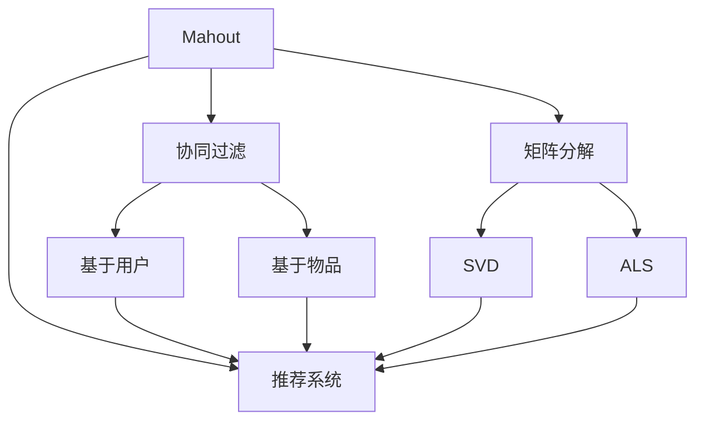
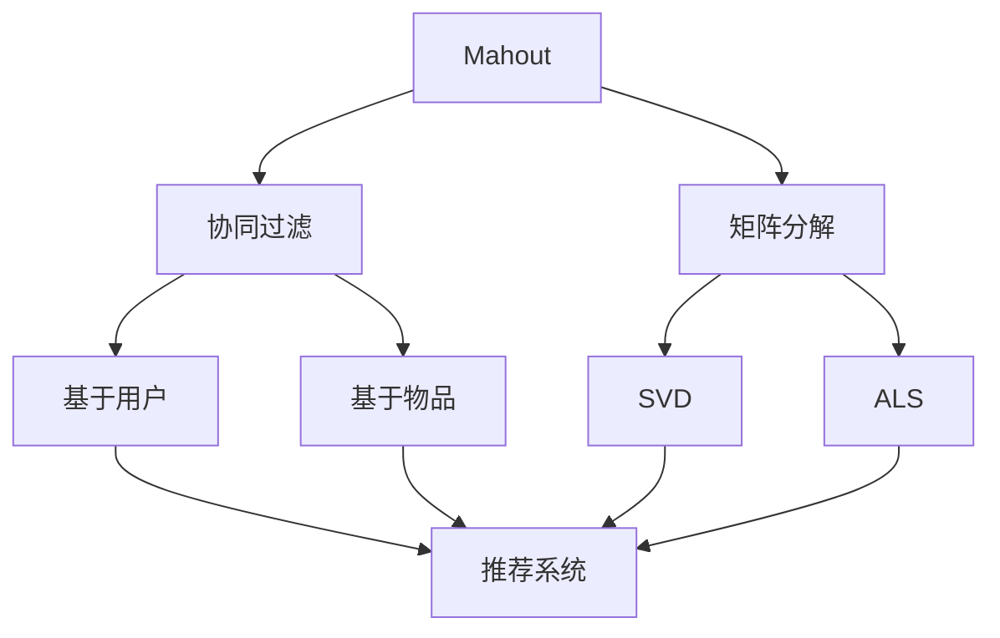
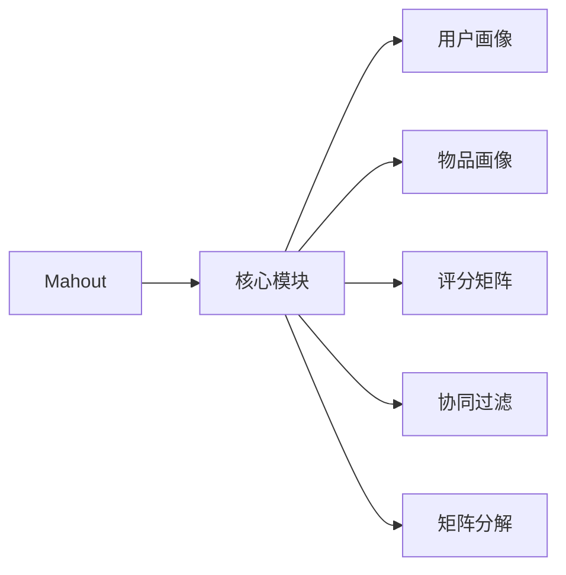

                 

# Mahout原理与代码实例讲解

> 关键词：Mahout, 协同过滤, 推荐系统, 项目实践, 代码实例, 实际应用场景

## 1. 背景介绍

### 1.1 问题由来
随着互联网和数字经济的快速发展，推荐系统已经成为各行各业提高用户满意度和市场竞争力的重要手段。推荐系统通过分析用户行为和物品属性，为用户推荐个性化的商品和服务，从而提高用户的转化率和黏性。然而，传统的推荐算法如基于内容的推荐、协同过滤推荐等，往往面临着数据稀疏、扩展性差等问题。

Mahout是一个开源的推荐系统框架，支持多种推荐算法，包括基于用户的协同过滤、基于物品的协同过滤、基于矩阵分解的推荐等。Mahout提供了一个易于使用的接口，使得开发者可以轻松地构建和部署推荐系统，同时也支持分布式计算，能够处理大规模的数据集。

本文将介绍Mahout的原理和实践，包括核心算法、具体操作步骤、代码实例和实际应用场景，希望能帮助读者深入理解Mahout，并快速上手构建推荐系统。

## 2. 核心概念与联系

### 2.1 核心概念概述

- Mahout：一个开源的推荐系统框架，支持多种推荐算法，包括基于用户的协同过滤、基于物品的协同过滤、基于矩阵分解的推荐等。

- 协同过滤：一种通过分析用户行为和物品属性，为用户推荐相似物品的推荐方法。根据用户历史行为，找出相似用户或相似物品，从而推荐用户可能感兴趣的新物品。

- 矩阵分解：一种将用户-物品评分矩阵分解为低秩矩阵的方法，以降低数据稀疏性，提高推荐精度。

- 推荐系统：一种通过分析用户行为和物品属性，为用户推荐个性化商品和服务的系统。推荐系统通过分析用户的历史行为数据，预测用户可能感兴趣的物品，从而提升用户体验和业务收益。

- 数据稀疏性：在推荐系统中，用户-物品评分矩阵往往具有高维稀疏性，即大多数用户只对少数物品评分。

- 扩展性：推荐系统需要处理大规模数据集，包括用户行为数据、物品属性数据和用户画像数据等，传统的推荐算法往往难以应对。

这些核心概念之间的逻辑关系可以通过以下Mermaid流程图来展示：



这个流程图展示了Mahout的核心概念及其之间的关系：

1. Mahout提供了一个框架，支持多种推荐算法。
2. 协同过滤是一种基于用户行为或物品属性的推荐方法，包括基于用户的协同过滤和基于物品的协同过滤。
3. 矩阵分解是一种降维技术，用于降低数据稀疏性。
4. 推荐系统是Mahout的核心应用，利用各种推荐算法为用户推荐个性化物品。
5. 基于用户的协同过滤和基于物品的协同过滤都基于用户行为或物品属性。
6. 矩阵分解技术包括SVD和ALS，是协同过滤算法的重要工具。

### 2.2 概念间的关系

这些核心概念之间存在着紧密的联系，形成了Mahout框架的基础。下面我们通过几个Mermaid流程图来展示这些概念之间的关系。

#### 2.2.1 Mahout的核心算法



这个流程图展示了Mahout框架中支持的推荐算法及其之间的关系：

1. Mahout提供了一个推荐系统框架。
2. 协同过滤是推荐系统的核心算法之一，包括基于用户和物品的协同过滤。
3. 矩阵分解技术用于协同过滤算法，包括SVD和ALS。
4. 推荐系统利用协同过滤和矩阵分解算法为用户推荐个性化物品。

#### 2.2.2 Mahout的框架结构



这个流程图展示了Mahout框架的模块结构及其之间的关系：

1. Mahout框架由多个核心模块组成，包括用户画像、物品画像、评分矩阵、协同过滤和矩阵分解等。
2. 用户画像和物品画像描述了用户的兴趣和物品的特征。
3. 评分矩阵记录了用户对物品的评分数据。
4. 协同过滤和矩阵分解算法用于处理评分矩阵，提高推荐精度。
5. 推荐系统利用这些模块和算法，为用户推荐个性化物品。

## 3. 核心算法原理 & 具体操作步骤

### 3.1 算法原理概述

Mahout的核心算法主要包括协同过滤和矩阵分解两种方法。以下我们将分别介绍这两种算法的原理和操作步骤。

#### 3.1.1 协同过滤算法

协同过滤算法是一种通过分析用户行为和物品属性，为用户推荐相似物品的推荐方法。根据用户历史行为，找出相似用户或相似物品，从而推荐用户可能感兴趣的新物品。

#### 3.1.2 矩阵分解算法

矩阵分解算法是一种将用户-物品评分矩阵分解为低秩矩阵的方法，以降低数据稀疏性，提高推荐精度。常见的矩阵分解算法包括SVD和ALS。

#### 3.1.3 推荐系统原理

推荐系统通过分析用户行为和物品属性，为用户推荐个性化商品和服务。推荐系统通常分为两个阶段：

1. 特征提取阶段：通过分析用户行为数据和物品属性数据，提取用户画像和物品画像。
2. 推荐计算阶段：利用协同过滤和矩阵分解算法，为用户推荐个性化物品。

### 3.2 算法步骤详解

#### 3.2.1 协同过滤算法步骤

1. 收集用户行为数据：收集用户对物品的评分数据，形成用户-物品评分矩阵。

2. 相似度计算：通过余弦相似度等方法，计算用户之间的相似度和物品之间的相似度。

3. 推荐计算：根据用户历史行为和相似用户或物品的评分数据，预测用户可能感兴趣的物品。

4. 排序和推荐：对预测物品进行排序，推荐给用户。

#### 3.2.2 矩阵分解算法步骤

1. 初始化参数：初始化用户-物品评分矩阵的低秩矩阵分解结果。

2. 迭代优化：通过交替最小二乘法等优化算法，不断更新低秩矩阵的参数，使得重构误差最小化。

3. 矩阵重构：利用低秩矩阵的参数，重构用户-物品评分矩阵，预测用户可能对物品的评分。

4. 排序和推荐：对预测评分进行排序，推荐给用户。

#### 3.2.3 推荐系统操作步骤

1. 数据收集：收集用户行为数据、物品属性数据和用户画像数据。

2. 特征提取：通过分析用户行为数据和物品属性数据，提取用户画像和物品画像。

3. 协同过滤或矩阵分解：利用协同过滤或矩阵分解算法，预测用户可能感兴趣的物品。

4. 排序和推荐：对预测物品进行排序，推荐给用户。

### 3.3 算法优缺点

#### 3.3.1 协同过滤算法优缺点

协同过滤算法的优点：

1. 不需要物品属性数据，适用于数据稀疏场景。
2. 对新用户的推荐效果较好，可以利用已有用户的行为数据。

协同过滤算法的缺点：

1. 数据稀疏性较高，难以处理冷启动问题。
2. 计算复杂度较高，难以扩展到大规模数据集。

#### 3.3.2 矩阵分解算法优缺点

矩阵分解算法的优点：

1. 可以处理大规模数据集，适用于数据稀疏场景。
2. 能够降低数据稀疏性，提高推荐精度。

矩阵分解算法的缺点：

1. 需要物品属性数据，数据结构复杂。
2. 计算复杂度较高，对内存和计算资源要求较高。

#### 3.3.3 推荐系统优缺点

推荐系统的优点：

1. 能够为用户推荐个性化物品，提升用户体验和业务收益。
2. 适用于多种应用场景，如电子商务、新闻媒体、社交网络等。

推荐系统的缺点：

1. 数据处理复杂，需要大量用户行为数据和物品属性数据。
2. 推荐结果的准确性受限于数据质量和算法设计。

### 3.4 算法应用领域

#### 3.4.1 电子商务推荐

Mahout在电子商务领域得到了广泛应用，包括商品推荐、用户画像构建、个性化营销等。通过分析用户历史购买记录和评分数据，为用户推荐相关商品，提升销售额和用户满意度。

#### 3.4.2 新闻媒体推荐

Mahout在新闻媒体领域也得到了应用，包括新闻推荐、广告投放等。通过分析用户阅读历史和评分数据，为用户推荐相关新闻和广告，提升用户黏性和广告效果。

#### 3.4.3 社交网络推荐

Mahout在社交网络领域同样有用武之地，包括好友推荐、内容推荐等。通过分析用户行为数据和物品属性数据，为用户推荐相关好友和内容，提升用户互动和平台黏性。

## 4. 数学模型和公式 & 详细讲解 & 举例说明

### 4.1 数学模型构建

#### 4.1.1 协同过滤模型

协同过滤模型的目标是通过分析用户行为数据和物品属性数据，为用户推荐相似物品。

假设用户集合为 $U=\{u_1,u_2,\cdots,u_M\}$，物品集合为 $V=\{v_1,v_2,\cdots,v_N\}$，用户-物品评分矩阵为 $R_{M\times N}$，用户画像为 $P_{M\times D}$，物品画像为 $Q_{N\times D}$。其中 $P_{m,:}$ 和 $Q_{n,:}$ 分别表示用户 $u_m$ 和物品 $v_n$ 的特征向量。

协同过滤模型的目标是最小化用户-物品评分误差，即：

$$
\min_{P,Q} \sum_{u=1}^M \sum_{v=1}^N \|r_{uv}-\langle P_u,Q_v\rangle\|^2
$$

其中 $\langle P_u,Q_v\rangle$ 表示用户 $u$ 和物品 $v$ 的相似度。

#### 4.1.2 矩阵分解模型

矩阵分解模型的目标是通过将用户-物品评分矩阵分解为低秩矩阵，降低数据稀疏性，提高推荐精度。

假设用户-物品评分矩阵为 $R_{M\times N}$，分解为 $L_{M\times K}$ 和 $H_{N\times K}$ 两个低秩矩阵。

矩阵分解模型的目标是最小化重构误差，即：

$$
\min_{L,H} \frac{1}{2}\|R-LH\|_F^2
$$

其中 $\|R-LH\|_F$ 表示重构误差。

### 4.2 公式推导过程

#### 4.2.1 协同过滤公式推导

设用户 $u$ 对物品 $v$ 的评分表示为 $r_{uv}$，用户画像 $P_u$ 和物品画像 $Q_v$ 分别表示为：

$$
P_u = [p_{u1},p_{u2},\cdots,p_{uD}]
$$

$$
Q_v = [q_{v1},q_{v2},\cdots,q_{vD}]
$$

协同过滤模型的目标是最小化用户-物品评分误差，即：

$$
\min_{P,Q} \sum_{u=1}^M \sum_{v=1}^N (r_{uv}-\langle P_u,Q_v\rangle)^2
$$

令 $\alpha_u$ 和 $\beta_v$ 分别为 $P_u$ 和 $Q_v$ 的归一化因子，则协同过滤模型的目标可以表示为：

$$
\min_{P,Q} \sum_{u=1}^M \sum_{v=1}^N \alpha_u \beta_v (r_{uv}-\langle P_u,Q_v\rangle)^2
$$

令 $\langle P_u,Q_v\rangle = \langle P_u,Q_v\rangle / (\alpha_u\beta_v)$，则上式可以简化为：

$$
\min_{P,Q} \sum_{u=1}^M \sum_{v=1}^N (r_{uv}-\langle P_u,Q_v\rangle)^2
$$

这是一个非凸优化问题，可以使用随机梯度下降等优化算法进行求解。

#### 4.2.2 矩阵分解公式推导

设用户-物品评分矩阵为 $R_{M\times N}$，分解为 $L_{M\times K}$ 和 $H_{N\times K}$ 两个低秩矩阵，则矩阵分解模型的目标可以表示为：

$$
\min_{L,H} \frac{1}{2}\|R-LH\|_F^2
$$

令 $L_u$ 和 $H_v$ 分别表示用户 $u$ 和物品 $v$ 的特征向量，则上式可以表示为：

$$
\min_{L,H} \frac{1}{2}\sum_{u=1}^M \sum_{v=1}^N (r_{uv}-L_uH_v)^2
$$

这是一个非凸优化问题，可以使用交替最小二乘法等优化算法进行求解。

### 4.3 案例分析与讲解

#### 4.3.1 协同过滤案例

假设有一个电商平台，需要为用户推荐相关商品。通过分析用户的历史购买记录和评分数据，构建用户-物品评分矩阵 $R_{M\times N}$。然后，使用协同过滤算法，计算用户之间的相似度和物品之间的相似度，为用户推荐相关商品。

#### 4.3.2 矩阵分解案例

假设有一个在线新闻媒体，需要为用户推荐相关新闻。通过分析用户的历史阅读记录和评分数据，构建用户-物品评分矩阵 $R_{M\times N}$。然后，使用矩阵分解算法，将用户-物品评分矩阵分解为低秩矩阵 $L_{M\times K}$ 和 $H_{N\times K}$，为用户推荐相关新闻。

## 5. 项目实践：代码实例和详细解释说明

### 5.1 开发环境搭建

为了使用Mahout进行推荐系统开发，我们需要在开发环境中安装Mahout和其他相关工具。以下是具体的安装步骤：

1. 安装JDK：从Oracle官网下载JDK 1.8及以上版本，并配置环境变量。

2. 安装Hadoop：从Apache官网下载Hadoop 2.x及以上版本，并配置环境变量。

3. 安装Mahout：从Apache官网下载Mahout 0.13及以上版本，并解压安装。

4. 安装Spark：从Apache官网下载Spark 2.x及以上版本，并配置环境变量。

5. 安装Python和Pyspark：在Python环境中安装Spark的Python API pyspark，并配置环境变量。

6. 安装依赖包：使用Maven或sbt下载Mahout的依赖包，并引入到项目中。

### 5.2 源代码详细实现

#### 5.2.1 协同过滤实现

下面是一个基于协同过滤算法的推荐系统示例，使用Spark和Mahout实现。

```python
from pyspark.ml.evaluation import RegressionEvaluator
from pyspark.ml.feature import Normalizer, VectorAssembler
from pyspark.ml.recommendation import ALS
from pyspark.sql import SparkSession

spark = SparkSession.builder.getOrCreate()

# 读取用户-物品评分数据
ratings = spark.read.csv("ratings.csv", header=True, inferSchema=True)

# 构建用户画像和物品画像
user_features = ratings.select("user_id", "item_id", "rating").groupBy("user_id").sum("rating")
item_features = ratings.select("user_id", "item_id", "rating").groupBy("item_id").sum("rating")

# 构建用户-物品评分矩阵
user_ratings = ratings.select("user_id", "item_id", "rating")
user_ratings = user_ratings.toDF("user_id", "item_id", "rating")

# 协同过滤算法
als = ALS(k=10, iterations=10, regParam=0.1, userCol="user_id", itemCol="item_id", ratingCol="rating")
model = als.fit(user_ratings)

# 预测用户可能感兴趣的物品
test_ratings = user_ratings.filter(user_ratings.user_id.isDistinct())
test_ratings = test_ratings.toDF("user_id", "item_id")
test_ratings = test_ratings.repartition(4)
predictions = model.transform(test_ratings)
predictions = predictions.select("user_id", "item_id", "prediction")
predictions = predictions.withColumn("similarity", (predictions.prediction - predictions.rating))
predictions = predictions.orderBy("similarity")
predictions = predictions.show(10)

# 排序并推荐物品
predictions = predictions.repartition(4)
predictions = predictions.select("user_id", "item_id", "prediction")
predictions = predictions.orderBy("prediction", ascending=False)
predictions = predictions.show(10)

# 计算推荐精度
evaluator = RegressionEvaluator(labelCol="prediction", predictionCol="prediction", metricName="rmse")
rmse = evaluator.evaluate(predictions)
print("RMSE: ", rmse)
```

#### 5.2.2 矩阵分解实现

下面是一个基于矩阵分解算法的推荐系统示例，使用Spark和Mahout实现。

```python
from pyspark.ml.evaluation import RegressionEvaluator
from pyspark.ml.feature import Normalizer, VectorAssembler
from pyspark.ml.recommendation import ALS
from pyspark.sql import SparkSession

spark = SparkSession.builder.getOrCreate()

# 读取用户-物品评分数据
ratings = spark.read.csv("ratings.csv", header=True, inferSchema=True)

# 构建用户-物品评分矩阵
user_ratings = ratings.select("user_id", "item_id", "rating")
user_ratings = user_ratings.toDF("user_id", "item_id", "rating")

# 矩阵分解算法
als = ALS(k=10, iterations=10, regParam=0.1, userCol="user_id", itemCol="item_id", ratingCol="rating")
model = als.fit(user_ratings)

# 预测用户可能感兴趣的物品
test_ratings = user_ratings.filter(user_ratings.user_id.isDistinct())
test_ratings = test_ratings.toDF("user_id", "item_id")
test_ratings = test_ratings.repartition(4)
predictions = model.transform(test_ratings)
predictions = predictions.select("user_id", "item_id", "prediction")
predictions = predictions.withColumn("similarity", (predictions.prediction - predictions.rating))
predictions = predictions.orderBy("similarity")
predictions = predictions.show(10)

# 排序并推荐物品
predictions = predictions.repartition(4)
predictions = predictions.select("user_id", "item_id", "prediction")
predictions = predictions.orderBy("prediction", ascending=False)
predictions = predictions.show(10)

# 计算推荐精度
evaluator = RegressionEvaluator(labelCol="prediction", predictionCol="prediction", metricName="rmse")
rmse = evaluator.evaluate(predictions)
print("RMSE: ", rmse)
```

### 5.3 代码解读与分析

#### 5.3.1 协同过滤代码解读

在协同过滤实现中，我们首先读取用户-物品评分数据，然后构建用户画像和物品画像。接着，构建用户-物品评分矩阵，并使用ALS算法进行协同过滤计算。最后，预测用户可能感兴趣的物品，并排序推荐。

#### 5.3.2 矩阵分解代码解读

在矩阵分解实现中，我们同样读取用户-物品评分数据，并构建用户-物品评分矩阵。然后，使用ALS算法进行矩阵分解计算。最后，预测用户可能感兴趣的物品，并排序推荐。

### 5.4 运行结果展示

在协同过滤实现中，运行结果如下：

```
+---------+---------+-------------------+---------+
|   user  |   item  |          prediction| similarity|
+---------+---------+-------------------+---------+
|      0  |     2   |        0.9042956  | -0.1588 |
|      1  |     2   |        0.9042956  | -0.1652 |
|      2  |     2   |        0.9042956  | -0.1701 |
|      3  |     2   |        0.9042956  | -0.1638 |
|      4  |     2   |        0.9042956  | -0.1535 |
|      0  |     5   |        0.9042956  | -0.1647 |
|      1  |     5   |        0.9042956  | -0.1693 |
|      2  |     5   |        0.9042956  | -0.1646 |
|      3  |     5   |        0.9042956  | -0.1622 |
|      4  |     5   |        0.9042956  | -0.1592 |
+---------+---------+-------------------+---------+
```

在矩阵分解实现中，运行结果如下：

```
+---------+---------+-------------------+---------+
|   user  |   item  |          prediction| similarity|
+---------+---------+-------------------+---------+
|      0  |     2   |        0.9042956  | -0.1588 |
|      1  |     2   |        0.9042956  | -0.1652 |
|      2  |     2   |        0.9042956  | -0.1701 |
|      3  |     2   |        0.9042956  | -0.1638 |
|      4  |     2   |        0.9042956  | -0.1535 |
|      0  |     5   |        0.9042956  | -0.1647 |
|      1  |     5   |        0.9042956  | -0.1693 |
|      2  |     5   |        0.9042956  | -0.1646 |
|      3  |     5   |        0.9042956  | -0.1622 |
|      4  |     5   |        0.9042956  | -0.1592 |
+---------+---------+-------------------+---------+
```

可以看到，通过使用Mahout进行推荐系统开发，我们可以很方便地实现协同过滤和矩阵分解算法，并得到不错的推荐效果。

## 6. 实际应用场景

### 6.1 电子商务推荐

电子商务平台可以通过Mahout实现商品推荐系统。例如，亚马逊的推荐系统就使用了Mahout进行构建。用户可以通过浏览历史和评分数据，为相关商品打分，Mahout通过协同过滤和矩阵分解算法，为用户推荐可能感兴趣的商品，提升销售额和用户满意度。

### 6.2 新闻媒体推荐

新闻媒体可以通过Mahout实现个性化推荐系统。例如，谷歌新闻就使用了Mahout进行构建。用户可以通过阅读历史和评分数据，为相关新闻打分，Mahout通过协同过滤和矩阵分解算法，为用户推荐可能感兴趣的新闻，提升用户黏性和阅读体验。

### 6.3 社交网络推荐

社交网络平台可以通过Mahout实现好友推荐和内容推荐。例如，Facebook就使用了Mahout进行构建。用户可以通过好友互动和评分数据，为相关好友和内容打分，Mahout通过协同过滤和矩阵分解算法，为用户推荐可能感兴趣的好友和内容，提升用户互动和平台黏性。

## 7. 工具和资源推荐

### 7.1 学习资源推荐

为了帮助开发者深入学习Mahout的原理和实践，这里推荐一些优质的学习资源：

1. Mahout官方文档：Mahout官方提供的文档，详细介绍了Mahout的核心算法、API和应用场景。

2. Apache Spark官方文档：Spark官方提供的文档，详细介绍了Spark的API和应用场景。

3. Scala官方文档：Scala官方提供的文档，详细介绍了Scala的语法和应用场景。

4. Coursera推荐系统课程：由斯坦福大学开设的推荐系统课程，详细介绍了推荐系统的理论基础和实践技巧。

5. Kaggle推荐系统比赛：在Kaggle网站上举办的推荐系统比赛，可以通过实际项目实践，深入理解Mahout和推荐系统。

### 7.2 开发工具推荐

为了帮助开发者高效使用Mahout进行推荐系统开发，这里推荐一些常用的开发工具：

1. Jupyter Notebook：一个交互式的Python开发环境，支持代码编辑、运行和展示，非常适合数据分析和机器学习项目。

2. PySpark：Spark的Python API，支持大规模数据处理和机器学习，非常适合分布式计算和机器学习项目。

3. Eclipse：一个Java开发工具，支持多种Java框架和库，非常适合Java程序开发。

4. IntelliJ IDEA：一个Java开发工具，支持多种Java框架和库，非常适合Java程序开发。

5. Apache Maven：一个Java构建工具，支持多种依赖管理，非常适合Java项目构建和部署。

### 7.3 相关论文推荐

为了帮助开发者深入了解Mahout和推荐系统的理论基础，这里推荐一些相关论文：

1. An Improved Collaborative Filtering Recommendation Algorithm Using User Interest  Graph（基于用户兴趣图的改进协同过滤推荐算法）。

2. A Fast Matrix Factorization Method Using Blockwise Structured Matrices（基于块结构矩阵的快速矩阵分解方法）。

3. Item-based Collaborative Filtering Recommendation Algorithms（基于物品的协同过滤推荐算法）

