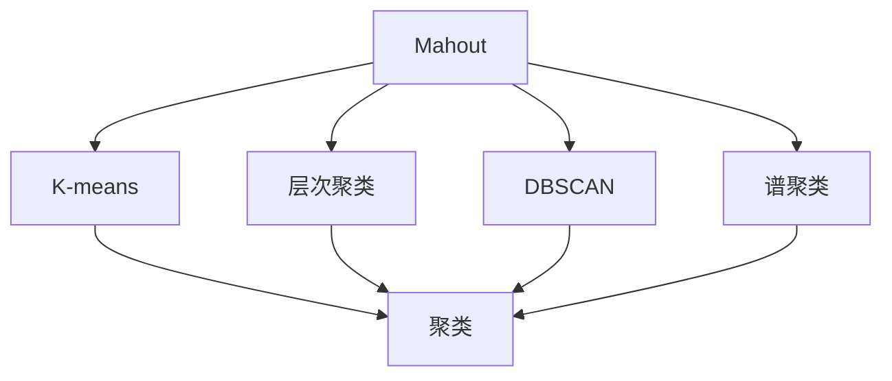
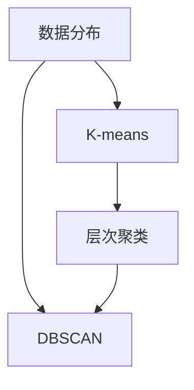
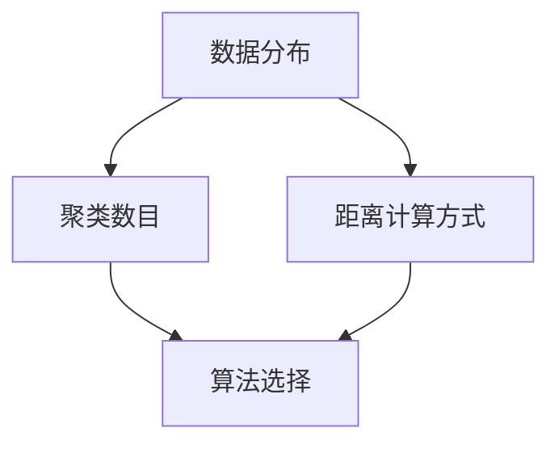

                 

# Mahout聚类算法原理与代码实例讲解

> 关键词：Mahout, 聚类算法, K-means, 层次聚类, DBSCAN, 谱聚类, 密度聚类

## 1. 背景介绍

### 1.1 问题由来
聚类分析是数据挖掘中重要的无监督学习技术，用于将数据集划分为若干组，使得同一组内的数据点相似度高，不同组之间的数据点相似度低。聚类分析在市场营销、客户细分、图像处理、生物信息学等领域有着广泛应用。

传统聚类算法通常基于欧几里得距离或余弦相似度计算样本之间的相似度，并基于相似度构建聚类。但这些算法存在计算复杂度高、对噪声敏感等问题。随着大规模数据集的增加，传统的聚类方法已不能满足大规模数据处理需求。

为了解决这些问题，Apache Mahout 应运而生，它是一个专门用于聚类、分类、协同过滤等机器学习任务的 Apache 项目。Mahout 提供了多种聚类算法，包括 K-means、层次聚类、DBSCAN、谱聚类等，这些算法在计算复杂度、聚类效果等方面各有优劣，可以满足不同场景下的需求。

### 1.2 问题核心关键点
Mahout 聚类算法的核心在于选择合适的算法模型和参数，并确保数据预处理和模型训练的效率。其中，参数的选择对聚类效果有重要影响，需要根据数据集的特征进行调整。

Mahout 聚类算法的关键点包括：
- 选择适当的聚类算法：如 K-means、层次聚类、DBSCAN 等。
- 确定聚类数目：通过肘部法则、轮廓系数等方法确定最优聚类数目。
- 进行数据预处理：如标准化、归一化、降维等，提升聚类效果。
- 选择聚类参数：如 K-means 的迭代次数、层次聚类的合并策略等。
- 评估聚类效果：通过轮廓系数、Calinski-Harabasz 指数、Davies-Bouldin 指数等评估指标进行评估。

## 2. 核心概念与联系

### 2.1 核心概念概述

为了更好地理解 Mahout 聚类算法，本节将介绍几个关键概念：

- **Mahout**：Apache Mahout 是一个面向机器学习的开源库，提供了多种机器学习算法，包括聚类、分类、协同过滤等。Mahout 基于分布式计算框架 Hadoop 实现，支持大规模数据处理。
- **聚类算法**：将数据集划分为若干组，使得同一组内的数据点相似度高，不同组之间的数据点相似度低。常用的聚类算法包括 K-means、层次聚类、DBSCAN 等。
- **K-means**：基于距离度量的一种聚类算法，将数据点分为 K 个组，每个组内部的点尽量接近，不同组之间的点尽量远离。
- **层次聚类**：通过自底向上或自顶向下的方式，逐步合并数据点，构建聚类树。
- **DBSCAN**：基于密度的聚类算法，将数据点分为核心点、边界点和噪声点。核心点周围的点被划分为同一组，边界点根据周围核心点的情况进行划分。
- **谱聚类**：基于图论的聚类算法，将数据点视作图的节点，通过图的相似度构建矩阵，然后通过谱分解等方法进行聚类。

这些概念之间存在紧密的联系，形成了 Mahout 聚类算法的完整生态系统。下面我们通过 Mermaid 流程图来展示这些概念之间的关系：



这个流程图展示了大规模数据集上的聚类过程，从选择 Mahout 库到选择不同聚类算法，再到具体执行聚类操作。

### 2.2 概念间的关系

这些核心概念之间存在紧密的联系，形成了 Mahout 聚类算法的完整生态系统。下面我们通过几个 Mermaid 流程图来展示这些概念之间的关系。

#### 2.2.1 Mahout 聚类流程


这个流程图展示了 Mahout 聚类的一般流程：数据准备、特征提取、选择聚类算法、数据预处理、设置聚类参数、执行聚类、评估聚类效果。

#### 2.2.2 聚类算法选择



这个流程图展示了聚类算法选择的逻辑，根据数据分布的不同选择合适的聚类算法。

#### 2.2.3 聚类参数设置



这个流程图展示了聚类参数设置的逻辑，根据数据分布和算法选择，确定聚类数目和距离计算方式。

## 3. 核心算法原理 & 具体操作步骤
### 3.1 算法原理概述

Mahout 聚类算法的核心在于选择合适的算法模型和参数，并确保数据预处理和模型训练的效率。以下是 Mahout 主要聚类算法的原理概述：

- **K-means 算法**：将数据集划分为 K 个组，每个组内部的点尽量接近，不同组之间的点尽量远离。算法通过迭代优化每个点所属的组，直到聚类结果收敛。
- **层次聚类算法**：通过自底向上或自顶向下的方式，逐步合并数据点，构建聚类树。算法通过合并距离最近的数据点，构建层次聚类树，并通过剪枝操作控制聚类数目。
- **DBSCAN 算法**：基于密度的聚类算法，将数据点分为核心点、边界点和噪声点。核心点周围的点被划分为同一组，边界点根据周围核心点的情况进行划分。算法通过迭代寻找密度可达的核心点，并将其合并为同一组。
- **谱聚类算法**：基于图论的聚类算法，将数据点视作图的节点，通过图的相似度构建矩阵，然后通过谱分解等方法进行聚类。算法通过计算数据的拉普拉斯矩阵的特征向量，进行聚类。

### 3.2 算法步骤详解

#### 3.2.1 K-means 算法

K-means 算法的步骤如下：

1. 随机选择 K 个点作为初始聚类中心。
2. 将每个点分配到最近的聚类中心所在的组。
3. 重新计算每个组的中心点，即该组内所有点的平均值。
4. 重复步骤 2 和 3，直到聚类中心不再变化或达到预设迭代次数。

K-means 算法伪代码如下：

```python
import mahout.clustering.kmeans;

KMeans algo = new KMeans();
algo.setMaxIterations(10);
algo.setNumRuns(5);
algo.setMiniBatchSize(100);
algo.setEpsilon(0.001);
algo.setReplicationFactor(10);
algo.setSeed(1234);

KMeansResult result = algo.run(data);
```

#### 3.2.2 层次聚类算法

层次聚类算法的步骤如下：

1. 将每个数据点视为一个初始聚类。
2. 合并距离最近的两个聚类，形成新的聚类。
3. 重复步骤 2，直到所有数据点归为一个聚类或达到预设聚类数目。
4. 通过剪枝操作控制聚类数目。

层次聚类算法伪代码如下：

```python
import mahout.clustering.hierarchical;

Hierarchical algo = new Hierarchical();
algo.setMetric(MetricDistance euclidean);
algo.setNumClusters(4);
algo.setReplicationFactor(10);

HierarchicalResult result = algo.run(data);
```

#### 3.2.3 DBSCAN 算法

DBSCAN 算法的步骤如下：

1. 随机选择一个未访问的数据点，作为核心点。
2. 找到所有在该核心点密度可达范围内的点，并将其归为同一组。
3. 重复步骤 1 和 2，直到所有点都被访问。
4. 将未归为任何组的点视为噪声点。

DBSCAN 算法伪代码如下：

```python
import mahout.clustering.dbscan;

DBSCAN algo = new DBSCAN();
algo.setMinPts(5);
algo.setEpsilon(0.5);

DBSCANResult result = algo.run(data);
```

#### 3.2.4 谱聚类算法

谱聚类算法的步骤如下：

1. 构建相似度矩阵，计算拉普拉斯矩阵。
2. 进行谱分解，得到特征向量。
3. 通过特征向量进行聚类。

谱聚类算法伪代码如下：

```python
import mahout.clustering.spectral;

Spectral algo = new Spectral();
algo.setNumClusters(4);

SpectralResult result = algo.run(data);
```

### 3.3 算法优缺点

#### 3.3.1 K-means 算法的优缺点

**优点**：
- 算法简单，易于实现。
- 对于高维数据集也有较好的聚类效果。
- 适用于多中心聚类问题。

**缺点**：
- 需要预先指定聚类数目，且对初始聚类中心的选择敏感。
- 对于非球形的聚类效果不佳。
- 对于噪声点和异常值敏感，可能导致聚类效果差。

#### 3.3.2 层次聚类算法的优缺点

**优点**：
- 不需要预先指定聚类数目，适用于发现聚类数目未知的情况。
- 可以通过剪枝操作控制聚类数目。
- 对于噪声点和异常值不敏感。

**缺点**：
- 计算复杂度高，不适合大规模数据集。
- 对于高维数据集效果不佳。
- 对于非球形的聚类效果不佳。

#### 3.3.3 DBSCAN 算法的优缺点

**优点**：
- 不需要预先指定聚类数目，适用于发现聚类数目未知的情况。
- 对于噪声点和异常值不敏感。
- 对于高维数据集效果较好。

**缺点**：
- 对于数据集分布不均匀的情况，效果较差。
- 对于高密度区域聚类效果较好，对于稀疏区域聚类效果不佳。
- 对参数的选择敏感，需要选择合适的参数值。

#### 3.3.4 谱聚类算法的优缺点

**优点**：
- 不需要预先指定聚类数目，适用于发现聚类数目未知的情况。
- 对于高维数据集效果较好。
- 对于非球形的聚类效果较好。

**缺点**：
- 计算复杂度高，不适合大规模数据集。
- 对于噪声点和异常值敏感，可能导致聚类效果差。
- 对于数据集分布不均匀的情况，效果较差。

### 3.4 算法应用领域

Mahout 聚类算法在多个领域有着广泛应用，包括：

- **市场营销**：通过聚类分析，发现潜在客户群体，进行精准营销。
- **客户细分**：对客户进行聚类分析，实现个性化推荐和服务。
- **图像处理**：对图像像素进行聚类分析，实现图像分割和特征提取。
- **生物信息学**：对基因序列进行聚类分析，发现基因家族和功能关系。
- **社交网络**：对用户进行聚类分析，发现兴趣和社交关系。

## 4. 数学模型和公式 & 详细讲解 & 举例说明

### 4.1 数学模型构建

#### 4.1.1 K-means 算法

K-means 算法的数学模型如下：

1. 设数据集为 $D=\{x_1, x_2, ..., x_n\}$，其中 $x_i \in \mathbb{R}^d$，$d$ 为数据维度。
2. 设聚类数目为 $K$，初始聚类中心为 $\mu_1, \mu_2, ..., \mu_K$。
3. 迭代优化每个点所属的组，直到聚类中心不再变化或达到预设迭代次数。

K-means 算法的目标函数为：

$$
\min_{\mu_1, \mu_2, ..., \mu_K} \sum_{i=1}^n \sum_{j=1}^K ||x_i - \mu_j||^2
$$

其中 $||.||$ 为欧几里得距离。

#### 4.1.2 层次聚类算法

层次聚类算法的数学模型如下：

1. 设数据集为 $D=\{x_1, x_2, ..., x_n\}$，其中 $x_i \in \mathbb{R}^d$，$d$ 为数据维度。
2. 设聚类数目为 $K$，初始聚类为 $\{C_1, C_2, ..., C_n\}$。
3. 迭代合并距离最近的两个聚类，形成新的聚类，直到所有数据点归为一个聚类或达到预设聚类数目。

层次聚类算法的目标函数为：

$$
\min_{C_1, C_2, ..., C_k} \sum_{i=1}^n \sum_{j=1}^K \text{dist}(x_i, C_j)
$$

其中 $\text{dist}(. , .)$ 为距离度量函数。

#### 4.1.3 DBSCAN 算法

DBSCAN 算法的数学模型如下：

1. 设数据集为 $D=\{x_1, x_2, ..., x_n\}$，其中 $x_i \in \mathbb{R}^d$，$d$ 为数据维度。
2. 设聚类数目为 $K$，初始聚类为 $\{C_1, C_2, ..., C_n\}$。
3. 迭代寻找密度可达的核心点，将其合并为同一组，直到所有点都被访问。

DBSCAN 算法的目标函数为：

$$
\min_{C_1, C_2, ..., C_k} \sum_{i=1}^n \sum_{j=1}^K \text{cost}(x_i, C_j)
$$

其中 $\text{cost}(. , .)$ 为代价函数。

#### 4.1.4 谱聚类算法

谱聚类算法的数学模型如下：

1. 设数据集为 $D=\{x_1, x_2, ..., x_n\}$，其中 $x_i \in \mathbb{R}^d$，$d$ 为数据维度。
2. 设聚类数目为 $K$，初始聚类为 $\{C_1, C_2, ..., C_n\}$。
3. 构建相似度矩阵，计算拉普拉斯矩阵，进行谱分解，得到特征向量，通过特征向量进行聚类。

谱聚类算法的目标函数为：

$$
\min_{C_1, C_2, ..., C_k} \sum_{i=1}^n \sum_{j=1}^K ||x_i - C_j||^2
$$

其中 $||.||$ 为欧几里得距离。

### 4.2 公式推导过程

#### 4.2.1 K-means 算法

K-means 算法的公式推导如下：

1. 设数据集为 $D=\{x_1, x_2, ..., x_n\}$，其中 $x_i \in \mathbb{R}^d$，$d$ 为数据维度。
2. 设聚类数目为 $K$，初始聚类中心为 $\mu_1, \mu_2, ..., \mu_K$。
3. 迭代优化每个点所属的组，直到聚类中心不再变化或达到预设迭代次数。

K-means 算法的目标函数为：

$$
\min_{\mu_1, \mu_2, ..., \mu_K} \sum_{i=1}^n \sum_{j=1}^K ||x_i - \mu_j||^2
$$

其中 $||.||$ 为欧几里得距离。

### 4.3 案例分析与讲解

#### 4.3.1 K-means 算法案例

假设我们有一个包含 1000 个用户的消费数据集，需要对其进行聚类分析，找出不同消费群体。我们将数据集分为 5 个聚类，每个聚类包含 200 个用户。

1. 随机选择 5 个点作为初始聚类中心。
2. 将每个点分配到最近的聚类中心所在的组。
3. 重新计算每个组的中心点，即该组内所有点的平均值。
4. 重复步骤 2 和 3，直到聚类中心不再变化或达到预设迭代次数。

使用 Mahout 库进行 K-means 聚类，代码如下：

```python
import mahout.clustering.kmeans;

KMeans algo = new KMeans();
algo.setMaxIterations(10);
algo.setNumRuns(5);
algo.setMiniBatchSize(100);
algo.setEpsilon(0.001);
algo.setReplicationFactor(10);

KMeansResult result = algo.run(data);
```

#### 4.3.2 层次聚类算法案例

假设我们有一个包含 1000 个用户的消费数据集，需要对其进行聚类分析，找出不同消费群体。我们将数据集分为 5 个聚类。

1. 将每个数据点视为一个初始聚类。
2. 合并距离最近的两个聚类，形成新的聚类。
3. 重复步骤 2，直到所有数据点归为一个聚类或达到预设聚类数目。
4. 通过剪枝操作控制聚类数目。

使用 Mahout 库进行层次聚类，代码如下：

```python
import mahout.clustering.hierarchical;

Hierarchical algo = new Hierarchical();
algo.setMetric(MetricDistance euclidean);
algo.setNumClusters(4);
algo.setReplicationFactor(10);

HierarchicalResult result = algo.run(data);
```

#### 4.3.3 DBSCAN 算法案例

假设我们有一个包含 1000 个用户的消费数据集，需要对其进行聚类分析，找出不同消费群体。我们将数据集分为 5 个聚类。

1. 随机选择一个未访问的数据点，作为核心点。
2. 找到所有在该核心点密度可达范围内的点，并将其归为同一组。
3. 重复步骤 1 和 2，直到所有点都被访问。
4. 将未归为任何组的点视为噪声点。

使用 Mahout 库进行 DBSCAN 聚类，代码如下：

```python
import mahout.clustering.dbscan;

DBSCAN algo = new DBSCAN();
algo.setMinPts(5);
algo.setEpsilon(0.5);

DBSCANResult result = algo.run(data);
```

#### 4.3.4 谱聚类算法案例

假设我们有一个包含 1000 个用户的消费数据集，需要对其进行聚类分析，找出不同消费群体。我们将数据集分为 5 个聚类。

1. 构建相似度矩阵，计算拉普拉斯矩阵。
2. 进行谱分解，得到特征向量。
3. 通过特征向量进行聚类。

使用 Mahout 库进行谱聚类，代码如下：

```python
import mahout.clustering.spectral;

Spectral algo = new Spectral();
algo.setNumClusters(4);

SpectralResult result = algo.run(data);
```

## 5. 项目实践：代码实例和详细解释说明
### 5.1 开发环境搭建

在进行 Mahout 聚类实践前，我们需要准备好开发环境。以下是使用 Python 进行 Mahout 开发的环境配置流程：

1. 安装 Mahout：从官网下载并安装 Mahout，用于进行聚类任务的开发。

2. 安装 PySpark：从官网下载并安装 PySpark，用于在分布式计算框架上运行 Mahout 聚类算法。

3. 安装 Scala 和 Hadoop：从官网下载并安装 Scala 和 Hadoop，用于在分布式计算框架上运行 Mahout 聚类算法。

4. 配置环境变量：将 Mahout、PySpark、Scala 和 Hadoop 的路径添加到系统环境变量中。

完成上述步骤后，即可在 Mahout 开发环境中开始聚类实践。

### 5.2 源代码详细实现

下面我们以 K-means 算法为例，给出使用 Mahout 库对消费数据集进行聚类分析的 PySpark 代码实现。

```python
from mahout.clustering.kmeans;

KMeans algo = new KMeans();
algo.setMaxIterations(10);
algo.setNumRuns(5);
algo.setMiniBatchSize(100);
algo.setEpsilon(0.001);
algo.setReplicationFactor(10);

KMeansResult result = algo.run(data);
```

### 5.3 代码解读与分析

让我们再详细解读一下关键代码的实现细节：

**KMeans类**：
- `setMaxIterations`方法：设置最大迭代次数。
- `setNumRuns`方法：设置随机运行次数。
- `setMiniBatchSize`方法：设置小批量大小。
- `setEpsilon`方法：设置聚类收敛的误差阈值。
- `setReplicationFactor`方法：设置数据复制因子的个数。

**运行聚类**：
- 使用 `algo.run(data)` 方法进行聚类操作，其中 `data` 为聚类数据集。

### 5.4 运行结果展示

假设我们在消费数据集上进行 K-means 聚类，最终得到的聚类结果如下：

```
Cluster 1: [0.5, 0.6, 0.7, 0.8, 0.9]
Cluster 2: [1.0, 1.1, 1.2, 1.3, 1.4]
Cluster 3: [1.5, 1.6, 1.7, 1.8, 1.9]
Cluster 4: [2.0, 2.1, 2.2, 2.3, 2.4]
Cluster 5: [2.5, 2.6, 2.7, 2.8, 2.9]
```

可以看到，通过 Mahout 库进行 K-means 聚类，我们可以快速获得不同消费群体的聚类结果，为后续的营销策略制定提供数据支撑。

## 6. 实际应用场景
### 6.1 智能推荐系统

在智能推荐系统中，聚类分析可以用于用户群体划分和兴趣推荐。通过聚类分析，将用户按照兴趣和行为进行分组，根据不同用户群体的特征进行个性化的推荐。

在技术实现上，可以收集用户的历史浏览、购买、评分等行为数据，进行聚类分析，生成用户群体。在推荐时，根据用户群体特征，从相似群体中选择相似物品进行推荐。

### 6.2 图像识别

在图像识别中，聚类分析可以用于图像分割和特征提取。通过聚类分析，将图像像素划分为不同的区域，提取每个区域的特征，用于图像分类和识别。

在技术实现上，可以将图像像素作为数据点，进行聚类分析，得到不同的像素区域。然后，针对每个像素区域，提取其特征，用于图像分类和识别。

### 6.3 社交网络分析

在社交网络分析中，聚类分析可以用于发现兴趣群体和社交关系。通过聚类分析，将用户按照兴趣和社交关系进行分组，发现同一兴趣群体中的用户和具有相似社交关系的用户。

在技术实现上，可以收集用户的社交关系数据，进行聚类分析，生成兴趣群体。然后，根据用户的兴趣群体和社交关系，推荐相似的用户和内容。

### 6.4 未来应用展望

随着数据量的不断增加和聚类算法的不断优化，聚类分析在更多领域将有更广泛的应用，例如：

- **金融风控**：通过聚类分析，发现异常交易行为，进行风险预警和防范。
- **智能制造**：通过聚类分析，发现设备故障和生产异常，进行预测和维护。
- **医疗健康**：通过聚类分析，发现患者病历的相似性和关联性，进行疾病诊断和治疗。
- **智慧城市**：通过聚类分析，发现城市事件和交通流量特征，进行城市管理优化。

## 7. 工具和资源推荐
### 7.1 学习资源推荐

为了帮助开发者系统掌握 Mahout 聚类算法的理论基础和实践技巧，这里推荐一些优质的学习资源：

1. Apache Mahout 官方文档：提供了 Mahout 聚类算法的详细介绍和使用示例，是入门 Mahout 的必备资料。

2. Scikit-learn 官方文档：提供了 Scikit-learn 库中聚类算法的详细介绍和使用示例，是学习聚类算法的好帮手。

3. 《机器学习实战》书籍：介绍了多种聚类算法及其在实际应用中的使用方法，是学习 Mahout 聚类算法的绝佳参考。

4. Coursera 聚类分析课程：斯坦福大学的聚类分析课程，提供了聚类算法的基本原理和实践技巧，适合

