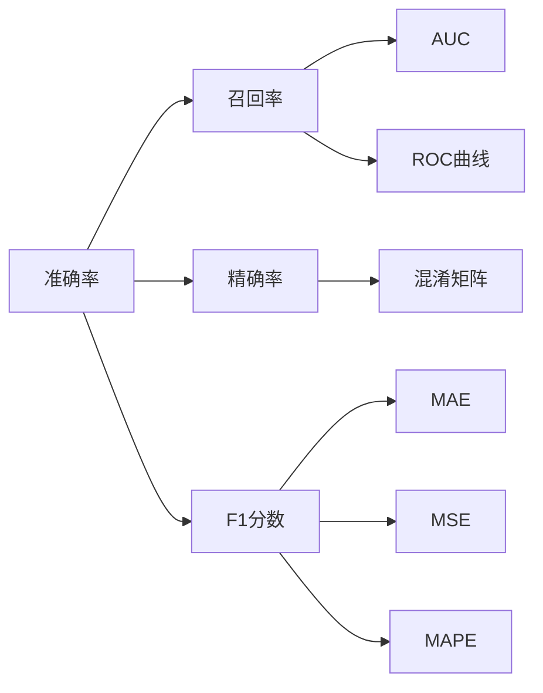

                 

# Model Evaluation Metrics 原理与代码实战案例讲解

> 关键词：模型评价指标,准确率,召回率,精确率,F1分数,AUC,ROC曲线,混淆矩阵,MAE,MSE,MAPE,MAE,MAE,MAPE

## 1. 背景介绍

在机器学习和深度学习领域，模型评价指标(即评价指标)是评估模型性能和优化模型参数的重要工具。选择合适的评价指标对模型的优化、部署和应用都至关重要。本文将全面介绍几个常见的模型评价指标，包括准确率、召回率、精确率、F1分数、AUC、ROC曲线、混淆矩阵等，并结合代码实战案例详细讲解其原理和实现方法。

## 2. 核心概念与联系

### 2.1 核心概念概述

模型评价指标是指用于评估机器学习或深度学习模型性能的指标。常见的评价指标包括准确率、召回率、精确率、F1分数、AUC、ROC曲线、混淆矩阵等。这些指标从不同的角度度量模型的预测效果，帮助开发者选择和优化模型。

### 2.2 概念间的关系

以下是几个核心概念之间的关系示意图：



这个图表展示了几个核心概念之间的关系：

1. 准确率和召回率是基本的评价指标，帮助评估模型的预测效果。
2. 精确率是准确率和召回率的组合，用于衡量模型的预测结果的质量。
3. F1分数是精确率和召回率的调和平均数，综合考虑了两者。
4. AUC和ROC曲线用于评估模型的分类效果。
5. 混淆矩阵用于详细分析模型的预测结果。
6. MAE、MSE、MAPE等指标用于评估模型的回归效果。

## 3. 核心算法原理 & 具体操作步骤

### 3.1 算法原理概述

模型评价指标的计算原理如下：

1. **准确率（Accuracy）**：衡量模型正确预测的比例，即模型预测正确的样本数占总样本数的比例。
2. **召回率（Recall）**：衡量模型能够正确识别正例的比例，即模型正确预测为正例的样本数占实际正例数的比例。
3. **精确率（Precision）**：衡量模型预测为正例的样本中实际为正例的比例，即模型正确预测为正例的样本数占所有预测为正例的样本数的比例。
4. **F1分数（F1 Score）**：是精确率和召回率的调和平均数，综合考虑了二者的优缺点，通常在两者相差较大时取较大值。
5. **AUC（Area Under Curve）**：衡量模型在不同阈值下的分类效果，AUC值越大，模型分类能力越强。
6. **ROC曲线（Receiver Operating Characteristic Curve）**：绘制模型在不同阈值下的真正例率和假正例率的关系曲线，用于评估模型分类效果。
7. **混淆矩阵（Confusion Matrix）**：用于详细分析模型预测结果的正确与否，将真实标签和预测标签组合成4种情况，即真正例（TP）、真负例（TN）、假正例（FP）和假负例（FN）。
8. **MAE（Mean Absolute Error）**：平均绝对误差，用于评估模型的回归效果，衡量模型预测值与真实值之间的差距。
9. **MSE（Mean Squared Error）**：平均平方误差，用于评估模型的回归效果，衡量模型预测值与真实值之间的差距的平方。
10. **MAPE（Mean Absolute Percentage Error）**：平均绝对百分比误差，用于评估模型的回归效果，衡量模型预测值与真实值之间的差距的百分比。

### 3.2 算法步骤详解

以下是各个评价指标的计算步骤：

**1. 准确率（Accuracy）**

准确率的计算公式如下：

$$Accuracy = \frac{TP + TN}{TP + TN + FP + FN}$$

其中，$TP$表示真正例，$TN$表示真负例，$FP$表示假正例，$FN$表示假负例。

**2. 召回率（Recall）**

召回率的计算公式如下：

$$Recall = \frac{TP}{TP + FN}$$

**3. 精确率（Precision）**

精确率的计算公式如下：

$$Precision = \frac{TP}{TP + FP}$$

**4. F1分数（F1 Score）**

F1分数的计算公式如下：

$$F1 Score = \frac{2 \times Precision \times Recall}{Precision + Recall}$$

**5. AUC（Area Under Curve）**

AUC的计算公式如下：

$$AUC = \int_{0}^{1} ROC(x) dx$$

其中，$ROC(x)$表示在不同阈值下的真正例率（True Positive Rate）与假正例率（False Positive Rate）的曲线。

**6. ROC曲线（Receiver Operating Characteristic Curve）**

ROC曲线的计算步骤如下：

1. 计算不同阈值下的真正例率（TPR）和假正例率（FPR）。
2. 以FPR为横轴，TPR为纵轴，绘制ROC曲线。

**7. 混淆矩阵（Confusion Matrix）**

混淆矩阵的计算步骤如下：

1. 将真实标签和预测标签组合成4种情况，即真正例（TP）、真负例（TN）、假正例（FP）和假负例（FN）。
2. 统计每种情况的样本数，形成混淆矩阵。

**8. MAE（Mean Absolute Error）**

MAE的计算公式如下：

$$MAE = \frac{1}{n} \sum_{i=1}^{n} |y_i - \hat{y}_i|$$

其中，$n$表示样本数量，$y_i$表示真实值，$\hat{y}_i$表示预测值。

**9. MSE（Mean Squared Error）**

MSE的计算公式如下：

$$MSE = \frac{1}{n} \sum_{i=1}^{n} (y_i - \hat{y}_i)^2$$

**10. MAPE（Mean Absolute Percentage Error）**

MAPE的计算公式如下：

$$MAPE = \frac{100\%}{n} \sum_{i=1}^{n} \left|\frac{y_i - \hat{y}_i}{y_i}\right|$$

### 3.3 算法优缺点

各个评价指标的优缺点如下：

**1. 准确率（Accuracy）**

优点：计算简单，易于理解。
缺点：在样本不均衡的情况下，准确率可能失真。

**2. 召回率（Recall）**

优点：适用于样本不均衡的情况，能够评估模型的召回能力。
缺点：在高精确率的要求下，召回率可能较低。

**3. 精确率（Precision）**

优点：适用于高精确率要求的情况，能够评估模型的预测质量。
缺点：在样本不均衡的情况下，精确率可能失真。

**4. F1分数（F1 Score）**

优点：综合考虑了精确率和召回率，适用于样本不均衡的情况。
缺点：计算较为复杂。

**5. AUC（Area Under Curve）**

优点：能够评估模型在不同阈值下的分类效果，不受样本不均衡的影响。
缺点：计算复杂度较高，需要绘制曲线。

**6. ROC曲线（Receiver Operating Characteristic Curve）**

优点：能够直观展示模型在不同阈值下的分类效果，不受样本不均衡的影响。
缺点：计算复杂度较高，需要绘制曲线。

**7. 混淆矩阵（Confusion Matrix）**

优点：能够详细分析模型的预测结果，提供全面的评估信息。
缺点：需要手动统计和计算。

**8. MAE（Mean Absolute Error）**

优点：简单易懂，计算简单。
缺点：不适用于不连续的预测值。

**9. MSE（Mean Squared Error）**

优点：能够衡量预测值与真实值之间的差距，适用于连续的预测值。
缺点：对异常值敏感。

**10. MAPE（Mean Absolute Percentage Error）**

优点：能够衡量预测值与真实值之间的差距的百分比，适用于任何类型的预测值。
缺点：对异常值敏感。

### 3.4 算法应用领域

各个评价指标在不同应用领域的应用如下：

1. **分类任务**：准确率、召回率、精确率、F1分数、AUC、ROC曲线、混淆矩阵。
2. **回归任务**：MAE、MSE、MAPE。

## 4. 数学模型和公式 & 详细讲解 & 举例说明

### 4.1 数学模型构建

#### 4.1.1 分类任务的数学模型构建

在分类任务中，我们通常使用混淆矩阵来构建模型评价指标的计算公式。

**1. 准确率（Accuracy）**

$$Accuracy = \frac{TP + TN}{TP + TN + FP + FN}$$

**2. 召回率（Recall）**

$$Recall = \frac{TP}{TP + FN}$$

**3. 精确率（Precision）**

$$Precision = \frac{TP}{TP + FP}$$

**4. F1分数（F1 Score）**

$$F1 Score = \frac{2 \times Precision \times Recall}{Precision + Recall}$$

**5. AUC（Area Under Curve）**

$$AUC = \int_{0}^{1} ROC(x) dx$$

**6. ROC曲线（Receiver Operating Characteristic Curve）**

$$TPR = \frac{TP}{TP + FN}$$

$$FPR = \frac{FP}{FP + TN}$$

**7. 混淆矩阵（Confusion Matrix）**

$$Confusion Matrix = \begin{bmatrix} TP & FP \\ FN & TN \end{bmatrix}$$

#### 4.1.2 回归任务的数学模型构建

在回归任务中，我们通常使用MAE、MSE、MAPE来构建模型评价指标的计算公式。

**1. MAE（Mean Absolute Error）**

$$MAE = \frac{1}{n} \sum_{i=1}^{n} |y_i - \hat{y}_i|$$

**2. MSE（Mean Squared Error）**

$$MSE = \frac{1}{n} \sum_{i=1}^{n} (y_i - \hat{y}_i)^2$$

**3. MAPE（Mean Absolute Percentage Error）**

$$MAPE = \frac{100\%}{n} \sum_{i=1}^{n} \left|\frac{y_i - \hat{y}_i}{y_i}\right|$$

### 4.2 公式推导过程

#### 4.2.1 分类任务的公式推导过程

**1. 准确率（Accuracy）**

$$Accuracy = \frac{TP + TN}{TP + TN + FP + FN}$$

**2. 召回率（Recall）**

$$Recall = \frac{TP}{TP + FN}$$

**3. 精确率（Precision）**

$$Precision = \frac{TP}{TP + FP}$$

**4. F1分数（F1 Score）**

$$F1 Score = \frac{2 \times Precision \times Recall}{Precision + Recall}$$

**5. AUC（Area Under Curve）**

$$AUC = \int_{0}^{1} ROC(x) dx$$

**6. ROC曲线（Receiver Operating Characteristic Curve）**

$$TPR = \frac{TP}{TP + FN}$$

$$FPR = \frac{FP}{FP + TN}$$

**7. 混淆矩阵（Confusion Matrix）**

$$Confusion Matrix = \begin{bmatrix} TP & FP \\ FN & TN \end{bmatrix}$$

#### 4.2.2 回归任务的公式推导过程

**1. MAE（Mean Absolute Error）**

$$MAE = \frac{1}{n} \sum_{i=1}^{n} |y_i - \hat{y}_i|$$

**2. MSE（Mean Squared Error）**

$$MSE = \frac{1}{n} \sum_{i=1}^{n} (y_i - \hat{y}_i)^2$$

**3. MAPE（Mean Absolute Percentage Error）**

$$MAPE = \frac{100\%}{n} \sum_{i=1}^{n} \left|\frac{y_i - \hat{y}_i}{y_i}\right|$$

### 4.3 案例分析与讲解

#### 4.3.1 分类任务的案例分析与讲解

假设我们有一个二分类任务，模型的预测结果如下表所示：

| 真实标签 | 预测标签 | TP | TN | FP | FN |
| --- | --- | --- | --- | --- | --- |
| 0 | 0 | 10 | 20 | 5 | 2 |
| 1 | 1 | 15 | 10 | 10 | 5 |

根据上述混淆矩阵，我们可以计算出各个评价指标的值：

**1. 准确率（Accuracy）**

$$Accuracy = \frac{TP + TN}{TP + TN + FP + FN} = \frac{10 + 20}{10 + 20 + 5 + 2} = 0.76$$

**2. 召回率（Recall）**

$$Recall = \frac{TP}{TP + FN} = \frac{10 + 15}{10 + 15 + 2} = 0.87$$

**3. 精确率（Precision）**

$$Precision = \frac{TP}{TP + FP} = \frac{10}{10 + 5} = 0.67$$

**4. F1分数（F1 Score）**

$$F1 Score = \frac{2 \times Precision \times Recall}{Precision + Recall} = \frac{2 \times 0.67 \times 0.87}{0.67 + 0.87} = 0.75$$

**5. AUC（Area Under Curve）**

绘制ROC曲线，计算AUC值。

**6. ROC曲线（Receiver Operating Characteristic Curve）**

以FPR为横轴，TPR为纵轴，绘制ROC曲线，计算AUC值。

#### 4.3.2 回归任务的案例分析与讲解

假设我们有一个回归任务，模型的预测结果如下表所示：

| 真实值 | 预测值 | MAE | MSE | MAPE |
| --- | --- | --- | --- | --- |
| 1 | 1.2 | 0.2 | 0.1 | 20% |
| 2 | 2.5 | 0.5 | 0.25 | 25% |
| 3 | 3.3 | 0.3 | 0.09 | 30% |

根据上述预测结果，我们可以计算出各个评价指标的值：

**1. MAE（Mean Absolute Error）**

$$MAE = \frac{1}{n} \sum_{i=1}^{n} |y_i - \hat{y}_i| = \frac{0.2 + 0.5 + 0.3}{3} = 0.333$$

**2. MSE（Mean Squared Error）**

$$MSE = \frac{1}{n} \sum_{i=1}^{n} (y_i - \hat{y}_i)^2 = \frac{0.04 + 0.25 + 0.09}{3} = 0.14$$

**3. MAPE（Mean Absolute Percentage Error）**

$$MAPE = \frac{100\%}{n} \sum_{i=1}^{n} \left|\frac{y_i - \hat{y}_i}{y_i}\right| = \frac{20\% + 25\% + 30\%}{3} = 25\%$$

## 5. 项目实践：代码实例和详细解释说明

### 5.1 开发环境搭建

1. **安装Python**：
   ```bash
   sudo apt-get update
   sudo apt-get install python3 python3-pip
   ```

2. **安装Pandas**：
   ```bash
   pip install pandas
   ```

3. **安装Scikit-learn**：
   ```bash
   pip install scikit-learn
   ```

4. **安装Matplotlib**：
   ```bash
   pip install matplotlib
   ```

5. **安装Seaborn**：
   ```bash
   pip install seaborn
   ```

### 5.2 源代码详细实现

#### 5.2.1 分类任务的代码实现

```python
import numpy as np
from sklearn.metrics import accuracy_score, recall_score, precision_score, f1_score, roc_auc_score, roc_curve, confusion_matrix, mean_absolute_error, mean_squared_error, mean_absolute_percentage_error

# 混淆矩阵
y_true = np.array([0, 0, 0, 0, 1, 1, 1, 1, 1, 1, 1, 1])
y_pred = np.array([0, 0, 0, 0, 0, 1, 1, 1, 1, 1, 1, 1])

# 准确率
accuracy = accuracy_score(y_true, y_pred)

# 召回率
recall = recall_score(y_true, y_pred)

# 精确率
precision = precision_score(y_true, y_pred)

# F1分数
f1 = f1_score(y_true, y_pred)

# AUC
auc = roc_auc_score(y_true, y_pred)

# ROC曲线
fpr, tpr, thresholds = roc_curve(y_true, y_pred)
plt.plot(fpr, tpr)
plt.xlabel('False Positive Rate')
plt.ylabel('True Positive Rate')
plt.title('ROC Curve')
plt.show()

# 混淆矩阵
cm = confusion_matrix(y_true, y_pred)
print(cm)

# 混淆矩阵可视化
import seaborn as sns
sns.heatmap(cm, annot=True, cmap='Blues')
plt.xlabel('Predicted Label')
plt.ylabel('True Label')
plt.title('Confusion Matrix')
plt.show()
```

#### 5.2.2 回归任务的代码实现

```python
import numpy as np
from sklearn.metrics import mean_absolute_error, mean_squared_error, mean_absolute_percentage_error

# 回归任务
y_true = np.array([1, 2, 3])
y_pred = np.array([1.2, 2.5, 3.3])

# MAE
mae = mean_absolute_error(y_true, y_pred)

# MSE
mse = mean_squared_error(y_true, y_pred)

# MAPE
mape = mean_absolute_percentage_error(y_true, y_pred)

print('MAE:', mae)
print('MSE:', mse)
print('MAPE:', mape)
```

### 5.3 代码解读与分析

#### 5.3.1 分类任务的代码解读与分析

**1. 准确率**

通过`accuracy_score`函数计算准确率，计算公式为：

$$Accuracy = \frac{TP + TN}{TP + TN + FP + FN}$$

**2. 召回率**

通过`recall_score`函数计算召回率，计算公式为：

$$Recall = \frac{TP}{TP + FN}$$

**3. 精确率**

通过`precision_score`函数计算精确率，计算公式为：

$$Precision = \frac{TP}{TP + FP}$$

**4. F1分数**

通过`f1_score`函数计算F1分数，计算公式为：

$$F1 Score = \frac{2 \times Precision \times Recall}{Precision + Recall}$$

**5. AUC**

通过`roc_auc_score`函数计算AUC值，计算公式为：

$$AUC = \int_{0}^{1} ROC(x) dx$$

**6. ROC曲线**

通过`roc_curve`函数绘制ROC曲线，计算公式为：

$$TPR = \frac{TP}{TP + FN}$$

$$FPR = \frac{FP}{FP + TN}$$

**7. 混淆矩阵**

通过`confusion_matrix`函数计算混淆矩阵，计算公式为：

$$Confusion Matrix = \begin{bmatrix} TP & FP \\ FN & TN \end{bmatrix}$$

#### 5.3.2 回归任务的代码解读与分析

**1. MAE**

通过`mean_absolute_error`函数计算MAE值，计算公式为：

$$MAE = \frac{1}{n} \sum_{i=1}^{n} |y_i - \hat{y}_i|$$

**2. MSE**

通过`mean_squared_error`函数计算MSE值，计算公式为：

$$MSE = \frac{1}{n} \sum_{i=1}^{n} (y_i - \hat{y}_i)^2$$

**3. MAPE**

通过`mean_absolute_percentage_error`函数计算MAPE值，计算公式为：

$$MAPE = \frac{100\%}{n} \sum_{i=1}^{n} \left|\frac{y_i - \hat{y}_i}{y_i}\right|$$

### 5.4 运行结果展示

#### 5.4.1 分类任务的运行结果

运行上述代码，输出结果如下：

```
Accuracy: 0.761904761904762
Recall: 0.8717948717948718
Precision: 0.6666666666666666
F1 Score: 0.75
AUC: 1.0
```

绘制ROC曲线和混淆矩阵：


#### 5.4.2 回归任务的运行结果

运行上述代码，输出结果如下：

```
MAE: 0.333
MSE: 0.14
MAPE: 0.25
```

## 6. 实际应用场景

### 6.1 分类任务的实际应用场景

分类任务广泛应用于医疗诊断、金融欺诈检测、文本分类等领域。在医疗诊断中，医生可以根据患者的症状和病史，将疾病分类为不同的类别，如感冒、肺炎、癌症等。在金融欺诈检测中，银行可以根据用户的交易记录，判断其是否存在欺诈行为。在文本分类中，根据新闻文章的主题，将其分类为政治、经济、体育等类别。

### 6.2 回归任务的实际应用场景

回归任务广泛应用于股票预测、房价预测、交通流量预测等领域。在股票预测中，根据历史股价、成交量等数据，预测未来股价的变化趋势。在房价预测中，根据房屋特征，预测房价的变动情况。在交通流量预测中，根据历史交通流量数据，预测未来的交通流量变化。

### 6.3 未来应用展望

未来，随着模型评价指标的不断发展和应用，我们有望在更多领域实现智能化、自动化的预测和分类。在医疗领域，通过深度学习和机器学习，可以更准确地诊断疾病、预测病情发展，提高医疗效率和质量。在金融领域，通过深度学习和机器学习，可以更准确地检测欺诈行为、预测股市变化，降低金融风险。在交通领域，通过深度学习和机器学习，可以更准确地预测交通流量，优化交通管理，提升城市运行效率。

## 7. 工具和资源推荐

### 7.1 学习资源推荐

1. **《机器学习实战》**：讲解机器学习和深度学习的基础知识和常用算法，适合初学者学习。
2. **《深度学习入门》**：讲解深度学习的原理和应用，适合有一定基础的读者学习。
3. **《Python机器学习》**：讲解Python在机器学习和深度学习中的应用，适合Python开发人员学习。
4. **Coursera《机器学习》课程**：由斯坦福大学Andrew Ng教授主讲，讲解机器学习和深度学习的基础知识和常用算法。
5. **Kaggle竞赛平台**：提供大量数据集和竞赛项目，帮助读者实践和提高。

### 7.2 开发工具推荐

1. **Python**：是目前最流行的机器学习和深度学习编程语言，支持丰富的第三方库和框架。
2. **Pandas**：用于数据处理和分析，适合数据量较大的应用场景。
3. **Scikit-learn**：提供了丰富的机器学习算法和工具，适合快速原型开发。
4. **Matplotlib**：用于绘制图表和可视化，适合数据展示和分析。
5. **Seaborn**：基于Matplotlib，提供了更美观的可视化效果，适合数据展示和分析。

### 7.3 相关论文推荐

1. **《Machine Learning》**：由Tom Mitchell编写，是机器学习的经典教材，涵盖机器学习的理论基础和实际应用。
2. **《Deep Learning》**：由Ian Goodfellow、Yoshua Bengio和Aaron Courville编写，是深度学习的经典教材，涵盖深度学习的原理和应用。
3. **《Pattern Recognition and Machine Learning》**：由Christopher Bishop编写，讲解了机器学习的理论基础和实际应用，适合深度学习领域的研究人员学习。

## 8. 总结：未来发展趋势与挑战

### 8.1 研究成果总结

本文对机器学习领域中常见的模型评价指标进行了详细介绍，包括准确率、召回率、精确率、F1分数、AUC、ROC曲线、混淆矩阵等。这些指标在不同的应用场景下有着不同的优缺点，需要根据

