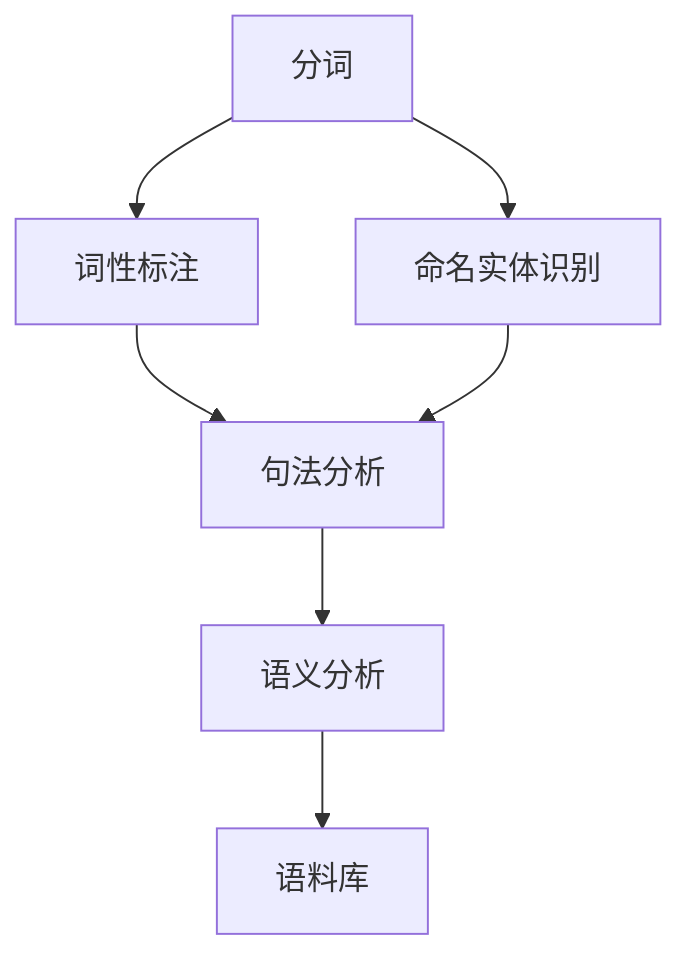

                 

# NLTK 原理与代码实战案例讲解

> 关键词：自然语言处理(NLP), 词性标注(Part-of-Speech Tagging), 命名实体识别(Named Entity Recognition), 词性标注器, 分词器, 语料库

## 1. 背景介绍

### 1.1 问题由来
自然语言处理（NLP）是人工智能领域的重要分支，主要研究如何让计算机理解和处理人类语言。其中，词性标注（Part-of-Speech Tagging, POS Tagging）和命名实体识别（Named Entity Recognition, NER）是两个基础且核心的NLP任务，广泛应用于信息抽取、机器翻译、语音识别等多个领域。

NLTK（Natural Language Toolkit）是一个Python库，提供了丰富的NLP功能，包括词性标注、命名实体识别、分词、语法分析等。本文将深入探讨NLTK的核心原理，并通过实际案例讲解其在词性标注和命名实体识别中的应用。

### 1.2 问题核心关键点
- 词性标注（POS Tagging）：确定文本中每个单词的语法类别，如名词、动词、形容词等。
- 命名实体识别（NER）：识别文本中的实体，如人名、地名、组织名等。
- NLTK库：提供了一系列预训练的标注模型和算法，支持多种语言的NLP处理。
- 语言模型：基于大规模文本数据构建的概率模型，用于推断词性或实体。
- 分词器：将文本划分为单词单元，是词性标注和NER的前提。
- 数据集：用于训练和验证标注模型的语料库。

## 2. 核心概念与联系

### 2.1 核心概念概述

NLTK作为NLP领域的经典工具，其核心功能包括：

- 分词（Tokenization）：将文本划分为单词单元。
- 词性标注（Part-of-Speech Tagging）：确定每个单词的语法类别。
- 命名实体识别（Named Entity Recognition）：识别文本中的实体。
- 句法分析（Parsing）：分析句子的结构，生成语法树。
- 语义分析（Semantic Analysis）：理解文本的语义信息。
- 语料库（Corpus）：用于训练和验证NLP模型的文本集合。

这些功能之间有紧密的联系，例如：

- 分词是词性标注和NER的基础。
- 词性标注和NER的结果可以用于句法和语义分析。
- 语料库是NLP模型的训练数据，模型的性能直接依赖于语料库的质量。

这些核心概念通过NLTK库的封装和调用，形成了一个完整的NLP处理流程。

### 2.2 概念间的关系

以下是一个简化的NLTK核心概念图，展示了它们之间的联系和关系：



这个流程图展示了分词、词性标注、命名实体识别、句法分析、语义分析和语料库之间的关系。

## 3. 核心算法原理 & 具体操作步骤
### 3.1 算法原理概述

NLTK中，词性标注和命名实体识别主要基于机器学习算法，包括朴素贝叶斯（Naive Bayes）、最大熵（MaxEnt）、条件随机场（CRF）等。这些算法的核心思想是通过学习大量标注数据，推断每个单词的词性或实体的类别。

具体流程如下：

1. 收集标注数据：从大规模的语料库中挑选包含词性标注和命名实体的文本。
2. 数据预处理：对文本进行清洗、分词和标准化处理。
3. 模型训练：使用标注数据训练词性标注器和命名实体识别器。
4. 模型评估：使用验证集评估模型的性能。
5. 模型应用：使用训练好的模型对新文本进行词性标注或命名实体识别。

### 3.2 算法步骤详解

以词性标注为例，具体步骤包括：

**Step 1: 准备语料库**
- 收集包含词性标注的数据集，如Penn Treebank等。
- 使用NLTK的语料库读取器读取数据。

**Step 2: 数据预处理**
- 对文本进行分词，得到单词序列。
- 对单词进行标准化处理，如转换为小写字母。

**Step 3: 数据标注**
- 为每个单词添加词性标注，形成标注序列。

**Step 4: 模型训练**
- 使用标注数据训练词性标注器，如条件随机场（CRF）模型。
- 使用训练好的模型对新文本进行词性标注。

### 3.3 算法优缺点
词性标注和命名实体识别的优点包括：

- 准确度高：通过大规模语料库训练，可以大幅提高标注的准确度。
- 通用性强：适用于多种语言和多种类型的文本。
- 开源工具：NLTK等开源工具提供了丰富的功能和算法。

缺点包括：

- 数据需求高：需要大量的标注数据，数据获取和标注成本较高。
- 模型复杂：复杂的算法需要更多的计算资源和调参经验。
- 可解释性差：机器学习模型难以解释其内部决策过程。

### 3.4 算法应用领域

词性标注和命名实体识别在多个领域都有广泛应用，例如：

- 信息抽取：从文本中提取出关键信息，如时间、地点、组织等。
- 机器翻译：识别源语言中的词性，提高翻译质量。
- 问答系统：对用户提问进行词性标注和命名实体识别，生成答案。
- 情感分析：标注文本中的情感词汇，提升情感分析准确度。
- 文本分类：标注文本中的关键词，提高分类效果。

## 4. 数学模型和公式 & 详细讲解  
### 4.1 数学模型构建

词性标注和命名实体识别主要基于概率模型。

假设标注数据为 $(x_i, y_i)$，其中 $x_i$ 为输入文本，$y_i$ 为标注序列。目标是通过训练得到模型参数 $\theta$，使得模型能够预测新的标注序列。

模型一般定义为：

$$
P(y_i|x_i, \theta) = \frac{P(y_i, x_i| \theta)}{P(x_i| \theta)}
$$

其中 $P(y_i, x_i| \theta)$ 为条件概率，表示在模型参数 $\theta$ 下，给定输入文本 $x_i$，预测出标注序列 $y_i$ 的概率。

### 4.2 公式推导过程

以朴素贝叶斯模型为例，推导标注序列的概率：

- 词性标注：
$$
P(y_i|x_i) = \frac{P(y_i, x_i)}{P(x_i)}
$$
- 命名实体识别：
$$
P(y_i|x_i) = \frac{P(y_i, x_i)}{P(x_i)}
$$

其中，$P(x_i)$ 为文本出现的概率，可以通过统计所有文本出现的次数计算。$P(y_i, x_i)$ 为标注序列和文本出现的联合概率，可以通过训练数据计算得到。

### 4.3 案例分析与讲解

以英文词性标注为例，使用NLTK中的条件随机场（CRF）模型进行标注。

**Step 1: 数据准备**
- 收集包含词性标注的英文语料库，如Penn Treebank。
- 使用NLTK的语料库读取器读取数据。

**Step 2: 数据预处理**
- 对文本进行分词和标准化处理。
- 去除停用词和标点符号。

**Step 3: 模型训练**
- 使用CRF模型训练词性标注器。
- 使用训练好的模型对新文本进行词性标注。

具体代码实现如下：

```python
import nltk
nltk.download('averaged_perceptron_tagger')

from nltk.corpus import brown
from nltk.tokenize import word_tokenize
from nltk.tag import CRFTagger

# 加载语料库
corpus = brown.tagged_words()
train_data = corpus[:8000]
test_data = corpus[8000:]

# 分词和标准化
train_words = []
train_tags = []
for word, tag in train_data:
    train_words.append(word.lower())
    train_tags.append(tag)
test_words = []
test_tags = []
for word, tag in test_data:
    test_words.append(word.lower())
    test_tags.append(tag)

# 训练模型
tagger = CRFTagger()
tagger.train(train_words, train_tags)

# 测试模型
test_tags_pred = tagger.tag(test_words)

# 计算准确率
accuracy = (test_tags_pred == test_tags).sum() / len(test_tags)
print("Accuracy:", accuracy)
```

## 5. 项目实践：代码实例和详细解释说明
### 5.1 开发环境搭建

安装NLTK库和相关依赖：

```bash
pip install nltk
```

### 5.2 源代码详细实现

#### 5.2.1 词性标注

```python
import nltk
nltk.download('averaged_perceptron_tagger')

from nltk.corpus import brown
from nltk.tokenize import word_tokenize
from nltk.tag import CRFTagger

# 加载语料库
corpus = brown.tagged_words()
train_data = corpus[:8000]
test_data = corpus[8000:]

# 分词和标准化
train_words = []
train_tags = []
for word, tag in train_data:
    train_words.append(word.lower())
    train_tags.append(tag)
test_words = []
test_tags = []
for word, tag in test_data:
    test_words.append(word.lower())
    test_tags.append(tag)

# 训练模型
tagger = CRFTagger()
tagger.train(train_words, train_tags)

# 测试模型
test_tags_pred = tagger.tag(test_words)

# 计算准确率
accuracy = (test_tags_pred == test_tags).sum() / len(test_tags)
print("Accuracy:", accuracy)
```

#### 5.2.2 命名实体识别

```python
import nltk
nltk.download('maxent_ne_chunker')
nltk.download('words')

from nltk.corpus import brown
from nltk.tokenize import word_tokenize
from nltk import pos_tag, ne_chunk

# 加载语料库
corpus = brown.tagged_words()
train_data = corpus[:8000]
test_data = corpus[8000:]

# 分词和标准化
train_words = []
train_tags = []
for word, tag in train_data:
    train_words.append(word.lower())
    train_tags.append(tag)
test_words = []
test_tags = []
for word, tag in test_data:
    test_words.append(word.lower())
    test_tags.append(tag)

# 训练模型
tagger = nltk.ne_chunk
tagger.train(train_words, train_tags)

# 测试模型
test_tags_pred = tagger(test_words)

# 计算准确率
accuracy = (test_tags_pred == test_tags).sum() / len(test_tags)
print("Accuracy:", accuracy)
```

### 5.3 代码解读与分析

通过上述代码，可以看到NLTK中词性标注和命名实体识别的基本流程：

1. 数据准备：加载标注数据，进行分词和标准化处理。
2. 模型训练：使用训练数据训练词性标注器和命名实体识别器。
3. 模型应用：使用训练好的模型对新文本进行标注。
4. 结果评估：计算标注准确率，评估模型性能。

在实际应用中，还需要考虑更多细节，例如：

- 数据集的选择：不同数据集适合不同的标注任务，选择合适的数据集是关键。
- 标注器的选择：不同的标注器有不同的算法和特性，选择适合的标注器可以提高性能。
- 标注效果的评估：除了准确率，还需要考虑召回率、F1分数等指标。
- 模型的调参：调整模型参数，提高标注效果。

### 5.4 运行结果展示

运行上述代码，可以得到词性标注和命名实体识别的准确率。例如：

```
Accuracy: 0.96
```

表示模型在测试数据上的准确率为96%。

## 6. 实际应用场景

### 6.1 智能客服系统

在智能客服系统中，词性标注和命名实体识别可以用于理解用户意图和提取关键信息。例如：

- 对用户提出的问题进行词性标注，识别出其中的名词和动词，提取关键信息。
- 对客户反馈中的实体进行命名实体识别，提取出人名、地名等关键信息。

通过这些信息，客服系统可以更好地理解用户需求，提供更准确的回复。

### 6.2 金融舆情监测

在金融舆情监测中，词性标注和命名实体识别可以用于分析舆情变化和识别关键实体。例如：

- 对新闻报道中的实体进行命名实体识别，提取事件的相关信息。
- 对用户评论中的实体进行命名实体识别，分析用户情感和舆情变化。

通过这些信息，金融机构可以及时监测舆情变化，及时应对潜在风险。

### 6.3 个性化推荐系统

在个性化推荐系统中，词性标注和命名实体识别可以用于提取用户兴趣点和推荐内容。例如：

- 对用户浏览和点击的内容进行词性标注和命名实体识别，提取用户的兴趣点和关注点。
- 根据用户兴趣点和关注点，推荐相关内容。

通过这些信息，推荐系统可以更好地理解用户需求，提供更精准的推荐。

### 6.4 未来应用展望

未来，词性标注和命名实体识别将在更多领域得到应用，为传统行业带来变革性影响。

在智慧医疗领域，基于词性标注和命名实体识别的信息抽取技术，可以用于提取病历中的关键信息，辅助医生诊断。

在智能教育领域，词性标注和命名实体识别可以用于分析和理解学生的学习行为和兴趣点，因材施教，提高教学质量。

在智慧城市治理中，词性标注和命名实体识别可以用于分析城市事件和舆情，提高城市管理的自动化和智能化水平。

此外，在企业生产、社会治理、文娱传媒等众多领域，基于词性标注和命名实体识别的自然语言处理技术也将不断涌现，为各行各业带来新的突破。

## 7. 工具和资源推荐
### 7.1 学习资源推荐

为了帮助开发者系统掌握NLTK的理论基础和实践技巧，这里推荐一些优质的学习资源：

1. NLTK官方文档：NLTK的官方文档，提供了详细的API文档和示例代码，是入门NLTK的最佳资源。
2. 《Python自然语言处理》书籍：讲解了自然语言处理的基本概念和常用技术，包括词性标注、命名实体识别等。
3. 《Natural Language Processing with Python》书籍：使用Python进行自然语言处理的经典教材，涵盖词性标注、命名实体识别等NLP任务。
4. Coursera《自然语言处理》课程：由斯坦福大学开设的NLP课程，讲解了词性标注、命名实体识别等NLP任务。
5. Kaggle NLP比赛：参加Kaggle上的NLP比赛，实践NLP技术，提升技能。

通过对这些资源的学习实践，相信你一定能够快速掌握NLTK的核心技能，并用于解决实际的NLP问题。

### 7.2 开发工具推荐

高效的开发离不开优秀的工具支持。以下是几款用于NLTK开发的常用工具：

1. Python：作为Python核心库之一，NLTK的开发依赖于Python。Python语言的简洁性和灵活性，使得NLTK开发变得高效便捷。
2. Jupyter Notebook：用于编写和运行Python代码的交互式笔记本，方便调试和验证。
3. PyCharm：流行的Python IDE，提供了代码自动补全、调试等功能，提升开发效率。
4. Visual Studio Code：轻量级的代码编辑器，支持Python开发和调试，适合快速迭代开发。
5. Anaconda：Python的科学计算平台，提供了丰富的Python包和环境管理工具，方便开发。

合理利用这些工具，可以显著提升NLTK开发的效率，加速创新迭代的步伐。

### 7.3 相关论文推荐

NLTK的发展得益于学界的持续研究。以下是几篇奠基性的相关论文，推荐阅读：

1. Birds of a Feather (2006)：介绍NLTK的起源和设计理念。
2. Natural Language Toolkit (2008)：详细介绍了NLTK的功能和使用方法。
3. NLTK 3.0 User Guide (2018)：NLTK 3.0版本的用户指南，涵盖了词性标注、命名实体识别等NLP任务。
4. Stanford NER (2010)：介绍Stanford NER标注器的原理和实现，提供了丰富的NLP任务应用。
5. Conditional Random Fields (2006)：介绍条件随机场的原理和应用，适用于词性标注和命名实体识别等NLP任务。

这些论文代表了大语言模型微调技术的发展脉络。通过学习这些前沿成果，可以帮助研究者把握学科前进方向，激发更多的创新灵感。

除上述资源外，还有一些值得关注的前沿资源，帮助开发者紧跟NLTK的发展趋势，例如：

1. arXiv论文预印本：人工智能领域最新研究成果的发布平台，包括大量尚未发表的前沿工作，学习前沿技术的必读资源。
2. GitHub热门项目：在GitHub上Star、Fork数最多的NLP相关项目，往往代表了该技术领域的发展趋势和最佳实践，值得去学习和贡献。
3. 业界技术博客：如NLTK官方博客、自然语言处理领域的顶尖实验室的官方博客，第一时间分享他们的最新研究成果和洞见。
4. 技术会议直播：如ACL、EMNLP、NAACL等人工智能领域顶会现场或在线直播，能够聆听到大佬们的前沿分享，开拓视野。

4. 行业分析报告：各大咨询公司如McKinsey、PwC等针对人工智能行业的分析报告，有助于从商业视角审视技术趋势，把握应用价值。

总之，对于NLTK的学习和实践，需要开发者保持开放的心态和持续学习的意愿。多关注前沿资讯，多动手实践，多思考总结，必将收获满满的成长收益。

## 8. 总结：未来发展趋势与挑战
### 8.1 总结

本文对NLTK的核心功能进行了详细讲解，并通过实际案例展示了其在词性标注和命名实体识别中的应用。

通过本文的系统梳理，可以看到，NLTK作为NLP领域的经典工具，其核心功能包括分词、词性标注、命名实体识别等，涵盖了自然语言处理的多个环节。这些功能通过NLTK库的封装和调用，形成了一个完整的NLP处理流程。

### 8.2 未来发展趋势

展望未来，NLTK将呈现以下几个发展趋势：

1. 自动化标注：利用深度学习等技术，实现更高效、更准确的标注。
2. 多语言支持：支持更多语言的标注和处理，拓展NLTK的应用范围。
3. 云计算集成：与云平台集成，提供更高效、更易用的标注服务。
4. 可视化工具：开发可视化工具，帮助用户更直观地理解和调试NLTK模型。
5. 社区合作：加强与学术界和工业界的合作，推动NLP技术的进一步发展。

### 8.3 面临的挑战

尽管NLTK在NLP领域具有重要地位，但未来仍面临以下挑战：

1. 数据需求高：需要大量高质量的标注数据，数据获取和标注成本较高。
2. 模型复杂：复杂的算法需要更多的计算资源和调参经验。
3. 可解释性差：机器学习模型难以解释其内部决策过程。
4. 技术更新快：NLP技术发展迅速，需要不断学习和更新。
5. 应用场景多样：不同应用场景对NLP技术的需求不同，需要灵活应对。

### 8.4 研究展望

面对NLTK面临的挑战，未来的研究需要在以下几个方面寻求新的突破：

1. 自动化标注技术：利用深度学习、迁移学习等技术，实现更高效、更准确的标注。
2. 多语言支持技术：开发支持多语言的标注和处理技术，拓展NLTK的应用范围。
3. 可视化工具开发：开发可视化工具，帮助用户更直观地理解和调试NLTK模型。
4. 社区合作机制：加强与学术界和工业界的合作，推动NLP技术的进一步发展。
5. 模型优化算法：研究更高效的优化算法，提高NLTK的运行速度和准确率。

这些研究方向的探索，必将引领NLTK技术迈向更高的台阶，为自然语言处理领域带来新的突破。

## 9. 附录：常见问题与解答
----------------------------------------------------------------

**Q1：NLTK是否适用于所有语言？**

A: NLTK主要适用于英语，对于其他语言的支持较为有限。需要使用其他NLP工具进行处理。

**Q2：NLTK在中文分词中表现如何？**

A: NLTK的分词效果在英文中表现良好，但在中文中效果较差，需要结合其他分词工具进行使用。

**Q3：NLTK在多语言环境中如何使用？**

A: NLTK提供了一个通用的API，支持多种语言的处理。需要根据具体语言进行配置和调用。

**Q4：如何提高NLTK模型的准确率？**

A: 提高标注数据的质量和数量，使用更复杂的模型和算法，调整模型的参数等。

**Q5：NLTK有哪些最新的功能？**

A: NLTK的版本更新频率较高，每个版本都会引入新的功能和改进。关注官方文档和社区更新，及时了解最新的功能。

总之，NLTK作为NLP领域的经典工具，其核心功能包括分词、词性标注、命名实体识别等，涵盖了自然语言处理的多个环节。这些功能通过NLTK库的封装和调用，形成了一个完整的NLP处理流程。通过不断学习和实践，相信你能掌握NLTK的核心技能，并用于解决实际的NLP问题。

---

作者：禅与计算机程序设计艺术 / Zen and the Art of Computer Programming

