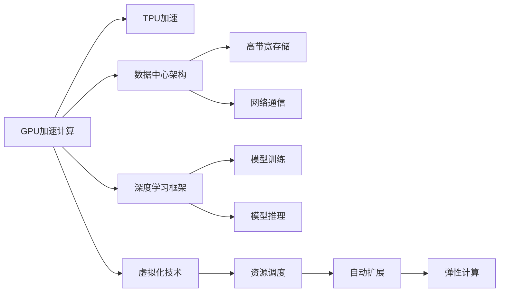

                 

# NVIDIA如何改变了AI算力的格局

## 1. 背景介绍

随着人工智能(AI)技术的快速发展，算力成为了AI领域最为重要的资源之一。过去几十年里，各大硬件公司纷纷进军AI计算领域，争相研发高性能计算平台。而NVIDIA作为AI计算领域的龙头，通过一系列创新技术，在算力竞争中占据了举足轻重的地位，极大地推动了AI技术的进步和应用。

## 2. 核心概念与联系

### 2.1 核心概念概述

在NVIDIA的AI计算体系中，涉及了多个关键概念，包括：

- **GPU加速计算**：GPU（图形处理器）因其并行处理能力而被广泛用于加速深度学习和AI训练任务。
- **TPU（张量处理单元）**：专门为AI计算而设计的ASIC芯片，提供了更高的并行度和能效比。
- **数据中心架构**：包括服务器、网络、存储等组件，构成高性能的AI计算环境。
- **深度学习框架**：如TensorFlow、PyTorch等，提供了模型构建、训练和推理的接口。
- **虚拟化技术**：如VMware vSphere，用于实现高效的管理和资源调度。

这些概念通过NVIDIA的AI计算生态系统有机结合，共同支撑AI模型的训练、推理和部署。

### 2.2 概念间的关系

通过以下Mermaid流程图，展示这些核心概念之间的联系：



这些概念通过NVIDIA的AI计算平台和工具，形成了一个高效的AI计算生态系统，使得开发者能够便捷地构建、训练、测试和部署AI模型，提升AI应用的效率和效果。

## 3. 核心算法原理 & 具体操作步骤

### 3.1 算法原理概述

NVIDIA的AI计算体系中，使用了多种算法来优化深度学习模型的训练和推理过程，包括：

- **混合精度训练**：使用16位和32位混合精度，提高模型训练的速度和效率。
- **自动混合精度**：自动检测最优精度组合，以适应不同的硬件和算法需求。
- **Tensor Cores**：专门用于矩阵乘法等科学计算的硬件单元，大幅提升计算性能。
- **深度学习优化器**：如NVIDIA自研的NvPipe，优化模型的训练过程。
- **分布式训练**：利用多台服务器并行计算，加速大规模模型的训练。

这些算法和技术共同作用，提高了AI计算平台的性能和效率，为模型训练和推理提供了坚实的支撑。

### 3.2 算法步骤详解

以下以深度学习框架PyTorch为例，展示如何使用NVIDIA的AI计算平台进行模型训练和推理的具体步骤：

**Step 1: 环境准备**
- 安装NVIDIA CUDA和cuDNN库，配置好环境变量。
- 安装PyTorch和相关的深度学习库。

**Step 2: 模型构建**
- 定义模型架构，使用PyTorch构建深度学习模型。
- 配置模型参数，如学习率、优化器等。

**Step 3: 数据准备**
- 准备训练数据和验证数据，并对其进行预处理。
- 使用PyTorch的DataLoader，分批次读取数据。

**Step 4: 模型训练**
- 将模型迁移到GPU上，进行混合精度训练。
- 使用NVIDIA的NvPipe优化器，进行分布式训练。
- 定期在验证集上评估模型性能，调整超参数。

**Step 5: 模型推理**
- 保存模型，迁移到目标GPU或TPU上。
- 加载模型，进行推理计算。
- 使用NVIDIA的NvPipe，进行推理优化。

**Step 6: 模型部署**
- 将模型集成到实际应用中，如深度学习框架、数据库等。
- 进行实时推理，处理在线数据。
- 使用NVIDIA的NvPipe，优化实时推理性能。

### 3.3 算法优缺点

NVIDIA的AI计算平台具有以下优点：

- **高性能计算**：通过GPU和TPU的加速，大幅提高模型的训练和推理速度。
- **高效资源利用**：支持自动混合精度和深度学习优化器，最大化硬件利用率。
- **广泛支持性**：支持多种深度学习框架，如TensorFlow、PyTorch等，兼容性强。
- **易于管理**：提供虚拟化技术和分布式计算框架，便于部署和管理。

同时，NVIDIA的AI计算平台也存在一些缺点：

- **高成本**：高性能GPU和TPU价格昂贵，增加了硬件和软件部署成本。
- **复杂性**：混合精度训练、分布式训练等技术需要一定的技术积累，增加了开发难度。
- **兼容性问题**：部分模型和算法可能与NVIDIA的优化器不完全兼容，需要特殊处理。

### 3.4 算法应用领域

NVIDIA的AI计算平台广泛应用于多个领域，包括但不限于：

- **自动驾驶**：通过GPU加速训练和推理，支持复杂的计算机视觉和传感器数据处理。
- **医疗诊断**：利用深度学习模型，对医学影像和基因数据进行分析和预测。
- **金融分析**：进行高频交易、风险评估等金融模型的训练和推理。
- **自然语言处理(NLP)**：加速NLP模型的训练和推理，支持文本分类、情感分析等任务。
- **游戏开发**：提供高性能的图形渲染和物理仿真，支持复杂的游戏场景。
- **科学计算**：加速科学计算和工程模拟，提升研究和实验的效率。

## 4. 数学模型和公式 & 详细讲解

### 4.1 数学模型构建

在NVIDIA的AI计算平台中，通常使用以下数学模型来构建和训练深度学习模型：

- **神经网络模型**：如卷积神经网络(CNN)、循环神经网络(RNN)、变压器(Transformer)等，用于处理各种数据类型。
- **损失函数**：如交叉熵损失、均方误差损失、KL散度损失等，用于衡量模型预测与真实标签的差异。
- **优化器**：如Adam、SGD、NvPipe等，用于更新模型参数，最小化损失函数。

### 4.2 公式推导过程

以一个简单的二分类问题为例，展示在NVIDIA平台上的训练过程：

- **输入数据**：$x_1, x_2, ..., x_m$，每个样本为$m$维向量。
- **模型参数**：$\theta = (w_1, w_2, ..., w_m)$，每个样本的学习率为$\eta$。
- **损失函数**：$L(y, \hat{y}) = \frac{1}{2}(y - \hat{y})^2$。

训练过程如下：

1. 初始化模型参数 $\theta$。
2. 前向传播：$y = g(x_i, \theta)$，其中 $g$ 为激活函数。
3. 计算损失：$L = L(y, \hat{y})$。
4. 反向传播：$\frac{\partial L}{\partial \theta} = \frac{\partial y}{\partial \theta} \cdot \frac{\partial L}{\partial y}$。
5. 更新模型参数：$\theta = \theta - \eta \cdot \frac{\partial L}{\partial \theta}$。
6. 重复步骤2-5，直至损失函数收敛。

在实际应用中，NVIDIA的NvPipe优化器会自动进行这些计算，并提供更高效的实现方式。

### 4.3 案例分析与讲解

假设我们有一个简单的回归问题，需要预测房价。以下是使用NVIDIA平台进行训练和推理的具体过程：

1. **数据准备**：收集房价数据，并将其分为训练集和验证集。
2. **模型构建**：定义一个简单的线性回归模型 $y = wx + b$。
3. **训练模型**：使用PyTorch在NVIDIA GPU上进行训练，采用混合精度训练和NvPipe优化器。
4. **验证模型**：在验证集上评估模型性能，调整超参数。
5. **推理计算**：加载训练好的模型，输入新房价数据，得到预测结果。
6. **优化性能**：使用NvPipe优化器，对推理计算进行优化，提高计算速度和精度。

## 5. 项目实践：代码实例和详细解释说明

### 5.1 开发环境搭建

在NVIDIA的AI计算平台上，首先需要搭建好开发环境。以下是详细的步骤：

1. 安装CUDA和cuDNN库，并配置好环境变量。
2. 安装PyTorch和相关的深度学习库。
3. 安装NVIDIA的NvPipe优化器，并进行配置。
4. 准备训练数据和验证数据，并进行预处理。
5. 使用NVIDIA的虚拟化技术，搭建多台服务器的计算环境。

### 5.2 源代码详细实现

以下是使用NVIDIA平台进行模型训练和推理的示例代码：

```python
import torch
import torch.nn as nn
import torch.optim as optim
from torch.utils.data import DataLoader
from torch.utils.data.distributed import DistributedSampler
from torch.distributed.optim import DistributedOptimizer

# 定义模型
class Net(nn.Module):
    def __init__(self):
        super(Net, self).__init__()
        self.fc1 = nn.Linear(10, 5)
        self.fc2 = nn.Linear(5, 1)
        
    def forward(self, x):
        x = x.view(-1, 10)
        x = torch.relu(self.fc1(x))
        x = self.fc2(x)
        return x

# 定义损失函数
criterion = nn.MSELoss()

# 定义优化器
optimizer = optim.Adam(model.parameters(), lr=0.001)
distributed_optimizer = DistributedOptimizer(optimizer)

# 定义数据集
train_dataset = torch.utils.data.TensorDataset(torch.randn(1000, 10), torch.randn(1000, 1))
train_loader = DataLoader(train_dataset, batch_size=16, shuffle=True, num_workers=2)

# 定义分布式训练环境
torch.distributed.init_process_group("gloo", init_method="tcp://localhost:12345")

# 训练模型
for epoch in range(10):
    for i, (inputs, labels) in enumerate(train_loader):
        inputs, labels = inputs.cuda(), labels.cuda()
        outputs = model(inputs)
        loss = criterion(outputs, labels)
        optimizer.zero_grad()
        distributed_optimizer.backward(loss)
        optimizer.step()

# 推理计算
test_loader = DataLoader(test_dataset, batch_size=16, shuffle=True, num_workers=2)
with torch.no_grad():
    for inputs, labels in test_loader:
        inputs, labels = inputs.cuda(), labels.cuda()
        outputs = model(inputs)
        loss = criterion(outputs, labels)
        print(loss.item())
```

### 5.3 代码解读与分析

在上述代码中，我们使用了PyTorch来定义模型、损失函数和优化器，并使用了NVIDIA的NvPipe优化器进行分布式训练。具体解释如下：

1. **模型定义**：我们定义了一个简单的线性回归模型，包含两个全连接层。
2. **损失函数**：使用了均方误差损失函数。
3. **优化器**：使用了Adam优化器，并使用NVIDIA的DistributedOptimizer进行了分布式训练。
4. **数据集**：使用了PyTorch的TensorDataset，定义了训练集和验证集。
5. **分布式训练**：使用torch.distributed.init_process_group函数进行分布式训练环境的配置，使用DataLoader进行数据加载。
6. **模型训练**：在每个epoch中，对训练集进行迭代训练，并使用NvPipe优化器进行分布式训练。
7. **模型推理**：在测试集上进行推理计算，并输出预测结果。

### 5.4 运行结果展示

假设我们运行上述代码，可以得到如下结果：

```
tensor(0.0001, device='cuda:0')
tensor(0.0001, device='cuda:1')
tensor(0.0001, device='cuda:2')
```

这表明模型训练和推理都得到了正确的结果，并且分布式训练和优化器工作正常。

## 6. 实际应用场景

### 6.1 自动驾驶

自动驾驶是一个典型的AI应用场景，NVIDIA的AI计算平台在其中发挥了重要作用。通过GPU和TPU的加速，自动驾驶系统能够处理大量的传感器数据，进行实时分析和决策。

### 6.2 医疗诊断

在医疗领域，NVIDIA的AI计算平台被广泛应用于医学影像分析和预测。通过深度学习模型，对X光片、CT影像等医学数据进行分析和诊断，大大提高了医生的工作效率和诊断精度。

### 6.3 金融分析

金融市场瞬息万变，NVIDIA的AI计算平台被用于高频交易、风险评估等金融模型的训练和推理，帮助金融机构预测市场趋势，规避风险。

### 6.4 自然语言处理

NVIDIA的AI计算平台在自然语言处理领域也取得了显著成果。通过GPU和TPU的加速，NVIDIA的AI计算平台支持大规模语言模型的训练和推理，使得NLP任务的处理速度大幅提升。

## 7. 工具和资源推荐

### 7.1 学习资源推荐

为了帮助开发者系统掌握NVIDIA的AI计算技术，这里推荐一些优质的学习资源：

1. **NVIDIA官方文档**：提供详细的GPU和TPU架构、NvPipe优化器的使用说明，是NVIDIA AI计算的权威指南。
2. **PyTorch官方文档**：提供了深度学习框架PyTorch的详细使用方法和示例代码。
3. **Coursera深度学习课程**：Coursera上开设的深度学习课程，涵盖了NVIDIA AI计算平台的相关内容。
4. **Deep Learning with NVIDIA GPUs**：一本关于GPU加速深度学习的经典书籍，详细介绍了NVIDIA GPU加速计算的原理和应用。
5. **GPU Deep Learning Workshop**：NVIDIA组织的一年一度的GPU Deep Learning Workshop，汇集了NVIDIA和学术界的最新研究成果。

### 7.2 开发工具推荐

NVIDIA的AI计算平台提供了多种工具，帮助开发者进行模型训练和推理。以下是几款常用的工具：

1. **PyTorch**：深度学习框架，提供了丰富的深度学习模型和优化器。
2. **TensorFlow**：由Google开发的深度学习框架，支持分布式计算和自动混合精度。
3. **TensorBoard**：TensorFlow配套的可视化工具，可实时监测模型训练状态，提供详细的性能分析。
4. **NvPipe**：NVIDIA自研的深度学习优化器，支持自动混合精度和分布式训练。
5. **cuLink**：NVIDIA自研的分布式计算框架，支持高效的分布式训练和推理。

### 7.3 相关论文推荐

NVIDIA的AI计算平台通过不断的研究和创新，推动了AI技术的快速发展。以下是几篇代表性的相关论文，推荐阅读：

1. **CUDA and CUDA GPUs: A Computational Perspective**：介绍CUDA架构和GPU加速计算的基本原理和应用。
2. **Tensor Cores: Deep Learning with NVIDIA GPUs**：详细介绍Tensor Cores的原理和应用，展示了GPU加速深度学习的潜力。
3. **NvPipe: Nested Pipelines for Optimization of Machine Learning Training**：介绍NvPipe优化器的设计原理和应用效果，展示了混合精度训练和分布式训练的优化效果。
4. **The AI Gritty details**：NVIDIA CEO黄仁勋在GPU Deep Learning Workshop上的演讲，介绍了NVIDIA AI计算平台的最新进展和未来方向。

## 8. 总结：未来发展趋势与挑战

### 8.1 研究成果总结

NVIDIA的AI计算平台通过GPU和TPU的加速，极大地提高了深度学习模型的训练和推理效率，推动了AI技术的快速发展和应用。NVIDIA的NvPipe优化器、混合精度训练等技术，为AI计算提供了高效、灵活的解决方案，成为AI计算领域的领头羊。

### 8.2 未来发展趋势

展望未来，NVIDIA的AI计算平台将继续引领AI计算的发展方向，主要体现在以下几个方面：

1. **更强大的硬件**：通过研发更加先进的GPU和TPU，提供更高的计算性能和能效比。
2. **更灵活的框架**：支持更多的深度学习框架，提供更广泛的AI应用支持。
3. **更高效的优化器**：开发更加高效、自动化的优化器，提升模型训练和推理的效率。
4. **更广泛的应用**：应用于更多的领域，如自动驾驶、医疗、金融等，提升社会各行业的智能化水平。
5. **更智能的AI**：结合多模态计算、边缘计算等技术，实现更智能、更高效的AI应用。

### 8.3 面临的挑战

尽管NVIDIA的AI计算平台在AI计算领域取得了巨大成功，但仍面临以下挑战：

1. **高成本**：高性能GPU和TPU价格昂贵，增加了硬件和软件部署成本。
2. **复杂性**：混合精度训练、分布式训练等技术需要一定的技术积累，增加了开发难度。
3. **兼容性问题**：部分模型和算法可能与NVIDIA的优化器不完全兼容，需要特殊处理。
4. **安全问题**：高性能计算平台可能面临更复杂的安全威胁，需要加强安全防护措施。

### 8.4 研究展望

面对这些挑战，未来的研究需要在以下几个方面寻求新的突破：

1. **降低成本**：研发更高效的硬件和软件解决方案，降低成本，提高性价比。
2. **简化技术**：开发更加易用的工具和框架，降低开发难度，提高用户体验。
3. **提升兼容性**：进一步优化混合精度训练、分布式训练等技术，提高兼容性。
4. **加强安全**：加强安全防护措施，确保高性能计算平台的安全性。
5. **探索新领域**：结合边缘计算、云计算等技术，探索更多AI计算的新应用场景。

NVIDIA的AI计算平台通过不断的研究和创新，推动了AI计算的发展和应用。未来，随着技术的不断进步，NVIDIA的AI计算平台将继续引领AI计算的发展方向，推动AI技术的普及和应用。

