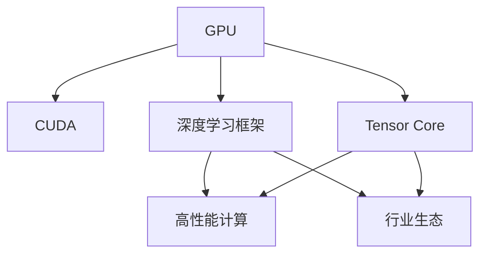

                 

# NVIDIA的GPU技术与AI算力

> 关键词：GPU, AI算力, 深度学习, CUDA, 张量核心, 深度学习框架, 应用场景, 高性能计算, 行业生态

## 1. 背景介绍

### 1.1 问题由来
随着人工智能(AI)技术的快速发展，深度学习成为了AI领域的主流技术。深度学习模型复杂庞大，运算需求高，传统CPU无法满足其性能要求，因此需要一个专用且高效的计算平台来支持。NVIDIA推出的GPU（图形处理单元）正是在这样的背景下诞生的。

NVIDIA的GPU技术在过去几年里不断进化，成为了深度学习领域的中流砥柱。它通过高效的并行计算能力，显著提升了AI算力，使得深度学习模型的训练和推理效率得以大幅提高。同时，NVIDIA还推出了如CUDA等配套工具，进一步简化了AI开发流程。

本文将深入探讨NVIDIA的GPU技术与AI算力，介绍其核心概念、算法原理和操作步骤，并分析其优缺点和应用领域，最后展望未来发展趋势与挑战。

## 2. 核心概念与联系

### 2.1 核心概念概述

为更好地理解NVIDIA的GPU技术与AI算力，本节将介绍几个关键概念：

- **GPU (图形处理单元)**：一种由NVIDIA设计并制造的硬件芯片，具有极高的并行计算能力。
- **AI算力 (Artificial Intelligence computational power)**：深度学习模型执行训练和推理任务所需的计算资源。
- **CUDA (Compute Unified Device Architecture)**：NVIDIA开发的一种并行编程模型，用于在GPU上高效执行计算任务。
- **张量核心 (Tensor Core)**：NVIDIA GPU上的一种特殊计算单元，用于处理矩阵乘法、卷积等深度学习运算。
- **深度学习框架 (Deep Learning Framework)**：如TensorFlow、PyTorch等，用于封装深度学习模型的开发、训练和部署。
- **高性能计算 (High-Performance Computing, HPC)**：通过高效的计算资源实现高性能科学计算、数据分析和机器学习等任务。
- **行业生态 (Industry Ecosystem)**：涉及硬件、软件、服务等多个层面，形成支持深度学习的完整生态系统。

这些概念构成了NVIDIA GPU技术与AI算力的基础框架，相互之间有着紧密的联系和相互促进的关系。

### 2.2 概念间的关系

这些核心概念之间的逻辑关系可以通过以下Mermaid流程图来展示：



这个流程图展示了大语言模型的核心概念及其之间的关系：

1. GPU作为基础硬件平台，提供高性能的计算能力。
2. CUDA作为并行编程模型，使开发者能够高效地利用GPU计算。
3. 张量核心是GPU上的特殊计算单元，专门用于加速深度学习运算。
4. 深度学习框架封装了深度学习模型的开发和优化，提供了高效的工具链。
5. 高性能计算依托于GPU等硬件资源，进行复杂的科学计算和数据分析。
6. 行业生态涉及硬件、软件和服务，形成了完整的AI应用支撑体系。

这些概念共同构成了NVIDIA GPU技术与AI算力的完整生态系统，使得深度学习应用得以在多个领域落地。

## 3. 核心算法原理 & 具体操作步骤
### 3.1 算法原理概述

NVIDIA的GPU技术与AI算力核心算法原理基于并行计算和张量计算，具有高度的并行性和高效性。

并行计算将一个大任务分解为多个小任务，这些小任务可以并行执行。在GPU上，每个计算单元可以独立执行指令，从而实现高效的并行计算。

张量计算则是指GPU上的特殊计算单元（张量核心）专门用于处理矩阵乘法、卷积等深度学习运算，极大地提高了深度学习模型的运算速度。

### 3.2 算法步骤详解

以下是大语言模型GPU技术与AI算力实现的核心算法步骤：

**Step 1: 数据准备**
- 将深度学习模型所需的大量数据导入GPU内存。
- 对数据进行预处理，如归一化、分批次等操作，以适应GPU的计算模式。

**Step 2: 模型构建**
- 使用深度学习框架（如TensorFlow、PyTorch等）构建深度学习模型。
- 使用CUDA编程模型，将模型代码进行并行化，提高计算效率。

**Step 3: 模型训练**
- 将模型和数据传输到GPU上，使用并行计算和张量计算加速模型训练。
- 在训练过程中，动态调整GPU计算资源的分配，以适应模型复杂度的变化。

**Step 4: 模型优化**
- 对模型进行超参数调优，如学习率、批量大小等，以获得最优的训练效果。
- 使用CUDA工具进行模型参数的优化和调度，提高计算资源的利用率。

**Step 5: 模型部署**
- 将训练好的模型导出并部署到目标应用中。
- 使用GPU的并行计算能力，快速响应用户请求，提供高效的服务。

### 3.3 算法优缺点

NVIDIA的GPU技术与AI算力方法具有以下优点：

1. 高并行性。GPU的并行计算能力使其能够在短时间内处理大量的数据，提高深度学习模型的训练速度。
2. 高效性。张量核心的优化使得深度学习运算速度大大提高，降低了计算成本。
3. 编程友好。CUDA工具简化了GPU编程，使得深度学习开发者能够快速上手，提高开发效率。
4. 可扩展性。GPU技术支持大规模集群部署，可以轻松扩展计算资源，满足大规模深度学习任务的需求。

同时，该方法也存在一些缺点：

1. 内存限制。GPU的内存容量有限，当数据量过大时，无法全部加载到内存中，需要分批次处理。
2. 计算复杂度。某些深度学习模型可能需要高度并行化的操作，这对GPU硬件和编程能力提出了较高要求。
3. 能耗高。GPU的高并行计算能力需要消耗大量的电能，对环境有较大影响。
4. 编程难度高。CUDA编程模型的学习曲线较陡峭，需要一定的编程基础。

尽管有这些局限，但总体而言，NVIDIA的GPU技术与AI算力方法仍然是当前深度学习领域最主流的技术之一，极大地推动了AI技术的发展。

### 3.4 算法应用领域

基于NVIDIA的GPU技术与AI算力的深度学习模型，已经在多个领域得到了广泛应用：

- **计算机视觉**：如目标检测、图像识别、人脸识别等任务，借助GPU的并行计算能力，可以大幅提升计算速度。
- **自然语言处理**：如机器翻译、语音识别、情感分析等任务，通过张量核心的优化，提高了模型的推理速度。
- **医疗影像**：如医学图像分析、病灶识别等任务，GPU的高计算能力使得模型训练速度和精度得到了显著提升。
- **自动驾驶**：如车辆路径规划、障碍物检测等任务，GPU技术支持复杂环境的实时处理，提高了车辆的安全性和稳定性。
- **金融分析**：如风险评估、投资策略优化等任务，通过并行计算加速了数据处理和模型训练，提高了决策效率。
- **气象预测**：如气候变化模拟、天气预报等任务，通过大规模的并行计算，提高了模型的计算精度和响应速度。
- **游戏开发**：如实时渲染、物理模拟等任务，通过高效的GPU计算，提升了游戏的运行流畅度和用户体验。

这些应用领域展示了GPU技术与AI算力的广泛影响力和巨大潜力。

## 4. 数学模型和公式 & 详细讲解 & 举例说明

### 4.1 数学模型构建

假设深度学习模型 $M$ 采用CUDA编程，并在GPU上运行。模型的输入为 $x$，输出为 $y$。模型的前向传播计算过程可以表示为：

$$ y = M(x) $$

其中 $M(x)$ 表示模型在输入 $x$ 上的计算结果。

### 4.2 公式推导过程

以下以矩阵乘法为例，推导CUDA编程模型中的计算过程。

假设输入数据 $x$ 和权重 $w$ 分别为 $m \times n$ 和 $n \times p$ 的矩阵，则矩阵乘法的计算过程可以表示为：

$$ y = x \cdot w $$

其中 $y$ 为 $m \times p$ 的矩阵。在CUDA编程模型中，可以使用CUDA核函数实现矩阵乘法：

```python
def matrix_multiply(x, w):
    # 定义矩阵乘法核函数
    def kernel(thread_id, block_id, grid_dim):
        # 计算块内线程编号和矩阵下标
        block_size = blockDim.x
        thread_id_in_block = thread_id % block_size
        block_start_row = block_id * block_size
        block_start_col = block_start_row * m + thread_id_in_block
        # 计算矩阵乘法结果
        result = 0
        for j in range(n):
            result += x[block_start_row, j] * w[j, block_start_col]
        # 输出结果到全局内存
        y[block_start_row, block_start_col] = result
    
    # 定义计算块大小和网格大小
    block_size = 256
    grid_dim = (m * p) // block_size
    # 启动并行计算
    cuda.kernel(grid_dim, block_size, kernel)
    return y
```

在核函数中，使用了线程编号和块编号计算矩阵乘法结果，并通过 `cuda.kernel` 启动并行计算。

### 4.3 案例分析与讲解

以NVIDIA的BERT模型为例，分析其基于GPU与CUDA的实现过程。

BERT模型的编码器由多个Transformer层组成，每层包含多个子层，如自注意力机制、前馈神经网络等。这些子层需要通过GPU的并行计算和张量计算进行加速。

在CUDA编程模型中，可以使用CUDA核函数实现每个子层的并行计算：

```python
# 定义自注意力机制的核函数
def self_attention_kernel(thread_id, block_id, grid_dim):
    # 计算块内线程编号和矩阵下标
    block_size = blockDim.x
    thread_id_in_block = thread_id % block_size
    block_start_row = block_id * block_size
    block_start_col = block_start_row * m + thread_id_in_block
    # 计算自注意力结果
    result = 0
    for j in range(n):
        # 计算注意力权重
        attention_weight = dot_product(x[block_start_row, j], x[block_start_row, j])
        # 计算注意力向量
        attention_vector = x[block_start_row, j] * attention_weight
        # 计算注意力矩阵
        attention_matrix = w[j] * attention_vector
        # 计算注意力结果
        attention_result = sum(attention_matrix)
        # 输出结果到全局内存
        y[block_start_row, block_start_col] = attention_result
    
# 启动并行计算
cuda.kernel(grid_dim, block_size, self_attention_kernel)
```

在自注意力机制的核函数中，使用了线程编号和块编号计算注意力权重、注意力向量、注意力矩阵和注意力结果，并通过 `cuda.kernel` 启动并行计算。

## 5. 项目实践：代码实例和详细解释说明
### 5.1 开发环境搭建

在进行GPU技术与AI算力实践前，我们需要准备好开发环境。以下是使用Python进行CUDA开发的环境配置流程：

1. 安装Anaconda：从官网下载并安装Anaconda，用于创建独立的Python环境。

2. 创建并激活虚拟环境：
```bash
conda create -n cuda-env python=3.8 
conda activate cuda-env
```

3. 安装CUDA：根据CUDA版本，从官网获取对应的安装命令。例如：
```bash
conda install nvidia-cuda-cuda-11.3 -c nvidia -c conda-forge
```

4. 安装CUDA Toolkit：
```bash
conda install cudatoolkit=11.3 -c nvidia -c conda-forge
```

5. 安装CUDA Python库：
```bash
conda install pytorch torchvision torchaudio cudatoolkit=11.3 -c pytorch -c conda-forge
```

6. 安装CUDA编程工具包：
```bash
conda install nvcc -c nvidia -c conda-forge
```

7. 安装CUDA PyTorch库：
```bash
conda install torch -c pytorch
```

完成上述步骤后，即可在`cuda-env`环境中开始GPU技术与AI算力实践。

### 5.2 源代码详细实现

以下是一个简单的CUDA核函数示例，用于计算两个向量的点积：

```python
import numpy as np
import pycuda.driver as cuda

# 定义点积核函数
def dot_product(x, y):
    # 定义块内线程编号和向量下标
    block_size = 32
    thread_id_in_block = cuda.threadIdx.x
    block_start_row = cuda.blockIdx.x * block_size
    block_start_col = block_start_row * m + thread_id_in_block
    # 计算点积结果
    result = 0
    for j in range(n):
        result += x[block_start_row, j] * y[j, block_start_col]
    # 返回结果
    return result

# 定义计算块大小和网格大小
block_size = 256
grid_dim = (m * n) // block_size
# 定义输入向量
x = np.random.rand(m, n)
y = np.random.rand(n, p)
# 启动并行计算
cuda.kernel(grid_dim, block_size, dot_product, (x, y))
# 获取并行计算结果
result = np.fromdevice(cuda.DevicePointer(dot_product), dtype=np.float32, count=1)
print(result[0])
```

在核函数中，使用了线程编号和块编号计算点积结果，并通过 `cuda.kernel` 启动并行计算。

### 5.3 代码解读与分析

让我们再详细解读一下关键代码的实现细节：

**dot_product函数**：
- 定义了计算点积的核函数。
- 使用了线程编号和块编号计算点积结果。
- 通过 `cuda.kernel` 启动并行计算。

**核函数启动**：
- 定义了计算块大小和网格大小。
- 定义了输入向量。
- 通过 `cuda.kernel` 启动并行计算。
- 通过 `np.fromdevice` 获取并行计算结果。

**运行结果展示**：
- 假设输入向量 $x$ 和 $y$ 的维度分别为 $m=4$、$n=3$、$p=2$。
- 通过并行计算得到点积结果，并打印输出。

## 6. 实际应用场景

### 6.1 智能医疗

在智能医疗领域，GPU技术与AI算力发挥了重要作用。医疗影像分析、疾病预测、个性化治疗等任务，都需要复杂的计算和分析。GPU的高并行计算能力，使得这些任务能够在短时间内完成，提高了医疗服务的效率和准确性。

以医学影像分析为例，医学影像数据通常非常庞大，传统CPU难以处理。通过GPU加速计算，可以在短时间内完成大量的图像处理和特征提取，快速诊断出患者的病情。

### 6.2 自动驾驶

自动驾驶是当前AI应用的热点之一，涉及多传感器数据融合、路径规划、障碍物检测等复杂任务。GPU的高计算能力，使得自动驾驶系统能够实时处理大量的数据，快速作出决策，提升了车辆的安全性和稳定性。

以路径规划为例，GPU加速计算能够实时处理多路传感器数据，进行路径规划和决策，避免交通事故。

### 6.3 金融分析

在金融分析领域，GPU技术与AI算力也有广泛应用。风险评估、投资策略优化、高频交易等任务，需要大量的计算和分析。GPU的高并行计算能力，使得这些任务能够在短时间内完成，提高了金融服务的效率和准确性。

以高频交易为例，GPU加速计算能够快速处理大量的市场数据，进行实时分析和决策，提高了交易的速度和收益。

### 6.4 未来应用展望

随着GPU技术与AI算力的不断发展，其在AI领域的应用将会更加广泛。未来，GPU技术与AI算力将在以下几个方面发挥更大的作用：

1. **数据处理与分析**：在大数据时代，GPU的高计算能力将加速数据处理和分析，提升数据洞察力和决策效率。
2. **实时计算与推理**：GPU的并行计算能力，使得深度学习模型的推理速度和响应时间得到大幅提升，适用于实时计算和交互式应用。
3. **跨领域融合**：GPU技术与AI算力将在更多领域实现跨领域融合，如医疗、金融、交通等，提升各领域的智能化水平。
4. **边缘计算与分布式计算**：GPU的高性能计算能力，将支持边缘计算和分布式计算，使得计算资源更加灵活和高效。
5. **自动化与自适应**：GPU技术与AI算力将使得系统更加自动化和自适应，能够动态调整计算资源，优化计算效率。
6. **人工智能与未来**：GPU技术与AI算力将推动人工智能技术不断演进，走向更加智能化、自主化的未来。

## 7. 工具和资源推荐

### 7.1 学习资源推荐

为了帮助开发者系统掌握GPU技术与AI算力，这里推荐一些优质的学习资源：

1. **《深度学习与CUDA编程》（Ganapathy R. Krishnan著）**：全面介绍深度学习与CUDA编程的基础知识和实践技巧，适合深度学习开发者的入门阅读。
2. **《NVIDIA CUDA程序设计》（Andrew B沉著）**：深入讲解CUDA编程模型和核心算法，结合实例讲解，适合CUDA编程初学者。
3. **《NVIDIA GPU架构与开发》（NVIDIA官方文档）**：NVIDIA官方文档，详细介绍GPU架构、计算模型和开发工具，是GPU开发者的必备资料。
4. **《TensorFlow官方文档》**：TensorFlow官方文档，详细讲解TensorFlow框架的使用方法和核心算法，适合深度学习开发者的学习。
5. **《PyTorch官方文档》**：PyTorch官方文档，详细讲解PyTorch框架的使用方法和核心算法，适合深度学习开发者的学习。
6. **Coursera《CUDA并行编程》课程**：Coursera官方课程，由NVIDIA专家主讲，系统讲解CUDA编程和并行计算，适合深度学习开发者的学习。

通过对这些资源的学习实践，相信你一定能够快速掌握GPU技术与AI算力的精髓，并用于解决实际的AI问题。

### 7.2 开发工具推荐

高效的开发离不开优秀的工具支持。以下是几款用于GPU技术与AI算力开发的常用工具：

1. **PyTorch**：由Facebook开发，支持深度学习模型的开发、训练和部署，性能优异，适合GPU加速计算。
2. **TensorFlow**：由Google开发，支持深度学习模型的开发、训练和部署，具有强大的生态系统和社区支持，适合GPU加速计算。
3. **NVIDIA CUDA Toolkit**：NVIDIA开发的GPU编程工具，支持CUDA编程和并行计算，适合GPU加速计算。
4. **NVCC编译器**：NVIDIA开发的CUDA编译器，支持CUDA核函数编译，适合GPU加速计算。
5. **Visual Studio**：Microsoft开发的集成开发环境，支持CUDA编程和并行计算，适合GPU加速计算。
6. **PyCharm**：JetBrains开发的IDE，支持CUDA编程和并行计算，适合GPU加速计算。

合理利用这些工具，可以显著提升GPU技术与AI算力任务的开发效率，加快创新迭代的步伐。

### 7.3 相关论文推荐

GPU技术与AI算力发展源于学界的持续研究。以下是几篇奠基性的相关论文，推荐阅读：

1. **《CUDA programming and parallel computing》（Andrew B沉著）**：详细讲解CUDA编程模型和并行计算，是CUDA编程初学者的必读书籍。
2. **《Parallel programming with GPUs》（Steve Muchnick著）**：深入讲解并行计算和GPU编程，适合深度学习开发者的深入学习。
3. **《Optimizing machine learning for GPU acceleration》（NVIDIA官方论文）**：详细讲解深度学习模型在GPU上的优化方法，适合深度学习开发者的实践参考。
4. **《GPU-Accelerated deep learning》（Yoav Artzi等著）**：全面介绍深度学习在GPU上的应用，适合深度学习开发者的学习参考。

这些论文代表了大语言模型微调技术的发展脉络。通过学习这些前沿成果，可以帮助研究者把握学科前进方向，激发更多的创新灵感。

除上述资源外，还有一些值得关注的前沿资源，帮助开发者紧跟GPU技术与AI算力技术的最新进展，例如：

1. **arXiv论文预印本**：人工智能领域最新研究成果的发布平台，包括大量尚未发表的前沿工作，学习前沿技术的必读资源。
2. **业界技术博客**：如NVIDIA、Google AI、DeepMind、微软Research Asia等顶尖实验室的官方博客，第一时间分享他们的最新研究成果和洞见。
3. **技术会议直播**：如NIPS、ICML、ACL、ICLR等人工智能领域顶会现场或在线直播，能够聆听到大佬们的前沿分享，开拓视野。
4. **GitHub热门项目**：在GitHub上Star、Fork数最多的GPU与AI相关项目，往往代表了该技术领域的发展趋势和最佳实践，值得去学习和贡献。
5. **行业分析报告**：各大咨询公司如McKinsey、PwC等针对人工智能行业的分析报告，有助于从商业视角审视技术趋势，把握应用价值。

总之，对于GPU技术与AI算力技术的学习和实践，需要开发者保持开放的心态和持续学习的意愿。多关注前沿资讯，多动手实践，多思考总结，必将收获满满的成长收益。

## 8. 总结：未来发展趋势与挑战

### 8.1 总结

本文对NVIDIA的GPU技术与AI算力进行了全面系统的介绍。首先阐述了GPU技术与AI算力的研究背景和意义，明确了其在深度学习应用中的独特价值。其次，从原理到实践，详细讲解了GPU技术与AI算力的数学模型和核心算法步骤，给出了GPU编程的代码实例。同时，本文还分析了GPU技术与AI算力的优缺点和应用领域，最后展望了未来发展趋势与挑战。

通过本文的系统梳理，可以看到，NVIDIA的GPU技术与AI算力在深度学习领域发挥了重要作用，极大地推动了AI技术的发展。未来，随着GPU技术的不断演进和AI算力的进一步提升，AI应用将更加广泛和深入，为各行各业带来更深刻的变革。

### 8.2 未来发展趋势

展望未来，NVIDIA的GPU技术与AI算力将呈现以下几个发展趋势：

1. **多核心技术演进**：随着NVIDIA显卡的不断升级，多核心技术将得到进一步提升，使得深度学习模型的并行计算能力更强。
2. **自适应计算**：基于GPU的高性能计算，可以动态调整计算资源，提高计算效率和资源利用率。
3. **软硬件协同**：通过硬件加速和软件优化，实现更高效的深度学习模型训练和推理。
4. **边缘计算**：基于GPU的高性能计算，可以支持边缘计算和分布式计算，实现更灵活的计算资源分配。
5. **跨领域融合**：GPU技术与AI算力将在更多领域实现跨领域融合，提升各领域的智能化水平。
6. **自动化与自适应**：GPU技术与AI算力将使得系统更加自动化和自适应，能够动态调整计算资源，优化计算效率。
7. **人工智能与未来**：GPU技术与AI算力将推动人工智能技术不断演进，走向更加智能化、自主化的未来。

以上趋势凸显了NVIDIA GPU技术与AI算力技术的广阔前景。这些方向的探索发展，必将进一步提升AI系统的性能和应用范围，为人类认知智能的进化带来深远影响。

### 8.3 面临的挑战

尽管NVIDIA的GPU技术与AI算力技术已经取得了瞩目成就，但在迈向更加智能化、普适化应用的过程中，它仍面临着诸多挑战：

1. **数据存储与传输**：GPU的高性能计算需要大量的内存和带宽，对于大规模数据存储和传输提出了较高要求。如何在保证速度的同时，降低存储和传输成本，是一个重要挑战。
2. **能耗问题**：GPU的高性能计算需要消耗大量的电能，对环境有较大影响。如何在提升性能的同时，降低能耗，是一个重要研究方向。
3. **编程复杂性**：GPU编程的复杂性较高，需要一定的编程基础和经验。如何在保证代码质量的同时，降低编程难度，是一个重要挑战。
4. **应用场景限制**：GPU技术在特定应用场景中可能存在性能瓶颈。如何在不同的应用场景中，充分利用GPU的计算能力，是一个重要研究方向。
5. **安全与隐私**：深度学习模型在处理敏感数据时，可能存在隐私泄露和安全问题。如何在保障安全与隐私的同时，提高计算效率，是一个重要研究方向。
6. **伦理与法律**：深度学习模型在应用过程中，可能存在伦理和法律问题。如何在保障伦理与法律的同时，提高计算效率，是一个重要研究方向。

这些挑战需要在技术、伦理、法律等多方面进行综合考虑和研究，才能实现GPU技术与AI算力的全面落地和应用。

### 8.4 研究展望

面对NVIDIA GPU技术与AI算力技术面临的种种挑战，未来的研究需要在以下几个方面寻求新的突破：

1. **软硬件协同优化**：研究如何在软件和硬件层面进行协同优化，提升深度学习模型的性能和计算效率。
2. **自适应计算资源管理**：研究如何在不同的应用场景中，动态调整计算资源，优化计算效率和资源利用率。
3. **分布式计算与边缘计算**：研究如何在分布式计算和边缘计算中，充分利用GPU的计算能力，提升计算效率和资源利用率

