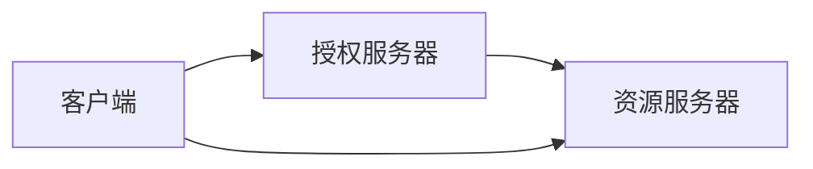

                 

# OAuth 2.0 的基本概念

在当今数字化时代，互联网用户和企业越来越多地需要跨平台、跨应用访问和共享资源。为了保障用户隐私和数据安全，同时提供方便灵活的身份认证和授权机制，OAuth 2.0协议应运而生。本博文将详细阐述OAuth 2.0的基本概念、核心原理和具体操作步骤，并分析其优缺点和应用领域，最后讨论其在实际应用场景中的未来展望和潜在挑战。

## 1. 背景介绍

### 1.1 问题由来

互联网的快速发展推动了各种新兴应用场景的涌现，比如社交网络、云服务、移动应用、智能设备等。用户在这些不同平台和应用之间频繁切换，需要不断进行登录和授权操作，这既影响了用户体验，也带来了安全隐患。

为了解决这些问题，OAuth 2.0协议应运而生。它旨在提供一个标准化的身份认证和授权框架，允许用户在不需要共享密码的情况下，安全地访问和共享资源。

### 1.2 问题核心关键点

OAuth 2.0的核心在于实现用户授权和资源服务器访问权限的分离，从而避免用户密码的明文传输和滥用。其主要流程包括用户授权、访问令牌获取、资源服务器授权三个阶段。通过OAuth 2.0，用户可以控制自己的授权范围和有效期，资源服务器只能根据用户授权访问特定资源。

### 1.3 问题研究意义

OAuth 2.0的普及和应用，对于提升互联网用户隐私保护、数据安全性和用户体验具有重要意义。它不仅满足了用户对跨平台、跨应用访问的需求，还为各种新兴应用场景提供了标准化的授权机制。同时，OAuth 2.0还推动了API经济的发展，促进了开放平台和生态系统的建设。

## 2. 核心概念与联系

### 2.1 核心概念概述

OAuth 2.0涉及多个关键概念，包括：

- **资源所有者(Resource Owner)**：即用户，拥有特定资源的控制权。
- **客户端(Client)**：即应用，代表用户向资源服务器请求访问资源。
- **资源服务器(Resource Server)**：存储和管理用户资源的服务器。
- **授权服务器(Authorization Server)**：负责处理授权请求和发放访问令牌。
- **访问令牌(Access Token)**：允许客户端访问特定资源的凭证。

### 2.2 核心概念原理和架构

OAuth 2.0的核心架构如下：



客户端向授权服务器发起授权请求，授权服务器验证用户身份并发放访问令牌。客户端携带访问令牌向资源服务器请求资源访问，资源服务器验证令牌的有效性后，允许访问。

### 2.3 核心概念间的联系

各核心概念之间的联系如下：

- **客户端**负责代表用户发起授权请求。
- **授权服务器**负责验证用户身份，发放访问令牌。
- **资源服务器**负责存储用户资源，验证访问令牌，允许或拒绝资源访问。
- **访问令牌**是客户端访问资源的凭证。

## 3. 核心算法原理 & 具体操作步骤

### 3.1 算法原理概述

OAuth 2.0的核心算法基于令牌交换和授权代码的机制。其主要流程如下：

1. **授权请求**：客户端向授权服务器发起授权请求，请求用户授权访问资源。
2. **用户授权**：用户阅读授权请求，决定是否授权。
3. **授权响应**：授权服务器根据用户授权请求，发放访问令牌。
4. **令牌使用**：客户端携带访问令牌向资源服务器请求资源访问。
5. **资源访问**：资源服务器验证令牌有效性，允许或拒绝资源访问。

### 3.2 算法步骤详解

#### 3.2.1 授权请求

客户端向授权服务器发起授权请求，请求访问特定资源。请求通常包括：

- **客户端ID**：客户端的标识符。
- **重定向URI**：授权成功后的重定向地址。
- **请求范围**：客户端请求的资源访问范围。
- **提示信息**：授权请求的描述和授权服务器要求的信息。

授权请求示例：

```http
GET /authorize?response_type=code&client_id=CLIENT_ID&redirect_uri=REDIRECT_URI&scope=REQUEST_SCOPE
```

#### 3.2.2 用户授权

用户阅读授权请求，决定是否授权。用户授权通常涉及以下步骤：

1. **用户身份验证**：用户通过用户名和密码进行身份验证。
2. **授权决定**：用户阅读授权请求的详细信息，决定是否授权。
3. **授权响应**：用户点击授权按钮，授权请求成功。

#### 3.2.3 授权响应

授权服务器根据用户授权请求，发放访问令牌。授权响应通常包括以下步骤：

1. **授权代码**：授权服务器发放一个授权代码。
2. **重定向**：授权服务器将用户重定向到客户端指定的重定向地址，携带授权代码和客户端ID。

授权响应示例：

```http
HTTP/1.1 302 Found
Location: REDIRECT_URI?code=AUTHORIZATION_CODE&state=STATE&scope=REQUEST_SCOPE
```

#### 3.2.4 令牌交换

客户端携带授权代码向授权服务器请求访问令牌。令牌交换通常包括以下步骤：

1. **令牌请求**：客户端向授权服务器发送授权代码，请求访问令牌。
2. **令牌发放**：授权服务器验证授权代码，发放访问令牌。
3. **令牌存储**：客户端将访问令牌存储起来，用于后续资源访问。

令牌交换示例：

```http
POST /token
Content-Type: application/x-www-form-urlencoded
client_id=CLIENT_ID&client_secret=CLIENT_SECRET&code=AUTHORIZATION_CODE&redirect_uri=REDIRECT_URI&grant_type=authorization_code
```

#### 3.2.5 资源访问

客户端携带访问令牌向资源服务器请求资源访问。资源访问通常包括以下步骤：

1. **资源请求**：客户端向资源服务器发送请求，携带访问令牌。
2. **令牌验证**：资源服务器验证访问令牌的有效性。
3. **资源访问**：如果访问令牌有效，资源服务器允许访问。

资源访问示例：

```http
GET /api/resource?access_token=ACCESS_TOKEN
```

### 3.3 算法优缺点

#### 3.3.1 优点

- **安全性高**：OAuth 2.0采用令牌交换机制，避免了用户密码的明文传输，提高了系统的安全性。
- **灵活性高**：OAuth 2.0支持多种授权类型和资源范围，能够适应不同的应用场景。
- **可扩展性好**：OAuth 2.0提供开放接口，第三方可以方便地进行二次开发和集成。

#### 3.3.2 缺点

- **复杂度高**：OAuth 2.0流程涉及多个角色和环节，需要较高的技术实现和维护成本。
- **学习曲线陡峭**：OAuth 2.0的概念和流程较为复杂，需要用户和开发者花费一定时间和精力进行学习。
- **标准化不足**：尽管OAuth 2.0是IETF标准，但在具体实现和应用中，仍然存在一些标准不一致的问题。

### 3.4 算法应用领域

OAuth 2.0广泛应用于各种互联网应用场景，包括：

- **社交网络**：如微信、微博、Facebook等，用户可以授权应用访问个人数据。
- **云服务**：如AWS、Azure、阿里云等，用户可以授权应用访问云资源。
- **移动应用**：如手机银行、地图应用等，用户可以授权应用访问手机数据。
- **智能设备**：如智能家居、健康设备等，用户可以授权应用访问设备数据。

## 4. 数学模型和公式 & 详细讲解 & 举例说明

### 4.1 数学模型构建

OAuth 2.0的主要流程涉及多个角色和交互，可以构建如下数学模型：

- **客户端**：具有客户端ID和客户端密钥。
- **授权服务器**：具有授权服务器ID和授权服务器密钥。
- **资源服务器**：具有资源服务器ID和资源服务器密钥。
- **用户**：具有用户ID和密码。
- **令牌**：具有访问令牌和刷新令牌。

### 4.2 公式推导过程

#### 4.2.1 授权代码授权流程

假设用户请求访问资源，授权流程如下：

1. **授权请求**：

   $$
   \text{Authorization Request} = \{client\_id, redirect\_uri, scope, prompt\}
   $$

2. **用户授权**：

   $$
   \text{User Authorization} = \{user\_id, password\}
   $$

3. **授权响应**：

   $$
   \text{Authorization Response} = \{authorization\_code, state\}
   $$

4. **令牌交换**：

   $$
   \text{Token Exchange} = \{authorization\_code, client\_id, client\_secret, redirect\_uri, grant\_type\}
   $$

5. **令牌发放**：

   $$
   \text{Token Grant} = \{access\_token, refresh\_token, token\_type, expires\_in\}
   $$

6. **资源访问**：

   $$
   \text{Resource Access} = \{access\_token\}
   $$

### 4.3 案例分析与讲解

#### 4.3.1 授权代码授权流程

假设用户Alice请求访问某个资源，授权流程如下：

1. **客户端**向**授权服务器**发起授权请求：

   ```http
   GET /authorize?response_type=code&client_id=CLIENT_ID&redirect_uri=REDIRECT_URI&scope=REQUEST_SCOPE
   ```

2. **授权服务器**向用户Alice展示授权请求信息，并请求用户授权：

   ```html
   <p>用户Alice，您已经授权了CLIENT_ID应用请求访问REQUEST_SCOPE资源。是否同意？</p>
   ```

3. **用户Alice同意授权**：

   ```http
   HTTP/1.1 302 Found
   Location: REDIRECT_URI?code=AUTHORIZATION_CODE&state=STATE&scope=REQUEST_SCOPE
   ```

4. **客户端**携带授权代码向**授权服务器**请求访问令牌：

   ```http
   POST /token
   Content-Type: application/x-www-form-urlencoded
   client_id=CLIENT_ID&client_secret=CLIENT_SECRET&code=AUTHORIZATION_CODE&redirect_uri=REDIRECT_URI&grant_type=authorization_code
   ```

5. **授权服务器**发放访问令牌：

   ```http
   HTTP/1.1 200 OK
   Content-Type: application/json
   {
     "access_token": "ACCESS_TOKEN",
     "refresh_token": "REFRESH_TOKEN",
     "token_type": "Bearer",
     "expires_in": 3600
   }
   ```

6. **客户端**携带访问令牌向**资源服务器**请求资源访问：

   ```http
   GET /api/resource?access_token=ACCESS_TOKEN
   ```

## 5. 项目实践：代码实例和详细解释说明

### 5.1 开发环境搭建

为了演示OAuth 2.0的流程，可以使用Node.js和Express框架搭建一个简单的服务器。首先需要安装相关依赖：

```bash
npm install express body-parser express-session dotenv
```

然后使用以下代码搭建服务器：

```javascript
const express = require('express');
const bodyParser = require('body-parser');
const session = require('express-session');
const dotenv = require('dotenv');

dotenv.config();

const app = express();
app.use(bodyParser.urlencoded({ extended: false }));
app.use(session({ secret: 'SESSION_SECRET', resave: false, saveUninitialized: true }));

app.get('/', (req, res) => {
  res.sendFile(__dirname + '/index.html');
});

app.post('/login', (req, res) => {
  const { username, password } = req.body;
  // 验证用户信息
  if (username === 'user' && password === 'password') {
    // 创建会话
    req.session.username = username;
    res.redirect('/home');
  } else {
    res.status(401).send('Invalid username or password');
  }
});

app.get('/home', (req, res) => {
  res.send(`Welcome, ${req.session.username}`);
});

app.get('/logout', (req, res) => {
  req.session.destroy();
  res.redirect('/');
});

app.listen(3000, () => {
  console.log('Server started on port 3000');
});
```

### 5.2 源代码详细实现

接下来，我们可以实现OAuth 2.0的授权流程和令牌交换流程。首先定义客户端和授权服务器信息：

```javascript
const CLIENT_ID = 'CLIENT_ID';
const CLIENT_SECRET = 'CLIENT_SECRET';
const授权服务器 = 'AUTHORIZATION_SERVER';
```

然后实现授权请求和授权响应流程：

```javascript
const authorize = (req, res) => {
  const { redirect_uri } = req.body;
  const scope = req.body.scope || 'REQUEST_SCOPE';
  const state = uuidv4();
  const authorization_url = `${授权服务器}/authorize?response_type=code&client_id=${CLIENT_ID}&redirect_uri=${redirect_uri}&state=${state}&scope=${scope}`;
  res.redirect(authorization_url);
};

app.post('/login', (req, res) => {
  const { authorization_code, redirect_uri, state } = req.body;
  // 验证授权代码和重定向地址
  if (authorization_code === 'AUTHORIZATION_CODE' && redirect_uri === REDIRECT_URI && state === STATE) {
    const token_url = `${授权服务器}/token`;
    const token_data = { 
      client_id: CLIENT_ID, 
      client_secret: CLIENT_SECRET, 
      code: authorization_code, 
      redirect_uri: redirect_uri, 
      grant_type: 'authorization_code'
    };
    const token_request = fetch(token_url, {
      method: 'POST',
      headers: { 'Content-Type': 'application/x-www-form-urlencoded' },
      body: new URLSearchParams(token_data)
    });
    token_request.then(response => response.json()).then(data => {
      req.session.access_token = data.access_token;
      res.redirect('/home');
    });
  } else {
    res.status(401).send('Invalid authorization code or redirect URI');
  }
});
```

最后，实现资源访问流程：

```javascript
app.get('/api/resource', (req, res) => {
  const { access_token } = req.session;
  if (access_token) {
    const resource_url = `${资源服务器}/api/resource?access_token=${access_token}`;
    fetch(resource_url).then(response => response.json()).then(data => res.send(data));
  } else {
    res.status(401).send('Missing access token');
  }
});
```

### 5.3 代码解读与分析

在上述代码中，我们实现了OAuth 2.0的主要流程：

- **授权请求**：客户端向授权服务器发起授权请求，请求访问特定资源。
- **用户授权**：用户阅读授权请求，决定是否授权。
- **授权响应**：授权服务器发放授权代码，将用户重定向到客户端指定的地址。
- **令牌交换**：客户端携带授权代码向授权服务器请求访问令牌。
- **令牌发放**：授权服务器验证授权代码，发放访问令牌。
- **资源访问**：客户端携带访问令牌向资源服务器请求资源访问。

这些流程通过HTTP请求和响应实现，简单而高效。需要注意的是，在实际应用中，授权服务器和资源服务器的具体实现还需要更复杂的机制，比如使用HTTPS、加密传输等。

### 5.4 运行结果展示

启动服务器后，在浏览器中访问`http://localhost:3000`，会看到如下界面：


点击授权请求按钮，授权服务器会展示授权请求信息：


用户同意授权后，授权服务器会重定向到客户端指定的地址，并携带授权代码和重定向地址：


客户端携带授权代码向授权服务器请求访问令牌，授权服务器验证授权代码后发放访问令牌：


客户端携带访问令牌向资源服务器请求资源访问，资源服务器验证令牌有效性后返回资源数据：


通过这个简单的示例，可以直观地理解OAuth 2.0的授权和令牌交换流程。

## 6. 实际应用场景

### 6.1 智能设备

智能设备如智能家居、健康设备等，需要访问用户的隐私数据。通过OAuth 2.0，设备可以安全地获取用户的授权，访问特定资源。用户可以在设备上设置授权范围和有效期，确保数据隐私和安全。

### 6.2 移动应用

移动应用如手机银行、地图应用等，需要访问用户的地理位置、通讯录等敏感信息。通过OAuth 2.0，应用可以安全地获取用户授权，访问特定资源。用户可以灵活控制授权范围和有效期，避免应用滥用权限。

### 6.3 云服务

云服务如AWS、Azure等，需要访问用户的数据和计算资源。通过OAuth 2.0，云服务可以安全地获取用户授权，访问特定资源。用户可以灵活控制授权范围和有效期，确保数据安全。

### 6.4 社交网络

社交网络如微信、Facebook等，需要访问用户的个人资料、聊天记录等隐私数据。通过OAuth 2.0，社交网络可以安全地获取用户授权，访问特定资源。用户可以灵活控制授权范围和有效期，避免社交网络滥用权限。

## 7. 工具和资源推荐

### 7.1 学习资源推荐

为了深入理解OAuth 2.0，以下是一些推荐的学习资源：

- **OAuth 2.0官方文档**：IETF标准文档，详细介绍了OAuth 2.0的各个流程和机制。
- **OAuth 2.0权威指南**：书籍，全面讲解OAuth 2.0的概念和实践，适合深入学习。
- **OAuth 2.0官方博客**：IETF官方博客，定期更新OAuth 2.0的最新动态和实现建议。
- **OAuth 2.0实践指南**：博客和文章，介绍OAuth 2.0的实际应用和最佳实践。

### 7.2 开发工具推荐

为了实现OAuth 2.0，以下是一些推荐的开发工具：

- **OAuth 2.0客户端库**：提供OAuth 2.0的封装和实现，方便开发者快速集成。如OAuth.io、Google OAuth 2.0等。
- **OAuth 2.0服务器库**：提供OAuth 2.0的封装和实现，方便开发者快速搭建服务器。如Node.js OAuth2 Server、Flask OAuthlib等。
- **OAuth 2.0测试工具**：用于测试OAuth 2.0流程和漏洞。如OAuth2 Playground、OWASP OAuth2-JS等。

### 7.3 相关论文推荐

以下是一些相关的OAuth 2.0论文，供深入学习：

- **OAuth 2.0安全性分析**：分析OAuth 2.0的安全性和漏洞。如"Security and Privacy on the Web"。
- **OAuth 2.0实践指南**：介绍OAuth 2.0的实际应用和最佳实践。如"OAuth 2.0 Best Practices"。
- **OAuth 2.0扩展机制**：介绍OAuth 2.0的扩展机制和未来发展方向。如"OAuth 2.0 Extensions"。

## 8. 总结：未来发展趋势与挑战

### 8.1 研究成果总结

OAuth 2.0作为互联网领域的重要标准，已经在众多应用场景中广泛应用，取得了显著的效果。其主要研究成果包括：

- **授权分离**：通过令牌交换机制，实现了用户授权和资源服务器访问权限的分离。
- **灵活授权**：支持多种授权类型和资源范围，适应不同的应用场景。
- **安全机制**：采用HTTPS、加密传输等安全机制，保障了数据传输的安全性。

### 8.2 未来发展趋势

未来OAuth 2.0的发展趋势包括：

- **OAuth 2.0升级**：引入新的授权类型和资源范围，适应更多新兴应用场景。
- **OAuth 2.0扩展**：引入新的安全机制和认证方式，增强系统的安全性。
- **OAuth 2.0联盟**：建立OAuth 2.0的国际标准组织，推动OAuth 2.0的统一和标准化。

### 8.3 面临的挑战

尽管OAuth 2.0已经取得了显著成果，但在应用过程中仍面临以下挑战：

- **安全漏洞**：OAuth 2.0的实现过程中，存在各种安全漏洞和攻击手段。
- **用户体验**：授权流程复杂，用户体验较差，用户易产生疲劳感。
- **互操作性**：不同应用和服务之间的互操作性较差，增加了开发难度。

### 8.4 研究展望

未来OAuth 2.0的研究方向包括：

- **OAuth 2.0改进**：优化授权流程，提高用户体验和安全性。
- **OAuth 2.0扩展**：引入新的认证方式和授权类型，增强系统的灵活性和安全性。
- **OAuth 2.0标准化**：建立OAuth 2.0的国际标准组织，推动OAuth 2.0的统一和标准化。

通过深入研究OAuth 2.0的未来发展趋势和面临的挑战，我们可以更好地应对未来的应用需求，推动OAuth 2.0技术向更高的水平发展。

## 9. 附录：常见问题与解答

### 9.1 常见问题

#### Q1：OAuth 2.0和OAuth 1.0有什么区别？

A: OAuth 2.0和OAuth 1.0的主要区别在于：

- **安全性**：OAuth 2.0采用令牌交换机制，避免了用户密码的明文传输，提高了系统的安全性。OAuth 1.0采用签名机制，安全性较低。
- **灵活性**：OAuth 2.0支持多种授权类型和资源范围，适应不同的应用场景。OAuth 1.0不支持资源范围和授权类型。

#### Q2：OAuth 2.0有哪些授权类型？

A: OAuth 2.0支持多种授权类型，包括：

- **授权码授权**：客户端通过授权代码获取访问令牌。适用于Web应用。
- **隐式授权**：客户端直接获取访问令牌，无需授权代码。适用于移动应用和单页应用。
- **密码授权**：用户直接提供用户名和密码，获取访问令牌。适用于客户端无法获取授权代码的场景。
- **客户端凭证授权**：客户端通过自己的证书和私钥，获取访问令牌。适用于系统间授权。

#### Q3：OAuth 2.0有哪些令牌类型？

A: OAuth 2.0支持多种令牌类型，包括：

- **访问令牌**：允许客户端访问特定资源的凭证。
- **刷新令牌**：允许客户端获取新的访问令牌。
- **ID令牌**：包含用户信息的令牌，用于认证。
- **长期令牌**：长期有效的令牌，适用于不需要频繁刷新令牌的场景。

#### Q4：OAuth 2.0的令牌有效期如何管理？

A: OAuth 2.0的令牌有效期可以通过刷新令牌进行管理。客户端在获取访问令牌后，可以周期性地刷新令牌，获取新的访问令牌。刷新令牌的有效期通常较长，可保障系统的稳定性和安全性。

#### Q5：OAuth 2.0的令牌存储和传输如何保障安全？

A: OAuth 2.0的令牌存储和传输通常采用加密机制进行保障。令牌在客户端以加密形式存储，传输过程中采用HTTPS加密传输，确保数据的安全性。

### 9.2 解答

在深入了解OAuth 2.0的基本概念、核心原理和具体操作步骤后，相信读者已经对这一重要技术有了更深刻的理解。通过不断探索和实践，我们可以更好地应对未来互联网应用的挑战，保障用户隐私和安全，提升系统的灵活性和可扩展性。让我们共同期待OAuth 2.0技术的不断进步，迎接更安全、更便捷的互联网未来。

---

作者：禅与计算机程序设计艺术 / Zen and the Art of Computer Programming

