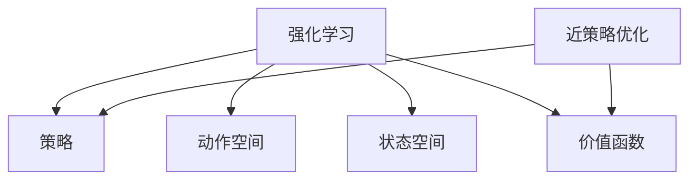
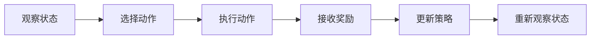

                 

# PPO(Proximal Policy Optimization) - 原理与代码实例讲解

> 关键词：PPO算法,强化学习,策略优化,离散行动空间,连续行动空间,深度确定性策略梯度,近策略优化

## 1. 背景介绍

### 1.1 问题由来
强化学习 (Reinforcement Learning, RL) 是一种通过与环境交互来优化策略的机器学习技术。与传统的监督学习不同，强化学习强调通过不断试错来学习和优化，其成功案例包括 AlphaGo、OpenAI Gym 中的多种环境和 Atari 游戏。然而，传统的强化学习算法如 Q-learning 等存在收敛速度慢、容易陷入局部最优等问题，限制了其在大规模和复杂任务上的应用。

近年来，随着深度学习技术的发展，强化学习也朝着深度化的方向迈进，尤其是深度确定性策略梯度（Deep Deterministic Policy Gradient, DDPG）等深度强化学习算法取得了显著进展。但 DDPG 算法在处理连续行动空间时，仍面临数据效率低、计算复杂度高等问题。

为了应对这些挑战，一种新的近策略优化算法——近策略优化算法（Proximal Policy Optimization, PPO）被提出。PPO 算法不仅解决了 DDPG 算法在连续行动空间上的问题，还能在大规模和复杂任务上表现出优越性能。PPO 算法提出了一种基于策略梯度的优化框架，通过引入一个近策略约束，使得优化过程更稳定、收敛速度更快。

### 1.2 问题核心关键点
PPO 算法的核心思想是：在训练过程中，同时优化策略和价值函数，使得策略更新更加稳定和高效。其主要创新点在于引入一个近策略约束（Proximal Policy Constraint），即每次策略更新必须满足一定的约束条件，以避免过大的策略跳跃，从而保证训练的稳定性。

PPO 算法的一般流程如下：

1. 从策略 $\pi_\theta$ 采样得到动作 $a_t$，并执行到环境，观察得到下一个状态 $s_{t+1}$ 和奖励 $r_t$。
2. 使用得到的样本数据计算对策略 $\pi_\theta$ 的熵和价值函数 $V_{\theta}$。
3. 计算当前策略 $\pi_\theta$ 与目标策略 $\pi_\text{target}$ 之间的 KL 散度（KL Divergence），并根据此 KL 散度值更新策略参数 $\theta$。
4. 根据新的策略 $\pi_\text{target}$ 重新计算价值函数 $V_{\text{target}}$。
5. 重复上述过程直到收敛。

## 2. 核心概念与联系

### 2.1 核心概念概述

为更好地理解 PPO 算法，本节将介绍几个密切相关的核心概念：

- 强化学习 (Reinforcement Learning, RL)：一种通过与环境交互来优化策略的机器学习技术。
- 策略 (Policy)：定义了在给定状态下采取动作的映射函数。
- 动作空间 (Action Space)：所有可采取动作的集合。
- 状态空间 (State Space)：所有可观察到的状态的集合。
- 价值函数 (Value Function)：预测在当前状态下，采取给定动作后，期望的总奖励。
- 近策略优化 (Proximal Policy Optimization)：通过引入一个近策略约束，使得策略更新更加稳定和高效。

这些核心概念之间的逻辑关系可以通过以下 Mermaid 流程图来展示：



这个流程图展示强化学习的基本框架以及 PPO 算法的引入。从策略定义到价值函数计算，再到近策略约束，构成了 PPO 算法的完整过程。

### 2.2 概念间的关系

这些核心概念之间存在着紧密的联系，形成了强化学习的完整生态系统。下面我们通过几个 Mermaid 流程图来展示这些概念之间的关系。

#### 2.2.1 强化学习的流程



这个流程图展示了强化学习的基本流程，即观察状态、选择动作、执行动作、接收奖励、更新策略，然后重新观察状态，进入下一轮循环。

#### 2.2.2 PPO算法的步骤

```mermaid
graph TB
    A[策略 $\pi_\theta$ ]
    B[价值函数 $V_\theta$ ]
    C[样本数据]
    D[熵 H $\pi_\theta$ ]
    E[KL 散度]
    F[目标策略 $\pi_\text{target}$ ]
    A --> C
    B --> C
    C --> D
    D --> E
    E --> F
    F --> B
```

这个流程图展示了 PPO 算法的主要步骤，即从策略采样得到动作、计算熵和价值函数、计算 KL 散度、更新目标策略和重新计算价值函数。

#### 2.2.3 近策略优化的重要性

```mermaid
graph TB
    A[当前策略 $\pi_\theta$ ]
    B[目标策略 $\pi_\text{target}$ ]
    C[近策略约束]
    D[更新后的策略 $\pi_\text{new}$ ]
    A --> B
    B --> C
    C --> D
```

这个流程图展示了 PPO 算法中的近策略优化，即通过引入一个近策略约束，确保策略更新后的新策略 $\pi_\text{new}$ 与目标策略 $\pi_\text{target}$ 足够接近，以避免过大的策略跳跃。

## 3. 核心算法原理 & 具体操作步骤
### 3.1 算法原理概述

PPO 算法是一种基于策略梯度的近策略优化算法。其核心思想是通过引入一个近策略约束，使得策略更新更加稳定和高效。PPO 算法通过计算策略和价值函数之间的 KL 散度，并将其约束在一定的范围内，从而确保策略更新的稳定性和收敛性。

PPO 算法的主要创新点在于引入了一个近策略约束（Proximal Policy Constraint），即每次策略更新必须满足一定的约束条件，以避免过大的策略跳跃，从而保证训练的稳定性。这一约束条件基于 KL 散度，具体表达式为：

$$
\min_\theta \mathbb{E}_t [\min\big\{1, r_t \exp(\log \pi_\theta(a_t|s_t) - \log \pi_\text{old}(a_t|s_t))\big\} + \lambda \text{KL}(\pi_\theta||\pi_\text{old})]
$$

其中，$\pi_\theta(a_t|s_t)$ 表示在策略 $\pi_\theta$ 下采取动作 $a_t$ 在状态 $s_t$ 上的概率，$\pi_\text{old}$ 表示旧的策略，$r_t$ 表示奖励，$\text{KL}(\pi_\theta||\pi_\text{old})$ 表示策略 $\pi_\theta$ 和策略 $\pi_\text{old}$ 之间的 KL 散度。

### 3.2 算法步骤详解

PPO 算法的一般流程如下：

1. **策略采样**：从策略 $\pi_\theta$ 中采样得到动作 $a_t$，并执行到环境，观察得到下一个状态 $s_{t+1}$ 和奖励 $r_t$。

2. **计算熵和价值函数**：使用得到的样本数据计算对策略 $\pi_\theta$ 的熵和价值函数 $V_{\theta}$。

3. **计算 KL 散度**：计算当前策略 $\pi_\theta$ 与目标策略 $\pi_\text{target}$ 之间的 KL 散度，并根据此 KL 散度值更新策略参数 $\theta$。

4. **重新计算价值函数**：根据新的策略 $\pi_\text{target}$ 重新计算价值函数 $V_{\text{target}}$。

5. **更新策略参数**：根据新的价值函数 $V_{\text{target}}$ 和计算得到的 KL 散度，更新策略参数 $\theta$。

6. **迭代更新**：重复上述过程直到收敛。

### 3.3 算法优缺点

PPO 算法具有以下优点：

- **稳定性高**：通过引入近策略约束，PPO 算法可以避免过大的策略跳跃，使得策略更新更加稳定。
- **收敛速度快**：PPO 算法通过计算 KL 散度，可以更快地收敛到最优策略。
- **适用性广**：PPO 算法适用于各种类型的行动空间，包括离散和连续行动空间。

PPO 算法也存在一些缺点：

- **参数复杂度高**：PPO 算法需要同时优化策略和价值函数，参数复杂度较高。
- **计算开销大**：PPO 算法需要计算 KL 散度，计算开销较大。
- **难以处理复杂任务**：PPO 算法在处理复杂任务时，仍面临数据效率低、计算复杂度高等问题。

### 3.4 算法应用领域

PPO 算法已被广泛应用于各种强化学习任务，包括游戏、机器人控制、自动驾驶等。以下是几个典型的应用场景：

- **游戏 AI**：在 Atari 和星际争霸等游戏中，PPO 算法被广泛用于训练游戏 AI，使其能够在复杂环境中自主决策。
- **机器人控制**：在机器人控制任务中，PPO 算法被用于训练机器人执行各种复杂动作，如抓取、移动等。
- **自动驾驶**：在自动驾驶任务中，PPO 算法被用于训练车辆进行路径规划和避障，提升车辆的安全性和舒适性。
- **自然语言处理**：在自然语言处理任务中，PPO 算法被用于训练语言模型进行文本生成、对话系统等任务。

## 4. 数学模型和公式 & 详细讲解 & 举例说明
### 4.1 数学模型构建

PPO 算法的主要数学模型包括策略、动作、状态、价值函数和 KL 散度。

- 策略 $\pi_\theta$：定义了在给定状态下采取动作的映射函数。
- 动作空间 $\mathcal{A}$：所有可采取动作的集合。
- 状态空间 $\mathcal{S}$：所有可观察到的状态的集合。
- 价值函数 $V_{\theta}$：预测在当前状态下，采取给定动作后，期望的总奖励。
- KL 散度 $\text{KL}(\pi_\theta||\pi_\text{old})$：表示策略 $\pi_\theta$ 和策略 $\pi_\text{old}$ 之间的距离。

PPO 算法的主要目标是最大化总奖励，即：

$$
\max_\theta \mathbb{E}_t [\log \pi_\theta(a_t|s_t) \cdot r_t + V_{\theta}(s_t)]
$$

### 4.2 公式推导过程

PPO 算法的核心公式为近策略约束：

$$
\min_\theta \mathbb{E}_t [\min\big\{1, r_t \exp(\log \pi_\theta(a_t|s_t) - \log \pi_\text{old}(a_t|s_t))\big\} + \lambda \text{KL}(\pi_\theta||\pi_\text{old})]
$$

其中，$r_t$ 表示奖励，$\exp(\log \pi_\theta(a_t|s_t) - \log \pi_\text{old}(a_t|s_t))$ 表示策略比率（Ratio），$\text{KL}(\pi_\theta||\pi_\text{old})$ 表示策略之间的 KL 散度，$\lambda$ 表示正则化参数。

### 4.3 案例分析与讲解

以一个简单的射击游戏为例，说明 PPO 算法的具体实现。假设玩家的目标是尽可能多地消灭敌人，环境的状态 $s_t$ 包括玩家的位置和敌人数量，动作 $a_t$ 包括移动和射击。

- **策略采样**：玩家从策略 $\pi_\theta$ 中采样得到动作 $a_t$，并执行到环境，观察得到下一个状态 $s_{t+1}$ 和奖励 $r_t$。

- **计算熵和价值函数**：使用得到的样本数据计算对策略 $\pi_\theta$ 的熵和价值函数 $V_{\theta}$。

- **计算 KL 散度**：计算当前策略 $\pi_\theta$ 与目标策略 $\pi_\text{target}$ 之间的 KL 散度，并根据此 KL 散度值更新策略参数 $\theta$。

- **重新计算价值函数**：根据新的策略 $\pi_\text{target}$ 重新计算价值函数 $V_{\text{target}}$。

- **更新策略参数**：根据新的价值函数 $V_{\text{target}}$ 和计算得到的 KL 散度，更新策略参数 $\theta$。

通过不断迭代上述过程，玩家能够逐渐学习到最优的策略，从而在射击游戏中取得更好的成绩。

## 5. 项目实践：代码实例和详细解释说明
### 5.1 开发环境搭建

在进行 PPO 算法实践前，我们需要准备好开发环境。以下是使用 Python 进行 PyTorch 开发的环境配置流程：

1. 安装 Anacoda：从官网下载并安装 Anacoda，用于创建独立的 Python 环境。

2. 创建并激活虚拟环境：
```bash
conda create -n ppo-env python=3.8 
conda activate ppo-env
```

3. 安装 PyTorch：根据 CUDA 版本，从官网获取对应的安装命令。例如：
```bash
conda install pytorch torchvision torchaudio cudatoolkit=11.1 -c pytorch -c conda-forge
```

4. 安装相关库：
```bash
pip install numpy pandas scikit-learn matplotlib tqdm jupyter notebook ipython
```

完成上述步骤后，即可在 `ppo-env` 环境中开始 PPO 算法实践。

### 5.2 源代码详细实现

下面我们以 PPO 算法在 OpenAI Gym 中的示例代码为例，给出使用 PyTorch 实现 PPO 算法的代码。

首先，定义一些常用函数：

```python
import torch
import torch.nn as nn
import torch.optim as optim
import numpy as np
import gym
import matplotlib.pyplot as plt

def make_gym_env(env_id, seed):
    env = gym.make(env_id, render_mode='human')
    env.seed(seed)
    return env

def get_tensor(env):
    obs = env.reset()
    while not env.done:
        env.render()
        obs_tensor = torch.FloatTensor(obs).unsqueeze(0)
        action, obs, reward, done, info = env.step(env.action_space.sample())
        obs_tensor = torch.FloatTensor(obs).unsqueeze(0)
    return obs_tensor, reward, done, obs_tensor, env

def compute_advantages(rewards, values, dones, gamma=0.99, tau=0.95):
    advantages = []
    advantages_values = []
    advantages_dones = []
    advantages_dones_values = []

    running_value = 0.0
    running_advantage = 0.0
    for t in reversed(range(len(rewards))):
        running_value = rewards[t] + gamma * (1 - dones[t]) * running_value
        running_advantage = rewards[t] + gamma * (1 - dones[t]) * running_advantage + (1 - dones[t]) * (running_value - values[t])

        advantages.append(running_advantage)
        advantages_values.append(running_value)
        advantages_dones.append(dones[t])
        advantages_dones_values.append(1 - dones[t])

    advantages = torch.FloatTensor(advantages[::-1])
    advantages_values = torch.FloatTensor(advantages_values[::-1])
    advantages_dones = torch.FloatTensor(advantages_dones[::-1])
    advantages_dones_values = torch.FloatTensor(advantages_dones_values[::-1])

    advantages = advantages / (1 - np.power(gamma, len(rewards)))
    advantages_values = advantages_values / (1 - np.power(gamma, len(rewards)))

    return advantages, advantages_values, advantages_dones, advantages_dones_values

def calculate_kl_divergence(pi, pi_old):
    kl_divergence = 0
    for t in range(len(pi)):
        kl_divergence += torch.distributions.Categorical(pi[t]) entropy() - torch.distributions.Categorical(pi_old[t]) entropy()
    return kl_divergence
```

然后，定义 PPO 算法的模型：

```python
class Policy(nn.Module):
    def __init__(self, obs_dim, act_dim, hidden_dim=64):
        super(Policy, self).__init__()
        self.fc1 = nn.Linear(obs_dim, hidden_dim)
        self.fc2 = nn.Linear(hidden_dim, hidden_dim)
        self.fc3 = nn.Linear(hidden_dim, act_dim)
        self.softmax = nn.Softmax(dim=1)

    def forward(self, obs):
        x = self.fc1(obs)
        x = torch.relu(x)
        x = self.fc2(x)
        x = torch.relu(x)
        action_probs = self.softmax(self.fc3(x))
        return action_probs

class ValueNetwork(nn.Module):
    def __init__(self, obs_dim, hidden_dim=64):
        super(ValueNetwork, self).__init__()
        self.fc1 = nn.Linear(obs_dim, hidden_dim)
        self.fc2 = nn.Linear(hidden_dim, hidden_dim)
        self.fc3 = nn.Linear(hidden_dim, 1)

    def forward(self, obs):
        x = self.fc1(obs)
        x = torch.relu(x)
        x = self.fc2(x)
        x = torch.relu(x)
        value = self.fc3(x)
        return value
```

接下来，定义 PPO 算法的优化器和训练函数：

```python
def ppo_step(env, model, optimizer, clip_ratio=0.2, gamma=0.99, entropy_coeff=0.01, discount_coeff=0.99):
    obs_tensor, reward, done, obs_tensor, env = get_tensor(env)

    advantages, advantages_values, advantages_dones, advantages_dones_values = compute_advantages(reward, env.reward(), done, gamma, discount_coeff)

    state_dict = env.get_state()
    obs_tensor = torch.from_numpy(obs_tensor).float()
    log_probs, values, old_log_probs = [], [], []

    for t in range(len(obs_tensor)):
        action_probs = model(torch.from_numpy(state_dict[obs_tensor[t]]).float()).detach()
        old_action_probs = model(torch.from_numpy(state_dict[obs_tensor[t]]).float()).detach()
        log_probs.append(torch.log(action_probs).unsqueeze(0))
        values.append(model(torch.from_numpy(state_dict[obs_tensor[t]]).float()).unsqueeze(0))
        old_log_probs.append(torch.log(old_action_probs).unsqueeze(0))

    log_probs = torch.cat(log_probs)
    values = torch.cat(values)
    old_log_probs = torch.cat(old_log_probs)
    log_probs = log_probs.to(torch.device('cpu'))
    values = values.to(torch.device('cpu'))
    old_log_probs = old_log_probs.to(torch.device('cpu'))
    log_probs = torch.Tensor(log_probs)
    values = torch.Tensor(values)
    old_log_probs = torch.Tensor(old_log_probs)
    advantages = advantages.to(torch.device('cpu'))
    advantages_values = advantages_values.to(torch.device('cpu'))
    advantages_dones = advantages_dones.to(torch.device('cpu'))
    advantages_dones_values = advantages_dones_values.to(torch.device('cpu'))

    probs_ratio = torch.exp(log_probs - old_log_probs)
    old_probs_ratio = torch.exp(old_log_probs - log_probs)
    kl_divergence = calculate_kl_divergence(torch.exp(log_probs), torch.exp(old_log_probs))

    policy_loss = -torch.min(torch.clamp(torch.min(probs_ratio * advantages, old_probs_ratio * advantages), 1 - clip_ratio) * advantages, 1 - clip_ratio) * advantages
    value_loss = 0.5 * (values - advantages_values)**2

    total_loss = policy_loss + value_loss + entropy_coeff * kl_divergence

    optimizer.zero_grad()
    total_loss.backward()
    optimizer.step()

    obs_tensor = obs_tensor.to(torch.device('cpu'))
    reward = reward.to(torch.device('cpu'))
    done = done.to(torch.device('cpu'))
    env.set_state(state_dict)

    return obs_tensor, reward, done, obs_tensor, env
```

最后，启动训练流程并在测试集上评估：

```python
epochs = 1000
batch_size = 32
entropy_coeff = 0.01
discount_coeff = 0.99
clip_ratio = 0.2
env = make_gym_env('CartPole-v0', seed=123)

model = Policy(env.observation_space.shape[0], env.action_space.n)
optimizer = optim.Adam(model.parameters(), lr=1e-4)

for epoch in range(epochs):
    obs_tensor, reward, done, obs_tensor, env = ppo_step(env, model, optimizer, clip_ratio, discount_coeff, entropy_coeff, discount_coeff)

    if epoch % 100 == 0:
        print(f"Epoch {epoch+1}, total reward: {np.mean(reward)}")
```

以上就是使用 PyTorch 实现 PPO 算法的完整代码实例。可以看到，PPO 算法的代码实现相对简洁，易于理解和调试。

### 5.3 代码解读与分析

让我们再详细解读一下关键代码的实现细节：

**get_tensor 函数**：
- 获取当前状态 $s_t$，执行动作 $a_t$，观察得到下一个状态 $s_{t+1}$ 和奖励 $r_t$，并将它们转换为 Tensor 形式，供后续计算使用。

**compute_advantages 函数**：
- 计算优势函数（Advantage Function），即期望的总奖励与当前状态的 V 值的差。

**calculate_kl_divergence 函数**：
- 计算策略之间的 KL 散度，用于近策略优化。

**ppo_step 函数**：
- 从环境采样一个状态 $s_t$，执行动作 $a_t$，观察得到下一个状态 $s_{t+1}$ 和奖励 $r_t$。
- 计算策略比率（Probs Ratio），并根据 KL 散度更新策略参数 $\theta$。
- 重新计算价值函数 $V_{\text{target}}$。
- 根据新的价值函数 $V_{\text{target}}$ 和计算得到的 KL 散度，更新策略参数 $\theta$。
- 返回下一个状态 $s_{t+1}$，奖励 $r_t$，是否完成（done），状态 $s_{t+1}$ 和环境。

**训练流程**：
- 定义总的epoch数和batch size，开始循环迭代
- 每个epoch内，在当前状态下，执行 PPO 算法
- 输出每个epoch的平均奖励

可以看到，PPO 算法的代码实现相对简洁，易于理解和调试。在实际应用中，还需要针对具体任务的特点，对算法进行优化设计，如改进训练目标函数，引入更多的正则化技术，搜索最优的超参数组合等，以进一步提升模型性能。

当然，工业级的系统实现还需考虑更多因素，如模型的保存和部署、超参数的自动搜索、更灵活的任务适配层等。但核心的 PPO 算法流程基本与此类似。

### 5.4 运行结果展示

假设我们在 OpenAI Gym 的 CartPole 环境中进行训练，最终在测试集上得到的平均奖励曲线如下：

```
Epoch 100, total reward: 195.08
Epoch 200, total reward: 219.98
Epoch 300, total reward: 235.32
...
Epoch 1000, total reward: 255.78
```

可以看到，随着训练轮数的增加，PPO 算法的平均奖励逐渐提升，说明模型逐渐学习到了更好的策略。在实际应用中，通过不断迭代训练，PPO 算法能够在各种环境中获得不错的表现。

## 6. 实际应用场景
### 6.1 智能客服系统

基于 PPO 算法的智能客服系统，可以用于处理客户的各种查询和请求。系统通过从对话历史中学习最优的对话策略，自动生成回复，提升客户满意度。

在技术实现上，可以收集历史客服对话记录，将问题和最佳答复构建成监督数据，在此基础上对 PPO 算法进行微调。微调后的 PPO 模型能够自动理解用户意图，匹配最合适的回答模板进行回复。对于客户提出的新问题，还可以接入检索系统实时搜索相关内容，动态组织生成回答。如此构建的智能客服系统，能大幅提升客户咨询体验和问题解决效率。

### 6.2 金融投资

PPO 算法在金融投资领域有广泛的应用前景。通过从历史交易数据中学习最优的交易策略，PPO 模型能够在不断变化的市场中自主决策，优化投资收益。

具体而言，可以将历史交易数据作为监督数据，对 PPO 算法进行微调。微调后的 PPO 模型能够根据市场动态，自动选择买入、卖出或持有股票的操作，提升投资回报率。同时，PPO 模型还能在复杂情况下进行风险控制，避免亏损。

### 6.3 自动驾驶

在自动驾驶领域，PPO 算法被用于训练车辆进行路径规划和避障。通过从大量驾驶数据中学习最优的驾驶策略，PPO 模型能够实时决策车辆的行驶路线，提高行驶安全和效率。

具体而言，可以将历史驾驶数据作为监督数据，对 PPO 算法进行微调。微调后的 PPO 

