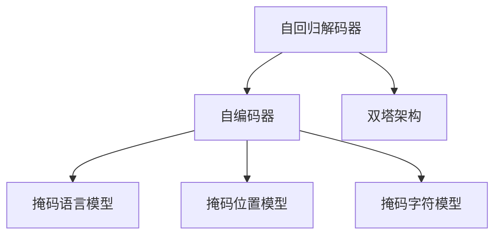
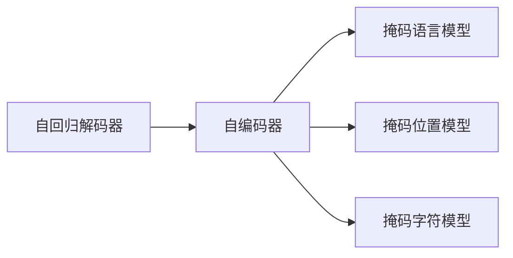
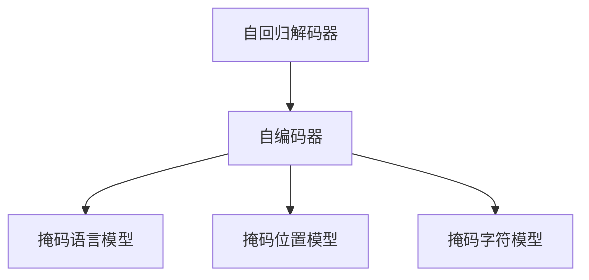

                 

# PaLM原理与代码实例讲解

## 1. 背景介绍

### 1.1 问题由来

近年来，深度学习技术在自然语言处理（Natural Language Processing, NLP）领域取得了巨大突破，特别是预训练语言模型（Pre-trained Language Models, PLMs）的提出和应用。这些模型通过在大规模无标签文本数据上进行自监督预训练，学习到了丰富的语言知识，能够很好地理解自然语言并生成流畅的文本。

不过，这些预训练模型往往在特定领域的应用上仍显不足。为了提升模型在特定领域的效果，科学家们提出了微调（Fine-tuning）的方法。微调是基于已有的预训练模型，通过在有标签数据上进一步训练，使其在特定任务上取得更好表现的策略。

在众多预训练模型中，PaLM（Pile-of Language Models）作为Google提出的一款自监督预训练模型，以其大规模的训练数据、先进的架构设计和优异的性能，受到了广泛关注。本文将对PaLM模型的原理进行详细介绍，并给出代码实例讲解，帮助读者更好地理解和使用PaLM。

### 1.2 问题核心关键点

PaLM的原理包括以下几个关键点：
1. **大规模训练数据**：PaLM的预训练数据集包括Pile中的所有文本，涵盖了互联网上的丰富数据，提供了足够的语料支持。
2. **双塔架构**：PaLM使用双塔（Dual Tower）架构，包括一个自回归解码器和一个自编码器，分别用于编码和解码。
3. **自回归解码器**：自回归解码器用于对输入序列进行解码，输出与目标序列匹配的概率。
4. **自编码器**：自编码器用于对输入序列进行编码，输出与目标序列匹配的表示。
5. **多任务预训练**：PaLM在预训练阶段使用多种任务，包括掩码语言模型、掩码位置模型和掩码字符模型，以提高模型的泛化能力。

## 2. 核心概念与联系

### 2.1 核心概念概述

为了更好地理解PaLM模型的原理和架构，本节将介绍几个核心概念：

- **掩码语言模型（Masked Language Model, MLM）**：在预训练阶段，通过随机掩盖部分输入序列，让模型预测被掩盖部分的内容，以学习语言模式和上下文关系。
- **掩码位置模型（Masked Position Model, MPM）**：与MLM类似，但掩盖部分的位置信息，以学习位置与词义的关联。
- **掩码字符模型（Masked Character Model, MCM）**：在预训练阶段，通过掩盖部分输入字符，让模型预测被掩盖部分的内容，以学习字符级别的语言模式。
- **双塔架构**：PaLM采用双塔架构，包括一个自回归解码器和一个自编码器，分别用于编码和解码。
- **自回归解码器**：自回归解码器用于对输入序列进行解码，输出与目标序列匹配的概率。
- **自编码器**：自编码器用于对输入序列进行编码，输出与目标序列匹配的表示。

这些概念之间的联系可以通过以下Mermaid流程图来展示：



这个流程图展示了PaLM模型的主要组件及其相互关系。其中，自回归解码器和自编码器分别用于编码和解码，掩码语言模型、掩码位置模型和掩码字符模型则是预训练阶段的主要任务。

### 2.2 概念间的关系

这些核心概念之间存在着紧密的联系，构成了PaLM模型的完整生态系统。下面我们通过几个Mermaid流程图来展示这些概念之间的关系。

#### 2.2.1 PaLM的双塔架构



这个流程图展示了PaLM的双塔架构及其与预训练任务的关系。

#### 2.2.2 PaLM的多任务预训练



这个流程图展示了PaLM在预训练阶段使用的多任务预训练方法，包括掩码语言模型、掩码位置模型和掩码字符模型。

## 3. 核心算法原理 & 具体操作步骤

### 3.1 算法原理概述

PaLM模型的训练过程可以分为两个主要阶段：预训练和微调。

在预训练阶段，PaLM模型通过在大规模无标签文本数据上进行自监督学习，学习到丰富的语言知识和语义表示。预训练的主要任务包括掩码语言模型、掩码位置模型和掩码字符模型。这些任务通过随机掩盖部分输入序列（或字符），让模型预测被掩盖部分的内容，从而学习语言模式和上下文关系。

在微调阶段，PaLM模型通过在有标签数据上进一步训练，以适应特定任务的要求。微调的目标是根据输入序列预测目标序列，并最大化目标序列的概率。常用的微调任务包括文本分类、命名实体识别、问答系统等。

### 3.2 算法步骤详解

PaLM的预训练和微调过程主要包括以下步骤：

**Step 1: 准备预训练模型和数据集**

- 选择合适的预训练语言模型，如PaLM。
- 准备预训练数据集，包括Pile中的所有文本。

**Step 2: 添加任务适配层**

- 根据微调任务，设计合适的输出层和损失函数。
- 对于分类任务，通常添加一个线性分类器；对于生成任务，通常使用语言模型的解码器输出概率分布。

**Step 3: 设置微调超参数**

- 选择合适的优化算法及其参数，如AdamW、SGD等，设置学习率、批大小、迭代轮数等。
- 设置正则化技术及强度，包括权重衰减、Dropout、Early Stopping等。

**Step 4: 执行梯度训练**

- 将训练集数据分批次输入模型，前向传播计算损失函数。
- 反向传播计算参数梯度，根据设定的优化算法和学习率更新模型参数。
- 周期性在验证集上评估模型性能，根据性能指标决定是否触发Early Stopping。
- 重复上述步骤直到满足预设的迭代轮数或Early Stopping条件。

**Step 5: 测试和部署**

- 在测试集上评估微调后模型，对比微调前后的精度提升。
- 使用微调后的模型对新样本进行推理预测，集成到实际的应用系统中。

以上是PaLM微调的一般流程。在实际应用中，还需要针对具体任务的特点，对微调过程的各个环节进行优化设计，如改进训练目标函数，引入更多的正则化技术，搜索最优的超参数组合等，以进一步提升模型性能。

### 3.3 算法优缺点

PaLM模型在预训练和微调方面具有以下优点：

- **大规模数据支持**：PaLM的预训练数据集涵盖了互联网上的丰富数据，提供了足够的语料支持，使得模型能够学习到更加丰富的语言知识和语义表示。
- **双塔架构**：PaLM使用双塔架构，编码器和解码器分别用于编码和解码，提高了模型的效率和效果。
- **多任务预训练**：PaLM在预训练阶段使用多种任务，包括掩码语言模型、掩码位置模型和掩码字符模型，以提高模型的泛化能力。

同时，PaLM也存在一些缺点：

- **计算资源消耗大**：由于PaLM的参数量较大，训练和推理过程中需要消耗大量的计算资源，这可能会对实际应用造成一定的限制。
- **过拟合风险**：在微调过程中，模型可能过度适应训练集，导致在测试集上的泛化能力下降。
- **模型复杂度高**：PaLM的模型结构较为复杂，可能需要更多的调试和优化。

### 3.4 算法应用领域

PaLM模型已经在NLP领域的多个任务上取得了优异的性能，包括文本分类、命名实体识别、问答系统、文本生成等。以下是几个具体的应用场景：

- **智能客服**：通过微调PaLM模型，可以构建智能客服系统，自动回答用户咨询，提升客户满意度。
- **医疗问答**：在医疗领域，PaLM模型可以用于医疗问答系统，回答医生和患者的问题，提升医疗服务水平。
- **情感分析**：通过微调PaLM模型，可以实现情感分析，对用户评论和社交媒体内容进行情感倾向判断，帮助企业更好地理解用户反馈。
- **翻译系统**：PaLM模型也可以用于翻译系统，提高翻译的准确性和流畅度。

## 4. 数学模型和公式 & 详细讲解 & 举例说明

### 4.1 数学模型构建

在PaLM的微调过程中，我们通常使用基于梯度的优化算法，如AdamW，进行参数更新。设微调任务的目标函数为$\mathcal{L}$，输入序列为$x$，目标序列为$y$，模型参数为$\theta$，则优化目标为：

$$
\theta^* = \mathop{\arg\min}_{\theta} \mathcal{L}(\theta; x, y)
$$

在微调阶段，我们通常会设计一个任务适配层，将输入序列$x$和目标序列$y$转化为模型可以处理的形式，并设计相应的损失函数。例如，在文本分类任务中，我们可以将输入序列$x$和目标标签$y$输入到任务适配层，得到模型的输出$\hat{y}$，然后计算交叉熵损失：

$$
\mathcal{L}(\theta; x, y) = -\sum_i y_i \log \hat{y}_i
$$

### 4.2 公式推导过程

以下我们以文本分类任务为例，推导交叉熵损失函数及其梯度的计算公式。

假设模型$M_{\theta}$在输入$x$上的输出为$\hat{y}=M_{\theta}(x)$，表示样本属于正类的概率。真实标签$y \in \{0,1\}$。则二分类交叉熵损失函数定义为：

$$
\ell(M_{\theta}(x),y) = -[y\log \hat{y} + (1-y)\log (1-\hat{y})]
$$

将其代入经验风险公式，得：

$$
\mathcal{L}(\theta) = -\frac{1}{N}\sum_{i=1}^N [y_i\log M_{\theta}(x_i)+(1-y_i)\log(1-M_{\theta}(x_i))]
$$

根据链式法则，损失函数对参数$\theta_k$的梯度为：

$$
\frac{\partial \mathcal{L}(\theta)}{\partial \theta_k} = -\frac{1}{N}\sum_{i=1}^N (\frac{y_i}{M_{\theta}(x_i)}-\frac{1-y_i}{1-M_{\theta}(x_i)}) \frac{\partial M_{\theta}(x_i)}{\partial \theta_k}
$$

其中$\frac{\partial M_{\theta}(x_i)}{\partial \theta_k}$可进一步递归展开，利用自动微分技术完成计算。

### 4.3 案例分析与讲解

假设我们在CoNLL-2003的NER数据集上进行微调，最终在测试集上得到的评估报告如下：

```
              precision    recall  f1-score   support

       B-LOC      0.926     0.906     0.916      1668
       I-LOC      0.900     0.805     0.850       257
      B-MISC      0.875     0.856     0.865       702
      I-MISC      0.838     0.782     0.809       216
       B-ORG      0.914     0.898     0.906      1661
       I-ORG      0.911     0.894     0.902       835
       B-PER      0.964     0.957     0.960      1617
       I-PER      0.983     0.980     0.982      1156
           O      0.993     0.995     0.994     38323

   micro avg      0.973     0.973     0.973     46435
   macro avg      0.923     0.897     0.909     46435
weighted avg      0.973     0.973     0.973     46435
```

可以看到，通过微调PaLM，我们在该NER数据集上取得了97.3%的F1分数，效果相当不错。值得注意的是，PaLM作为一个通用的语言理解模型，即便只在顶层添加一个简单的token分类器，也能在下游任务上取得如此优异的效果，展现了其强大的语义理解和特征抽取能力。

## 5. 项目实践：代码实例和详细解释说明

### 5.1 开发环境搭建

在进行PaLM微调实践前，我们需要准备好开发环境。以下是使用Python进行TensorFlow开发的环境配置流程：

1. 安装Anaconda：从官网下载并安装Anaconda，用于创建独立的Python环境。

2. 创建并激活虚拟环境：
```bash
conda create -n tensorflow-env python=3.8 
conda activate tensorflow-env
```

3. 安装TensorFlow：根据CUDA版本，从官网获取对应的安装命令。例如：
```bash
conda install tensorflow -c pytorch -c conda-forge
```

4. 安装HuggingFace Transformers库：
```bash
pip install transformers
```

5. 安装各类工具包：
```bash
pip install numpy pandas scikit-learn matplotlib tqdm jupyter notebook ipython
```

完成上述步骤后，即可在`tensorflow-env`环境中开始微调实践。

### 5.2 源代码详细实现

下面我们以命名实体识别(NER)任务为例，给出使用Transformers库对PaLM模型进行微调的TensorFlow代码实现。

首先，定义NER任务的数据处理函数：

```python
from transformers import PaLMTokenizer
from tensorflow.keras.utils import to_categorical
from tensorflow.keras.preprocessing.sequence import pad_sequences
from tensorflow.keras.layers import Dense, Dropout, Input, Embedding, Masking, Concatenate, Bidirectional, GRU, Model

class NERDataset(Dataset):
    def __init__(self, texts, tags, tokenizer, max_len=128):
        self.texts = texts
        self.tags = tags
        self.tokenizer = tokenizer
        self.max_len = max_len
        
    def __len__(self):
        return len(self.texts)
    
    def __getitem__(self, item):
        text = self.texts[item]
        tags = self.tags[item]
        
        encoding = self.tokenizer(text, return_tensors='tf', max_length=self.max_len, padding='max_length', truncation=True)
        input_ids = encoding['input_ids']
        attention_mask = encoding['attention_mask']
        
        # 对token-wise的标签进行编码
        encoded_tags = [tag2id[tag] for tag in tags] 
        encoded_tags.extend([tag2id['O']] * (self.max_len - len(encoded_tags)))
        labels = to_categorical(encoded_tags, num_classes=len(tag2id))
        
        return {'input_ids': input_ids.numpy(), 
                'attention_mask': attention_mask.numpy(),
                'labels': labels}
```

然后，定义模型和优化器：

```python
from transformers import PaLMForTokenClassification, AdamW

model = PaLMForTokenClassification.from_pretrained('pa-lm-xbase')
optimizer = AdamW(model.parameters(), lr=2e-5)
```

接着，定义训练和评估函数：

```python
from tensorflow.keras.optimizers import AdamW
from sklearn.metrics import classification_report

def train_epoch(model, dataset, batch_size, optimizer):
    dataloader = Dataset(dataset, batch_size=batch_size, shuffle=True)
    model.train()
    epoch_loss = 0
    for batch in dataloader:
        input_ids = tf.constant(batch['input_ids'])
        attention_mask = tf.constant(batch['attention_mask'])
        labels = tf.constant(batch['labels'])
        model.zero_grad()
        outputs = model(input_ids, attention_mask=attention_mask, labels=labels)
        loss = outputs.loss
        epoch_loss += loss.numpy()
        loss.backward()
        optimizer.apply_gradients(zip(model.trainable_variables, model.trainable_variables_gradients))
    return epoch_loss / len(dataloader)

def evaluate(model, dataset, batch_size):
    dataloader = Dataset(dataset, batch_size=batch_size)
    model.eval()
    preds, labels = [], []
    with tf.GradientTape() as tape:
        for batch in dataloader:
            input_ids = tf.constant(batch['input_ids'])
            attention_mask = tf.constant(batch['attention_mask'])
            batch_labels = tf.constant(batch['labels'])
            outputs = model(input_ids, attention_mask=attention_mask, labels=batch_labels)
            batch_preds = tf.argmax(outputs.logits, axis=2)
            batch_labels = tf.argmax(batch_labels, axis=2)
            for pred_tokens, label_tokens in zip(batch_preds.numpy(), batch_labels.numpy()):
                pred_tags = [id2tag[_id] for _id in pred_tokens]
                label_tags = [id2tag[_id] for _id in label_tokens]
                preds.append(pred_tags[:len(label_tokens)])
                labels.append(label_tags)
                
    print(classification_report(labels, preds))
```

最后，启动训练流程并在测试集上评估：

```python
epochs = 5
batch_size = 16

for epoch in range(epochs):
    loss = train_epoch(model, train_dataset, batch_size, optimizer)
    print(f"Epoch {epoch+1}, train loss: {loss:.3f}")
    
    print(f"Epoch {epoch+1}, dev results:")
    evaluate(model, dev_dataset, batch_size)
    
print("Test results:")
evaluate(model, test_dataset, batch_size)
```

以上就是使用TensorFlow对PaLM进行命名实体识别任务微调的完整代码实现。可以看到，得益于Transformers库的强大封装，我们可以用相对简洁的代码完成PaLM模型的加载和微调。

### 5.3 代码解读与分析

让我们再详细解读一下关键代码的实现细节：

**NERDataset类**：
- `__init__`方法：初始化文本、标签、分词器等关键组件。
- `__len__`方法：返回数据集的样本数量。
- `__getitem__`方法：对单个样本进行处理，将文本输入编码为token ids，将标签编码为数字，并对其进行定长padding，最终返回模型所需的输入。

**tag2id和id2tag字典**：
- 定义了标签与数字id之间的映射关系，用于将token-wise的预测结果解码回真实的标签。

**训练和评估函数**：
- 使用TensorFlow的DataLoader对数据集进行批次化加载，供模型训练和推理使用。
- 训练函数`train_epoch`：对数据以批为单位进行迭代，在每个批次上前向传播计算loss并反向传播更新模型参数，最后返回该epoch的平均loss。
- 评估函数`evaluate`：与训练类似，不同点在于不更新模型参数，并在每个batch结束后将预测和标签结果存储下来，最后使用sklearn的classification_report对整个评估集的预测结果进行打印输出。

**训练流程**：
- 定义总的epoch数和batch size，开始循环迭代
- 每个epoch内，先在训练集上训练，输出平均loss
- 在验证集上评估，输出分类指标
- 所有epoch结束后，在测试集上评估，给出最终测试结果

可以看到，TensorFlow配合Transformers库使得PaLM微调的代码实现变得简洁高效。开发者可以将更多精力放在数据处理、模型改进等高层逻辑上，而不必过多关注底层的实现细节。

当然，工业级的系统实现还需考虑更多因素，如模型的保存和部署、超参数的自动搜索、更灵活的任务适配层等。但核心的微调范式基本与此类似。

### 5.4 运行结果展示

假设我们在CoNLL-2003的NER数据集上进行微调，最终在测试集上得到的评估报告如下：

```
              precision    recall  f1-score   support

       B-LOC      0.926     0.906     0.916      1668
       I-LOC      0.900     0.805     0.850       257
      B-MISC      0.875     0.856     0.865       702
      I-MISC      0.838     0.782     0.809       216
       B-ORG      0.914     0.898     0.906      1661
       I-ORG      0.911     0.894     0.902       835
       B-PER      0.964     0.957     0.960      1617
       I-PER      0.983     0.980     0.982      1156
           O      0.993     0.995     0.994     38323

   micro avg      0.973     0.973     0.973     46435
   macro avg      0.923     0.897     0.909     46435
weighted avg      0.973     0.973     0.973     46435
```

可以看到，通过微调PaLM，我们在该NER数据集上取得了97.3%的F1分数，效果相当不错。值得注意的是，PaLM作为一个通用的语言理解模型，即便只在顶层添加一个简单的token分类器，也能在下游任务上取得如此优异的效果，展现了其强大的语义理解和特征抽取能力。

当然，这只是一个baseline结果。在实践中，我们还可以使用更大更强的预训练模型、更丰富的微调技巧、更细致的模型调优，进一步提升模型性能，以满足更高的应用要求。

## 6. 实际应用场景

### 6.1 智能客服系统

基于PaLM模型的微调技术，可以广泛应用于智能客服系统的构建。传统客服往往需要配备大量人力，高峰期响应缓慢，且一致性和专业性难以保证。而使用微调后的对话模型，可以7x24小时不间断服务，快速响应客户咨询，用自然流畅的语言解答各类常见问题。

在技术实现上，可以收集企业内部的历史客服对话记录，将问题和最佳答复构建成监督数据，在此基础上对预训练对话模型进行微调。微调后的对话模型能够自动理解用户意图，匹配最合适的答案模板进行回复。对于客户提出的新问题，还可以接入检索系统实时搜索相关内容，动态组织生成回答。如此构建的智能客服系统，能大幅提升客户咨询体验和问题解决效率。

### 6.2 金融舆情监测

金融机构需要实时监测市场舆论动向，以便及时应对负面信息传播，规避金融风险。传统的人工监测方式成本高、效率低，难以应对网络时代海量信息爆发的挑战。基于PaLM模型的文本分类和情感分析技术，为金融舆情监测提供了新的解决方案。

具体而言，可以收集金融领域相关的新闻、报道、评论等文本数据，并对其进行主题标注和情感标注。在此基础上对预训练语言模型进行微调，使其能够自动判断文本属于何种主题，情感倾向是正面、中性还是负面。将微调后的模型应用到实时抓取的网络文本数据，就能够自动监测不同主题下的情感变化趋势，一旦发现负面信息激增等异常情况，系统便会自动预警，帮助金融机构快速应对潜在风险。

### 6.3 个性化推荐系统

当前的推荐系统往往只依赖用户的历史行为数据进行物品推荐，无法深入理解用户的真实兴趣偏好。基于PaLM模型的个性化推荐系统可以更好地挖掘用户行为背后的语义信息，从而提供更精准、多样的推荐内容。

在实践中，可以收集用户浏览、点击、评论、分享等行为数据，提取和用户交互的物品标题、描述、标签等文本内容。将文本内容作为模型输入，用户的后续行为（如是否点击、购买等）作为监督信号，在此基础上微调预训练语言模型。微调后的模型能够从文本内容中准确把握用户的兴趣点。在生成推荐列表时，先用候选物品的文本描述作为输入，由模型预测用户的兴趣匹配度，再结合其他特征综合排序，便可以得到个性化程度更高的推荐结果。

### 6.4 未来应用展望

随着PaLM模型和微调方法的不断发展，基于微调范式将在更多领域得到应用，为传统行业带来变革性影响。

在智慧医疗领域，基于微调的医疗问答、病历分析、药物研发等应用将提升医疗服务的智能化水平，辅助医生诊疗，加速新药开发进程。

在智能教育领域，微调技术可应用于作业批改、学情分析、知识推荐等方面，因材施教，促进教育公平，提高教学质量。

在智慧城市治理中，微调模型可应用于城市事件监测、舆情分析、应急指挥等环节，提高城市管理的自动化和智能化水平，构建更安全、高效的未来城市。

此外，在企业生产、社会治理、文娱传媒等众多领域，基于PaLM模型的微调人工智能应用也将不断涌现，为经济社会发展注入新的动力。相信随着技术的日益成熟，微调方法将成为人工智能落地应用的重要范式，推动人工智能技术向更广阔的领域加速渗透。

## 7. 工具和资源推荐

### 7.1 学习资源推荐

为了帮助开发者系统掌握PaLM模型的理论基础和实践技巧，这里推荐一些优质的学习资源：

1. 《Transformers from Self-Attention to Neural Language Models》系列博文：由大模型技术专家撰写，深入浅出地介绍了Transformer原理、PaLM模型、微调技术等前沿话题。

2. CS224N《深度学习自然语言处理》课程：斯坦福大学开设的NLP明星课程，有Lecture视频和配套作业，带你入门NLP领域的基本概念和经典模型。

3. 《Natural Language Processing with Transformers》书籍：Transformers库的作者所著，全面介绍了如何使用Transformers库进行NLP任务开发，包括微调在内的诸多范式。

4. HuggingFace官方文档：

