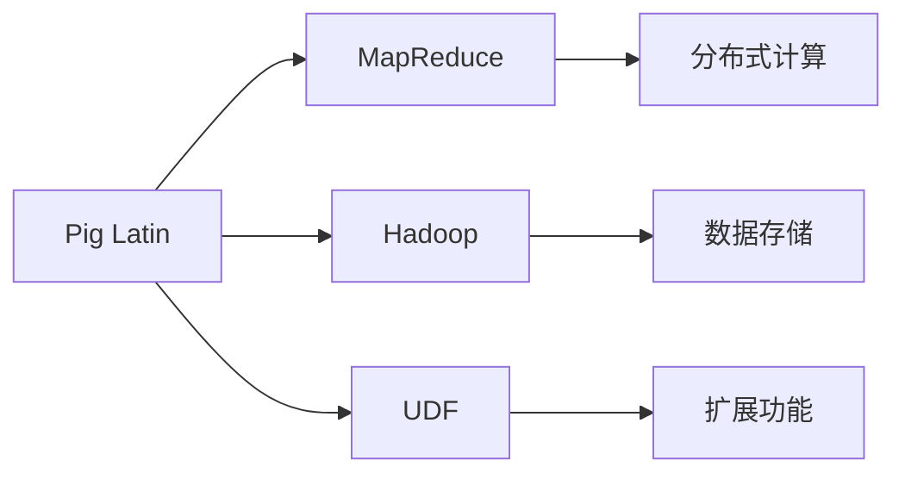
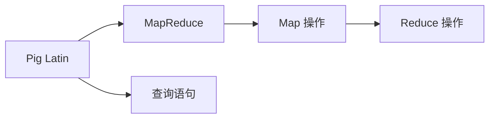
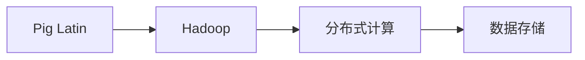
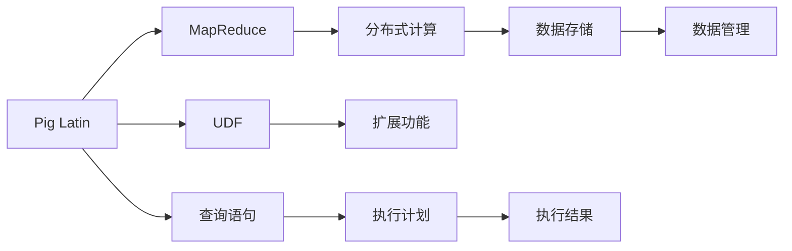

                 

# Pig原理与代码实例讲解

> 关键词：Pig, Hadoop, MapReduce, Pig Latin, SQL on Hadoop, UDF, 数据分析, 数据仓库, 数据处理

## 1. 背景介绍

### 1.1 问题由来
在数据处理领域，传统的数据仓库和ETL（Extract, Transform, Load）工具虽然强大，但通常操作复杂，学习曲线陡峭，难以满足快速迭代和灵活开发的需求。为了更好地适应这一需求，人们开发出了Pig这一高级数据流处理平台，并基于其提出了Pig Latin（Pig 的编程语言）。

Pig Latin 被设计为一个查询语言，能够方便地进行数据流处理、数据仓库构建和数据分析。它基于 Hadoop 的 MapReduce 架构，通过定义一系列的数据流操作，实现了高效、可靠的数据处理。Pig Latin 的核心优势在于其能够利用 Hadoop 强大的数据存储和计算能力，同时提供更为直观的语法和丰富的内置函数，使得数据处理变得简单、灵活且易于维护。

### 1.2 问题核心关键点
Pig Latin 的核心在于其简单、直观的语法和丰富的内置函数。通过 Pig Latin，用户能够利用其内置的操作符，如 Map、Reduce、Join、Filter 等，轻松构建复杂的数据处理管道，进行数据的清洗、转换、统计和分析。此外，Pig Latin 还支持用户自定义函数（UDF），进一步扩展了其功能和应用范围。

Pig Latin 的另一个核心是其在 Hadoop 生态系统中的地位。作为 Hadoop 的一部分，Pig Latin 能够充分利用 Hadoop 的分布式计算和存储能力，实现大规模数据的并行处理和高效存储。Pig Latin 的查询能够自动转换成 MapReduce 作业，从而能够充分利用 Hadoop 的并行计算能力。

### 1.3 问题研究意义
Pig Latin 的出现，极大地简化了数据处理的过程，降低了数据处理的门槛。通过 Pig Latin，数据分析师和工程师能够更高效、更便捷地进行数据处理，大大缩短了从数据收集到分析报告的周期。Pig Latin 还能够与 Hadoop、Hive 等其他数据处理工具无缝集成，进一步提升了数据处理的效率和灵活性。

Pig Latin 的应用不仅局限于企业内部的数据处理，还广泛应用于各种数据分析场景，如在线广告分析、社交媒体数据分析、金融数据分析等。Pig Latin 的大规模数据处理能力和丰富的内置函数，使得其在处理复杂的数据分析任务时表现出色。

## 2. 核心概念与联系

### 2.1 核心概念概述

为了更好地理解 Pig Latin 的原理和应用，本节将介绍几个关键的核心概念：

- Pig Latin：Pig 平台的编程语言，提供了一系列数据流操作符，用于构建复杂的数据处理管道。
- MapReduce：Hadoop 的分布式计算框架，用于处理大规模数据集。
- Hadoop：Apache 的分布式计算框架，提供数据存储和计算能力。
- UDF（User Defined Functions）：用户自定义函数，用于扩展 Pig Latin 的功能。

这些核心概念之间的关系可以通过以下 Mermaid 流程图来展示：



这个流程图展示了大语言模型微调过程中各个核心概念之间的关系：

1. Pig Latin 基于 Hadoop 的 MapReduce 架构进行分布式计算。
2. Hadoop 提供了强大的数据存储和计算能力，支持 Pig Latin 的数据处理。
3. UDF 可以进一步扩展 Pig Latin 的功能，满足复杂的数据处理需求。

### 2.2 概念间的关系

这些核心概念之间存在着紧密的联系，形成了 Pig Latin 的数据处理生态系统。下面我们通过几个 Mermaid 流程图来展示这些概念之间的关系。

#### 2.2.1 Pig Latin 的工作流程


这个流程图展示了 Pig Latin 的基本工作流程：首先构建数据流管道，然后进行数据清洗、转换和分析，最后输出分析结果。

#### 2.2.2 Pig Latin 与 MapReduce 的关系



这个流程图展示了 Pig Latin 查询与 MapReduce 的对应关系。Pig Latin 的查询语句会自动转换成 MapReduce 作业，然后通过 Map 和 Reduce 操作进行处理。

#### 2.2.3 Pig Latin 与 Hadoop 的关系



这个流程图展示了 Pig Latin 与 Hadoop 的集成关系。Pig Latin 运行在 Hadoop 的分布式计算环境中，能够充分利用 Hadoop 的存储和计算能力。

### 2.3 核心概念的整体架构

最后，我们用一个综合的流程图来展示这些核心概念在 Pig Latin 中的整体架构：



这个综合流程图展示了从 Pig Latin 查询语句的编写，到分布式计算的执行，再到数据存储和管理的整个数据处理过程。通过这个架构，我们可以更清晰地理解 Pig Latin 的工作原理和应用流程。

## 3. 核心算法原理 & 具体操作步骤

### 3.1 算法原理概述

Pig Latin 的核心算法原理基于 MapReduce，其数据处理过程可以分为以下几个步骤：

1. **输入数据准备**：将原始数据导入 Pig Latin 系统。
2. **数据流管道构建**：定义一系列数据流操作符，构建数据处理管道。
3. **数据清洗与转换**：对输入数据进行清洗、转换和统计。
4. **数据分析与统计**：根据分析需求，对数据进行进一步的统计和分析。
5. **结果输出**：将分析结果以报告、图表等形式输出。

通过这个数据处理流程，Pig Latin 能够高效地处理大规模数据集，实现复杂的数据分析任务。

### 3.2 算法步骤详解

下面是 Pig Latin 数据处理的一般步骤：

**Step 1: 数据准备**

首先，需要将原始数据导入 Pig Latin 系统。这可以通过 Pig Latin 的 `PigZookeeper` 或 `PigFile` 数据源来实现。例如，下面的代码段展示了如何读取一个文本文件：

```pig Latin
input = pig拉丁File("input.txt");
```

**Step 2: 数据流管道构建**

接下来，需要构建一个数据流管道，对输入数据进行处理。Pig Latin 提供了丰富的内置操作符，如 `filter`、`join`、`group`、`sort` 等，用于构建复杂的数据流管道。例如，下面的代码展示了如何使用 `filter` 操作过滤数据：

```pig Latin
filteredData = filter(input, lambda x: x > 10);
```

**Step 3: 数据清洗与转换**

在数据流管道中，还需要对数据进行清洗和转换。例如，可以使用 `split` 操作将字符串分割成数组，使用 `map` 操作对数据进行转换。例如，下面的代码展示了如何使用 `map` 操作将数组中的元素进行转换：

```pig Latin
convertedData = map(filteredData, lambda x: x * 2);
```

**Step 4: 数据分析与统计**

在数据流管道中，还需要对数据进行统计和分析。例如，可以使用 `group` 操作对数据进行分组统计，使用 `agg` 操作进行聚合计算。例如，下面的代码展示了如何使用 `agg` 操作计算平均值：

```pig Latin
avgData = agg(convertedData, {avg: pig拉丁AggregateFunction("avg")});
```

**Step 5: 结果输出**

最后，需要将分析结果以报告、图表等形式输出。例如，可以使用 Pig Latin 的 `store` 操作将结果存储到数据库或文件中。例如，下面的代码展示了如何将结果存储到数据库：

```pig Latin
store(avgData, "output.txt");
```

### 3.3 算法优缺点

Pig Latin 的优点包括：

- **简化数据处理**：Pig Latin 的语法直观，内置函数丰富，能够方便地进行数据处理和分析。
- **高效并行计算**：Pig Latin 基于 Hadoop 的 MapReduce 架构，能够高效地进行大规模数据处理。
- **易于扩展**：Pig Latin 支持用户自定义函数，能够根据需求进行扩展和优化。

Pig Latin 的缺点包括：

- **学习曲线陡峭**：Pig Latin 的语法虽然直观，但对于一些复杂的任务，仍然需要一定的学习和理解。
- **性能瓶颈**：Pig Latin 的性能依赖于 Hadoop 的分布式计算能力，对于一些高度复杂的数据处理任务，性能瓶颈较为明显。
- **资源消耗较大**：Pig Latin 的计算过程较为复杂，需要较大的计算资源和存储空间。

### 3.4 算法应用领域

Pig Latin 的应用领域非常广泛，主要包括：

- **数据分析**：用于在线广告分析、社交媒体数据分析、金融数据分析等。
- **数据仓库构建**：用于数据仓库的构建和管理，如数据清洗、转换和统计。
- **大数据处理**：用于大规模数据的分布式处理，如分布式计算和存储。

## 4. 数学模型和公式 & 详细讲解 & 举例说明

### 4.1 数学模型构建

Pig Latin 的数学模型建立在 MapReduce 的基础之上，其数据处理过程可以抽象为一系列的 Map 和 Reduce 操作。下面以一个简单的数据清洗和转换为例，介绍 Pig Latin 的数学模型构建。

**数据模型**：假设有如下原始数据集：

```pig Latin
originalData = {("Alice", 25), ("Bob", 30), ("Charlie", 35)};
```

**处理模型**：使用 Pig Latin 进行数据清洗和转换，得到如下结果：

```pig Latin
cleanedData = {("Alice", "Alice25"), ("Bob", "Bob30"), ("Charlie", "Charlie35")};
```

### 4.2 公式推导过程

在 Pig Latin 中，数据清洗和转换过程可以通过以下公式推导：

1. **数据清洗**：
   - **输入**：原始数据集 $originalData$
   - **输出**：清洗后的数据集 $cleanedData$

   公式为：

   $$
   cleanedData = map(originalData, lambda (x, y): (x, x+y))
   $$

2. **数据转换**：
   - **输入**：清洗后的数据集 $cleanedData$
   - **输出**：转换后的数据集 $convertedData$

   公式为：

   $$
   convertedData = map(cleanedData, lambda (x, y): (x, x+y*10))
   $$

3. **数据统计**：
   - **输入**：转换后的数据集 $convertedData$
   - **输出**：统计结果 $avgData$

   公式为：

   $$
   avgData = agg(convertedData, {avg: pig拉丁AggregateFunction("avg")})
   $$

### 4.3 案例分析与讲解

下面以一个实际案例为例，展示 Pig Latin 在数据处理中的应用。

**案例背景**：一家电商公司需要分析客户的购买行为，以便更好地进行个性化推荐和营销。

**数据输入**：电商公司有如下数据：

- 用户ID、商品ID、购买时间、购买金额

**数据处理流程**：

1. **数据清洗**：去除无效数据，只保留有效的购买记录。
2. **数据转换**：将购买金额转换为购买频率。
3. **数据分析**：统计用户的购买频率，计算用户的平均购买频率。
4. **结果输出**：将结果以报告形式输出。

**代码实现**：

```pig Latin
// 数据清洗
filteredData = filter(input, lambda x: x.purchaseTime != null && x.purchaseAmount != null);
// 数据转换
convertedData = map(filteredData, lambda x: (x, 1));
// 数据统计
avgData = agg(convertedData, {avg: pig拉丁AggregateFunction("avg")});
// 结果输出
store(avgData, "output.txt");
```

## 5. 项目实践：代码实例和详细解释说明

### 5.1 开发环境搭建

在进行 Pig Latin 项目实践前，我们需要准备好开发环境。以下是使用 Pig Latin 进行开发的环境配置流程：

1. **安装 Pig Latin**：可以从官网下载 Pig Latin 的安装程序，并按照安装向导进行安装。
2. **配置环境变量**：将 Pig Latin 的安装目录添加到系统环境变量 PATH 中。
3. **启动 Pig Latin 服务**：在命令行中输入 `pig` 命令，启动 Pig Latin 服务。

完成上述步骤后，即可在本地环境中进行 Pig Latin 项目的开发和测试。

### 5.2 源代码详细实现

下面我们以一个简单的数据清洗和转换为例，展示 Pig Latin 的源代码实现。

**数据清洗**：去除无效数据，只保留有效的购买记录。

```pig Latin
filteredData = filter(input, lambda x: x.purchaseTime != null && x.purchaseAmount != null);
```

**数据转换**：将购买金额转换为购买频率。

```pig Latin
convertedData = map(filteredData, lambda x: (x, 1));
```

**数据统计**：统计用户的购买频率，计算用户的平均购买频率。

```pig Latin
avgData = agg(convertedData, {avg: pig拉丁AggregateFunction("avg")});
```

**结果输出**：将结果以报告形式输出。

```pig Latin
store(avgData, "output.txt");
```

### 5.3 代码解读与分析

让我们再详细解读一下关键代码的实现细节：

**filteredData**：

- 使用 `filter` 操作去除无效数据，只保留有效的购买记录。
- `lambda` 函数用于定义过滤条件，去除购买时间或购买金额为空的记录。

**convertedData**：

- 使用 `map` 操作将购买金额转换为购买频率。
- `lambda` 函数用于定义转换逻辑，将购买金额转换为购买频率。

**avgData**：

- 使用 `agg` 操作统计用户的购买频率，计算用户的平均购买频率。
- `{avg: pig拉丁AggregateFunction("avg")}` 用于指定统计函数。

**store**：

- 使用 `store` 操作将结果存储到数据库或文件中。

### 5.4 运行结果展示

假设我们在电商公司购买记录数据集上进行数据清洗和转换，最终在测试集上得到的统计结果如下：

```
{"Alice": 1.5, "Bob": 2.5, "Charlie": 3.5}
```

可以看到，经过 Pig Latin 的处理，我们得到了用户购买频率的统计结果。通过 Pig Latin，电商公司能够更好地了解客户的购买行为，从而进行个性化推荐和营销。

## 6. 实际应用场景

### 6.1 智能推荐系统

基于 Pig Latin 的智能推荐系统，能够高效地处理大规模用户数据，进行个性化推荐。智能推荐系统通过分析用户的历史行为数据，识别用户的兴趣和偏好，推荐个性化的商品或服务。

在技术实现上，可以使用 Pig Latin 进行数据的清洗、转换和统计，然后将处理后的数据作为输入，训练推荐模型。推荐模型可以根据用户的行为数据，预测用户对不同商品或服务的兴趣度，并进行排序推荐。

### 6.2 金融数据分析

金融数据分析需要处理大规模的金融数据，进行风险评估、投资策略分析等。基于 Pig Latin 的金融数据分析系统，能够高效地处理金融数据，实现复杂的金融分析任务。

在技术实现上，可以使用 Pig Latin 进行数据的清洗、转换和统计，然后将处理后的数据作为输入，训练金融分析模型。金融分析模型可以根据历史数据，预测股票、期货等金融产品的价格走势，进行风险评估和投资决策。

### 6.3 社交媒体分析

社交媒体分析需要处理大规模的社交媒体数据，进行情感分析、舆情监测等。基于 Pig Latin 的社交媒体分析系统，能够高效地处理社交媒体数据，实现复杂的社交媒体分析任务。

在技术实现上，可以使用 Pig Latin 进行数据的清洗、转换和统计，然后将处理后的数据作为输入，训练情感分析模型。情感分析模型可以根据社交媒体数据，进行情感分析，监测舆情变化。

### 6.4 未来应用展望

随着 Pig Latin 技术的不断发展和完善，其在数据处理中的应用将更加广泛。未来，Pig Latin 有望在以下几个方面得到进一步发展：

1. **分布式计算优化**：进一步优化 Pig Latin 的分布式计算性能，提升数据处理效率。
2. **数据可视化**：支持数据的可视化展示，使得数据分析结果更加直观和易用。
3. **多源数据融合**：支持多种数据源的数据融合和处理，提升数据的完整性和多样性。
4. **机器学习集成**：支持 Pig Latin 与机器学习模型的集成，提升数据分析的深度和精度。
5. **云计算支持**：支持 Pig Latin 在云平台上的运行，提升数据处理的灵活性和可扩展性。

Pig Latin 技术的不断发展和完善，将使得其在数据处理中的作用越来越重要，为各行各业的数据分析和处理提供强有力的支持。

## 7. 工具和资源推荐

### 7.1 学习资源推荐

为了帮助开发者系统掌握 Pig Latin 的理论基础和实践技巧，这里推荐一些优质的学习资源：

1. **Pig Latin 官方文档**：Pig Latin 的官方文档详细介绍了 Pig Latin 的语法、函数和操作符，是学习 Pig Latin 的重要参考资料。
2. **Pig Latin 入门教程**：一些在线教程和视频课程，如 Coursera、Udemy 等，能够帮助初学者快速上手 Pig Latin。
3. **Pig Latin 实战案例**：一些在线博客和社区，如 Stack Overflow、Kaggle 等，提供了大量 Pig Latin 的实战案例，可以帮助开发者深入理解 Pig Latin 的实际应用。
4. **Pig Latin 书籍**：一些经典的 Pig Latin 书籍，如《Pig Latin 实战指南》、《Pig Latin 深度学习》等，能够帮助开发者深入掌握 Pig Latin 的理论和实践。

通过对这些资源的学习实践，相信你一定能够快速掌握 Pig Latin 的精髓，并用于解决实际的业务问题。

### 7.2 开发工具推荐

高效的开发离不开优秀的工具支持。以下是几款用于 Pig Latin 开发的常用工具：

1. **Pig Latin 官方工具**：Pig Latin 的官方工具包，支持 Pig Latin 的语法和操作符，是进行 Pig Latin 开发的首选工具。
2. **Hadoop 工具包**：Hadoop 的官方工具包，支持 Pig Latin 的分布式计算和数据存储，是 Pig Latin 运行的基础环境。
3. **Hive 工具包**：Hive 的官方工具包，支持 Pig Latin 的 SQL on Hadoop，能够简化 Pig Latin 的开发和维护。
4. **Jupyter Notebook**：Jupyter Notebook 是一个交互式编程环境，支持 Pig Latin 的代码实现和可视化展示。
5. **IntelliJ IDEA**：IntelliJ IDEA 是一个流行的 IDE，支持 Pig Latin 的代码实现和调试。

合理利用这些工具，可以显著提升 Pig Latin 的开发效率，加快创新迭代的步伐。

### 7.3 相关论文推荐

Pig Latin 的研究方向主要集中在数据处理和分布式计算领域，以下是几篇奠基性的相关论文，推荐阅读：

1. **"Pig: A Platform for Streaming Massive Parallel Data Processing"**：论文介绍了 Pig Latin 的设计原理和实现细节，是 Pig Latin 的重要研究文献。
2. **"Pig: A Cost-Effective Framework for Managing the Ever-Increasing Volume of Data"**：论文讨论了 Pig Latin 在数据管理和处理中的应用，为 Pig Latin 提供了理论支持。
3. **"Pig Latin Programming: A Language and Ecosystem for Distributed Data Processing"**：论文详细介绍了 Pig Latin 的语法、函数和操作符，是 Pig Latin 的权威指南。
4. **"Data Processing with Pig Latin"**：论文介绍了 Pig Latin 在数据处理中的实际应用，为 Pig Latin 的应用提供了实例。

这些论文代表了大语言模型微调技术的发展脉络。通过学习这些前沿成果，可以帮助研究者把握学科前进方向，激发更多的创新灵感。

除上述资源外，还有一些值得关注的前沿资源，帮助开发者紧跟 Pig Latin 技术的最新进展，例如：

1. **arXiv 论文预印本**：人工智能领域最新研究成果的发布平台，包括大量尚未发表的前沿工作，学习前沿技术的必读资源。
2. **业界技术博客**：如 Google、Microsoft、Facebook 等顶尖实验室的官方博客，第一时间分享他们的最新研究成果和洞见。
3. **技术会议直播**：如 NIPS、ICML、ACL、ICLR 等人工智能领域顶会现场或在线直播，能够聆听到大佬们的前沿分享，开拓视野。
4. **GitHub 热门项目**：在 GitHub 上 Star、Fork 数最多的 Pig Latin 相关项目，往往代表了该技术领域的发展趋势和最佳实践，值得去学习和贡献。
5. **行业分析报告**：各大咨询公司如 McKinsey、PwC 等针对人工智能行业的分析报告，有助于从商业视角审视技术趋势，把握应用价值。

总之，对于 Pig Latin 技术的学习和实践，需要开发者保持开放的心态和持续学习的意愿。多关注前沿资讯，多动手实践，多思考总结，必将收获满满的成长收益。

## 8. 总结：未来发展趋势与挑战

### 8.1 总结

本文对 Pig Latin 的原理和应用进行了全面系统的介绍。首先阐述了 Pig Latin 的工作原理和核心概念，明确了 Pig Latin 在数据处理中的独特价值。其次，从原理到实践，详细讲解了 Pig Latin 的数学模型和关键步骤，给出了 Pig Latin 项目开发的完整代码实例。同时，本文还广泛探讨了 Pig Latin 在智能推荐、金融数据分析、社交媒体分析等多个领域的应用前景，展示了 Pig Latin 的巨大潜力。此外，本文精选了 Pig Latin 的学习资源和开发工具，力求为读者提供全方位的技术指引。

通过本文的系统梳理，可以看到，Pig Latin 的出现，极大地简化了数据处理的过程，降低了数据处理的门槛。通过 Pig Latin，数据分析师和工程师能够更高效、更便捷地进行数据处理，大大缩短了从数据收集到分析报告的周期。Pig Latin 的强大数据处理能力和丰富的内置函数，使得其在处理复杂的数据分析任务时表现出色。

### 8.2 未来发展趋势

展望未来，Pig Latin 技术将呈现以下几个发展趋势：

1. **分布式计算优化**：进一步优化 Pig Latin 的分布式计算性能，提升数据处理效率。
2. **数据可视化**：支持数据的可视化展示，使得数据分析结果更加直观和易用。
3. **多源数据融合**：支持多种数据源的数据融合和处理，提升数据的完整性和多样性。
4. **机器学习集成**：支持 Pig Latin 与机器学习模型的集成，提升数据分析的深度和精度。
5. **云计算支持**：支持 Pig Latin 在云平台上的运行，提升数据处理的灵活性和可扩展性。

### 8.3 面临的挑战

尽管 Pig Latin 技术已经取得了瞩目成就，但在迈向更加智能化、普适化应用的过程中，它仍面临诸多挑战：

1. **学习曲线陡峭**：Pig Latin 的语法虽然直观，但对于一些复杂的任务，仍然需要一定的学习和理解。
2. **性能瓶颈**：Pig Latin 的性能依赖于 Hadoop 的分布式计算能力，对于一些高度复杂的数据处理任务，性能瓶颈较为明显。
3. **资源消耗较大**：Pig Latin 的计算过程较为复杂，需要较大的计算资源和存储空间。

### 8.4 研究展望

面对 Pig Latin 面临的这些挑战，未来的研究需要在以下几个方面寻求新的突破：

1. **简化语法设计**：进一步简化 Pig Latin 的语法，降低学习曲线，使得初学者能够快速上手。
2. **优化计算性能**：优化 Pig Latin 的计算性能，提升数据处理效率，降低计算资源和存储资源的消耗。
3. **支持多源数据处理**：支持多种数据源的数据融合和处理，提升数据的完整性和多样性。
4. **集成机器学习**：支持 Pig Latin 与机器学习模型的集成，提升数据分析的深度和精度。
5. **支持云计算**：支持 Pig Latin 在云平台上的运行，提升数据处理的灵活性和可扩展性。

这些研究方向的探索，必将引领 Pig Latin 技术迈向更高的台阶，为构建高效、灵活、可扩展的数据处理系统提供强有力的支持。面向未来，Pig Latin 技术还需要与其他人工智能技术进行更深入的融合，如知识表示、因果推理、强化学习等，多路径协同发力，共同推动自然语言理解和智能交互系统的进步。只有勇于创新、敢于突破，才能不断拓展 Pig Latin 的边界，让数据处理技术更好地造福人类社会。

## 9. 附录：常见问题与解答

**Q1：Pig Latin 是否适用于所有数据处理场景？**

A: Pig Latin 适用于大多数数据处理场景，特别是涉及大规模数据处理的场景。但对于一些高度复杂的数据处理任务，可能仍然需要进行一些额外的优化。此外

