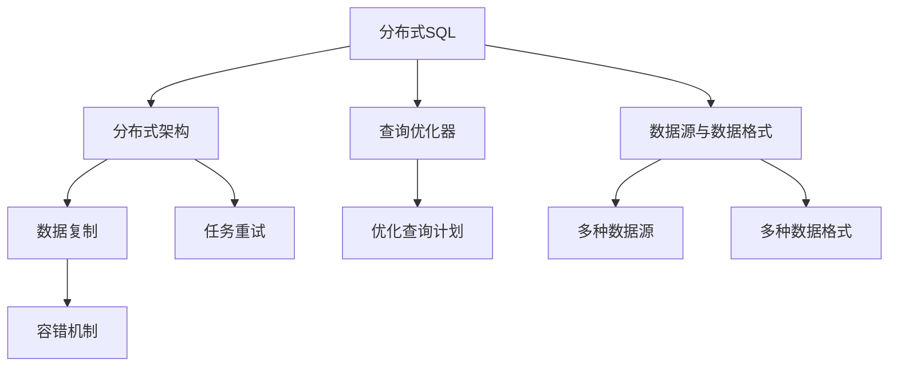
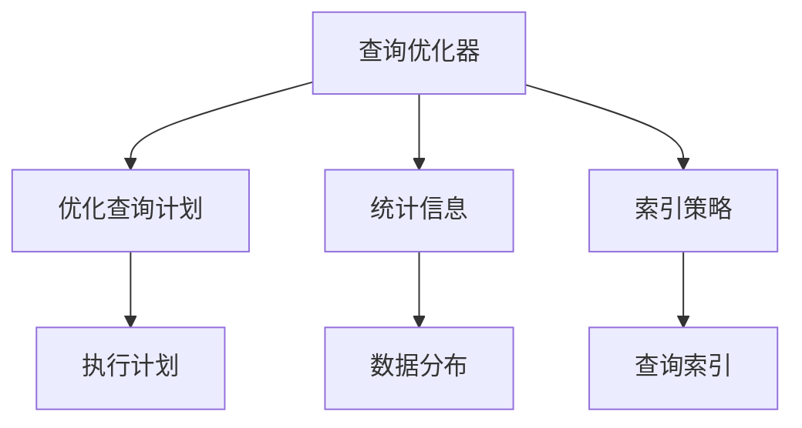
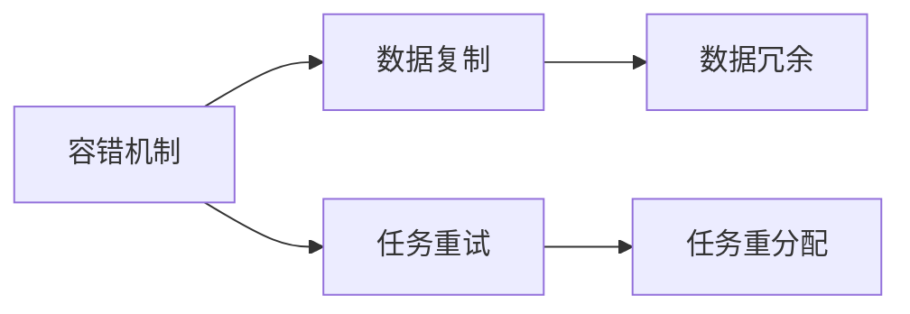

                 

# Presto原理与代码实例讲解

## 1. 背景介绍

### 1.1 问题由来
Presto是一个由Facebook开源的分布式SQL查询引擎，其主要目的是提供一个高性能、低延迟的解决方案，用于处理大规模数据集。由于其在处理复杂查询时的出色表现，Presto在数据仓库、大数据平台等应用场景中得到了广泛应用。

Presto的设计理念是"数据即服务"，即能够将数据转换为即插即用的服务，为开发者提供了一个灵活的、可扩展的数据处理平台。同时，Presto也具有“分布式”的特点，能够通过多节点的分布式计算，提升数据处理能力。

### 1.2 问题核心关键点
Presto的核心关键点在于其分布式架构，通过多节点的协同工作，提升了数据处理能力，同时也降低了单点故障的风险。Presto的分布式计算机制允许用户将大规模数据集分解为多个小数据集，并通过多个节点并行处理，最终将结果合并。

Presto的查询优化器是其另一个重要特点。它利用统计信息、索引策略等因素，进行查询计划的选择，以优化查询执行的效率。同时，Presto还支持多种数据源和数据格式，包括MySQL、Hive、Hadoop、Kafka等。

### 1.3 问题研究意义
研究Presto的原理与应用，对于理解分布式SQL查询引擎的工作机制，掌握大数据处理技术，具有重要意义：

1. 降低开发成本。Presto作为一个高性能、低延迟的数据处理引擎，能够显著减少数据处理任务的时间和人力成本。
2. 提升数据处理效率。通过分布式计算和多节点协同工作，Presto能够处理大规模数据集，显著提升数据处理效率。
3. 增强系统稳定性。分布式架构降低了单点故障的风险，提高了系统的可靠性和容错性。
4. 提供灵活的数据处理方案。Presto支持多种数据源和数据格式，能够满足不同数据处理场景的需求。

## 2. 核心概念与联系

### 2.1 核心概念概述

为更好地理解Presto，本节将介绍几个关键概念：

- 分布式SQL：一种在分布式系统中进行SQL查询处理的机制，能够充分利用多节点并行处理能力，提升查询效率。
- 分布式架构：通过多个节点的协同工作，实现大规模数据集的并行处理，提升数据处理能力。
- 查询优化器：根据统计信息、索引策略等因素，选择最优的查询执行计划，优化查询效率。
- 数据源与数据格式：支持多种数据源和数据格式，包括MySQL、Hive、Hadoop、Kafka等。
- 容错机制：通过数据复制和任务重试，保证系统在节点故障时仍能正常工作。

这些概念之间的逻辑关系可以通过以下Mermaid流程图来展示：



这个流程图展示了大规模数据处理的关键环节和相关概念。分布式SQL是整个处理流程的核心，而分布式架构、查询优化器、数据源与数据格式则是实现分布式SQL的关键技术。数据复制和任务重试是容错机制的核心。通过这些关键概念的有机结合，Presto才能实现高性能、低延迟的数据处理能力。

### 2.2 概念间的关系

这些关键概念之间存在着紧密的联系，形成了Presto数据处理的核心生态系统。下面我们通过几个Mermaid流程图来展示这些概念之间的关系。

#### 2.2.1 分布式架构与分布式SQL的关系


这个流程图展示了分布式架构与分布式SQL的关系。分布式架构通过节点协同，实现了大规模数据集的并行处理。分布式SQL通过将查询任务分解为多个子任务，并在多节点上并行执行，提升查询效率。

#### 2.2.2 查询优化器的作用



这个流程图展示了查询优化器的作用。查询优化器根据统计信息、索引策略等因素，选择最优的查询执行计划。通过优化查询计划，提高查询效率。

#### 2.2.3 容错机制的实现



这个流程图展示了容错机制的实现。容错机制通过数据复制和任务重试，保证系统在节点故障时仍能正常工作，从而提高系统的可靠性和容错性。

## 3. 核心算法原理 & 具体操作步骤
### 3.1 算法原理概述

Presto的算法原理基于分布式架构和查询优化器。其核心思想是通过多节点的协同工作，实现大规模数据集的并行处理，同时利用查询优化器，选择最优的查询执行计划，优化查询效率。

在数据处理过程中，Presto将数据集分割为多个小数据集，并在多个节点上并行处理。对于每个小数据集，Presto会计算出一个查询执行计划，并将任务分配给不同的节点执行。节点之间的通信和协调通过分布式协调服务(Zookeeper)实现。

在查询优化器中，Presto利用统计信息和索引策略，选择最优的查询执行计划。统计信息包括数据分布、索引信息等，而索引策略则用于优化查询的执行效率。通过优化查询计划，Presto能够高效地处理大规模数据集。

### 3.2 算法步骤详解

基于Presto的算法原理，其具体操作步骤可以大致分为以下几个步骤：

**Step 1: 数据分割与任务分配**
- 将数据集分割为多个小数据集。
- 将查询任务分解为多个子任务，并将每个子任务分配给不同的节点。
- 在每个节点上并行处理小数据集。

**Step 2: 查询优化与执行**
- 根据统计信息、索引策略等因素，选择最优的查询执行计划。
- 执行查询计划，生成查询结果。
- 将查询结果进行合并，生成最终结果。

**Step 3: 容错处理**
- 检测节点故障，将故障节点上的任务重分配给其他节点。
- 检测数据冗余，保证数据的一致性和可靠性。
- 进行任务重试，确保系统的稳定性和容错性。

这些步骤共同构成了Presto的核心流程，保证了其高性能、低延迟的数据处理能力。

### 3.3 算法优缺点

Presto作为分布式SQL查询引擎，具有以下优点：
1. 高性能：通过多节点的协同工作，提升数据处理效率。
2. 低延迟：通过并行处理，减少单个节点的计算负担，降低延迟。
3. 容错性：通过数据复制和任务重试，保证系统的可靠性和容错性。
4. 灵活性：支持多种数据源和数据格式，能够满足不同数据处理场景的需求。

同时，Presto也存在以下缺点：
1. 学习曲线陡峭：分布式计算和查询优化器的复杂性，可能导致开发者需要花费大量时间进行学习和调试。
2. 资源消耗大：多节点的协同工作和数据复制，需要消耗更多的计算资源和存储资源。
3. 开发成本高：系统搭建和维护需要较高的技术门槛，可能需要在团队中配备专业人才。

尽管存在这些缺点，但Presto凭借其强大的数据处理能力和灵活的架构，仍然是处理大规模数据集的首选引擎之一。

### 3.4 算法应用领域

Presto的应用领域广泛，覆盖了数据仓库、大数据平台、实时数据分析等多个场景。以下是几个典型的应用场景：

**数据仓库**：用于构建企业级数据仓库，支持数据聚合、分析、报表生成等操作。

**大数据平台**：作为大数据处理的核心组件，能够高效处理海量数据，支持ETL、数据清洗、数据挖掘等操作。

**实时数据分析**：用于实时数据分析和处理，支持数据流计算、复杂事件处理等操作。

**物联网**：支持物联网数据的采集、存储、处理和分析，提供实时数据分析和可视化功能。

## 4. 数学模型和公式 & 详细讲解  
### 4.1 数学模型构建

Presto的数学模型主要涉及数据分割、任务分配和查询优化等方面。这里以数据分割和任务分配为例，介绍Presto的数学模型构建。

设数据集为 $D = \{d_1, d_2, \dots, d_n\}$，数据集分割后的子数据集为 $D_1, D_2, \dots, D_k$。假设每个子数据集的大小为 $s$，则有 $n = ks$。将查询任务 $Q$ 分解为 $k$ 个子任务 $Q_1, Q_2, \dots, Q_k$，每个子任务分别在 $D_1, D_2, \dots, D_k$ 上进行处理。

设每个节点的计算能力为 $C$，每个子任务的计算时间为 $T_i$。假设每个节点可以处理 $m$ 个子任务，则查询的总计算时间为 $T = \sum_{i=1}^k T_i$。通过多节点并行处理，查询的总计算时间 $T$ 变为 $T_{\text{parallel}} = \frac{T}{m}$。

### 4.2 公式推导过程

以下我们以数据分割为例，推导Presto的数学模型公式。

设数据集大小为 $n$，每个子数据集大小为 $s$。查询的总计算时间为 $T$，查询的并行计算时间为 $T_{\text{parallel}}$。

根据上述定义，有：

$$
n = ks
$$

$$
T = \sum_{i=1}^k T_i
$$

$$
T_{\text{parallel}} = \frac{T}{m}
$$

通过多节点并行处理，查询的总计算时间 $T$ 变为 $T_{\text{parallel}}$。将 $T$ 和 $T_{\text{parallel}}$ 的关系代入公式，得：

$$
T_{\text{parallel}} = \frac{1}{m} \sum_{i=1}^k \frac{T_i}{s}
$$

这个公式展示了通过多节点并行处理，查询的计算时间与单个节点的计算时间和子数据集大小的关系。

### 4.3 案例分析与讲解

以一个实际案例为例，分析Presto的数学模型应用。

假设在一个拥有 $k=4$ 个节点的数据处理系统中，每个节点的计算能力为 $C=1$，每个子数据集大小为 $s=10$。查询任务的总计算时间为 $T=100$，每个子任务的计算时间为 $T_i=25$。通过多节点并行处理，查询的并行计算时间为 $T_{\text{parallel}}$。

根据公式，得：

$$
T_{\text{parallel}} = \frac{1}{4} \sum_{i=1}^4 \frac{25}{10} = \frac{1}{4} \times 2.5 \times 4 = 2.5
$$

可以看出，通过多节点并行处理，查询的并行计算时间从 $T=100$ 减少到 $T_{\text{parallel}}=2.5$，提升了查询效率。

## 5. 项目实践：代码实例和详细解释说明
### 5.1 开发环境搭建

在进行Presto项目实践前，我们需要准备好开发环境。以下是使用Python进行Presto开发的环境配置流程：

1. 安装Presto客户端和驱动程序：从Presto官网下载并安装。
2. 安装Python SDK：使用pip安装Presto的Python SDK。
3. 安装Hadoop、Hive等依赖：确保Hadoop、Hive等依赖库已经安装并配置好。
4. 配置环境变量：配置Presto客户端的配置文件，指定Hadoop、Hive等依赖路径。

完成上述步骤后，即可在开发环境中开始Presto实践。

### 5.2 源代码详细实现

这里我们以一个简单的Presto查询为例，展示Presto代码的实现过程。

首先，定义一个简单的SQL查询：

```sql
SELECT * FROM table WHERE column = 'value'
```

然后，通过Presto的Python SDK执行查询：

```python
from presto.client import PrestoClient
from presto.client.types import ArrowBatch
from presto.client.metadata import Schema
from presto.client.split import Split

# 创建Presto客户端
client = PrestoClient('http://localhost:8080', 'user', 'password')

# 定义查询语句
query = "SELECT * FROM table WHERE column = 'value'"

# 创建查询计划
plan = client.create_query_plan(query)

# 执行查询计划
result = client.execute_query_plan(plan)

# 获取查询结果
batch = result.get_results()
for row in batch:
    print(row)
```

在执行查询时，Presto客户端会先将查询任务分割为多个子任务，并在多节点上并行处理。具体实现细节如下：

**5.2.1 数据分割与任务分配**

Presto客户端将查询任务分割为多个子任务，每个子任务在一个小数据集上执行。具体的分割方式包括：

1. 数据分区：将数据集按照某种规则（如时间、地理位置等）进行分区。
2. 数据并行化：将查询任务并行化，分配到多个节点上执行。

**5.2.2 查询优化与执行**

Presto客户端根据统计信息和索引策略，选择最优的查询执行计划。具体的优化策略包括：

1. 统计信息：利用统计信息（如数据分布、索引信息等），选择最优的查询执行计划。
2. 索引策略：利用索引信息，优化查询的执行效率。

**5.2.3 容错处理**

Presto客户端通过数据复制和任务重试，保证系统的可靠性和容错性。具体的容错策略包括：

1. 数据复制：通过数据复制，保证数据的一致性和可靠性。
2. 任务重试：在节点故障时，将故障节点上的任务重分配给其他节点。

### 5.3 代码解读与分析

让我们再详细解读一下关键代码的实现细节：

**5.3.1 数据分割与任务分配**

在Presto中，数据分割与任务分配是通过查询计划来实现的。查询计划定义了查询任务的执行过程，包括数据分割、任务分配、节点协同等细节。Presto使用查询优化器，自动生成查询计划，并将其分配到各个节点执行。

**5.3.2 查询优化与执行**

Presto的查询优化器利用统计信息和索引策略，选择最优的查询执行计划。具体的优化策略包括：

1. 统计信息：利用统计信息（如数据分布、索引信息等），选择最优的查询执行计划。
2. 索引策略：利用索引信息，优化查询的执行效率。

**5.3.3 容错处理**

Presto的容错机制通过数据复制和任务重试，保证系统的可靠性和容错性。具体的容错策略包括：

1. 数据复制：通过数据复制，保证数据的一致性和可靠性。
2. 任务重试：在节点故障时，将故障节点上的任务重分配给其他节点。

## 6. 实际应用场景
### 6.1 智能数据分析

Presto可以用于智能数据分析，通过实时处理海量数据，生成各种报表和分析结果。例如，可以用于分析用户行为数据、实时监控系统性能、生成业务报表等。

### 6.2 大数据处理

Presto是大数据处理的核心组件，能够高效处理海量数据，支持ETL、数据清洗、数据挖掘等操作。例如，可以用于数据仓库的构建、大数据平台的搭建、数据湖的建设等。

### 6.3 实时数据处理

Presto支持实时数据处理，能够实时处理数据流，支持复杂事件处理等操作。例如，可以用于实时监控网络流量、实时处理传感器数据、实时处理交易数据等。

### 6.4 未来应用展望

Presto作为分布式SQL查询引擎，其应用前景广阔。未来，Presto有望在以下几个方向上进一步发展：

1. 自动化管理：通过自动化管理工具，提高系统的易用性和维护性。
2. 安全性增强：通过访问控制、数据加密等手段，提高系统的安全性。
3. 性能优化：通过优化查询计划和执行过程，提升系统的性能。
4. 兼容性提升：支持更多数据源和数据格式，提升系统的通用性和兼容性。
5. 容错性改进：通过数据冗余和任务重试，进一步提高系统的容错性。

总之，Presto作为分布式SQL查询引擎，其应用前景广阔，能够满足大规模数据处理的各项需求。未来，通过不断的技术优化和应用扩展，Presto必将在更多领域得到广泛应用。

## 7. 工具和资源推荐
### 7.1 学习资源推荐

为了帮助开发者系统掌握Presto的理论基础和实践技巧，这里推荐一些优质的学习资源：

1. Presto官方文档：包含Presto的详细介绍、配置说明、查询执行计划等，是学习Presto的必备资源。
2. Presto社区论坛：社区内有很多Presto用户和开发者，可以向他们学习经验，获取技术支持。
3. Presto相关书籍：如《Presto: Fast Distributed SQL Query Engine》等，提供了丰富的Presto学习材料。
4. Presto代码库：官方GitHub仓库，包含Presto的源代码和示例，方便开发者学习和实践。
5. Presto讲义和教程：各大高校和培训机构提供的Presto学习材料，适合初学者入门。

通过对这些资源的学习实践，相信你一定能够快速掌握Presto的精髓，并用于解决实际的业务问题。

### 7.2 开发工具推荐

高效的开发离不开优秀的工具支持。以下是几款用于Presto开发常用的工具：

1. Presto客户端：官方提供的Python、Java等客户端，支持连接Presto集群，执行SQL查询。
2. Apache Hadoop：Presto的数据源之一，用于存储大规模数据集。
3. Apache Hive：Presto的数据源之一，用于数据存储和查询。
4. Apache Kafka：Presto的数据源之一，用于实时数据流处理。
5. Presto优化工具：如Presto Query Optimizer等，用于优化查询计划和执行过程。

合理利用这些工具，可以显著提升Presto的开发效率，加快创新迭代的步伐。

### 7.3 相关论文推荐

Presto作为分布式SQL查询引擎，其研究发展方向受到广泛关注。以下是几篇奠基性的相关论文，推荐阅读：

1. Presto: A Distributed SQL Engine for Fast Data Processing：Presto官方发布的白皮书，介绍了Presto的架构和关键技术。
2. Presto: Distributed SQL for Big Data：Presto的创建者之一FReview的博客，详细介绍了Presto的技术实现。
3. Scaling Out: Building a Fault-Tolerant, High-Performance SQL Query Engine：Presto的架构师Aditya Agarwal在ACM SIGMOD 2015上介绍Presto的技术实现。
4. Rethinking Distributed Computing Systems: From Storage to Streaming: An Introduction to Presto：Presto的架构师James Qin的博客，详细介绍了Presto的技术实现和应用场景。

这些论文代表了大数据处理技术的发展脉络，提供了丰富的技术细节和应用实践，值得深入学习。

## 8. 总结：未来发展趋势与挑战
### 8.1 研究成果总结

本文对Presto的原理与应用进行了全面系统的介绍。首先阐述了Presto作为分布式SQL查询引擎的设计理念和核心关键点，明确了其在数据处理中的独特价值。其次，从原理到实践，详细讲解了Presto的核心算法和操作步骤，给出了Presto项目开发的完整代码实例。同时，本文还广泛探讨了Presto在智能数据分析、大数据处理、实时数据处理等多个领域的应用前景，展示了Presto技术的广泛应用。

通过本文的系统梳理，可以看到，Presto作为一个高性能、低延迟的分布式SQL查询引擎，正在成为大数据处理领域的核心组件。Presto通过分布式架构和查询优化器，能够高效处理大规模数据集，支持多节点协同工作，提升数据处理效率。未来，伴随Presto技术的不断演进，必将在更多领域得到应用，为大数据处理和分析带来新的突破。

### 8.2 未来发展趋势

展望未来，Presto的发展趋势主要包括以下几个方向：

1. 自动化管理：通过自动化管理工具，提高系统的易用性和维护性。
2. 安全性增强：通过访问控制、数据加密等手段，提高系统的安全性。
3. 性能优化：通过优化查询计划和执行过程，提升系统的性能。
4. 兼容性提升：支持更多数据源和数据格式，提升系统的通用性和兼容性。
5. 容错性改进：通过数据冗余和任务重试，进一步提高系统的容错性。

以上趋势凸显了Presto技术的发展潜力。这些方向的探索发展，将进一步提升Presto在数据处理和分析中的作用，为大数据处理带来新的突破。

### 8.3 面临的挑战

尽管Presto在数据处理领域已经取得了显著成就，但在向更加智能化、普适化应用的过程中，仍面临诸多挑战：

1. 学习曲线陡峭：分布式计算和查询优化器的复杂性，可能导致开发者需要花费大量时间进行学习和调试。
2. 资源消耗大：多节点的协同工作和数据复制，需要消耗更多的计算资源和存储资源。
3. 开发成本高：系统搭建和维护需要较高的技术门槛，可能需要在团队中配备专业人才。
4. 数据一致性：在数据复制和任务重试过程中，如何保证数据的一致性和可靠性，仍是挑战之一。

尽管存在这些挑战，但Presto凭借其强大的数据处理能力和灵活的架构，仍然是处理大规模数据集的首选引擎之一。未来，通过不断的技术优化和应用扩展，Presto必将在更多领域得到广泛应用。

### 8.4 研究展望

未来，Presto的研究方向主要包括以下几个方面：

1. 自动化管理：通过自动化管理工具，提高系统的易用性和维护性。
2. 安全性增强：通过访问控制、数据加密等手段，提高系统的安全性。
3. 性能优化：通过优化查询计划和执行过程，提升系统的性能。
4. 兼容性提升：支持更多数据源和数据格式，提升系统的通用性和兼容性。
5. 容错性改进：通过数据冗余和任务重试，进一步提高系统的容错性。

这些研究方向将推动Presto技术的进一步发展，为大数据处理和分析带来新的突破。通过不断的技术优化和应用扩展，Presto必将在更多领域得到广泛应用，成为大数据处理的核心组件。

## 9. 附录：常见问题与解答

**Q1：Presto是否可以用于大数据平台搭建？**

A: Presto可以用于大数据平台的搭建，作为大数据处理的核心组件。Presto支持多种数据源和数据格式，能够高效处理海量数据，支持ETL、数据清洗、数据挖掘等操作。在实际应用中，可以将Presto作为大数据平台的数据处理引擎，构建数据仓库、数据湖等应用。

**Q2：Presto如何实现容错性？**

A: Presto通过数据复制和任务重试，实现容错性。具体来说，Presto会将数据进行复制，并在多个节点上存储。在查询执行过程中，如果某个节点发生故障，Presto会将故障节点上的任务重分配给其他节点，保证系统的可靠性和容错性。

**Q3：Presto如何优化查询计划？**

A: Presto利用统计信息和索引策略，优化查询计划。具体的优化策略包括：

1. 统计信息：利用统计信息（如数据分布、索引信息等），选择最优的查询执行计划。
2. 索引策略：利用索引信息，优化查询的执行效率。

**Q4：Presto如何处理大数据集？**

A: Presto通过多节点的协同工作，处理大数据集。具体的处理方式包括：

1. 数据分割：将大数据集分割为多个小数据集，并分配到不同的节点上执行。
2. 查询优化：利用统计信息和索引策略，选择最优的查询执行计划。

通过多节点并行处理，Presto能够高效处理大数据集，提升查询效率。

**Q5：Presto如何提高系统安全性？**

A: Presto通过访问控制和数据加密，提高系统的安全性。具体的安全措施包括：

1. 访问控制：通过角色和权限控制，限制用户对系统的访问权限。
2. 数据加密：对数据进行加密存储和传输，保护数据安全。

通过这些安全措施，Presto能够有效防止数据泄露和非法访问，提高系统的安全性。

---

作者：禅与计算机程序设计艺术 / Zen and the Art of Computer Programming

