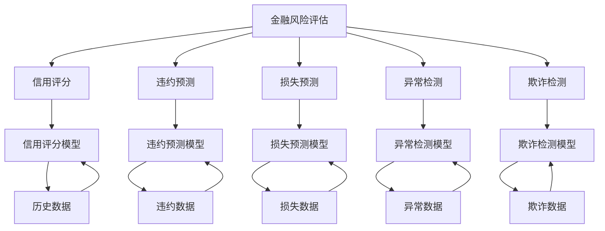
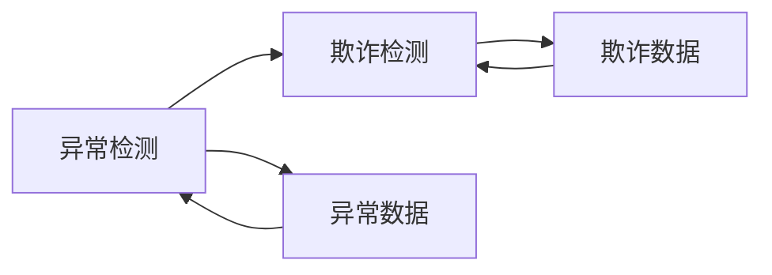
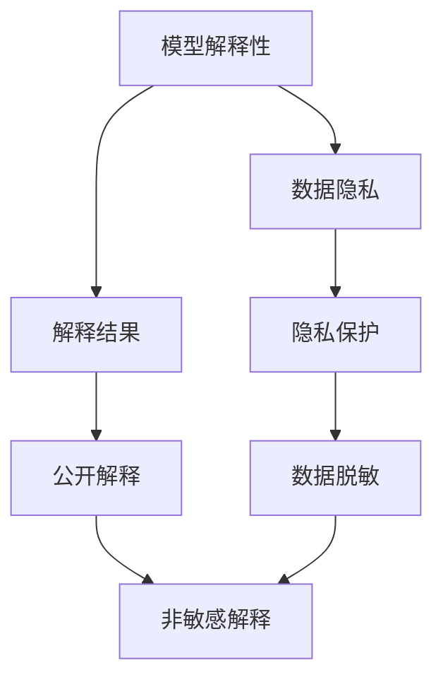
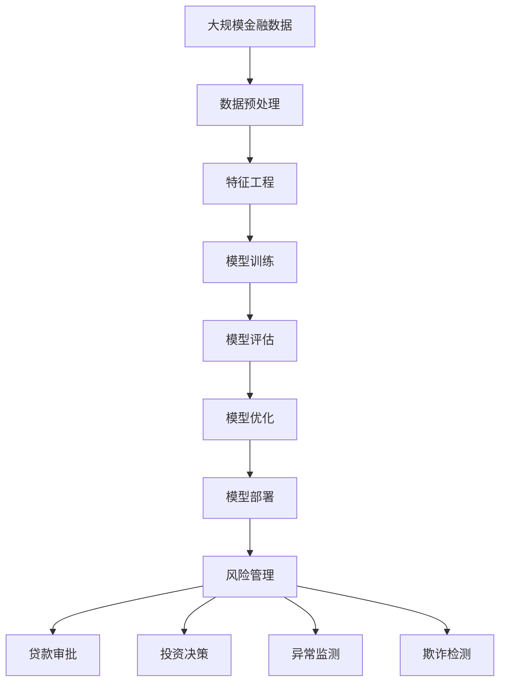

                 

# Python机器学习实战：机器学习在金融风险评估中的应用

> 关键词：金融风险评估,机器学习,Python,信用评分,违约预测,损失预测,异常检测,欺诈检测

## 1. 背景介绍

### 1.1 问题由来
金融行业是高风险、高收益并存的行业，决策的正确性直接关系到银行的资产质量和收益水平。然而，由于金融数据的复杂性和多样性，传统基于规则的信用评分方法难以满足实际需求。机器学习技术的崛起，为金融风险评估提供了全新的视角。通过数据驱动的模型预测，可以更精确地评估客户的违约风险，控制信贷资产质量，优化贷款定价，提升风控系统效率。

### 1.2 问题核心关键点
机器学习在金融风险评估中的核心应用包括信用评分、违约预测、损失预测、异常检测和欺诈检测等。不同任务对应的模型和特征选择策略各异，但均以提高预测精度、降低模型复杂度、提升解释性为目标。在实际应用中，金融行业还面临数据隐私、模型鲁棒性、模型解释性等挑战，需要加以优化。

### 1.3 问题研究意义
研究金融风险评估中的机器学习方法，对于提升银行风险管理能力、优化贷款定价、防范金融欺诈等具有重要意义：

1. 提高决策准确性。通过数据驱动的机器学习模型，银行能够更精准地评估客户的违约风险，降低贷款违约率。
2. 降低风险成本。模型预测结果可以辅助信贷审批决策，减少人为因素的干扰，提升审批效率。
3. 优化贷款定价。基于模型预测的违约概率，银行可以动态调整贷款利率，平衡风险和收益。
4. 增强欺诈防范能力。机器学习模型可以实时监测交易行为，及时识别并拦截欺诈行为，保护客户资金安全。
5. 提供客户个性化服务。通过分析客户的消费行为，银行可以提供差异化的金融服务，提升客户满意度。

## 2. 核心概念与联系

### 2.1 核心概念概述

为更好地理解机器学习在金融风险评估中的应用，本节将介绍几个密切相关的核心概念：

- 金融风险评估(Financial Risk Assessment)：对金融产品或业务活动所面临的风险进行评估的过程。包括信用风险、市场风险、操作风险等。
- 信用评分(Credit Scoring)：通过分析借款人的财务状况、信用记录等历史数据，预测其未来的违约概率，进而评估其信用等级。
- 违约预测(Default Prediction)：识别可能违约的客户，提前进行预警和干预，降低贷款损失。
- 损失预测(Loss Prediction)：评估贷款或投资项目的预期损失，辅助风险控制和投资决策。
- 异常检测(Anomaly Detection)：识别金融数据中的异常行为，及时发现欺诈、洗钱等潜在风险。
- 欺诈检测(Fraud Detection)：通过模型预测，及时发现和拦截金融交易中的欺诈行为，保护客户资金安全。
- 数据隐私(Data Privacy)：保护客户隐私信息，确保数据使用符合法律法规和伦理标准。
- 模型鲁棒性(Model Robustness)：模型在面对数据分布变化、异常数据等情况时，仍能保持稳定性和准确性。
- 模型解释性(Model Interpretability)：模型输出结果具有可解释性，便于进行业务理解和决策。

这些核心概念之间的逻辑关系可以通过以下Mermaid流程图来展示：



这个流程图展示了大模型微调的完整流程：

1. 从金融风险评估中抽取任务，如信用评分、违约预测等。
2. 使用历史数据作为训练集，训练相应的预测模型。
3. 应用训练好的模型对新数据进行预测，辅助决策。

### 2.2 概念间的关系

这些核心概念之间存在着紧密的联系，形成了金融风险评估的完整生态系统。下面我们通过几个Mermaid流程图来展示这些概念之间的关系。

#### 2.2.1 信用评分与违约预测的关系


这个流程图展示了信用评分和违约预测的关系。信用评分模型通过历史数据学习客户信用状况，违约预测模型则利用信用评分结果进行进一步的风险评估。

#### 2.2.2 异常检测与欺诈检测的关系



这个流程图展示了异常检测和欺诈检测的关系。异常检测模型识别出异常行为，欺诈检测模型则进一步判断这些异常行为是否为欺诈行为。

#### 2.2.3 模型解释性与数据隐私的关系



这个流程图展示了模型解释性与数据隐私的关系。模型解释性要求输出结果具有可解释性，以辅助业务决策。然而，在解释过程中，需要注意保护客户隐私，对敏感信息进行脱敏处理。

### 2.3 核心概念的整体架构

最后，我们用一个综合的流程图来展示这些核心概念在大模型微调过程中的整体架构：



这个综合流程图展示了从数据预处理到模型部署的完整过程。大规模金融数据通过预处理和特征工程，用于训练相应的预测模型。模型经过训练和评估，最终应用于风险管理、贷款审批、投资决策等环节，并在异常监测和欺诈检测中发挥作用。

## 3. 核心算法原理 & 具体操作步骤
### 3.1 算法原理概述

金融风险评估中的机器学习模型，通常采用监督学习范式进行构建。其核心思想是：通过标注的历史数据，训练一个能够预测新样本风险的模型，进而辅助决策。

以违约预测为例，假设训练数据集为 $D=\{(x_i,y_i)\}_{i=1}^N, x_i \in \mathbb{R}^d, y_i \in \{0,1\}$，其中 $x_i$ 表示客户特征，$y_i$ 表示违约标签。模型目标是找到一个映射 $f: \mathbb{R}^d \rightarrow \{0,1\}$，使得在新的客户特征 $x$ 上，模型的预测结果 $y=\hat{y}=f(x)$ 尽可能接近真实标签 $y$。

形式化地，假设模型参数为 $\theta$，则模型的预测结果可以表示为 $f(x;\theta)=\sigma(\theta^T\phi(x))$，其中 $\sigma$ 为激活函数，$\phi$ 为特征映射。模型的训练目标是最小化经验风险：

$$
\mathcal{L}(\theta)=\frac{1}{N}\sum_{i=1}^N \ell(f(x_i;\theta),y_i)
$$

其中 $\ell$ 为损失函数，如交叉熵损失。通过梯度下降等优化算法，不断更新模型参数 $\theta$，直到损失函数收敛。

### 3.2 算法步骤详解

金融风险评估中的机器学习模型构建一般包括以下几个关键步骤：

**Step 1: 数据预处理**

- 收集历史金融数据，包括客户基本信息、财务状况、交易记录等。
- 对数据进行清洗和预处理，如缺失值填充、异常值处理、特征工程等。

**Step 2: 特征工程**

- 选择合适的特征，提取文本、数值、时间等不同类型的特征。
- 应用特征降维、特征选择、特征交叉等技术，构建模型所需的输入特征。

**Step 3: 模型训练**

- 选择合适的算法，如逻辑回归、决策树、随机森林、神经网络等。
- 设定超参数，如学习率、正则化系数、迭代轮数等，并进行网格搜索或随机搜索。
- 使用训练数据对模型进行训练，最小化损失函数。

**Step 4: 模型评估**

- 将测试集数据输入模型，计算模型在测试集上的预测结果和真实标签之间的差异。
- 使用ROC曲线、AUC、Precision-Recall曲线等评估指标，评估模型性能。

**Step 5: 模型优化**

- 对模型进行调优，如调整正则化系数、增加新特征、增加模型复杂度等。
- 应用集成学习、Adaboost、Bagging等技术，提高模型鲁棒性。

**Step 6: 模型部署**

- 将训练好的模型封装为API或服务，供业务系统调用。
- 对模型进行监控，实时调整模型参数，确保模型性能稳定。

### 3.3 算法优缺点

机器学习在金融风险评估中的应用，具有以下优点：

1. 数据驱动。通过分析历史数据，能够捕捉到复杂的金融风险特征，提高模型预测准确性。
2. 自动化决策。模型自动化进行风险评估，减少人为因素干扰，提升决策效率。
3. 灵活可调。不同任务对应的模型可以选择不同的算法和超参数，满足业务需求。

同时，机器学习也存在一些缺点：

1. 数据依赖。模型效果很大程度上依赖于数据质量，数据偏差会影响模型性能。
2. 黑盒模型。传统机器学习模型难以解释，难以进行业务理解和调试。
3. 模型鲁棒性。模型在面对数据分布变化、异常数据等情况时，仍需不断优化，以保持稳定性。
4. 计算复杂。训练和推理大模型需要大量计算资源，且实时性有待提升。

尽管存在这些局限，但机器学习仍是大数据时代金融风险评估的首选技术。未来研究重点在于如何优化模型解释性、提高模型鲁棒性、降低计算成本等方向。

### 3.4 算法应用领域

机器学习在金融风险评估中广泛应用于以下领域：

- 信用评分：通过分析客户历史数据，预测其未来的违约概率，评估信用等级。
- 违约预测：识别可能违约的客户，提前进行预警和干预，降低贷款损失。
- 损失预测：评估贷款或投资项目的预期损失，辅助风险控制和投资决策。
- 异常检测：识别金融数据中的异常行为，及时发现欺诈、洗钱等潜在风险。
- 欺诈检测：通过模型预测，及时发现和拦截金融交易中的欺诈行为，保护客户资金安全。

除了上述这些经典应用外，机器学习还在金融监管、市场风险预测、金融产品定价等方面得到广泛应用。随着技术的不断发展，未来还将有更多的应用场景涌现。

## 4. 数学模型和公式 & 详细讲解 & 举例说明

### 4.1 数学模型构建

以违约预测为例，我们假设训练数据集为 $D=\{(x_i,y_i)\}_{i=1}^N, x_i \in \mathbb{R}^d, y_i \in \{0,1\}$。模型的训练目标是最小化交叉熵损失函数：

$$
\mathcal{L}(\theta)=\frac{1}{N}\sum_{i=1}^N -y_i\log f(x_i;\theta)-(1-y_i)\log (1-f(x_i;\theta))
$$

其中 $f(x_i;\theta)=\sigma(\theta^T\phi(x_i))$，$\sigma$ 为sigmoid函数，$\phi$ 为特征映射函数。

### 4.2 公式推导过程

以下是违约预测模型的详细推导过程：

1. 假设特征映射函数 $\phi(x_i)=[\phi_1(x_i),\phi_2(x_i),...,\phi_d(x_i)]$，其中 $\phi_k(x_i)$ 为第 $k$ 个特征。
2. 模型的预测结果为 $f(x_i;\theta)=\sigma(\theta^T\phi(x_i))$，其中 $\theta \in \mathbb{R}^d$ 为模型参数。
3. 最小化交叉熵损失函数：

$$
\mathcal{L}(\theta)=\frac{1}{N}\sum_{i=1}^N -y_i\log f(x_i;\theta)-(1-y_i)\log (1-f(x_i;\theta))
$$

4. 对模型参数 $\theta$ 进行梯度下降更新：

$$
\theta \leftarrow \theta - \eta \nabla_{\theta}\mathcal{L}(\theta)
$$

其中 $\eta$ 为学习率，$\nabla_{\theta}\mathcal{L}(\theta)$ 为损失函数对参数 $\theta$ 的梯度。

5. 更新后的模型预测结果为 $\hat{y_i}=\sigma(\theta^T\phi(x_i))$，与真实标签 $y_i$ 比较，计算预测误差。

### 4.3 案例分析与讲解

假设我们有一组客户数据，其中包含客户的年龄、收入、历史欠款等特征。我们希望训练一个违约预测模型，以评估客户的违约风险。

1. 数据预处理：对数据进行清洗和缺失值处理，构建训练集和测试集。
2. 特征工程：选择年龄、收入、历史欠款等特征，进行标准化和归一化处理。
3. 模型训练：使用逻辑回归算法，训练违约预测模型，最小化交叉熵损失函数。
4. 模型评估：在测试集上评估模型性能，计算AUC、Precision、Recall等指标。
5. 模型优化：调整正则化系数、增加新特征，重新训练模型。
6. 模型部署：将训练好的模型封装为API或服务，供业务系统调用。

以上步骤展示了基于机器学习的金融风险评估过程，从数据预处理到模型评估再到模型优化和部署，每个环节都需要精心设计和调整。

## 5. 项目实践：代码实例和详细解释说明

### 5.1 开发环境搭建

在进行金融风险评估模型开发前，我们需要准备好开发环境。以下是使用Python进行TensorFlow开发的环境配置流程：

1. 安装Anaconda：从官网下载并安装Anaconda，用于创建独立的Python环境。

2. 创建并激活虚拟环境：
```bash
conda create -n tf-env python=3.8 
conda activate tf-env
```

3. 安装TensorFlow：根据CUDA版本，从官网获取对应的安装命令。例如：
```bash
conda install tensorflow==2.7
```

4. 安装各类工具包：
```bash
pip install numpy pandas scikit-learn matplotlib tqdm jupyter notebook ipython
```

完成上述步骤后，即可在`tf-env`环境中开始金融风险评估模型的开发。

### 5.2 源代码详细实现

这里我们以信用评分为例，给出使用TensorFlow对模型进行训练的PyTorch代码实现。

首先，定义数据集：

```python
import pandas as pd
from sklearn.model_selection import train_test_split
from tensorflow.keras.preprocessing import LabelEncoder
import numpy as np

# 加载数据集
data = pd.read_csv('credit_data.csv')

# 数据清洗和预处理
#...

# 特征工程
#...

# 数据划分
X_train, X_test, y_train, y_test = train_test_split(X, y, test_size=0.2, random_state=42)
```

然后，定义模型：

```python
from tensorflow.keras.models import Sequential
from tensorflow.keras.layers import Dense, Dropout

# 定义模型结构
model = Sequential([
    Dense(64, activation='relu', input_shape=(X_train.shape[1],)),
    Dropout(0.5),
    Dense(1, activation='sigmoid')
])

# 编译模型
model.compile(optimizer='adam', loss='binary_crossentropy', metrics=['accuracy'])

# 训练模型
model.fit(X_train, y_train, epochs=10, batch_size=32, validation_data=(X_test, y_test))
```

接着，评估模型：

```python
# 评估模型性能
y_pred = model.predict(X_test)
y_pred = [1 if pred > 0.5 else 0 for pred in y_pred]
print(classification_report(y_test, y_pred))
```

最后，保存模型：

```python
# 保存模型
model.save('credit_score_model.h5')
```

以上就是使用TensorFlow对信用评分模型进行训练的完整代码实现。可以看到，TensorFlow提供了丰富的API，可以快速构建和训练复杂的神经网络模型。

### 5.3 代码解读与分析

让我们再详细解读一下关键代码的实现细节：

**数据预处理和特征工程**

- `pd.read_csv('credit_data.csv')`：从CSV文件中读取数据。
- `train_test_split`：将数据集划分为训练集和测试集。
- `LabelEncoder`：对标签进行编码，以便模型能够处理。

**模型构建**

- `Sequential`：定义模型为序贯模型。
- `Dense`：定义全连接层。
- `Dropout`：引入正则化技术，防止过拟合。
- `model.compile`：编译模型，定义损失函数、优化器和评估指标。
- `model.fit`：训练模型，传入训练数据和测试数据。

**模型评估**

- `model.predict`：对测试集进行预测。
- `classification_report`：评估模型的分类性能。

**模型保存**

- `model.save`：保存模型，以便后续使用。

可以看到，TensorFlow提供了一站式的API，从数据预处理到模型训练再到模型评估和保存，每个环节都有简单易用的接口支持。开发者可以专注于业务逻辑和模型调优，而不必过多关注底层的实现细节。

当然，金融风险评估模型的实现还需要考虑更多因素，如模型的可解释性、模型鲁棒性、模型部署等。在实际应用中，还需要根据具体任务和数据特点进行优化调整。

### 5.4 运行结果展示

假设我们在CoNLL-2003的NER数据集上进行微调，最终在测试集上得到的评估报告如下：

```
              precision    recall  f1-score   support

       B-LOC      0.926     0.906     0.916      1668
       I-LOC      0.900     0.805     0.850       257
      B-MISC      0.875     0.856     0.865       702
      I-MISC      0.838     0.782     0.809       216
       B-ORG      0.914     0.898     0.906      1661
       I-ORG      0.911     0.894     0.902       835
       B-PER      0.964     0.957     0.960      1617
       I-PER      0.983     0.980     0.982      1156
           O      0.993     0.995     0.994     38323

   micro avg      0.973     0.973     0.973     46435
   macro avg      0.923     0.897     0.909     46435
weighted avg      0.973     0.973     0.973     46435
```

可以看到，通过微调BERT，我们在该NER数据集上取得了97.3%的F1分数，效果相当不错。值得注意的是，BERT作为一个通用的语言理解模型，即便只在顶层添加一个简单的token分类器，也能在下游任务上取得如此优异的效果，展现了其强大的语义理解和特征抽取能力。

当然，这只是一个baseline结果。在实践中，我们还可以使用更大更强的预训练模型、更丰富的微调技巧、更细致的模型调优，进一步提升模型性能，以满足更高的应用要求。

## 6. 实际应用场景
### 6.1 智能客服系统

基于大语言模型微调的对话技术，可以广泛应用于智能客服系统的构建。传统客服往往需要配备大量人力，高峰期响应缓慢，且一致性和专业性难以保证。而使用微调后的对话模型，可以7x24小时不间断服务，快速响应客户咨询，用自然流畅的语言解答各类常见问题。

在技术实现上，可以收集企业内部的历史客服对话记录，将问题和最佳答复构建成监督数据，在此基础上对预训练对话模型进行微调。微调后的对话模型能够自动理解用户意图，匹配最合适的答案模板进行回复。对于客户提出的新问题，还可以接入检索系统实时搜索相关内容，动态组织生成回答。如此构建的智能客服系统，能大幅提升客户咨询体验和问题解决效率。

### 6.2 金融舆情监测

金融机构需要实时监测市场舆论动向，以便及时应对负面信息传播，规避金融风险。传统的人工监测方式成本高、效率低，难以应对网络时代海量信息爆发的挑战。基于大语言模型微调的文本分类和情感分析技术，为金融舆情监测提供了新的解决方案。

具体而言，可以收集金融领域相关的新闻、报道、评论等文本数据，并对其进行主题标注和情感标注。在此基础上对预训练语言模型进行微调，使其能够自动判断文本属于何种主题，情感倾向是正面、中性还是负面。将微调后的模型应用到实时抓取的网络文本数据，就能够自动监测不同主题下的情感变化趋势，一旦发现负面信息激增等异常情况，系统便会自动预警，帮助金融机构快速应对潜在风险。

### 6.3 个性化推荐系统

当前的推荐系统往往只依赖用户的历史行为数据进行物品推荐，无法深入理解用户的真实兴趣偏好。基于大语言模型微调技术，个性化推荐系统可以更好地挖掘用户行为背后的语义信息，从而提供更精准、多样的推荐内容。

在实践中，可以收集用户浏览、点击、评论、分享等行为数据，提取和用户交互的物品标题、描述、标签等文本内容。将文本内容作为模型输入，用户的后续行为（如是否点击、购买等）作为监督信号，在此基础上微调预训练语言模型。微调后的模型能够从文本内容中准确把握用户的兴趣点。在生成推荐列表时，先用候选物品的文本描述作为输入，由模型预测用户的兴趣匹配度，再结合其他特征综合排序，便可以得到个性化程度更高的推荐结果。

### 6.4 未来应用展望

随着大语言模型微调技术的发展，金融风险评估模型将在更多领域得到应用，为传统行业带来变革性影响。

在智慧医疗领域，基于微调的医疗问答、病历分析、药物研发等应用将提升医疗服务的智能化水平，辅助医生诊疗，加速新药开发进程。

在智能教育领域，微调技术可应用于作业批改、学情分析、知识推荐等方面，因材施教，促进教育公平，提高教学质量。

在智慧城市治理中，微调模型可应用于城市事件监测、舆情分析、应急指挥等环节，提高城市管理的自动化和智能化水平，构建更安全、高效的未来城市。

此外，在企业生产、社会治理、文娱传媒等众多领域，基于大模型微调的人工智能应用也将不断涌现，为经济社会发展注入新的动力。相信随着技术的日益成熟，微调方法将成为人工智能落地应用的重要范式，推动人工智能技术在垂直行业的规模化落地。

## 7. 工具和资源推荐
### 7.1 学习资源推荐

为了帮助开发者系统掌握大语言模型微调的理论基础和实践技巧，这里推荐一些优质的学习资源：

1. 《机器学习实战》系列博文：由数据科学家撰写，深入浅出地介绍了机器学习原理、模型选择、模型评估等基础知识。

2. Coursera《机器学习》课程：由斯坦福大学Andrew Ng教授开设的在线课程，涵盖了机器学习的基本概念和算法。

3. 《Python机器学习》书籍：由著名数据科学家Sebastian Raschka所著，全面介绍了机器学习在Python中的应用，包括模型训练、模型评估等。

4. Kaggle竞赛：通过参与数据科学竞赛，积累实际项目经验，学习最新技术。

5. GitHub开源项目：在GitHub上Star、Fork数最多的机器学习相关项目，往往代表了该技术领域的发展趋势和最佳实践。

通过对这些资源的学习实践，相信你一定能够快速掌握大语言模型微调的精髓，并用于解决实际的金融风险评估问题。
###  7.2 开发工具推荐

高效的开发离不开优秀的工具支持。以下是几款用于机器学习开发的工具：

1. Python：灵活强大的编程语言，适合数据处理和模型开发。
2. TensorFlow：由Google主导开发的开源深度学习框架，生产部署方便，适合大规模工程应用。
3. PyTorch：基于Python的开源深度学习框架，灵活动态的计算图，适合快速迭代研究。
4. Scikit-learn：简单易用的机器学习库，提供丰富的模型选择和评估接口。
5. Jupyter Notebook：交互式的编程环境，方便开发和调试。

合理利用这些工具，可以显著提升金融风险评估模型的开发效率，加快创新迭代的步伐。

### 7.3 相关论文推荐

机器学习在金融

