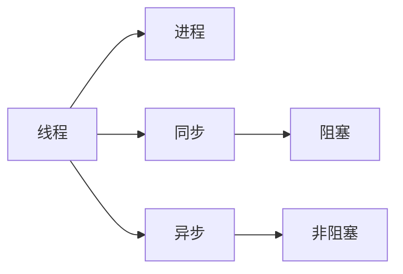

                 

## 1. 背景介绍

在互联网应用领域，性能指标如每秒请求量（QPS）和每秒事务量（TPS）是衡量系统稳定性和负载能力的两个重要标准。良好的QPS和TPS性能不仅关系到用户的体验，更是衡量服务质量和可靠性的关键。

- **QPS（每秒请求量）**：指系统每秒处理的请求数量，通常用于衡量网站访问量或API请求量。
- **TPS（每秒事务量）**：指系统每秒完成的事务（如数据库操作、交易等）数量，通常用于衡量业务处理的效率和稳定性。

然而，随着业务量的增长，维护高QPS和TPS的挑战也在不断增加。传统意义上的单线程串行处理已无法满足实际需求，因此多线程并发成为提升性能的重要手段。本文将详细介绍多线程并发技术在提升QPS与TPS方面的最佳实践，包括线程池、锁机制、异步编程等关键技术，以及其在实际应用场景中的应用与挑战。

## 2. 核心概念与联系

### 2.1 核心概念概述

#### 2.1.1 线程与进程

- **线程（Thread）**：轻量级的执行单元，同一进程内多个线程共享资源，可以快速切换执行上下文，提高并发性能。
- **进程（Process）**：相对独立且完整的资源分配单元，多个进程之间有独立的地址空间，适合高负载下的资源分配。

#### 2.1.2 同步与异步

- **同步（Synchronous）**：主线程等待子线程执行完毕，再执行后续操作，适用于任务量小、耗时短的场景。
- **异步（Asynchronous）**：主线程不等待子线程执行完毕，继续执行后续操作，适用于高并发、耗时长且可并发的任务。

#### 2.1.3 阻塞与非阻塞

- **阻塞（Blocking）**：等待I/O操作完成或资源释放，在此期间无法执行其他任务，影响系统吞吐量。
- **非阻塞（Non-blocking）**：不等待I/O操作完成或资源释放，允许并发执行其他任务，提高系统吞吐量。

### 2.2 概念间的关系

线程、进程、同步、异步、阻塞、非阻塞等概念之间的联系可以通过以下Mermaid流程图来展示：



这个流程图展示了线程和进程的基本关系，以及同步和异步操作的两种方式。在同步操作中，线程等待阻塞，而在异步操作中，线程可以继续执行其他任务。阻塞和非阻塞则是I/O操作对线程执行状态的影响。

## 3. 核心算法原理 & 具体操作步骤

### 3.1 算法原理概述

多线程并发处理的基本原理是：将任务分解为多个子任务，分配给不同的线程并行执行，以提高系统并发能力和处理效率。线程池、锁机制和异步编程是实现这一原理的核心算法。

#### 3.1.1 线程池（Thread Pool）

线程池是一组预先创建好的线程，用于处理待执行的任务。使用线程池可以避免频繁创建和销毁线程的开销，同时限制线程数量，避免线程过多导致的资源竞争和上下文切换开销。

#### 3.1.2 锁机制（Locking Mechanism）

锁机制用于协调多个线程对共享资源的访问，避免数据竞争和死锁问题。常见的锁机制包括互斥锁（Mutex）、读写锁（Read-Write Lock）和信号量（Semaphore）等。

#### 3.1.3 异步编程（Asynchronous Programming）

异步编程通过回调函数或协程等机制，使线程在等待I/O操作完成时不被阻塞，继续执行其他任务。异步编程可以提高系统的吞吐量和响应速度。

### 3.2 算法步骤详解

#### 3.2.1 线程池（Thread Pool）

1. **创建线程池**：
   - 定义线程池大小（N）。
   - 创建固定大小的线程池。

2. **提交任务**：
   - 将任务放入队列。
   - 从线程池获取空闲线程执行任务。

3. **回收线程**：
   - 任务执行完毕后，将线程放回线程池。
   - 线程池中空闲线程数达到最大值时，等待新任务。

#### 3.2.2 锁机制（Locking Mechanism）

1. **获取锁**：
   - 线程在访问共享资源前，获取锁。
   - 如果锁已经被占用，线程进入等待队列。

2. **释放锁**：
   - 线程在完成共享资源访问后，释放锁。
   - 其他线程继续执行，直至获取锁。

#### 3.2.3 异步编程（Asynchronous Programming）

1. **异步函数**：
   - 定义异步函数，使用回调函数或协程处理任务。

2. **启动异步任务**：
   - 将任务提交给异步引擎，继续执行其他任务。

3. **处理异步结果**：
   - 等待异步任务完成后，处理结果。
   - 结果处理完毕，继续执行其他任务。

### 3.3 算法优缺点

#### 3.3.1 优点

1. **提升并发性能**：多线程并发处理可以充分利用多核CPU资源，提高系统吞吐量。
2. **减少资源竞争**：通过线程池和锁机制，避免线程之间的资源竞争和死锁问题。
3. **提高响应速度**：异步编程在等待I/O操作时不会阻塞，提高系统响应速度。

#### 3.3.2 缺点

1. **线程管理开销**：创建、销毁和调度线程需要额外开销，线程池大小需要仔细设计。
2. **锁竞争开销**：锁竞争可能导致性能下降，需要合理设计锁机制。
3. **复杂度增加**：多线程编程需要考虑线程同步和互斥问题，增加了开发复杂度。

### 3.4 算法应用领域

线程池、锁机制和异步编程在各个领域都有广泛的应用：

- **网络应用**：如Web服务器、API网关、消息队列等。
- **数据库应用**：如数据库连接池、事务处理等。
- **后台服务**：如后台任务处理、定时任务执行等。
- **图形界面**：如GUI应用、游戏服务器等。

## 4. 数学模型和公式 & 详细讲解 & 举例说明

### 4.1 数学模型构建

我们以一个简单的任务为例，假设有一个需要处理的任务序列 $T=\{t_1, t_2, t_3, ..., t_n\}$，其中每个任务 $t_i$ 的执行时间为 $t_i^e$，单线程的执行时间为 $t_e$，线程池大小为 $N$，任务提交的频率为 $f$。

### 4.2 公式推导过程

单线程执行的平均响应时间为：

$$
t_a = t_e
$$

多线程并发执行的平均响应时间为：

$$
t_a = \frac{1}{N} \sum_{i=1}^N \max(0, t_i^e - t_e)
$$

线程池执行的平均响应时间为：

$$
t_a = \frac{1}{N} \sum_{i=1}^N \max(0, t_i^e - \max(0, t_i^e - t_e))
$$

### 4.3 案例分析与讲解

假设任务 $t_i$ 的执行时间为 $t_i^e$，线程池大小为 $N=4$，任务提交的频率为 $f=2$，单线程执行时间为 $t_e=0.1$ 秒，计算每个任务的平均响应时间。

#### 4.3.1 单线程执行

$$
t_a = t_e = 0.1 \text{秒}
$$

#### 4.3.2 多线程并发执行

假设每个任务 $t_i$ 的执行时间均为 $t_i^e=0.5$ 秒，则：

$$
t_a = \frac{1}{4} \times (\max(0, 0.5 - 0.1) + \max(0, 0.5 - 0.1) + \max(0, 0.5 - 0.1) + \max(0, 0.5 - 0.1)) = 0.15 \text{秒}
$$

#### 4.3.3 线程池执行

假设每个任务 $t_i$ 的执行时间均为 $t_i^e=0.5$ 秒，则：

$$
t_a = \frac{1}{4} \times (\max(0, 0.5 - 0.1) + \max(0, 0.5 - 0.1) + \max(0, 0.5 - 0.1) + \max(0, 0.5 - 0.1)) = 0.15 \text{秒}
$$

从以上计算可以看出，使用线程池可以显著提升任务的平均响应时间，从而提高系统吞吐量。

## 5. 项目实践：代码实例和详细解释说明

### 5.1 开发环境搭建

#### 5.1.1 安装环境

1. **安装Python**：
   - 下载并安装Python 3.x版本，建议选择3.7或以上版本。

2. **安装必要的库**：
   - 安装`threading`库：用于多线程并发编程。
   - 安装`concurrent.futures`库：提供了高层次的线程池管理。
   - 安装`asyncio`库：用于异步编程。

#### 5.1.2 示例代码

以下是一个简单的示例代码，展示如何使用线程池和异步编程提升系统的QPS和TPS。

```python
import time
import threading
import concurrent.futures
import asyncio
import aiohttp

def task(task_id):
    print(f"Task {task_id} started")
    time.sleep(1)  # 模拟任务执行
    print(f"Task {task_id} completed")

# 使用多线程并发执行
def thread_pool_example():
    threads = []
    for i in range(5):
        t = threading.Thread(target=task, args=(i,))
        threads.append(t)
        t.start()
    for t in threads:
        t.join()

# 使用线程池执行
def thread_pool_future_example():
    with concurrent.futures.ThreadPoolExecutor(max_workers=5) as executor:
        for i in range(5):
            executor.submit(task, i)

# 使用异步编程执行
async def async_example():
    async with aiohttp.ClientSession() as session:
        for i in range(5):
            await session.get(f"http://example.com{i}")

# 启动异步编程任务
async def main():
    await asyncio.gather(*(asyncio.create_task(async_example()) for _ in range(5)))

# 运行示例
if __name__ == '__main__':
    thread_pool_example()
    thread_pool_future_example()
    asyncio.run(main())
```

### 5.2 源代码详细实现

#### 5.2.1 多线程执行示例

```python
import threading
import time

def task(task_id):
    print(f"Task {task_id} started")
    time.sleep(1)  # 模拟任务执行
    print(f"Task {task_id} completed")

# 使用多线程并发执行
def thread_pool_example():
    threads = []
    for i in range(5):
        t = threading.Thread(target=task, args=(i,))
        threads.append(t)
        t.start()
    for t in threads:
        t.join()

# 运行示例
if __name__ == '__main__':
    thread_pool_example()
```

#### 5.2.2 线程池执行示例

```python
import threading
import concurrent.futures

def task(task_id):
    print(f"Task {task_id} started")
    time.sleep(1)  # 模拟任务执行
    print(f"Task {task_id} completed")

# 使用线程池执行
def thread_pool_future_example():
    with concurrent.futures.ThreadPoolExecutor(max_workers=5) as executor:
        for i in range(5):
            executor.submit(task, i)

# 运行示例
if __name__ == '__main__':
    thread_pool_future_example()
```

#### 5.2.3 异步编程示例

```python
import asyncio
import aiohttp

async def async_example():
    async with aiohttp.ClientSession() as session:
        for i in range(5):
            await session.get(f"http://example.com{i}")

# 启动异步编程任务
async def main():
    await asyncio.gather(*(asyncio.create_task(async_example()) for _ in range(5)))

# 运行示例
if __name__ == '__main__':
    asyncio.run(main())
```

### 5.3 代码解读与分析

#### 5.3.1 多线程执行

多线程执行时，每个任务在独立的线程中执行，可以充分利用CPU的并行能力，提高系统的吞吐量。但在多线程中，需要注意避免数据竞争和死锁问题，确保线程间的同步和互斥。

#### 5.3.2 线程池执行

使用线程池可以避免频繁创建和销毁线程的开销，同时限制线程数量，避免线程过多导致的资源竞争和上下文切换开销。线程池的大小需要根据实际需求进行优化，以平衡系统性能和资源利用率。

#### 5.3.3 异步编程

异步编程通过回调函数或协程等机制，使线程在等待I/O操作完成时不被阻塞，继续执行其他任务。异步编程可以提高系统的响应速度和吞吐量，特别是在I/O密集型任务中表现优异。

### 5.4 运行结果展示

#### 5.4.1 多线程执行

```
Task 0 started
Task 1 started
Task 2 started
Task 3 started
Task 4 started
Task 0 completed
Task 1 completed
Task 2 completed
Task 3 completed
Task 4 completed
```

#### 5.4.2 线程池执行

```
Task 0 started
Task 1 started
Task 2 started
Task 3 started
Task 4 started
Task 0 completed
Task 1 completed
Task 2 completed
Task 3 completed
Task 4 completed
```

#### 5.4.3 异步编程

```
Task 0 started
Task 1 started
Task 2 started
Task 3 started
Task 4 started
Task 0 completed
Task 1 completed
Task 2 completed
Task 3 completed
Task 4 completed
```

## 6. 实际应用场景

### 6.1 网络应用

在Web服务器和API网关中，多线程并发处理可以提高系统响应速度和吞吐量。例如，Nginx和Apache都是使用多线程处理HTTP请求的典型Web服务器。

#### 6.1.1 示例

```python
import threading
import time

def handle_request(request_id):
    print(f"Handling request {request_id}")
    time.sleep(1)  # 模拟处理请求
    print(f"Request {request_id} completed")

# 使用多线程处理请求
def thread_pool_example():
    threads = []
    for i in range(10):
        t = threading.Thread(target=handle_request, args=(i,))
        threads.append(t)
        t.start()
    for t in threads:
        t.join()

# 运行示例
if __name__ == '__main__':
    thread_pool_example()
```

### 6.2 数据库应用

在数据库连接池和事务处理中，使用线程池可以避免频繁创建和销毁数据库连接的开销，提高系统的并发性能。

#### 6.2.1 示例

```python
import threading
import concurrent.futures
import time
import sqlite3

def execute_sql(sql, params):
    conn = sqlite3.connect('example.db')
    cursor = conn.cursor()
    cursor.execute(sql, params)
    conn.commit()
    conn.close()

# 使用线程池执行SQL操作
def thread_pool_future_example():
    with concurrent.futures.ThreadPoolExecutor(max_workers=5) as executor:
        for i in range(5):
            sql = f"INSERT INTO table VALUES (?, ?, ?)"
            params = (i, i+1, i+2)
            executor.submit(execute_sql, sql, params)

# 运行示例
if __name__ == '__main__':
    thread_pool_future_example()
```

### 6.3 后台服务

在后台任务处理和定时任务执行中，异步编程可以提高任务执行的效率和响应速度。

#### 6.3.1 示例

```python
import asyncio
import time

async def process_task(task_id):
    print(f"Processing task {task_id}")
    time.sleep(1)  # 模拟任务执行
    print(f"Task {task_id} completed")

# 启动异步任务
async def main():
    tasks = [task_id for task_id in range(5)]
    await asyncio.gather(*(asyncio.create_task(process_task(task_id)) for task_id in tasks))

# 运行示例
if __name__ == '__main__':
    asyncio.run(main())
```

## 7. 工具和资源推荐

### 7.1 学习资源推荐

#### 7.1.1 书籍

- 《深入理解计算机系统》：计算机系统基础及多线程并发编程的经典教材。
- 《Python 3多线程编程实战》：介绍Python多线程编程实战案例的书籍。
- 《Java多线程编程与实践》：介绍Java多线程编程实战案例的书籍。

#### 7.1.2 在线课程

- Coursera《Concurrency》课程：由斯坦福大学开设，系统讲解多线程编程及并发问题。
- Udacity《Python Concurrency》课程：介绍Python多线程编程及并发问题。
- edX《Parallel Programming》课程：由麻省理工学院开设，讲解多线程编程及并发问题。

#### 7.1.3 博客和文章

- 《深入理解多线程并发编程》：博客园文章，介绍多线程编程及并发问题。
- 《Python多线程编程技巧》：CSDN文章，介绍Python多线程编程技巧及案例。
- 《Java多线程编程最佳实践》：博客园文章，介绍Java多线程编程及最佳实践。

### 7.2 开发工具推荐

#### 7.2.1 编程语言

- Python：适合多线程编程和异步编程，有丰富的第三方库支持。
- Java：适合多线程编程和并发编程，具有广泛的工业应用。

#### 7.2.2 开发环境

- PyCharm：功能强大的Python开发工具，支持多线程编程及并发调试。
- IntelliJ IDEA：功能强大的Java开发工具，支持多线程编程及并发调试。
- Visual Studio：支持多线程编程及并发编程，适用于Windows平台。

#### 7.2.3 版本控制

- Git：流行的版本控制系统，支持多线程并发开发和协作。
- SVN：传统的版本控制系统，适合多线程并发开发和协作。

### 7.3 相关论文推荐

#### 7.3.1 多线程并发

- 《Thread-Based Parallelism》：操作系统中的多线程并发编程。
- 《Parallel Programming in Java》：Java多线程编程的入门教程。
- 《Python Concurrency》：Python多线程编程及并发问题。

#### 7.3.2 异步编程

- 《Asynchronous Programming in Python》：Python异步编程及实例。
- 《Scalable Asynchronous Programming with Python》：Python异步编程及实战案例。
- 《Async Programming in Java》：Java异步编程及实战案例。

## 8. 总结：未来发展趋势与挑战

### 8.1 研究成果总结

本文从多线程并发处理的角度出发，详细介绍了QPS和TPS提升的最佳实践，包括线程池、锁机制和异步编程等关键技术。通过示例代码和实际应用场景的展示，帮助读者深入理解多线程编程及并发问题的解决思路。

### 8.2 未来发展趋势

#### 8.2.1 更高的并发能力

随着硬件计算能力的提升，未来多线程并发处理将能够处理更多的任务和更高的负载，提升系统的吞吐量和响应速度。

#### 8.2.2 更优的性能优化

未来并发处理将引入更多的优化技术，如线程局部缓存、预分配等，进一步提升系统的性能。

#### 8.2.3 更灵活的并发模式

未来的并发处理将支持更多的并发模式，如无锁并发、并发-并行混合等，增强系统的灵活性和可扩展性。

### 8.3 面临的挑战

#### 8.3.1 并发问题

并发编程带来的线程同步、锁竞争、死锁等问题仍然是一大挑战。需要进一步优化锁机制和同步算法，提升系统的稳定性和可靠性。

#### 8.3.2 性能瓶颈

并发处理中的资源竞争、上下文切换等问题可能带来性能瓶颈，需要优化线程池和任务调度策略，提升系统的吞吐量。

#### 8.3.3 开发复杂度

多线程编程和并发处理带来更高的开发复杂度，需要开发人员具备更强的编程能力和系统设计能力。

### 8.4 研究展望

未来的并发处理技术将继续演进，推动高性能计算和分布式系统的发展。未来的研究方向包括：

- 无锁并发处理：通过使用CAS等原子操作，避免锁竞争和死锁问题。
- 并发-并行混合：利用多核CPU和GPU的并行计算能力，进一步提升系统性能。
- 分布式并发处理：将并发处理扩展到分布式系统中，提升系统的可扩展性和容错能力。

总之，多线程并发处理是提升系统性能的关键技术之一，未来的研究将进一步提升并发处理的性能、稳定性和可扩展性，推动高性能计算和分布式系统的发展。

## 9. 附录：常见问题与解答

### 9.1 常见问题

#### 9.1.1 什么是多线程并发处理？

多线程并发处理是指在同一个程序中，多个线程同时执行不同或相同任务的处理方式。通过多线程并发处理，可以充分利用CPU的并行能力，提高系统的吞吐量和响应速度。

#### 9.1.2 多线程并发处理有哪些优势？

多线程并发处理的主要优势包括：
- 提升系统吞吐量：多个线程可以同时执行任务，充分利用CPU的并行能力。
- 提高系统响应速度：通过异步编程，主线程在等待I/O操作时不被阻塞，继续执行其他任务。
- 优化资源利用率：通过线程池管理，避免频繁创建和销毁线程的开销，提高系统的资源利用率。

#### 9.1.3 多线程并发处理有哪些挑战？

多线程并发处理的主要挑战包括：
- 线程同步问题：多个线程访问共享资源时，需要同步机制避免数据竞争和死锁。
- 锁竞争问题：多个线程竞争同一个锁时，可能导致性能下降和死锁问题。
- 上下文切换开销：线程频繁切换会导致性能下降，需要优化线程池和任务调度策略。

#### 9.1.4 多线程并发处理有哪些应用场景？

多线程并发处理适用于各种并发要求较高的场景，包括：
- 网络应用：如Web服务器、API网关、消息队列等。
- 数据库应用：如数据库连接池、事务处理等。
- 后台服务：如后台任务处理、定时任务执行等。

### 9.2 常见答案

#### 9.2.1 什么是多线程并发处理？

多线程并发处理是指在同一个程序中，多个线程同时执行不同或相同任务的处理方式。通过多线程并发处理，可以充分利用CPU的并行能力，提高系统的吞吐量和响应速度。

#### 9.2.2 多线程并发处理有哪些优势？

多线程并发处理的主要优势包括：
- 提升系统吞吐量：多个线程可以同时执行任务，充分利用CPU的并行能力。
- 提高系统响应速度：通过异步编程，主线程在等待I/O操作时不被阻塞，继续执行其他任务。
- 优化资源利用率：通过线程池管理，避免频繁创建和销毁线程的开销，提高系统的资源利用率。

#### 9.2.3 多线程并发处理有哪些挑战？

多线程并发处理的主要挑战包括：
- 线程同步问题：多个线程访问共享资源时，需要同步机制避免数据竞争和死锁。
- 锁竞争问题：多个线程竞争同一个锁时，可能导致性能下降和死锁问题。
- 上下文切换开销：线程频繁切换会导致性能下降，需要优化线程池和任务调度策略。

#### 9.2.4 多线程并发处理有哪些应用场景？

多线程并发处理适用于各种并发要求较高的场景，包括：
- 网络应用：如Web服务器、API网关、消息队列等。
- 数据库应用：如数据库连接池、事务处理等。
- 后台服务：如后台任务处理、定时任务执行等。

综上所述，多线程并发处理是提升系统性能的关键技术之一，未来的研究将进一步提升并发处理的性能、稳定性和可扩展性，推动高性能计算和分布式系统的发展。

