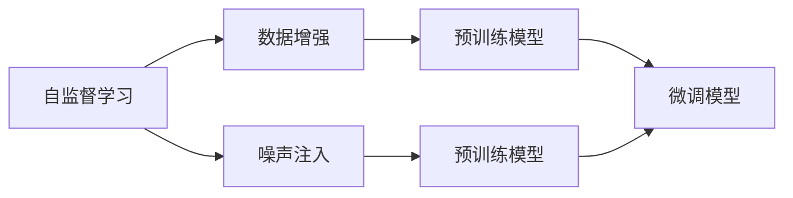
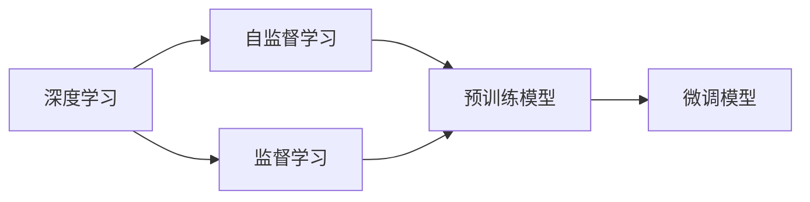
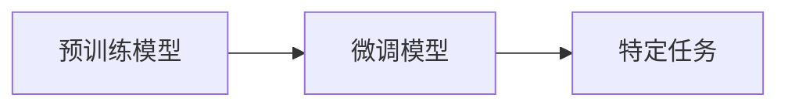
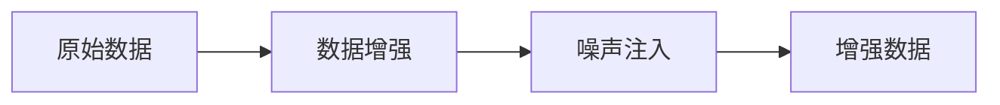
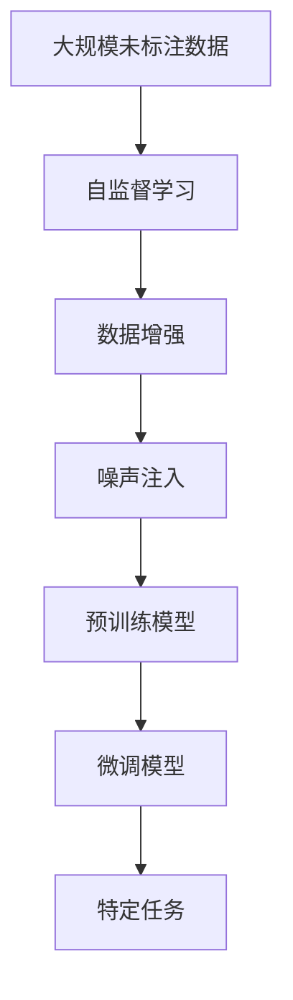

                 

# Self-Supervised Learning原理与代码实例讲解

> 关键词：
1. Self-Supervised Learning
2. 无监督学习
3. 自监督学习
4. 数据增强
5. 噪声注入
6. 预训练模型
7. 深度学习

## 1. 背景介绍

### 1.1 问题由来

自监督学习(Self-Supervised Learning, SSL)是一种无需人工标注的机器学习范式，通过对数据本身的结构进行挖掘，自动生成大量有监督信号，以训练模型。SSL最初用于数据量巨大的语音、图像等领域，近年来逐步扩展到自然语言处理(NLP)和计算机视觉(CV)等领域。

自监督学习的目标是利用数据中的内在结构，训练出能够在特定任务中高效适应的模型。这种学习方式不仅减少了对标注数据的需求，还能够在实际应用中取得不错的效果，从而成为许多NLP和CV任务中不可或缺的技术手段。

### 1.2 问题核心关键点

自监督学习的核心在于：
1. 无标注数据的利用：SSL通过自动生成有监督信号，使得大量未标注数据也能参与训练。
2. 数据的结构挖掘：SSL从数据的内在结构中提取有用的信息，用于训练模型。
3. 模型的泛化能力：SSL通过挖掘数据中的潜在关系，训练出具有较强泛化能力的模型。
4. 技术的进步：SSL技术在深度学习领域不断发展，产生了大量高效的训练策略和算法。

目前，自监督学习已经成为深度学习的重要分支，广泛应用于预训练语言模型、无监督图像生成、目标检测等任务中。

### 1.3 问题研究意义

研究自监督学习方法，对于拓展深度学习的应用范围，提升机器学习模型的泛化能力，减少标注成本，具有重要意义：

1. 数据利用效率：SSL能够最大化利用未标注数据，使得训练数据规模不再成为瓶颈。
2. 模型泛化能力：SSL训练的模型往往具备较强的泛化能力，能够在不同任务和领域中表现出色。
3. 降低成本：SSL无需大量人工标注，减少标注成本和时间投入，加速机器学习模型的开发进程。
4. 推动研究进展：SSL技术的不断进步，为深度学习提供了新的研究方法和工具，促进了深度学习理论的发展。
5. 应用潜力：SSL技术有望在更多场景下落地应用，为各行各业带来变革性影响。

## 2. 核心概念与联系

### 2.1 核心概念概述

为了更好地理解自监督学习，本节将介绍几个密切相关的核心概念：

- 自监督学习(Self-Supervised Learning, SSL)：通过自动生成有监督信号，无需人工标注即可训练深度学习模型的学习范式。
- 数据增强(Data Augmentation)：通过对原始数据进行一系列变换，生成新的训练数据，增加数据多样性。
- 噪声注入(Noise Injection)：通过在数据中引入随机噪声，模拟数据生成过程，增加模型对噪声的鲁棒性。
- 预训练模型(Pre-training Model)：在大规模数据上预先训练出具有通用特征的模型，用于后续特定任务微调。
- 深度学习(Deep Learning)：通过多层神经网络结构，自动学习输入数据的高级抽象特征。

这些核心概念之间的逻辑关系可以通过以下Mermaid流程图来展示：



这个流程图展示了自监督学习的基本流程：
1. 从数据中自动生成有监督信号，用于训练模型。
2. 通过数据增强和噪声注入，增加数据多样性。
3. 在预训练数据上进行预训练，获得通用特征。
4. 使用预训练模型进行特定任务的微调。

### 2.2 概念间的关系

这些核心概念之间存在着紧密的联系，形成了自监督学习的完整生态系统。下面我们通过几个Mermaid流程图来展示这些概念之间的关系。

#### 2.2.1 自监督学习的学习范式



这个流程图展示了深度学习中的监督学习和自监督学习两种范式的关系。自监督学习是监督学习的补充，通过自动生成有监督信号，利用大规模无标注数据进行预训练，再通过微调应用于特定任务。

#### 2.2.2 预训练与微调的关系



这个流程图展示了预训练和微调的基本关系。预训练模型在大规模数据上学习到通用的特征，再通过微调应用于特定任务，提升模型性能。

#### 2.2.3 数据增强和噪声注入



这个流程图展示了数据增强和噪声注入的基本流程。数据增强通过对原始数据进行变换，生成新的数据；噪声注入则通过在数据中引入随机噪声，增加数据的多样性和鲁棒性。

### 2.3 核心概念的整体架构

最后，我们用一个综合的流程图来展示这些核心概念在自监督学习中的应用：



这个综合流程图展示了从原始数据到特定任务的全流程：
1. 大规模未标注数据通过自监督学习进行预训练。
2. 数据增强和噪声注入增加数据多样性，提升模型鲁棒性。
3. 预训练模型获得通用特征，进行微调应用于特定任务。
4. 微调模型在特定任务上取得理想效果。

通过这些流程图，我们可以更清晰地理解自监督学习的各个环节和关键技术，为后续深入讨论具体的自监督学习算法和方法奠定基础。

## 3. 核心算法原理 & 具体操作步骤

### 3.1 算法原理概述

自监督学习的核心目标是通过自动生成有监督信号，训练深度学习模型。常见的自监督学习方法包括：

- 掩码语言模型(Masked Language Model, MLM)：将文本中的部分单词进行随机掩码，训练模型预测掩码单词。
- 自编码器(Autoencoder)：通过编码器将输入数据压缩为低维表示，解码器将低维表示解码回原始数据。
- 对比预测方法(Contrastive Predictive Coding, CPC)：使用自回归模型预测未来的数据，训练模型学习数据的内在结构。

这些方法主要通过挖掘数据的内在结构，自动生成有监督信号，训练深度学习模型。通过这些方法训练出的模型往往具备较强的泛化能力，能够在不同任务和领域中表现出色。

### 3.2 算法步骤详解

以下是几种常见的自监督学习方法的具体步骤：

#### 3.2.1 掩码语言模型

**步骤1：构建数据集**

从大规模未标注文本数据中随机抽取一段长度为n的文本，其中随机掩码部分单词，生成掩码语言模型数据集。

**步骤2：定义损失函数**

掩码语言模型的损失函数定义为所有被掩码单词的交叉熵损失之和。即对于文本中每个被掩码的单词，预测其真实单词，计算交叉熵损失，最终将所有损失求和。

**步骤3：优化模型参数**

使用梯度下降等优化算法，最小化掩码语言模型的损失函数，更新模型参数。

**步骤4：应用微调**

将预训练后的掩码语言模型进行微调，应用于特定任务，如文本分类、命名实体识别等。

#### 3.2.2 自编码器

**步骤1：构建数据集**

从大规模未标注数据中随机抽取数据样本，输入到自编码器中。

**步骤2：定义损失函数**

自编码器的损失函数定义为重构误差，即输入数据与解码器输出数据的均方误差。

**步骤3：优化模型参数**

使用梯度下降等优化算法，最小化自编码器的损失函数，更新模型参数。

**步骤4：应用微调**

将预训练后的自编码器进行微调，应用于特定任务，如图像分类、目标检测等。

#### 3.2.3 对比预测方法

**步骤1：构建数据集**

从大规模未标注数据中随机抽取数据样本，使用自回归模型预测未来的数据。

**步骤2：定义损失函数**

对比预测方法的损失函数定义为预测数据与真实数据的对比损失。即对于每个预测样本，计算其与真实数据的对比损失，最终将所有损失求和。

**步骤3：优化模型参数**

使用梯度下降等优化算法，最小化对比预测方法的损失函数，更新模型参数。

**步骤4：应用微调**

将预训练后的对比预测模型进行微调，应用于特定任务，如时间序列预测、音频分类等。

### 3.3 算法优缺点

自监督学习具有以下优点：

1. 无需标注数据：SSL能够最大化利用大规模未标注数据，减少对标注数据的依赖。
2. 数据利用效率高：SSL能够增加数据多样性，提升模型的泛化能力。
3. 训练效率高：SSL能够通过自动生成有监督信号，减少人工标注成本，加速模型训练。

同时，自监督学习也存在一些局限性：

1. 数据质量要求高：SSL依赖数据的内在结构，如果数据质量较差，可能会影响模型训练效果。
2. 算法复杂度高：SSL算法通常较为复杂，需要精心设计生成有监督信号的方式。
3. 模型泛化能力不确定：SSL训练的模型泛化能力依赖数据特性，不同数据集上的效果可能存在差异。
4. 可解释性差：SSL训练的模型往往具有"黑盒"特性，难以解释其内部工作机制。

尽管存在这些局限性，但SSL在大规模数据和高效训练需求的场景下，依然是一种高效、有效、经济的学习范式。

### 3.4 算法应用领域

自监督学习在深度学习领域得到了广泛应用，覆盖了几乎所有常见任务，例如：

- 文本处理：如文本分类、命名实体识别、情感分析、文本生成等。通过掩码语言模型和自编码器等方法进行预训练，提升模型对文本数据的理解能力。
- 图像处理：如图像分类、目标检测、图像生成等。通过自编码器、对比预测方法等进行预训练，提升模型对图像数据的处理能力。
- 语音处理：如语音识别、语音合成、语音生成等。通过自编码器、对比预测方法等进行预训练，提升模型对语音数据的处理能力。
- 时间序列预测：如股票预测、天气预测等。通过自回归模型、对比预测方法等进行预训练，提升模型对时间序列数据的预测能力。
- 音频分类：如音乐分类、语音情感识别等。通过自回归模型、对比预测方法等进行预训练，提升模型对音频数据的分类能力。

除了这些经典任务外，自监督学习还被创新性地应用到更多场景中，如计算机视觉领域的超分辨率图像重建、医学图像的疾病检测等，为深度学习技术带来了新的突破。

## 4. 数学模型和公式 & 详细讲解

### 4.1 数学模型构建

自监督学习的数学模型通常包括以下几个关键组件：

- 输入数据 $x$：原始数据，可以是文本、图像、音频等。
- 预训练模型 $\theta$：通过自监督学习方法训练出的深度学习模型。
- 生成信号 $y$：根据输入数据自动生成的有监督信号，用于训练模型。
- 损失函数 $\mathcal{L}$：用于衡量模型预测与生成信号之间的差异。

假设输入数据 $x$ 为文本序列，长度为 $n$，模型预测的生成信号 $y$ 为掩码单词。则掩码语言模型的损失函数 $\mathcal{L}$ 可以表示为：

$$
\mathcal{L} = -\frac{1}{n} \sum_{i=1}^n \log P(y_i \mid x)
$$

其中 $P(y_i \mid x)$ 为模型在输入数据 $x$ 上预测生成信号 $y_i$ 的概率分布，即：

$$
P(y_i \mid x) = \frac{\exp(\text{logits}(y_i \mid x))}{\sum_{j=1}^v \exp(\text{logits}(j \mid x))}
$$

其中 $\text{logits}(j \mid x)$ 为模型在输入数据 $x$ 上预测单词 $j$ 的 logits 值，$v$ 为词汇表大小。

### 4.2 公式推导过程

以掩码语言模型为例，推导其损失函数的梯度。

**掩码语言模型**

假设输入数据 $x$ 为文本序列，长度为 $n$，模型预测的生成信号 $y$ 为掩码单词。则掩码语言模型的损失函数 $\mathcal{L}$ 可以表示为：

$$
\mathcal{L} = -\frac{1}{n} \sum_{i=1}^n \log P(y_i \mid x)
$$

其中 $P(y_i \mid x)$ 为模型在输入数据 $x$ 上预测生成信号 $y_i$ 的概率分布，即：

$$
P(y_i \mid x) = \frac{\exp(\text{logits}(y_i \mid x))}{\sum_{j=1}^v \exp(\text{logits}(j \mid x))}
$$

其中 $\text{logits}(j \mid x)$ 为模型在输入数据 $x$ 上预测单词 $j$ 的 logits 值，$v$ 为词汇表大小。

将概率分布 $P(y_i \mid x)$ 代入损失函数，得到：

$$
\mathcal{L} = -\frac{1}{n} \sum_{i=1}^n \log \left(\frac{\exp(\text{logits}(y_i \mid x))}{\sum_{j=1}^v \exp(\text{logits}(j \mid x))}\right)
$$

化简得：

$$
\mathcal{L} = -\frac{1}{n} \sum_{i=1}^n \text{logits}(y_i \mid x) - \log \left(\sum_{j=1}^v \exp(\text{logits}(j \mid x))\right)
$$

将上式对 $\theta$ 求导，得到损失函数的梯度：

$$
\nabla_{\theta} \mathcal{L} = \frac{1}{n} \sum_{i=1}^n \nabla_{\theta} \text{logits}(y_i \mid x) - \frac{1}{n} \sum_{j=1}^v \nabla_{\theta} \text{logits}(j \mid x) \exp(\text{logits}(j \mid x)) / \sum_{j=1}^v \exp(\text{logits}(j \mid x))
$$

其中 $\nabla_{\theta} \text{logits}(j \mid x)$ 为模型在输入数据 $x$ 上预测单词 $j$ 的 logits 梯度，$v$ 为词汇表大小。

### 4.3 案例分析与讲解

为了更直观地理解自监督学习的数学模型和公式，我们以BERT模型的掩码语言模型为例，进一步分析其数学推导过程。

BERT模型的掩码语言模型训练过程包括：
1. 在训练数据中随机掩码单词，生成掩码语言模型数据集。
2. 定义掩码语言模型的损失函数，计算模型预测掩码单词的概率分布。
3. 使用梯度下降等优化算法，最小化损失函数，更新模型参数。

以BERT模型的语言建模任务为例，假设输入数据 $x$ 为文本序列，长度为 $n$，掩码单词为 $y$，模型预测的单词表示为 $\text{logits}(y \mid x)$。则BERT模型的掩码语言模型的损失函数 $\mathcal{L}$ 可以表示为：

$$
\mathcal{L} = -\frac{1}{n} \sum_{i=1}^n \log P(y_i \mid x)
$$

其中 $P(y_i \mid x)$ 为模型在输入数据 $x$ 上预测生成信号 $y_i$ 的概率分布，即：

$$
P(y_i \mid x) = \frac{\exp(\text{logits}(y_i \mid x))}{\sum_{j=1}^v \exp(\text{logits}(j \mid x))}
$$

其中 $\text{logits}(j \mid x)$ 为模型在输入数据 $x$ 上预测单词 $j$ 的 logits 值，$v$ 为词汇表大小。

将概率分布 $P(y_i \mid x)$ 代入损失函数，得到：

$$
\mathcal{L} = -\frac{1}{n} \sum_{i=1}^n \log \left(\frac{\exp(\text{logits}(y_i \mid x))}{\sum_{j=1}^v \exp(\text{logits}(j \mid x))}\right)
$$

化简得：

$$
\mathcal{L} = -\frac{1}{n} \sum_{i=1}^n \text{logits}(y_i \mid x) - \log \left(\sum_{j=1}^v \exp(\text{logits}(j \mid x))\right)
$$

将上式对 $\theta$ 求导，得到损失函数的梯度：

$$
\nabla_{\theta} \mathcal{L} = \frac{1}{n} \sum_{i=1}^n \nabla_{\theta} \text{logits}(y_i \mid x) - \frac{1}{n} \sum_{j=1}^v \nabla_{\theta} \text{logits}(j \mid x) \exp(\text{logits}(j \mid x)) / \sum_{j=1}^v \exp(\text{logits}(j \mid x))
$$

其中 $\nabla_{\theta} \text{logits}(j \mid x)$ 为模型在输入数据 $x$ 上预测单词 $j$ 的 logits 梯度，$v$ 为词汇表大小。

通过BERT模型的掩码语言模型训练过程，可以看到，自监督学习通过自动生成有监督信号，训练深度学习模型，最大化利用未标注数据，提升模型的泛化能力。

## 5. 项目实践：代码实例和详细解释说明

### 5.1 开发环境搭建

在进行自监督学习实践前，我们需要准备好开发环境。以下是使用Python进行PyTorch开发的环境配置流程：

1. 安装Anaconda：从官网下载并安装Anaconda，用于创建独立的Python环境。

2. 创建并激活虚拟环境：
```bash
conda create -n pytorch-env python=3.8 
conda activate pytorch-env
```

3. 安装PyTorch：根据CUDA版本，从官网获取对应的安装命令。例如：
```bash
conda install pytorch torchvision torchaudio cudatoolkit=11.1 -c pytorch -c conda-forge
```

4. 安装Transformers库：
```bash
pip install transformers
```

5. 安装各类工具包：
```bash
pip install numpy pandas scikit-learn matplotlib tqdm jupyter notebook ipython
```

完成上述步骤后，即可在`pytorch-env`环境中开始自监督学习实践。

### 5.2 源代码详细实现

下面我们以BERT模型的掩码语言模型为例，给出使用Transformers库进行自监督学习的PyTorch代码实现。

首先，定义数据处理函数：

```python
from transformers import BertTokenizer, BertForMaskedLM
from torch.utils.data import Dataset
import torch

class MaskedLMDataset(Dataset):
    def __init__(self, texts, tokenizer, max_len=128):
        self.texts = texts
        self.tokenizer = tokenizer
        self.max_len = max_len
        
    def __len__(self):
        return len(self.texts)
    
    def __getitem__(self, item):
        text = self.texts[item]
        encoding = self.tokenizer(text, return_tensors='pt', max_length=self.max_len, padding='max_length', truncation=True)
        input_ids = encoding['input_ids'][0]
        attention_mask = encoding['attention_mask'][0]
        
        mask_token = input_ids[torch.randint(0, len(input_ids) - 1, (1,))].item()
        mask_token = input_ids[mask_token]
        input_ids[mask_token] = tokenizer.mask_token_id
        
        labels = input_ids.clone()
        labels[mask_token] = tokenizer.mask_token_id
        
        return {'input_ids': input_ids,
                'attention_mask': attention_mask,
                'labels': labels}

# 创建dataset
tokenizer = BertTokenizer.from_pretrained('bert-base-cased')

train_dataset = MaskedLMDataset(train_texts, tokenizer)
val_dataset = MaskedLMDataset(dev_texts, tokenizer)
test_dataset = MaskedLMDataset(test_texts, tokenizer)
```

然后，定义模型和优化器：

```python
from transformers import AdamW

model = BertForMaskedLM.from_pretrained('bert-base-cased')

optimizer = AdamW(model.parameters(), lr=2e-5)
```

接着，定义训练和评估函数：

```python
from torch.utils.data import DataLoader
from tqdm import tqdm
from sklearn.metrics import accuracy_score

device = torch.device('cuda') if torch.cuda.is_available() else torch.device('cpu')
model.to(device)

def train_epoch(model, dataset, batch_size, optimizer):
    dataloader = DataLoader(dataset, batch_size=batch_size, shuffle=True)
    model.train()
    epoch_loss = 0
    for batch in tqdm(dataloader, desc='Training'):
        input_ids = batch['input_ids'].to(device)
        attention_mask = batch['attention_mask'].to(device)
        labels = batch['labels'].to(device)
        model.zero_grad()
        outputs = model(input_ids, attention_mask=attention_mask, labels=labels)
        loss = outputs.loss
        epoch_loss += loss.item()
        loss.backward()
        optimizer.step()
    return epoch_loss / len(dataloader)

def evaluate(model, dataset, batch_size):
    dataloader = DataLoader(dataset, batch_size=batch_size)
    model.eval()
    preds, labels = [], []
    with torch.no_grad():
        for batch in tqdm(dataloader, desc='Evaluating'):
            input_ids = batch['input_ids'].to(device)
            attention_mask = batch['attention_mask'].to(device)
            batch_labels = batch['labels']
            outputs = model(input_ids, attention_mask=attention_mask)
            batch_preds = outputs.logits.argmax(dim=2).to('cpu').tolist()
            batch_labels = batch_labels.to('cpu').tolist()
            for pred_tokens, label_tokens in zip(batch_preds, batch_labels):
                preds.append(pred_tokens[:len(label_tokens)])
                labels.append(label_tokens)
                
    print(accuracy_score(labels, preds))
```

最后，启动训练流程并在测试集上评估：

```python
epochs = 5
batch_size = 16

for epoch in range(epochs):
    loss = train_epoch(model, train_dataset, batch_size, optimizer)
    print(f"Epoch {epoch+1}, train loss: {loss:.3f}")
    
    print(f"Epoch {epoch+1}, dev accuracy: {evaluate(model, val_dataset, batch_size):.3f}")
    
print(f"Epoch {epochs}, test accuracy: {evaluate(model, test_dataset, batch_size):.3f}")
```

以上就是使用PyTorch对BERT模型进行掩码语言模型训练的完整代码实现。可以看到，得益于Transformers库的强大封装，我们可以用相对简洁的代码完成BERT模型的加载和训练。

### 5.3 代码解读与分析

让我们再详细解读一下关键代码的实现细节：

**MaskedLMDataset类**：
- `__init__`方法：初始化文本、分词器等关键组件。
- `__len__`方法：返回数据集的样本数量。
- `__getitem__`方法：对单个样本进行处理，将文本输入编码为token ids，并进行掩码操作，最终返回模型所需的输入。

**tokenizer.mask_token_id**：
- 定义了掩码标记的ID，用于在文本中进行掩码操作。

**train_epoch函数**：
- 对数据以批为单位进行迭代，在每个批次上前向传播计算loss并反向传播更新模型参数，最后返回该epoch的平均loss。

**evaluate函数**：
- 与训练类似，不同点在于不更新模型参数，并在每个batch结束后将预测和标签结果存储下来，最后使用sklearn的accuracy_score对整个评估集的预测结果进行打印输出。

**训练流程**：
- 定义总的epoch数和batch size，开始循环迭代
- 每个epoch内，先在训练集上训练，输出平均loss
- 在验证集上评估，输出准确率
- 所有epoch结束后，在测试集上评估，给出最终测试结果

可以看到，PyTorch配合Transformers库使得BERT模型的掩码语言模型训练过程变得简洁高效。开发者可以将更多精力放在数据处理、模型改进等高层逻辑上，而不必过多关注底层的实现细节。

当然，工业级的

