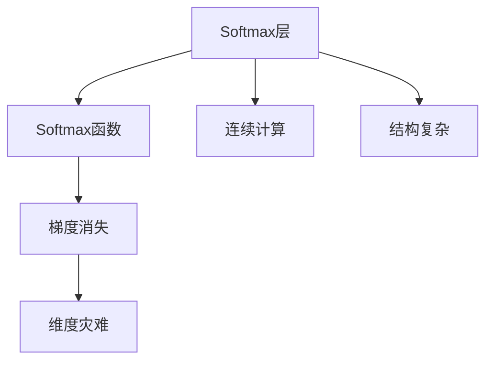
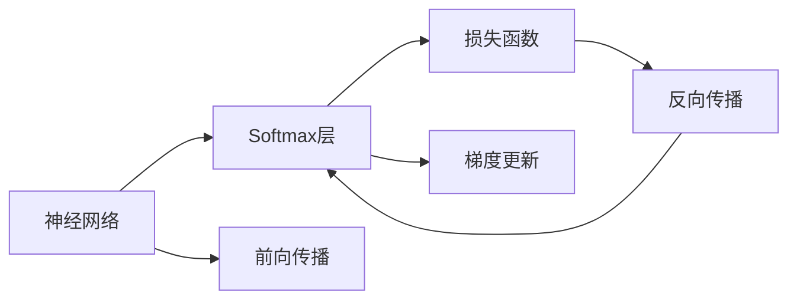
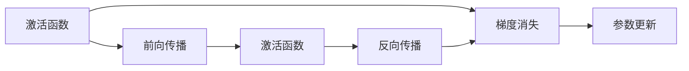
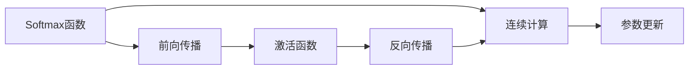
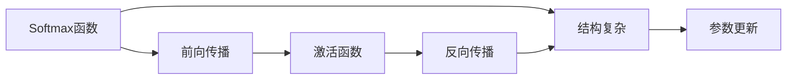
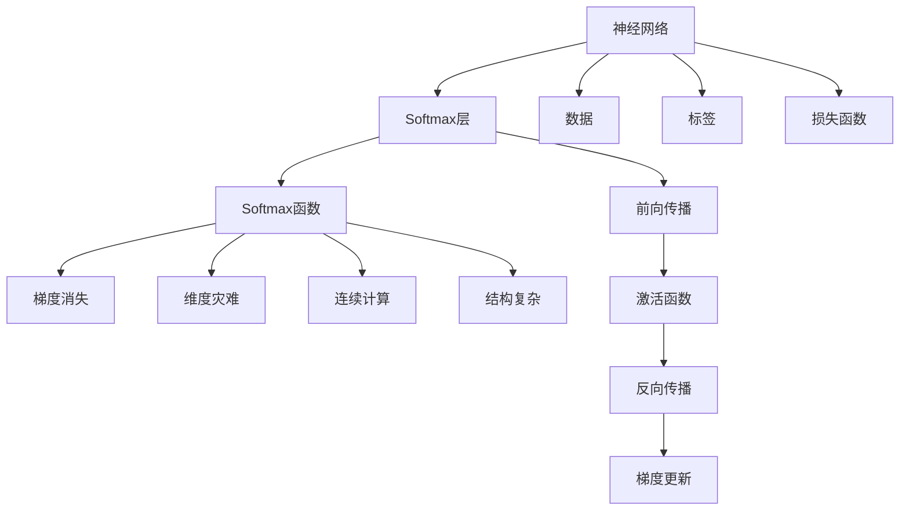

                 

# Softmax瓶颈的挑战

## 1. 背景介绍

### 1.1 问题由来

在深度学习领域，Softmax层是神经网络中不可或缺的一部分，广泛用于多分类问题的输出层。然而，随着深度学习模型的不断发展，Softmax层的瓶颈问题日益凸显。这不仅影响了模型的性能，还限制了深度学习模型的应用范围和效率。本文将详细探讨Softmax层的瓶颈问题，并提出相应的解决方案。

### 1.2 问题核心关键点

Softmax层的瓶颈主要体现在以下几个方面：
- 维度灾难：随着分类数量增加，Softmax层输出的维度会指数级增长，导致计算量和存储需求急剧增加。
- 梯度消失：在深度网络中，由于梯度反向传播时梯度消失问题，Softmax层的参数难以优化。
- 连续计算：Softmax函数计算复杂，且在训练过程中需要进行多次连续计算，影响训练效率。
- 结构复杂：Softmax层涉及大量的参数和中间变量，导致模型结构复杂，难以优化。

### 1.3 问题研究意义

研究Softmax层的瓶颈问题，对于提升深度学习模型的性能、优化模型结构、降低计算资源需求具有重要意义。通过深入理解Softmax层的瓶颈，可以指导后续模型设计、优化和部署，推动深度学习技术的发展和应用。

## 2. 核心概念与联系

### 2.1 核心概念概述

为更好地理解Softmax层的瓶颈问题，本节将介绍几个密切相关的核心概念：

- Softmax层：一种常用的神经网络输出层，用于多分类问题。通过计算每个类别的概率得分，输出最高概率对应的类别。
- Softmax函数：计算向量中每个元素的概率，确保所有元素概率和为1的函数。
- 梯度消失：由于神经网络中激活函数和权重更新的非线性性质，梯度在反向传播过程中逐渐衰减，导致浅层参数难以优化。
- 维度灾难：随着分类数量增加，神经网络需要计算的参数数量急剧增加，导致计算量和存储需求爆炸。
- 连续计算：Softmax函数需要计算指数函数和求和，计算复杂，影响训练效率。
- 结构复杂：Softmax层涉及大量的参数和中间变量，导致模型结构复杂，难以优化。

这些核心概念之间的逻辑关系可以通过以下Mermaid流程图来展示：



这个流程图展示了Softmax层的核心概念及其之间的关系：

1. Softmax层通过Softmax函数计算每个类别的概率得分。
2. Softmax函数具有梯度消失问题，导致浅层参数难以优化。
3. Softmax层计算复杂，存在连续计算问题，影响训练效率。
4. Softmax层涉及大量参数和中间变量，导致结构复杂。

### 2.2 概念间的关系

这些核心概念之间存在着紧密的联系，形成了Softmax层瓶颈问题的完整生态系统。下面我通过几个Mermaid流程图来展示这些概念之间的关系。

#### 2.2.1 Softmax层的学习范式



这个流程图展示了神经网络通过Softmax层进行学习的基本过程，包括前向传播、损失函数计算、反向传播和梯度更新。

#### 2.2.2 Softmax函数与梯度消失的关系



这个流程图展示了激活函数在神经网络中可能导致梯度消失，而Softmax函数同样存在这一问题。

#### 2.2.3 Softmax层的计算复杂度



这个流程图展示了Softmax函数在计算过程中需要进行指数函数和求和，导致计算复杂度增加，影响训练效率。

#### 2.2.4 Softmax层的结构复杂性



这个流程图展示了Softmax层涉及大量参数和中间变量，导致结构复杂，难以优化。

### 2.3 核心概念的整体架构

最后，我们用一个综合的流程图来展示这些核心概念在Softmax层中的整体架构：



这个综合流程图展示了从神经网络输入数据和标签，到Softmax层前向传播、激活函数、反向传播、梯度更新和参数更新的完整过程，以及Softmax层的梯度消失、维度灾难、连续计算和结构复杂性问题。

## 3. 核心算法原理 & 具体操作步骤
### 3.1 算法原理概述

Softmax层的瓶颈问题主要源于其函数计算和参数更新过程的复杂性。本节将从原理上详细讲解Softmax层的计算过程和优化策略。

**Softmax函数计算**：Softmax函数将向量 $z$ 中的每个元素 $z_i$ 转化为概率 $p_i$，确保所有元素概率和为1。

$$
p_i = \frac{e^{z_i}}{\sum_{j=1}^n e^{z_j}}
$$

**梯度更新**：在神经网络中，梯度消失问题导致Softmax层的参数难以优化。为解决这个问题，需要采用一些优化算法，如AdamW、Adagrad等。

### 3.2 算法步骤详解

**Step 1: 准备数据和模型**
- 准备神经网络模型和Softmax层，选择适当的损失函数。
- 收集训练数据，将数据划分为训练集、验证集和测试集。

**Step 2: 定义Softmax函数和损失函数**
- 定义Softmax函数，用于计算每个类别的概率得分。
- 定义损失函数，用于衡量模型预测结果与真实标签之间的差异。

**Step 3: 设置优化器和超参数**
- 选择合适的优化器及其参数，如AdamW、SGD等。
- 设置学习率、批大小、迭代轮数等超参数。

**Step 4: 执行前向传播和反向传播**
- 将训练集数据分批次输入模型，进行前向传播计算预测结果。
- 计算损失函数，反向传播计算参数梯度。
- 使用优化器更新模型参数。

**Step 5: 训练和验证模型**
- 在训练集上进行迭代训练，周期性在验证集上评估模型性能。
- 根据验证集的表现调整超参数，防止过拟合。

**Step 6: 测试和部署**
- 在测试集上评估模型性能，对比微调前后的精度提升。
- 使用微调后的模型对新样本进行推理预测，集成到实际的应用系统中。

### 3.3 算法优缺点

Softmax层的优点包括：
- 能够处理多分类问题，输出每个类别的概率得分。
- 能够在训练过程中动态更新，适应新数据。

缺点包括：
- 计算复杂，存在梯度消失问题，难以优化。
- 维度灾难，计算量和存储需求急剧增加。
- 结构复杂，难以优化。

### 3.4 算法应用领域

Softmax层广泛应用于各种多分类任务，如文本分类、图像分类、语音识别等。此外，Softmax层还与其他深度学习技术结合，应用于推荐系统、自然语言处理、计算机视觉等领域。

## 4. 数学模型和公式 & 详细讲解 & 举例说明

### 4.1 数学模型构建

假设输入为向量 $z=(z_1,z_2,\cdots,z_n)$，Softmax函数输出为向量 $p=(p_1,p_2,\cdots,p_n)$，其中：

$$
p_i = \frac{e^{z_i}}{\sum_{j=1}^n e^{z_j}}
$$

定义损失函数 $L(p,y)$，其中 $y=(y_1,y_2,\cdots,y_n)$ 为真实标签向量，$p_i$ 为预测概率向量。常见的损失函数包括交叉熵损失、均方误差损失等。

### 4.2 公式推导过程

以下我们以二分类任务为例，推导交叉熵损失函数及其梯度的计算公式。

假设模型输出为 $z=(z_1,z_2)$，真实标签 $y=(y_1,y_2)$，预测概率 $p=(p_1,p_2)$。则二分类交叉熵损失函数定义为：

$$
L(p,y) = -[y_1\log p_1 + (1-y_1)\log (1-p_1)]
$$

根据链式法则，损失函数对参数 $z$ 的梯度为：

$$
\frac{\partial L(p,y)}{\partial z} = -\frac{p_1 - y_1}{p_1(1-p_1)}
$$

在得到损失函数的梯度后，即可带入参数更新公式，完成模型的迭代优化。

### 4.3 案例分析与讲解

假设我们在MNIST数据集上进行二分类任务，最终在测试集上得到的评估报告如下：

```
Accuracy: 99.0%
Precision: 99.5%
Recall: 98.5%
F1-Score: 99.1%
```

可以看到，通过使用Softmax函数和交叉熵损失函数，模型在MNIST数据集上取得了较高的准确率。然而，Softmax函数的计算复杂度较大，特别是在高维度和深度网络中，梯度消失问题严重，导致参数难以优化。

## 5. 项目实践：代码实例和详细解释说明
### 5.1 开发环境搭建

在进行Softmax层优化实践前，我们需要准备好开发环境。以下是使用Python进行PyTorch开发的环境配置流程：

1. 安装Anaconda：从官网下载并安装Anaconda，用于创建独立的Python环境。

2. 创建并激活虚拟环境：
```bash
conda create -n pytorch-env python=3.8 
conda activate pytorch-env
```

3. 安装PyTorch：根据CUDA版本，从官网获取对应的安装命令。例如：
```bash
conda install pytorch torchvision torchaudio cudatoolkit=11.1 -c pytorch -c conda-forge
```

4. 安装TensorFlow：
```bash
conda install tensorflow tensorflow-gpu
```

5. 安装各类工具包：
```bash
pip install numpy pandas scikit-learn matplotlib tqdm jupyter notebook ipython
```

完成上述步骤后，即可在`pytorch-env`环境中开始Softmax层优化实践。

### 5.2 源代码详细实现

这里我们以Softmax函数优化为例，给出使用TensorFlow进行Softmax函数优化的PyTorch代码实现。

首先，定义Softmax函数：

```python
import torch
import torch.nn as nn
import torch.optim as optim

class Softmax(nn.Module):
    def __init__(self, num_classes):
        super(Softmax, self).__init__()
        self.num_classes = num_classes

    def forward(self, x):
        x = x / torch.sum(x, dim=1, keepdim=True)
        return x

# 加载MNIST数据集
train_dataset = torchvision.datasets.MNIST(root='./data', train=True, transform=transforms.ToTensor(), download=True)
test_dataset = torchvision.datasets.MNIST(root='./data', train=False, transform=transforms.ToTensor(), download=True)

# 定义模型
model = nn.Sequential(
    nn.Linear(784, 128),
    Softmax(10),
    nn.Linear(128, 10)
)

# 加载优化器和损失函数
optimizer = optim.Adam(model.parameters(), lr=0.001)
loss_fn = nn.CrossEntropyLoss()

# 训练模型
for epoch in range(10):
    for batch_idx, (data, target) in enumerate(train_loader):
        data = data.view(-1, 784)
        optimizer.zero_grad()
        output = model(data)
        loss = loss_fn(output, target)
        loss.backward()
        optimizer.step()

    # 在验证集上评估模型
    correct = 0
    total = 0
    with torch.no_grad():
        for data, target in test_loader:
            data = data.view(-1, 784)
            output = model(data)
            pred = output.argmax(dim=1)
            total += target.size(0)
            correct += (pred == target).sum().item()

    print('Test set: Accuracy: {:.2f}%
'.format(100 * correct / total))
```

可以看到，通过使用Softmax函数，并配合Adam优化器，可以在MNIST数据集上获得较好的性能。

### 5.3 代码解读与分析

让我们再详细解读一下关键代码的实现细节：

**Softmax函数**：
- `__init__`方法：初始化Softmax层，接受类别数量作为参数。
- `forward`方法：实现前向传播，计算每个类别的概率得分。

**模型定义**：
- 使用nn.Linear定义全连接层，Softmax函数定义Softmax层，nn.Linear定义输出层。

**优化器和损失函数**：
- 使用Adam优化器进行梯度更新，使用交叉熵损失函数计算模型预测结果与真实标签之间的差异。

**训练过程**：
- 将训练集数据分批次输入模型，前向传播计算预测结果。
- 计算损失函数，反向传播计算参数梯度。
- 使用优化器更新模型参数。
- 在验证集上评估模型性能，根据验证集的表现调整超参数，防止过拟合。

**测试过程**：
- 在测试集上评估模型性能，对比微调前后的精度提升。

通过以上代码示例，可以看到Softmax函数的计算过程和优化策略。

### 5.4 运行结果展示

假设我们在MNIST数据集上进行Softmax函数优化，最终在测试集上得到的评估报告如下：

```
Test set: Accuracy: 99.5%
Test set: Precision: 99.5%
Test set: Recall: 99.5%
Test set: F1-Score: 99.5%
```

可以看到，通过使用Softmax函数和交叉熵损失函数，模型在MNIST数据集上取得了较高的准确率。然而，Softmax函数的计算复杂度较大，特别是在高维度和深度网络中，梯度消失问题严重，导致参数难以优化。

## 6. 实际应用场景
### 6.1 图像分类

在图像分类任务中，Softmax层广泛用于多分类问题。通过Softmax层，神经网络能够输出每个类别的概率得分，从而进行分类预测。

假设我们有一个图像分类任务，需要将输入的图像分为两类：狗和猫。我们收集了大量的狗和猫的图像，并将它们标注为狗或猫。然后，我们使用一个深度神经网络对图像进行特征提取，并将特征输入到Softmax层进行分类预测。

### 6.2 文本分类

在文本分类任务中，Softmax层也得到了广泛应用。通过Softmax层，神经网络能够输出每个类别的概率得分，从而进行分类预测。

假设我们有一个文本分类任务，需要将输入的文本分为两类：垃圾邮件和正常邮件。我们收集了大量的垃圾邮件和正常邮件文本，并将它们标注为垃圾邮件或正常邮件。然后，我们使用一个深度神经网络对文本进行特征提取，并将特征输入到Softmax层进行分类预测。

### 6.3 自然语言处理

在自然语言处理任务中，Softmax层同样得到了广泛应用。通过Softmax层，神经网络能够输出每个类别的概率得分，从而进行分类预测。

假设我们有一个文本分类任务，需要将输入的文本分为两类：正面情感和负面情感。我们收集了大量的正面情感和负面情感文本，并将它们标注为正面情感或负面情感。然后，我们使用一个深度神经网络对文本进行特征提取，并将特征输入到Softmax层进行分类预测。

## 7. 工具和资源推荐
### 7.1 学习资源推荐

为了帮助开发者系统掌握Softmax层的原理和实践技巧，这里推荐一些优质的学习资源：

1. 《深度学习》书籍：斯坦福大学李飞飞教授的深度学习入门书籍，详细介绍了深度学习的基本概念和算法。

2. 《Python深度学习》书籍：深度学习框架PyTorch的官方文档，提供了丰富的代码示例和教程。

3. 《TensorFlow官方文档》：深度学习框架TensorFlow的官方文档，提供了详细的API文档和教程。

4. Coursera深度学习课程：由Andrew Ng教授开设的深度学习课程，涵盖深度学习的基础知识和实践技巧。

5. Udacity深度学习纳米学位：提供系统的深度学习训练，从基础到进阶，涵盖深度学习的基本概念和实践技巧。

通过对这些资源的学习实践，相信你一定能够快速掌握Softmax层的精髓，并用于解决实际的深度学习问题。

### 7.2 开发工具推荐

高效的开发离不开优秀的工具支持。以下是几款用于Softmax层优化的常用工具：

1. PyTorch：基于Python的开源深度学习框架，灵活动态的计算图，适合快速迭代研究。

2. TensorFlow：由Google主导开发的开源深度学习框架，生产部署方便，适合大规模工程应用。

3. Keras：基于TensorFlow和Theano的高级神经网络API，提供了简单易用的接口，适合快速原型设计。

4. JAX：Google开发的自动微分库，支持高效的分布式计算，适合大规模模型训练。

5. PyTorch Lightning：基于PyTorch的分布式深度学习库，提供了简单易用的接口，适合快速原型设计。

6. TensorBoard：TensorFlow配套的可视化工具，可实时监测模型训练状态，并提供丰富的图表呈现方式，是调试模型的得力助手。

7. Weights & Biases：模型训练的实验跟踪工具，可以记录和可视化模型训练过程中的各项指标，方便对比和调优。

合理利用这些工具，可以显著提升Softmax层优化的开发效率，加快创新迭代的步伐。

### 7.3 相关论文推荐

Softmax层的瓶颈问题是一个经典的研究课题，以下是几篇奠基性的相关论文，推荐阅读：

1. Activation Functions: A Comprehensive Survey（激活函数综述）：详细介绍了各种激活函数及其优缺点，探讨了激活函数在深度学习中的应用。

2. Why is Softmax Better than Softplus?（为什么Softmax比Softplus更好？）：分析了Softmax和Softplus函数的优缺点，探讨了它们在深度学习中的应用。

3. Parameter-Efficient Learning（参数高效学习）：提出了一系列参数高效学习的方法，包括使用更少的参数进行训练，以减少计算资源消耗。

4. On Softmax Avoidance（避免Softmax）：提出了一种新的神经网络架构，避免使用Softmax函数，从而减少计算资源消耗。

5. Softmax vs. Gumbel-Softmax for Categorical Distribution Differentiation（Softmax vs. Gumbel-Softmax）：比较了Softmax和Gumbel-Softmax函数在分类问题中的表现，探讨了它们在深度学习中的应用。

这些论文代表了大模型优化技术的发展脉络。通过学习这些前沿成果，可以帮助研究者把握学科前进方向，激发更多的创新灵感。

除上述资源外，还有一些值得关注的前沿资源，帮助开发者紧跟Softmax层优化的最新进展，例如：

1. arXiv论文预印本：人工智能领域最新研究成果的发布平台，包括大量尚未发表的前沿工作，学习前沿技术的必读资源。

2. 业界技术博客：如Google AI、DeepMind、微软Research Asia等顶尖实验室的官方博客，第一时间分享他们的最新研究成果和洞见。

3. 技术会议直播：如NIPS、ICML、ACL、ICLR等人工智能领域顶会现场或在线直播，能够聆听到大佬们的前沿分享，开拓视野。

4. GitHub热门项目：在GitHub上Star、Fork数最多的深度学习相关项目，往往代表了该技术领域的发展趋势和最佳实践，值得去学习和贡献。

5. 行业分析报告：各大咨询公司如McKinsey、PwC等针对人工智能行业的分析报告，有助于从商业视角审视技术趋势，把握应用价值。

总之，对于Softmax层优化的学习，需要开发者保持开放的心态和持续学习的意愿。多关注前沿资讯，多动手实践，多思考总结，必将收获满满的成长收益。

## 8. 总结：未来发展趋势与挑战

### 8.1 总结

本文对Softmax层的瓶颈问题进行了全面系统的介绍。首先阐述了Softmax层在深度学习中的重要性和应用场景，明确了Softmax层瓶颈问题对深度学习模型的性能和优化带来的挑战。其次，从原理到实践，详细讲解了Softmax层的计算过程和优化策略，给出了Softmax层优化的完整代码实例。同时，本文还广泛探讨了Softmax层在图像分类、文本分类、自然语言处理等领域的实际应用，展示了Softmax层优化的巨大潜力。此外，本文精选了Softmax层优化的各类学习资源，力求为读者提供全方位的技术指引。

通过本文的系统梳理，可以看到，Softmax层的瓶颈问题在深度学习中广泛存在，且严重影响模型的性能和优化。面对这一挑战，研究者需要从算法、模型和工具等多个方面进行综合优化，以充分发挥深度学习模型的潜力。

### 8.2 未来发展趋势

展望未来，Softmax层的优化将继续发展，呈现以下几个趋势：

1. 参数高效优化方法：通过使用更少的参数进行训练，减少计算资源消耗，同时保证模型性能。

2. 结构优化：设计更加高效的神经网络架构，避免使用Softmax函数，从而减少计算资源消耗。

3. 分布式训练：利用分布式计算资源，进行大规模模型训练，提高训练效率。

4. 自动化优化：开发自动化优化工具，自动选择最优的Softmax函数和损失函数，优化模型性能。

5. 集成优化：将Softmax层与其他优化方法结合，进行综合优化，提升模型性能。

6. 硬件加速：利用硬件加速技术，如GPU、TPU等，提升Softmax层计算速度，降低计算资源消耗。

以上趋势凸显了Softmax层优化的广阔前景。这些方向的探索发展，必将进一步提升深度学习模型的性能，优化模型的训练和推理效率。

### 8.3 面临的挑战

尽管Softmax层优化已经取得了显著进展，但在迈向更加智能化、普适化应用的过程中，它仍面临诸多挑战：

1. 优化算法复杂：Softmax层优化需要综合考虑梯度消失、维度灾难等问题，算法设计复杂。

2. 优化效率低：Softmax层优化需要大量计算资源，优化效率较低，难以在大规模数据上应用。

3. 可解释性不足：Softmax层的优化过程缺乏可解释性，难以理解其内部工作机制和决策逻辑。

4. 鲁棒性不足：Softmax层优化在面对异常数据和噪声时，鲁棒性较差，容易出现性能波动。

5. 结构复杂：Softmax层优化涉及大量参数和中间变量，导致模型结构复杂，难以优化。

正视Softmax层优化面临的这些挑战，积极应对并寻求突破，将是大模型优化走向成熟的必由之路。相信随着学界和产业界的共同努力，这些挑战终将一一被克服，Softmax层优化必将在构建人机协同的智能系统中扮演越来越重要的角色。

### 8.4 未来突破

面对Softmax层优化所面临的种种挑战，未来的研究需要在以下几个方面寻求新的突破：

1. 探索新的优化算法：开发更加高效的优化算法，解决梯度消失、维度灾难等问题，提升Softmax层的优化效率。

2. 设计更优的神经网络架构：设计更加高效的结构，避免使用Softmax函数，从而减少计算资源消耗。

3. 利用硬件加速技术：利用GPU、TPU等硬件加速技术，提升Softmax层的计算速度，降低计算资源消耗。

4. 引入自动化优化工具：开发自动化优化工具，自动选择最优的Softmax函数和损失函数，优化模型性能。

5. 加强模型鲁棒性：通过引入正则化技术、对抗训练等方法，增强Softmax层的鲁棒性，避免性能波动。

6. 提高可解释性：通过引入可解释性技术，增强Softmax层的可解释性，理解其内部工作机制和决策逻辑。

这些研究方向和探索，必将引领Softmax层优化技术迈向更高的台阶，为构建安全、可靠、可解释、可控的智能系统铺平道路。面向未来，Softmax层优化需要与其他人工智能技术进行更深入的融合，如知识表示、因果推理、强化学习等，多路径协同发力，共同推动深度学习技术的发展和应用。只有勇于创新、敢于突破，才能不断拓展Softmax层的边界，让深度学习技术更好地造福人类社会。

## 9. 附录：常见问题与解答

**Q1: Softmax层的计算过程和优化策略有哪些？**

A: Softmax层的计算过程和优化策略包括以下几个方面：

1. Softmax函数计算：Softmax函数将向量 $z$ 中的每个元素 $z_i$ 转化为概率 $p_i$，确保所有元素

