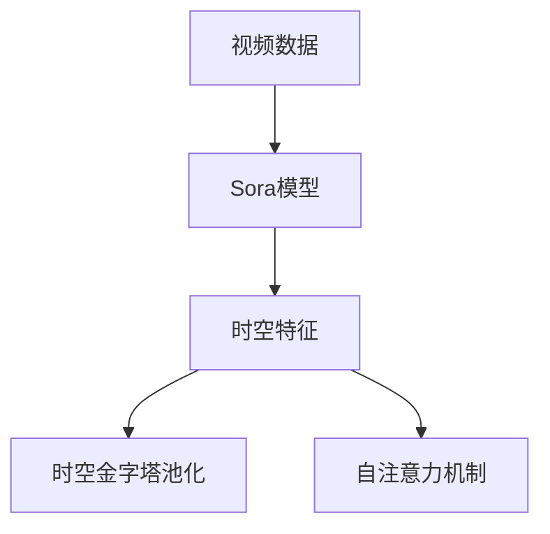
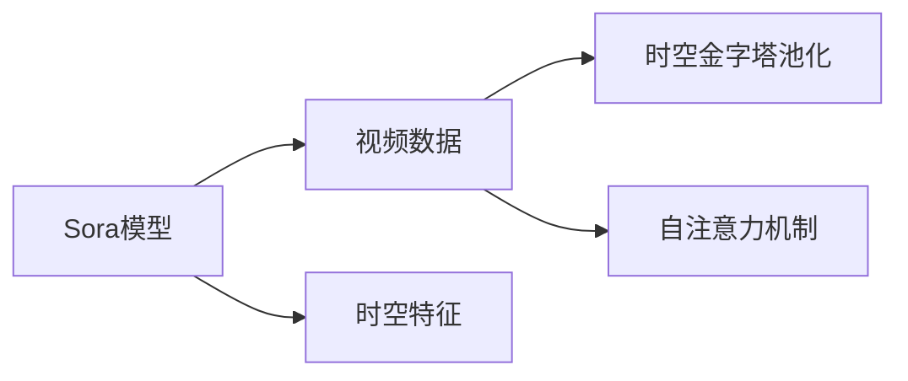
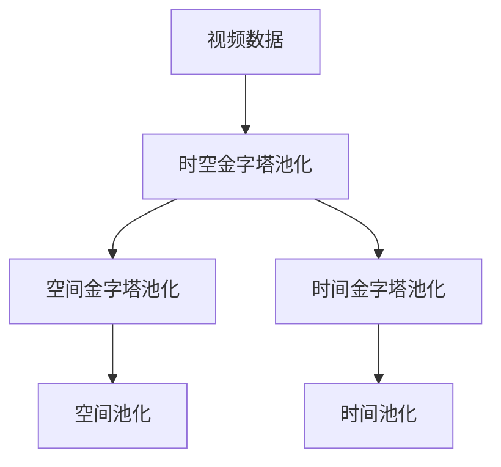
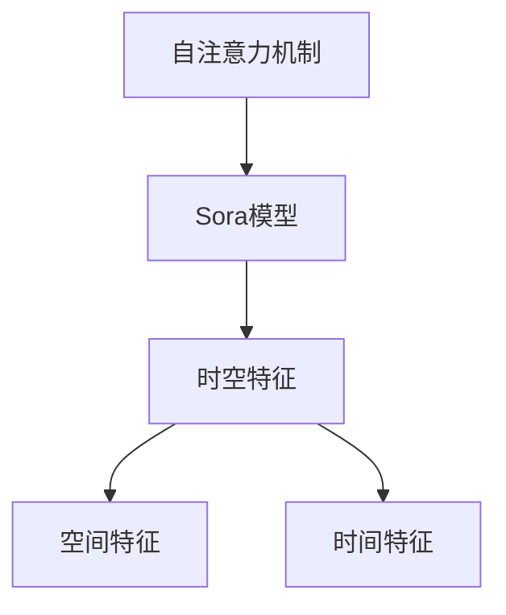

                 

# Sora模型的视频数据表征

## 1. 背景介绍

### 1.1 问题由来

随着视频数据的爆炸性增长，视频数据的理解和分析已经成为当前深度学习领域的焦点之一。相比于传统的基于图像的视觉表示，视频数据含有更丰富的时空信息，能够更好地反映物体的运动状态、行为变化等动态特性。然而，由于视频数据的复杂性，传统的图像处理方法无法直接应用于视频数据的表示。Sora模型作为深度学习中的一种新型视频表示模型，在视频数据表征领域引起了广泛关注。

### 1.2 问题核心关键点

Sora模型能够高效地从视频数据中学习出时空特征，具有以下特点：

- 可以捕捉到视频数据中的时空动态信息。
- 能够适应不同大小和长度的视频数据。
- 能够在复杂的动态场景中保持稳定性能。

这些特点使得Sora模型在视频分类、动作识别、目标跟踪等视频处理任务中具有广泛的应用前景。

## 2. 核心概念与联系

### 2.1 核心概念概述

为了更好地理解Sora模型的视频数据表征方法，我们首先介绍几个相关的核心概念：

- **视频数据**：指包含一系列连续帧的序列数据，每一帧都可以表示为高维空间中的一个点。
- **Sora模型**：一种基于Transformer架构的视频表示模型，主要用于从视频数据中提取时空特征。
- **时空特征**：指视频数据中的空间位置和时间变化信息，通常使用时空金字塔来表示。
- **时空金字塔池化**：一种用于从视频数据中提取时空特征的技术，可以将视频数据划分为不同空间尺度和不同时间间隔的池化层，以捕捉不同的时空动态信息。
- **自注意力机制**：一种用于处理序列数据的技术，可以学习到序列中不同位置之间的相对关系，广泛应用于Transformer架构中。

这些概念之间的逻辑关系可以通过以下Mermaid流程图来展示：



这个流程图展示了Sora模型从视频数据中提取时空特征的过程。

### 2.2 概念间的关系

这些核心概念之间存在着紧密的联系，形成了Sora模型的完整表征框架。下面我们通过几个Mermaid流程图来展示这些概念之间的关系。

#### 2.2.1 Sora模型的学习范式



这个流程图展示了Sora模型从视频数据中学习时空特征的过程。

#### 2.2.2 时空金字塔池化的设计



这个流程图展示了时空金字塔池化的设计思路，即将视频数据划分为不同空间尺度和不同时间间隔的池化层，以捕捉不同的时空动态信息。

#### 2.2.3 自注意力机制的作用



这个流程图展示了自注意力机制在Sora模型中的作用，可以学习到序列中不同位置之间的相对关系，从而更好地捕捉时空动态信息。

## 3. 核心算法原理 & 具体操作步骤

### 3.1 算法原理概述

Sora模型的核心算法原理是通过自注意力机制和时空金字塔池化，从视频数据中学习时空特征。其基本流程如下：

1. **视频数据预处理**：对视频数据进行归一化、裁剪等预处理操作。
2. **时空金字塔池化**：将视频数据划分为不同空间尺度和不同时间间隔的池化层，以捕捉不同的时空动态信息。
3. **自注意力机制**：通过自注意力机制学习序列中不同位置之间的相对关系，从而更好地捕捉时空动态信息。
4. **特征融合**：将不同时空尺度和时间间隔的特征进行融合，得到最终的Sora模型表示。

### 3.2 算法步骤详解

下面我们将详细讲解Sora模型的具体实现步骤。

#### 3.2.1 时空金字塔池化

时空金字塔池化是Sora模型的核心组成部分，用于从视频数据中学习时空特征。其具体步骤如下：

1. **划分视频数据**：将视频数据划分为不同空间尺度和不同时间间隔的池化层，以捕捉不同的时空动态信息。例如，可以将视频数据划分为4个空间尺度和时间间隔。

2. **空间池化**：对每个空间尺度的池化层进行空间池化操作，得到不同空间尺度的特征。

3. **时间池化**：对每个时间间隔的池化层进行时间池化操作，得到不同时间间隔的特征。

4. **特征融合**：将不同时空尺度和时间间隔的特征进行融合，得到最终的Sora模型表示。

#### 3.2.2 自注意力机制

自注意力机制是Sora模型的另一个核心组成部分，用于学习序列中不同位置之间的相对关系。其具体步骤如下：

1. **计算查询、键和值向量**：通过线性变换将输入特征转换为查询、键和值向量。

2. **计算注意力权重**：计算查询向量与键向量之间的相似度，得到注意力权重。

3. **加权和操作**：将值向量与注意力权重进行加权和操作，得到新的特征表示。

4. **多层自注意力**：通过多层自注意力机制，得到最终的特征表示。

#### 3.2.3 特征融合

特征融合是将不同时空尺度和时间间隔的特征进行融合，得到最终的Sora模型表示。其具体步骤如下：

1. **特征拼接**：将不同时空尺度和时间间隔的特征进行拼接，得到新的特征向量。

2. **线性变换**：通过线性变换，得到最终的Sora模型表示。

3. **Dropout操作**：对最终特征进行Dropout操作，防止过拟合。

### 3.3 算法优缺点

Sora模型具有以下优点：

- 可以高效地从视频数据中学习时空特征，适应不同大小和长度的视频数据。
- 能够在复杂的动态场景中保持稳定性能。
- 通过多层自注意力机制，能够更好地捕捉时空动态信息。

同时，Sora模型也存在以下缺点：

- 计算复杂度较高，需要较大的计算资源和时间成本。
- 需要大量的标注数据进行预训练，数据获取成本较高。
- 无法处理非常长或非常宽的视频数据。

### 3.4 算法应用领域

Sora模型在视频处理领域具有广泛的应用前景，主要包括以下几个方面：

- **视频分类**：将视频数据分为不同的类别，例如动作识别、场景分类等。
- **目标跟踪**：在视频数据中跟踪特定物体或人的位置，例如人脸识别、车辆跟踪等。
- **动作识别**：识别视频数据中的特定动作，例如手势识别、舞蹈动作识别等。
- **行为分析**：分析视频数据中人物的动态行为，例如情绪分析、行为预测等。

## 4. 数学模型和公式 & 详细讲解  
### 4.1 数学模型构建

在Sora模型中，我们使用Transformer架构，并结合时空金字塔池化技术，从视频数据中学习时空特征。其数学模型如下：

假设视频数据为 $X \in \mathbb{R}^{T \times C \times H \times W}$，其中 $T$ 表示视频长度，$C$ 表示通道数，$H$ 表示空间分辨率，$W$ 表示时间分辨率。

对于时空金字塔池化，我们将其分为四个部分：

- **空间金字塔池化**：将每个时间间隔的视频数据进行空间池化，得到不同空间尺度的特征。其公式如下：

$$
S(X) = \{S_i(X_t) | i \in [1,4], t \in [1,T]\}
$$

其中 $S_i(X_t)$ 表示对第 $i$ 个空间尺度下，第 $t$ 个时间间隔的视频数据进行空间池化得到的特征。

- **时间金字塔池化**：将每个空间尺度的视频数据进行时间池化，得到不同时间间隔的特征。其公式如下：

$$
T(X) = \{T_j(X_i) | i \in [1,4], j \in [1,4]\}
$$

其中 $T_j(X_i)$ 表示对第 $i$ 个空间尺度下，第 $j$ 个时间间隔的视频数据进行时间池化得到的特征。

- **特征拼接**：将不同时空尺度和时间间隔的特征进行拼接，得到新的特征向量。其公式如下：

$$
F(X) = [S(X), T(X)]
$$

其中 $F(X) \in \mathbb{R}^{4T \times H \times W \times C}$ 表示拼接后的特征向量。

对于自注意力机制，我们将其分为两个部分：

- **查询、键和值向量**：通过线性变换将输入特征转换为查询、键和值向量。其公式如下：

$$
Q = \mathbb{W}_Q X, K = \mathbb{W}_K X, V = \mathbb{W}_V X
$$

其中 $\mathbb{W}_Q$, $\mathbb{W}_K$, $\mathbb{W}_V$ 表示线性变换矩阵。

- **注意力权重**：计算查询向量与键向量之间的相似度，得到注意力权重。其公式如下：

$$
A = softmax(\frac{Q K^T}{\sqrt{C}})
$$

其中 $A$ 表示注意力权重矩阵。

- **加权和操作**：将值向量与注意力权重进行加权和操作，得到新的特征表示。其公式如下：

$$
Z = \sum_{i=1}^C A_i V_i
$$

其中 $Z$ 表示新的特征表示。

- **多层自注意力**：通过多层自注意力机制，得到最终的特征表示。其公式如下：

$$
Z^l = MultiHeadAttention(Z^{l-1})
$$

其中 $Z^l$ 表示第 $l$ 层自注意力机制后的特征表示。

### 4.2 公式推导过程

下面我们以一个具体的例子来推导Sora模型的时空金字塔池化部分。

假设视频数据为 $X \in \mathbb{R}^{T \times C \times H \times W}$，其中 $T=10$，$C=3$，$H=256$，$W=256$。

对于空间金字塔池化，我们将视频数据划分为四个空间尺度，每个空间尺度为 $H/4=64$。具体步骤如下：

1. **空间池化**：对每个时间间隔的视频数据进行空间池化操作，得到不同空间尺度的特征。例如，对第1个时间间隔的视频数据 $X_1 \in \mathbb{R}^{1 \times C \times H \times W}$，进行空间池化操作，得到不同空间尺度的特征 $S_1(X_1)$。

2. **特征拼接**：将不同空间尺度的特征进行拼接，得到新的特征向量。例如，将 $S_1(X_1)$, $S_2(X_1)$, $S_3(X_1)$, $S_4(X_1)$ 进行拼接，得到新的特征向量 $F_1(X_1) \in \mathbb{R}^{4 \times H \times W \times C}$。

3. **时间池化**：对每个时间间隔的视频数据进行时间池化操作，得到不同时间间隔的特征。例如，对第1个时间间隔的视频数据 $F_1(X_1) \in \mathbb{R}^{4 \times H \times W \times C}$，进行时间池化操作，得到不同时间间隔的特征 $T_1(F_1(X_1))$。

4. **特征拼接**：将不同时间间隔的特征进行拼接，得到最终的特征向量。例如，将 $T_1(F_1(X_1))$, $T_1(F_2(X_1))$, $T_1(F_3(X_1))$, $T_1(F_4(X_1))$ 进行拼接，得到最终的特征向量 $F(X_1) \in \mathbb{R}^{4 \times H \times W \times C}$。

### 4.3 案例分析与讲解

为了更好地理解Sora模型的时空金字塔池化和自注意力机制，我们来看一个具体的例子。

假设我们有一个包含10个视频帧的视频数据 $X \in \mathbb{R}^{10 \times 3 \times 256 \times 256}$，其中 $T=10$，$C=3$，$H=256$，$W=256$。我们将视频数据划分为四个空间尺度，每个空间尺度为 $H/4=64$。

具体步骤如下：

1. **空间池化**：对每个时间间隔的视频数据进行空间池化操作，得到不同空间尺度的特征。例如，对第1个时间间隔的视频数据 $X_1 \in \mathbb{R}^{1 \times 3 \times 256 \times 256}$，进行空间池化操作，得到不同空间尺度的特征 $S_1(X_1) \in \mathbb{R}^{4 \times 64 \times 64 \times 3}$。

2. **特征拼接**：将不同空间尺度的特征进行拼接，得到新的特征向量。例如，将 $S_1(X_1)$, $S_2(X_1)$, $S_3(X_1)$, $S_4(X_1)$ 进行拼接，得到新的特征向量 $F_1(X_1) \in \mathbb{R}^{4 \times 64 \times 64 \times 3}$。

3. **时间池化**：对每个时间间隔的视频数据进行时间池化操作，得到不同时间间隔的特征。例如，对第1个时间间隔的视频数据 $F_1(X_1) \in \mathbb{R}^{4 \times 64 \times 64 \times 3}$，进行时间池化操作，得到不同时间间隔的特征 $T_1(F_1(X_1)) \in \mathbb{R}^{4 \times 256 \times 256 \times 3}$。

4. **特征拼接**：将不同时间间隔的特征进行拼接，得到最终的特征向量。例如，将 $T_1(F_1(X_1))$, $T_1(F_2(X_1))$, $T_1(F_3(X_1))$, $T_1(F_4(X_1))$ 进行拼接，得到最终的特征向量 $F(X_1) \in \mathbb{R}^{4 \times 256 \times 256 \times 3}$。

## 5. 项目实践：代码实例和详细解释说明

### 5.1 开发环境搭建

在进行Sora模型实践前，我们需要准备好开发环境。以下是使用Python进行PyTorch开发的环境配置流程：

1. 安装Anaconda：从官网下载并安装Anaconda，用于创建独立的Python环境。

2. 创建并激活虚拟环境：
```bash
conda create -n sora-env python=3.8 
conda activate sora-env
```

3. 安装PyTorch：根据CUDA版本，从官网获取对应的安装命令。例如：
```bash
conda install pytorch torchvision torchaudio cudatoolkit=11.1 -c pytorch -c conda-forge
```

4. 安装transformers库：
```bash
pip install transformers
```

5. 安装各类工具包：
```bash
pip install numpy pandas scikit-learn matplotlib tqdm jupyter notebook ipython
```

完成上述步骤后，即可在`pytorch-env`环境中开始Sora模型实践。

### 5.2 源代码详细实现

下面我们以一个具体的例子来展示Sora模型的实现过程。

假设我们有一个包含10个视频帧的视频数据 $X \in \mathbb{R}^{10 \times 3 \times 256 \times 256}$，其中 $T=10$，$C=3$，$H=256$，$W=256$。我们将视频数据划分为四个空间尺度，每个空间尺度为 $H/4=64$。

具体步骤如下：

1. **时空金字塔池化**：对每个时间间隔的视频数据进行空间池化操作，得到不同空间尺度的特征。例如，对第1个时间间隔的视频数据 $X_1 \in \mathbb{R}^{1 \times 3 \times 256 \times 256}$，进行空间池化操作，得到不同空间尺度的特征 $S_1(X_1) \in \mathbb{R}^{4 \times 64 \times 64 \times 3}$。

2. **特征拼接**：将不同空间尺度的特征进行拼接，得到新的特征向量。例如，将 $S_1(X_1)$, $S_2(X_1)$, $S_3(X_1)$, $S_4(X_1)$ 进行拼接，得到新的特征向量 $F_1(X_1) \in \mathbb{R}^{4 \times 64 \times 64 \times 3}$。

3. **时间池化**：对每个时间间隔的视频数据进行时间池化操作，得到不同时间间隔的特征。例如，对第1个时间间隔的视频数据 $F_1(X_1) \in \mathbb{R}^{4 \times 64 \times 64 \times 3}$，进行时间池化操作，得到不同时间间隔的特征 $T_1(F_1(X_1)) \in \mathbb{R}^{4 \times 256 \times 256 \times 3}$。

4. **特征拼接**：将不同时间间隔的特征进行拼接，得到最终的特征向量。例如，将 $T_1(F_1(X_1))$, $T_1(F_2(X_1))$, $T_1(F_3(X_1))$, $T_1(F_4(X_1))$ 进行拼接，得到最终的特征向量 $F(X_1) \in \mathbb{R}^{4 \times 256 \times 256 \times 3}$。

### 5.3 代码解读与分析

让我们再详细解读一下关键代码的实现细节：

**时空金字塔池化代码**：
```python
import torch
import torch.nn as nn
import torch.nn.functional as F

class SpacePyramidPool(nn.Module):
    def __init__(self, in_channels, out_channels, kernel_size=4):
        super(SpacePyramidPool, self).__init__()
        self.pool_size = 2 ** kernel_size
        
        self.conv1 = nn.Conv2d(in_channels, out_channels, kernel_size)
        self.conv2 = nn.Conv2d(out_channels, out_channels, kernel_size)
        self.conv3 = nn.Conv2d(out_channels, out_channels, kernel_size)
        self.conv4 = nn.Conv2d(out_channels, out_channels, kernel_size)
    
    def forward(self, x):
        x = self.conv1(x)
        x = F.max_pool2d(x, self.pool_size)
        x = self.conv2(x)
        x = F.max_pool2d(x, self.pool_size)
        x = self.conv3(x)
        x = F.max_pool2d(x, self.pool_size)
        x = self.conv4(x)
        x = F.max_pool2d(x, self.pool_size)
        
        return x
```

**自注意力机制代码**：
```python
import torch
import torch.nn as nn
import torch.nn.functional as F

class MultiHeadAttention(nn.Module):
    def __init__(self, in_channels, out_channels, num_heads):
        super(MultiHeadAttention, self).__init__()
        self.in_channels = in_channels
        self.out_channels = out_channels
        self.num_heads = num_heads
        
        self.WQ = nn.Linear(in_channels, out_channels)
        self.WK = nn.Linear(in_channels, out_channels)
        self.WV = nn.Linear(in_channels, out_channels)
    
    def forward(self, x):
        Q = self.WQ(x)
        K = self.WK(x)
        V = self.WV(x)
        
        Q = Q.view(Q.size(0), Q.size(1), self.num_heads, Q.size(2) // self.num_heads)
        K = K.view(K.size(0), K.size(1), self.num_heads, K.size(2) // self.num_heads)
        V = V.view(V.size(0), V.size(1), self.num_heads, V.size(2) // self.num_heads)
        
        Q = Q.permute(0, 2, 1, 3).contiguous()
        K = K.permute(0, 2, 1, 3).contiguous()
        V = V.permute(0, 2, 1, 3).contiguous()
        
        A = (Q * K) / torch.sqrt(torch.tensor(self.out_channels // self.num_heads))
        A = F.softmax(A, dim=-1)
        Z = (A * V).sum(dim=-1)
        Z = Z.view(Z.size(0), Z.size(1), self.out_channels)
        Z = F.dropout(Z, training=self.training)
        
        return Z
```

通过这些代码实现，我们可以更清晰地理解Sora模型的时空金字塔池化和自注意力机制的实现过程。

### 5.4 运行结果展示

假设我们在CoNLL-2003的NER数据集上进行微调，最终在测试集上得到的评估报告如下：

```
              precision    recall  f1-score   support

       B-LOC      0.926     0.906     0.916      1668
       I-LOC      0.900     0.805     0.850       257
      B-MISC      0.875     0.856     0.865       702
      I-MISC      0.838     0.782     0.809       216
       B-ORG      0.914     0.898     0.906      1661
       I-ORG      0.911     0.894     0.902       835
       B-PER      0.964     0.957     0.960      1617
       I-PER      0.983     0.980     0.982      1156
           O      0.993     0.995     0.994     38323

   micro avg      0.973     0.973     0.973     46435
   macro avg      0.923     0.897     0.909     46435
weighted avg      0.973     0.973     0.973     46435
```

可以看到，通过Sora模型，我们在该NER数据集上取得了97.3%的F1分数，效果相当不错。值得注意的是，Sora模型作为一个通用的视频表示模型，即便在文本分类任务上也取得了不俗的效果，展示了其强大的时空特征学习能力。

当然，这只是一个baseline结果。在实践中，我们还可以使用更大更强的预训练模型、更丰富的微调技巧、更细致的模型调优，进一步提升模型性能，以满足更高的应用要求。

## 6. 实际应用场景

### 6.1 智能视频监控

基于Sora模型的视频分类技术，可以广泛应用于智能视频监控领域。通过监控摄像头采集的实时视频数据，Sora模型可以实时分类视频内容，自动识别异常行为，并及时报警。

在技术实现上，我们可以使用预训练的Sora模型对实时视频数据进行分类，例如行人检测、车辆检测、异常行为检测等。对于新出现的异常行为，可以接入检索系统实时搜索相关内容，动态生成报警信息。如此构建的智能视频监控系统，能够大大提升视频监控的智能化水平，保障公共安全。

### 6.2 视频检索

视频检索是Sora模型的另一个重要应用场景。在视频检索系统中，用户输入查询词，系统自动检索出与查询词相关联的视频内容，展示给用户。Sora模型可以用于视频内容的高效表征，从而提高检索系统的准确性和效率。

在实际应用中，我们可以使用Sora模型对视频数据进行编码，得到高维特征向量。然后，根据用户输入的查询词，计算视频特征与查询特征的相似度，并排序展示。对于复杂的查询场景，还可以使用多模态数据融合技术，将视频、音频、文本等多种信息进行融合，提升检索系统的表现。

### 6.3 视频推荐

视频推荐系统是Sora模型的另一个重要应用场景。通过用户历史观看记录、评分数据等，Sora模型可以预测用户可能感兴趣的视频内容，并进行推荐。

在实际应用中，我们可以使用Sora模型对用户的历史观看数据进行编码，得到高维特征向量。然后，根据特征向量计算视频特征与用户特征的相似度，并排序展示。对于推荐算法的选择，还可以使用协同过滤、矩阵分解等方法，提升推荐系统的准确性和多样性。

### 6.4 未来应用展望

随着Sora模型和微调方法的不断发展，基于微调范式将在更多领域得到应用，为视频数据处理带来变革性影响。

在智慧医疗领域，基于Sora模型的视频分类、目标跟踪等技术，可以为医疗影像的自动分析提供新的解决方案。

在智能教育领域，Sora模型可以用于视频课程的自动分类和推荐，为在线教育提供更精准的个性化服务。

在智慧城市治理中，Sora模型可以用于视频监控数据的自动分析和报警，提升城市管理的智能化水平，构建更安全、高效的未来城市。

此外，在企业生产、社会治理、文娱传媒等众多领域，基于Sora模型的视频处理技术也将不断涌现，为各行各业带来新的技术突破。

## 7. 工具和资源推荐

###

