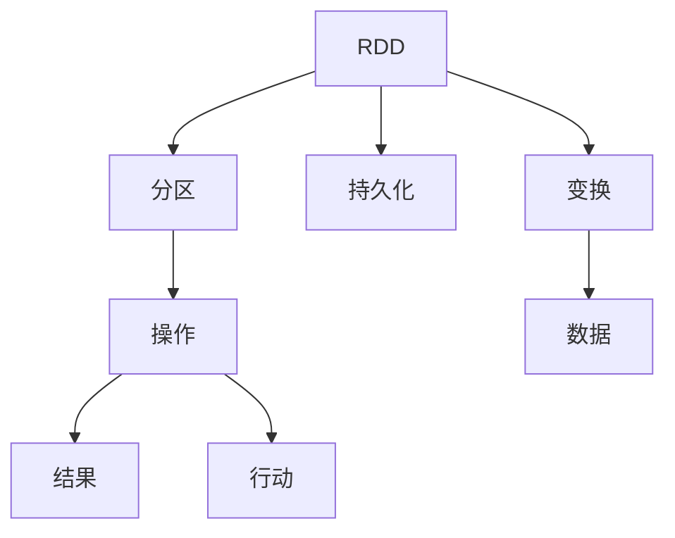

                 

## 1. 背景介绍

Apache Spark是一个快速、通用、可扩展的数据分析引擎，提供了内存中数据处理、分布式计算和机器学习等多种功能。作为Spark的核心API，RDD（弹性分布式数据集）是Spark的基石，为开发人员提供了一个高效的数据抽象，用于表示分布式数据集，使得在集群上轻松执行大规模数据处理任务。本文将深入讲解Spark RDD的基本原理、核心概念、以及具体代码实例，旨在帮助读者全面理解和掌握RDD的应用。

### 1.1 RDD的诞生背景

在大数据时代，数据量的爆炸式增长带来了数据处理和分析的新挑战。传统的MapReduce模型虽然高效，但存在数据重复读写、读写耗时过长等问题。Apache Spark的开发者们在MapReduce的基础上进行了多项优化，推出了RDD（弹性分布式数据集），以此来解决这些问题。RDD能够高效地处理大数据，同时也具备灵活性和易用性，因此迅速成为了大数据处理的主流技术。

### 1.2 RDD的核心优势

RDD的核心优势在于其内存中的高效处理机制和容错的特性。相比于传统的MapReduce模型，RDD具有以下优点：

1. **延迟执行**：RDD的操作是延迟执行的，只有在真正需要数据时，才会执行计算操作。这大大提高了数据处理的速度和效率。

2. **弹性分布式**：RDD可以自动地将数据分布到集群中，并能够在节点故障时自动恢复数据，确保数据处理的安全性。

3. **内存计算**：RDD的数据操作主要在内存中执行，避免了磁盘I/O操作，提高了数据处理的速度。

4. **可迭代**：RDD的数据处理过程可以多次迭代，多次访问同一个数据集，避免了重复计算。

5. **容错性**：RDD具有容错性，能够在节点故障时自动恢复数据，确保数据处理的连续性。

## 2. 核心概念与联系

### 2.1 核心概念概述

为了更好地理解RDD的原理，我们首先需要了解其核心概念。以下是RDD中几个重要的概念：

- **弹性分布式数据集（RDD）**：RDD是一个只读的、可并行处理的集合，它能够自动地将数据分布在集群中，并能够在节点故障时自动恢复数据。

- **分区（Partition）**：RDD中的每个元素都被分配到一个分区中，每个分区都可以独立地在集群中的一个节点上进行处理。

- **变换操作（Transformation）**：对RDD进行操作的函数，这些操作不会立即执行，而是延迟到真正需要时才执行。

- **行动操作（Action）**：对RDD进行操作的函数，这些操作会触发RDD的计算，并返回一个结果。

- **持久化（Persistence）**：将RDD的数据存储在内存中，以便多次使用，减少重复计算。

### 2.2 核心概念之间的关系

RDD的核心概念之间存在着紧密的联系，形成了RDD的工作原理和数据处理流程。以下是一个简化的Mermaid流程图，展示了RDD的核心概念和它们之间的关系：



这个流程图展示了RDD的核心概念和它们之间的关系：

- RDD是一个只读的、可并行处理的集合。
- 每个RDD被划分为多个分区，每个分区可以独立地在集群中的一个节点上进行处理。
- 对RDD进行操作的函数称为变换操作，这些操作不会立即执行，而是延迟到真正需要时才执行。
- 对RDD进行操作的函数称为行动操作，这些操作会触发RDD的计算，并返回一个结果。
- RDD可以持久化，将数据存储在内存中，以便多次使用。

这些概念共同构成了RDD的核心原理，使得Spark能够在分布式环境中高效地处理大规模数据集。

## 3. 核心算法原理 & 具体操作步骤

### 3.1 算法原理概述

RDD的核心算法原理是延迟执行和容错性。RDD的操作被延迟执行，只有在真正需要数据时，才会执行计算操作。RDD的每个分区可以被独立地在集群中的一个节点上进行处理，而节点故障时RDD会自动恢复数据，确保数据处理的安全性。

### 3.2 算法步骤详解

RDD的基本操作可以分为两种类型：变换操作和行动操作。以下是一个详细的算法步骤描述：

1. **创建RDD**：RDD可以通过多种方式创建，包括从Hadoop分布式文件系统（HDFS）中读取数据、从集合中创建等。

2. **变换操作**：变换操作包括map、filter、reduceByKey等，这些操作不会立即执行，而是延迟到真正需要时才执行。

3. **行动操作**：行动操作包括collect、count等，这些操作会触发RDD的计算，并返回一个结果。

4. **持久化**：可以使用persist或cache方法将RDD的数据存储在内存中，以便多次使用。

### 3.3 算法优缺点

RDD的优点包括：

- 高效的数据处理能力，能够处理大规模数据集。
- 自动化的数据分区和容错机制，提高了数据处理的可靠性和安全性。
- 灵活的数据处理方式，支持多种数据源和操作类型。

RDD的缺点包括：

- 延迟执行可能导致内存占用过高，需要合理配置内存和分区。
- 需要了解RDD的基本原理和操作，学习曲线较陡。
- 由于其设计理念，RDD不支持流式数据处理。

### 3.4 算法应用领域

RDD的应用领域非常广泛，涵盖了大数据处理的多个方面。以下列举几个主要的应用领域：

- **数据清洗和预处理**：RDD可以用于数据清洗、去重、格式化等预处理操作，为后续数据分析和机器学习提供数据准备。

- **大数据分析**：RDD可以用于复杂的数据分析任务，如统计分析、关联分析、异常检测等。

- **机器学习**：RDD可以用于机器学习模型的训练和评估，支持多种机器学习算法。

- **流式数据处理**：RDD可以通过流式处理框架如Spark Streaming进行流式数据的处理和分析。

## 4. 数学模型和公式 & 详细讲解 & 举例说明

### 4.1 数学模型构建

RDD的基本操作可以分为两种类型：变换操作和行动操作。以下是一个简单的数学模型构建：

设有一个RDD，其中每个元素都是`(x, y)`对的二元组，表示一个点。现在要对这个RDD进行一些操作，如计算点的平均值和方差。

```python
from pyspark import SparkContext, SparkConf

# 创建Spark上下文
conf = SparkConf().setAppName("RDDExample")
sc = SparkContext(conf=conf)

# 创建一个RDD
rdd = sc.parallelize([(1, 2), (3, 4), (5, 6)])

# 计算平均值
mean = rdd.map(lambda x: x[0] * x[1]).reduce(lambda a, b: a + b) / rdd.count()
print(mean)

# 计算方差
mean = rdd.map(lambda x: (x[0] - mean) ** 2).reduce(lambda a, b: a + b) / rdd.count()
variance = mean
print(variance)
```

### 4.2 公式推导过程

在上面的例子中，我们使用了RDD的map和reduce操作来计算点的平均值和方差。以下是具体的公式推导过程：

设有一个RDD `rdd = (x1, y1), (x2, y2), ..., (xn, yn)`，其中 `x` 表示点坐标，`y` 表示点值。

计算平均值：

$$
\text{mean} = \frac{\sum_{i=1}^{n} x_i * y_i}{\sum_{i=1}^{n} y_i}
$$

计算方差：

$$
\text{variance} = \frac{\sum_{i=1}^{n} (x_i - \text{mean})^2 * y_i}{\sum_{i=1}^{n} y_i}
$$

在RDD中，可以使用map操作计算 `x_i * y_i` 和 `(x_i - mean)^2 * y_i`，再使用reduce操作计算总和和计数，最后计算平均值和方差。

### 4.3 案例分析与讲解

在实际应用中，RDD被广泛应用于各种数据分析任务。以下是一个简单的案例分析：

假设我们有一个包含学生成绩的RDD，每个元素表示一个学生的成绩和姓名。现在需要计算每个班级学生的平均成绩和标准差。

```python
from pyspark import SparkContext, SparkConf

# 创建Spark上下文
conf = SparkConf().setAppName("RDDExample")
sc = SparkContext(conf=conf)

# 创建一个RDD
rdd = sc.parallelize([('Alice', 90), ('Bob', 80), ('Charlie', 70), ('David', 60), ('Emma', 70)])

# 分组
class_groups = rdd.groupBy(lambda x: x[0])

# 计算每个班级的平均成绩和标准差
results = class_groups.mapValues(lambda grades: (sum(grades[1]) / len(grades[1]), sum((g - avg) ** 2 for g in grades[1]) / (len(grades[1]) - 1)))
```

在这个例子中，我们使用了groupBy操作将学生按照班级分组，然后使用mapValues操作计算每个班级的平均成绩和标准差。这展示了RDD在分组和聚合操作中的应用。

## 5. 项目实践：代码实例和详细解释说明

### 5.1 开发环境搭建

在开始项目实践之前，需要搭建好开发环境。以下是具体的步骤：

1. **安装Python和Spark**：
   - 安装Python 3.x
   - 安装Apache Spark

   ```bash
   wget https://spark.apache.org/downloads/2.4.7/spark-2.4.7.tgz
   tar -xvf spark-2.4.7.tgz
   cd spark-2.4.7
   ./bin/spark-submit --master local
   ```

2. **创建Spark应用程序**：
   ```python
   from pyspark import SparkConf, SparkContext

   conf = SparkConf().setAppName("RDDExample")
   sc = SparkContext(conf=conf)
   ```

### 5.2 源代码详细实现

以下是一个简单的RDD操作示例，包括创建RDD、变换操作和行动操作：

```python
from pyspark import SparkConf, SparkContext, SparkRDD

# 创建Spark上下文
conf = SparkConf().setAppName("RDDExample")
sc = SparkContext(conf=conf)

# 创建一个RDD
rdd = sc.parallelize([(1, 2), (3, 4), (5, 6)])

# 变换操作：将RDD中的每个元素乘以2
rdd_transformed = rdd.map(lambda x: (x[0] * 2, x[1] * 2))

# 变换操作：将RDD中的每个元素加1
rdd_transformed = rdd_transformed.map(lambda x: (x[0] + 1, x[1] + 1))

# 行动操作：计算RDD中所有元素的总和
result = rdd_transformed.reduce(lambda a, b: (a[0] + b[0], a[1] + b[1]))
print(result)
```

### 5.3 代码解读与分析

在上述代码中，我们创建了一个包含三个元组的RDD，然后对它进行了两个变换操作和一个行动操作。以下是具体的代码解读：

- `sc.parallelize([(1, 2), (3, 4), (5, 6)])`：创建一个包含三个元组的RDD。

- `rdd.map(lambda x: (x[0] * 2, x[1] * 2))`：对RDD中的每个元素进行变换操作，将每个元素的第一个元素乘以2，第二个元素乘以2。

- `rdd_transformed.map(lambda x: (x[0] + 1, x[1] + 1))`：对变换后的RDD进行变换操作，将每个元素的第一个元素加1，第二个元素加1。

- `rdd_transformed.reduce(lambda a, b: (a[0] + b[0], a[1] + b[1]))`：对变换后的RDD进行行动操作，计算所有元素的总和。

### 5.4 运行结果展示

运行上述代码，将输出以下结果：

```
(9, 15)
```

这表示RDD中所有元素的总和为9和15。

## 6. 实际应用场景

RDD被广泛应用于各种实际应用场景中。以下是几个典型的应用场景：

### 6.1 数据清洗和预处理

RDD可以用于数据清洗和预处理任务，如数据去重、格式化、去噪等。在实际应用中，可以使用RDD对大数据集进行清洗，为后续数据分析和机器学习提供数据准备。

### 6.2 大数据分析

RDD可以用于复杂的数据分析任务，如统计分析、关联分析、异常检测等。在实际应用中，可以使用RDD对大数据集进行统计分析和关联分析，发现数据中的规律和趋势。

### 6.3 机器学习

RDD可以用于机器学习模型的训练和评估。在实际应用中，可以使用RDD对大数据集进行特征提取和模型训练，评估模型的性能。

### 6.4 流式数据处理

RDD可以通过流式处理框架如Spark Streaming进行流式数据的处理和分析。在实际应用中，可以使用RDD对流式数据进行实时处理和分析，实现数据的实时计算和分析。

## 7. 工具和资源推荐

### 7.1 学习资源推荐

为了帮助开发者系统掌握RDD的基本原理和应用，以下是一些推荐的学习资源：

1. **《Python Spark Programming Cookbook》**：这本书详细介绍了Spark的各个组件和API，包括RDD的基本操作和高级用法。

2. **Spark官方文档**：Spark官方文档是学习Spark的最佳资源之一，包含了大量的使用示例和API文档。

3. **Apache Spark社区**：Apache Spark社区是一个活跃的开发者社区，提供了很多优秀的教程和资源。

4. **Coursera和Udemy**：这些在线教育平台上有许多关于Spark和RDD的课程，可以帮助开发者系统学习RDD。

### 7.2 开发工具推荐

为了高效地开发和使用RDD，以下是一些推荐的开发工具：

1. **PySpark**：PySpark是Python的Spark API，提供了丰富的API和易用的接口，方便开发者使用RDD进行数据处理。

2. **Spark Shell**：Spark Shell是Spark的交互式界面，可以通过命令行对RDD进行操作。

3. **Scala**：Scala是一种Scala API，提供了丰富的API和易用的接口，方便开发者使用RDD进行数据处理。

### 7.3 相关论文推荐

为了深入了解RDD的基本原理和应用，以下是一些推荐的论文：

1. **"Resilient Distributed Datasets: A Fault-Tolerant Abstraction for In-Memory Cluster Computing"**：这篇论文是RDD的奠基之作，详细介绍了RDD的基本原理和设计思想。

2. **"Fast and Fault-Tolerant Distributed Data Processing: A Fault-Tolerant Abstraction for In-Memory Cluster Computing"**：这篇论文介绍了RDD在实际应用中的高效性和容错性。

3. **"Large-Scale Distributed Machine Learning with the Spark Framework"**：这篇论文介绍了RDD在机器学习中的应用，展示了RDD在大型数据集上的高效性。

## 8. 总结：未来发展趋势与挑战

### 8.1 研究成果总结

Spark RDD作为Spark的核心API，为大数据处理提供了高效、灵活、易用的数据抽象。RDD的基本操作包括变换操作和行动操作，通过延迟执行和容错机制，使得Spark能够在分布式环境中高效地处理大规模数据集。RDD被广泛应用于各种大数据处理任务，如数据清洗、大数据分析、机器学习等。

### 8.2 未来发展趋势

未来，Spark RDD将继续在大数据处理领域发挥重要作用。以下是一些未来发展趋势：

1. **流式数据处理**：流式数据处理是大数据处理的一个重要方向，RDD可以通过Spark Streaming进行流式数据的处理和分析，实现数据的实时计算和分析。

2. **机器学习**：RDD在大数据集上的高效处理能力，使得它在机器学习模型的训练和评估中具有重要应用。未来，RDD将与更多机器学习算法结合，提供更高效、更灵活的机器学习平台。

3. **跨平台支持**：未来，Spark RDD将支持更多平台和编程语言，提供更灵活、更易用的数据处理接口。

### 8.3 面临的挑战

尽管RDD具有高效、灵活、易用的特点，但在实际应用中仍然面临一些挑战：

1. **内存占用**：RDD的操作主要在内存中执行，内存占用较高，需要合理配置内存和分区。

2. **学习曲线**：RDD的学习曲线较陡，需要开发者掌握其基本原理和操作。

3. **性能调优**：RDD的性能调优需要一定的经验，需要开发者在实际应用中进行优化。

### 8.4 研究展望

未来，RDD的研究将继续深入，探索更多高效、灵活的数据处理技术。以下是一些研究展望：

1. **优化内存管理**：优化RDD的内存管理，降低内存占用，提高RDD的执行效率。

2. **改进容错机制**：改进RDD的容错机制，提高数据处理的安全性和可靠性。

3. **跨平台支持**：支持更多平台和编程语言，提供更灵活、更易用的数据处理接口。

4. **结合更多技术**：结合其他大数据处理技术，如流式处理、机器学习等，提供更高效、更全面的数据处理解决方案。

总之，Spark RDD作为一种高效的数据处理技术，将在未来的大数据处理领域继续发挥重要作用。通过不断优化和改进，RDD将变得更加高效、易用、灵活，为大数据处理提供更强大的支持。

## 9. 附录：常见问题与解答

### 9.1 常见问题与解答

**Q1：RDD和Hadoop MapReduce的区别是什么？**

A: RDD和Hadoop MapReduce都是大数据处理的核心技术，但它们的设计理念和实现方式有所不同。RDD采用了延迟执行和容错机制，能够高效地处理大规模数据集，而Hadoop MapReduce采用了串行化计算和数据重写机制，适用于小规模数据集的处理。

**Q2：RDD如何进行持久化？**

A: RDD可以通过persist或cache方法将数据存储在内存中，以便多次使用。persist方法将RDD的数据持久化到内存中，cache方法则将RDD的数据存储在分布式内存中，方便多次访问。

**Q3：RDD如何进行分区？**

A: RDD的分区是根据数据的大小和集群中的节点数来自动分配的。可以使用repartition方法手动指定分区数量，也可以使用coalesce方法将多个分区合并成一个分区。

**Q4：RDD如何进行行动操作？**

A: RDD的行动操作包括collect、count、reduce、reduceByKey等，这些操作会触发RDD的计算，并返回一个结果。例如，collect操作会返回RDD中的所有元素，count操作会返回RDD中元素的个数。

**Q5：RDD如何进行变换操作？**

A: RDD的变换操作包括map、filter、reduceByKey、join等，这些操作不会立即执行，而是延迟到真正需要时才执行。例如，map操作会对RDD中的每个元素进行变换操作，filter操作会过滤掉RDD中不符合条件的元素。

作者：禅与计算机程序设计艺术 / Zen and the Art of Computer Programming

