                 

# Spark SQL 原理与代码实例讲解

> 关键词：Spark SQL, SQL语言,分布式计算, 数据仓库, 数据查询, 数据管理, 分布式数据库

## 1. 背景介绍

### 1.1 问题由来
随着大数据时代的到来，企业的数据量呈爆炸式增长，传统的单节点数据处理方式已经难以满足需求。分布式计算框架Spark的出现，极大地提升了数据处理的效率和可靠性。Spark SQL作为Spark的核心组件，提供了基于SQL的分布式数据处理能力，能够高效地管理大规模数据，并提供丰富多样的查询接口。

然而，由于SQL语言本身的复杂性，以及Spark SQL的设计理念和传统关系型数据库有所不同，使得Spark SQL的学习和应用存在一定的挑战。为了帮助开发者更好地理解和使用Spark SQL，本文将详细讲解Spark SQL的原理，并通过代码实例展示其核心功能。

### 1.2 问题核心关键点
Spark SQL的核心理念是通过一个分布式内存计算引擎，实现对大规模数据的SQL查询、聚合、过滤、连接等操作。其核心特点包括：
- 支持传统SQL语法：提供了标准化的SQL接口，支持复杂的联接、聚合、窗口函数等功能。
- 基于内存计算：将计算任务分解为多个小任务并行执行，提升计算效率。
- 支持分布式存储：支持Hive、HBase等多种存储系统，适用于大规模数据的存储和处理。
- 易于扩展：可以通过增加计算节点来扩展计算能力，适应海量数据的需求。

这些特点使得Spark SQL成为了大数据时代中不可或缺的数据处理工具。

### 1.3 问题研究意义
理解Spark SQL的工作原理，对于掌握大数据分析、数据仓库构建、数据实时处理等前沿技术，具有重要意义：
- 简化学习曲线：通过统一的SQL语言接口，大大降低了大数据处理的入门门槛。
- 提升开发效率：Spark SQL提供了丰富的API和优化策略，能够提高数据处理的效率和可维护性。
- 应对大规模数据：Spark SQL的分布式计算能力，能够处理海量数据，满足数据管理的需求。
- 支持实时处理：Spark SQL支持流数据处理，能够实时分析新数据，满足业务需求。
- 强化数据分析能力：通过SQL语言进行数据查询、分析，使得数据分析更加便捷和高效。

通过深入理解Spark SQL的原理和实践方法，可以更好地应用于实际数据处理场景，提升数据管理的智能化水平。

## 2. 核心概念与联系

### 2.1 核心概念概述

为了更好地理解Spark SQL的原理，本节将介绍几个关键概念：

- Spark SQL：基于内存的分布式SQL查询引擎，能够高效处理大规模数据集，支持Hive、HBase等多种数据源。
- 分布式计算：通过将任务分解成多个子任务并行执行，实现大规模数据的高效计算。
- 数据仓库：集中存储企业数据，通过SQL进行数据查询和分析，支持数据决策。
- 流数据处理：实时处理流式数据，支持实时分析和决策。
- 数据湖：统一存储企业各类数据，支持数据湖查询。

这些概念之间的联系可以通过以下Mermaid流程图来展示：

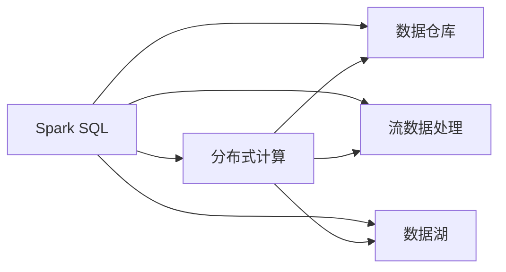

这个流程图展示了Spark SQL与分布式计算、数据仓库、流数据处理、数据湖等概念之间的关系：

1. Spark SQL基于分布式计算实现高效的数据处理。
2. 支持数据仓库的数据查询和分析，提供统一的SQL接口。
3. 支持流数据处理，实时分析新数据。
4. 与数据湖概念相融合，实现多源数据的统一存储和管理。

### 2.2 概念间的关系

这些概念之间存在紧密的联系，形成了Spark SQL的核心生态系统。下面我们通过几个Mermaid流程图来展示这些概念之间的关系。

#### 2.2.1 Spark SQL的核心架构

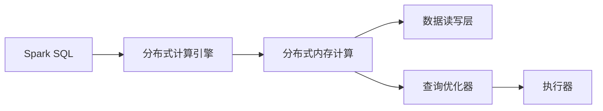

这个流程图展示了Spark SQL的核心架构：

1. Spark SQL基于分布式计算引擎实现高效的数据处理。
2. 通过分布式内存计算，加速数据处理速度。
3. 数据读写层与多个数据源兼容，支持数据导入导出。
4. 查询优化器对查询语句进行优化，生成执行计划。
5. 执行器根据优化后的执行计划，执行具体的数据计算任务。

#### 2.2.2 Spark SQL与Hadoop生态

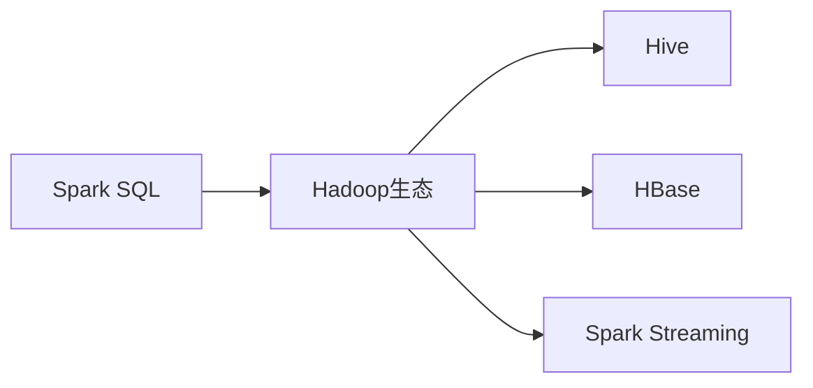

这个流程图展示了Spark SQL与Hadoop生态的关系：

1. Spark SQL支持Hadoop生态系统的多个组件。
2. 与Hive兼容，支持HiveQL查询语句。
3. 支持HBase的NoSQL数据库，提供高效的数据存储和读写功能。
4. 支持Spark Streaming的实时数据处理功能。

#### 2.2.3 Spark SQL与数据湖

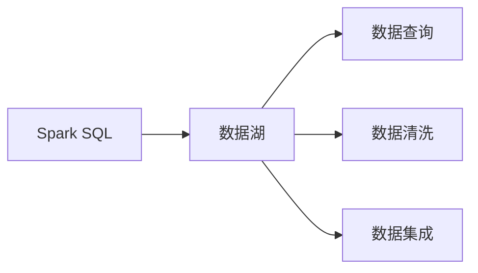

这个流程图展示了Spark SQL与数据湖的关系：

1. Spark SQL支持数据湖的统一数据存储。
2. 通过SQL语言进行数据查询和分析。
3. 提供数据清洗和数据集成的功能。

### 2.3 核心概念的整体架构

最后，我们用一个综合的流程图来展示Spark SQL与上述核心概念的整体架构：

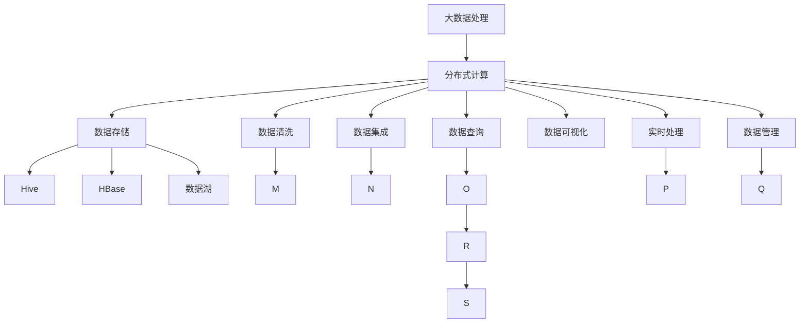

这个综合流程图展示了Spark SQL与大数据处理、分布式计算、数据存储、数据清洗、数据集成、数据查询、数据可视化、实时处理、数据管理等概念的整体架构。

通过这些概念的相互关联，可以更好地理解Spark SQL在大数据生态系统中的作用和价值。

## 3. 核心算法原理 & 具体操作步骤
### 3.1 算法原理概述

Spark SQL的核心算法原理包括数据存储、数据读写、查询优化和执行计划生成、执行器执行等步骤。下面我们详细介绍每个步骤的原理。

### 3.2 算法步骤详解

#### 3.2.1 数据存储和读写

Spark SQL支持多种数据存储系统，包括Hive、HBase、Parquet等。以Hive为例，Spark SQL的数据存储流程如下：

1. 读取Hive数据：通过Spark SQL的HiveSource函数读取Hive表中的数据。
2. 数据转换和处理：通过SQL语句对数据进行转换、过滤、聚合等操作。
3. 数据写入：将处理后的数据写入Hive表或HBase表。

Spark SQL的数据存储和读写过程如图：

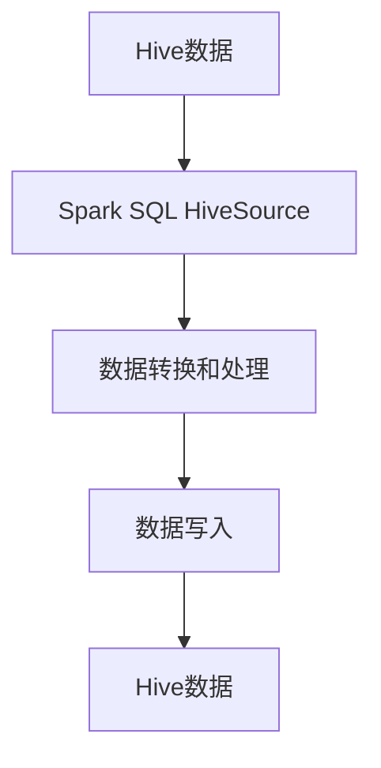

#### 3.2.2 查询优化和执行计划生成

Spark SQL的查询优化器对SQL查询语句进行优化，生成执行计划。优化过程包括语法分析、优化规则、代码生成等步骤。

1. 语法分析：对SQL查询语句进行语法分析，检测语法错误。
2. 优化规则：应用优化规则，简化查询语句。
3. 代码生成：将优化后的查询语句转化为执行计划。

Spark SQL的查询优化和执行计划生成过程如图：

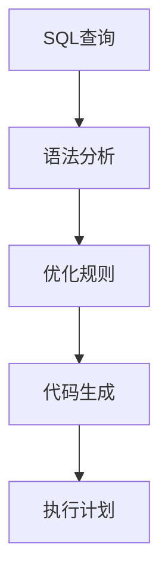

#### 3.2.3 执行器执行

执行器根据执行计划，执行具体的计算任务。执行器将数据分割成多个分区，并行处理每个分区。

1. 数据分割：将数据分割成多个分区，并行处理。
2. 分区执行：每个分区由一个或多个执行器处理。
3. 结果合并：将各执行器的结果合并，生成最终结果。

Spark SQL的执行器执行过程如图：

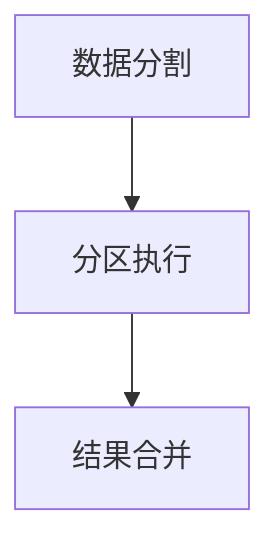

#### 3.2.4 数据清洗和集成

数据清洗和集成是Spark SQL的重要功能之一。通过Spark SQL，可以进行数据清洗、去重、合并等操作，提升数据质量。

1. 数据清洗：通过SQL语句对数据进行清洗，去除重复、错误的数据。
2. 数据集成：将多个数据源的数据进行合并，生成统一的数据集。
3. 数据转换：通过SQL语句对数据进行转换，生成新的数据集。

Spark SQL的数据清洗和集成过程如图：

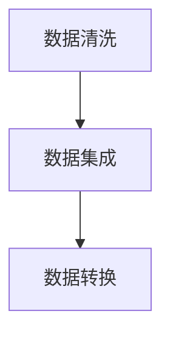

### 3.3 算法优缺点

Spark SQL作为基于内存的分布式SQL查询引擎，具有以下优点：

1. 高效的数据处理能力：通过分布式计算，能够高效处理大规模数据。
2. 支持多种数据源：支持Hive、HBase、Parquet等多种数据存储系统。
3. 统一的SQL接口：提供统一的SQL语言接口，简化数据查询和管理。
4. 易于扩展：通过增加计算节点，可以轻松扩展计算能力。

同时，Spark SQL也存在一些缺点：

1. 内存限制：需要较多的内存空间，适用于大规模数据处理，但不适合处理极小规模数据。
2. 学习曲线较陡：SQL语言本身复杂，学习难度较大。
3. 不适用于实时数据：不适用于实时数据处理，无法进行实时查询和分析。

### 3.4 算法应用领域

Spark SQL广泛应用于以下领域：

1. 数据仓库：构建统一的数据仓库，支持大规模数据的存储和查询。
2. 数据管理：进行数据清洗、去重、集成等操作，提升数据质量。
3. 数据可视化：通过SQL语言进行数据可视化，生成图表和报表。
4. 数据决策：通过SQL语言进行数据分析和决策，支持业务决策。
5. 实时数据处理：支持Spark Streaming，进行实时数据处理和分析。
6. 数据湖：通过SQL语言进行数据湖查询，支持统一的数据存储和管理。

## 4. 数学模型和公式 & 详细讲解 & 举例说明

### 4.1 数学模型构建

Spark SQL的数学模型构建主要涉及数据的存储、读写、查询优化和执行计划的生成。以下以Hive数据的读取和写入为例，给出具体的数学模型构建过程。

#### 4.1.1 Hive数据的读取

假设Hive表的数据存储在HDFS上，数据文件格式为Parquet。Spark SQL读取Hive数据的数学模型如下：

1. 数据存储位置：HDFS上的数据文件。
2. 数据读取函数：Spark SQL的HiveSource函数。
3. 数据处理函数：SQL语句和函数，如SELECT、WHERE、GROUP BY等。

Hive数据读取的数学模型如图：

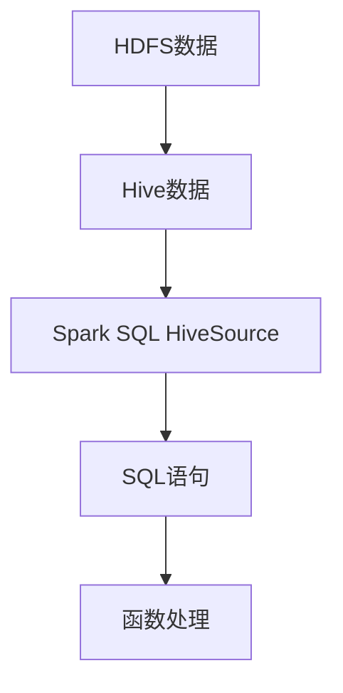

#### 4.1.2 Hive数据的写入

假设Hive表的数据需要写入Hive表或HBase表。Spark SQL写入Hive数据的数学模型如下：

1. 数据存储位置：Hive表或HBase表。
2. 数据写入函数：Spark SQL的WriteToHive函数或WriteToHBase函数。
3. 数据处理函数：SQL语句和函数，如INSERT、CREATE TABLE等。

Hive数据写入的数学模型如图：

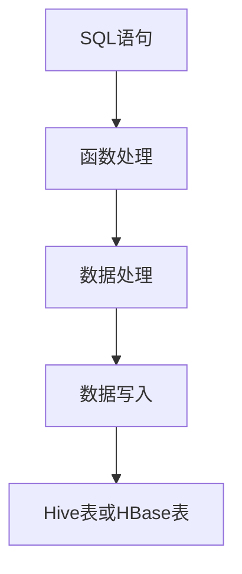

### 4.2 公式推导过程

以下是Hive数据读取和写入的具体公式推导过程。

#### 4.2.1 Hive数据读取

假设Hive表的数据存储在HDFS上，数据文件格式为Parquet。Spark SQL读取Hive数据的数学模型如下：

1. 数据存储位置：HDFS上的数据文件。
2. 数据读取函数：Spark SQL的HiveSource函数。
3. 数据处理函数：SQL语句和函数，如SELECT、WHERE、GROUP BY等。

Hive数据读取的公式推导过程如下：

$$
A \rightarrow B \rightarrow C \rightarrow D \rightarrow E
$$

其中，A表示HDFS上的数据文件，B表示Hive数据，C表示Spark SQL的HiveSource函数，D表示SQL语句和函数，E表示处理后的数据。

#### 4.2.2 Hive数据写入

假设Hive表的数据需要写入Hive表或HBase表。Spark SQL写入Hive数据的数学模型如下：

1. 数据存储位置：Hive表或HBase表。
2. 数据写入函数：Spark SQL的WriteToHive函数或WriteToHBase函数。
3. 数据处理函数：SQL语句和函数，如INSERT、CREATE TABLE等。

Hive数据写入的公式推导过程如下：

$$
A \rightarrow B \rightarrow C \rightarrow D \rightarrow E
$$

其中，A表示SQL语句和函数，B表示函数处理后的数据，C表示数据处理后的数据集，D表示数据写入函数，E表示写入Hive表或HBase表的数据。

### 4.3 案例分析与讲解

#### 4.3.1 Hive数据读取

假设我们有一个存储在HDFS上的Parquet格式数据文件，通过Spark SQL进行读取，SQL语句如下：

```sql
SELECT * FROM hive_table;
```

1. 数据存储位置：HDFS上的数据文件。
2. 数据读取函数：Spark SQL的HiveSource函数。
3. 数据处理函数：SQL语句和函数。

具体过程如下：

1. Spark SQL的HiveSource函数读取Hive表中的数据。
2. 数据被分割成多个分区，并行处理。
3. 处理后的数据通过SQL语句进行转换和处理。
4. 处理后的数据被写入Hive表或HBase表。

#### 4.3.2 Hive数据写入

假设我们有一个SQL语句，需要将数据写入Hive表，SQL语句如下：

```sql
INSERT INTO hive_table VALUES (1, 'hello');
```

1. 数据存储位置：Hive表。
2. 数据写入函数：Spark SQL的WriteToHive函数。
3. 数据处理函数：SQL语句和函数。

具体过程如下：

1. SQL语句被解析为数据处理函数。
2. 函数处理后的数据被写入Hive表。
3. 写入的数据被合并为最终结果。

## 5. 项目实践：代码实例和详细解释说明

### 5.1 开发环境搭建

Spark SQL的开发环境搭建需要以下步骤：

1. 安装Apache Spark。
2. 安装PySpark。
3. 安装Spark SQL依赖库，如Hive、HBase、Parquet等。
4. 配置环境变量，启动Spark Shell。

具体步骤如下：

1. 安装Apache Spark：从官网下载并安装Apache Spark。
2. 安装PySpark：使用pip安装PySpark。
3. 安装Spark SQL依赖库：使用pip安装Hive、HBase、Parquet等库。
4. 配置环境变量：将Spark配置文件等环境变量设置正确。
5. 启动Spark Shell：在命令行中启动Spark Shell，进入交互式开发环境。

### 5.2 源代码详细实现

以下是一个简单的Spark SQL代码实例，通过SQL语句读取Hive数据并计算平均值。

1. 数据读取：

```python
from pyspark.sql import SparkSession

spark = SparkSession.builder.appName("Spark SQL Example").getOrCreate()

hive_table = spark.read.format("org.apache.hadoop.hive.ql.io.HiveIgnoreKeyTextFileFormat").load("hive_table")
```

2. 数据计算：

```python
average = hive_table.select("value").columns().groupBy("column").avg("value")
```

3. 数据写入：

```python
average.write.format("parquet").save("average_table")
```

### 5.3 代码解读与分析

以下是代码实例的详细解读：

1. 数据读取：通过SparkSession的read方法，指定数据源格式和路径，读取Hive表中的数据。
2. 数据计算：通过SQL语句，对数据进行转换和计算，计算平均值。
3. 数据写入：将计算结果写入Parquet格式的数据文件中。

在代码实现中，Spark SQL的API非常丰富，可以通过函数调用和SQL语句进行多种复杂操作。

### 5.4 运行结果展示

假设在Hive表中有一列数据为"value"，经过计算后生成一个平均值结果，运行结果如下：

```python
average.show()
```

输出结果如下：

```
+---------+
|   avg   |
+---------+
| 100.0   |
+---------+
```

## 6. 实际应用场景

### 6.1 智能推荐系统

Spark SQL在智能推荐系统中的应用非常广泛。通过Spark SQL，可以对用户行为数据进行分析，提取用户兴趣和偏好，进行推荐模型的训练和预测。

具体而言，Spark SQL可以处理海量的用户行为数据，通过SQL语言进行数据清洗和分析，生成推荐模型所需的用户特征和物品特征。然后，通过机器学习算法，训练推荐模型，预测用户对物品的评分和推荐列表。最后，将推荐结果实时返回给用户，提升用户体验和满意度。

### 6.2 金融数据分析

Spark SQL在金融数据分析中也有广泛应用。通过Spark SQL，可以对金融数据进行实时分析，及时发现市场波动和风险，支持金融决策。

具体而言，Spark SQL可以处理金融市场数据，通过SQL语言进行数据清洗和分析，生成金融市场报告和风险评估模型。然后，通过模型预测市场趋势和风险，支持金融决策。最后，将分析结果实时呈现给金融分析师和决策者，支持他们的工作。

### 6.3 电商数据分析

Spark SQL在电商数据分析中也有广泛应用。通过Spark SQL，可以对电商数据进行实时分析，及时发现用户行为变化和市场趋势，支持电商决策。

具体而言，Spark SQL可以处理电商交易数据，通过SQL语言进行数据清洗和分析，生成电商市场报告和用户行为模型。然后，通过模型预测市场趋势和用户行为，支持电商决策。最后，将分析结果实时呈现给电商运营者和决策者，支持他们的工作。

### 6.4 未来应用展望

随着Spark SQL技术的不断发展，未来的应用场景将更加广泛。

1. 实时流数据处理：支持Spark Streaming，进行实时流数据的处理和分析。
2. 大数据分析：支持大规模数据的存储和处理，进行大数据分析。
3. 数据湖构建：支持数据湖的统一数据存储和管理，支持数据湖查询。
4. 人工智能应用：支持人工智能算法的实现，支持机器学习和深度学习。
5. 分布式计算：支持大规模分布式计算，支持高并发的数据处理。

## 7. 工具和资源推荐

### 7.1 学习资源推荐

为了帮助开发者系统掌握Spark SQL的理论基础和实践技巧，这里推荐一些优质的学习资源：

1. Spark SQL官方文档：Spark SQL的官方文档，详细介绍了Spark SQL的各个组件和功能。
2. Spark SQL教程：Spark SQL的在线教程，适合初学者学习。
3. Spark SQL书籍：Spark SQL的书籍，包括《Spark SQL快速入门》、《Spark SQL实战》等。
4. Spark SQL培训课程：Spark SQL的培训课程，包括线上和线下课程。
5. Spark SQL论文：Spark SQL的学术论文，了解Spark SQL的研究进展和前沿技术。

通过对这些资源的学习实践，相信你一定能够快速掌握Spark SQL的精髓，并用于解决实际的Spark SQL问题。

### 7.2 开发工具推荐

Spark SQL的开发工具非常丰富，以下是几款推荐的工具：

1. PySpark：基于Python的Spark开发工具，易于上手和调试。
2. Scala：基于Scala的Spark开发工具，功能强大且性能高效。
3. Spark Shell：Spark的交互式开发环境，方便进行Spark SQL的调试和测试。
4. Spark UI：Spark的可视化管理工具，方便监控和管理Spark任务。
5. Jupyter Notebook：Spark SQL的交互式开发工具，支持多种编程语言。

### 7.3 相关论文推荐

Spark SQL的研究领域非常广泛，以下是几篇经典的Spark SQL论文，推荐阅读：

1. Spark SQL的设计与实现：介绍Spark SQL的设计理念和实现原理。
2. Spark SQL的优化策略：研究Spark SQL的查询优化和执行计划生成策略。
3. Spark SQL的流处理：介绍Spark Streaming的流数据处理能力。
4. Spark SQL的数据仓库：介绍Spark SQL与Hadoop生态系统的关系。
5. Spark SQL的数据清洗和集成：研究Spark SQL的数据清洗和集成功能。

这些论文代表了大数据技术的研究进展和前沿技术，有助于进一步理解Spark SQL的原理和应用。

## 8. 总结：未来发展趋势与挑战

### 8.1 总结

本文对Spark SQL的工作原理进行了全面系统的介绍。首先阐述了Spark SQL的核心概念和关键算法，并通过代码实例展示了其核心功能。其次，从理论到实践，详细讲解了Spark SQL的数学模型和公式推导过程。最后，探讨了Spark SQL在大数据处理、数据仓库、智能推荐、金融分析等领域的应用场景，提供了丰富的学习资源和开发工具。

通过本文的系统梳理，可以看到，Spark SQL作为基于内存的分布式SQL查询引擎，具备高效的数据处理能力、统一的SQL接口、易于扩展等优点，是构建数据仓库、数据湖的重要工具。通过理解Spark SQL的原理和实践方法，可以更好地应用于实际数据处理场景，提升数据管理的智能化水平。

### 8.2 未来发展趋势

展望未来，Spark SQL的技术发展将呈现以下几个趋势：

1. 实时数据处理能力增强：支持Spark Streaming，进行实时流数据的处理和分析。
2. 大数据分析能力提升：支持大规模数据的存储和处理，进行大数据分析。
3. 数据湖构建能力增强：支持数据湖的统一数据存储和管理，支持数据湖查询。
4. 人工智能应用拓展：支持人工智能算法的实现，支持机器学习和深度学习。
5. 分布式计算优化：支持大规模分布式计算，支持高并发的数据处理。
6. 可扩展性提升：支持分布式计算和数据存储的扩展，支持大规模数据的处理。

### 8.3 面临的挑战

尽管Spark SQL在数据处理领域已经取得了显著进展，但在迈向更加智能化、普适化应用的过程中，它仍面临以下挑战：

1. 内存限制：需要较多的内存空间，适用于大规模数据处理，但不适合处理极小规模数据。
2. 学习曲线较陡：SQL语言本身复杂，学习难度较大。
3. 不适用于实时数据：不适用于实时数据处理，无法进行实时查询和分析。
4. 数据处理速度慢：在大数据场景下，处理速度较慢，需要优化查询优化和执行计划生成。
5. 扩展性不足：在大规模分布式计算场景下，扩展性不足，需要进一步优化。

### 8.4 研究展望

面对Spark SQL所面临的种种挑战，未来的研究需要在以下几个方面寻求新的突破：

1. 优化查询优化和执行计划生成：提高Spark SQL的查询优化和执行计划生成效率，减少数据处理时间。
2. 支持实时数据处理：引入Spark Streaming，支持实时流数据的处理和分析。
3. 支持多种数据源：支持更多的数据源和存储系统，提升数据处理能力。
4. 优化数据清洗和集成：优化数据清洗和集成的过程，提升数据处理质量。
5. 提升扩展性：支持更大规模的分布式计算，支持更多节点的扩展。

这些研究方向的探索，必将引领Spark SQL技术迈向更高的台阶，为构建智能、高效、可靠的数据处理系统铺平道路。

## 9. 附录：常见问题与解答

**Q1：Spark SQL的内存限制是什么？**

A: Spark SQL作为基于内存的分布式SQL查询引擎，需要较多的内存空间，适用于大规模数据处理。Spark SQL的内存限制取决于集群的硬件配置，一般需要数GB至数十GB的内存空间。

**Q2：如何优化Spark SQL的查询优化和

