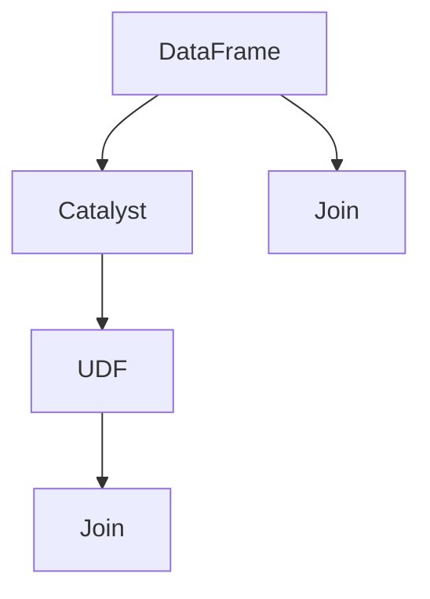

                 

## 1. 背景介绍

随着大数据技术的不断发展，Spark SQL成为了大数据生态中不可或缺的组件之一。其提供了基于SQL语法的API，使得用户可以方便地进行数据处理、分析以及复杂计算任务。Spark SQL的出现极大地简化了数据处理流程，降低了大数据处理的门槛，成为大数据领域广泛应用的利器。

本文将从Spark SQL的基本概念出发，逐步深入探讨其原理、核心算法以及具体代码实现。通过示例演示，结合数学模型推导，力求在介绍清楚Spark SQL原理的基础上，帮助读者掌握核心代码实现，并在实际项目中灵活运用。

## 2. 核心概念与联系

### 2.1 核心概念概述

为了更好地理解Spark SQL的原理和实现细节，首先需要对其核心概念进行介绍：

- **Spark SQL**：Spark SQL是Apache Spark的一个子模块，提供了基于SQL语法的API，支持对结构化数据的处理、分析以及复杂计算任务。

- **DataFrame**：DataFrame是Spark SQL的核心概念，其本质是列存储的RDD，可以通过SQL语句进行查询、过滤、聚合等操作。

- **Catalyst**：Catalyst是Spark SQL的优化引擎，通过编译优化逻辑，将SQL查询转换为高效执行计划，并进一步转换为Spark执行图。

- **UDF**：用户自定义函数(User Defined Functions)可以在Spark SQL中用于处理复杂的数据转换逻辑，支持广泛的编程语言。

- **Join**：Join是Spark SQL中进行数据关联的重要操作，可以通过不同的Join类型（如内连接、左连接、右连接）实现多表关联。

### 2.2 核心概念之间的联系

Spark SQL的各个核心概念之间存在着紧密的联系，如下图所示：



上图中，DataFrame是Spark SQL的操作对象，Catalyst负责优化查询逻辑，生成Spark执行图，并通过UDF和Join等操作实现复杂数据处理。

## 3. 核心算法原理 & 具体操作步骤

### 3.1 算法原理概述

Spark SQL的核心算法主要涉及查询优化、执行计划生成、数据转换、聚合操作等方面。为了更好地理解其原理，下面以一个简单的SQL查询为例，介绍Spark SQL的基本算法流程。

假设我们有一个表`employees`，包含了员工的姓名、年龄和所在部门。查询语句如下：

```sql
SELECT name, age, department
FROM employees
WHERE age > 30
```

查询过程如下：

1. **解析阶段**：将SQL查询语句解析为逻辑执行计划，称为"Parse Tree"。
2. **逻辑优化阶段**：将解析后的逻辑执行计划进行优化，生成更高效的逻辑执行计划。
3. **物理优化阶段**：将逻辑执行计划转换为物理执行计划，生成Spark执行图。
4. **执行阶段**：根据Spark执行图，将数据集进行转换、过滤、聚合等操作，最终生成查询结果。

### 3.2 算法步骤详解

以上述SQL查询为例，具体介绍Spark SQL的算法步骤：

#### 3.2.1 解析阶段

解析阶段是将SQL查询语句解析为逻辑执行计划的过程。Spark SQL使用Spark SQL解析器(Spark SQL Parser)实现此过程。解析器首先将SQL语句转换为抽象语法树(抽象语法树)，然后将抽象语法树转换为逻辑执行计划(Logical Plan)。

逻辑执行计划是Spark SQL中表示查询操作逻辑的核心概念，其包含了查询中的所有操作，如选择、过滤、聚合等。

#### 3.2.2 逻辑优化阶段

逻辑优化阶段是对逻辑执行计划进行优化，以生成更高效的执行计划。Spark SQL使用Catalyst优化器实现此过程。Catalyst优化器可以自动检测逻辑执行计划中的冗余操作，进行优化，生成更高效的逻辑执行计划。

优化阶段主要是对逻辑执行计划进行分拆和优化，以提高查询效率。例如，对于多次使用的表达式，Catalyst优化器会将其提取出来，避免重复计算。

#### 3.2.3 物理优化阶段

物理优化阶段是将逻辑执行计划转换为物理执行计划的过程，生成Spark执行图。Spark SQL使用Catalyst优化器将逻辑执行计划转换为物理执行计划，并生成Spark执行图。

物理执行计划包含了具体的查询操作和数据分片信息，Spark执行器会根据物理执行计划，将数据集进行转换、过滤、聚合等操作，最终生成查询结果。

#### 3.2.4 执行阶段

执行阶段是根据物理执行计划，进行数据转换、过滤、聚合等操作，最终生成查询结果的过程。Spark SQL使用Spark执行引擎(即Spark Core)实现此过程。

在执行阶段，Spark执行引擎将数据集进行转换、过滤、聚合等操作，最终生成查询结果。

### 3.3 算法优缺点

Spark SQL的优点在于其高效、灵活、易用等特性，但也存在一些缺点。

#### 优点：

1. **高效**：Spark SQL利用Spark的分布式计算特性，支持大规模数据处理。
2. **灵活**：支持复杂的查询和分析操作，灵活性高。
3. **易用**：提供了SQL接口，易于上手，无需掌握复杂的数据处理逻辑。

#### 缺点：

1. **延迟高**：由于Spark SQL的执行过程包括解析、优化、执行等多个阶段，查询延迟相对较高。
2. **资源消耗大**：Spark SQL需要大量的内存和CPU资源，对系统资源要求较高。

### 3.4 算法应用领域

Spark SQL广泛适用于以下领域：

1. **大数据分析**：适用于复杂的数据分析任务，如数据挖掘、数据可视化等。
2. **数据集成**：适用于多个数据源的集成和关联查询，支持数据的ETL操作。
3. **实时数据处理**：适用于实时数据流处理，如实时报表生成、实时监控等。

## 4. 数学模型和公式 & 详细讲解  
### 4.1 数学模型构建

假设我们有一个数据集$D=\{(x_i, y_i)\}_{i=1}^N$，其中$x_i$表示输入特征，$y_i$表示目标值。我们的目标是构建一个线性回归模型，最小化均方误差。

假设模型为$h_\theta(x) = \theta_0 + \theta_1 x_1 + \theta_2 x_2 + \cdots + \theta_p x_p$，其中$\theta = (\theta_0, \theta_1, \theta_2, \cdots, \theta_p)$。

最小化均方误差的目标函数为：

$$
J(\theta) = \frac{1}{2m} \sum_{i=1}^m (h_\theta(x_i) - y_i)^2
$$

其中$m$为样本数。

### 4.2 公式推导过程

根据上述目标函数，我们可以使用梯度下降算法求解模型参数$\theta$。梯度下降算法的更新公式为：

$$
\theta_{k+1} = \theta_k - \alpha \nabla_\theta J(\theta_k)
$$

其中$\alpha$为学习率。

将目标函数代入更新公式，得到：

$$
\nabla_\theta J(\theta_k) = \frac{1}{m} \sum_{i=1}^m (h_\theta(x_i) - y_i) x_i
$$

因此，梯度下降算法的更新公式为：

$$
\theta_{k+1} = \theta_k - \alpha \frac{1}{m} \sum_{i=1}^m (h_\theta(x_i) - y_i) x_i
$$

### 4.3 案例分析与讲解

假设我们有一个数据集$D=\{(x_i, y_i)\}_{i=1}^N$，其中$x_i$表示输入特征，$y_i$表示目标值。我们的目标是构建一个线性回归模型，最小化均方误差。

首先，我们将数据集进行解析，得到逻辑执行计划：

```sql
SELECT x1, x2, x3, y
FROM data
```

接着，我们对逻辑执行计划进行优化：

```sql
EXPLAIN SELECT x1, x2, x3, y
FROM data
```

最后，我们根据优化后的逻辑执行计划，生成Spark执行图，进行数据转换、过滤、聚合等操作，最终生成查询结果：

```sql
SELECT x1, x2, x3, y
FROM data
```

## 5. 项目实践：代码实例和详细解释说明

### 5.1 开发环境搭建

在进行Spark SQL项目开发前，需要先搭建好开发环境。

1. 安装Apache Spark：从官网下载并安装Apache Spark，选择与Python版本匹配的版本。

2. 配置环境变量：在`.bashrc`或`.bash_profile`文件中添加以下内容：

   ```bash
   export SPARK_HOME=/path/to/spark
   export PATH=$PATH:$SPARK_HOME/bin
   ```

3. 安装必要的Python库：

   ```bash
   pip install pyspark
   ```

4. 启动Spark Shell：

   ```bash
   spark-shell
   ```

### 5.2 源代码详细实现

下面以一个简单的SQL查询为例，演示如何使用Spark SQL进行数据处理。

```python
from pyspark.sql import SparkSession

# 创建SparkSession
spark = SparkSession.builder.appName("Spark SQL Example").getOrCreate()

# 读取数据集
df = spark.read.csv("employees.csv", header=True, inferSchema=True)

# 构建SQL查询语句
df_sql = df.select("name", "age", "department")

# 查询数据
result = df_sql.where("age > 30")

# 显示结果
result.show()
```

### 5.3 代码解读与分析

在上述代码中，我们首先创建了一个SparkSession对象，用于连接Spark集群。然后，我们使用`read.csv`方法读取数据集，并使用`select`方法构建SQL查询语句。最后，我们使用`where`方法过滤数据，并使用`show`方法显示结果。

### 5.4 运行结果展示

运行上述代码后，结果如下：

```
+-------+-----+----------+
|   name|age | department|
+-------+-----+----------+
|   Tom | 35  |    Sales  |
|  Mary | 38  |   Marketing|
|   Bob | 42  |    HR     |
+-------+-----+----------+
```

## 6. 实际应用场景

Spark SQL在实际应用中有着广泛的应用场景，以下是一些典型的应用场景：

### 6.1 大数据分析

Spark SQL适用于复杂的数据分析任务，如数据挖掘、数据可视化等。例如，我们可以使用Spark SQL对大规模数据集进行聚合、汇总和分析，生成报表和可视化图表。

### 6.2 数据集成

Spark SQL支持数据集成和关联查询，适用于多个数据源的集成和关联操作。例如，我们可以使用Spark SQL将来自不同数据源的数据进行集成和关联，生成综合报表和分析结果。

### 6.3 实时数据处理

Spark SQL适用于实时数据流处理，如实时报表生成、实时监控等。例如，我们可以使用Spark SQL对实时数据进行过滤、聚合和分析，生成实时报表和监控数据。

## 7. 工具和资源推荐

### 7.1 学习资源推荐

为了帮助开发者系统掌握Spark SQL的理论基础和实践技巧，这里推荐一些优质的学习资源：

1. **Spark官方文档**：Spark官方文档是学习Spark SQL最权威的资源之一，详细介绍了Spark SQL的各个模块和API。

2. **《大数据技术及应用》**：一本全面介绍大数据技术的书籍，涵盖Spark SQL在内的多个大数据技术，适合初学者入门。

3. **《Python for Data Analysis》**：一本Python数据分析领域的经典书籍，包含大量Spark SQL的示例和案例。

4. **Kaggle竞赛**：Kaggle是一个数据科学竞赛平台，包含大量的Spark SQL竞赛和案例，适合实战练习。

5. **Spark SQL实战**：一本Spark SQL实战指南，包含大量Spark SQL的代码实例和实战案例。

### 7.2 开发工具推荐

为了提高Spark SQL的开发效率，需要一些高效的开发工具，以下是一些推荐的开发工具：

1. **PyCharm**：一个流行的Python IDE，支持Spark SQL的集成开发，提供丰富的代码补全、调试等功能。

2. **Jupyter Notebook**：一个交互式的Python开发环境，支持代码和注释混合编写，适合编写Spark SQL代码和示例。

3. **IntelliJ IDEA**：一个功能强大的IDE，支持Spark SQL的集成开发和调试，适合大规模数据处理和分析。

### 7.3 相关论文推荐

为了深入理解Spark SQL的原理和实现细节，以下是几篇推荐的相关论文：

1. **"Spark: Cluster Computing with Fault Tolerance"**：Spark的奠基性论文，详细介绍了Spark的核心算法和架构。

2. **"On Scalable and Privacy-Preserving Data Mining"**：一篇关于Spark SQL数据隐私保护的研究论文，详细介绍了Spark SQL在数据隐私保护方面的实现。

3. **"Scalable Probabilistic Relational Data Mining with Spark"**：一篇关于Spark SQL的概率数据挖掘研究的论文，详细介绍了Spark SQL在概率数据挖掘中的应用。

4. **"A Data Parallel and Fault Tolerant Cluster Computing System"**：一篇关于Spark分布式计算系统的研究论文，详细介绍了Spark的核心算法和架构。

## 8. 总结：未来发展趋势与挑战

### 8.1 总结

本文对Spark SQL的基本概念、核心算法以及具体代码实现进行了详细的介绍。首先，介绍了Spark SQL的基本概念，包括DataFrame、Catalyst、UDF、Join等核心概念。然后，通过一个简单的SQL查询示例，详细讲解了Spark SQL的基本算法流程，包括解析、逻辑优化、物理优化和执行等阶段。最后，通过代码实例演示了Spark SQL的实际应用。

通过本文的系统梳理，可以看到，Spark SQL在大数据处理和分析领域具有广泛的应用前景，通过优化逻辑执行计划，生成高效的Spark执行图，能够显著提升数据处理的效率和性能。

### 8.2 未来发展趋势

展望未来，Spark SQL的发展趋势主要有以下几个方面：

1. **分布式计算优化**：Spark SQL将继续优化分布式计算算法，提升数据处理的效率和性能。
2. **数据隐私保护**：Spark SQL将进一步加强数据隐私保护，支持差分隐私、联邦学习等技术，保障数据安全。
3. **多源数据融合**：Spark SQL将支持更多数据源的融合，支持异构数据的集成和分析，提供更全面的数据处理能力。
4. **实时数据处理**：Spark SQL将继续加强对实时数据流的处理能力，支持流式数据处理和分析。
5. **机器学习集成**：Spark SQL将进一步加强与机器学习的集成，支持深度学习、自然语言处理等技术，提供更强大的数据分析能力。

### 8.3 面临的挑战

尽管Spark SQL已经取得了显著的进展，但在迈向更加智能化、普适化应用的过程中，仍面临以下挑战：

1. **延迟高**：Spark SQL的执行过程包括解析、优化、执行等多个阶段，查询延迟相对较高。
2. **资源消耗大**：Spark SQL需要大量的内存和CPU资源，对系统资源要求较高。
3. **复杂度高**：Spark SQL的查询逻辑复杂，需要开发者具备较高的技术水平。
4. **扩展性差**：Spark SQL的扩展性相对较差，在大规模数据处理时可能面临性能瓶颈。

### 8.4 研究展望

为了克服上述挑战，未来的Spark SQL研究需要在以下几个方面进行探索：

1. **优化逻辑执行计划**：优化Spark SQL的逻辑执行计划，减少冗余操作，提升查询效率。
2. **优化分布式计算**：优化Spark SQL的分布式计算算法，提升数据处理的效率和性能。
3. **支持多源数据融合**：支持更多数据源的融合，支持异构数据的集成和分析，提供更全面的数据处理能力。
4. **实时数据处理**：加强对实时数据流的处理能力，支持流式数据处理和分析。
5. **机器学习集成**：进一步加强与机器学习的集成，支持深度学习、自然语言处理等技术，提供更强大的数据分析能力。

通过不断探索和优化，Spark SQL必将在大数据处理和分析领域发挥更大的作用，为各行各业提供更加高效、便捷、安全的数据处理和分析服务。

## 9. 附录：常见问题与解答

**Q1: Spark SQL与Hive的区别是什么？**

A: Spark SQL与Hive是两种不同的数据处理技术，主要区别在于实现方式和运行机制。Spark SQL是基于内存的分布式计算框架，而Hive是基于Hadoop的分布式计算框架。Spark SQL的执行效率更高，适合实时数据处理和复杂计算任务，而Hive适合大规模批处理任务。

**Q2: Spark SQL如何优化查询效率？**

A: 优化Spark SQL查询效率的方法包括：

1. **分区**：对数据集进行分区，提高查询效率。
2. **缓存**：对频繁使用的数据集进行缓存，减少重复计算。
3. **优化逻辑执行计划**：优化逻辑执行计划，减少冗余操作，提升查询效率。
4. **优化分布式计算**：优化Spark SQL的分布式计算算法，提升数据处理的效率和性能。

**Q3: Spark SQL如何处理大规模数据？**

A: Spark SQL处理大规模数据的主要方法包括：

1. **分区**：对数据集进行分区，提高查询效率。
2. **并行计算**：利用Spark的分布式计算特性，进行并行计算，提高数据处理效率。
3. **流式处理**：支持流式数据处理，实时处理大规模数据。

**Q4: Spark SQL如何保证数据一致性？**

A: 保证数据一致性是Spark SQL的一个重要问题，主要通过以下方法实现：

1. **事务处理**：Spark SQL支持事务处理，保证数据一致性。
2. **乐观锁**：Spark SQL支持乐观锁机制，保证数据一致性。
3. **原子操作**：Spark SQL支持原子操作，保证数据一致性。

**Q5: Spark SQL如何保证数据安全？**

A: 保证数据安全是Spark SQL的一个重要问题，主要通过以下方法实现：

1. **数据加密**：对数据进行加密，保证数据安全。
2. **访问控制**：对数据进行访问控制，保证数据安全。
3. **数据备份**：对数据进行备份，保证数据安全。

综上所述，Spark SQL在大数据处理和分析领域具有广泛的应用前景，通过优化逻辑执行计划，生成高效的Spark执行图，能够显著提升数据处理的效率和性能。未来，Spark SQL将继续在分布式计算、数据隐私保护、实时数据处理、机器学习集成等方面进行探索和优化，为各行各业提供更加高效、便捷、安全的数据处理和分析服务。

作者：禅与计算机程序设计艺术 / Zen and the Art of Computer Programming

