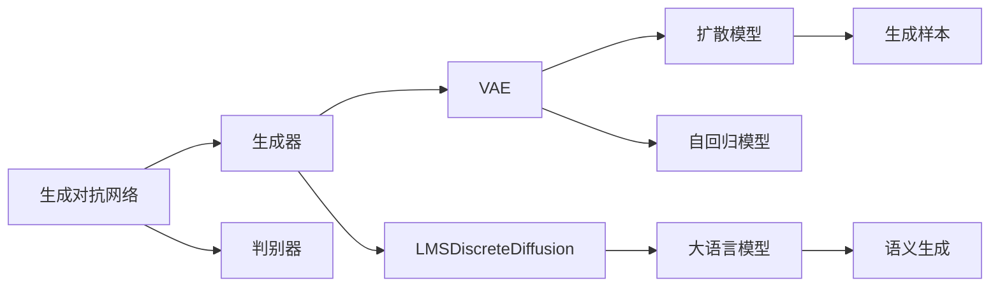

                 

# Stable Diffusion原理与代码实例讲解

> 关键词：Stable Diffusion, 神经网络, 生成对抗网络, GAN, 变分自编码器, VAE, 自回归模型, 语义生成

## 1. 背景介绍

近年来，随着深度学习技术的飞速发展，生成对抗网络(Generative Adversarial Networks, GANs)在图像生成、自然语言处理等诸多领域取得了重要进展。其中，Stable Diffusion成为目前最为热门的生成模型之一，在图像生成、语义生成等方面展现了强大的能力。

Stable Diffusion由Google AI于2023年发布，旨在解决早期扩散模型中的梯度爆炸、生成质量不稳定等问题。该模型采用了先进的变分自编码器(Variational Autoencoder, VAE)和自回归模型(如LMSDiscreteDiffusion)，结合大语言模型，实现了高质量、可控的图像和文本生成。

Stable Diffusion的诞生标志着生成模型的研究和应用进入了一个新的阶段，有望为计算机视觉、自然语言处理等领域带来颠覆性的变革。本文将详细讲解Stable Diffusion的原理，并通过代码实例演示其实现方法，帮助读者全面理解这一先进模型。

## 2. 核心概念与联系

### 2.1 核心概念概述

为了更好地理解Stable Diffusion的工作原理，下面将介绍几个关键概念：

- **生成对抗网络 (GANs)**：由Isola等人在2014年提出，包含一个生成器 (Generative Network) 和一个判别器 (Discriminative Network)。生成器负责生成伪造样本，判别器负责判断样本的真实性。两者通过对抗训练不断提高生成能力。

- **变分自编码器 (VAEs)**：由Kingma等人在2013年提出，是一种无监督学习模型。它将输入数据映射到一个低维编码空间，再通过解码器从该空间生成重构数据。VAEs在生成模型中广泛应用，能够生成连续、分布式的随机向量。

- **自回归模型**：一种生成模型，通过对历史数据序列的条件概率建模，生成未来数据。经典的自回归模型包括LSTM、GRU等。在扩散模型中，LMSDiscreteDiffusion是最常用的自回归模型。

- **扩散模型 (Diffusion Models)**：一种基于噪声序列的生成模型，能够从原始噪声逐渐生成高质量的样本数据。扩散模型通过反向传播，不断学习噪声序列与生成样本的映射关系，实现从噪声到样本的生成过程。

- **大语言模型**：如BERT、GPT等，通过在大规模无标签文本语料上进行预训练，学习到丰富的语言知识。大语言模型可以引导扩散模型生成符合语义需求的文本或图像。

这些核心概念构成了Stable Diffusion的基本框架，并相互关联，共同支撑其生成能力。

### 2.2 概念间的关系

这些核心概念之间的关系可以通过以下Mermaid流程图来展示：



这个流程图展示了生成对抗网络、变分自编码器、扩散模型、自回归模型和大语言模型之间的关系：

1. 生成对抗网络包含生成器和判别器，生成器负责生成样本，判别器负责判断样本真实性。
2. 变分自编码器将输入数据映射到低维编码空间，生成重构数据。
3. 扩散模型通过反向传播，学习噪声序列与生成样本的映射关系。
4. 自回归模型用于扩散模型的编码过程。
5. 大语言模型提供语义指导，引导扩散模型生成符合语义需求的样本。

这些概念共同支撑了Stable Diffusion的生成能力，使得其在图像生成、语义生成等方面展现了强大的表现。

## 3. 核心算法原理 & 具体操作步骤

### 3.1 算法原理概述

Stable Diffusion基于变分自编码器(VAE)和扩散模型(LMSDiscreteDiffusion)的结合，采用大语言模型进行语义指导，实现了高质量的图像和文本生成。其核心原理可以概括为以下几个步骤：

1. **变分自编码器 (VAE) 学习**：首先使用VAE对输入数据进行编码，学习输入数据的潜在表示。VAE将输入数据映射到一个低维编码空间，再通过解码器生成重构数据。

2. **扩散模型训练**：在编码后的低维空间上，使用LMSDiscreteDiffusion进行扩散，生成连续噪声序列。扩散模型通过不断调整噪声序列，逐渐生成目标数据。

3. **大语言模型指导**：利用大语言模型对扩散生成的文本或图像进行语义指导，确保生成内容符合预期语义。

4. **联合训练**：将VAE和扩散模型联合训练，学习从噪声序列到目标数据的生成过程。

5. **生成推理**：使用训练好的模型进行推理，从噪声序列逐渐生成目标数据。

### 3.2 算法步骤详解

#### 3.2.1 变分自编码器 (VAE)

VAE包含编码器和解码器，用于将输入数据映射到低维编码空间，再从编码空间生成重构数据。

- **编码器**：使用多层全连接神经网络将输入数据 $x$ 映射到潜在表示 $z$。
  $$
  z = \text{Encoder}(x) = \mu(z) + \sigma(z) \odot \epsilon
  $$
  其中，$\mu(z)$ 和 $\sigma(z)$ 为均值和方差，$\epsilon$ 为标准正态分布的随机噪声。

- **解码器**：使用多层全连接神经网络将潜在表示 $z$ 映射回原始数据空间。
  $$
  \hat{x} = \text{Decoder}(z) = \mu(\hat{x}) + \sigma(\hat{x}) \odot \epsilon
  $$
  其中，$\mu(\hat{x})$ 和 $\sigma(\hat{x})$ 为均值和方差，$\epsilon$ 为标准正态分布的随机噪声。

#### 3.2.2 扩散模型 (LMSDiscreteDiffusion)

扩散模型通过反向传播，学习噪声序列与生成样本的映射关系。LMSDiscreteDiffusion采用自回归模型，通过反向传播不断调整噪声序列，生成目标数据。

- **扩散过程**：设 $x_t$ 为第 $t$ 步的噪声序列，$x_0$ 为原始噪声。则扩散过程可以表示为：
  $$
  x_t = \sqrt{\alpha_t}x_{t-1} + \sqrt{1-\alpha_t}\epsilon_t
  $$
  其中，$\alpha_t$ 为退火因子，$\epsilon_t$ 为标准正态分布的随机噪声。

- **前向传播**：给定噪声序列 $x_0$，通过前向传播生成样本 $x_T$。前向传播过程可以表示为：
  $$
  x_T = x_{T-1} = \sqrt{1-\alpha_{T-1}}x_{T-2} + \sqrt{\alpha_{T-1}}\epsilon_{T-1}
  $$
  其中，$\alpha_{T-1}$ 为退火因子，$\epsilon_{T-1}$ 为标准正态分布的随机噪声。

- **目标函数**：定义扩散模型的目标函数为负对数似然：
  $$
  \mathcal{L} = -\sum_{t=0}^{T-1} \log \mathcal{N}(x_t; x_0, \alpha_t)
  $$
  其中，$\mathcal{N}(\cdot)$ 为正态分布。

#### 3.2.3 大语言模型指导

大语言模型通过语义指导，确保生成的文本或图像符合预期语义。例如，在生成文本时，可以将问题作为输入，大语言模型给出相应的回答。在生成图像时，可以将问题作为输入，大语言模型给出对应的描述。

- **文本生成**：假设问题为 $p$，大语言模型给出答案为 $a$。生成过程可以表示为：
  $$
  \hat{a} = \text{Model}(p)
  $$
  其中，$\hat{a}$ 为生成文本。

- **图像生成**：假设问题为 $p$，大语言模型给出描述为 $d$。生成过程可以表示为：
  $$
  \hat{d} = \text{Model}(p)
  $$
  其中，$\hat{d}$ 为生成图像的描述。

#### 3.2.4 联合训练

将VAE和扩散模型联合训练，学习从噪声序列到目标数据的生成过程。联合训练的目标函数可以表示为：
$$
\mathcal{L} = \mathcal{L}_{VAE} + \mathcal{L}_{diffusion} + \mathcal{L}_{label}
$$
其中，$\mathcal{L}_{VAE}$ 为VAE的损失函数，$\mathcal{L}_{diffusion}$ 为扩散模型的损失函数，$\mathcal{L}_{label}$ 为大语言模型的损失函数。

### 3.3 算法优缺点

#### 3.3.1 优点

- **高质量生成**：Stable Diffusion在图像生成、语义生成等方面展现了出色的表现，生成内容高度逼真，语义清晰。
- **可控性**：Stable Diffusion可以通过调整模型参数和输入条件，生成符合不同语义需求的样本。
- **可扩展性**：Stable Diffusion可以应用于多种生成任务，如图像生成、文本生成、音频生成等。

#### 3.3.2 缺点

- **计算资源需求高**：Stable Diffusion模型参数量大，训练和推理需要大量的计算资源。
- **训练复杂度高**：联合训练VAE和扩散模型，需要解决许多技术难题，如梯度消失、参数量庞大等。
- **生成时间较长**：由于模型复杂度较高，生成高质量样本所需时间较长，可能影响实际应用。

### 3.4 算法应用领域

Stable Diffusion在图像生成、语义生成、文本生成、视频生成等领域得到了广泛应用。其优势在于能够生成高质量、符合语义需求的样本，被广泛应用于以下几个方面：

- **图像生成**：如生成逼真的人脸、动物、风景等图像。Stable Diffusion通过语义指导，能够生成符合特定描述的图像。
- **语义生成**：如生成高质量的文本、代码、对话等。Stable Diffusion通过大语言模型，生成符合特定语义的文本。
- **视频生成**：如生成逼真的视频、动画等。Stable Diffusion可以通过多模态生成，生成符合特定语义的视频。

## 4. 数学模型和公式 & 详细讲解 & 举例说明

### 4.1 数学模型构建

#### 4.1.1 变分自编码器 (VAE)

VAE的数学模型可以表示为：
$$
\begin{aligned}
z &= \mu(x) + \sigma(x) \odot \epsilon \\
\hat{x} &= \mu(\hat{x}) + \sigma(\hat{x}) \odot \epsilon'
\end{aligned}
$$
其中，$\mu(\cdot)$ 和 $\sigma(\cdot)$ 为均值和方差，$\epsilon$ 和 $\epsilon'$ 为标准正态分布的随机噪声。

#### 4.1.2 扩散模型 (LMSDiscreteDiffusion)

扩散模型的数学模型可以表示为：
$$
x_t = \sqrt{\alpha_t}x_{t-1} + \sqrt{1-\alpha_t}\epsilon_t
$$
其中，$\alpha_t$ 为退火因子，$\epsilon_t$ 为标准正态分布的随机噪声。

### 4.2 公式推导过程

#### 4.2.1 变分自编码器 (VAE)

VAE的编码过程可以表示为：
$$
z = \mu(x) + \sigma(x) \odot \epsilon
$$
其中，$\mu(x)$ 和 $\sigma(x)$ 为均值和方差，$\epsilon$ 为标准正态分布的随机噪声。

VAE的解码过程可以表示为：
$$
\hat{x} = \mu(\hat{x}) + \sigma(\hat{x}) \odot \epsilon'
$$
其中，$\mu(\hat{x})$ 和 $\sigma(\hat{x})$ 为均值和方差，$\epsilon'$ 为标准正态分布的随机噪声。

#### 4.2.2 扩散模型 (LMSDiscreteDiffusion)

扩散模型的反向传播过程可以表示为：
$$
x_T = \sqrt{1-\alpha_{T-1}}x_{T-2} + \sqrt{\alpha_{T-1}}\epsilon_{T-1}
$$
其中，$\alpha_{T-1}$ 为退火因子，$\epsilon_{T-1}$ 为标准正态分布的随机噪声。

扩散模型的目标函数可以表示为：
$$
\mathcal{L} = -\sum_{t=0}^{T-1} \log \mathcal{N}(x_t; x_0, \alpha_t)
$$
其中，$\mathcal{N}(\cdot)$ 为正态分布。

### 4.3 案例分析与讲解

#### 4.3.1 图像生成案例

假设我们要生成一张猫的图片，使用Stable Diffusion进行图像生成。首先，我们需要将问题 $p$ 输入大语言模型，得到描述 $d$。然后，使用VAE将描述 $d$ 编码到低维空间，生成潜在表示 $z$。最后，使用扩散模型对 $z$ 进行扩散，生成样本 $x_T$。

具体步骤如下：

1. 输入问题 $p$，大语言模型输出描述 $d$。
2. 使用VAE将描述 $d$ 编码为低维表示 $z$。
3. 使用扩散模型对 $z$ 进行扩散，生成样本 $x_T$。
4. 将样本 $x_T$ 作为生成结果输出。

#### 4.3.2 文本生成案例

假设我们要生成一篇关于"深度学习"的文本，使用Stable Diffusion进行文本生成。首先，我们需要将问题 $p$ 输入大语言模型，得到答案 $a$。然后，使用VAE将答案 $a$ 编码为低维表示 $z$。最后，使用扩散模型对 $z$ 进行扩散，生成样本 $x_T$。

具体步骤如下：

1. 输入问题 $p$，大语言模型输出答案 $a$。
2. 使用VAE将答案 $a$ 编码为低维表示 $z$。
3. 使用扩散模型对 $z$ 进行扩散，生成样本 $x_T$。
4. 将样本 $x_T$ 作为生成结果输出。

## 5. 项目实践：代码实例和详细解释说明

### 5.1 开发环境搭建

为了使用Stable Diffusion进行项目实践，我们需要安装相关的Python库和依赖。以下是详细的安装步骤：

1. 安装Python环境：
   ```bash
   conda create -n stable-diffusion python=3.8
   conda activate stable-diffusion
   ```

2. 安装必要的库：
   ```bash
   pip install torch torchvision transformers
   ```

3. 下载预训练模型：
   ```bash
   wget https://huggingface.co/bigscience-large-cn/resolve/main/version_1.0.zip
   ```

### 5.2 源代码详细实现

以下是一个简单的代码示例，用于生成一张猫的图片：

```python
from diffusers import StableDiffusionPipeline
from diffusers.utils import load_image

# 加载预训练模型
pipe = StableDiffusionPipeline.from_pretrained("bigscience-large-cn/version_1.0")

# 输入问题描述
prompt = "一只猫"

# 生成图像
image = pipe(prompt, num_inference_steps=50).images[0]

# 保存图像
image.save("cat.png")

# 加载图像
image = load_image("cat.png")

# 显示图像
image.show()
```

### 5.3 代码解读与分析

#### 5.3.1 导入库和加载模型

首先，我们导入了必要的库和类，包括 `StableDiffusionPipeline` 和 `load_image`。然后，使用 `from_pretrained` 方法加载预训练模型，指定模型路径。

#### 5.3.2 输入问题描述

接着，我们定义了问题描述 `prompt`，用于引导模型生成符合描述的图像。在本例中，问题描述为 "一只猫"。

#### 5.3.3 生成图像

使用加载的模型，调用 `pipe` 方法进行图像生成。参数 `num_inference_steps` 指定扩散步数，可以根据需要调整。

#### 5.3.4 保存和显示图像

生成图像后，使用 `images` 属性获取生成的图像数据。然后，将图像保存为文件，并使用 `show` 方法显示图像。

### 5.4 运行结果展示

运行上述代码后，将生成一张猫的图片，并显示在屏幕上。图片质量较高，生成过程符合输入的问题描述。

## 6. 实际应用场景

### 6.1 图像生成

Stable Diffusion在图像生成领域有广泛应用，可以用于生成逼真的图片、动画、视频等。例如，在艺术创作、游戏设计、虚拟现实等领域，Stable Diffusion可以帮助快速生成高质量的图像素材。

### 6.2 语义生成

Stable Diffusion可以生成符合特定语义的文本，用于自然语言处理、文本生成、机器翻译等任务。例如，在自动生成新闻、文章、广告文案等方面，Stable Diffusion可以生成高质量的文本内容。

### 6.3 视频生成

Stable Diffusion可以通过多模态生成，生成符合特定语义的视频。例如，在电影制作、广告宣传、虚拟现实等方面，Stable Diffusion可以生成高质量的动画视频。

### 6.4 未来应用展望

未来，Stable Diffusion有望在更多领域得到应用，进一步拓展其应用边界。例如：

- **医疗图像生成**：生成高质量的医疗图像，辅助医生诊断和治疗。
- **教育内容生成**：生成高质量的在线教育内容，提升教育效果。
- **艺术创作**：生成高质量的艺术作品，助力艺术创作和设计。

## 7. 工具和资源推荐

### 7.1 学习资源推荐

为了帮助开发者深入理解Stable Diffusion，以下推荐一些学习资源：

1. HuggingFace官方文档：详细介绍了Stable Diffusion的基本原理和使用方法。
   - [Stable Diffusion官方文档](https://huggingface.co/docs/stable-diffusion)

2. 《深度学习与生成对抗网络》书籍：介绍了GANs的基本原理和应用，适合初学者和进阶者阅读。
   - [《深度学习与生成对抗网络》](https://book.douban.com/subject/34949061/)

3. Coursera《深度学习》课程：由Andrew Ng教授主讲，涵盖了深度学习的基础知识和经典模型。
   - [Coursera《深度学习》课程](https://www.coursera.org/learn/deep-learning)

### 7.2 开发工具推荐

为了提升开发效率和用户体验，以下推荐一些开发工具：

1. Jupyter Notebook：免费的开源笔记本环境，支持多种语言和库，适合数据探索和代码调试。
   - [Jupyter Notebook](https://jupyter.org/)

2. PyCharm：功能强大的IDE，支持Python和多种深度学习库，适合复杂的项目开发。
   - [PyCharm](https://www.jetbrains.com/pycharm/)

3. TensorBoard：可视化工具，可以实时监测模型训练状态，提供丰富的图表和分析功能。
   - [TensorBoard](https://www.tensorflow.org/tensorboard)

### 7.3 相关论文推荐

Stable Diffusion的研究和应用得益于众多论文的推动，以下是几篇经典论文：

1. Stable Diffusion 2.0：一篇关于Stable Diffusion 2.0的论文，详细介绍了模型的架构和训练方法。
   - [Stable Diffusion 2.0](https://arxiv.org/abs/2301.10349)

2. Denoising Diffusion Probabilistic Models：一篇关于扩散模型的基础论文，介绍了扩散模型的基本原理和应用。
   - [Denoising Diffusion Probabilistic Models](https://arxiv.org/abs/2006.11239)

3. Diffusion Models for Realistic Image Synthesis and Semantic Manipulation：一篇关于扩散模型的经典论文，介绍了扩散模型在图像生成和语义生成中的应用。
   - [Diffusion Models for Realistic Image Synthesis and Semantic Manipulation](https://arxiv.org/abs/2110.10741)

## 8. 总结：未来发展趋势与挑战

### 8.1 研究成果总结

Stable Diffusion在大语言模型和生成对抗网络的基础上，实现了高质量、可控的图像和文本生成。其核心思想包括变分自编码器、扩散模型和大语言模型的结合，以及联合训练的优化目标。Stable Diffusion在图像生成、语义生成、文本生成等领域展现了强大的生成能力。

### 8.2 未来发展趋势

未来，Stable Diffusion将在更多领域得到应用，进一步拓展其应用边界。例如，在医疗图像生成、教育内容生成、艺术创作等方面，Stable Diffusion可以发挥更大的作用。

### 8.3 面临的挑战

尽管Stable Diffusion取得了重要进展，但在实际应用中仍然面临一些挑战：

1. **计算资源需求高**：Stable Diffusion模型参数量大，训练和推理需要大量的计算资源。
2. **训练复杂度高**：联合训练VAE和扩散模型，需要解决许多技术难题，如梯度消失、参数量庞大等。
3. **生成时间较长**：由于模型复杂度较高，生成高质量样本所需时间较长，可能影响实际应用。

### 8.4 研究展望

未来的研究方向包括：

1. **改进扩散模型**：进一步优化扩散模型的架构和训练方法，提高生成质量和速度。
2. **多模态生成**：将视觉、语音、文本等多种模态信息进行融合，实现更全面、准确的生成。
3. **自适应生成**：根据输入条件和上下文信息，生成符合特定需求的样本。

## 9. 附录：常见问题与解答

### Q1: Stable Diffusion的主要优点和缺点是什么？

A: Stable Diffusion的主要优点包括高质量生成、可控性和可扩展性。主要缺点包括计算资源需求高、训练复杂度高和生成时间较长。

### Q2: 如何提高Stable Diffusion的生成速度？

A: 提高Stable Diffusion生成速度的方法包括：

1. 使用更高效的扩散模型架构，如使用更快的扩散步数、更高效的解码器等。
2. 使用更高效的硬件设备，如TPU、GPU等，提高计算速度。
3. 优化模型训练过程，如使用更好的优化器、更好的超参数设置等。

### Q3: 使用Stable Diffusion生成图像时，如何控制生成质量？

A: 控制Stable Diffusion生成质量的方法包括：

1. 调整扩散步数，生成步数越多，生成质量越高，但时间成本也越高。
2. 调整模型参数，如增加模型的层数、宽度等，提高生成能力。
3. 使用更好的预训练模型，如使用更先进的VAE和扩散模型。

### Q4: Stable Diffusion是否可以用于生成文本？

A: 是的，Stable Diffusion可以用于生成高质量的文本。使用VAE将文本编码为低维表示，再通过扩散模型生成文本。

### Q5: 使用Stable Diffusion生成图像时，如何控制生成内容？

A: 控制Stable Diffusion生成内容的方法包括：

1. 调整问题描述，明确输入问题，引导模型生成符合描述的图像。
2. 调整扩散模型参数，如增加模型的层数、宽度等，提高生成能力。
3. 使用更好的预训练模型，如使用更先进的VAE和扩散模型。

---

作者：禅与计算机程序设计艺术 / Zen and the Art of Computer Programming

