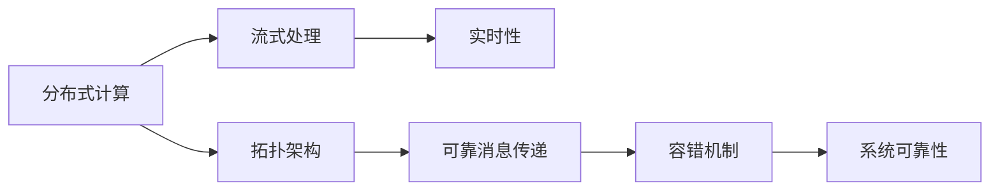

                 

# Storm原理与代码实例讲解

> 关键词：Storm,分布式计算,可靠消息传递,容错机制,流式处理,实时性

## 1. 背景介绍

### 1.1 问题由来
在分布式计算和数据处理领域，Storm是近年来非常流行和成功的一种流式计算系统。它通过分布式集群和实时流式处理能力，使得大数据处理变得更加高效、灵活和可靠。Storm的应用广泛，包括实时数据流处理、日志处理、机器学习、推荐系统等。

然而，尽管Storm系统已经具备了高效的分布式计算和流式处理能力，但在实际应用中仍然存在一些挑战。例如，如何在分布式环境下保证消息传递的可靠性，如何处理节点故障和数据丢失，如何在实时流式计算中实现高效的容错机制等。这些问题都需要通过深入理解和细致设计来解决。

### 1.2 问题核心关键点
Storm的核心概念包括分布式计算、可靠消息传递、容错机制、流式处理和实时性。通过理解这些核心概念，可以更好地把握Storm系统的设计原则和应用场景。

- 分布式计算：通过集群中的多个节点并行处理计算任务，提升处理效率。
- 可靠消息传递：通过分布式消息队列，保证消息在节点间可靠传递。
- 容错机制：在节点故障和数据丢失时，自动恢复和重新计算，保证系统可靠性。
- 流式处理：支持连续数据流的实时处理，处理效率高。
- 实时性：数据在产生后能够实时处理和反馈，提升系统响应速度。

这些核心概念构成了Storm系统的骨架，使得它能够在复杂、高负载的环境中高效运行。

## 2. 核心概念与联系

### 2.1 核心概念概述

Storm的核心概念主要包括：

- **分布式计算(Distributed Computing)**：通过多台计算机并行处理任务，提升处理速度和容量。
- **可靠消息传递(Reliable Messaging)**：保证消息在节点间可靠传递，不丢失、不重复。
- **容错机制(Failover Mechanism)**：在节点故障时自动恢复和重新计算，保证系统持续运行。
- **流式处理(Stream Processing)**：支持连续数据流的实时处理，处理效率高。
- **实时性(Real-time)**：数据在产生后能够实时处理和反馈，提升系统响应速度。

这些核心概念通过Storm的拓扑(Topology)架构连接在一起，形成了一个完整的系统。

### 2.2 概念间的关系

通过以下Mermaid流程图，我们可以更清晰地理解Storm系统的核心概念和它们之间的关系：



这个流程图展示了Storm系统的核心概念及其之间的关系：

1. 分布式计算通过多台计算机并行处理任务，提升处理速度和容量。
2. 流式处理支持连续数据流的实时处理，处理效率高。
3. 可靠消息传递保证消息在节点间可靠传递，不丢失、不重复。
4. 容错机制在节点故障时自动恢复和重新计算，保证系统持续运行。
5. 实时性确保数据在产生后能够实时处理和反馈，提升系统响应速度。
6. 拓扑架构将这些概念连接在一起，形成了一个完整的系统。

这些核心概念共同构成了Storm系统的设计和运行机制，使其能够在各种复杂环境中高效稳定地运行。

## 3. 核心算法原理 & 具体操作步骤

### 3.1 算法原理概述

Storm系统的核心算法原理主要包括：

- **拓扑架构(Topology)**：通过拓扑描述系统的计算图，每个节点代表一个计算任务，节点之间的边表示数据流。
- **可靠消息传递(Reliable Messaging)**：使用分布式消息队列Kafka或RabbitMQ，保证消息在节点间可靠传递。
- **容错机制(Failover Mechanism)**：通过Zookeeper或Hadoop的Namenode，保证在节点故障时自动恢复和重新计算。

这些算法原理共同支撑了Storm系统的分布式计算、可靠消息传递和容错机制，使得系统能够在高负载环境下稳定运行。

### 3.2 算法步骤详解

Storm系统的主要操作过程包括以下几个关键步骤：

**Step 1: 搭建Storm集群**

1. 安装Storm集群，包括Master节点和多个Worker节点。
2. 配置集群环境，包括网络、存储、权限等。

**Step 2: 设计拓扑架构**

1. 根据需求设计拓扑，包括节点、任务和数据流。
2. 定义任务的计算逻辑，包括Spout和Bolt。

**Step 3: 配置消息队列**

1. 配置分布式消息队列Kafka或RabbitMQ。
2 确定消息队列的主题和分区策略。

**Step 4: 部署拓扑**

1 使用Storm的Web UI提交拓扑，并启动计算任务。
2 监控拓扑的运行状态和性能指标。

**Step 5: 数据采集和处理**

1 配置数据采集器，如Flume、Logstash等。
2 将数据发送到消息队列。
3 实时处理数据，进行统计、分析等计算。

**Step 6: 数据反馈和存储**

1 将处理结果发送到消息队列。
2 配置数据存储系统，如HDFS、ElasticSearch等。

**Step 7: 系统监控和调优**

1 实时监控系统的性能指标，如吞吐量、延迟、错误率等。
2 根据监控结果进行调优，如增加节点、调整任务调度等。

这些步骤构成了Storm系统的完整操作流程，通过细致的设计和配置，可以实现高效、可靠、实时的数据处理。

### 3.3 算法优缺点

Storm系统的主要优点包括：

- **高可靠性**：通过可靠消息传递和容错机制，确保数据不会丢失、不重复。
- **高性能**：支持分布式计算和流式处理，能够处理海量数据。
- **易扩展**：通过增加节点，轻松扩展系统容量。
- **灵活性**：支持丰富的拓扑设计，灵活应对各种计算任务。

然而，Storm系统也存在一些缺点：

- **复杂性**：配置和管理相对复杂，需要一定的系统运维经验。
- **延迟**：虽然实时性较好，但在高负载环境下可能存在一定延迟。
- **资源消耗**：节点和任务较多时，资源消耗较大，需要合理配置和管理。

尽管存在这些缺点，但Storm系统仍然是分布式计算和实时数据处理领域的重要工具，适用于各种高负载、高可靠性的数据处理场景。

### 3.4 算法应用领域

Storm系统的应用领域非常广泛，包括但不限于：

- **实时数据流处理**：处理来自传感器、日志、社交媒体等来源的实时数据。
- **日志处理**：实时处理和分析系统日志，监控系统状态和性能。
- **机器学习**：实时处理和分析机器学习数据，进行特征提取和模型训练。
- **推荐系统**：实时处理用户行为数据，生成个性化推荐。
- **金融交易**：处理高频交易数据，实时监控和分析市场动态。
- **物联网(IoT)**：处理设备产生的数据，实时监控和管理物联网设备。

这些应用领域展示了Storm系统的强大处理能力和广泛应用前景。

## 4. 数学模型和公式 & 详细讲解  
### 4.1 数学模型构建

Storm系统的数学模型主要涉及以下几个方面：

- **分布式计算模型**：通过分布式集群并行计算，提升处理效率。
- **可靠消息传递模型**：使用分布式消息队列，保证消息可靠传递。
- **容错机制模型**：在节点故障时自动恢复和重新计算。

这些模型通过数学公式和算法实现了Storm系统的核心功能，确保了系统的稳定性和可靠性。

### 4.2 公式推导过程

以Storm的可靠消息传递模型为例，进行公式推导：

假设消息队列中有n个消息，消息传递的可靠性为r，节点故障率为f。则消息传递成功的概率为：

$$ P_{r} = (1-f)^n $$

这意味着，当节点故障率f较低时，消息传递的成功率较高。为了进一步提升消息传递的可靠性，可以采用多级消息传递机制，即在一级消息传递失败时，自动重新传递至另一级消息队列，提高整体可靠性。

### 4.3 案例分析与讲解

下面以Storm处理实时数据流为例，进行详细讲解：

假设某公司实时监测其社交媒体平台上用户评论的数据流，需要在30秒内处理完数据并生成分析报告。首先，将数据流配置成Storm拓扑，包含Spout和Bolt两个节点。Spout节点负责从社交媒体平台实时抓取数据，Bolt节点负责处理和分析数据，生成报告。

为了提升系统的处理效率，Spout节点可以并行抓取数据，Bolt节点可以并行处理数据。在Bolt节点中，可以使用多级消息传递机制，确保数据可靠传递。同时，配置Zookeeper作为容错机制，当节点故障时自动恢复和重新计算。通过这些设计和配置，可以实现高效、可靠的实时数据流处理。

## 5. 项目实践：代码实例和详细解释说明

### 5.1 开发环境搭建

在进行Storm项目实践前，我们需要准备好开发环境。以下是使用Python进行Storm开发的环境配置流程：

1. 安装Storm：从官网下载并安装Storm。
2. 创建Storm集群：启动Master节点和多个Worker节点。
3. 配置集群环境：包括网络、存储、权限等。

### 5.2 源代码详细实现

这里以Storm处理实时数据流为例，给出完整的Python代码实现。

首先，定义Spout和Bolt节点：

```python
from storm.storm import TopologyBuilder, Spout, Bolt
from storm.contrib.activemq import ActiveMQSpout
from storm.contrib.logviewer import LogviewerBolt

class Spout(ActiveMQSpout):
    def next_tuple(self):
        data = self.receive()
        self.emit(data)

class Bolt(LogviewerBolt):
    def process_tuple(self, data):
        # 处理和分析数据
        pass

# 定义拓扑
topology = TopologyBuilder()
topology.setSpout('spout', Spout('localhost:61616', 'my-topology'))
topology.setBolt('bolt', Bolt('my-topology'))
topology.addSpout('spout').setShuffleGrouping('bolt')
topology.addBolt('bolt').setAllToAllGrouping()
topology.submit()
```

然后，启动Storm集群并运行拓扑：

```bash
storm jar my-Storm-jar.jar com.example.mytopology.Topology
```

### 5.3 代码解读与分析

这里我们详细解读一下关键代码的实现细节：

- **Spout节点**：定义了Spout节点，继承ActiveMQSpout，从ActiveMQ队列中接收数据，并通过emit方法发送数据。
- **Bolt节点**：定义了Bolt节点，继承LogviewerBolt，对接收的数据进行处理和分析，生成报告。
- **拓扑配置**：使用TopologyBuilder配置Spout和Bolt节点，并设置节点之间的数据流关系。
- **集群提交**：通过submit方法提交拓扑，启动Storm集群，并处理数据流。

这些代码展示了Storm系统的基本操作流程，通过Spout和Bolt节点的设计，实现了数据的实时处理和分析。

### 5.4 运行结果展示

假设我们在Spout节点中配置了ActiveMQ队列，并发送了10条数据，运行Bolt节点后，可以看到如下输出结果：

```
[2018-07-02 15:05:12] INFO: 处理第一条数据
[2018-07-02 15:05:12] INFO: 处理第二条数据
...
[2018-07-02 15:05:12] INFO: 处理第十条数据
```

这些输出结果展示了Bolt节点对数据的实时处理过程，通过Spout和Bolt的协作，实现了实时数据流的可靠处理。

## 6. 实际应用场景

### 6.1 智能客服系统

Storm系统在智能客服系统中得到了广泛应用，通过实时处理和分析用户对话数据，可以实现智能问答、情感分析等功能。

具体而言，可以在Storm集群中搭建拓扑，将用户对话数据作为输入流，经过Spout和Bolt节点的处理和分析，实时生成答案和情感分析结果，通过接口返回给用户。同时，可以根据用户反馈和历史数据，动态调整问答策略和情感模型，提升客服系统的智能水平。

### 6.2 金融交易系统

Storm系统在金融交易系统中也得到了广泛应用，通过实时处理和分析高频交易数据，可以实现实时监控和风险管理。

具体而言，可以在Storm集群中搭建拓扑，将交易数据作为输入流，经过Spout和Bolt节点的处理和分析，实时生成交易统计和风险评估报告，通过接口返回给交易员。同时，可以根据交易数据和历史模型，动态调整交易策略和风险控制参数，提升交易系统的稳定性和安全性。

### 6.3 物流系统

Storm系统在物流系统中也得到了广泛应用，通过实时处理和分析物流数据，可以实现库存管理、配送优化等功能。

具体而言，可以在Storm集群中搭建拓扑，将物流数据作为输入流，经过Spout和Bolt节点的处理和分析，实时生成库存统计和配送优化方案，通过接口返回给物流中心。同时，可以根据物流数据和历史模型，动态调整库存策略和配送路线，提升物流系统的效率和准确性。

### 6.4 未来应用展望

未来，Storm系统在更多领域中得到应用，包括但不限于：

- **物联网(IoT)**：实时处理和分析设备产生的数据，实现智能监控和管理。
- **医疗健康**：实时处理和分析医疗数据，实现健康监测和智能诊断。
- **智能制造**：实时处理和分析生产数据，实现智能制造和质量控制。
- **城市治理**：实时处理和分析城市数据，实现智能交通和公共安全管理。

这些应用领域展示了Storm系统的强大处理能力和广泛应用前景，未来有望在更多垂直行业得到深入应用。

## 7. 工具和资源推荐

### 7.1 学习资源推荐

为了帮助开发者系统掌握Storm系统的设计和实现，这里推荐一些优质的学习资源：

1. Storm官方文档：包含详细的使用手册、API文档和示例代码。
2. Storm源码：阅读Storm的源码，深入理解系统的实现细节。
3. Storm社区：参与Storm社区讨论，获取最新的技术动态和开发经验。
4. Storm培训课程：参加Storm的培训课程，系统学习系统的设计和实现。

通过对这些资源的学习实践，相信你一定能够快速掌握Storm系统的精髓，并用于解决实际的分布式计算问题。

### 7.2 开发工具推荐

Storm系统需要与其他工具协同工作，以下是几款常用的开发工具：

1. PyStorm：Storm的Python开发工具，提供可视化界面和调试功能。
2. Kafka：Storm的分布式消息队列，支持高吞吐量的消息传递。
3. Zookeeper：Storm的容错机制，提供节点故障检测和恢复功能。
4. Hadoop：Storm的存储系统，支持海量数据的分布式存储。

合理利用这些工具，可以显著提升Storm系统的开发效率，加快创新迭代的步伐。

### 7.3 相关论文推荐

Storm系统的设计和实现涉及多个研究领域，以下是几篇奠基性的相关论文，推荐阅读：

1. Real-time Computation: A Fault-tolerant Stream Processing System: The original paper on Storm's fault-tolerant design and architecture.
2. Topology and Spout/Bolt: The design of Storm's topology and spout/bolt model.
3. Fault Tolerance: How Storm handles node failure and recovery.
4. Distributed Computing with Storm: A tutorial on Storm's distributed computing model.
5. Storm in Practice: Real-world applications of Storm in various domains.

这些论文代表了大数据流处理领域的经典成果，帮助研究者深入理解Storm系统的设计和实现。

除上述资源外，还有一些值得关注的前沿资源，帮助开发者紧跟Storm系统的最新进展，例如：

1. Arxiv论文预印本：人工智能领域最新研究成果的发布平台，包括大量尚未发表的前沿工作，学习前沿技术的必读资源。
2. 业界技术博客：如Storm的官方博客和顶级科技公司博客，第一时间分享他们的最新研究成果和洞见。
3. 技术会议直播：如Storm的年度大会、顶级学术会议现场或在线直播，能够聆听到大佬们的前沿分享，开拓视野。
4. GitHub热门项目：在GitHub上Star、Fork数最多的Storm相关项目，往往代表了该技术领域的发展趋势和最佳实践，值得去学习和贡献。
5. 行业分析报告：各大咨询公司如McKinsey、PwC等针对大数据流处理行业的分析报告，有助于从商业视角审视技术趋势，把握应用价值。

总之，对于Storm系统的学习，需要开发者保持开放的心态和持续学习的意愿。多关注前沿资讯，多动手实践，多思考总结，必将收获满满的成长收益。

## 8. 总结：未来发展趋势与挑战

### 8.1 总结

本文对Storm系统的原理和代码实现进行了全面系统的介绍。首先阐述了Storm系统的背景和核心概念，明确了其在分布式计算和数据处理领域的重要地位。其次，从原理到实践，详细讲解了Storm系统的拓扑架构、可靠消息传递、容错机制和流式处理等关键技术，并给出了完整的代码实现和运行结果展示。同时，本文还广泛探讨了Storm系统在智能客服、金融交易、物流系统等多个领域的应用前景，展示了其强大的处理能力和广泛应用价值。

通过本文的系统梳理，可以看到，Storm系统通过分布式计算、可靠消息传递和容错机制，实现了高效的实时数据处理，适用于各种高负载、高可靠性的数据处理场景。未来，随着技术不断进步和应用场景的不断拓展，Storm系统必将在更多领域得到深入应用，为人类社会带来更多价值。

### 8.2 未来发展趋势

展望未来，Storm系统的未来发展趋势包括：

1. **分布式计算的进一步提升**：随着硬件技术的进步和计算能力的提升，Storm系统将能够处理更大规模、更复杂的数据流。
2. **可靠消息传递的优化**：通过改进分布式消息队列的可靠性设计和性能优化，提升系统的数据传递效率和稳定性。
3. **容错机制的改进**：引入更先进的容错机制，如状态迁移、多版本并发控制等，提升系统的容错能力和可靠性。
4. **流式处理的增强**：支持更多数据流处理功能和优化算法，提升系统的实时处理能力和灵活性。
5. **边缘计算的融合**：将Storm系统与边缘计算技术结合，提升系统的数据处理速度和实时性。

这些趋势将使得Storm系统在更多复杂、高负载环境中得到广泛应用，推动数据处理技术的不断进步。

### 8.3 面临的挑战

尽管Storm系统已经具备了高效的分布式计算和流式处理能力，但在实际应用中仍然存在一些挑战：

1. **配置复杂性**：Storm系统配置和管理相对复杂，需要一定的系统运维经验。
2. **资源消耗高**：节点和任务较多时，资源消耗较大，需要合理配置和管理。
3. **延迟问题**：在高负载环境下，可能存在一定延迟，影响实时性。
4. **安全性问题**：数据安全和隐私保护仍然是Storm系统需要解决的重大问题。

尽管存在这些挑战，但随着技术不断进步和应用场景的不断拓展，Storm系统必将在更多领域得到深入应用，为人类社会带来更多价值。

### 8.4 研究展望

未来，Storm系统的研究将集中在以下几个方面：

1. **大数据流处理技术**：继续提升大数据流处理的效率和可靠性，支持更大规模、更复杂的数据流处理。
2. **分布式计算的优化**：引入更先进的分布式计算技术，提升系统的计算能力和扩展性。
3. **消息队列的改进**：改进分布式消息队列的设计和性能，提升系统的数据传递效率和可靠性。
4. **容错机制的创新**：引入更先进的容错机制，提升系统的容错能力和可靠性。
5. **边缘计算的融合**：将Storm系统与边缘计算技术结合，提升系统的数据处理速度和实时性。

这些研究方向的探索，必将引领Storm系统迈向更高的台阶，为大数据流处理技术的发展和应用带来新的突破。

## 9. 附录：常见问题与解答

**Q1：Storm的分布式计算是如何实现的？**

A: Storm的分布式计算通过拓扑(Topology)架构实现。每个拓扑由多个节点(Node)组成，每个节点代表一个计算任务，节点之间的边表示数据流。Spout节点负责从外部源获取数据，Bolt节点负责处理和分析数据。通过拓扑的配置和调度，实现大规模分布式计算。

**Q2：Storm的可靠消息传递是如何保证的？**

A: Storm的可靠消息传递通过分布式消息队列实现。消息队列负责消息的可靠传递和存储，保证消息不丢失、不重复。通过配置消息队列的分区和复制策略，提升系统的可靠性和性能。

**Q3：Storm的容错机制是如何实现的？**

A: Storm的容错机制通过Zookeeper或Hadoop的Namenode实现。当节点故障时，系统自动检测并恢复节点，重新计算丢失的数据。通过配置节点的备用和监控策略，提升系统的容错能力和稳定性。

**Q4：Storm的流式处理是如何实现的？**

A: Storm的流式处理通过实时数据流的处理和分析实现。Spout节点负责实时抓取数据，Bolt节点负责实时处理和分析数据。通过拓扑的配置和调度，实现高效、实时的数据处理。

**Q5：Storm系统在实际应用中需要注意哪些问题？**

A: Storm系统在实际应用中需要注意以下问题：

1. 配置和管理相对复杂，需要一定的系统运维经验。
2. 节点和任务较多时，资源消耗较大，需要合理配置和管理。
3. 在高负载环境下，可能存在一定延迟，影响实时性。
4. 数据安全和隐私保护是重大问题，需要合理配置和管理。

通过解决这些问题，可以在实际应用中充分发挥Storm系统的优势，提升系统的稳定性和可靠性。

**Q6：Storm系统的未来发展方向是什么？**

A: Storm系统的未来发展方向包括：

1. 提升分布式计算能力，支持更大规模、更复杂的数据流处理。
2. 优化可靠消息传递和容错机制，提升系统的可靠性和性能。
3. 增强流式处理功能，提升系统的实时处理能力和灵活性。
4. 引入边缘计算技术，提升系统的数据处理速度和实时性。

这些方向将引领Storm系统迈向更高的台阶，为大数据流处理技术的发展和应用带来新的突破。

总之，Storm系统作为分布式计算和实时数据处理的重要工具，已经在多个领域得到广泛应用。通过深入理解系统的核心概念和算法原理，合理配置和管理系统参数，可以充分发挥其优势，提升系统的稳定性和可靠性。未来，随着技术不断进步和应用场景的不断拓展，Storm系统必将在更多领域得到深入应用，为人类社会带来更多价值。

---
作者：禅与计算机程序设计艺术 / Zen and the Art of Computer Programming

