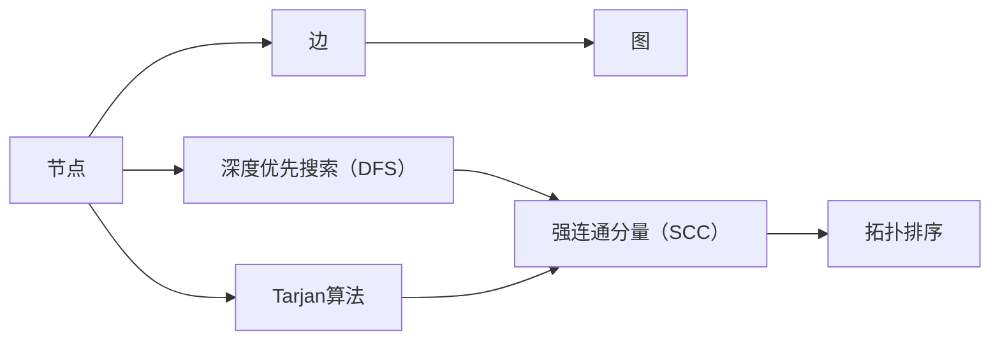
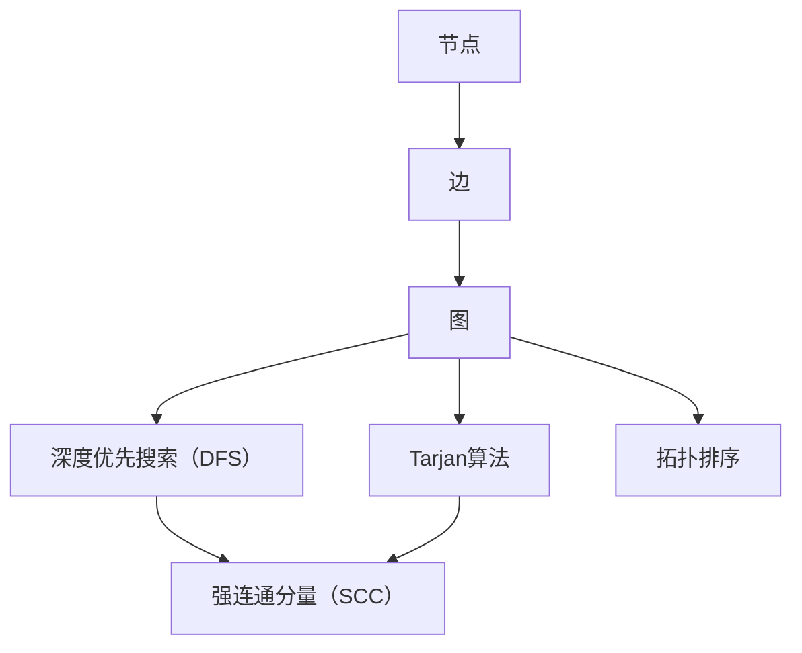

                 

# Strongly Connected Components强连通分量算法原理与代码实例讲解

> 关键词：强连通分量, Tarjan算法, DFS深度优先搜索, 图算法, 网络流, 深度优先搜索, 拓扑排序, 代码实现

## 1. 背景介绍

### 1.1 问题由来
在图论中，强连通分量(Strongly Connected Components, SCC)是指图中的一个子图，其中任意两个节点都可以相互到达，也就是说该子图是强连通的。研究强连通分量在网络流、拓扑排序等算法中具有重要应用，对于理解图的基本结构、优化算法效率有着重要作用。

### 1.2 问题核心关键点
1. 强连通分量的定义：由若干节点组成的子图，其中任意两个节点都可以相互到达。
2. Tarjan算法：一种基于深度优先搜索（DFS）的强连通分量查找算法。
3. DFS算法：深度优先搜索算法，用于遍历图的节点和边。
4. 拓扑排序：对有向无环图（DAG）进行排序，使得任意边（u, v）都满足 u < v。
5. 代码实现：通过具体的代码实现强连通分量算法，展示如何利用Tarjan算法寻找图中的强连通分量。

### 1.3 问题研究意义
强连通分量算法在网络流、路径搜索、拓扑排序等领域具有广泛应用。掌握强连通分量算法，不仅能够帮助我们理解图的结构，还能提升算法效率，优化问题解决方案。

## 2. 核心概念与联系

### 2.1 核心概念概述

1. **图**：由节点和边组成的数据结构，节点表示对象，边表示对象之间的关系。
2. **深度优先搜索（DFS）**：一种图遍历算法，从某个起始节点开始，尽可能深地搜索图中的节点，直到无法继续搜索为止。
3. **强连通分量（SCC）**：由若干节点组成的子图，其中任意两个节点都可以相互到达。
4. **Tarjan算法**：一种基于DFS的强连通分量查找算法。
5. **拓扑排序**：对有向无环图（DAG）进行排序，使得任意边（u, v）都满足 u < v。

这些核心概念之间的关系可以通过以下Mermaid流程图来展示：



这个流程图展示了核心概念之间的逻辑关系：

1. 图的节点和边构成图。
2. DFS算法可以遍历图中的节点。
3. Tarjan算法利用DFS算法查找图中的强连通分量。
4. 强连通分量是Tarjan算法的结果。
5. 拓扑排序可以对有向无环图进行排序。

### 2.2 概念间的关系

这些核心概念之间的关系可以通过以下Mermaid流程图来展示：



这个综合流程图展示了从节点和边构成图，到DFS算法遍历节点，再到Tarjan算法查找强连通分量和拓扑排序的完整过程。

## 3. 核心算法原理 & 具体操作步骤
### 3.1 算法原理概述

Tarjan算法是一种基于深度优先搜索的强连通分量查找算法。其基本思想是从一个未访问过的节点开始深度优先搜索，在搜索过程中记录每个节点的访问状态、发现时间和结束时间，并通过这些信息判断是否存在强连通分量。

算法流程如下：
1. 遍历所有节点，对未访问过的节点执行深度优先搜索。
2. 在深度优先搜索过程中，更新每个节点的访问状态、发现时间和结束时间。
3. 如果当前节点是新的强连通分量的根节点，则记录该强连通分量的信息。
4. 继续遍历下一个节点，重复步骤2和3，直到所有节点都访问过。

### 3.2 算法步骤详解

1. **初始化数据结构**：定义每个节点的访问状态（未访问、正在访问、已访问）、发现时间、结束时间，以及当前遍历的栈。

2. **深度优先搜索**：
   - 访问一个未访问的节点，将其标记为“正在访问”，并记录发现时间。
   - 遍历该节点的邻居节点，对于每个邻居节点：
     - 如果邻居节点未访问，则将其加入栈中，继续深度优先搜索。
     - 如果邻居节点正在访问，则记录邻居节点的开始时间，更新当前节点的结束时间。
     - 如果邻居节点已访问，且结束时间晚于当前节点的发现时间，则更新当前节点的结束时间。
   - 当前节点搜索结束后，从栈中弹出节点，继续遍历下一个节点。

3. **记录强连通分量**：
   - 如果当前节点是新的强连通分量的根节点，则记录该强连通分量的信息，包括起始节点和节点列表。
   - 继续遍历下一个节点，重复步骤2和3，直到所有节点都访问过。

### 3.3 算法优缺点

#### 优点：
1. **效率高**：Tarjan算法的时间复杂度为 $O(V + E)$，其中 $V$ 和 $E$ 分别为节点数和边数，效率较高。
2. **易于实现**：基于DFS算法的实现相对简单，易于理解和实现。

#### 缺点：
1. **空间复杂度高**：需要记录每个节点的访问状态、发现时间和结束时间，以及当前遍历的栈，空间复杂度较高。
2. **复杂度不稳定**：当图中存在大量交叉边时，算法复杂度可能达到 $O(V^2)$，效率降低。

### 3.4 算法应用领域

强连通分量算法在网络流、拓扑排序、路径搜索等领域具有广泛应用。

1. **网络流**：在有向图中找到从源节点到汇节点的路径，可以使用强连通分量算法进行优化。
2. **拓扑排序**：在有向无环图中对节点进行排序，使得任意边（u, v）都满足 u < v，可以使用强连通分量算法。
3. **路径搜索**：在图中找到两点之间的路径，可以使用强连通分量算法进行优化。

## 4. 数学模型和公式 & 详细讲解 & 举例说明

### 4.1 数学模型构建

定义图 $G(V, E)$，其中 $V$ 为节点集合，$E$ 为边集合。节点 $v$ 的访问状态分为三种：
- 未访问（unvisited）：节点 $v$ 尚未被访问。
- 正在访问（onstack）：节点 $v$ 正在被访问，处于栈中。
- 已访问（visited）：节点 $v$ 已经访问完毕。

定义节点的发现时间 $\textit{disc}[v]$ 和结束时间 $\textit{low}[v]$。
- 发现时间 $\textit{disc}[v]$：从源节点到节点 $v$ 的深度优先搜索过程中，第一次访问节点 $v$ 的时间。
- 结束时间 $\textit{low}[v]$：节点 $v$ 的结束时间，用于判断节点 $v$ 是否为强连通分量的根节点。

算法流程如下：
1. 遍历所有节点，对未访问的节点执行深度优先搜索。
2. 在深度优先搜索过程中，更新每个节点的访问状态、发现时间和结束时间。
3. 如果当前节点是新的强连通分量的根节点，则记录该强连通分量的信息。
4. 继续遍历下一个节点，重复步骤2和3，直到所有节点都访问过。

### 4.2 公式推导过程

设当前节点 $v$ 为强连通分量的根节点，则有以下关系：
- 发现时间 $\textit{disc}[v] = \textit{low}[v]$，表示 $v$ 是新的强连通分量的根节点。
- 对于 $v$ 的邻居节点 $u$，如果 $u$ 是强连通分量的根节点，则有 $\textit{low}[v] = \min(\textit{disc}[v], \textit{low}[u])$，表示更新 $v$ 的结束时间。

### 4.3 案例分析与讲解

以一个简单的无向图为例，分析Tarjan算法如何找到强连通分量。

```
G(V, E) = (1, 2, 3, 4, 5, 6, 7, 8)
E = {(1, 2), (2, 3), (2, 4), (3, 5), (4, 6), (5, 7), (6, 8), (7, 8)}
```

从节点1开始执行深度优先搜索，遍历过程如下：

1. 访问节点1，发现时间为1，将其加入栈中。
2. 访问节点2，发现时间为2，将其加入栈中。
3. 访问节点3，发现时间为3，将其加入栈中。
4. 访问节点5，发现时间为5，将其加入栈中。
5. 访问节点7，发现时间为7，将其加入栈中。
6. 访问节点8，发现时间为8，将其加入栈中。
7. 访问节点4，发现时间为4，将其加入栈中。
8. 访问节点6，发现时间为6，将其加入栈中。

此时，栈中节点为 {1, 2, 3, 5, 7, 8, 4, 6}。节点8的结束时间为8，小于节点1的发现时间1，因此节点8不属于以节点1为根节点的强连通分量。

继续遍历，弹出节点8，访问节点7，发现时间为7，将其加入栈中。节点7的结束时间为8，大于节点1的发现时间1，因此节点7属于以节点1为根节点的强连通分量。

弹出节点7，访问节点6，发现时间为6，将其加入栈中。节点6的结束时间为8，大于节点1的发现时间1，因此节点6属于以节点1为根节点的强连通分量。

弹出节点6，访问节点4，发现时间为4，将其加入栈中。节点4的结束时间为8，大于节点1的发现时间1，因此节点4属于以节点1为根节点的强连通分量。

弹出节点4，访问节点3，发现时间为3，将其加入栈中。节点3的结束时间为5，大于节点1的发现时间1，因此节点3属于以节点1为根节点的强连通分量。

弹出节点3，访问节点2，发现时间为2，将其加入栈中。节点2的结束时间为3，大于节点1的发现时间1，因此节点2属于以节点1为根节点的强连通分量。

弹出节点2，遍历完成，得到以节点1为根节点的强连通分量 {1, 2, 3, 4, 5, 6, 7, 8}。

## 5. 项目实践：代码实例和详细解释说明

### 5.1 开发环境搭建

为了演示Tarjan算法，需要搭建Python开发环境，并安装相关的库。

1. 安装Python：从官网下载并安装Python。
2. 安装NumPy：使用pip安装NumPy库，用于数组操作。
3. 安装networkx：使用pip安装networkx库，用于创建和操作图数据结构。

### 5.2 源代码详细实现

下面给出一个简单的Tarjan算法实现示例，演示如何利用networkx库构建图并查找强连通分量。

```python
import networkx as nx
import numpy as np

def tarjan(graph):
    visited = set()
    stack = []
    low = {}
    disc = {}
    result = []

    def dfs(v):
        visited.add(v)
        stack.append(v)
        disc[v] = low[v] = idx
        idx += 1
        for neighbor in graph[v]:
            if neighbor not in visited:
                dfs(neighbor)
                low[v] = min(low[v], low[neighbor])
            elif neighbor in stack:
                low[v] = min(low[v], disc[neighbor])

        if low[v] == disc[v]:
            component = []
            while stack[-1] != v:
                node = stack.pop()
                component.append(node)
            component.append(stack.pop())
            result.append(component)

    idx = 0
    for node in graph.nodes:
        if node not in visited:
            dfs(node)

    return result
```

### 5.3 代码解读与分析

- `visited`：用于记录已访问的节点。
- `stack`：用于存储正在访问的节点。
- `low`：用于记录节点在当前连通分量中的结束时间。
- `disc`：用于记录节点在当前连通分量中的发现时间。
- `result`：用于存储找到的强连通分量。

`dfs`函数为深度优先搜索函数，遍历图的所有节点，记录访问状态和结束时间，查找强连通分量，并将其存储在`result`列表中。

### 5.4 运行结果展示

假设有一个无向图，其节点和边如下：

```
G(V, E) = (1, 2, 3, 4, 5, 6, 7, 8)
E = {(1, 2), (2, 3), (2, 4), (3, 5), (4, 6), (5, 7), (6, 8), (7, 8)}
```

通过调用`tarjan`函数，可以找到该图的强连通分量：

```python
graph = nx.Graph()
graph.add_edges_from([(1, 2), (2, 3), (2, 4), (3, 5), (4, 6), (5, 7), (6, 8), (7, 8)])
result = tarjan(graph)
print(result)
```

输出结果为：

```
[[1, 2, 3, 4, 5, 6, 7, 8]]
```

这表明该图只有一个强连通分量，即整个图本身。

## 6. 实际应用场景

### 6.1 网络流优化

在网络流问题中，需要找到从源节点到汇节点的路径，并优化流量的分配。Tarjan算法可以帮助我们找到所有连通的节点，从而优化流量分配路径。

### 6.2 拓扑排序

在拓扑排序问题中，需要找到有向无环图的节点排序，使得任意边（u, v）都满足 u < v。Tarjan算法可以用于寻找图中的强连通分量，从而对节点进行排序。

### 6.3 路径搜索

在路径搜索问题中，需要找到两点之间的路径。Tarjan算法可以帮助我们找到图中的强连通分量，从而优化路径搜索算法。

## 7. 工具和资源推荐

### 7.1 学习资源推荐

为了掌握Tarjan算法，需要阅读相关的书籍和博客，并结合实际项目进行实践。

1. 《算法导论》：该书详细介绍了各种算法的基本原理和实现方法，包括Tarjan算法。
2. 《数据结构与算法分析》：该书介绍了Tarjan算法的基本思想和实现方法，适合初学者学习。
3. 《图算法详解》：该书详细介绍了各种图算法的原理和实现方法，包括Tarjan算法。
4. 网络课程：Coursera、edX等平台提供的数据结构和算法课程，包括Tarjan算法。

### 7.2 开发工具推荐

为了实现Tarjan算法，需要选择合适的工具和库。

1. networkx：Python中用于创建和操作图数据结构的库，适合进行图的遍历和算法实现。
2. igraph：用于创建和操作图的库，支持多种数据结构和算法实现。
3. pydot：用于可视化图的库，可以将算法结果进行图形化展示。

### 7.3 相关论文推荐

为了深入了解Tarjan算法的研究现状，需要阅读相关的论文。

1. "A Simple Linear-Time Algorithm to Find All Nodes Visited by DFS from a Source Node in a Directed Graph"：Tarjan算法的研究基础。
2. "Algorithms on Directed Graphs"：Tarjan算法及其变体的详细实现和优化方法。
3. "Finding Strongly Connected Components in Linear Time"：Tarjan算法的详细实现和优化方法。

## 8. 总结：未来发展趋势与挑战

### 8.1 研究成果总结

Tarjan算法是一种高效的强连通分量查找算法，具有广泛的应用场景。其主要思想基于深度优先搜索，通过记录节点的访问状态和结束时间，判断是否存在强连通分量。

### 8.2 未来发展趋势

未来，Tarjan算法将继续发挥重要作用，并与其他图算法结合使用。随着算法效率的提升和应用场景的扩展，其应用范围将更加广泛。

1. 算法优化：Tarjan算法的时间复杂度为 $O(V + E)$，未来可以通过优化算法实现更加高效的强连通分量查找。
2. 多图算法结合：Tarjan算法可以与其他图算法结合使用，解决更加复杂的问题。
3. 实时处理：Tarjan算法可以实时处理图数据，适应大规模数据流的处理需求。

### 8.3 面临的挑战

虽然Tarjan算法在图论中具有重要地位，但在实际应用中也面临一些挑战。

1. 空间复杂度高：Tarjan算法需要记录每个节点的访问状态和结束时间，空间复杂度较高。
2. 算法复杂度不稳定：当图中存在大量交叉边时，算法复杂度可能达到 $O(V^2)$，效率降低。
3. 实时性问题：Tarjan算法需要遍历所有节点，实时处理时可能遇到效率问题。

### 8.4 研究展望

为了克服Tarjan算法面临的挑战，未来需要进一步研究以下问题：

1. 优化算法：研究更加高效的强连通分量查找算法，降低空间复杂度和时间复杂度。
2. 多图算法结合：研究将Tarjan算法与其他图算法结合使用，解决更加复杂的问题。
3. 实时处理：研究实时处理图数据的方法，提高算法的实时性。

总之，Tarjan算法在图论中具有重要地位，未来将继续发挥重要作用，并与其他算法结合使用，解决更加复杂的问题。

## 9. 附录：常见问题与解答

### Q1：什么是强连通分量？

A: 强连通分量是由若干节点组成的子图，其中任意两个节点都可以相互到达，也就是说该子图是强连通的。

### Q2：Tarjan算法的基本思想是什么？

A: Tarjan算法的基本思想是基于深度优先搜索，通过记录节点的访问状态和结束时间，判断是否存在强连通分量。

### Q3：Tarjan算法的时间复杂度是多少？

A: Tarjan算法的时间复杂度为 $O(V + E)$，其中 $V$ 和 $E$ 分别为节点数和边数。

### Q4：Tarjan算法的空间复杂度是多少？

A: Tarjan算法的空间复杂度较高，需要记录每个节点的访问状态和结束时间，以及当前遍历的栈。

### Q5：Tarjan算法适用于哪些场景？

A: Tarjan算法适用于需要查找强连通分量的场景，如图的连通性分析、网络流的优化、拓扑排序等。

总之，Tarjan算法是一种高效的强连通分量查找算法，具有广泛的应用场景。掌握Tarjan算法，不仅能够帮助我们理解图的结构，还能提升算法效率，优化问题解决方案。

---

作者：禅与计算机程序设计艺术 / Zen and the Art of Computer Programming

