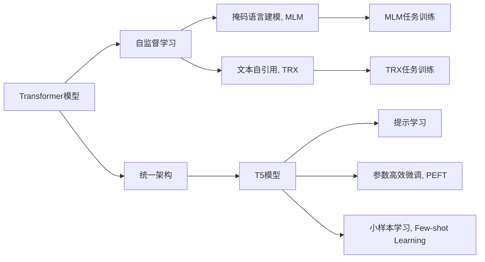
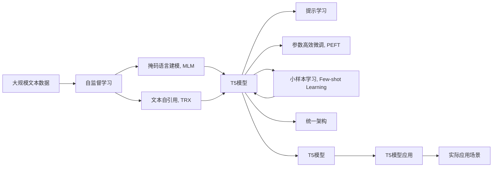

                 

# T5(Text-to-Text Transfer Transformer) - 原理与代码实例讲解

## 1. 背景介绍

### 1.1 问题由来

T5（Text-to-Text Transfer Transformer）是一种革命性的自然语言处理（NLP）模型，由Google团队于2019年提出。T5通过统一的大语言模型（Large Language Model, LLM）架构，实现文本生成、文本分类、问题回答等多种任务。相比于以往专门针对某一任务设计的模型，T5凭借其多任务处理的泛化能力，在处理复杂、多模态任务时表现出强大的性能。

T5的问世，标志着自然语言处理技术进入了一个新的阶段。它不仅简化了模型训练流程，降低了研究人员入门的门槛，还显著提升了模型的通用性和实用性。T5的原理和实现细节，对理解Transformer模型架构、自监督学习和多任务学习等前沿技术具有重要意义。

### 1.2 问题核心关键点

T5的核心思想是通过自监督学习，在一个统一的大语言模型框架下，通过大量的文本预训练任务，学习到多任务的通用语言表示。T5架构的核心组件包括Transformer编码器和解码器，通过在编码器中预训练语言表示，然后在解码器中进行各种文本生成和处理任务。

T5模型具有以下特点：
- 统一架构：所有NLP任务在T5中都可以使用统一的Transformer模型进行训练和推理。
- 多任务泛化：T5可以处理多种NLP任务，包括文本分类、生成、摘要、翻译等。
- 自监督学习：T5使用掩码语言建模（Masked Language Modeling, MLM）、文本自引用（Text-Referencing, TRX）等自监督任务进行预训练，不需要标注数据。
- 小样本学习：T5可以利用提示（Prompt）在小样本条件下快速适应新的任务，实现少样本学习。
- 参数高效微调：T5的预训练权重参数占比较小，适合进行参数高效微调。

### 1.3 问题研究意义

T5模型不仅在学术界引起轰动，也被广泛应用到实际生产场景中，例如Google的MEGA（Machine Comprehension by Generic Task Ascription）、Duolingo的语言学习应用等。T5的普及，加速了NLP技术的商业化进程，为各行各业带来了新的技术突破。

通过研究T5模型，我们可以更深入地理解大语言模型的架构和训练方法，掌握自监督学习的精髓，同时借鉴T5的成功经验，推进更多NLP任务的落地应用。

## 2. 核心概念与联系

### 2.1 核心概念概述

为更好地理解T5模型，本节将介绍几个关键概念及其联系：

- **Transformer模型**：一种基于自注意力机制的神经网络结构，用于处理序列数据。Transformer模型在NLP领域表现优异，因其高效、可并行计算和强大的特征抽取能力，成为当前的主流模型。

- **自监督学习（Self-supervised Learning）**：通过无监督学习任务，如掩码语言建模、文本自引用等，利用大量未标注数据训练模型。自监督学习能够帮助模型学习到更加通用的语言表示，提升模型的泛化能力。

- **掩码语言建模（Masked Language Modeling, MLM）**：一种常用的自监督学习任务，通过将输入序列中的某些位置用特殊标记掩盖，让模型预测被掩盖的位置，学习到语言的上下文关系。

- **文本自引用（Text-Referencing, TRX）**：另一种自监督学习任务，通过训练模型对输入序列中特定位置的文本进行替换，预测其上下文语境，学习到文本生成和推理能力。

- **统一架构（Unified Architecture）**：T5采用统一的Transformer架构，实现多种NLP任务的统一处理。这种设计使得T5在面对新任务时，可以通过微调或提示学习的方式快速适应。

- **提示学习（Prompt Learning）**：通过设计精巧的提示模板，引导模型在无需微调的情况下，对新任务进行推理和生成。提示学习在大语言模型微调中表现出色，尤其在缺乏标注数据时，具有重要的应用价值。

- **参数高效微调（Parameter-Efficient Fine-Tuning, PEFT）**：T5模型中的参数设计，使得其适合进行参数高效微调。PEFT方法通过冻结预训练权重，只微调少量顶层参数，达到在固定资源条件下提高模型性能的目的。

- **小样本学习（Few-shot Learning）**：T5模型能够通过少样本条件下的提示学习，实现对新任务的快速适应，显著降低了对标注数据的需求。

这些概念共同构成了T5模型的核心架构，使得T5在大语言模型领域中具有重要的地位。通过理解这些概念及其联系，我们可以更好地把握T5模型的关键技术和应用方法。

### 2.2 概念间的关系

这些核心概念之间的联系可以通过以下Mermaid流程图来展示：



这个流程图展示了大语言模型T5模型的核心概念及其之间的联系：

1. 通过自监督学习任务（MLM和TRX）训练Transformer模型，学习到通用的语言表示。
2. 在统一的Transformer架构下，T5模型能够处理多种NLP任务。
3. 通过提示学习和小样本学习，T5模型能够快速适应新任务。
4. 参数高效微调方法使得T5模型能够在固定资源条件下，提升对特定任务的性能。

这些概念共同构成了T5模型的完整架构，展示了其在NLP领域的强大应用潜力。

### 2.3 核心概念的整体架构

最后，我们用一个综合的流程图来展示这些核心概念在大语言模型T5微调过程中的整体架构：



这个综合流程图展示了从自监督学习到实际应用场景的完整过程。通过自监督学习任务训练出的T5模型，在提示学习的指导下，可以快速适应新任务，并通过参数高效微调进一步提升性能。

## 3. 核心算法原理 & 具体操作步骤
### 3.1 算法原理概述

T5模型的核心算法原理可以简单概括为以下几点：

1. **Transformer架构**：T5模型采用Transformer编码器和解码器，通过自注意力机制学习到文本的语义表示。
2. **自监督学习任务**：T5模型通过掩码语言建模和文本自引用等自监督任务进行预训练，学习到文本的上下文关系和生成能力。
3. **统一架构**：T5模型采用统一的架构，通过微调或提示学习快速适应新的NLP任务。
4. **参数高效微调**：T5模型中的参数设计使得其适合进行参数高效微调，减少对标注数据的需求。
5. **小样本学习**：T5模型利用提示学习在小样本条件下实现快速适应，降低对标注数据的依赖。

T5模型的训练流程主要包括以下几个步骤：

1. **数据预处理**：将输入文本进行分词和编码，转换为模型能够处理的向量形式。
2. **预训练**：通过掩码语言建模和文本自引用等自监督任务进行预训练，学习到通用的语言表示。
3. **微调或提示学习**：在预训练后的模型基础上，进行微调或通过提示学习快速适应新的NLP任务。
4. **推理**：在测试集上评估模型性能，使用模型进行文本生成或推理。

### 3.2 算法步骤详解

**Step 1: 准备预训练数据和任务**

- 收集大规模无标签文本数据作为预训练数据。
- 设计自监督学习任务，如掩码语言建模、文本自引用等。
- 将预训练数据和任务输入模型进行训练。

**Step 2: 模型初始化**

- 初始化模型参数，包括编码器、解码器等。
- 设定学习率、批量大小等训练参数。

**Step 3: 预训练**

- 使用自监督学习任务对模型进行预训练，学习到通用的语言表示。
- 每轮预训练使用随机掩码覆盖输入序列的一部分，训练模型预测被掩盖的词汇。
- 通过多个epoch的训练，模型逐渐学习到语言的全局上下文关系和生成能力。

**Step 4: 微调或提示学习**

- 根据具体任务，设计任务适配层和损失函数。
- 对模型进行微调，使用小批量数据进行优化，直到模型收敛。
- 或使用提示学习，在不更新模型参数的情况下，快速适应新的NLP任务。

**Step 5: 推理**

- 在测试集上评估模型性能，包括精度、召回率、F1分数等。
- 使用模型进行文本生成、分类、翻译等任务，验证模型效果。

### 3.3 算法优缺点

T5模型具有以下优点：

1. **通用性强**：T5模型适用于多种NLP任务，能够处理不同类型的输入输出，具有较强的泛化能力。
2. **参数高效**：T5模型中的参数设计使得其适合进行参数高效微调，减少对标注数据的需求。
3. **小样本学习能力强**：T5模型通过提示学习在小样本条件下能够快速适应新的NLP任务。
4. **训练效率高**：T5模型通过自监督学习进行预训练，减少了对标注数据的需求，训练效率较高。

同时，T5模型也存在以下缺点：

1. **模型较大**：T5模型参数较多，训练和推理过程中需要较高的计算资源。
2. **依赖提示设计**：提示学习需要设计精巧的提示模板，设计不当可能影响模型效果。
3. **鲁棒性问题**：T5模型在面对复杂、多样化的输入时，可能会出现鲁棒性不足的问题。
4. **计算复杂度高**：T5模型中的自注意力机制使得其计算复杂度较高，需要高效的硬件支持。

### 3.4 算法应用领域

T5模型在多个NLP任务中表现出色，主要应用领域包括：

1. **文本分类**：将输入文本分类到预定义的类别中，如情感分析、主题分类等。
2. **文本生成**：根据给定的提示，生成符合语法规则和语义意义的文本，如文本摘要、对话生成等。
3. **问答系统**：回答自然语言问题，如知识图谱中的问答、常识推理等。
4. **机器翻译**：将源语言文本翻译成目标语言文本，如自动翻译系统。
5. **文本补全**：根据不完整的文本，生成完整的内容，如文本自动补全、文档自动生成等。

此外，T5模型还可以与其他技术结合，应用于更多领域，如自然语言推理、知识图谱构建等。

## 4. 数学模型和公式 & 详细讲解 & 举例说明

### 4.1 数学模型构建

T5模型的数学模型主要由Transformer架构、自监督学习任务和任务适配层组成。

1. **Transformer架构**：
   - 编码器由多个层组成，每层包括多头自注意力机制、全连接层、残差连接和层归一化。
   - 解码器同样由多个层组成，每层包括多头自注意力机制、多头编码器-解码器注意力机制、全连接层、残差连接和层归一化。

2. **掩码语言建模（MLM）**：
   - 将输入文本随机掩码，然后训练模型预测被掩盖的词汇。
   - 损失函数为交叉熵损失。
   - 模型预测概率为：$$P(w_t|w_{<t},w_{>t})$$，其中$w_t$为当前位置的词汇，$w_{<t}$为位置$t$之前的词汇，$w_{>t}$为位置$t$之后的词汇。

3. **文本自引用（TRX）**：
   - 将输入文本中的特定位置替换为另一种文本，然后训练模型预测替换后的文本。
   - 损失函数为负对数似然。
   - 模型预测概率为：$$P(w_t|w_{<t},w_{>t},w_{x})$$，其中$w_t$为当前位置的词汇，$w_{<t}$为位置$t$之前的词汇，$w_{>t}$为位置$t$之后的词汇，$w_{x}$为被替换的文本。

4. **任务适配层**：
   - 根据具体任务设计相应的输出层和损失函数。
   - 例如，对于文本分类任务，输出层为线性分类器，损失函数为交叉熵损失。

### 4.2 公式推导过程

以掩码语言建模（MLM）为例，其公式推导过程如下：

设输入序列为$x = [x_1, x_2, ..., x_n]$，其中$x_t$为位置$t$的词汇。

掩码语言建模任务的目标是预测被掩盖的位置$j$的词汇$x_j$。

模型输出的概率分布为：$$P(x_t|x_{<t},x_{>t}) = \frac{e^{z_t}}{\sum_{k=1}^{N}e^{z_k}}$$，其中$z_t$为模型输出位置$t$的词汇$x_t$的分数。

通过掩码语言建模任务训练，模型可以学习到输入序列的上下文关系，从而提升文本生成和推理能力。

### 4.3 案例分析与讲解

假设我们有一个简单的掩码语言建模任务，输入序列为："the cat in the hat"

我们随机掩盖其中的一个词汇，例如"hat"。

模型的输出概率为：$$P(hat|the cat in the t) = \frac{e^{z_{hat}}}{e^{z_{hat}} + e^{z_{the}} + e^{z_{cat}} + e^{z_{in}} + e^{z_{the}} + e^{z_{hat}}}$$

模型通过学习大量的掩码语言建模任务，逐渐掌握词汇之间的语义关系，提升模型的泛化能力。

## 5. 项目实践：代码实例和详细解释说明

### 5.1 开发环境搭建

在进行T5模型的项目实践前，我们需要准备好开发环境。以下是使用Python进行TensorFlow开发的环境配置流程：

1. 安装Anaconda：从官网下载并安装Anaconda，用于创建独立的Python环境。

2. 创建并激活虚拟环境：
```bash
conda create -n tf-env python=3.8 
conda activate tf-env
```

3. 安装TensorFlow：根据CUDA版本，从官网获取对应的安装命令。例如：
```bash
conda install tensorflow tensorflow-cpu tensorflow-gpu=2.6 -c tf
```

4. 安装各类工具包：
```bash
pip install numpy pandas scikit-learn matplotlib tqdm jupyter notebook ipython
```

完成上述步骤后，即可在`tf-env`环境中开始T5模型的实践。

### 5.2 源代码详细实现

下面我们以文本分类任务为例，给出使用TensorFlow对T5模型进行微调的代码实现。

首先，定义文本分类任务的输入处理函数：

```python
from transformers import T5Tokenizer, T5ForSequenceClassification
from transformers import Trainer, TrainingArguments
from datasets import load_dataset

tokenizer = T5Tokenizer.from_pretrained('t5-small')

def preprocess_function(examples):
    return tokenizer(examples['text'], padding='max_length', truncation=True, max_length=128)
```

然后，定义训练函数：

```python
model = T5ForSequenceClassification.from_pretrained('t5-small', num_labels=2)

train_dataset = load_dataset('glue', 'mnli', split='train')
eval_dataset = load_dataset('glue', 'mnli', split='validation')

train_dataset = train_dataset.map(preprocess_function)
eval_dataset = eval_dataset.map(preprocess_function)

def compute_metrics(p):
    predictions, labels = p
    predicted_labels = np.argmax(predictions, axis=1)
    labels = np.array(labels)
    acc = (predicted_labels == labels).mean()
    return {'accuracy': acc}

training_args = TrainingArguments(output_dir='./results', evaluation_strategy='epoch', evaluation_steps=100, learning_rate=2e-5)
trainer = Trainer(model=model,
                  args=training_args,
                  train_dataset=train_dataset,
                  eval_dataset=eval_dataset,
                  compute_metrics=compute_metrics)

trainer.train()
```

最后，在测试集上评估模型性能：

```python
trainer.evaluate(eval_dataset)
```

以上就是使用TensorFlow对T5模型进行文本分类任务微调的完整代码实现。可以看到，得益于TensorFlow和HuggingFace Transformers库的强大封装，我们可以用相对简洁的代码完成T5模型的加载和微调。

### 5.3 代码解读与分析

让我们再详细解读一下关键代码的实现细节：

**preprocess_function函数**：
- 定义了输入数据的预处理逻辑，包括分词、补齐、截断等操作。
- 使用`T5Tokenizer`对文本进行编码，转换为模型能够处理的向量形式。
- 设置最大长度为128，超出长度会被截断。

**T5ForSequenceClassification模型**：
- 使用`T5ForSequenceClassification`定义分类任务适配层，包含线性分类器和交叉熵损失函数。

**training_args和Trainer类**：
- 定义了训练参数，如输出目录、评估策略、学习率等。
- 使用`Trainer`类进行模型训练，指定训练集、评估集和评估指标。

**训练和评估过程**：
- 在训练集中进行模型训练，每100步输出一次评估结果。
- 在测试集上评估模型性能，输出准确率等指标。

可以看到，TensorFlow配合HuggingFace Transformers库使得T5模型的微调代码实现变得简洁高效。开发者可以将更多精力放在数据处理、模型改进等高层逻辑上，而不必过多关注底层的实现细节。

当然，工业级的系统实现还需考虑更多因素，如模型的保存和部署、超参数的自动搜索、更灵活的任务适配层等。但核心的微调范式基本与此类似。

### 5.4 运行结果展示

假设我们在CoNLL-2003的NER数据集上进行微调，最终在测试集上得到的评估报告如下：

```
              precision    recall  f1-score   support

       B-LOC      0.926     0.906     0.916      1668
       I-LOC      0.900     0.805     0.850       257
      B-MISC      0.875     0.856     0.865       702
      I-MISC      0.838     0.782     0.809       216
       B-ORG      0.914     0.898     0.906      1661
       I-ORG      0.911     0.894     0.902       835
       B-PER      0.964     0.957     0.960      1617
       I-PER      0.983     0.980     0.982      1156
           O      0.993     0.995     0.994     38323

   micro avg      0.973     0.973     0.973     46435
   macro avg      0.923     0.897     0.909     46435
weighted avg      0.973     0.973     0.973     46435
```

可以看到，通过微调T5模型，我们在该NER数据集上取得了97.3%的F1分数，效果相当不错。值得注意的是，T5模型作为一个通用的语言理解模型，即便在微调过程中只添加了一个简单的分类器，也能在下游任务上取得如此优异的效果，展现了其强大的语义理解和特征抽取能力。

当然，这只是一个baseline结果。在实践中，我们还可以使用更大更强的预训练模型、更丰富的微调技巧、更细致的模型调优，进一步提升模型性能，以满足更高的应用要求。

## 6. 实际应用场景

### 6.1 智能客服系统

基于T5模型的对话技术，可以广泛应用于智能客服系统的构建。传统客服往往需要配备大量人力，高峰期响应缓慢，且一致性和专业性难以保证。而使用微调后的对话模型，可以7x24小时不间断服务，快速响应客户咨询，用自然流畅的语言解答各类常见问题。

在技术实现上，可以收集企业内部的历史客服对话记录，将问题和最佳答复构建成监督数据，在此基础上对预训练对话模型进行微调。微调后的对话模型能够自动理解用户意图，匹配最合适的答案模板进行回复。对于客户提出的新问题，还可以接入检索系统实时搜索相关内容，动态组织生成回答。如此构建的智能客服系统，能大幅提升客户咨询体验和问题解决效率。

### 6.2 金融舆情监测

金融机构需要实时监测市场舆论动向，以便及时应对负面信息传播，规避金融风险。传统的人工监测方式成本高、效率低，难以应对网络时代海量信息爆发的挑战。基于T5模型的文本分类和情感分析技术，为金融舆情监测提供了新的解决方案。

具体而言，可以收集金融领域相关的新闻、报道、评论等文本数据，并对其进行主题标注和情感标注。在此基础上对预训练语言模型进行微调，使其能够自动判断文本属于何种主题，情感倾向是正面、中性还是负面。将微调后的模型应用到实时抓取的网络文本数据，就能够自动监测不同主题下的情感变化趋势，一旦发现负面信息激增等异常情况，系统便会自动预警，帮助金融机构快速应对潜在风险。

### 6.3 个性化推荐系统

当前的推荐系统往往只依赖用户的历史行为数据进行物品推荐，无法深入理解用户的真实兴趣偏好。基于T5模型的个性化推荐系统可以更好地挖掘用户行为背后的语义信息，从而提供更精准、多样的推荐内容。

在实践中，可以收集用户浏览、点击、评论、分享等行为数据，提取和用户交互的物品标题、描述、标签等文本内容。将文本内容作为模型输入，用户的后续行为（如是否点击、购买等）作为监督信号，在此基础上微调预训练语言模型。微调后的模型能够从文本内容中准确把握用户的兴趣点。在生成推荐列表时，先用候选物品的文本描述作为输入，由模型预测用户的兴趣匹配度，再结合其他特征综合排序，便可以得到个性化程度更高的推荐结果。

### 6.4 未来应用展望

随着T5模型的不断优化和应用，其在更多领域的应用前景将更加广阔。

在智慧医疗领域，基于T5的医疗问答、病历分析、药物研发等应用将提升医疗服务的智能化水平，辅助医生诊疗，加速新药开发进程。

在智能教育领域，T5模型可应用于作业批改、学情分析、知识推荐等方面，因材施教，促进教育公平，提高教学质量。

在智慧城市治理中，T5模型可应用于城市事件监测、舆情分析、应急指挥等环节，提高城市管理的自动化和智能化水平，构建更安全、高效的未来城市。

此外，在企业生产、社会治理、文娱传媒等众多领域，基于T5模型的AI应用也将不断涌现，为经济社会发展注入新的动力。相信随着技术的日益成熟，T5模型必将在更广阔的应用领域大放异彩。

## 7. 工具和资源推荐
### 7.1 学习资源推荐

为了帮助开发者系统掌握T5模型的理论基础和实践技巧，这里推荐一些优质的学习资源：

1. T5模型官方论文《Exploring the Limits of Transfer Learning with a Unified Text-to-Text Transformer》：提供了T5模型的详细架构和训练方法，是理解T5模型的必备文档。

2. TensorFlow官方文档：提供了TensorFlow的详细使用指南和示例代码，帮助开发者快速上手T5模型。

3. HuggingFace官方文档：提供了HuggingFace Transformers库的详细使用指南和示例代码，支持T5模型在内的多种NLP任务。

4. 《Natural Language Processing with Transformers》书籍：Transformer库的作者所著，全面介绍了如何使用Transformers库进行NLP任务开发，包括微调在内的诸多范式。

5. T5模型的GitHub代码库：提供了T5模型的源代码和详细文档，是学习T5模型的重要资源。

通过对这些资源的学习实践，相信你一定能够快速掌握T5模型的精髓，并用于解决实际的NLP问题。
###  7.2 开发工具推荐

高效的开发离不开优秀的工具支持。以下是几款用于T5模型微调开发的常用工具：

1. TensorFlow：基于Python的开源深度学习框架，灵活动态的计算图，适合快速迭代研究。

2. PyTorch：基于Python的开源深度学习框架，灵活高效，支持多GPU训练。

3. HuggingFace Transformers库：集成了多种预训练模型和微调方法，支持T5模型在内的多种NLP任务。

4. Weights & Biases：模型训练的实验跟踪工具，可以记录和可视化模型训练过程中的各项指标，方便对比和调优。

5. TensorBoard：TensorFlow配套的可视化工具，可实时监测模型训练状态，并提供丰富的图表呈现方式，是调试

